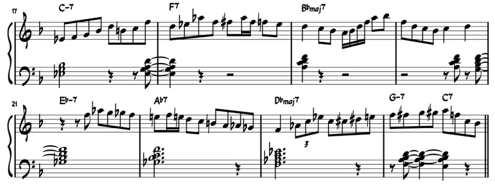

# 爵士乐（爵士钢琴）

新知识的练习routine：

1. 先学片段对应的乐理（锻炼脑）

2. 再记片段的构成音（锻炼脑）

3. 再用手弹+练习这些构成音（把大脑中的知识转换成手感+指法），并且手在弹的时候，也要想着音对应的术语与符号（以连接手感和大脑中的符号）

4. 再看乐谱上对应的符号（以增强视奏能力，否则会出现手会弹，但看到乐谱的时候，得想很久才反应出乐谱上写的是什么音，然后才能弹出来）

   1. 为了做到看到乐谱时，马上反应出对应的构成音，可以多去musicpractice做练习。
   2. 然后再根据脑海中的代号，快速让手跟上。
   3. 等上面的流程练熟了，自然就可以省略到“乐谱转换成符号”、“符号转换成手感”的步骤，而是直接“乐谱转换到手感”。

   提醒：建议先把符号对应的按键弹熟，再记忆对应的符号。不然直接记忆符号，容易“空洞”，记不牢。

## 课程（学习路线）

参考：

* [Free Jazz Piano Lessons - Everything You Need to Know](https://www.thejazzpianosite.com/jazz-piano-lessons/)

* https://www.jazzinamerica.org/LessonPlan：学任何爵士课程前，强烈建议先把这系列教程看完。

  24节课（3个等级，每个等级8节课）：介绍爵士乐，感受爵士乐

* Jazz Piano School：
  * 优点：资料很多
  * 缺点：课程的知识量少，但练习量却很大，并且练习的设计不够循序渐进，跨度比较大，硬啃需要花费大量时间才能练完一节课对应的练习题。

* https://jazzedge.academy/blueprints/

* https://www.openstudiojazz.com/?search=&post_type=sfwd-courses&os_search=1&os_instrument=19&os_access_toggle=false

* https://soundofemotions.eu/all-courses-piano/

* [https://simonpurcell.com/practicing/](Practicing Jazz)

* [https://www.jazzpianoonline.com/](JazzPianoOnline)

* JZ网络课堂

* [PianoGroove.com](https://pianogroove.com/)


书籍：

* Mark Levine ：《爵士乐宝典》。PS：推荐用微信读书看，因为能看到其他读者做得笔记，能帮助学习。
* [Jazz Piano Solos Series](https://www.halleonard.com/series/JPS/jazz-piano-solos-series?dt=item#products)：讲解几乎所有Jazz风格。适合填补“Jazz - 音乐风格”领域知识。
* [Keyboard Style Series Series](https://www.halleonard.com/menu/1003/keyboard-style-series?seriesfeature=HLKSS&dt=item#products)：The Hal Leonard Keyboard Style Series provides focused lessons that contain valuable how-to insight, essential playing tips, and beneficial information for all players. Comprehensive treatment is given to each subject, complete with companion audio demonstrating the examples.
* Jazz Play Along Series

### 作用

* 明白应该先学什么
* 然后应该学什么
* 如何把所学的知识运用到实际曲目（actual tunes）中

### Stage

| Stage                    | Voicings                                                     | Harmony & Theory                                             | Improv                                                       | Rhythm                                                       | Repertoire                                                   | Styles                                                       |
| ------------------------ | ------------------------------------------------------------ | ------------------------------------------------------------ | ------------------------------------------------------------ | ------------------------------------------------------------ | ------------------------------------------------------------ | ------------------------------------------------------------ |
| 0. Laying the Foundation | Root Position (2-5-1) 7 th chords<br />All Inversions of (2-5-1) 7 th chords<br />Both hands can play all voicings | All major and minor scales<br />Chord Symbols<br />Bass Notes<br />Intervals in 7 th chords<br />Key Signatures<br />Circle of 4ths |                                                              | Can swing eighth notes in a scale<br />Basic rhythmic patterns | RH Melody<br />LH Bass Notes<br />RH or LH can play chords<br />Can perform at least 1 solo piano tune<br />RH Melody, LH Root Position Chords & Inversions |                                                              |
| 1. Building the Frame    | All rootless voicings in 2-5-1 progressions through every key with both hands.<br/>Voicleading 7th Chord Inversions<br/>Minor Major 7th Chords<br/>Minor 7th b5 Chords | Understanding of Diatonic Harmony Within a key.<br/>Roman Numerals<br/>Mode Names, and modes.<br/>Ability to analyze tunes with roman numerals and Understand improvisation modes.<br/>(5-1) (2-5-1) with 7th chords<br/>Minor Harmony (-7b5 Chords, -maj Chords. 7thb9b13)<br/>Bass Lines | Can improv with chord tones over a single chord or connect them through 5-1 or 2-5-1 progression<br/>Can use basic melodic and rhythmic motifs<br/>Can use modes to connect chord tones<br/>Can solo through simple progressions in a tune<br/>Blues Scale, Major Blues Scale, Full Major Blues Scale | Understanding of contrasting rhythms for improv and comping. Demonstration of better swing feel | Can perform at least 5 solo piano tunes and group tunes from memory<br/>Demonstration of jazz voicings, the swing feel, and improvisation abilities.<br/>Can play minor harmony tunes | Blues - Can play the blues, improvise and play melodies with LH inversions<br/>Medium Swing or slow swing Jazz Standards<br/>Boogie |
| 2. The Inner Guts        |                                                              |                                                              |                                                              |                                                              |                                                              |                                                              |
|                          |                                                              |                                                              |                                                              |                                                              |                                                              |                                                              |

1. 基础：Scales（在12个大调音阶内，左手与右手分别/合并弹奏一个八度与两个八度）、Chords、Arpeggios、Improvisation
2. 中级：Scales、Chords、Arpeggios、Improvisation
3. 进阶：Scales、Chords、Arpeggios、Improvisation

### 练习要点

* 不犯错地慢慢练，比老犯错地快速连好。

  特别注意：就算能够快练了，也要坚持慢练，通过慢练可以更好地感受音符。

  注意：两只手合不起来就慢慢弹，比如每隔几十秒就弹一个音。

* 反复练习，让肌肉形成条件反射。等条件反射形成，弹琴就像走路的时候，不需要思考要如何走路一样。

* 保持耐心，每天坚持连一会比断断续续地长时间练好。练习不是冲刺，而是马拉松。千万不要三天打鱼两天晒网。

* 解决无论练多久，始终都练不好一首曲子的办法：

  * 


Jazz Keys

C, F, Bb, Eb, Ab, Db, and G

## 概述

https://www.jazzstandards.com/compositions-0/icantgetstarted.htm

第一，爵士不等于即兴，即兴是一个独立的课题，melody才是第一步。即兴是爵士的灵魂，但不是爵士的全部。爵士钢琴的第一层意思是，你拿到一首曲子的旋律，如果不给你和声你可以自己配和声上去，如果给你和声你也可以reharmonization（和声重配）去做变化，在节奏律动上让它变得更加swing或者其他的爵士律动，旋律是提前或者延后。最后你能把这段旋律弹成爵士版，比如你可以用钢琴弹一个爵士版的茉莉花，这是第一步，旋律演绎，melody。

第二，comping（伴奏）& walking bass。接上个melody的问题，melody侧重的是右手，comping和walking bass更多是左手的问题，它们会让旋律更加丰满，听起来更像曲子。而且一个乐手的演奏形态会随时发生改变，你可能是独奏，也可能是钢琴和鼓、钢琴和贝斯的二重奏，也有可能是钢琴鼓贝斯的三重奏，也有可能是大乐队BigBand，不同的演奏形态，技术上的选择也会有不同侧重，比如有bass的时候，钢琴手就可以在comping的时候弹一些rootless voicing，而在没有bass的时候，钢琴手可以用walking bass来弥补bass的空间。

第三，voicing（和声排列）。爵士乐里最复杂的问题，也是不同爵士音乐家最具个人特色的地方之一。voicing的技术可以用于solo，也可以用于comping，可以用来表现多变的和声色彩，展现演奏者对和声的理解，也可以把和声最高音连成melody，成为chord melody，变得更加丰富，从而让一首曲子既有律动，又有色彩，同时旋律依然明晰。

上述几点，swing、melody、comping、walking、voicing，个人认为这些是爵士钢琴的基础，而不是一上来就即兴。爵士钢琴比其他乐器要复杂一些，比如爵士小号只能吹单旋律，根本不用考虑walking、comping这些，所以很多这些乐器的练习者往往也都会学点爵士钢琴，来填充知识盲区。至于即兴，即兴是一门语言，多听，带着耳朵听，听完就弹出来，这叫听，而不是一边刷牙一边听的那种听，听完弹出来再分析，分析完了再改，改完了再弹，这叫多说，说多了就变成了自己的语汇。

除此之外还要多唱，因为唱本质上反映的是你自己的内心听觉，唱不会也就弹不会，心里没想法弹出来的东西都会很死板，或者说弹出来的根本不是心之所想，只是机械地堆叠一些音符。我也是在学习爵士钢琴后才意识到了唱歌（至少是哼唱）的重要性。

从感性层面上讲，即兴是一种语言，理性来讲，即兴就是作曲，但是即兴和作曲的区别在于，你作曲可以慢慢来，慢慢构思，即兴是当下就要出来，作曲可以慢慢想我为啥这么搞，即兴很多时候是下意识的，演奏者也不知道，可能是手癖，可能是某种基础练习的改编串联。所以学习即兴本质上也可以说是在学习作曲，只不过这个作曲是要求你即时创作的。

## 元素

* 音符+和弦：左手通常以伴奏形式配和弦，右手更为即兴演奏，反复创造张力，并解决；右手可以偏向freestyle左手和弦上的音避免出现突兀；左手如果不上黑键，右手就也不上，否则听起来很不和谐；注意左手手音的音程关系；最常用的是七和弦；
* 节奏
* 旋律
* 风格：和弦+节奏+旋律要搭配，不要混搭；左右手也要搭配和谐；现代Jazz通常使用Mixolydian调式（属七和弦的音阶来源）
* 和声（音阶+和弦+功能）
* 速度+力度

## 风格

### Jazz-Rock Fusion

从1960s开始，Rock的旋律+配器+Jazz的和声与即兴演奏

### Contemporary Jazz

从1980s开始，包罗万象

#### Jazz-Funk（"Crossover" Jazz）

#### Pop-Jazz（Jazzy Pop）

#### Smooth Jazz

#### ECM-style Jazz

#### New Age Jazz

#### Acid Jazz

#### Nu Jazz（Jazztronica）

## 常用和弦进行

### 251和弦进行（在爵士乐中极为常见、Major ii-V-I Progression）

```abc
X:1
T:251和弦进行
M:4/4
L:1/1
K:C
V:1 clef=treble
"Dm7"[DFAc] "G7"[G,B,DF] "Cmaj7"[CEGB]
V:2 clef=bass
D,G,,C,
```




## 和弦配置（Voicings）

### Seven-Three Chord Voicings（极其常用）

右手只弹七和弦的三音与七音。

## 钢琴练习

[Pianist Magazine](https://www.youtube.com/user/PianistMagazine/videos)

https://www.bilibili.com/video/BV1ux411Z7Ru?p=6

https://www.bilibili.com/video/BV1nx411q72a?t=753

放松：肩膀、大臂、小臂、手腕松弛；手指要立好，不能松弛；如果手感觉僵硬/酸痛，那就是没放松

### 练新乐曲的步骤

* 了解作品背景：了解作曲者，与其作曲想法

* 多听录音，对比录音的不同，找出自己喜欢/不喜欢的表演部分，然后自己演奏时多加注意

* 简单分析曲式、技法。参考示例：https://www.zhihu.com/question/40218802。另外，曲式分析没有标准答案：https://www.zhihu.com/question/56963432

* 分配指法

* 分手开始练，分段（比如半个或一个小节）慢速练习：注意音符、节奏、指法、力度等（宁愿慢，也不要弹错），另外也要注意自己的姿势与手势是否放松。如果技法与乐理都非常熟，也可以边练边分析乐谱，比如弹第一小节时，知道自己弹的什么和弦，这个音是passing note。

  弹得时候注意集中注意力听自己弹的音，这条看似理所当然，但极容易被忽略，尤其是跟节拍器的时候。

  **慢慢练，别着急！慢慢练，别着急！慢慢练，别着急！**

* 另外，也可以边弹边哼，把视唱练耳一起也顺便练了。

等手弹熟了，最后再加上踏板。因为踏板会掩盖手指技法与演奏上的不足。

### 记谱

INTELLECTUAL MEMORY（理解记忆）：最好+最难掌握的记忆方式。能够理解乐谱，并依靠记忆，直接手写100%还原乐谱（最高要求）。理解记忆找规律，然后进行“块状记忆”，如同背诗，最笨的方式就是一个字一个字地死记硬背，更好的是理解之后，一个词、一个句子为单位来背。

另外，即兴演奏可以帮助理解记忆（因为即兴演奏的前提是理解音乐）

aural memory：通过听觉记忆，并能够在脑海中回放乐谱。比如手弹着第一乐段，脑海里已经开始放第二乐段，做好心理准备，并辅助肌肉记忆。

motor memory（最常见的记忆方式）：肌肉记忆，乐谱不过脑，单纯靠潜意识记忆乐谱。该记忆方式不适合用于公开演奏，因为平时练习的感觉（无压力，可以反复练习，无需对表演效果负责）和公开演奏（有压力，必须一次过，要对比表演效果负责）感觉很不一样，潜意识的肌肉记忆很不靠谱。

另外，思考可能会破坏肌肉记忆。肌肉记忆靠潜意识表演乐谱，但思考（如“下一段左手要弹什么片段”）打乱潜意识的肌肉记忆，以至于让表演进行不下去。

平时练习可以依靠：1. 极慢地演奏速度来打破潜意识的肌肉记忆，并慢慢感受自己演奏的是什么（什么和弦/什么进行/什么音级等等）；2. 换不同场所练习，避免肌肉记忆和演奏环境绑定。

visual memory：视觉记忆，靠脑海中的乐谱图像记忆乐谱。少数人靠这个记忆。

### 视奏

#### 视奏的关键

* 对钢琴键位的熟悉程度
* 将乐谱转化为键盘位置的速度
* 对所视奏乐曲风格的熟悉程度

#### 重要性

钢琴演奏者培养视奏能力的必要性钢琴视奏能力的好坏,对学习一首新作品的效率、曲目量的积累、艺术素养的沉淀等,都有相当大的影响。具备一定得视奏能力,才能短时间内对作品的整体有一定把握,提高学习效率,浏览大量的作品,丰富大量的名家的音乐语汇。更能使那些处于中高等成度的演奏者在繁重教学、演出任务之余能够用较少的时间掌握、演奏并教授出大量的新作品。总之,视奏起到了几个重要作用：

* 提高学习者者对琴键位置生理记忆的认知度
* 激发初级学习者对整部作品的总体认识，从而提高学习兴趣
* 提高学习者的瞬时记忆能力，从而提高对音乐的预见能力和反应速度
* 提高学习、演奏以及教学的工作效率

#### 训练方法

* 控制速度，先慢后快

  钢琴演奏中往往需要一些复杂的技术动作，这些动作看似 复杂难以做到，只要放慢动作其实完全可以做到。比如钢琴视奏中一秒钟弹四个音很难，但一秒钟弹一个音就简单很多。这就需要掌握速度的练习，先尝试慢慢练习，再逐渐加快，这样对于视奏能力的提高有很大帮助。 这种先慢后快的训练方式既适用于初学者，也让有基础的学生屡试不爽。例如，一首节奏快且不断 重复的作品，可以先将旋律放慢进行练习，像十六分音符按四分 音符弹那样，首先将曲子以慢动作熟练弹奏，而后加快速度进行 练习。如此一来，本来复杂的曲子简单化了，由于有了大量的练习，演奏曲子时对曲子的了解加深了，演奏出来的效果也更加贴 合乐曲了。

* 化繁为简，先分后合

  钢琴具有很强的表现力，并有着繁琐的记谱和弹奏技巧。拥有强大的视奏能力，就必须要有高超的弹奏技术和快速读谱的能力做铺垫。要达到这样的水准，是需要日积月累的练习来成就的。世间万物无论有多复杂，也必定是由多个单一个体构成。钢琴视奏也是如此，原本复杂的过程也可以拆分成若干细小的组成部分，先把复杂的部分分解为简单动作，而后串联成曲。例如，双手弹奏钢琴很困难，这时就可以先进行单手练习，当每只手都熟练时就可以进行双手弹奏；视奏和弦难以连接时，可以先弹奏每个音来准确音位，然后几个手指同时弹奏，和弦的连接自然而然。这种化繁为简的方式能够让学生更好地练习繁琐的视奏技能。

* 养成良好的读谱习惯

  好的读谱习惯要注意两点：一是准确性，在演奏时不能分心，眼睛与时刻关注谱面上的具体内容（调号、拍号、谱号、音符和表情术语及速度术语等），结合人的听觉，就能准确表达出音符的节奏。二是总结出音符的演奏规律，按照自己的演奏习惯进行演奏，音乐内容也以自己的习惯来感知。经过较长时间的锻炼和培养，演奏者就能形成按照自己习惯的速读方法。比如音阶或半音阶，演奏者只需看一下第一个和最后一个音就可以快速完整地视奏下来，而不需要看一个音弹一个音地视奏出来。掌握了这一方法，视奏者可以按不同的模式来提取音乐信息，以达到简化乐谱的效果。学习这种方法需要知道四个概念：1．音符的方向概念：五线谱上的平行、上行、下行，在键盘上就是同音反复， 向高音区进行和向低音区进行。2．音程概念：二度音程是相邻的线与间，间与线上的音，三度音程是相邻的线与线，间与间上的音，五度音程是间隔一个线，间隔一个间上的音。3．形状概念： 这个概念最适用于和弦，三和弦、七和弦像一串山楂串，转位后如同被人从中间吃掉一个。4．音阶和半音阶概念：要训练学生对其形成一种条件反射，并建立优良的基本指法和把位感。

* 提高学生心理素质

  在钢琴演奏的过程中，人的心理因素能够对弹奏效果有很大的影响。这样说来，如果一个人的性格比较沉稳，内心平静，就能在演奏过程中顺利协调自己身体的各个部分，眼睛、手和脑的配合，使演奏效果极为顺畅；而如果一个人内心紧张，反映到行动上就会比较拘束，遇事慌乱，演奏效果反而大打折扣。所以， 在教学过程中，要适当放松学生的精神状态，使他们的内心趋于平静，保持平和的心态进行演出，减少心理因素的负面影响。 此外，钢琴演奏时既需要高超的弹奏技巧，也需要学生丰富的文化底蕴，每个民族都有自己光辉灿烂的精神文明，这些不朽的艺术作品能给我们独特的艺术享受。而促使作品产生的民族文 化和时代背景能够很好地帮助我们了解作品的形成过程，艺术特 征；在中外音乐家和作曲家的传记中，可以看到世界不同国家的 艺术风格。所以，要想准确而生动地弹奏出高超艺术水平的钢琴 作品，平时的审美练习和审美想象都是必不可少的功课。

#### 读谱六要素

(一)对于初学者在开始演奏或学习一首作品之前,首先要按“谱号、调号、拍号"、“音、节奏、指法”的依次读谱

1、谱号。钢琴学习过程中,最为熟悉的就是高音谱表和低音谱表,在这里就不再重复介绍了。值得一提的是初学者往往形成了思维定势,认为双行谱的第一行一定是高音谱表,第二行一定是低音谱表,这就导致了对有些乐曲作者在第二行谱临时用低音谱表、在双谱表中同时采用 高音谱表,或同时采用低音谱表,而初学者由于形成了先前所提到的思维定势,统统对这些视而不见,造成了大量错音的现象。

2、调号。由于“调号”这一要素导致初学者读谱有误的情况分两种:一种情况是学习者对各大小调分别应该升降那些音记不熟、甚至有误。建议按照五度相生法在理解的基础上熟练记忆,另一种情况就是学习者在视奏过程中粗心且和声基础较弱,造成谱面出现转调、移调等不能够很快的识别。

3、音。初学者的初期弹奏新作品的一个通病就是错音。这是一个非常可怕的错误:一来是对原作者的不尊重,二来是养成爱错音的习惯久而久之把带有错音的曲子弹熟了,耳朵会形成误区,反而不知道曲子的全貌是什么样子,加之后期的处理作品情感、分析作品结构、旋律走向等一系列问题都会受到大大的影响。因此我们一定要认真读谱,不放过一个错音。另外就是提高五线谱与键盘弹奏之间音的快速转换可大量练习音阶、琶·音、熟知五线谱的音高关系。

4、节奏。节奏的训练是需要从学琴初级阶段就开始的,可以看着谱子用手拍出节奏并学会使用节拍器:也可以眼睛读谱,用嘴巴念出"da"象声词来表示乐谱中的节奏;还可以嘴巴里数“一、二、三、四”手和脚并用来表示乐谱上的音符节奏。以上这三种方法不仅能提高节奏,同时能训练到手脚的协调性,为弹琴做准备。节奏是音乐的灵魂,弹错了节奏的作品很可能面目全非,同时也是一种对原作者不够尊重的行为,所以,一定要重视对节奏的训练。

5、指法。科学的指法不仅可以让你弹起来方便、简单、流畅,更能使塑造乐句语气、感情等变得容易。反之,如果练习中没有运用科学的指法,绘制简单的曲子变得复杂、给自己制造无端的困难片段,浪费时间。指法的固定越早越好,也就是说在设计好科学的指法就要给一定的时间去进行巩固练习,切忌在考试、比赛、演出前还在修改指法,这样人容易造成真正公开场合由于情绪较为紧张导致肌肉动作变形、手指打绊子而自乱阵脚。

(二)对作品的整体把握

1、多听多记。大量的听或有意的去记忆一些音乐作品。举个例子,美国黑人爵士音乐家们之所以能够有极强即兴演奏能力、极强的视奏能力,其中一个很重要的原因就是他们平时擅于从各类题材如歌曲、舞曲、乐曲中吸取养料因此这就在不自觉中多听多记而积累了大量音乐素材。

2、多了解。多了解音乐背景、风格时期等相应特点,我们在视奏作品是自然会胸有成竹了。

3、多分析。多分析作品旋律的走向、和声手法、体裁结构。不同的作者有自己的音乐语言,而这些音乐语言正是由旋律和和声来体现的,仔细读谱,识准每一个音,尤其是上加线和下加线比较多的音、以及临时变化音、调号;此外,分析作品的和声特点,洞察曲作者运用哪些和弦,什么样的写作手法。钢琴作品,一般都是通过音乐语言来体现的,学习者需要尽快地分析出一首作品的有多少个段落、这些段落有哪些乐句过渡句组成、他们是怎样陈述的、又用什么样的尾声来总结。刚开始可能会不准确甚至不对,经过一段时间的不懈努力,久而久之自然会对不同作者的作品逐渐熟悉起来,其后的视奏也会变得相对容易。值得一提的是,无论中国近现代作曲家、西方二十世纪以后的写作手法多么艰深,但是每位作曲家的音乐语言一定是有自身特点的,因此要学会这些并不难。 

#### 视奏读谱

1. 认谱阶段，两手一起弹来认
2. 练谱阶段，分手练习，然后再和。但不要分别把左右手练太熟，否则不容易提高快速识谱能力
3. Read Notes from the Bottom to the TopYou always want to read notes from the bottom to the top and do that consistently every time. This helps alleviate confusion. 如和弦
4. Read Notes in ColumnsThis will help group notes together rhythmically. Ifthe notes fit into a column, they are meant to be played at the same time.
5. Start With Easier Pieces and Go SLOW!I get a lot of students tell me they are trying to learn something like moonlight sonata in their first few weeks of learning. This is a mistake and will probably lead to more frustration than progress.
6. Use IntervalsAn interval is the distance between two pitches. Learning your intervals can make reading notes much faster.

#### 教材

1、赵宋光的《钢琴视奏教材》 ,该教材针对不同程度的学生,共收录了600多首乐曲,此书与同类教材相比有鲜明的特色:经典性、准确性、多功能性、灵活性等特点。除了系统的帮助读者在视奏上有所提高,还能帮助读者大量接触经典作品,一举两得。

2、厦门大学出版社出版的《钢琴视奏教程》按照一般的认知规律和教学规律,钢琴视奏的专门技能训练可分为共性基础训练和个性发展练习两个部分。共性基础训练包括识谱找音训练和良好的视奏习惯训练两个方面,这是视奏能力培养的基础。个性发展练习是对基础能力的内化性巩固和提高,针对性强、有序和有效的长期训练是个性发展练习的关键。在具体教学中,共性基础训练可以采用小组课或集体课的方式进行;个性发展练习则以学生练习为主而辅以个别授课指导。根据以上原则此教材的编写方·式如下: 1就结构而言,共分为四个章节:第一章为“钢琴视奏入门训练” (包括一级、二级) ;第二章为“钢琴视奏初级训练” (包括三级、四级、五级) :第三章为“钢琴视奏中级训练” (包括六级、七级、八级) ;第四章。

3、为“钢琴视奏高级训练” (包括九级、十级) 。2就内容而言,视奏技能的基础训练主要安排在第一、二三章中,以“每日练习”的方式展开,练习涵盖视奏基本技能的各项技术环节,由低到高,逐级递进,有很强的针对性和目的性。“每日练习”之外,各章、各级别均以“乐曲选弹”方式选酬了一些名家名曲(部分有代表性的乐曲适当加以视奏提示) ,一来加强实练,以巩固对视奏技术的掌握,二来开阔视野,增进相关的乐理和人文知识。“每日练习”可以帮助解决钢琴视奏的共性基础问题,打牢视奏能力培养的基础: “乐曲选弹”可以在更广阔的舞台上提高艺术审美、演奏个性和技能。

4、 《Joining the Dots 》由Alan Bullard编写,他是英皇考官、作曲家、钢琴家。这是一套给钢琴初学者的视奏教材,由英国皇家音乐学院联合委员会出版,《Joining the Dots 》是一套非常实用且趣味十足的教材, 由每个调性的手位开始学习,经历不同的节奏型组合,由浅入深练习。

5、海伦·玛莱斯(Helen Marlais)博士所写的《钢琴视奏与节奏训练教程》这是一本美国FJH出版社辅助钢琴教学的经典系列教程。它创新性地将钢琴识谱、视奏、节奏,训练和与四手联弹的学习内容相结合;每册安排20节课,每课分为5个学习单元(5天完成)和一个综合性的单元(两天完成) ,系统合理,循序渐进,具有可操作性。本教程可以自学完成,既符合考级师生的备考需要,也能满足钢琴初学者欲全面提高音乐素养和视奏技能的要求。

6、《钢琴视奏教程》 ,约翰·肯贝尔所著的这本教材目的是建立良好的练习方式,并提供视奏基本技巧的人门知识。本书旨在让学生在学习钢琴演奏早期就能养成良好的习惯。当然,学生需要透彻掌握和理解音符名称和时值,同时意识到音乐的形态和方向也同样会对视奏产生帮助。这本书的目的是教会你自学。指导你从乐谱上看到什么,如何通过观察拍号和调号以及通过对速度与节奏的第一印象使自己能够在很短的时间内做好演奏前的准备。这些简短练习的难度逐渐递增,可以帮助你构建自信心和观察力,并使你掌握准确视奏和从容弹奏的能力。 

#### 其他

http://www.thepianomaestro.com/downloads/How_to_sight_read_music.pdf

|          | 含义                                                         | 缺点                                      |
| -------- | ------------------------------------------------------------ | ----------------------------------------- |
| acronyms | 高音谱：F - A - C - E，Every Good Boy Deserves Fudge<br />低音谱：All Cows Eat Grass，Great Big Day For Australia | 视奏速度慢<br />不利于视奏Staff以外的音高 |
|          |                                                              |                                           |
|          |                                                              |                                           |

节奏：1 E & A计数法：http://utminers.utep.edu/charlesl/Counting1e&a.pdf

### 指法

“高抬指”真正打开的是掌关节

声音大小并不是评判独立性与爆发性的标准,应该注意是否手腕与肘关节使用了额外力气 

「折指」是初学钢琴者--特别是n童,在弹钢琴时手型方面的一种“常见病”:：触键位置,用指尖触键可以避免折指 。钢琴大师在演奏其他乐曲时,会选择触键位置,来改变音色,这并不适合所有人,尤其不适合初学者模仿

慢练可以保证乐谱的准确性,解决手的力度、放松、速度等技术难点,同时消除紧张情绪 

五指练习可以巩固手指独立性与爆发力,可以避免折指 

#### 指法练习

* 哈农
* 拜厄
* 车尼尔599

#### 常用指法

* 顺指法。 五个手指在五度音程上保持基本手型弹奏，称为顺指法。这是一种最简易、最方便的指法，其他五种指法都是以此为基础结合运用。弹奏时应注意保持五度手位不变,手型要保持。
* 扩指法。 五个手指在大于五度音程上用伸展手型弹奏，称为扩指法。常用的扩指法有两种 : 第一种是六度音程扩指法；第二种是八度音程扩指法。大拇指与食指之间的虎口是伸展手型的有利条件。在运用伸展手型时，手腕要放松，手指触键时重量随之转移，手腕稍微转动。 
* 同音换指法（轮指法）。 用不同的手指轮流弹奏相同的一个键，称为同音换指法，也可以称为轮指法。同音换指法通常与顺指法或扩指法结合使用。同音换指法可使连续出现的相同音弹奏均匀清晰，避免手指僵硬。一般情况下运用两个、三个或四个手指自右至左有规律地依次弹奏。同音换指还可以帮助移动把位，移动把位后要立即为下一个手型做好准备。 
* 缩指法。五个手指在小于五度音程上用收缩手型弹奏，称为缩指法。连续上行或下行的旋律可用缩指法移动手位结合顺指法和扩指法完整地弹奏旋律。 
* 穿指法。 大指穿过二、二、四指移动手位弹奏，称为穿指法。旋律连续上行时,运用穿指法向右移动手位,使旋律弹奏流畅。穿指时应避免大指在黑键上。 
* 跨指法。将二、三、四指跨过大拇指移动手位弹奏，称为跨指法。旋律连续下行要用跨指法向左移动手位,使旋律弹奏连贯。跨指时一般避免大拇指弹奏黑键。 

#### 指法安排

设计指法是为了让演奏更加流畅，它没有固定的答案，只要不影响演奏就都是正确的。如每个人的手条件不一样，所用的指法也不一定相同。

1. 先分句（如长音后）

2. 在每一句里找到最高音和最低音，分别分配给大拇指和小拇指，其余音顺手弹。提醒：分配手指的时候，可以把其中的音当成柱式和弦演奏试一试。

   提醒：可以参考五线谱上音符的纵向间距，预设手指间的间距，并演奏。而不是靠看出每个音符对应的具体是什么音（C/D/E...）然后再弹。

3. 如果乐句音程小于5个琴键，要么最高音给大拇指，要么最低值给小拇指，其余音顺手弹

4. 用穿指和跨指法解决中间的指法连接

5. 因为大拇指有虎口，可以利用大拇指去够一些比较远的音符，以避免移位

#### 要点

1. 照谱面上弹：这是最基本也是最重要的，一定要学会按照谱面要求和提示。例如李斯特的《马捷帕》练习曲中，中声部就要求用二指和四指演奏，不能随意更改指法
2. 移位别多余：弹琴时一个手位(或把位)弹得音越多音越好，即无需移位就不要移位，否则总在寻找新的位置参照
3. 上黑键要小心，注意1指5指(即大指、小指)尽量不上黑键
4. 音阶、和弦、琶音的指法都是相对固定的，具有一定的规律性。将24个大小调的主和弦长短琶音、属七、减七和弦弹好、弹顺，这些基本功的指法常常在乐曲中不会标出，这些练习会帮助弹好乐曲
5. 在乐曲中按一般习惯、寻常思维安排指法的顺序，这句话看似简单且无必要，但常常被违反
6. 特殊指法固定：关键的、特殊的指法需尽早固定，否则摇摆不定、模棱两可，的指法在上台演奏时将成为地雷难于跨越
7. 指法安排既要着眼当前，更要“瞻前”和“顾后”。不能光顾着弹完，而要整小节、整句安排好指法。


## 爵士乐改编

