# 基础乐理

https://www.musicbody.net/music/theory/index.html

非常全面的乐理书：

* [Music Theory for the 21st-Century Classroom](https://musictheory.pugetsound.edu/mt21c/MusicTheory.html)
* https://musictheory.pugetsound.edu/hw/MusicTheory-Aug-2020.pdf
* https://viva.pressbooks.pub/openmusictheory/

视频课程：

* Udemy - Music Theory Comprehensive Complete：我见过的、在古今中外范围内最优秀的视频课程，没有之一。

  一大优点是教学系统，且课程时长非常长；而缺点也是：课程时长真的很长，需要大量时间学习。

循序渐进且有很多实用练习题：https://www.mymusictheory.com/grade-1-course

带 Podcast 授课：https://musicstudent101.com/

http://openmusictheory.com/intervals.html

Jazz：https://www.thejazzpianosite.com/jazz-piano-lessons/

## 重要性

对于乐器演奏而言，如果不懂乐理就直接死练乐谱，就好像背古诗，不懂古诗的意思，直接死记硬背古诗，这样不仅背得机械、痛苦、且背得效率也很低，肌肉记忆没了就不会演奏了。而如果懂了乐理再练乐谱，就好像背古诗时，不仅能读懂表面意思，还能品味每个词所代表的意象，甚至能联想到背后的。比如“寒蝉凄切，对长亭晚”（长亭是陆上的送别之所），最次的是要把字面意思看出来，然后再根据其意象明白其背后的含义，然后读/背/写各种古诗才能豁然开朗，融会贯通，甚至对其中的妙处拍手叫绝，更提升兴趣，为日后自己创作打下基础，乐理也是一个道理。

## 乐理练习项与网站

超棒：https://tonesavvy.com/music-practice-exercises/

https://www.musictheory.net/exercises

**注意：做乐理题时，如果网站提供MIDI输入功能，则最好使用MIDI键盘来做练习。这样能加深练习的知识（如：和弦识别）在键盘上对应的手感。**

### STAFF IDENTIFICATION

* Note Identification

  Identify the displayed note.	

* Key Signature Identification

  Identify the displayed key signature.

* Interval Identification

  Identify the displayed interval.

* Scale Identification

  Identify the displayed scale.

* Chord Identification

  Identify the displayed chord.

### STAFF CONSTRUCTION

* Note Construction

  Construct the requested note.

* Key Signature Construction

  Construct the requested key signature.

* Interval Construction

  Construct the requested interval.

* Scale Construction

  Construct the requested scale.

* Chord Construction

  Construct the requested chord.

### KEYBOARD IDENTIFICATION

* Keyboard Note Identification

  Identify the highlighted piano key.

* Keyboard Reverse Identification

  Identify the note by pressing a piano key.

* Keyboard Interval Identification

  Identify the interval of the highlighted piano keys.

* Keyboard Scale Identification

  Identify the scale of the highlighted piano keys.

* Keyboard Chord Identification

  Identify the chord of the highlighted piano keys.

### FRETBOARD IDENTIFICATION

* Fretboard Note Identification
  Identify the note of the marked fretboard position.
* Fretboard Interval Identification
  Identify the interval of the marked fretboard positions.
* Fretboard Scale Identification
  Identify the scale of the marked fretboard positions.
* Fretboard Chord Identification
  Identify the chord of the marked fretboard positions.

### EAR TRAINING

* Keyboard Ear Training
  Listen and press the piano key of the played note.
* Note Ear Training
  Listen and identify the played note.
* Interval Ear Training
  Listen and identify the played interval.
* Scale Ear Training
  Listen and identify the played scale.
* Chord Ear Training
  Listen and identify the played chord.

## 音乐

音乐的三大要素：和声、旋律、节奏。节奏与旋律的产生是人类音乐本能使然，而和声则是人类音乐思维发展到高级阶段的产物

#### 种类

* 根据发声媒介，将音乐分为声乐和器乐
* 根据作品的产生方式，将音乐分为民间音乐和创作音乐等
* 另外，还可从音乐作品的表演形式、社会功用、曲式、体裁、声部数量、织体类型、风格等不同角度对其进行更为具体的种类划分

#### 声部

由单音连续进行构成的横向旋律线条称为“声部”。

根据声部数量的多少，音乐作品分“单声部音乐”和“多声部音乐”两种类型

#### 单声部音乐（单声音乐、单音音乐）

定义：仅由一个旋律声部构成的音乐称“单声部音乐。

例如：无伴奏的独唱、齐唱，单声乐器的独奏、齐奏等。

#### 多声部音乐（多声音乐）

定义：由两个以上不同音高的声部同时发声构成的音乐称。

例如：重唱、重奏，合唱、合奏，带伴奏声部的独唱、独奏，多声乐器的独奏等。

#### 织体

多声部音乐中，各声部之间的关系、声部组合方式及其整体表现形态称为“织体”。

#### 主调音乐织体（主调音乐）

主调音乐织体有一个声部是主要旋律，其余声部缺乏独立性，只对主要旋律声部起陪衬、充实作用，这种多声部织体，称“主调音乐织体”

主调音乐根据“和声学”原则写作，以纵向和弦结构与横向和声进行为主导，其思维方式是和声性的

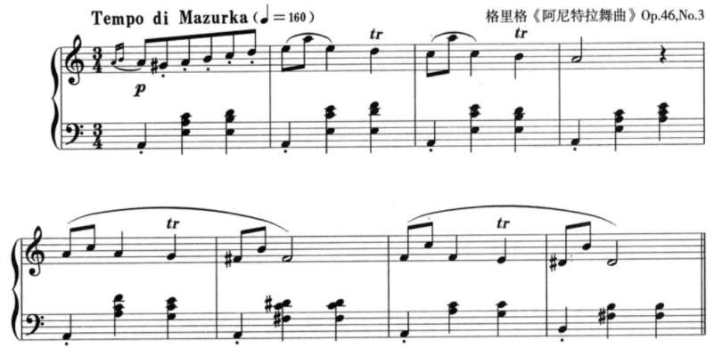

#### 复调音乐织体

定义：两个以上各具独立意义的旋律声部相互结合构成的多声部织体，称“复调音乐织体”

复调音乐根据“对位法”原则写作，以多个旋律声部的横向进行为主导，其思维方式是线条性的


#### 混合织体

主调音乐织体和复调音乐织体在实际作品中可混合使用，从而构成混合式织体形态。

## 音

（拓展内容见“声学”部分）

### 音域与音区

音域是指某一乐器或人声所能发出的最低音到最高音之间的声音范围。音区是指在某一乐器或人声的整个音域中，根据其音高或音色特点所划分的若干部分，每一部分称为一个音区，通常分为低音区、中音区、高音区。

#### 音的分组


分组时每七个基本音级为一组，称为一个音组（包括 7 个白键，5 个黑键）

1. 音组可分为大字组与小字组两类
2. 识别中央 C。在琴键上，即在钢琴键盘上从左往右数第四组并列的两个黑键左下方的白键即为中央 C 音。在五线谱上，中央 C 的固定位置如下图：


3. 音名分组的正确写法：小字组音名为小写字母，在音名字母右上角标注音的组别，如 D ²，读作小字二组 d；大字组音名为大写字母，在音名字母右下角标注组别，如 E ₁，读作大字一组 E。

**重点记忆：大字组到小字三组中，5 个 C 的位置。通过这 5 个 C 来反推其他位置上的音符是什么**


### 标准音

1834 年德国斯图加特物理学家会议确定 a1 为 440Hz，称为“第一国际音高”。我国轻工业部于 1956 年在北京召开的乐器专业会议上，规定采用第一国际音高作为中国乐器制造的标准音高。

### 乐音体系

乐音体系：音乐中所使用的乐音的总和。普通钢琴一般有 88 个琴键，其中有 52 个白键，36 个黑键，几乎包含了常规人声和乐器所需要的全部乐音

音列：把乐音按照一定的音高关系和次序排列起来的一组音

音名：在乐音体系中，每个乐音都有其固定名称。通常用字母 C、D、E、F、G、A、B 来表示。在钢琴键盘上的位置是固定不变的


### 音阶级数（音级，Scale Degree）

https://www.tonegym.co/tool/item?id = scale-analyser

根据输入的音，找对应的音阶：https://showscale.com/

定义：音乐中使用的各个固定音高

#### 种类

脱离于调性时，音级分为两类：

* 基础音级。指七个具有独立名称的音级，即 C、D、E、F、G、A、B。键盘的白色琴键。
* 变化音级（变音）。升高或降低基本音级而得来的音级。键盘的黑色琴键。有时，不同的音级代表同一个音高，如#E 和 F、B 和 bC、#G 和 bA 等。这样关系的音级互为等音（Enharmonic Equivalence）。由于只有在十二平均律下才能使得所有半音关系相同，所以十二平均律是产生等音的前提条件。


在调性内讨论时，不使用调内的临时变音记号表示的音级称为 **自然音级**，这与脱离调性时的划分并不完全对应：若这些音级是被调号升高或降低的，虽然它们属于变化音级，但也同时是自然音级。

##### 当首调遇上自然小调，自然小调的主音应该唱 La 还是唱 Do

实际上，**两种唱法都存在**。第一种叫“**Do-based Minor**”，也就是把小调主音唱做“Do”。如下图，a 小调的 1 级 A 音唱“Do”，b3 级 C 音则唱“Me”（降 Mi）。


另一种国内大部分人使用的就是“**La-based Minor**”，把小调主音唱做“La”。如下图，a 小调的 1 级 A 音唱“La”，b3 级 C 音则唱“Do”。


第二种使用的人更多，因为它与关系大调的唱名相同，整个音阶没有升降音，更容易唱。

而第一种“Do-based Minor“则会产生 3 个降音：Do、Re、Me（降 Mi）、Fa、Sol、Le（降 La）、Te（降 Ti）。

如果考虑转调的情况，两种唱法各有利弊。假设有一首歌从 C 大调转 c 小调，采用“Do-based Minor“唱法，唱名跟具体音高保持一致，在听感上会感觉更协调。


而如果采用“La-based Minor“唱法，转调后同样的音高则需要换一个唱法。


但是如果一首歌从 C 大调转到其关系小调 a 小调，情况则正好相反，具体可自行推衍。

##### 变音记号（Accidentals）

* 升记号（#，Sharp symbol）：升记号表示要将基本音级升高半音来演奏（唱）。C# = C sharp

  特别注意：E 和 F、B 和 C 是半音关系，因此#E 在钢琴键盘上的实际位置应是 F，#B 在钢琴键盘上的实际位置应是 C

  

 * 降记号（b，Flat symbol）：表示要将基本音级降低半音来演奏（唱）。Db = D flat

   特别注意：E 和 F、B 和 C 为半音关系，因此 bF 在钢琴键盘上的实际位置应是 E，bC 在钢琴键盘上的实际位置应是 B

   

   

 * 重升记号（×）表示将基本音级升高两个半音（一个全音）。

 * 重降记号（bb）表示将基本音级降低两个半音（一个全音）。

 * 还原记号（♮，natural）表示将已经升高或降低的音还原。G = G natural。

   提醒：有时还原记号只是其提示作用，提醒演奏者前面的音虽然临时升降号了，但这个音不需要。

###### 临时升降号对同一小节内的同一个八度音有效


1 is natural, because we haven’t put any accidentals.

2 is flattened by the flat symbol.

3 is also flattened by the symbol from number 2, because it's in the same bar.

4 is natural, because the bar line cancels the effect of the flat.

5 is flattened by the accidental symbol.

6 is naturalised by the bar line.


Note 3 is a G natural. The flat on number 2 doesn’t affect it, because it’s not the same pitch – it’s an octave higher.

#### 和声中的级数与名称（Scale Degree Names）

|                              級                              | 音级半音数 |                      中文名稱                      |             英文名稱              |                            意思                            | C 調中的例子 |
| :----------------------------------------------------------: | :--------: | :------------------------------------------------: | :-------------------------------: | :--------------------------------------------------------: | :---------: |
| [](https://zh.wikipedia.org/wiki/File:Scale_deg_1.svg)/Ⅰ |     0      |     [主音](https://zh.wikipedia.org/wiki/主音)     |               Tonic               | [音階](https://zh.wikipedia.org/wiki/音階) 中最 **主** 要的音 |      C      |
| [](https://zh.wikipedia.org/wiki/File:Scale_deg_2.svg)/ⅱ |     1      |   [上導音](https://zh.wikipedia.org/wiki/上导音)   |      Superleading tone/note       |                     从上方導向主音的音                     |     ♭ D      |
| [](https://zh.wikipedia.org/wiki/File:Scale_deg_2.svg)/Ⅱ |     2      |   [上主音](https://zh.wikipedia.org/wiki/上主音)   |            Supertonic             |                    主音上方一个全音的音                    |      D      |
| [](https://zh.wikipedia.org/wiki/File:Scale_deg_3.svg)/ⅲ |     3      |   [小中音](https://zh.wikipedia.org/wiki/小中音)   |           Minor mediant           |                      小主三和弦的中音                      |     ♭ E      |
| [](https://zh.wikipedia.org/wiki/File:Scale_deg_3.svg)/Ⅲ |     4      |   [大中音](https://zh.wikipedia.org/wiki/大中音)   |           Major mediant           |                    大主三和弦的 **中** 音                    |      E      |
| [](https://zh.wikipedia.org/wiki/File:Scale_deg_4.svg)/Ⅳ |     5      |   [下屬音](https://zh.wikipedia.org/wiki/下屬音)   |            Subdominant            |              屬音之下的音/主音下方纯五度的音               |      F      |
| [](https://zh.wikipedia.org/wiki/File:Scale_deg_4.svg)/IV ⁺ |     6      |   重属 [导音](https://zh.wikipedia.org/wiki/导音)   | Double dominant leading tone/note |                        導向属音的音                        |     ♯ F      |
| [](https://zh.wikipedia.org/wiki/File:Scale_deg_5.svg)/Ⅴ |     7      |     [屬音](https://zh.wikipedia.org/wiki/屬音)     |             Dominant              |              第二重要的音/主音上方纯五度的音               |      G      |
| [](https://zh.wikipedia.org/wiki/File:Scale_deg_6.svg)/ⅵ |     8      | [小下中音](https://zh.wikipedia.org/wiki/小下中音) |         Minor submediant          |                      小下属和弦的中音                      |     ♭ A      |
| [](https://zh.wikipedia.org/wiki/File:Scale_deg_6.svg)/Ⅵ |     9      | [大下中音](https://zh.wikipedia.org/wiki/大下中音) |         Major submediant          |                      大下屬和弦的中音                      |      A      |
| [](https://zh.wikipedia.org/wiki/File:Scale_deg_7.svg)/ⅶ |     10     |   [下主音](https://zh.wikipedia.org/wiki/下主音)   |             Subtonic              |                    主音下方一个全音的音                    |     ♭ B      |
| [](https://zh.wikipedia.org/wiki/File:Scale_deg_7.svg)/Ⅶ |     11     |     [導音](https://zh.wikipedia.org/wiki/導音)     |    Leading-tone / Leading-note    |                        導向主音的音                        |      B      |

属音之所以被称为属音是因为它是由主音产生出来的，它属于主音。属和弦就是任何基于属音的和弦，而且使用同一音阶的音。

记忆方法：先死记 1 级（主音）与 5 级（属音），再根据各级的名称记忆各级所代表的音：2 级比主音高一个全音，所以它是上导音；3 级在 1 级与 5 级之间，所以是中音；4 级在属音下方，所以是下属音；6 级是大下属和弦的中音，所以是大下中音；7 级是导向主音的音，所以是导音。

##### 音的稳定性（C 大调）

稳定音：1 > 5 > 3。所以 C 大三和弦也非常稳定。

不稳定音：6 > 2 > 4 > 7

音阶中的音有着不同的微妙特性，这涉及到自然泛音的共振理论。泛音与基音的声波呈现出周期性的重合，会造成声音和谐程度的不同，也产生了稳定音与不稳定音。

一个基音的泛音列中，不算重复音的话，最先出现的是五度的属音，然后是三度音，然后是七度音，然后是九度，十一度和十三度。

因此音阶中的主音(第一音)是最稳定的，其次是第五音(属音)，再次是第三音(中音)。 

音阶中的第二音(上主音)、第六音（下中音）属于较不稳定的音，它们趋向于稳定音。第二音可以移动到第一、三音，第六音可以往下移动到第五音，有时也可经过第七音向上移动到主音。

第四音（下属音）和第七音（导音）由于恰好处于音阶的半音位置，在整个音阶中属于最不稳定音，它们有强烈的解决回稳定音的倾向（第七音导音解决到主音，第四音下属音解决到第三音中音）。

##### 音的倾向性（C 大调）

不稳定音—> 稳定音

2—> 1	4—> 3	6—> 5	7—> 1

音名是固定的，CDEFGAB 在键盘哪个位置就始终在哪个位置。而唱名随着音乐的调变了，唱名也会变。所以编曲与弹吉他通常交流都是用音名

#### 调式变音

含义：调式音阶之外的临时变化音

使用目的：起到装饰作用，丰富旋律的色彩性，形成旋律的独特性

出现形式：

* 一般情况下，大多出现在旋律的弱拍、弱位等次要位置
* 以短时值居多
* 调式变音的运用一般以半音级进为主
* 在流行音乐中，调式变音的运用一般都是经过性的，以过渡音形式出现

### 唱名法（Solfège）

定义：用固定的音名（Note Name）唱出乐谱中的音高，常用 do、re、mi、fa、sol、la、si 来表示音的唱名（syllables），简谱中也用 1、2、3、4、5、6、7 来表示。

#### 种类

* 固定调唱名法（fixed do）。各音的音高是固定的，音名与唱名相一致，即 C 唱 do，D 唱 re，E 唱 mi……依此类推。固定调唱名法不随调号的变化而改变唱名，这种唱名法有利于培养学生的固定音高
* 首调唱名法（movable do）。随着调号的变化而改变唱名，钢琴键盘上依据调号的不同任意一个音都可以唱成 do，如 C 调，C 唱 do；D 调，D 唱 do；E 调，E 唱 do……依次类推

###  音程（Intervals）

音程：两个音之间的距离。

半音（Half Step、Semitone（UK））：两音之间最小的距离。钢琴键盘上相邻的两个琴键的距离就为半音，如 E 和 F、B 和 C 即为半音。

* 由两个相邻音级构成的半音叫自然半音：E-F、B-C、C-bD、#C-D、× F-#G
* 由同一音级的两种不同形式或不相邻的两个音级间构成的半音叫变化半音：bD-D、C-#C、#B-bD、E-bbG

全音（Whole Step、Tone（UK））：两个半音可以构成一个全音。从钢琴键盘上来看，全音的特点是两音中间相隔一个琴键，如 C 和 D、F 和 G 这样的两音中间相隔一个黑键即为全音。

* 由两个相邻音级构成的全音叫自然全音：C-D、#F-#G、bC-bD、bB-C
* 由同一音级的两种不同形式或不相邻的两个音级间构成的全音叫变化全音：bC-#C、C-bbC、bbB-B、#C-bE、A-bC

#### 旋律音程（Melodic Intervals）与和声音程（Harmonic Intervals）

##### 旋律音程

音程中的两个音，先后发声，叫做旋律音程，旋律音程依照其进行的方向，分为上行，下行和同音进行。

按照音程的大小，可以分为：狭音程和广音程。狭音程是指三度以及三度以下的音程，而广音程则是四度或四度以上的音程。由狭音程构成的旋律一般比较平和、宁静、流畅、轻盈。而由广音程构成的旋律一般比较跌宕、起伏、开阔、奋进。

###### 从纯一度到纯八度，各种旋律音程的主要特点

* 纯一度：实际上就是同音保持，是思想之延续、力量之凝聚。
* 小二度：是典型剧烈的音程，倾向性极强。比如导音具有解决到主音的倾向。
* 大二度：是自然调式中旋律流畅进行的基本音程，平稳和温和。
* 三度：在大小调式中和五声调式中均应用广泛。在大小调式中，三度是小跳进音程。小三度表现出小调特性，大三度表现出大调特性。在五声调式中，小三度和大二度一样是旋律流畅进行的基本要素，是平稳级进而非小跳进（如 mi 到 sol）。大三度很少用于五声调式。
* 纯四度：承上启下。弱起小节的纯四度上行具有号召、战斗性。（如国歌第一句的开头处）弱起小节的纯四度下行则具有雄伟沉着的特点。而在一拍或者以小节内使用纯四度，往往具有抒情性质。
* 纯五度：开阔，能将旋律推向高潮。
* 六度：是高潮的开头旋律常出现的音程，善于表现起伏较大的思想感情。
* 七度：由于不协和性，应用比较少。
* 纯八度：是大跳音程，能将乐曲推向高潮，开朗广阔。

##### 和声音程

音程中的两个音，同时发声，叫做和声音程。

##### 音响特点

* 大小二度
  * 旋律大小二度是旋律的基础，流畅优美，大二度更加安逸优美，小二度根音具有导音性质
  * 和声大小二度极不和谐，小二度非常刺耳，好像是错音，大二度可能有一种中国色彩，都需要解决到三度

#### 单音程（Simple Intervals）与复音程（Compound Intervals）

复音程是大于八度的音程

#### 特性音程

在和声调式中，由于和声大调第六级相较于自然大调第六级降低了一个半音，和声小调第七级相较于自然小调第七级升高了一个半音，因而产生了自然大、小调中没有的增二度、增五度、减四度、减七度。这四种音程为和声调式所特有，所以叫做和声调式的特性音程。

#### 音程表

[Interval Calculator](https://www.musictheory.net/calculators/interval)

| 半音数   | 0                              | 1                            | 2                          | 3                                       | 4                           | 5                              | 6                                                            | 7                             | 8                                  | 9                           | 10                             | 11                            | 12                       |
| -------- | ------------------------------ | ---------------------------- | -------------------------- | --------------------------------------- | --------------------------- | ------------------------------ | ------------------------------------------------------------ | ----------------------------- | ---------------------------------- | --------------------------- | ------------------------------ | ----------------------------- | ------------------------ |
| 音程     | 纯一度 <br />（Perfect Unison） | 小二度 <br />（Minor Second） | 大二度 <br />(Major Second) | 小三度 <br />（Minor Third）             | 大三度 <br />（Major Third） | 纯四度 <br />（Perfect Fourth） | 增四度/减五度 <br />（三全音、Augmented Fourth、Diminished Fifth） | 纯五度 <br />（Perfect Fifth） | 小六度/增五度 <br />（Minor Sixth） | 大六度 <br />（Major Sixth） | 小七度/增六度（Minor Seventh） | 大七度 <br />（Major Seventh） | 纯八度（Perfect Eighth） |
| 性格     |                                |                              |                            |                                         |                             |                                |                                                              |                               |                                    |                             |                                |                               |                          |
| 协和性   | 完全协和音程                   | 不协和音程（Dissonant）      | 不协和音程                 | 不完全协和音程（Imperfect consonances） | 不完全协和音程              | 协和音程                       | 不协和音程                                                   | 协和音程                      | 不完全协和音程                     | 不完全协和音程              | 不协和音程                     | 不协和音程                    | 完全协和音程             |
| 倾向性   |                                |                              |                            |                                         |                             |                                |                                                              |                               |                                    |                             |                                |                               |                          |
| 英文缩写 | P1                             | m2                           | M2                         | m3                                      | M3                          | P4                             | A4、d5                                                       | P5                            | m6                                 | M6                          | m7                             | M7                            | P8                       |
| 振动比例 | 1: 1                            | 15: 16                        | 8: 9                        | 5: 6                                     | 4: 5                         | 3: 4                            | 32: 45（或者 45: 64，取决于调的方式）                           | 2: 3                           | 5: 8                                | 3: 5                         | 5: 9                            | 8: 15                          | 1: 2                      |

* 增音程 > 大音程 > 小音程 > 减音程
* 增音程 > 纯音程 > 减音程

**注意：音程的度数不受变音记号影响**

##### 注意键盘上的音之间的音程关系


以 C 为根音为例，白键上要么是“大”，要么是“纯”；黑键上要么是“小”，要么是“增”或“减”。

#### **快速识别音程（重要）**

##### 对于自然音程

1. 先判断度数
2. 再判断性质

判断度数（Size）：

* 音程 = 高音-底音-1（C = 1, D = 2, E = 3...）。对于超过八度的音，可以先按照高音和低音在一个八度算，最后再加 7。

* 参考该方法：如果两个音同在线上或者间上，那就是 3、5、7...，如果一个在线上一个在间上，那就是 2、4、6...

  

  

判断性质（Quality）：

方法一：

* 记住：7 个音级中，有两组自然半音，即 E-F 和 B-C

* 二度和三度（大小）：

  * 有一组跨过这两组自然半音的音程就是小音程（提醒：判断跨了几组自然半音，推荐通过在脑海中想象琴键的方式来进行推算，即可以可视化音程关系，也可以加深对键盘上琴键间音程关系的敏感性）

  * 没有则是大音程

    举例：

    * E-G，其中就包含了 E-F 的半音，因此是小三度（3 个半音），包含 B-C 半音的音程也同理。
    * F-A，其中没有包含任何 E-F 或 B-C 的半音，因此是大三度（4 个半音）。

* 四度和五度（增减纯）：

  * 包含一组自然半音的是纯音程

  * 包含两组半音的是减音程

  * 没有包含任何半音的是增音程

    举例

    * E-A，包含了一组 E-F 半音，因此是纯四度（5 个半音）
    * F-C，包含了一组 B-C 半音，因此是纯五度（7 个半音）
    * B-F，同时包含了 B-C 和 E-F，因此是减五度（6 个半音）
    * F-B，没有包含任何自然半音，因此是增四度（6 个半音）

​	另外，白键中没有任何五度音程没有半音，也没有任何四度音程能同时跨越两组半音，因此自然音程中只且仅有一组增四和一组减五。

* 六度和七度（大小）：

  * 包含一组自然半音的是大音程

  * 包含两组自然半音的是小音程

    举例

    * D-B，只包含了一组 E-F 半音，因此是大六度（9 个半音）
    * E-C，同时包含了 E-F 和 B-C，所以是小六度（8 个半音）
    * C-B，只包含了一组 E-F 半音，因此是大七度（11 个半音）
    * D-C，同时包含了 E-F 和 B-C，因此是小七度（10 个半音）

方法二：

（用这个方法的前提是对 12 个大调都很熟悉。推荐这个方法，因为能同时熟悉大调音阶与音程关系）

把下方的音当作大调音阶中的主音，先得到调号。

再根据下表推算出度数，即：

* 1 - 1：纯一度
* 1 - 2：大二度
* 1 - 3：大三度
* 1 - 4：纯四度
* 1 - 5：纯五度
* 1 - 6：大六度
* 1 - 7：大七度
* 1 - 8：纯八度


再根据：

* 比大音程大为增音程
* 比大音程小为小音程，比小音程小为减音程
* 比纯音程大为增音程
* 比纯音程小为减音程


##### 对于变化音程

* 排除变音记号，音符距离几个音就是几度。如 D 与 E#相隔二度。注意误区：E#在键盘上是 F，但它们不是小三度，在乐理中，五线谱两个音之间的距离不受键盘实际距离的影响，五线谱中的距离是几度，它就是几度。
* 无视变音记号，先根据 `对于自然音程` 的方法，确认原来的音程是什么性质。比如 D 与 E 是大二度。
* 加上变音记号，判断比原来的音程多或少了几个半音。所以 D 与 E#是增二度。
  * 对于纯音程，大一个半音是增，小一个半音是减。如 E 与 A 是纯四度，与 A#就是增四度
  * 对于大小音程，大一个半音是增，小一个半音是减
  * 增音程多一个半音是倍增，减音程少一个半音是倍减

#### 音程的转位

规律：原位与转位的度数相加等于 9；大小增减互换，纯音程不变。


* 原位 C-D：大二度
* 转位 D-C：小七度

* 原位 C-E：大三度
  转位 E-C：小六度

* 原位 C-F：纯四
  转位 F-C：纯五

* 原位 C-Eb：小三
  转位 Eb-C：大六

* 原位 C-F#：增四
  转位 F#-C：减五

作用

可以根据小音程快速推算出大音程：


#### 音程的协和性（听起来舒服与否）

##### 和声音程（Harmonic Intervals）

* 完全协和音程（perfect consonances）：纯一度、纯八度
* 协和音程：纯四度、纯五度
* 不完全协和音程（imperfect consonances）：大小三度、大小六度
* 不协和音程：大小二度、大小七度、所有增减音程（包括协和音程的异名同音的音程，如 A1 与 A2、增四度/减五度（三全音））

注意：纯四度在一些语境下有时也被归为不协和音程：

解释一：历史风格问题。通过学习西方音乐史我们可以发现，西方教会音乐很长一段时间的形态就是四度的平行进行。由此，产生了审美疲劳。所以，在后来的非教会音乐创作中就会有意识的回避。

解释二：泛音列。以 C 的泛音列为例，F 在人耳可听的前 16 个泛音中是不存在的。由此，纯四度这个音响在泛音列中是没有办法得到解释的。

解释三：福柯的权力视角。见姚亚平教授《复调的产生》“第四章、权力的话语：欧洲早期复调语言机制的文化底蕴”的“个案研究——四度：权力角逐的失意者”。[为什么被“出卖”的是四度？](https://baijiahao.baidu.com/s?id=1722847981667244987&wfr=spider&for=pc)

##### 旋律音程（Melodic Intervals）

* 协和（consonant）
  * 所有纯音程（P4, P5, P8）
  * 大小二度（M2, m2）、大小三度、大小六度
* 不协和（dissonant）
  * 所有增减音程（包括协和音程的异名同音的音程，如 A1 与 A2）
  * 所有七度

#### 音程的解决

不协和音程创造张力（tension），需要通过协和音程解决（resolve）

##### 不稳定音程的解决

在调式中，I 级、III 级、V 级为稳定音级，II 级、IV 级、VI 级、VII 级为不稳定音级，Ⅱ倾向于Ⅰ，Ⅳ倾向于Ⅲ，Ⅵ倾向于Ⅴ，Ⅶ倾向于Ⅰ。由稳定音级构成的音程为稳定音程，如果音程内含有不稳定音级都为不稳定音程。

当不稳定音级有向稳定性音级倾向的要求时，这种要求就叫做“解决”。最简单的方法就是：就近解决到邻近的音程。如果不稳定音程中含有稳定音级，那即可以选择保持不动，也可以选择解决到邻近的稳定音级。

在音程的解决中，要避免平行五度（平五）和平行八度（平八）的出现，即由一个纯五度（或纯八度）进行到另一个纯五度（或纯八度）。两者是一种不良声部的进行。

##### 不协和音程的解决

不协和音程一般解决方法是把它进行到协和音程。这里要注意的是，所解决的协和音程会出现 2 种情况，它可能是稳定，也可能是不稳定的。那碰到不协和音程要怎么办呢？
解决方法：根据所制定的调，解决到协和音程。

解决要点：

1. 明确调式调性，音的进行要服从音的自然倾向性。
2. 不稳定音级做二度级进，解决到稳定音级上，这时稳定音级可保持或跳进到另一个稳定音级上。
3. 增音程扩大解决，减音程缩小解决。

不协和音程进行到协和音程，叫做“不协和音程的解决”。

主要方式仍是根据不稳定音到稳定音的倾向：

* 将不稳定音进到最近的稳定音
* 稳定音可以保持在原位不动或进到其他稳定音
* 增音程需向外扩大，减音程需向内缩小

#### 三全音（魔鬼音程、Tritone）

##### 定义

由三个音调或六个半音组成的音程。

每一个全音阶中只有一个三全音，它表现为四级音到七级音之间的距离。由于这个音程能将八度均分，所以它还可以表现为七级音到四级音之间的距离。所以在 C 大调中，F 到 B 和 B 到 F 的音程都是三全音。

##### 音响效果

一种非常不和谐的音程，令人感到奇怪和出于意料

不协和的原因：当两个音符的频率之间存在一个固定的比例时，音高听起来就会很和谐。两个八度音符最合适的比例是 2: 1，这听起来会非常和谐，我们甚至给这两个音符起了相同的名字。下一个最和谐的音程是完全五度音阶，（3: 2）。它在整个音程范围内都是连续的。

而三全音的音符最终会以 45: 32 这一不堪入目的比例而结束（或者 64: 45，取决于调的方式）。

##### 应用

由于在自然调式中便存在着三全音，所以这样的一个音程相较于其它的不存在于自然调式中的不协和音程来说，在各种情况下的应用也要更广泛。最典型的便是经典的 D-T 进行了，即属到主的进行。这里的属和弦一般都会采用属七和弦。以 C 大调为例，属七和弦的构成是 G、B、D、F，其中 B 与 F 之间便是三全音的音程。

三全音也常应用在警报和紧急警报领域。

##### 三全音的解决

由于三全音听感不协和，性质不稳定，故而 B 和 F 两个音都有向旁边相距半音的位置进行解决的倾向。即 B 向 C 上行，F 向 E 下行，从而变成一个不完全协和音程大三度，变成了 G、C、D、E。由于在属七和弦中，五音对于和弦性质的影响最小，故而 D 音可以省略，这样的话，我们就得到了 G、C、E 三个音，这三个音刚好构成了 C 大调的主和弦 C 和弦。

于是，一个从属和弦到主和弦的进行便完成了。我们可以明显地看出，三全音的解决是促成这个进行的最大的动力。

##### 三全音代理（Tritone substitution）

一个属七和弦中存在一个三全音，但是一个相同的三全音却被两个属七和弦共享，因此我们可以认为它们是等同的可以互相替代。比如 G 的属七和弦和 Db 的属七和弦的三全音都是 F 和 B。

##### 由 G 的属七和弦推导出 Db 的属七和弦的方法

1. 前面我们提到，在七和弦中，最不重要的音是五音，故而在换音之后的和弦中，B 音或者 F 音都不应该成为五音。这样一想，唯一的解决方法就只有把 B 和 F 两个音的位置互换，让原本三音位置的 B 音移到七音位置，原本七音位置的 F 音移到三音位置，构成 G、F、D、B。

2. 由于前面我们提到 B 到 F 和 F 到 B 之间都是三全音关系，故而这种变换不会对音程本身的性质带来改变。接下来我们得思考剩下的两个解决音应该怎么选。

   为了保持属七和弦的性质，我们需要新和弦的根音与新的三音 F 音之间的音程为大三度，那么，新的根音就应该是 Db 音；Db 音向上推一个纯五度我们可以得到五音，即 Ab 音。

3. 因此得到和弦构成音：Db、F、Ab、B，即 Db 属七和弦。和弦中的 B 音我们可以看作是 Cb 音，这样构成音就是 Db、F、Ab、Cb 了，标准的属七和弦的结构。

这样的一个 Db 属七和弦，在一些情况下如果能拿来代替 G 属七和弦的话，也许就会给和弦进行增色不少。

不过需要注意的是，这种替代不是一定可行的，还是要根据旋律声部的进行来进行取舍。毕竟，这个和弦内部出现了两个听起来可能会让人感觉不适的调外音。

##### 具体应用

三全音代理不仅能应用在属到主的进行中的，而且在任何和弦前面都可以接上一个根音比目标和弦高半音的属七和弦。

即：某个和弦—> 想要接的和弦算起上面五度音的属七和弦—> 想要接的和弦

如 C 接 Amin，则可插入 E7（从 Am 算起），即便 E7 不是 C 大调中的和弦也没关系。由于属七和弦中有一个很不协和的音程，三音与七音距离三个全音（即三全音）

## 节拍与节奏

推荐的节拍练习网站：[The Rhythm Randomizer](https://www.rhythmrandomizer.com/)
推荐的节拍器：https://metronome-online.com/

### 节奏（Rhythm）

广义的节奏不仅包含音乐进行中各个音的长短组织关系，而且蕴涵着强弱拍交替（有无规律、有何种规律等）即节拍，以及力度、速度、重音、推进力、动感等等多方面的因素。

#### 重要性

节奏，在音乐中的地位十分重要，它和旋律是构成音乐的两个基本成分。人们常说，节奏是曲调的骨骼，音乐的生命。节奏可以脱离旋律而存在，旋律却离不开节奏。

在音乐中，节奏与旋律（指音高方面）、和声（含复调）合称三大要素并融为一体。但节奏也可脱离旋律与和声而独立，表现为不定音高的疏密，断连的点、线组合形式，且仍有一定的表现能力。如打击乐演奏时用的节奏。

速度：如 80bpm（beats per minute）、120bmp，每分钟多少拍

小节：在乐曲中, 由一个强拍到下一个强拍之间的部分。一定数量的拍组合成小节（4/4：4 拍为 1 节）

#### 记忆方式

要一组组的记忆节奏（如 4 个音值为一组），而不要一个个记，一组记忆更容易记住。

#### 风格（Style）

https://alivedrumming.com/faq/catalog-rhythmic-styles/

### 节拍（Meter）

定义：重拍和弱拍周期性的、有规律的、重复进行的模式

* Strong beat: this is the strongest accent in the bar and falls right at the beginning of the bar.
* Weak beat: these are the other crotchet beats of the bar. 
* Off beat: these are any notes which fall in between the strong and/or weak beats.

#### **打节拍练习**

正拍节奏很简单，直接跟着节拍器练即可。

对于正拍+反拍混合的节奏，如果节奏感比较差，跟不了节拍器，可以将心里按最小单位的音符打节奏，并且在打节奏时往节拍器的节奏上靠，以保证心里节拍的准确性，比如在四四拍，节拍器四分音符响一次，而谱面最小的音符是八分音符，那心里的节奏就要按八分音符打，然后往节拍器上靠。

PS：心里默念“哒嗯”，“哒”是音符开始响的时候，“嗯”是音符持续的时候。如果希望跟着拍子一起念，可以念如“1 and 2 and 3 and 4 and”
https://tonesavvy.com/music-practice-exercise/15/rhythm-performance-game-eighth-notes/ 做 50 道题练熟后，基本不过脑靠本就能打对拍子。从最简单的四四拍+四分音符+八分音符+tie 组合、50-65-80BPM 速度依次开始练。

https://metronome-online.com/

练习层次
以44拍为例：
1. 全音符、二分音符、四分音符
2. 全音符、二分音符、四分音符、八分音符：注意反拍节奏
3. 全音符、二分音符、四分音符、附点：注意反拍节奏
4. 全音符、二分音符、四分音符、八分音符、附点：注意反拍节奏

##### 节拍器的坏处

https://www.youtube.com/watch?v = FaU-HXperj0

1. 转移注意力。原本注意力应该是在乐曲的音乐性上的，但是有时注意力更多地集中在有没有卡上节奏。另外注意即便是一样的乐谱，其演奏风格也可以是多种多样的。
2. 完全卡节拍器的节奏容易让音乐变得机械、死板

#### 节奏与节拍的区别

节奏具有多样性，是在某种节拍基础上不同时值的音灵活的、千变万化的组织形式。

节拍具有均匀性。节拍是强弱规律性的反复交替，没有时值变化。因此，有人称节拍是被合理地设计出来的，人工地、机械地规定出来的。节奏包含着节拍的特点，而节拍却不能概括节奏的全部意义。


#### 单位拍

用某种固定时值的音符来表示节拍中的每一个时间片段，即“一拍”（Beat）。单位拍内也有强位、弱位之分。 

#### 拍号（Time Signature）

表示节拍的记号。它由上下两个数字组成，下方数字代表单位拍的音符时值，上方数字代表单位拍的数量即拍子。 比如 3/4 拍是：三拍子、以四分音符为单位拍，念四三拍，英文是 three four time。


#### 拍子（Meter）

将单位拍按照一定的强弱关系组织起来。

流行歌曲中，最常用的节拍是 4/4 拍，其次是 3/4、6/8 拍，再次是 2/4 拍，其他拍子不太常用。

### 形态分类

**两套分类体系：德国-苏联-中国体系、英美体系**

* 单拍子（Simple Meter）：每小节只有一个强拍的拍子（连“次强拍”也没有）。 如二拍子、三拍子
* 复拍子（Compound Meter）：两个或两个以上同类型单拍子的组合（至少有两个强拍）。如四拍子、六拍子。
* 混合拍子（Mixed Meter）：两个或两个以上不同类型单拍子的组合。 如五拍子、七拍子。
* 一拍子：每小节只有强拍，没有弱拍，常出现在我国戏曲或说唱音乐中。
* 自由节拍：在乐曲中, 强音位置与单位拍时值都不是十分明确和固定的拍子。

#### 英美体系

在英美体系中，复拍子是把单拍子的每个拍再细分成三等分（一个附点音符）的拍子，并把三等分后的拍子当作一拍的三连音或一个附点音符。因此如果：拍子除以 3 是大于 1 的整数，那它就是复拍子。如四四拍，因为 4/3 = 1.333 不是整数，所以四四拍是单拍子。

**注意：三拍子还是单拍子。**


#### 常见拍子

https://www.mymusictheory.com/reference/65-music-theory/237-time-signatures-chart

| 分类     | 英美体系 | 拍号 | 别称   | 含义                                                         | 强弱规律                                |
| -------- | -------- | ---- | ------ | ------------------------------------------------------------ | --------------------------------------- |
| 单拍子   | 单二拍子 | 2/2  | 二二拍 | 以二分音符为一拍，每小节两拍                                 | 强-弱                                   |
| 单拍子   | 单二拍子 | 2/4  | 四二拍 | 以四分音符为一拍，每小节两拍                                 | 强-弱                                   |
| 单拍子   | 单三拍子 | 3/4  | 四三拍 | 以四分音符为一拍，每小节三拍                                 | 强-弱-弱                                |
| 复拍子   | 单四拍子 | 4/4  | 四四拍 | 以四分音符为一拍，每小节四拍                                 | 强-弱-次强-弱                           |
| 复拍子   | 复二拍子 | 6/8  | 八六拍 | 以八分音符为一拍，每小节六拍。<br /> 英美：每小节有两拍，每拍三等分 | 强-弱-弱-次强-弱-弱                     |
| 复拍子   | 复三拍子 | 9/8  | 八九拍 | 以八分音符为一拍，每小节九拍。<br /> 英美：每小节有三拍，每拍三等分 | 强-弱-弱-次强-弱-弱-次强-弱-弱          |
| 复拍子   | 复四拍子 | 12/8 |        | 以八分音符为一拍，每小节十二拍。<br /> 英美：每小节有四拍，每拍三等分 | 强-弱-弱-次强-弱-弱-次强-弱-弱-弱-弱-弱 |
| 混合拍子 |          | 5/4  | 四五拍 | 以四分音符为一拍，每小节五拍                                 | 强-弱-弱-次强-弱 <br /> 强-弱-次强-弱-弱  |

3/4 与 6/8 不可混淆，但它们每小节的总时值相等，所以只要变化重拍位置就可以互相衔接。

| 名称                         | 含义       | 强弱关系            | 效果                                               |
| ---------------------------- | ---------- | ------------------- | -------------------------------------------------- |
| 二拍子 <br />（duple meter）  | 每小节两拍 | 强—弱               | 表现方整、对称、顽强、刚健、有力。如进行曲、曲军乐 |
| 三拍子 <br />（triple meter） | 每小节三拍 | 强—弱—弱            | 表现优美、流畅、灵活自由。如圆舞曲                 |
| 四拍子 <br />（quadruple）    | 每小节四拍 | 强—弱—次强—弱       | 表现宽泛                                           |
| 六拍子                       | 每小节六拍 | 强—弱—弱—次强—弱—弱 | 表现舞曲                                           |

当一拍包括平均地两个音的时候, 它就相当于二拍子，第一个音强，第二个音弱。同理其他的拍子。四三拍子中的六个八分音符，是由三个四分音符分解而成，所以每拍中的两个八分音符，第一个强，第二个弱。三拍连在一起，就变成了强、弱、次强、弱、次强、弱。


例子

| 名称     |                            |
| -------- | -------------------------- |
| 四三拍子 | 强、弱、次强、弱、次强、弱 |
| 八六拍子 | 强、弱、弱、次强、弱、弱   |

如图 ***\* 红框\****为 4/4 拍的 1 小节。

一般演奏习惯

* 以一小节为单位，拍点上的音，力度较大，小节总体会有细微的渐弱
* 时值越长的音，力度会越大。时值越短的音，力度会越小

#### 变换拍子（polyrhythm、cross-rhythm）

两种或两种以上的拍子交替出现。变换拍子可能是有规律地循环出现，这时可将两种或两种以上的拍号并列标明，是流行歌曲中经常运用的一种形式。

一般情况下，使用变换拍子都是因为歌曲内容的需要，或是乐句对称的需要，或是音乐对比的需要

由于变换拍子使音乐的强弱规律发生变化，因此在律动上具有很大的对比性。

用法

* 无规律的变换拍子，即随处插入变换拍子，如《飞鸟与鱼》（齐豫）、《b 小调雨后》（叶蓓）、《黑鸟》（Black Bird，披头士乐队）
* 有规律的变换拍子，即在固定乐句或段落间变换拍子，如《缀满钻石的天空中的露西》（Lucy In The Sky With Diamonds，披头士乐队）、《关于理想的课堂作文》（李晓东）等。

#### 情感

在创作一首歌曲时，首先要选择一个跟歌曲内容和情感相吻合的节拍，因此了解各种节拍的形象特征，有助于节拍选择的定位

* 4/4 拍：表现范围比较广泛，节奏型的运用比较自由，基本上可以表现各种情绪的内容

  一般情况下，快歌以八分音符或大于八分音符的时值为基础，慢歌可使用任何节奏，但是最小时值一般不小于十六分节奏（Rap 除外，它经常会采用小于十六分时值的节奏型）

  快速的 4/4 拍可以表现热烈、激情的情绪和动感的旋律，如《眉飞色舞》（郑秀文）、《红日》（李克勤）、《大女人》（张宇）、《女孩与四重奏》（丁薇）等

  慢速的 4/4 拍可以表现深情、稳重的情绪和舒缓的旋律，如《东风破》（周杰伦）、《听海》（张惠妹）、《最浪漫的事》（赵咏华）等

* 3/4 拍：强弱分明，律动感较强

  在流行歌曲中，3/4 拍的作品多以中速或中快速为主，如《棋子》（王菲）、《真心英雄》（李宗盛等）、《独角戏》（许茹芸）、《野花》（田震）等。节奏不宜太密集，音符时值不宜太短，一般都以八分音符以及大于八分音符的时值为基础，起骨干节奏作用，小于八分音符的时值可作为辅助节奏或色彩节奏运用

  快速的 3/4 拍子，适合表现欢快、热烈的情绪，如《相约九八》（王菲、那英）

  慢速的 3/4 拍，适合表现抒情、优雅的情绪，如《把根留住》（童安格）

* 6/8 拍：由于它是 6 拍一个强音轮回，因此它的线条性较强，适合表现旋律柔美，具有曲线性的作品。

  一般情况下，6/8 拍的歌曲速度较快，慢速歌曲大约在每分钟 150 拍左右，快速歌曲至少达到每分钟 200 拍以上

  6/8 拍既具有 3/4 拍中 3 拍子的律动感，又具有 4/4 拍中复拍子的特点，因此，它是一种介于 4/4 拍和 3/4 拍之间的节拍类型，具有一种特殊的音乐气质。

  既可以表现抒情、柔美的旋律，如《同桌的你》（老狼）、《我想我是海》（黄磊）、《明天的明天的明天》（动力火车）、《那一场风花雪月的事》（周治平）、《寂寞在唱歌》（阿桑）、《当男人爱上女人》（When A Man Loves AWoman，迈克尔·波顿）等

  也可以表现大气、雄伟的情绪，如《一九九七永恒的爱》（群星合唱）、《永不分开世界的爱》（群星合唱）等

* 2/4 拍是单拍子，每小节只有一个强拍一个弱拍，强弱非常分明，适合表现雄壮、有力、欢快、活泼的情绪

  由于 2/4 拍强弱太过分明，节奏一般都比较简单，多以四分、八分节奏为基础。因此在当代流行歌曲中，2/4 拍歌曲相对较少，如《对面的女孩看过来》（任贤齐）等

  不过在 20 世纪三四十年代的“大上海”时期，由于受到美国爵士乐的影响，流行歌曲多用 2/4 拍，如《夜上海》（周璇）、《玫瑰玫瑰我爱你》（姚莉）、《凤凰于飞》（周璇）、《蔷薇处处开》（龚秋霞）等。

  早期在新奥尔良和芝加哥发展起来的“新奥尔良爵士”多以 2/4 拍为基础。20 世纪三四十年代，“大上海”流行歌曲受到美国早期爵士乐的影响较大，因此也多用 2/4 拍

### 不完全小节（pickup measure、anacrusis）

在一个小节内，所有音符时值相加恰好是拍号所标明的拍数时，被称为“完全小节”若所未能达到拍号所标明的拍数，被称为“不完全小节”。

不完全小节通常出现在歌曲开头或是结尾。

注意弱起小节是没有资格计入第一小节的，第一小节一定是完整的

### 节奏型（Rhythmic Pattern）

https://www.youtube.com/watch?v = Y5_27Gc28ls&ab_channel = SaherGalt

作用

* 有助于快速试奏乐谱
* 规范记谱

如果我们将每两组节奏型组合，它就变成了 4/4 拍，在我们以后弹奏乐谱的时候，遇到 4/4 拍，我们就把它分为 2 拍来识谱

```abc
X:1
T:以2拍为单位的八分音符节奏型
M:2/4
L:1/8
K:C
DD DD | D2 DD | DD D2 |
D D2 D | D3 D | D D3
```

如果我们将每两组节奏型组合起来，它就变成了 2/4 拍，在我们以后弹唱乐谱的时候，遇到 2/4 拍，我们就把它分为 1 拍来识谱。遇到 4/4 拍我们就把它分为 4 拍来识谱

```abc
X:1
T:以1拍为单位的十六分音符节奏型
M:1/4
L:1/16
K:C
DDDD | D2DD | DDD2 |
DD2D | D3D | DD3
```


#### Shuffle 和 Swing


Shuffle 节奏起源于乡村布鲁斯音乐，是将三连音中第二个拍点去掉不弹，整体听起来很有力量，很有顿挫的感觉。


如下图：讲每拍分为三等分，中间的那一个拍点不弹


Swing 所表现的是将三连音三个拍点中的第一及第二个音符用连接线将它们连起来，整个的节奏就有一种轻盈跳跃的感觉。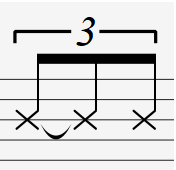

很多教材里面都是这样描述的：swing 是三连音中两个音连在一起（这种说法《好和弦》说是错的），shuffle 是三连音中间的音休止。

如果按照节奏声部来说，这样说没错的，但这种说法很笼统，单独弹 solo 是分不出 Swing 和 Shuffle 的，在旋律乐器里面，演奏 Swing 和 Shffle 听起来都是一样的。

从节奏声部区分：Shuffle 这种节奏类型，是 Blues 音乐当中最常用的一种节奏

Show Me The Money - Buddy Guy

以上是一首传统布鲁斯，你会发现底鼓的声音很强烈！而且每拍都很满很重“动-动 哒-动 动-动 哒-动”

Count 'Em - Count Basie

从鼓组来看，Swing 中很少听见像 Shuffle 那样强烈的底鼓，常听见的是镲片“次 次-次 次 次-次” 这样的声音，而且鼓手通常在第一拍和第三拍只打一下，在二四拍演奏 swing 的八分音符，swing 的节拍也相对比较松散。

Swing 这种节奏类型是摇摆乐的灵魂，摇摆乐最早起源于 1930 年前后，在 1935-1946 年间达到巅峰，其中最能代表这个乐风的则是「摇摆乐之王」班尼固德曼所领军的六重奏(BennyGoodmanSextet)

在贝斯的演奏上，Shuffle 中的贝斯通常会持续有力地演奏三连音的八分音符，而在 Swing 中，贝斯手会演奏 WalkingBass，这一点从上面两首歌曲中也有很明显的体现。

Swing 演奏技巧

把一对八分音符  中，前面那个音弹长一点，后面那个音短一点。（注意长度不一定是 2: 1，随意就好）

前面那个音弹轻一点，后面那个音重一点，但也不是一定的

不要把音跟音之间弹得太重叠

注意休止符的时机

把装饰音弹得比它后面的音大声

把一些比较快的音处理成 Ghost Notes

偶尔可以把整个旋律的拍点延后

让强音与弱音的反差大一些

Swing 完全不是古典音乐中的 Tempo Rubato

常见错误：

1. 根本忽略需要 Swing 节奏
2. 误解 Swing 为弹性速度
3. 太重叠、太圆滑、太歌唱性
4. 太多跳音、太可爱
5. 没有明显的轻重之分

注意：Swing 的节奏不是绝对的，以下只是一种参考节奏


```abc
X:1
T:原节奏+Swing（没断）+Shuffle（有断）
M:1/4
L:1/8
K:C
Q:140
CDEF GFED | C6 z2 |
C2DE2F G2FE2D | C6 z2 |

```

练习方法：开三拍子的节拍器，用swing节奏弹音阶
### 反拍节奏（backbeat、offbeat rhythm）

Offbeat Rhythm: 指的是音乐中的节奏强调在非主要节拍点上，即弱拍或次强拍。

作用：这种节奏可以创造出一种推动力和动感，使音乐更加有活力和吸引力；可以增加音乐的复杂性和趣味性，使听众的注意力集中在非传统的节拍点上。它可以用来强调旋律的某些部分，或者为音乐增添一种摇摆或摇摆的感觉。


在一般的 hiphop 音乐中，一般歌曲是 4/4 拍（即一个小节有四拍，每拍时长为一个四分音符），把四分音符分为两部分就是两个八分音符，那一个小节就有八个八分音符，hiphop 里的正拍（onbeat）一般在第每个四分音符上的第一个八分音符，所以在 1,3,5,7 个八分音符上，反拍（offbeat）就在 2,4,6,8 上，底鼓在重拍，所以是 1,3,5,7 八分音符，如果按照反拍唱，那么就是要把节奏卡在 2,4,6,8 个八分音符上，参考雷鬼风格（不是 hiphop 的雷鬼唱法）和某些电子摇摆乐。

当音乐以 4/4 拍为节拍，clap 和 snare 出现在第二拍和第四拍这种节奏模式，我们称为**反拍节奏（backbeat）**，也可以叫做off-beat syncopation。


SUBDIVIDE THE BEAT 1-2-3-4 BECOMES 1-8-2-&-3-&-4-&SYNCOPATED NOTES COMEON THE 'AND' SYLLABLE

### 切分音（Syncopation）

切分节奏，是一种特殊类型的反拍节奏。

定义：从弱拍或者弱部分开始，并延续到下一个强拍或强部分的音符，简单说就是“由弱到强”的音符就是切分音。带有切分音的节奏就叫做切分节奏（Syncopated Rhythm）。

且切分音一般强于其前后的两个音

作用：改变音的强弱关系。它通过将重音放在通常被认为是弱拍的位置，或者将弱音放在通常被认为是强拍的位置，从而创造出一种意外和有趣的节奏效果。切分节奏常用于爵士乐、拉丁音乐等风格中。

一拍 = 前半拍（强位）+后半拍（弱位）。注意还可以继续这个划分下去

例子：下图中的二分音符在弹奏的时候是弱拍，但它延续到了后面的次强拍。因为这个音是由弱到强，所以它是一个切分音


切分通常需要连音符将弱拍延续到强拍上，这种切分叫做`suspended syncopation`。


我覺得流行歌曲之所以那麼多切分音，除了使音樂變有趣以外，還有個重要因素：這樣比較容易填詞、唱念。 歌詞某個詞尾的字或句尾的字都需拉長，於是就會形成「短、長」這種 iambic （抑揚格）的詩歌音步。當然，詩歌的音步還有其他類型的韻律。詩歌的「韻律」與音樂的節奏可互相印證。[https://zh.wikipedia.org/wiki/%E9%9F%B5%E5%BE%8B](https://www.youtube.com/redirect?q=https%3A%2F%2Fzh.wikipedia.org%2Fwiki%2F%E9%9F%B5%E5%BE%8B&stzid=UgioXQHJO5BmdngCoAEC&redir_token=QUFFLUhqbG4xdERrS2JIamZLVWpqQVpqdHdaeERfdWRSQXxBQ3Jtc0ttVFdGMUpzT0wxbjBMN0RFN0tTeG9iYXNvTWQ0LVgwdHFwbHBtVTNtRDA1S1NsZ3AwYWtFTmJFYlJzcHRvNHFrMlNCeVQzS1Y5eGx1dFRxTTlkM0RHV2RsekROZ2JpZzl3aklnWUtQUnM2aEJXMVc1bw%3D%3D&event=comments)  另外，中文因為有聲調（每個聲調有自己的調值和調形），優秀的創作者能夠順應調域或旋律線的形狀，以免產生歧義。

### 反拍节奏与切分节奏的异同

反拍节奏（Offbeat Rhythm）和切分节奏（Syncopated Rhythm）在音乐中都是用来描述那些不遵循常规强拍和弱拍模式的节奏。尽管它们在某些方面有相似之处，但它们在定义和应用上也存在一些差异。

**相似之处：**

1. **非传统节奏强调**：两者都涉及到在非主要节拍点（通常是弱拍或次强拍）上放置节奏强调，从而创造出与传统节奏不同的感觉。
    
2. **增加音乐的动感**：反拍节奏和切分节奏都可以增加音乐的动感和复杂性，使音乐听起来更有活力和吸引力。
    
3. **创造意外效果**：它们都通过在非预期的位置放置重音或音符，来创造一种意外的节奏效果，从而吸引听众的注意力。
    

**差异之处：**

1. **定义**：
    - **反拍节奏**：更广泛地指在弱拍上放置节奏强调，不一定涉及到音符的特定排列或特定的节奏模式。
    - **切分节奏**：特指一种节奏模式，其中强拍被“切分”或分散到相邻的弱拍上，通常涉及三连音或其他细分音符的组合。
2. **节奏结构**：
    - **反拍节奏**：可以是任何在弱拍上的节奏强调，不一定需要特定的音符组合或模式。
    - **切分节奏**：通常涉及到特定的节奏结构，如三连音的第二个音符落在强拍上，或者一个较长的音符跨越强拍和弱拍。
3. **音乐风格**：
    - **反拍节奏**：可以在多种音乐风格中找到，不局限于特定的音乐类型。
    - **切分节奏**：在某些音乐风格中更为常见，如爵士乐、拉丁音乐、摇摆乐等，这些风格经常使用切分来创造独特的节奏感。
4. **复杂性**：
    
    - **反拍节奏**：可能相对简单，只需要在弱拍上放置重音即可。
    - **切分节奏**：可能更加复杂，因为它涉及到音符的特定排列和节奏的精细控制。

总结来说，反拍节奏是一个更广泛的概念，涵盖了在弱拍上放置节奏强调的各种情况，而切分节奏则是反拍节奏中的一种特定形式，它涉及到更具体的节奏结构和音符排列。两者都可以为音乐增添动感和趣味性，但切分节奏在技术上可能更为复杂和具有特色。

### 连音（Tuplet）

为在指定的节拍中加以分拆或结合而成的音符组合，包括三连音和二连音。标记方法为加上数字或比例，以指出对固有节拍的改变，有时亦会用向下的中括号或连结线（beam）标出连音的范围。

通常标示连音只会简单地标上数字，但这方法有时会引起误会。如七连音可以由四拍、六拍分拆而来或由八拍结合而来。为了有效分辨它们，会分别以 7: 4、7: 6、7: 8 表示，前者为音符数目，后者为节拍数目。

另外，一个六连音可以看成两个连续的三连音（重音在第一、四个音）或每两个音为一组的一个三连音（重音在一、三、五个音），因此在有可能引起误会时应小心标记。

补充：英语 Tuplet 源于后缀的误用，从 Quintu(s)-(u)plet 和 Sextu(s)-(u)plet 等取出。其余代替此字的有：Irrational rhythm、Artificial division、Irregular rhythm、Irregular rhythmic groupings 等。

#### 作用

因不同长度的音符只带有二分关系，连音可以用以构造特别的旋律。它也可以在特定的时间内加上更多的音符或减少一些音符，造成速度的改变。有时候连音标志着乐曲的旋律较为自由，该部分可供演奏家作演绎之用，加强乐曲美感。

#### 三连音（Triplet）

https://en.wikipedia.org/wiki/Tuplet

三连音是最常见的连音，在两拍中加上三个音符，使得每个音符长度为 2/3 拍。 一长一短的音也可以为三连音，如一个四分音符和一个八分音符，长音的长度为 2/3 拍，短音为 1/3 拍。下图第三至第五个音符为三连音：

[](https://zh.wikipedia.org/wiki/File:Irrational_rhythm.png)

#### 二连音（Duplet）

将一个附点音符分为均等的两部分，用来代替基本划分的三部分，这叫“二连音”。

#### 虚线连音

由西方传入，顾名思义这种连音以虚线表达，但不同的是使用乐器演奏并无改变，改变的是跟着音乐唱歌的人，当唱到虚线连音的部分，歌手便要把那个歌词连续数个音符(高低音)连起来唱(英、中亦可)。

#### 演奏

演奏三连音时，三个音的力度要均衡（上下浮动的误差在正负 8 之间），尤其不要习惯性地把第一个音加强

### Counting

注意：一定要学会把节奏给唱出来。这样对视唱练耳与演奏非常有帮助。

https://utminers.utep.edu/charlesl/Counting1e&a.pdf

https://en.wikipedia.org/wiki/Counting_(music)

### 练习

练习要点：

* 一个是要把各种节奏的听感内化，听到节奏就能想象出对应的乐谱；一个是要把乐谱节奏化，看到乐谱时，脑海中要能“响起”对应的节奏。
由于大脑同时只能把注意力放到一件事情上，因此对于复合节奏的处理有两类办法。一类是把复合节奏整体当作一个节奏来学习，而另一类方法是将左右手的节奏无意识化，即在演奏时，只需想着一只手的节奏，而另一只手的节奏是靠大量练习、无意识地来跟着另一首演奏。如同一些人一边吃饭，一边看剧，专注地看剧就是有意识的，而吃饭可能就只是无意识地机械化动作。
* 除了基础节奏，也要非常注重复合节奏的练习。
* 如果练习乐曲时，遇到了不熟悉/没听过的节奏，要先把节奏练熟，再练曲子，这样事半功倍。
* 节奏中的难点（需要重点练习）：
	* 切分节奏。

https://tonesavvy.com/music-practice-exercises/

复合节奏（Polyrhythm）

（From： 钰的钢琴空间）

复合节奏，是指双手的节拍不能被整除的情况，如常见的2对3、3对4等节奏。

训练方法：

* 最小公倍数，只适用于极慢的2对3。
* 双手独立，心中数大拍子，适用于大部分情况。
* 浪漫派作品中很长的复合节奏，可以划分成几个小一点的拍子，运用rubato来连接。
* 双手独立练好之后，可以把整体的节奏当作一个节奏，而不是两手的两个独立节奏之和，再进行练习。

方法：取两个节奏的最小公倍数。


理论上，最为精确的数法当然是这样，但实际上，在大部分情况下这都是不可行的。**原因很简单：来不及**。所以，只有少数速度特别慢的2对3节奏可以用最小公倍数的方式去弹。每一组数6下，三连音的那只手是2x3（三个2），两个音的那只手是3x2（两个3）。

如果速度加快一些，或者遇到3对4、3对5、4对5、5对8等更加复杂的复合节奏是根本不可能拆成小拍子去数清楚的。比如5对8，一组就要数40下，很显然这是无法实现的。因此，运用最广泛的、正确的训练复合节奏的方式是只数大拍子。例如，练习右手一拍两个音对左手三连音，具体步骤如下：

先固定速度，可以把节拍器调整到60，左手先把三连音练到完全均匀，并且能够在不数小拍子的情况下机械性的保持住稳定的频率，然后心里只保持大拍子的拍点，加入右手的一拍两个音。**训练复合节奏的最关键要点是：务必消除双手的相互干扰，必须先做到一只手完全机械化、下意识、平均准确的运动，否则永远无法练好**。这种双手隔绝的能力依赖于某一种“感觉”，有些学生马上就能实现，有些学生练一千遍也不见得能掌握。

还有一种情况，数大拍子也比较难以应付。比如肖邦等浪漫派作曲家的复合节奏，例如著名的升C小调夜曲里面出现了左手4对右手35。这样复杂的节奏，首先很显然是不可能按计算最小公倍数的方法拆成140下来数的，其次也很难运用第二种数大拍子的方法（不是不可以，是大部分学生做不到），因为实在是太长。因此可以考虑借助一定的rubato进行划分。具体方法是：左手前三个音每一个对右手的9个音，最后一个音对右手8个音。因为下行渐弱过程中可以适当运用一点渐慢，只要处理得当、速度变化圆滑，听起来是非常自然的。所以，这种处理方式并**不能完全按照100%的死节奏**来弹，否则弹得越“准确”就越死板、越难听。
   
注意：复合节奏不熟的时候需要使用上述的方法练习，但熟了之后，其实就形成复合节奏的乐感了，直接演奏即可。

## 钢琴键盘 

1.两个琴键之间相差 **半音**（如上图红色两个键）。黑键（36）+白键（52）= 88 个


2.黑键与白键的表示（【C#（C sharp）】：升 C，【Db（D flat）】：降 D）

3.分组

最右边一个键：小字五组（小写字母+左上角数字）

最左边三个键：大字二组（大写字母+右下角数字）。A ₂

中央 C：小字一组的 c   

4.软件的中央 C 是 C5   

------

## 五线谱记谱法（staff notation）

### 五线谱（Music Staff; Stave）


### 五线谱记号（Musical Symbols）

https://en.wikipedia.org/wiki/List_of_musical_symbols

谱号（Clef）

* 高音谱号（treble clef、G clef）


* 低音谱号（bass clef、F clef）

  

小节线：在乐曲的记谱中，使小节被此分开的垂直细线。小节线起到分割小节的作用，它作为强拍的标记，写在强拍的前面。

#### 音符（Notes）


* 倍全音符（Double whole notes、breve）：
* 全音符（Whole notes、Semibreves）：
* 二分音符（Half notes、Minims）：
* 四分音符（Quarter notes、Crotchets）：****
* 八分音符（Eighth notes、Quavers）：
* 十六分音符（Sixteenths、Semiquavers）：


#### 休止符（Rests）

* 全休止符（Whole rests、Semibreve Rests）：
* 二分休止符（Half rests、Minim rests）：
* 四分休止符（Quarter rest、Crotchet rest）：、
* 八分休止符（Eighth rest、Quaver rests）：
* 十六分休止符（Sixteenth rest、Semiquaver rests）：

#### 附点音符（Dotted Notes）


#### Beaming Notes

##### Making Beamed Notes

    

##### Beaming and Beats

- The quavers and semiquavers should be joined together to make the crotchet beat obvious. 

  

- Beams never cross over the bar lines.

- The first note of a beamed group must never fall **on an off beat**, unless it's preceded by a rest or a dotted note.

  最后一小节的第四个音符在反拍上

- Groups with **semiquavers** are normally only beamed to make up **one** crotchet beat maximum；Groups which contain semiquavers should normally equal a maximum of one or two crotchets.

  

  

  - The first four notes in bar 1 are all beamed together, making a group worth a minim.
  - In bar 2, there is one unbeamed quaver. It can't be beamed to the next group because that group needs to start on the third beat of the bar, to show the place of the secondary strong beat.
  - Bar 3 looks complicated, but it's not really! The first (strongest) beat is the first rest plus the beamed semiquaver and quaver. Together, they make up one crotchet's beat. The second (weak) beat is made up of three beamed semiquavers and a semiquaver's silence. The third (secondary strong beat) begins on the dotted quaver, and the final (weak) is the same as the second beat.
  - In bar 3, it would be better not to beam the notes into groups worth a minim, because it will make it much more difficult to see which of the notes falls on the 2nd or 4th beat.

- 一般情况下，弱拍上的音符不能与强拍上的音符连续（除非是连音），反之可以。

  

  Bar 3 is incorrect, because the 3rd quaver in the group should have a stronger accent than the first quaver. The importance of the third beat of the bar is hidden.

##### Beaming and Rests

休止符不可以被连线，但可以被上下移动位置，以避免遮挡连线


##### Stem Direction - Beaming Two Notes

先找到哪个音离中线最远，然后中线相对于最远的那个音，是在下方还是上方。如果中线在下方，连线就在下方，反之就在上方。

连接两个不同音高的 D：

 

In our example above, the bottom D is further away from the middle line than the top D is. The bottom D has its stem pointing upwards, so that's the direction we should use with our beaming:


连接两个不同音高的 F：


###### Angling Beams

If the music is getting higher, the beam should point upwards; if it's getting lower it should be downwards. If the pitch of the beamed notes is the same overall, the beam should be flat.

Sometimes you may need to make the stems on some notes extra long, to allow enough space for everything to be seen.


Bars 1-4 are correct.

In bar 4, the stems are extra long on the lower Es, to allow space for the high E.

In bar 5, the beams is flat but the music is rising - this is incorrect.

In bar 6, the music is falling, but the beam is angled upwards, this is incorrect.

In bar 7, the pitch of the first and last notes is the same, so the beam should be flat.

#### 同音连线（Tie）

In music theory, a tie is a small, curved line which connects two notes of exactly the **same pitch**. The time values of tied notes are added together to make a longer note - you only play the note once.

##### 注意 Tie 不是 Slur

Be careful not to confuse ties and slurs! A tie looks exactly like a slur - but a slur connects two notes of a **different pitch** and tells the player to play the two notes smoothly. The first example shows two tied Fs, the second example shows an F slurred to a G.


##### 为什么要用 Tie

1. When a note has to be held **across a bar line**.
   

2. When the length of the note is difficult/impossible to express with a **single** note value. Here, the A is worth a count of 2 and a quarter beats.
   

3. To allow the **beat** to be clearly seen. In 4/4 for example, the third beat (which is the secondary strong beat) should be easy to spot. Bar 1 is correct - by tying two quavers (8th notes), we can see where the third beat starts. Bar 2 uses the same overall note values, but it is difficult to see at first glance where the second strong beat of the bar is.
   

##### Positioning Ties

Ties are usually written on the **opposite** side of a musical note to its stem. In the examples that we just looked at, the F's have their stems down, so the tie is placed above the notes. The As are stems up, so the tie is drawn below the notes.

##### Ties and Accidentals

An accidental placed on the first of two tied notes also applies to the second tied note, even if the two notes are separated by a bar line.


The first note in bar 2 is also a G sharp.

Sometimes you might see an accidental in brackets on the second note. This is called a "courtesy" accidental - it's only there to make it clear what the note is supposed to be. 

##### Ties and Beams

We don't normally combine ties and beams on the same notes. Break the beam over two tied notes. Bar 1 is correct: the beam is broken so that the second tied note starts a new beamed group. Bar 2 is incorrect.


#### 连音记号（Legato。圆滑线、连音线、Slur）

用连线标记，一般记写在音符的上方或下方，表示连线（Beam）内的音要唱、奏得连贯、流畅。


在器乐曲中用连线来划分乐句：弦乐曲中表示用一弓拉完连线内的乐句；管乐曲中表示用一口气吹奏完连线内的乐句。

在声乐曲中连线表示一字多音。

在较长的乐段一直有圆滑流畅的要求，则用 Legato 字样来标记出来。

#### 跳音记号（Stagato、Staccato。顿音、断音）

用小圆点、倒三角来标记，一般记在音符的上方或者下方，表示该音要唱、奏得相互分离、短促、跳跃（断奏）。

类别

* 长跳音。用小圆点标记，演奏该音符的一半时值
* 短跳音。用倒三角标记，演奏该音符的 1/4 时值


#### 保持音记号

保持音记号（Sostenuto），用短横线来标记，一般记写在音符的上方或下方，表示该音要唱、奏得饱满、时值保持充分，同时要稍稍加强一些力度。


#### 滑音记号

多用于民间音乐。用斜波线  或弯曲的箭头  来标记，表示该音在唱、奏时要有向上或向下的滑音，或者是从该音滑向另一音。


在钢琴、手风琴、竖琴、木琴等乐器上所用的滑奏（也称刮奏），也是类似于滑音的奏法，刮奏标记用 glissando（简写为 gliss）来表示。

#### 琶音记号

琶音记号（Arpeggio），用竖直的波线  来标记，一般记写在音符的左方，是钢琴、竖琴等乐器的常用奏法，只用在和弦上，表示该和弦中的音由下向下逐个奏响、并保持到该和弦的结束。也可以在其正文加上箭头 ，表示该和弦中的音是由上向下逐个奏响。


#### 反复记号（Repeats）

乐曲部分或全部重复时，可使用反复记号。反复记号按其功能的不同：

1.小节内的音型反复记号

用斜线标记，斜线的数目与符尾数目相同，表示反复前面的音型。


2.全小节的反复记号

用斜线和圆点标记在小节内，斜线的数目与符尾数目相同，表示反复前面的整小节。


3.两小节的反复记号

用斜线和圆点标记在小节线上，表示反复前面的两小节。


4.从头反复记号

用  标记，表示从头反复。


5.中途反复记号

用  标记，表示记号内的部分反复。如果“前反复记号”正好在乐曲的最开始，则可以省略


6.多结尾反复记号

，表示反复后有不同的结尾。第三小节上方有个 1，表示第一结尾，第四小节上方有个 2，表示第二结尾


7.*D.C.* 反复记号

*D.C.* 表示从头反复到 *Fine* *D.C.* 处结束。D.C.是意大利语，全称为 Da Capo。“al Fine” => “to the end”。


Fine 后面是“终止线”，因为这里是真正的结尾，而 D.C. al Fine 后面是“段落线”，因为这里不是乐曲结尾：1、2、3、4、5、6、7、8、1、2、3、4。注意：从头演奏时，可以跳过其他反复记号，只需演奏一遍。


8.*D.S.* 反复记号

*D.S* 表示从  处反复到 *Fine* *D.S.* 处结束。Dal Segno


9.带有跳跃记号的 D.C.或 D.S.记号

跳跃记号(——)标记在乐曲中间的某一部分，表示乐曲反复时，越过记号范围内的部分直接唱奏后面。跳跃记号会出现两个，有时前面那个会带上 To Coda，表示从这里跳到 Coda 段落，后面那个跳跃记号会带上 Coda，指这里就是 Coda 段落。遇到这样的记号，在 D.C.或 D.S.反复过后需要跳过跳跃记号中间的段落。


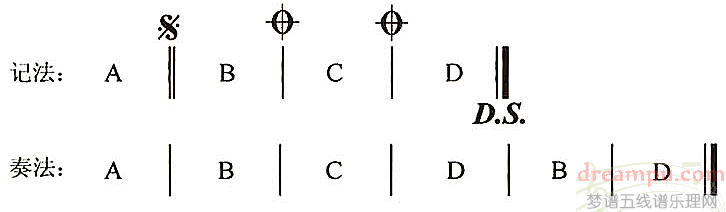

例如下面这个五线谱，就是 D.C. al Coda，正确演奏顺序为 1、2、3、4、5、6、1、2、3、4、7、8。


下面这个五线谱，就是 D.S. al Coda，正确演奏顺序为 1、2、3、4、5、6、2、3、4、7、8。


10.自由反复记号

记号 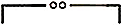，表示自由反复记号内的曲调，根据需要反复若干次。


混合型反复记号

1, 2, 3, 4, 1, 2, 3, 5, 6, 7, 8, 2, 3, 9, 10, 11, 12


### 意大利音乐术语

意大利文经常被用于音乐记谱，指导演奏者如何演奏音乐。音乐术语最早是在 17 世纪由意大利作曲家使用，自此之后传播到世界各地。

People often wonder why most musical terms are in Italian and not another language, but actually lots of other languages have been used by composers, in particular German and French. Italy was the birthplace of the Renaissance Era (from about 1350 onwards), and was the place where classical music really took off a few centuries later. Composers from many countries used Italian terms because they were associated with musical excellence, and were understood around the world. Today people think of Italian terms as the normal language in music. 

#### 速度（Tempo）

谱上指示的每分钟拍数（BPM）仅是一般的指引。在现代乐中，节拍器标记指示的 BPM 拍数（例如 ♩ = 120）可以作为速度标记的补充或替代。以下列表为速度标记：

| 术语               | 意义                   | BPM        |
| :----------------- | :--------------------- | :--------- |
| *adagietto*        | 小柔板，比柔板稍快     | 72-76      |
| *adagio*           | 柔板                   | 66-76      |
| *allegretto*       | 稍快板，比快板稍快     | 112-120    |
| *allegrissimo*     | 极快的快板             | 172-176    |
| *allegro*          | 快板                   | 120-168    |
| *allegro moderato* | 中庸的快板，比快板稍慢 | 116-120    |
| *andante*          | 行板                   | 76-108     |
| *andante moderato* | 中庸的行板，比行板稍快 | 92-112     |
| *andantino*        | 小行板，比行板稍快     | 80-108     |
| *grave*            | 缓板                   | 25-45      |
| *larghetto*        | 稍缓板，比慢板稍快     | 60-66      |
| *larghissimo*      | 极慢板                 | 25 或以下  |
| *largo*            | 慢板                   | 40-60      |
| *lento*            | 慢                     | 45-60      |
| *moderato*         | 中板                   | 108-120    |
| *prestissimo*      | 最急板                 | 200 或以上 |
| *presto*           | 急板                   | 168-200    |
| *vivace*           | 活泼的快板             | 140-176    |
| *vivacissimo*      | 极活泼的快板           | 172-176    |


Larghissimo* – very, very slow (24 bpm and under)

*Adagissimo* – very slow (24-40 bpm)

*Grave* – very slow (25–45 bpm)

*Largo* – slow and broad (40–60 bpm)

*Lento* – slow (45–60 bpm)

*Larghetto* – rather slow and broad (60–66 bpm)

*Adagio* – slow with great expression [[10\]](https://en.wikipedia.org/wiki/Tempo#cite_note-10) (66–76 bpm)

*Adagietto* – slower than *andante* (72–76 bpm) or slightly faster than *adagio* (70–80 bpm)

*Andante* – at a walking pace (76–108 bpm)

*Andantino* – slightly faster than *andante* (although, in some cases, it can be taken to mean slightly slower than *andante*) (80–108 bpm)

*Marcia moderato* – moderately, in the manner of a march [[11\]](https://en.wikipedia.org/wiki/Tempo#cite_note-11)[[12\]](https://en.wikipedia.org/wiki/Tempo#cite_note-12) (83–85 bpm)

*Moderato* – at a moderate speed (108–120 bpm)

*Andante moderato* – between *andante* and *moderato* (thus the name) (92–112 bpm)

*Allegretto* – by the mid-19th century, moderately fast (112–120 bpm); see paragraph above for earlier usage

*Allegro moderato* – close to, but not quite *allegro* (116–120 bpm)

*Allegro* – fast, quick, and bright (120–156 bpm) (*molto allegro* is slightly faster than *allegro*, but always in its range; 124-156 bpm)

*Vivace* – lively and fast (156–176 bpm)

*Vivacissimo* – very fast and lively (172–176 bpm)

*Allegrissimo* or *Allegro vivace* – very fast (172–176 bpm)

*Presto* – very, very fast (168–200 bpm)

*Prestissimo* – even faster than *presto* (200 bpm and over)

##### 速度的改变

速度標記通常標記在樂曲第 1 小節或轉換速度之處，在最高一行樂器的五線譜之上。在管弦樂總譜裏，速度記號也會出現在弦樂組之上，以讓指揮容易看見。而速度漸變的標記，如 *rit.* 或 *accel.*，在鋼琴或其他鍵盤類樂器的樂譜裏，常常標記在兩行之間。

下列为速度变化的术语和缩写。渐进式的变化术语可以用破折号来延伸，以表示变化的持续时间，例如 "*rit. _ _ _*".

| 术语                       | 缩写          | English                     | 意义                                                         |
| :------------------------- | :------------ | --------------------------- | :----------------------------------------------------------- |
| *a piacere*                |               |                             | 速度任由演奏者决定                                           |
| *a tempo*                  |               | At the original speed /time | 用於漸快和漸慢標記之後，表示回復漸快或漸慢之前的速度         |
| *rallentando*              | rall.         |                             | 渐慢，特別用於章節結束的地方                                 |
| *ritardando*               | rit., ritard. |                             | 渐慢                                                         |
| *ritenuto*                 | riten.        |                             | 立即慢下来                                                   |
| *stretto*                  |               |                             | 立即加快                                                     |
| *rubato*                   |               |                             | 弹性速度                                                     |
| *Allargando*               |               |                             | 逐漸減慢轉強，特別用於作品結束的地方                         |
| *stringendo*               |               |                             | 渐快，字面上有“收紧”之意                                     |
| *accelerando*              | accel.        | Gradually getting faster    | 渐快                                                         |
| *Meno Mosso*               |               |                             | 緩慢點                                                       |
| *Pi ù Mosso*                |               |                             | 稍快點                                                       |
| *Tempo primo* 或 *Tempo I* |               |                             | 如果樂曲有多次速度轉變，Tempo primo 表示回復樂曲一開始的速度，例如一首三段曲式的作品，可以是 Allegro - Andante - Tempo Primo |

###### 中國音樂的速度

傳統中國音樂亦有慢板、中板、快板、流水板的標記，稱為板眼，在傳統器樂或戲曲的樂譜裏常見，通常標記於 1 段樂曲之前或 1 段唱詞之前。

在戲曲音樂，板眼更接近於西方的拍號而非速度記號：慢板通常指「一板三眼」（又稱一板三叮），即 1 個重拍，3 個輕拍，可視為西方的四拍子。而中板是「一板一眼」，可視為西方的兩拍子；快板或流水板是「有板無眼」，可視為西方的一拍子。

中國音樂的引子或尾聲常常是「散板」，散板的意思是沒有固定的節奏，演奏者可以自行決定每個音的長度，作彈性的快慢處理，在意義上和古典音樂的 Senza misura（沒有節拍）和 ad libitum（自由節拍）相近。

因為沒有準確的速度標記，中國戲曲音樂和傳統中國音樂的速度常常是約定俗成，即某一體裁習慣上是以某一速度演奏，則會依據這種傳統演奏。但同一樂曲的速度，在不同地方和不同流派可以有不同的演繹。

而 20 世紀以來，中國音樂受到西方影響，作曲家亦常常會加上西式的速度和感情標記。

#### 力度（Dynamics）

##### Static Dynamics

下列为常见的力度记号；这些记号表示响度的相对变化，并不是指特定的音量级别。与其他意大利术语记号相反的是，力度记号标记通常会写在五线之下，或介于两个五线之间。

| 术语            | 符号      | 意义                   |
| :-------------- | :-------- | :--------------------- |
| *pianississimo* | ***ppp*** | 最弱                   |
| *pianissimo*    | ***pp***  | 极弱、very quiet       |
| *piano*         | ***p***   | 弱、quietly、softly    |
| *mezzo piano*   | ***mp***  | 中弱、moderately quiet |
| *mezzo forte*   | ***mf***  | 中强、moderately loud  |
| *forte*         | ***f***   | 强、loudly             |
| *fortissimo*    | ***ff***  | 极强、very loud        |
| *fortississimo* | ***fff*** | 最强                   |

piano 曾经的名字叫“pianoforte”，因为它能演奏很广阔的力度。

##### 力度变化（Changing Dynamics、Dynamic changes）

渐强渐弱符号 ( ) 用于表示几个小节的力度变化，而 *cresc.* 和 *dim.* 则用来表示较长乐句的力度变化。术语的指示则可以用破折号来延伸，以表示变化的持续时间。

| 术语                             | 符号                                                         | 意义                         |
| :------------------------------- | :----------------------------------------------------------- | :--------------------------- |
| *crescendo*                      | ***cresc.*** 或 （hairpin) | 渐强                         |
| *diminuendo*、decrescendo        | ***dim.*** 或 （hairpin) | 渐弱                         |
| *fortepiano*                     | ***fp***                                                     | 强后即弱                     |
| *sforzando, forzando, szforzato* | ***sfz***, ***sf*** 或 ***fz***                              | 突强（用于音符或和弦）       |
| *rinforzando*                    | ***rfz*** 或 ***rf***                                        | 突强（用于音符、和弦或乐句） |

#### 技巧

下列为常见的演奏技巧术语，这些术语指示演奏者使用特定的演奏技巧，以产生所需的声响。

Articulations specify the length, volume, and style of attack of individual notes.

| 术语             | 缩写        | 意义                                                         |
| :--------------- | :---------- | :----------------------------------------------------------- |
| *arpeggio*       | arp.        | 琶音；指和弦的音由低到高或由高到低依次奏出                   |
| Accent           |             | 重音。An accent indicates that a note should be played louder, or with a harder attack than surrounding unaccented notes. It may appear on notes of any duration.<br /> [](https://en.wikipedia.org/wiki/File:Music-marcato.svg) |
| Marcato          |             | A marcato marking indicates that the note should be played louder or more forcefully than a note with a regular accent mark. In organ notation, this sign often does not indicate marcato, but instead that a pedal note should be played with the toe. When printed above the note it indicates the right foot, and below the note indicates the left foot.<br /> [](https://en.wikipedia.org/wiki/File:Music-strong-marcato.svg) |
| *glissando*      | gliss.      | 滑音；指两个音之间连续变化音高，以达到上下运行的效果         |
| *legato*         |             | 连奏又称连音，是一种音与音平滑相连的演奏法                   |
| *mano destra*    | m.d.        | 右手                                                         |
| *mano sinistra*  | m.s.        | 左手                                                         |
| *con sordino*    |             | 加弱音踏板，或者不加延音踏板（以钢琴为例）                   |
| *senza sordino*  |             | 不加弱音踏板，或者加延音踏板（以钢琴为例）                   |
| *pizzicato*      | pizz.       | 拨奏；用手指拨出声响，而不是使用弓来拉奏                     |
| *portamento*     | port.       | 滑音；指两个音之间连续变化音高，以达到上下运行的效果         |
| *tutti*          |             | 乐团全体演奏                                                 |
| *staccato*       | stacc.      | 断音奏法；音与音之间不连接 <br /> [](https://en.wikipedia.org/wiki/File:Music-staccato.svg) |
| *staccatissimo*  | staccatiss. | 特短断音奏法；音与音之间明显分隔 <br /> [](https://en.wikipedia.org/wiki/File:Music-staccatissimo.svg) |
| tenuto           |             | 保持音                                                       |
| Fermata or Pause |             | 延音记号。A fermata indicates that a note, chord, or rest is sustained longer than its written value. It will usually appear on all parts in an ensemble. The fermata is held for as long as the performer or conductor desires.<br /> [](https://en.wikipedia.org/wiki/File:Music-fermata.svg) |
| *vibrato*        |             | 抖音；音符的音调快速反复微变化                               |

#### 情绪

以下为常用的情绪术语。这些术语可帮助演奏者通过节奏、力度和演奏技巧来捕捉作品的情绪。

| 术语         | 意义             |
| :----------- | :--------------- |
| *agitato*    | 激动、急促的     |
| *animato*    | 活泼、精神焕发的 |
| *cantabile*  | 如歌似的         |
| *con amore*  | 带有爱的         |
| *con brio*   | 充满活力的       |
| *con fuoco*  | 如火如荼的       |
| *con moto*   | 活跃的           |
| *dolce*      | 甜蜜的           |
| *doloroso*   | 悲伤的           |
| *energico*   | 精力充沛的       |
| *espressivo* | 充满感情的       |
| *grazioso*   | 优雅的           |
| *leggiero*   | 轻快的           |
| *maestoso*   | 庄严的           |
| *marcato*    | 用力的           |
| *risoluto*   | 坚决有力的       |
| *scherzando* | 诙谐的           |
| *sostenuto*  | 延宕的           |
| *tenuto*     | 持续的           |
| *tranquillo* | 宁静的           |

#### 反复记号（Repeats）

下列为反复记号。这些反复记号指示演奏者重复演奏作品的某些段落。

| 术语                | 记号                       | 意义                                                         |
| :------------------ | :------------------------- | :----------------------------------------------------------- |
| *Fine*              |                            | 反复到此记号结尾                                             |
| *Coda*              |    | 表示该段落为乐章结尾                                         |
| *Segno*             |  | 反复的开端或结尾                                             |
| *Da Capo*           | D.C.                       | 从头再奏                                                     |
| *Da Capo al Fine*   | D.C. al Fine               | 从头再奏后，演奏到 *Fine* 记号为止                           |
| *Da Capo al Coda*   | D.C. al Coda               | 从头再奏后，演奏到  记号为止（有时会以 *To Coda* 取代），再跳至第二个记号完结 |
| *Da Capo al Segno*  | D.C. al Segno              | 从头再奏后，演奏到  记号为止       |
| *Dal Segno*         | D.S.                       | 从  记号再奏                       |
| *Dal Segno al Fine* | D.S. al Fine               | 从  记号再奏，演奏到 *Fine* 记号为止 |
| *Dal Segno al Coda* | D.S. al Coda               | 从  记号再奏，演奏到  记号（有时会以 *To Coda* 取代），再跳至第二个记号完结 |

#### 一般术语

下列为一般术语，这些术语一般用来修饰其他术语 *allegro molto*（非常快）和 *con amore*（带有爱的）。

| Term            | Meaning                      |
| :-------------- | :--------------------------- |
| *ad libitum*    | 任意（通常指的是速度和风格） |
| *assai*         | 非常                         |
| *con*           | 带有                         |
| *ma*            | 但                           |
| *ma non tanto*  | 但不太                       |
| *ma non troppo* | 但不过分                     |
| *meno*          | 较不                         |
| *molto*         | 甚                           |
| *non*           | 不                           |
| *pi ù*           | 更                           |
| *poco*          | 稍微                         |
| *poco a poco*   | 逐渐                         |
| *senza*         | 无、不带有                   |
| *simile*        | 按照、同                     |
| *subito*        | 突然、快速                   |

## ABC notation

文档：

* https://abcnotation.com/wiki/abc:standard:v2.1
* http://www.stephenmerrony.co.uk/uploads/ABCquickRefv0_6.pdf
* http://abcplus.sourceforge.net/abcplus_en.pdf

## 调（广义上的 Mode, 和声学范畴）

### 调（Key）

调式的中心音，简单说就是音阶开始的音。Key of C 是说主音为 C。

主音在音乐中可以通过以下方式加以确立：

* 作为首音、尾音
* 作为最高/低音
* 作为最响的音
* 作为反复出现的音

当主音确立后，其他音听起来的音响效果都将相对于它，它们相对于主音的音程也将创造出张力与解决效果，因而也尝试了音的倾向性。

### 音阶（Scale）

定义：调式中的音，按照高低次序（上行或下行），由主音到主音排序起来就叫做音阶。

在记忆构成大调/小调的音级时，可以先将该调的基础音级写出，再在基础音级的基础上根据音级关系加上#或 b 记号。


|         | Tonic (1st) | 2nd  | 3rd    | 4th    | 5th  | 6th  | 7th    | Tonic |
| ------- | ----------- | ---- | ------ | ------ | ---- | ---- | ------ | ----- |
| C Major | C           | D    | E      | F      | G    | A    | B      | C     |
| G Major | G           | A    | B      | C      | D    | E    | **F#** | G     |
| D Major | D           | E    | **F#** | G      | A    | B    | **C#** | D     |
| F Major | F           | G    | A      | **Bb** | C    | D    | E      | F     |

最常见的大调音阶：C/G/D/F 大调音阶。

G 大调音阶有个 F#；D 大调音阶有 F#和 C#；F 大调有个 Bb

#### 全音阶（Whole tone scale）

全音音阶，由 6 个音组成，音阶中所有音之间的音程都是全音。

##### 特征

这种音阶回避了半音的倾向性，因而具有一种游移不定的独特魅力。

##### 组成音

主音、上主音、大中音、重属导音、小下中音、下主音。

##### 全音音阶表

| [主音](https://zh.wikipedia.org/wiki/主音)         | ♭ C                                                           | ♭ G                                                           | ♭ D                                                           | ♭ A   | ♭ E   | ♭ B   | F    | C    | G    | D    | A    | E    | B    | ♯ F   | ♯ C                                                           | ♯ G                                                           | ♯ D                                                           | ♯ A                                                           |
| -------------------------------------------------- | ------------------------------------------------------------ | ------------------------------------------------------------ | ------------------------------------------------------------ | ---- | ---- | ---- | ---- | ---- | ---- | ---- | ---- | ---- | ---- | ---- | ------------------------------------------------------------ | ------------------------------------------------------------ | ------------------------------------------------------------ | ------------------------------------------------------------ |
| [上主音](https://zh.wikipedia.org/wiki/上主音)     | ♭ D                                                           | ♭ A                                                           | ♭ E                                                           | ♭ B   | F    | C    | G    | D    | A    | E    | B    | ♯ F   | ♯ C   | ♯ G   | ♯ D                                                           | ♯ A                                                           | ♯ E                                                           | ♯ B                                                           |
| [大中音](https://zh.wikipedia.org/wiki/大中音)     | ♭ E                                                           | ♭ B                                                           | F                                                            | C    | G    | D    | A    | E    | B    | ♯ F   | ♯ C   | ♯ G   | ♯ D   | ♯ A   | ♯ E                                                           | ♯ B                                                           | [](https://zh.wikipedia.org/wiki/File:DoubleSharp.svg) F | [](https://zh.wikipedia.org/wiki/File:DoubleSharp.svg) C |
| 重属 [导音](https://zh.wikipedia.org/wiki/導音)     | F                                                            | C                                                            | G                                                            | D    | A    | E    | B    | ♯ F   | ♯ C   | ♯ G   | ♯ D   | ♯ A   | ♯ E   | ♯ B   | [](https://zh.wikipedia.org/wiki/File:DoubleSharp.svg) F | [](https://zh.wikipedia.org/wiki/File:DoubleSharp.svg) C | [](https://zh.wikipedia.org/wiki/File:DoubleSharp.svg) G | [](https://zh.wikipedia.org/wiki/File:DoubleSharp.svg) D |
| [小下中音](https://zh.wikipedia.org/wiki/小下中音) | [](https://zh.wikipedia.org/wiki/File:Doubleflat.svg) A | [](https://zh.wikipedia.org/wiki/File:Doubleflat.svg) E | [](https://zh.wikipedia.org/wiki/File:Doubleflat.svg) B | ♭ F   | ♭ C   | ♭ G   | ♭ D   | ♭ A   | ♭ E   | ♭ B   | F    | C    | G    | D    | A                                                            | E                                                            | B                                                            | ♯ F                                                           |
| [下主音](https://zh.wikipedia.org/wiki/下主音)     | [](https://zh.wikipedia.org/wiki/File:Doubleflat.svg) B | ♭ F                                                           | ♭ C                                                           | ♭ G   | ♭ D   | ♭ A   | ♭ E   | ♭ B   | F    | C    | G    | D    | A    | E    | B                                                            | ♯ F                                                           | ♯ C                                                           | ♯ G                                                           |

#### 变化音阶（alt 音阶、Altered Scale）

用于爵士乐中。

##### 属和弦的变化音（Alterations in Dominant Chords）

把属和弦里的某一些音，升高或降低一个半音。这些音通常是 5 度或 9 度音，而 5 度与 9 度都可以升高或降低，因此可以得到 b5（#11）、#5（b13）、b9、#9。如在 C9 和弦（C-E-G-Bb-D）中，G 可以弹 G/Gb/G#，而 D 可以弹 D/Db/D#，因此 C9 和弦可以有 9 种（3*3）弹法。而它的音响效果要靠多听。

##### 含义

以 X 为主音的变化音阶就是：X 升高半音后的旋律小音阶。如以 C 为主音的变化音阶就是：Db 旋律小音阶（D ♭、E ♭、F ♭、G ♭、A ♭、B ♭、C、D ♭），其中，E ♭音等于 D ♯音，F ♭等于 E 音，A ♭音等于 G ♯音。把这几个替换一下，便可以更直观地看到 Alt 音阶与旋律小调音阶的联系（D ♭、D ♯、E、G ♭、G ♯、B ♭、C、D ♭）：


##### 运用

在爵士乐中，通常可以用 MixoLydian（1 2 3 4 5 6 b7）这条音阶来演奏属七和弦，因为这条音阶的 1 3 5 b7 刚好组成一个属七和弦（图中红圈里的音）。


而为了获得更加丰富、更加有张力和紧张感的声响效果，以突出乐曲的灵活，避免死板，因而会采用变化音阶来演奏属七和弦。

##### 練習方式

需要反复练习。練習彈每一個調，左手彈省略五度音的屬七和弦，右手彈 Altered Scale。

##### 来源——属七和弦

Alt 音阶与属七和弦联系得十分紧密的。Alt 音阶在一定程度上可以说就是由属七和弦发展过来的，或者说，为了迎合属七和弦的听感而被制造出来的。

C 属七和弦的构成音为：C、E、G、B ♭，而在属七和弦中，对其和弦性质影响最小的音便是五级音。所以我们可以去掉 C 属七和弦里的 G 音，保留 C、E、B ♭三个音。然后按照“变化”的原则，把音阶里其余的所有音（D、F、G、A）全部改成变化音，比如 D 音我们可以改成 D ♭和 D ♯两个音、G 音可以改成 G ♭和 G ♯、A 音可以改成 Ab 和 A ♯，F 音只能改成 F ♯，但是，A ♯和 B ♭是等音关系，所以 A ♯省去不要。这样一来，我们就可以得到以 C 为主音的 Alt 音阶了：


如果继续放在 C 属七和弦的框架内看待这个和弦，那么除了原始的 C、E、B ♭三个音之外，其余的音我们可以理解成该和弦的♭ 9 音、♯ 9 音、♯ 11 音、♭ 13 音。

#### 减音阶（Diminished Scale。八声音阶。爵士乐常用）

两个减七和弦合在一起的音阶。

只用记忆以 C、C#、D 为开始的三组半全减音阶，就可以记住所有的减音阶，另外 9 个音开始的音阶都是重复的

在平常的学习中，我们习惯从音阶推导和弦。但是在减音阶的学习中，我们反其道而行之，用减七和弦推导减音阶，反而更有效。

##### 推导步骤

1. 推导减音阶的根音。如从 C 减七和弦：C、Eb、Gb、Bbb（A），可以推导出 C 减音阶的根音 C、三音 E b、五音 Gb 和七音 Bbb（A）。
2. 推导延伸音。如果要给一个和弦加延伸音，这个延伸音必须是和弦音的大九度。因此由于 C 减七和弦是由 C、Eb、Gb、Bbb（A）组成的，那么它的延伸音分别有 D（C 的大九度音），F（Eb 的大九度音），Ab（Gb 的大九度音），B（Bbb（A）的大九度音）。
3. 组合根音与延伸音，得到减音阶。将 C 减七和弦内音和它的延伸音进行组合，就可以得到一条 C 减音阶了，它们分别是 C、D、Eb、F、Gb、Ab、Bbb（A）、B。这条音阶包含了 8 个音

##### 种类

* 全半减音阶（Whole-half diminished scale）。音阶相邻两个音的音程关系是全半交替的。如 C 减音阶（C、D、Eb、F、Gb、Ab、Bbb（A）、B）。C 和 D 是全音，D 和 Eb 是半音，Eb 和 F 是全音，F 和 Gb 是半音，Gb 和 Ab 是全音，Ab 和 Bbb（A）是半音，Bbb 和 B 是全音
* 半全减音阶（Half-whole diminished scale）。音阶相邻两个音的音程关系是半全交替的。

注意两种音阶中的音是完全一样的。如 D 开头的半全减音阶和#D 开头的全半音阶，里面的音完全一样。


在 C 半全减音阶中，包含了一个 C7 属七和弦（CEG bB），音阶中的另外 4 个音对于 C 和弦的角度来看，bD 是降九音，#D 是升九音，#F 是升十一音，A 是十三音，这四个音都是在属七和弦上常用的变化音或延伸音，因此 C 的半全减音阶 = C7 和弦+四个常用的变化音/延伸音，因为很多变化音，所以围绕 C7 和弦乱弹变化音，也比较好听。

#### 钢琴音阶图

Major——Relative Minor

C   Am

C#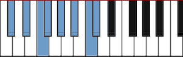  Bbm

D   Bm

D#  Cm

E   C#m

F   Dm

F#  Ebm

G  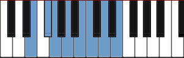 Em

G#  Fm

A   F#m

A#  Gm

B   Abm

Pentatonic Major——Pentatonic Minor

 C   Am

C#  Bbm

D   Bm

D# 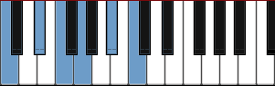 Cm

E   C#m

F  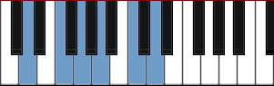 Dm

F#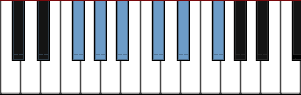  Ebm

G   Em

G# 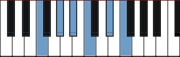 Fm

A   F#m

A#  Gm

B   Abm

### 音律（Temperament）

“音律”简称“律”，是指乐音体系中各音的准确高度及音高的相互关系。确定每个音准确高度的方法，称为律制。目前，国际上通用的律制主要有十二平均律、五度相生律、纯律三种。

其中，十二平均律在世界的应用最为广泛。

#### 十二平均律（Equal Temperament）

指将纯八度（如 c1-c2），分成十二个均等的部分（即半音）。

调号：C	#C	D	#D	E	F	#F	G	#G	A	#A	B
（共 12 个。从左到右，由低至高）

##### 半音阶（半音音阶，Chromatic Scale）

在一个八度中，一连串所有的十二个音符

调式：在一个音阶中，环绕一个主音的和声关系构建出的音与音之间的排列模式（如：全全半全全全半）

#### 五度相生律（Pythagorean Intonation）

以分音列中的第二分音与第三分音之间的音高关系，连续相生而求得各音（律）的准确音高的方法，叫作“五度相生律”。中国的五度相生律采用三分损益法产生，是世界上最早的求律方法。根据五度相生律定出的 C、D、E、F、G、A、B 七个音的高低关系，与十二平均律中的七个音，音名相同，但音的高低却不完全相同。这种音高上的差异，就是由于定律法的不同而产生的。

#### 纯律

以分音列的第二分音和第三分音之间的纯五度，再插入一个第四分音与第五分音的大三度作为求律的方法，叫作“纯律”。欧洲发现和使用纯律的历史比中国晚得多，南北朝时期，中国的琴律已广泛以七弦十三徽徽位作为定弦标准音使用，这说明纯律的律学理论在当时已经具体运用于实践。

### 调号（Key Signature）

练习题：https://tonesavvy.com/music-practice-exercise/265/key-signature-grand-staff-identification-game/

调号表明了一段旋律的调式，并标明音符的升或降。线、间上调性的临时升降记号会影响旋律中所有的音符，除非有一个还原号。

When we write music which mostly uses notes from the scale of C major and sounds good finished with a C, we say that the music is "in the key of C major" or "in C a major".  

#### 记忆技巧（极为重要）

最好的记忆方法其实是：直接记忆，而不需要推算。

推算技巧：

* 调号中每个音的升降号位置是固定的

* 如果升降号都没有，那就死记它是 C 大调、A 小调

* 如果是升号，那就看最后一个升号在哪个音上：

  * 给它加一个半音，得出来的音就是 X 大调的主音

  * 而给它减一个全音，那得出的音就是 X 小调的主音。

  * 如调号只有一个 F#，那就给 F#加一个半音，得到 G，那它就是 G 大调。而给它减去一个全音，得到 E，那它就是 E 小调。


  注意：E#升高一个半音是 F#、B#升高一个半音是 C#。

* 如果是降号：

  * 判断大调：看倒数第二个降号在哪个音上，那个音就是 X 大调的主音
  * 判断小调：给倒数第一个降号的音加上两个全音，那个音就是 X 小调的主音。如果只有一个降号，那就死记它是 F 大调/D 小调

死记 C 大调，然后记 G、D、A、E、B、F、C，按顺序记住它们的大调号，然后再通过减去 3 个半音，记住它们的小调。对于每个调新增的音，则记住大调从 F#开始加起，


|                        Key signature                         |                    Major key                     |                    Minor key                     |
| :----------------------------------------------------------: | :----------------------------------------------: | :----------------------------------------------: |
| [](https://en.wikipedia.org/wiki/File:Treble_clef_with_empty_staff.svg) no sharps or flats | [C major](https://en.wikipedia.org/wiki/C_major) | [A minor](https://en.wikipedia.org/wiki/A_minor) |

|                        Key signature                         | Added ♯ |                        Major key                        |                        Minor key                        |                        Key signature                         | Added ♭ |                       Major key                        |                       Minor key                        |
| :----------------------------------------------------------: | :-----: | :-----------------------------------------------------: | :-----------------------------------------------------: | :----------------------------------------------------------: | :-----: | :----------------------------------------------------: | :----------------------------------------------------: |
| [](https://en.wikipedia.org/wiki/File:G-major_e-minor.svg) 1 sharp |   F ♯    |    [G major](https://en.wikipedia.org/wiki/G_major)     |    [E minor](https://en.wikipedia.org/wiki/E_minor)     | [](https://en.wikipedia.org/wiki/File:F-major_d-minor.svg) 1 flat |   B ♭    |    [F major](https://en.wikipedia.org/wiki/F_major)    |    [D minor](https://en.wikipedia.org/wiki/D_minor)    |
| [](https://en.wikipedia.org/wiki/File:D-major_b-minor.svg) 2 sharps |   C ♯    |    [D major](https://en.wikipedia.org/wiki/D_major)     |    [B minor](https://en.wikipedia.org/wiki/B_minor)     | [](https://en.wikipedia.org/wiki/File:B-flat-major_g-minor.svg) 2 flats |   E ♭    | [B ♭ major](https://en.wikipedia.org/wiki/B-flat_major) |    [G minor](https://en.wikipedia.org/wiki/G_minor)    |
| [](https://en.wikipedia.org/wiki/File:A-major_f-sharp-minor.svg) 3 sharps |   G ♯    |    [A major](https://en.wikipedia.org/wiki/A_major)     | [F ♯ minor](https://en.wikipedia.org/wiki/F-sharp_minor) | [](https://en.wikipedia.org/wiki/File:E-flat-major_c-minor.svg) 3 flats |   A ♭    | [E ♭ major](https://en.wikipedia.org/wiki/E-flat_major) |    [C minor](https://en.wikipedia.org/wiki/C_minor)    |
| [](https://en.wikipedia.org/wiki/File:E-major_c-sharp-minor.svg) 4 sharps |   D ♯    |    [E major](https://en.wikipedia.org/wiki/E_major)     | [C ♯ minor](https://en.wikipedia.org/wiki/C-sharp_minor) | [](https://en.wikipedia.org/wiki/File:A-flat-major_f-minor.svg) 4 flats |   D ♭    | [A ♭ major](https://en.wikipedia.org/wiki/A-flat_major) |    [F minor](https://en.wikipedia.org/wiki/F_minor)    |
| [](https://en.wikipedia.org/wiki/File:B-major_g-sharp-minor.svg) 5 sharps |   A ♯    |    [B major](https://en.wikipedia.org/wiki/B_major)     | [G ♯ minor](https://en.wikipedia.org/wiki/G-sharp_minor) | [](https://en.wikipedia.org/wiki/File:D-flat-major_b-flat-minor.svg) 5 flats |   G ♭    | [D ♭ major](https://en.wikipedia.org/wiki/D-flat_major) | [B ♭ minor](https://en.wikipedia.org/wiki/B-flat_minor) |
| [](https://en.wikipedia.org/wiki/File:F-sharp-major_d-sharp-minor.svg) 6 sharps |   E ♯    | [F ♯ major](https://en.wikipedia.org/wiki/F-sharp_major) | [D ♯ minor](https://en.wikipedia.org/wiki/D-sharp_minor) | [](https://en.wikipedia.org/wiki/File:G-flat-major_e-flat-minor.svg) 6 flats |   C ♭    | [G ♭ major](https://en.wikipedia.org/wiki/G-flat_major) | [E ♭ minor](https://en.wikipedia.org/wiki/E-flat_minor) |
| [](https://en.wikipedia.org/wiki/File:C-sharp-major_a-sharp-minor.svg) 7 sharps |   B ♯    | [C ♯ major](https://en.wikipedia.org/wiki/C-sharp_major) | [A ♯ minor](https://en.wikipedia.org/wiki/A-sharp_minor) | [](https://en.wikipedia.org/wiki/File:C-flat-major_a-flat-minor.svg) 7 flats |   F ♭    | [C ♭ major](https://en.wikipedia.org/wiki/C-flat_major) | [A ♭ minor](https://en.wikipedia.org/wiki/A-flat_minor) |

注意：新加入的 b 或#音，都是根据五度循环圈加入的。

### 形成 "调" 有三个条件

1.有一个主音 (Root)。主音也就是根音，最重要的音。调的名称以根音命名，之后的第二个名称表示调的音程关系。

（1）C Major：C 为根音，是一种大调音程关系。

（2）G Mixolydian：G 为根音，Mixolydian (调五) 的关系。

2.具备形成音阶的音程关系 (Interval)。形成音阶的关系有两个条件：

（1）有限的音程关系所构成 "音群"。有限的音程指的是：可以让音阶回到根音，造成关系不断反复的关系结构。像 C D E F G A B C <-- 一定是从 C 会回到自己 C，如果回不来，就无法定义成音阶。

（2）音群必须有先后次序。音的排列有先后次序，C D E 跟 D E C 是不一样的。

3.形成有次序的顺阶和弦观念：简单说，就是和声系统。条件一二是确立音阶的基本要素，他们成立之后，才能够继续定义其顺阶和弦。顺阶和弦是用音阶作为其组成的元素，换句话说，顺阶和弦的组成音必定落在音阶里。

所以，我们一般在说一首曲子是什么调时，会说： "C 大调"，或者 "a 小调"。"a 小调" 就等于告诉大家歌曲的基本信息为：

- 曲子使用的音阶根音 (Root, 或说是主音) 为 A

- 音程关系为小调 => 1 2 b3 4 5 b6 b7 => W H W W H W W

- 有一组顺阶和弦通过此音阶。歌曲中超出顺阶和弦以外的，要用其他理论解释。（以七和弦为例）

  | Level    | Ⅰ     | Ⅱ    | Ⅲ    | Ⅳ     | Ⅴ    | Ⅵ    | Ⅶ     | 备注/说明 |
  | -------- | ----- | ---- | ---- | ----- | ---- | ---- | ----- | --------- |
  | 顺阶和弦 | Cmaj7 | Dm7  | Em7  | Fmaj7 | G7   | Am7  | Bm7-5 | 不断反复  |

当一个乐句，或者一个段落的和弦进行落在其顺阶和弦上，同时旋律也落在音阶上，则该段落可能为 "某调"。"可能" 是因为还没确定根音到底是谁，因为相同的音阶可能 "同时" 符合很多音程关系，乐理分析的专有名词叫做“关系调”。
要确立调的根音，可以参考歌曲的终止或者起始。接下来 "调式" 将解释当根音落在不一样的起始点的时候，他们的意义就不一样了。

### 调式（Mode）

以主音为基础计算出来的，固定的音程结构。西洋音乐有大调式与小调式之分。

调式是以 "调" 的观念为基础，但是从不同角度理解的概念。
先看一般的理解方式，大部分都会从有一样的音阶音群来看，像是 C 大调跟 G Mixolydian 为例，他们有着同样的音阶音群，但是他们的根音分别为： C 跟 G。他们使用同样的音，但是这些音有着不同的次序：

| Mode               | Ⅰ    | Ⅱ    | Ⅲ    | Ⅳ    | Ⅴ    | Ⅵ    | Ⅶ    | Interval |
| ------------------ | ---- | ---- | ---- | ---- | ---- | ---- | ---- | -------- |
| C Ionian / C Major | C    | D    | E    | F    | G    | A    | B    | WWHWWWH  |
| C Mixolydian       | G    | A    | B    | C    | D    | E    | F    | WWHWWHW  |

使用到的 "音" 相同，但是次序不同，所以就表面上而言，他们似乎一样，但是实际上，他们却有不同的音程关系。

在聆听时，我们听的应该是音程关系，然后配合加上终止式，然后来决定歌曲到底是哪一个调式。
另外一个最常见的例子就是关系大小调，例如：

| Scale               | Ⅰ    | Ⅱ    | Ⅲ    | Ⅳ    | Ⅴ    | Ⅵ    | Ⅶ    | Interval |
| ------------------- | ---- | ---- | ---- | ---- | ---- | ---- | ---- | -------- |
| C Ionian / C Major  | C    | D    | E    | F    | G    | A    | B    | WWHWWWH  |
| A Aeolian / A Minor | A    | B    | C    | D    | E    | F    | G    | WHWWHWW  |

他们也有相同的音群，但是却有着不同的根音，他们的音程关系却是不一样的。

所以不难发现，学习调式的时候，实际上音程的关系是非常重要的，也就是跟一般 "调性" 的差异是在于音程关系的不同。所以把第一段调性提到的 "构成调性三个要素" 的第二个点，以 C Ionain 和 C Aeolian 比较，如下表：


这样就很明显的发现，根音一样，但是音程不一样。这也就是我们聆听调式音乐时实际上和调性音乐的差异。

### 转调（Transpose）

"调" 的观念建立于根音、音阶的音程关系、顺阶和弦。一般来说，所谓 "转调" 指的是调的根音改变(其实音程关系改变也算，但习惯用调式来解释音程改变)，其他不变。

例子：由 C Major 改变成 G Major (属调关系)。

- G Major 的根音为 G
- 为大调关系 W W H W W W H
- 使用音群已经变成： G A B C D E F#
- 顺阶和弦却已经变成：GM7 Am7 Bm7 CM7 D7 Em7 F#m7-5

如果是从 C Major 转到 G Mixolydian：

- 他们的根音不一样： C& G
- 音程关系不同，但使用音群一样都是： C D E F G A B
- 使用的和弦一样

从上面 C Major -> G Major，和 C Major -> G Mixolydian 的例子就可以很清楚，调式跟转调之间的差异性。

由一个调进行到另一个调，或是由主调（基本，稳定的调性）进行到副调（从属，不稳定的调性）称为转调。转调可以改变调号或不改变调号，可以改变调式或不改变调式，但在不改变调式的情况下必然要改变调式主音。

#### 中介和弦转调

原调和新调中都存在的和弦，叫做共同和弦，可以用做转调的中介和弦。比如 G 大调和 C 大调中都存在 A-C-E 这个和弦，那么从 G 大调转到 C 大调时，就可以先进行到 A-C-E 这个和弦，然后再从这里接到 C 大调去。

把乐曲从当前调移到其他调时，调和调之间必须有共同和弦过度，两个调之间在功能上来讲，大多是从主调（1）转到他的下属（4）或者属调（5）上。

转调的概念是建立在首调唱名法的基础上，对于固定调，不存在转调

方法：找到目标调的 V 级属和弦

例如：从 C 大调到 bE 大调，则先找到 bE 大调的 V 级和弦，即 bB7。然后就可以先进行到 bB7 和弦，然后再从这里接到 bE 大调去。（补充：下例挂四和弦用来丰富和弦色彩，bE 之后的旋律是 Leading Bass）


突然转到 E 大调的原因是：Fm、bB7 和转调后的 E 构成 251，听起来很舒服


例如首段 C 大调，中段 G 大调，再现段 C 大调，此时中段可以称作转调

#### 转调练习

练习转调可以强制人去分析乐曲的和声关系（如级数），但对于初学者来说，练习转调的性价比确实比较低。因为在初学阶段，既不需要做即兴转调，也不需要配合别人去转调，并且转调需要非常大量的时间与练习，练习的性价比不高。


五线谱标记的是绝对音高，但在练习转调时，要有意识地将乐曲的音符转换成音级（即1、2、3...，相对音高）。

* 同时弹奏原调的音，与目标调的音。如同时弹奏 1 级音。
* 看着谱子，将已经练的比较熟的曲子，转调到目标调上练习。

### 转调与调式的应用

转调与调式经常混用，流行歌里常见的例子就是关系大小调的混用，之后再转平行调。

转调可以很快的让歌曲转换到另外一个更强烈的情绪。但是情绪维持不会久，通常为了延续情绪，会改变节奏的配置，例如鼓增加镲片的次数。有些歌曲为了让情绪不断提升，甚至会转调两次。调式的情绪没那么强烈，但是情绪却可以一直延续很长。

**以 《GNR - Sweet Child O' Mine》 来说，** 歌曲的 A，B 两段都是 D Mixolydian，实际上整首歌曲都有接近 G 大调的感觉，因为 D Mixolydian 跟 G 大调刚好是关系调 (音阶音群一样)，所以熟悉自然大调的我们很容易判断成 G 大调。
但因为歌曲一开始的 D C G D 进行，加上终止的听觉概念：属和弦会在终止、主和弦会在起始，使的我们会觉得整首是围绕在 D 为主音的感觉，所以我们把判定为 D 为主音。然后以 D 大调做参考，分析 AB 两段的旋律，会发现 b7 这个特征音，符合 Mixolydian 的音程关系，所以歌曲 A B 两段判定为 D Mixolydian。
最后情绪一直延续到尾奏 Guitar Solo。尾奏 Guitar Solo 转成根音围绕在 E 音，但是因为旋律出现了很明显的和声小调，所以判定为 E 小调 (G 大调关系调，或解释为 E Aeolian)，和 A B 两段的 D Mixolydian 也是有间接关系，继续歌曲有延长情绪的效果。

一般编曲/作曲要改变情绪，转调和调式都是其中的技巧之一。除了这两种，还会利用编曲技巧来变换情绪，像是改变配器、声线、和声、对位、节奏配置、对点等。

### 离调（主化、Tonicization）

#### 借用和弦（调式混合、Borrowed chord、mode mixture、modal mixture、substituted chord、modal interchange、mutation）

作曲与即兴演奏的技法之一。

通常会向近关系调（参考五度循环圈）借调外和弦。比如：

| G 大调        | D 大调        |
| ------------ | ------------ |
| Gmaj（1 级）  | Gmaj（4 级）  |
| Am（2 级）    | Amaj（5 级）  |
| Bm（3 级）    | Bm（6 级）    |
| Cmaj（4 级）  | C#dim（7 级） |
| Dmaj（5 级）  | Dmaj（1 级）  |
| Em（6 级）    | Em（2 级）    |
| F#dim（7 级） | F#m（3 级）   |

上述的同一行的音通常可以互相替换，但通常不替换成减和弦。如在 G 大调中借用 D 大调和弦，通常可以借：Amaj、F#m，而不借 C#dim。

#### 含义

在一个调式当中，临时性地借用（Borrow）调外音和调外和弦，使得调性色彩发生转变，然后再次回到主调上的这种现象，叫做离调。

离调和移调并不相相同，离调足够简短，主音并没有消失或被取代，可以被看作是简短的或是转瞬即逝的移调，并没有真正切换到那个调式中去。

例子：《南山南》


这首歌是一个典型的 4536251（C 大调当中 F、G、Em、Am、Dm、G、C）的和弦进行

但是在第一段和弦进行的结尾 C 和弦之后，出现了一个本不属于 C 大调和弦的 C7 和弦，之后的 F 和弦又迅速后回到了 C 大调的和弦进行当中

这时，这个短暂出现的 C7 和弦就属于一种离调现象

#### 用法

离调最广泛的用法，就是“**重属七**”用法。

比如在 C 大调内，终止式 251 的和弦进行 Dm - G - C 三个和弦之中，可以在属级 G 和弦之前再放上一个和弦作为 **过渡和弦。** 此时就要暂时把要弹的调式想象成 G 大调，在 G 大调中，它的属七和弦是 D7，那么就在 G 和弦前面加上 D7 和弦。

利用这两个和弦，制造出从属级解决向主级的“**归属感**”，然后后面又回到了 C 大调之中，使得整体的和弦进行有一种 **递进上升的感觉。**

### 移调（Modulation）

含义：改变一首乐曲的调式

作用：使乐曲更容易演奏

#### 移调方法

* 等距离移动所有和弦的根音
* 新根音产生的和弦须与原和弦的类型相同

例子

* 若要将 1 = C 调的歌移到 1 = D 调，则因为 C 到 D 是一个全音的关系，所以需要把这首歌的所有的音符都提升一个全音
* 若要将 G 调的歌移到 C 调，即可以降低三全一半，也可以升高两全一半。因为音阶是一个循环体系。
* 若要将 Bb 和弦移调至 C，则因为 Bb 和 C 相差一个全音，因此该首曲子里的其他和弦变化为：Gmin7—> Amin7、Cmin7—> Dmin7、F7—> G7

注意：无论一首歌变成什么调，唱名是永远不变的。比如之前是 123（doremi），移调之后还唱 123（doremi）

一个调号可以对应：

* 大调。自然大调、和声大调、旋律大调
* 小调。自然小调、和声小调、旋律小调

#### 演奏技巧

移调的原理很简单，但是要能在键盘上快速反应与实操则需要大量练习。以下是一些技巧：

* 分析乐谱，在脑海中将乐谱上的音符，包括和弦都转换成音级（即：1、2、3...）

* 熟练弹原调乐谱

* 将对应音级的音符转移到目标调的音级上。

  可以使用调之间的音程关系，熟练这个过程。

* 将一首曲子转调做大量练习。

* 大量的练习，把上述知识内化。

  最好的状态是：把调都内化，把音乐的旋律内化，然后通过乐感+听感，直接进行转调。当然，这要求就很高。

sight transpose

主要用于爵士乐即兴演奏。

### 1.大调的固定模式（全全半全全全半）


【例-图 1】C 大调：主音是 C，下面 do re mi 叫“音级”。

【例-图 2】D 大调：主音是 D，升号调，故写作 F#和 C#。

【例-图 3】F 大调：主音是 F，降号调，故写作 Bb。

            

确认歌曲调的方法

1. 先把旋律中的音找出来（视唱练耳）
2. 如果旋律没有升降音，则可能是 C 大调或 A 小调
3. 再看开头音与结束音，通过规律“大部分乐器的开头音与结束音落在主音上”判断

### 小调的固定模式（全半全全半全全）

###  调式中各音级的名称（Scale Degree Names）


注意：主音与导音相差一个半音，主音与下导音相差一个全音

sub 理解方式


### 调性（Tonality）

调性（Tonality）是调的主音（Key）和调式（Mode）类别的总称，例如，以 C 为主音的大调式，其调性即是“C 大调”，以 a 为主音的小调式，其调性就是“a 小调”等。以此类推，一般音乐中主要有 24 个调性。

**从音阶排列的特性上看，决定一组音阶调性大小的核心是三音的升降，即大小调的Ⅲ级（上中音）是调式的特性音级**：大调的主音和三级音构成大三度；小调的主音和三级音构成小三度。为了方便记忆，任何一组音阶只要三音是降三音，都是算是小调性的音阶，没有降就是大调性音阶。

#### 无调音乐（无调性音乐、Atonality music）

无调音乐（Atonality music )，又称无调性音乐，是现代音乐的一种重要流派与表现形式之一，无调性音阶就是指音与音之间缺乏调性感，其构成方式与有调性的古典音乐差异颇大却具有互补意义。

##### 主要特征

产生于 20 世纪初期，由 19 世纪后期音乐中变音体系的极度发展、调性的频繁变化、和弦结构的复杂化以及功能联系的消失等因素而逐步形成。

特点：无中心音或中心和弦，无调号，无调式特性，半音阶的各音均可自由套用，尽可能不采用传统的和弦结构，避免能产生调性作用的和声进行。与此有关的是旋律、和声、曲式、节奏与音乐构成方法均与传统有极大的差异。由于无调性音乐乃逐步形成，因此，调性模糊的音乐与无调性音乐之间，在感觉上常无明确的界限。

该音乐形式有其构成法则，但是不同于传统音乐：

* 以全音阶作为其音阶形式。
* 没有系统主音，12 音地位对等。
* 没有主和弦与正三和弦体系，任何组合均可构成和弦。
* 无调音乐对系统中出现的传统音乐成分似有排斥作用，如：旋律、和弦等。
* 因为“无调性”，无调音乐没有调性音乐具有的调式、和声指向性，如：动，静，解决，完结等属性，也没有协和弦，不协和弦的差异；但也有观点认为：无调音乐仍有解决向量，只是其方式不同于调式音乐。

从其构成特征来看，无调音乐是对传统音乐的一种反叛；但其构成及实践表明，无调音乐存在自然法则或自然逻辑基础，不是人为、人工规则或与自然法则无关的“创新”。

#### 大调

##### 色彩

大调是最常见的调式色彩，它像是大三和弦经过扩展和丰富后的色彩。在这种调式中，主和弦与调式中的其他和弦之间是相互关联的，并且它们对调式的整体色彩和特点都有着重要影响。
大调色彩的流行金曲包括：
《你就是你》(Just the Way You Are) [D]
《无尽的爱》(Endless Love) [Bb]
《我想要牵你的手》(I Want to Hold Your Hand) [G]
《陪我度过漫漫长夜》(Help Me Make It through the Night) [C]
 《离开家乡》(Gone Country) [C]

```abc
T:C自然大调音阶
M:4/4
L:1/4
K:C
Q:60
"C""Ⅰ""主和弦"[CEG] "Dm""Ⅱm""（上主和弦）"[DFA] "Em""Ⅲm""（中和弦）"[EGB] "F""Ⅳ""下属和弦"[FAc] | "G""Ⅴ""属和弦"[GBd] "Am""Ⅵm""（下中和弦）"[Ace] "Bdim""Ⅶ-""（导和弦）"[Bdf] "C""Ⅰ"[ceg]
```

调式中的音符或和弦音都为自然音。如上面谱例中所示，大调中包括自然音组成的大和弦、小和弦、减和弦。

##### 自然大调（Natural Major、Ionian）

自然大调音阶由五个全音和两个半音组成，其音阶结构是全音-全音-半音-全音-全音-全音-半音。为了便于熟记，编成口诀为：全、全、半、全、全、全、半。

|                  |          | Ⅰ    | Ⅱ    | Ⅲ    | Ⅳ    | Ⅴ    | Ⅵ    | Ⅶ    | Ⅷ    |
| ---------------- | -------- | ---- | ---- | ---- | ---- | ---- | ---- | ---- | ---- |
| C 大调            |          | 1    | 2    | 3    | 4    | 5    | 6    | 7    | 1    |
| bD 大调（降号调） | 5 个 b 号调 | b2   | b3   | 4    | b5   | b6   | b7   | 1    | b2   |
| D 大调（升号调）  | 2 个#号调 | 2    | 3    | #4   | 5    | 6    | 7    | #1   | 2    |
| bE 大调（降号调） | 3 个 b 号调 | b3   | 4    | 5    | b6   | b7   | 1    | 2    | b3   |
| E 大调（升号调）  | 4 个#号调 | 3    | #4   | #5   | 6    | 7    | #1   | #2   | 3    |
| F 大调（升号调）  | 1 个 b 号调 | 4    | 5    | 6    | b7   | 1    | 2    | 3    | 4    |
| bG 大调（降号调） | 6 个 b 号调 | b5   | b6   | b7   | b1   | b2   | b3   | 4    | b5   |
| G 大调（升号调）  | 1 个#号调 | 5    | 6    | 7    | 1    | 2    | 3    | #4   | 5    |
| bA 大调（降号调） | 4 个 b 号调 | b6   | b7   | 1    | b2   | b3   | 4    | 5    | b6   |
| A 大调（升号调）  | 3 个#号调 | 6    | 7    | #1   | 2    | 3    | #4   | #5   | 6    |
| bB 大调（降号调） | 2 个 b 号调 | b7   | 1    | 2    | b3   | 4    | 5    | 6    | b7   |
| B 大调（升号调）  | 5 个#号调 | 7    | #1   | #2   | 3    | #4   | #5   | #6   | 7    |

除了 C 大调没有升降号外，其他大调都有升降号。并且一个大调只有升记号或降记号，不会同时拥有两个记号。

##### 和声大调与旋律大调（极少出现，理解为主）

这两个调式中都存在一些比较奇怪的和声，一般仅会在小众音乐中才会见到。

和声大调将自然大调的六级音降低半音

旋律大调将自然大调的六级与七级音都降低半音（一般用于下行旋律）

注意：一整条旋律里，就算在自然大调里出现了一次降六级，那它不一定是和声大调。比较合理的解释是：这条旋律是和声／自然小／大调，只是因为需要规避增音程／减弱色彩的亮度而临时穿插了旋律／和声小／大调

|           | Ⅰ    | Ⅱ    | Ⅲ    | Ⅳ    | Ⅴ    | Ⅵ    | Ⅶ    | Ⅰ    |
| --------- | ---- | ---- | ---- | ---- | ---- | ---- | ---- | ---- |
| C 自然大调 | C    | D    | E    | F    | G    | A    | B    | C    |
| C 和声大调 | C    | D    | E    | F    | G    | bA   | B    | C    |
| C 旋律大调 | C    | D    | E    | F    | G    | bA   | bB   | C    |

```abc
X:1
T:C自然大调
M:4/4
L:1/4
K:C
CDEF | GABc
```

```abc
X:1
T:C和声大调
M:4/4
L:1/4
K:C
CDEF | G_ABc
```

```abc
X:1
T:C旋律大调
M:4/4
L:1/4
K:C
CDEF | G_A_Bc
```

#### 小调（Minor、Minor Key）

##### 色彩

悲情、悲剧、恐怖、阴森

大调歌曲变成小调歌曲的效果非常直观：https://www.youtube.com/results?search_query = original+in+minor+key

小调是继大调之后最常见的一种调式色彩。它像是经过其他一些和弦的 “润色”、扩展后的小三和弦。

小调色彩的流行金曲包括：《痛苦之王》(King of Pain) [Bmin]、《我 们是冠军》(We Are the Champions) [Cmin]、《漫步月球》(Walking on the Moon) [Dmin]、《俄亥俄州》(Ohio) [Amin]、《牛仔去了何方？》(Where Have All the Cowboys Gone?) [Fimin]、《被你的手指缠绕》(Wrapped around Your Finger) [Amin] 等。

```abc
T:a自然小调音阶
M:4/4
L:1/4
K:C
Q:60
"Amin""Ⅰmin""主和弦"[A,CE] "Bdim""Ⅱdim""（上主和弦）"[B,DF] "C""bⅢ""（中和弦）"[CEG] "Dmin""Ⅳmin""下属和弦"[DFA] | "Emin""Ⅴmin""属和弦"[EGB] "F""bⅥ""（下中和弦）"[FAc] "G""bⅦ""（导和弦）"[GBd] "Amin""Ⅰmin"[Ace] "E""Ⅴ/Ⅴmin"[E^GB]
```

一些罗马数字前有降音符号(b)，这表示这个和弦是在小调中，例如“flat 6” (b Ⅵ)、“flat 7 (b Ⅶ)等。

##### 自然小调（Natural Minor、Aeolian）

###### 构成

自然小调音阶也由五个全音和两个半音组成，其音阶结构是全音-半音-全音-全音-半音-全音-全音。为了便于熟记，编成口诀为：全、半、全、全、半、全、全。

###### 与自然大调的关系

自然小调是以自然大调的六级音为主音发展出的调。如 a 自然小调就与 C 自然大调的构成音完全相同。因为他们之间的 7 个共同音，所以 a 自然小调是 C 自然大调的平行（关系）小调。

为方便记忆自然大调与自然小调的关系，可以记成：
* ***将大调的主音往下移小三度就是其关系小调的主音**；
* 将某大调的3、6、7音下降一个半音就是对应某自然小调。

将大调音阶（如：C 自然大调）的Ⅲ、Ⅵ、Ⅶ级音降低半音，即可得到对应的小调音阶（如：c 自然小调），它们是同主音转调关系。

```abc
X:1
T:c自然小调
M:4/4
L:1/4
K:C
CD_EF | G_A_Bc
```


上图可知，a 小调的所有构成音全部在白键上（C 大调亦然，只是主音不同，这叫“关系大小调”）

#####  和声小调（Harmonic Minor）

常见。

和声小调：将自然小调中的七级音升高半音

###### 为什么会出现和声小调——增强第七级音对主音的倾向性

自然大调中第七级音（即导音）与主音是小二度关系，属于距离很近的两个音，因此第七级音十分倾向于进行到主音（这一点你只要听的曲子多了自然就明白）。

而自然小调的第七级音与主音之间是大二度关系，所以第七级音对主音的倾向性就稍差些，于是人们把自然小调的第七级音升高半音得到了和声小调，这样一来和声小调既保持了小调的特性（主音与中音相隔小三度），同时还增强了第七级音对主音倾向性，这就是和声小调的产生原因。

#####  旋律小调（Melodic Minor）

常见。

旋律小调：将自然小调中的六级七级音升高半音。另外，古典理论中分上行与下行：上行需要在原先自然小调的基础上升高第 6，7 级，但下行需要还原成自然小调。而爵士理论上下行都是一样的弹法。

小技巧：判断自然小调的六级七级音，可以从主音倒着数 1/2 两级的音，而不是正着数 6/7 两级的音，这样算着更快。

###### 为什么会出现旋律小调——保证了第七级音对主音的倾向性，还避免了增二度进行

和声小调也有一个缺陷，那就是第六级音与第七级音之间是增二度关系，在听觉上有时会稍有不协和感（尤其是在上行音阶中），所以人们把和声小调上行音阶中第六级音升高半音，得到了旋律小调，这样一来就三全其美了——既保持了小调的特性，又保证了第七级音对主音的倾向性，还避免了增二度进行。不过，旋律小调音阶的后五个音与自然大调完全相同，所以那一部分听起来有时略有大调感觉。

乐曲中和声小调的下行音阶还是时而能见到的，但和声小调的上行音阶却极其少见，这是因为增二度在上行音阶中的不协和度要高于在下行音阶中（因为上行时，5 级要导向 1 级，而下行时，1 级不需要向下导向），毕竟上行时更讲究音与音之间的进行（例如导音到主音），所以旋律小调重点是针对和声小调的上行音阶进行改进。这就是为什么旋律小调只有上行时把第六、第七级音升高半音。事实上，在作曲过程中，你也可以下行时仍然使用旋律小调上行的模式，即把第六、第七级音仍然升高半音，只不过这并不常见，一旦遇到了也可以视为旋律小调。

而和声大调与旋律大调则是仿效和声小调与旋律小调的音程关系对自然大调进行改造而成的。显然和声大调与旋律大调从音程关系上以及第七级音对主音的倾向性上来看并非像和声及旋律小调那样是对自然调式的一种改进，因此和声大调和旋律大调只能说是对自然大调的一种“改造”，而非一种“改进”。

|           | Ⅰ    | Ⅱ    | Ⅲ    | Ⅳ    | Ⅴ    | Ⅵ    | Ⅶ    | Ⅰ    | Ⅴ-Ⅵ-Ⅶ-Ⅰ的音程关系    |
| --------- | ---- | ---- | ---- | ---- | ---- | ---- | ---- | ---- | -------------------- |
| a 自然小调 | A    | B    | C    | D    | E    | F    | G    | A    | 小二度-大二度-大二度 |
| a 和声小调 | A    | B    | C    | D    | E    | F    | G#   | A    | 小二度-增二度-小二度 |
| a 旋律小调 | A    | B    | C    | D    | E    | F#   | G#   | A    | 大二度-大二度-小二度 |

```abc
X:1
T:a自然小调
M:4/4
L:1/4
K:C
CDEF | GABc
```

旋律小调上行和下行的不同：

 和声小调和旋律小调 **都没有自己的调号**，用的自然小调的调号。


三种小调与大调的关系（以 C 调为例）

|           | Ⅰ    | Ⅱ    | Ⅲ    | Ⅳ    | Ⅴ    | Ⅵ    | Ⅶ    |
| --------- | ---- | ---- | ---- | ---- | ---- | ---- | ---- |
| C 大调     | C    | D    | E    | F    | G    | A    | B    |
| c 自然小调 | C    | D    | Eb   | F    | G    | Ab   | Bb   |
| c 和声小调 | C    | D    | Eb   | F    | G    | Ab   | B    |
| c 旋律小调 | C    | D    | Eb   | F    | G    | A    | B    |

##### 和声大小调与旋律大小调有没有意义

“和声大调与旋律大调是没有意义的”，这确实是很多学者所持的一种观点。当时这两个概念是斯波索宾提出后被一些中国学者传入中国的，但后来人们逐渐发现其实即使不提出这两个概念，很多音乐调式调性问题也都可以正常解释，也就是说和声大调与旋律大调这两个概念完全没有必要产生。

但也有一部分认为，这两个概念的产生让很多音乐现象的解释变得更加方便和灵活，例如如果没有和声大调的概念，可能很多出现和声大调和旋律大调的旋律就只能用一些变和弦或更复杂的和声来解释。

因此，这两种观点都有道理，支持哪一种都是可以的。

##### 现代小调音阶

上行或下行都使用旋律小调音阶，常见于爵士乐曲里面，也被叫做爵士小调。

A 现代小调音阶：A-> B-> C-> D-> E-> F ♯-> G ♯-> A-> G ♯-> F ♯-> E-> D-> C-> B-> A

#### 根据乐谱大致分析一个谱子是什么调

https://www.zhihu.com/question/327659173/answer/703924209

1. 先看调号。如果连调号都没有，那就直接看乐谱里大致是哪些音，首先要重点关注带升降号的音，并输入到：https://showscale.com/?scaleSelector = emin，根据这些音反推包含这些音的调。如一段旋律包含 3 个带升号的不同音，那它就可能是 A 大调或 F#小调。

2. 得到大致的调号范围后（如要么 G 大调，要么 E 小调），结合音感，根据：

   * https://www.musictheory.net/calculators/scale
   * https://www.tonegym.co/tool/item?id = scale-analyser

   看这段旋律的开头最低音是什么，该音是该调的第几级音。如 C 大调，D 是 2 级音；如 F 大调，C 是 5 级音。根据该度数，判断该旋律可能是 X 大/小调的第 N 阶调式。如 C 到 D 是 2 度，则判断它可能是 Dorian 调式；如 F 到 C 是 5 度，那判断它可能是 Mixolydian 调式。

   或重音部分反复出现的音符通常时

   每个调（大小调、和声、旋律）大致的音级关系，得出是什么调。

注意：很多歌曲都不是由单一的调构成的，换言之，我们应该着重去分析歌曲的哪一段落使用了什么样的和弦进行以及这一段带给人什么样的感觉逐步来分析歌曲

###  关系大小调（关系调、平行大小调、Relative Keys）

平行调，指一对调号相同的大、小音阶。例如：C 大调跟 a 小调。也就是平行大小调用的音列是一样的，但是主音不同。比如 C 大调的音阶是 C、D、E、F、G、A、B；a 小调的音阶是：A、B、C、D、E、F、G。C 大调的主音是 C，a 小调的主音是 A。

注意：平行调一词从俄文Параллельные тональности翻译而来，但英文中的 parallel key（直译为平行的调）指的是同主音调。这导致了在中文和英文乐理书籍翻译中的一些混淆。解决办法是统一使用字词，或中文不要使用“平行”一词，相同调号的大、小调式称为“关系调”，同主音的大、小调式称为“同名调”，或是用“并行调 (parallel key)”和“平行调 (Параллельные тональности)”区分。

#### 24 个平行大小调

下表根据五度循环圈，共有 30 个调，但因为有 3 对等音调（C#和 Db、F#和 Gb、B 和 Cb），所以 30-6 = 24 个平行大小调。

|       Key signature        |                        Major key                        |                        Minor key                        | 是平行大小调         |
| :------------------------: | :-----------------------------------------------------: | :-----------------------------------------------------: | -------------------- |
| B ♭, E ♭, A ♭, D ♭, G ♭, C ♭, F ♭ | [C ♭ major](https://en.wikipedia.org/wiki/C-flat_major)  | [A ♭ minor](https://en.wikipedia.org/wiki/A-flat_minor)  | 否。和 B 大调是等音调  |
|   B ♭, E ♭, A ♭, D ♭, G ♭, C ♭   | [G ♭ major](https://en.wikipedia.org/wiki/G-flat_major)  | [E ♭ minor](https://en.wikipedia.org/wiki/E-flat_minor)  | 否。和 F#大调是等音调 |
|     B ♭, E ♭, A ♭, D ♭, G ♭     | [D ♭ major](https://en.wikipedia.org/wiki/D-flat_major)  | [B ♭ minor](https://en.wikipedia.org/wiki/B-flat_minor)  | 是                   |
|       B ♭, E ♭, A ♭, D ♭       | [A ♭ major](https://en.wikipedia.org/wiki/A-flat_major)  |    [F minor](https://en.wikipedia.org/wiki/F_minor)     | 是                   |
|         B ♭, E ♭, A ♭         | [E ♭ major](https://en.wikipedia.org/wiki/E-flat_major)  |    [C minor](https://en.wikipedia.org/wiki/C_minor)     | 是                   |
|           B ♭, E ♭           | [B ♭ major](https://en.wikipedia.org/wiki/B-flat_major)  |    [G minor](https://en.wikipedia.org/wiki/G_minor)     | 是                   |
|             B ♭             |    [F major](https://en.wikipedia.org/wiki/F_major)     |    [D minor](https://en.wikipedia.org/wiki/D_minor)     | 是                   |
|            None            |    [C major](https://en.wikipedia.org/wiki/C_major)     |    [A minor](https://en.wikipedia.org/wiki/A_minor)     | 是                   |
|             F ♯             |    [G major](https://en.wikipedia.org/wiki/G_major)     |    [E minor](https://en.wikipedia.org/wiki/E_minor)     | 是                   |
|           F ♯, C ♯           |    [D major](https://en.wikipedia.org/wiki/D_major)     |    [B minor](https://en.wikipedia.org/wiki/B_minor)     | 是                   |
|         F ♯, C ♯, G ♯         |    [A major](https://en.wikipedia.org/wiki/A_major)     | [F ♯ minor](https://en.wikipedia.org/wiki/F-sharp_minor) | 是                   |
|       F ♯, C ♯, G ♯, D ♯       |    [E major](https://en.wikipedia.org/wiki/E_major)     | [C ♯ minor](https://en.wikipedia.org/wiki/C-sharp_minor) | 是                   |
|     F ♯, C ♯, G ♯, D ♯, A ♯     |    [B major](https://en.wikipedia.org/wiki/B_major)     | [G ♯ minor](https://en.wikipedia.org/wiki/G-sharp_minor) | 是                   |
|   F ♯, C ♯, G ♯, D ♯, A ♯, E ♯   | [F ♯ major](https://en.wikipedia.org/wiki/F-sharp_major) | [D ♯ minor](https://en.wikipedia.org/wiki/D-sharp_minor) | 是                   |
| F ♯, C ♯, G ♯, D ♯, A ♯, E ♯, B ♯ | [C ♯ major](https://en.wikipedia.org/wiki/C-sharp_major) | [A ♯ minor](https://en.wikipedia.org/wiki/A-sharp_minor) | 否。和 Db 小调是等音调 |


#### 关系

##### 一级关系调

在和声学中存在着对调的认识，十二平均律中包含了二十四个大小调，在调性的关系中，以该调的主和弦在功能上的相互关系为依据的，两个调的主和弦关系越简单、共同音越多则两个调的关系就越近，在和声学中，把两个调之间关系最近的调称作一级关系调。

在大调中，一级关系调包括它属调、下属调、关系小调、属关系小调、下属关系小调和小下属调。 比如：C 大调的一级关系调包括，G 大调、F 大调、a 小调、e 小调、d 小调和 f 小调。

在小调中，一级关系调包括它属调、下属调、关系大调、属关系大调、下属关系大调和大属调。 比如：a 小调的一级关系调包括，e 小调、d 小调、C 大调、G 大调、F 大调和 E 大调。

##### 二级关系调

二级关系调包括相差 2 个调号的调和它们的平行调（关系调）

比如：C 大调的二级关系调包括，D 大调、bB 大调、b 小调、g 小调； c 小调的二级关系调包括，F 大调、bD 大调、d 小调、bb 小调。

##### 三级关系调

三级关系调包括相差 3 到 5 个调号的调和它们的平行调（关系调），在这里大调的三级关系调不包括升某某调；小调的三级关系调不包括降某某调。

比如：C 大调的三级关系调包括，A 大调 E 大调 B 大调 bE 大调 bA 大调 bD 大调 c 小调 bb 小调； c 小调的三级关系调包括，a 小调 e 小调 b 小调 be 小调 ba 小调 bd 小调 C 大调 D 大调。

##### 四级关系调

四级关系调包括相差 6 个调号的调和它们的平行调（关系调），还包括从一级到三级关系调中剩下的调。

比如：C 大调的四级关系调包括♯ F 大调、♯ d 小调、♯ c 小调、♯ f 小调、♯ g 小调； c 小调中的四级关系调包括♯ f 小调、♭ A 大调、♭ G 大调、♭ C(B)大调、♭ F(E)大调。

#### 记忆技巧

* 以大调音阶的六级音为主音，算出的小调，就是该大调对应的关系小调。如 C 大调的六级音是 A，以 A 为主音的小调，就是 a 小调，因此 C 大调和 a 小调是关系大小调。

* 或者，将一个大调的主音降低 3 个半音，得到的就是其关系小调的主音；反之，将一个小调的主音升高 3 个半音，得到的就是其关系大调的主音。

  换言之，如果看到一个调号，先根据我们上述讲过的方法，先快速判断出该调号的大调是什么，再根据上条的方法，推出其关系小调是什么。

### 同主音大小调（同主音调、并行大小调、Parallel Key）

它指的是两个调的主音相同，但音列不同的关系。例如 C 大调的同主音小调是 c 小调。将 C 大调的 1/6/7 级音降低半音，得到的就是 c 小调。

记忆技巧：大调加 3 个 flats 变小调，小调减 3 个 Sharps 变大调


### 民族调式

#### 日本调式（平调子）

传统琉球筝和雅乐筝定弦均为中国传统五声调式

组成：13467。

```abc
X:1
T:平调子
M:4/4
L:1/4
K:C
DEFA | B
```


雅乐律旋: 1 2b3 4 5 6b7 1 = 6 71 2 3 #45 6

```abc
X:1
T:雅乐
M:4/4
L:1/4
K:C

```


都节音阶: 1 2b3 4 5b6 b7 1 = 6 71 2 34 5 6
琉球音阶: 1b2 b3 4 5b6 b7 1 = 34 5 6 71 2 3 [1]

当中国传统五声音阶（首调记谱时）的所有音下转三度（不考虑大小三度）的情况下，五声音阶就可以自然转换成日本五声调式。


#### 五声音阶

组成：12356。清角 4、变宫 7

中国民族音乐的基础是五声音阶，爵士乐有时也用五声音阶

五声音阶是以五度相声规律排列。五度相声即纯五度关系往上堆叠（1 5 2 6 3），纯五度是除纯八度外最协和的音程。

同七声音阶相比，它没有不协和的小二度、增四减五旋律进行。所以怎么弹，旋律都是和谐的。就算偶尔用到了不协和的音程，也只是在小节的弱拍带过

注意：五声音阶是以五度相声规律排列。五度相声即纯五度关系往上堆叠（1 5 2 6 3），纯五度是除纯八度外最协和的音程。

同七声音阶相比，他没有恐怖片特效的小二度 增四减五旋律进行。所以怎么弹，旋律都是和谐的。

黑键组成的音阶的确就是一个五声音阶的结构。这个五声音阶可以在白键上也可以在黑键上也可以在黑白键上。怎么弹都是协和的是因为黑键音阶是 F# G# A# C# D# ,  简化一下，相当于 C D E G A。这个音阶内部是不含不协和的三全音和小二/大七度的，所以，从根本上避免了不协和音程出现的可能性。由于五声音阶没办法在和声上造就一种不协和的紧张感，也导致了民族音乐听起来很平和没起伏。

注意：不是所有五声音阶听起来都像中国风，如肖练黑键就没有中国风

中国风特点

* 要有大量且连续的大二小三叠加，用简谱表示就是 235 356 612 这样的，并且中国风的曲子都是在这个范围内转来转去的，像兜圈子

  ```abc
  X:1
  T:茉莉花
  M:4/4
  L:1/8
  K:Eb
  Q:80
  E2 EG Ac cA | G2 GA G4 | E2 EG Ac ca |
  G2 GA G4 | G2 G2 G2 EG | A2 A2 G4 |
  E2 DE G2 ED | C2 CD C4 | ED CE D3 E |
  
  ```

* 中国旋律一般都比较平，大音程比较少，很少出现四度五度，甚至大三度。就算出现了这些大音程，也是经常在这个范围里面兜圈子，绕两圈才能出来继续往下

  比如黑键第一句 135161513513 都是大小调和弦，没有连贯的大二小三，后面的几乎所有地方也都是有大量的四五度跳跃，所以一点都不像中国风

  

```abc
T:五声音阶
M:4/4
L:1/4
K:C
CDEGA
```


#### 布鲁斯蓝调（Blues）

组成：C bE F bG G bB C（1 b3 4 b5 5 b7 1）

### 教会调式（中古调式、教会旋法调、Church Modes、Modern Modes）

列表：https://www.tonegym.co/tool/item?id = scale-analyser

教会调式（Gregorian mode 或 church mode），即中古调式，为中世纪罗马教会统治欧洲时期的音乐所使用的调式，后来的人们称做“教会调式体系”。这些调式有一个共同特点：音阶由七个音构成，全部都是自然音，没有变化音，因此也称作“自然调式体系”。教会调式在当时被广泛运用在葛利果圣歌中，在经过大量的音乐创作之后，再由音乐理论家从音乐中整理出规律，方便规范音乐的创作。

#### 记忆方式

以 Dorian 调式为例，比如 C 自然大调的 2 级音阶就是 D Dorian 音阶（D、E、F、G、A、B、C、D），音程关系为全-半-全-全-全-半-全，具备这样音程关系的调就是 Dorian 调式；又比如 Bb 自然大调的 2 级音阶是 C dorian（C、D、Eb、F、G、A、Bb、C）。注意音阶以其根音命名，其调式说明了根音之后接的是什么音。

记忆口诀：我（I）的（D）霹（P）雳（Ly）猫（M）阿（A）洛（Lo）


爵士乐经常用到这些音阶

#### 作用

* 如果先知道和弦，如何思考这个和弦可以搭配哪些音阶。

  我们常用的三套音阶体系有自然大调、和声小调、旋律小调，首先我们要认识这三套音阶体系的顺阶和弦及对应的音阶有哪些，每套音阶都有 7 条对应的调式音阶，那么这 3 套音阶就一共对应有 21 条调式音阶（如：C 大调、C Lydian 调式、A Aeolian 调式），知道这些之后，我们再从和弦出发来看每个和弦可以搭配哪些音阶么，就会很容易了。

  https://www.zhihu.com/question/53227976

#### Ionian Mode（伊奥尼亚调式——自然大调音阶）

1、2、3、4、5、6、7 。C 大和弦（1357246）能构成伊奥利亚音阶

```abc
T:Ionian Mode
M:4/4
L:1/4
K:C
CDEF | GABc
```

#### Dorian Mode（多利亚调式——自然大调 2 级音阶）

1、2、b3、4、5、6、b7。Dm 小和弦（2461357）能构成多利亚音阶

```abc
T:Dorian Mode
M:4/4
L:1/4
K:C
CD_EF | GA_Bc
```

#### Phrygian Mode（弗利几亚调式——自然大调 3 级音阶）

1、b2、b3、4、5、b6、b7。Em 小和弦（3572461）能构成多利亚音阶，但由于 4 在 Em 里难听，所以经常被去掉，也就不是弗里几亚音阶了。

```abc
T:Phrygian Mode
M:4/4
L:1/4
K:C
C_D_EF | G_A_Bc
```

#### Lydian Mode（利底亚调式——自然大调 4 级音阶）

1、2、3、#4、5、6、7。FM 大和弦（4613572）能构成利底亚音阶

```abc
T:Lydian Mode
M:4/4
L:1/4
K:C
CDE^F | GABc
```

#### Mixolydian Mode（混合利底亚调式——自然大调 5 级音阶）

1、2、3、4、5、6、b7。G7 属和弦（）能构成混合利底亚音阶

```abc
T:Mixolydian Mode
M:4/4
L:1/4
K:C
CDEF | GA_Bc
```

#### Aeolian Mode（爱奥利亚调式———自然小调音阶）

1、2、b3、4、5、b6、b7 。Am 小和弦（6135724）能构成利底亚音阶

```abc
T:Aeolian Mode
M:4/4
L:1/4
K:C
CD_EF | G_A_Bc
```

#### Locrian Mode（洛克利亚调式——自然大调 7 级音阶）

1、b2、b3、4、b5、b6、b7。半减七和弦能构成洛克利亚音阶

```abc
T:Locrian Mode
M:4/4
L:1/4
K:C
C_D_EF | _G_A_Bc
```

https://www.tonegym.co/tool/item?id = scale-analyser

| Scale                               | 音阶                        | 音程关系             | Nature | 主和弦   |
| ----------------------------------- | --------------------------- | -------------------- | ------ | -------- |
|   | 1, 2, 3, 4, 5, 6, 7, 8      | 全-全-半-全-全-全-半 | 大     | Cmaj7    |
|  | 1, 2, ♭ 3, 4, 5, 6, ♭ 7, 8    | 全-半-全-全-全-半-全 | 小     | Dm7(Dm6) |
|   | 1, ♭ 2, ♭ 3, 4, 5, ♭ 6, ♭ 7, 8  | 半-全-全-全-半-全-全 | 小     | Em7      |
|  | 1, 2, 3, #4, 5, 6, 7, 8     | 全-全-全-半-全-全-半 | 大     | Fmaj7    |
|   | 1, 2, 3, 4, 5, 6, ♭ 7, 8     | 全-全-半-全-全-半-全 | 大     | G7       |
|   | 1, 2, ♭ 3, 4, 5, ♭ 6, ♭ 7, 8   | 全-半-全-全-半-全-全 | 小     | Am7      |
|  | 1, ♭ 2, ♭ 3, 4, ♭ 5, ♭ 6, ♭ 7, 8 | 半-全-全-半-全-全-全 | 半减   | B Ø 7      |


1、以首调唱名 do 为主音的调式，叫伊奥尼亚调式（Ionian）。它的音阶关系是：全音、全音、半音、全音、全音、全音、半音。表面上看，它与自然大调式、中国七声清乐宫调式的音阶结构完全相同, 因此属于大调类调式。

2、以首调唱名 re 为主音的调式，叫 [多利亚调式](https://baike.baidu.com/item/多利亚调式)（Dorian）。它的音阶关系是：全音、半音、全音、全音、全音、半音、全音。这个调式的特点是：与自然小调相比，主音下方有一个小三度，这个三度叫做多利亚三度。表面上看，它与中国七声清乐商调式的音阶结构完全相同，因此属于小调类调式。

3、以首调唱名 mi 为主音的调式，叫弗里几亚调式（Phrygian）。它的音阶关系是：半音、全音、全音、全音、半音、全音、全音。这个调式的特点是：与自然小调相比，主音上方有一个小二度，叫做弗里几亚二度。表面上看，它与中国七声清乐角调式的音阶结构完全相同。因此它属于小调类调式.

4、以首调唱名 fa 为主音的调式，叫利底亚调式（Lydian）。它的音阶关系是：全音、全音、全音、半音、全音、全音、半音。这个调式的特点是：与自然大调相比，主音上方有一个增四度，叫做利底亚四度。增四度是三全音的音程，它给这个调式带来了一种特殊的、神秘的韵味。它属于大调类调式.

5、以首调唱名 sol 为主音的调式，叫混合利底亚调式（Mixolydian）。它的音阶关系是：全音、全音、半音、全音、全音、半音、全音。这个调式的特点是：与自然大调相比，主音上方有一个小七度，我们把它叫做混合利底亚七度。表面上看，它与中国七声清乐徴调式的音阶结构完全相同, 它也是大调类的调式。

6、以首调唱名 la 为主音的调式，叫爱奥尼亚调式（Aeolian）。它的音阶关系是：全音、半音、全音、全音、半音、全音、全音。这个调式的特点是：它的音阶结构与自然小调式、中国七声清乐羽调式完全相同, 因此属于小调类调式。

7、 以首调唱名 si 为主音的调式，叫洛克利亚调式（Locrian）。它的音阶关系是：半音、全音、全音、半音、全音、全音、全音。这个调式的特点是：与自然小调式相比，主音上方有一个小二度和减五度，我们把这个五度叫做洛克里亚五度。与增四度一样，减五度也是一个三全音音程。它是最具小调特点的调式，音响效果通常最为阴森。

“演奏”的意思是：将原来和弦中音与音的关系，改为目标音阶的关系。如 G7 和弦原本是 56712345，如果要演奏成旋律小调四，则变为 567#12345（G7#11）。如果要演奏成旋律小调七，则变为 5 b6 b7 b1 b2 b3 4 5（G7alt）

可以在任何一个大和弦上演奏那伊奥尼亚音阶、利底亚音阶

可以在任何一个小和弦上演奏多利亚音阶、爱奥尼亚音阶

可以在任何一个属和弦上演奏混合利底亚音阶

可以在任何一个属七和弦上演奏旋律小调四（456712b3、全全全半全半全）、七（712b3456、半全半全全全全）、混合利底亚音阶

可以在任何一个半减七和弦上演奏旋律小六（6712b345、全半全半全全全）、洛克利亚音阶

#### 調式的亮度

調式的亮度，和其升降記號有直接的關係。升記號多，亮度較大；反之，降記號多，亮度較小。

亮度由大到小依序為（括號內的數字代表以大調的「第幾音」開頭）：

Lydian（4）
Ionian（1）
Mixolydian（5）
Dorian（2）
Aeolian（6）
Phrygian（3）
Locrian（7）
由括號內的數字可以看出，亮度和「五度」有相當密切的關係。

### 调式色彩

大多数流行歌曲都采用了五种调式色彩中的一种。调式的色彩就像是主和弦色彩经过了扩展：调式中既有主和弦的基本色彩，又有因为在和弦上增加了的其他音符而复加的一些其他色彩，即变换复合和弦色彩。

歌曲中运用和弦的方法有两种

* 循环往复的和声进行
* 先脱离“中心”（主和弦或“Ⅰ和弦”）再返回的和声进行

### 调、调高、调性、调式与音阶的区别

特别注意：

* “调”至少指代三个概念：1：泛指所有调相关的知识；2. 调高（Key）；3. 调性（Tonality，调高+调式）
* “调性”至少指代两个概念：1：调（调高+调式）；2. 调（调高+调式）所呈现出来的色彩特征

调（这里指代“调性”）：一个调，包括调高（主音的音高，Key）和调式（音群内的音关系特征，Mode）两个基本要素。一个调是以其主音作为核心的，调内各音均与主音有着某种特定的联系，故其整体的“调性”（调的色彩特征），均由各音与主音之间的音关系性质而来。

调高：某一个调式的音阶可以用任何一个音作为它的主音（Root），用什么做主音就叫什么调音阶，比如大调音阶的调式主音为 C 时，就叫 C 大调音阶，小调音阶的主音为 E 时，就叫 E 小调音阶。所以调（Key）不会像调式那样去很直接的改变旋律的色彩，而是改变旋律的音域，比如同一首歌，因为女声音域比男声高，很可能用 C 大调唱就刚好，男声用若用 C 调唱就会觉得唱不上去要么低不下去，所以转成 G 调可能就刚好。

调式：可以理解为音符递进的规律，每个调式的递进规律都不同就形成了不同的风格色彩的音阶。比如中国风的大调五声音阶，布鲁斯感的小调五声音阶，明亮的大调音阶，阴暗的小调音阶，其声响特点都是受调式影响的。

音阶：在一个八度内，按照调（调高+调式）的音高顺序排列得到的音，就是音阶。调式的直观表达形式，就是音阶。所以在某种意义上，音阶等同于调式，比如“自然大音阶”就是指自然大调中一个八度的自然音。

比如：C Locrian 调式，C 指调高，Locrian 指调式；又比如 D 自然大调，D 指调高，自然大调（Lonian 调式）指调式。

------

###  五度循环圈（Circle of Fifths）

https://online-musical-scales.com/

https://showscale.com/

定义：从 C 开始，按顺时针方向的纯五度音程（7 个半音）关系，可以构成一个循环圈


* C G D A E B F# C# （C F Bb Eb Ab Db Gb Cb）
* a e b f# d# g# c# f d

注意：五度圈中，大小调各自分别：记谱上有15个调，但听感上一共有12个调。

图中Major Keys与Minor Keys的关系：

相对关系：每个大调键都有一个对应的小调键，它们是相对的。例如，C大调的相对小调是A小调。这种关系也被称为平行小调或相对小调。
音阶关系：大调和小调键共享相同的音符，但它们的音阶结构不同，这影响了它们的情感和音乐特性。
五度关系：在五度循环圈中，每个大调键向右移动五度会到达下一个大调键，而它的相对小调键则向左移动五度到达它的相对大调键。

提醒：

* 一个调升一个纯五度音程，可能得到两个不同的调。如 E 大调 -> B 大调与 Cb 大调。
* 部分大调或小调的音完全相同，但它们的书写方式不同，如 B 小调与 Cb 大调。

https://zhuanlan.zhihu.com/p/27028014

在一个八度内顺时针演奏五度圈


在一个八度内逆时针演奏五度圈


单独拎出纯五度的原因：两个相差纯五度的音一起响，协和程度最高。

#### 调关系

https://www.zhihu.com/question/422789121

调关系分为四级，一级关系调也称作近关系调（每一个调有 5 或 6 或 7 个近关系调，看不同的分法）。从西洋调式来说，一级关系调有：

* 调号相同的平行关系调。以 C 大调为例，就有平行关系小调 a 小调。
* 相差一个调号的调及其平行关系调。以 C 大调为例，就有 G 大调 e 小调，F 大调 d 小调。
* 同主音大小调。以 C 大调为例，就有 c 小调。从和声方面来说，因为 3 中，同用了相同的属七和弦，致使其倾向性很相似，因此它们的关系很近。

##### 近关系调（Closely Related Key）

### 四度循环圈（Circle of Fourths）

定义：在五度循环圈基础上，从 C 开始，按逆时针方向的纯四度音程（5 个半音）关系，可以构成一个四度循环圈。

以 C 自然大调为例：

F	Bdim	Em	Am	Dm	G7	C	C7

F	Bo/F	Em	Am	Dm	G	C	C7

大调四度圈的第一个和弦就是大调的Ⅳ级

是 Bo/F（724），而不是 G7 和弦（5724）的原因是：因为 G7 属和弦具有导和弦的特性才能这么替换，一般根音是不能省略的，会改变和弦性质。

小调四度圈（不常用）


小调四度圈的第一个和弦就是小调的Ⅳ级

例子


------

## 和弦（Chord、Harmony。和声学范畴）

注意：从狭义角度看，Chord 与 Harmony 是同义词。

总表：https://en.wikipedia.org/wiki/Template: Chords

https://www.zhihu.com/question/68032614/answer/259390369

https://www.zhihu.com/question/46536599

（好和弦教程：https://www.bilibili.com/video/BV1Xs411374a）

音感训练：https://www.bilibili.com/video/BV1rt411M7ZP?p = 6

计算器：http://www.harmoniccycle.com/hc/music-08-chord-calc.htm

Chord Finder：https://pianolit.com/tools/chord-finder

[Piano chords – Dictionary of piano chords](https://www.imusic-school.com/en/tools/piano-chords/)


定义：由 3 个或 3 个以上的音符，按照三度或者非三度排列起来的一组音叫作和弦。

重要性：音乐的核心就是推动力，而大多数音乐的推动力就是和弦（而不是旋律）。即有纵向上的作用，又有横向上的作用（倾向性）

流行和声比较自由，一些理论有悖于一些古典和声理论

所有和声学上的规则都是根据长期的经验总结为写作训练而设计，不是为创作而设计。创作音乐没有任何禁忌，只有好与差之分

注意：和弦标记是告诉两个方面的内容，第一是这个和弦的构成音有哪些，第二是这个和弦的低音是什么。

以 G/B 为例，左边的 G 表面构成音是 GBD 这三个音，但并不意味着每一个音都只出现一次，出现多少次都可以，比如 GBGBDG，GBDGBDGB，他们都是 GBD 这三个音构成的，都可以用一个 G 来表示

而 G/B 右边的 B，它表示低音从哪个音开始，所以这个和弦的意思就是 GBD 这三个音随便出现多少次，但是低音一定是 B，这就叫 G/B。比如从下到上 BDG、BGDG、BDGBD、BDBGGDB 等等，都是 G/B

### 组成

* 根音。是建构和弦的根基, 不以位置的变化而更名, 其主导和弦级数。根音是音名（A、Bb、F#）
* 低音。是音高概念下的最低音, 可以是任何一个和弦音, 其主导和弦转位
* 类型。如大三和弦、小三和弦（min）、减和弦、增和弦。
* 增加的音符。是任意音位上的音名（7、9、13）

例子

* Amin	a 小三和弦有一个根音 a，小三和弦类型，没有增加的音符
* C	C 大三和弦有一个根音 C，大三和弦类型，没有增加的音符
* Bb7	Bb7 有一个根音 Bb，大三和弦类型，以及一个增加的七音
* Emin7(9)	Emin7(9)有一个根音 e，小三和弦类型，以及增加的七音和九音

### 和弦排列形式

和弦在应用中，各音均可作八度的转换，从而引起和弦排列法或低音位置的改变。

* 密集排列。和弦音密集，相邻声部距离不超过四度，不能插入第三个和弦音。这种排列音响集中、厚重，但声部独立性不强
* 开放排列。相邻声部距离五度以上，并能插入第三个和弦音。这种排列音响均衡扩散，声部清晰可鉴

和弦排列法或低音位置的不同，只有音响的差异，并无优劣之分，全凭作曲家的创意取舍。排列法和低音位置的变化，一般不改变和弦的性质，各和弦音的名称也不会因此而更改


种类：三个音符构成的和弦最常用、四五个音符则不太常用，大于五个音符则很少用。和弦之间只有难易不同，没有贵贱高低之分，没必要刻意用多音符的和弦。

#### 音程关系

在传统和声中，和弦各音之间多为三度音程关系。在现代和声中，和弦各音之间也有其他音程关系

传统和声：

非传统和声：

#### 和弦音的名称

和弦按照三度叠置后，最下方为根音，其他各音的名称根据与根音的音程关系而来。


C 大三和弦（135）的 Csus2 挂二和弦是三音变成二音，Csus4（或 Csus）挂四和弦就是把三音变成四音。

注意：根音左右两边的音与根音所属和弦共同演奏时是和谐的，不要拘泥于死板的形式

#### 和声外音（和弦外音。Non-chord tone）

##### 含义

在乐曲中，如果旋律音在和弦中，就叫做和弦音。凡是不能纳入正常和弦结构的音，均叫做和弦外音。

补充：和弦音偏向于落在强拍上

##### 作用

是和声旋律构成的必要因素

* 促进旋律进行的流动性、构成旋律型（在一定的和声背景上使旋律和声部进行复杂化、音型化的处理，称为旋律音型）
* 使声部之间形成丰富的节奏组合
* 增强和声的色彩与紧张度的变化（色彩的意思：渲染情绪的表现形式，有明亮，坚定，柔和，暗淡）

##### 解决

和弦外音在所处的和弦内，常属于不协和音，需要解决到和弦音去。不同类型的外音有着不同的解决方式，一般作下行或上行级进解决，但也有的外音作跳进解决。

##### 种类

* 经过音（passing tone）：在弱位上，以级进填充形式出现在两个和弦音之间的和弦外音

  * 自然经过音：以调式内的自然音级经过音

  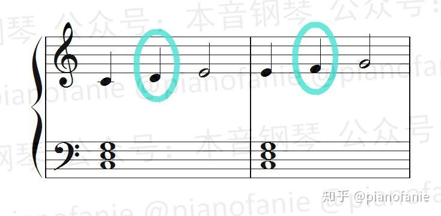

  * 半音经过音（Chromatic Passing Tone）：以半音的形式出现的经过音

    

  * 经过音前后的和弦音可以处于不同的和弦中

    

* 辅助音（临音，neighbor tone）：在弱位上，出现于和弦音重复之间的高一级或低一级的和弦外音。辅助音可以是一个，也可以是多个，但是时值一般不超过两侧的和弦音

  * 自然辅助音：由自然音级构成的辅助音

    

  * 半音辅助音：由变化音级构成的辅助音

    

* 延留音（suspensions）：在强位上，由前一个和弦延留下来并随后解决的和弦外音

  例如这个 D 音是第一小节的和弦音，它延续到了第二小节，而第二小节左手换成了 C 和弦，这时 D 音就成为了延留音

  

  随后右手变为 C 音，得到了解决

  

* 倚音（Appoggiatura）：这里的倚音并非装饰音中的倚音，而是指出现在强位上并获得级进解决（到和弦音）的和弦外音。通常用于故意在强拍上制造不舒服的感觉

  

  《生日歌》

  

* 先现音（anticipation）：属于后面和弦的音，以和弦外音的形式出现在前一个和弦的弱位上。先现音一般在前一个小节时值较短

  

##### 即兴伴奏中的应用

在即兴伴奏中配和弦时，要处理好各种和弦外音，一般规则如下：

* 优先考虑强拍、强位上的音，并尽可能把更多的旋律音包含到和弦里去，使得和弦外音的数量最少
* 如果小节内有明显的长音，则要优先把长音包含到和弦里去
* 如果是句末，则要考虑和弦要包含句末音
* 和声进行（和弦连接）也非常重要，需要综合考虑。

### 三和弦（Triads）

定义：在调性和声中，三个音按照三度音程关系叠置。就算在一个三和弦的基础上再添加不同八度但音级相同的音，它仍然是三和弦。非调性和声中的和弦是建立在非三度结构基础上的。

和弦音的排列自下而上，分别为根音（Root）、三音（中音、Third）、五音（冠音、Fifth）。

和弦的读法：和弦应自下而上依次读出各音。C 和弦（CDE）应读作 do mi sol

比如在 C 和弦中，它的组成音是 1、3、5，1 音叫作根音，3 音叫作三音，5 音叫作五音。比如在 Cm 和弦中，它的组成音是 1、♭ 3、5，1 音叫作根音，♭ 3 音叫作三音，5 音叫作五音

演奏时，左手一般一个音（根音），负责 C1-F2。右手一般三个音，负责 G2-B3

主音三和弦（tonic triad）：根音为主音的三和弦

#### 四个类型

以任何一个音为根音都可以构成 4 种三和弦。

|       | 大三和弦（常用）                                                                                         | 小三和弦（常用）                                                                                              | 增三和弦（很不常用）                                                                                            | 减三和弦（不常用）                                                                                             |
| ----- | ------------------------------------------------------------------------------------------------ | ----------------------------------------------------------------------------------------------------- | ----------------------------------------------------------------------------------------------------- | ----------------------------------------------------------------------------------------------------- |
| 构成    | 根音+大三度音+小三度音（根音与五音是纯五度音程关系）<br />  | 根音+小三度音+大三度音（根音与五音是纯五度音程关系）<br/> <br/>  | 根音+大三度音+大三度音（根音与五音是增五度音程关系）<br/> <br/>  | 根音+小三度音+小三度音（根音与五音是减五度音程关系）<br/> <br/>  |
| 协和性   | 协和和弦（不包括不协和音程）                                                                                   | 协和和弦                                                                                                  | 不协和和弦（包括不协和音程）                                                                                        | 不协和和弦                                                                                                 |
| 色彩    | 音乐色彩明亮、开放                                                                                        | 音乐色彩暗淡、柔和                                                                                             | 音乐色彩尖锐、刺耳                                                                                             | 音乐色彩尖锐、刺耳。具有诡异和压抑的特点                                                                                  |
| 音阶度数  | 1, M3, P5                                                                                        | 1, m3, P5                                                                                             | 1, M3, A5                                                                                             | 1, m3, D5                                                                                             |
| C调的音符 | C, E, G                                                                                          | C, Eb, G                                                                                              | C, E, G#                                                                                              | C, Eb, Gb                                                                                             |
| 缩写    | C Major, C Maj, CMa, C, C△                                                                       | C Minor, C Min, Cm, C-                                                                                | C Augmented, C Aug, C+                                                                                | C Diminished, C dim, C°                                                                               |

大三和弦和小三和弦的根音和冠音一样，只是小三和弦的中音比大三和弦小了一个半音。


|             | Lower Interval    | Upper Interval    |
| ----------- | ----------------- | ----------------- |
| Augmented:  | M3 (4 half steps) | M3 (4 half steps) |
| Major:      | M3 (4 half steps) | m3 (3 half steps) |
| Minor:      | m3 (3 half steps) | M3 (4 half steps) |
| Diminished: | m3 (3 half steps) | m3 (3 half steps) |
| Sus2:       | M2 (2 half steps) | P4 (5 half steps) |
| Sus4:       | P4 (5 half steps) | M2 (2 half steps) |

#### 性质（色彩？）

和弦的音程函量，即和弦所包含音程的量与质的总和。音程函量决定着和弦的音响品质。

例如：三和弦含有三对音程（根音至五音的五度，根音至三音、三音至五音的两个三度）以及它们的转位形式。大三和弦与小三和弦所含音程都是协和的，属于协和和弦。减三和弦含有一个不协和的减五度，增三和弦含有一个不协和的增五度，属于不协和和弦

* 协和和弦

  包括大三和弦和小三和弦

  由于构成大、小三和弦的大三度和小三度都是协和音程，且根音与五度音是纯五度，因此这两种和弦是协和和弦，也是音乐作品中使用最多的和弦

  大三和弦的音乐色彩明亮、开放，小三和弦的音乐色彩暗淡、柔和

* 不协和和弦

  包括增三和弦和减三和弦

  由于构成增、减三和弦的根音与五度音是增五度和减五度，都是不协和音程，因此这两种和弦是不协和和弦

  增、减三和弦的音乐色彩尖锐、刺耳，在音乐中较少使用。减三和弦具有诡异和压抑的特点（恐怖片里常用）


协和音程的物理知识：

大三度就是 2^(4/12)= 1.25992 倍的频率关系，近似等于 1+1/4

小三度则是 2^(3/12)= 1.18921 倍的频率关系，近似等于 1+1/5

纯四度是 2^(5/12)= 1.3348 倍的频率关系，近似等于 1+1/3

纯五度则是 2^(7/12)= 1.49831 倍的频率关系，近似等于 1+1/2

#### 自然大小调中各音级上三和弦的名称、标记和类别

自然大小调中各和弦的名称、标记和类别是由该和弦的根音在音阶中的音级位置所决定的，和弦的功能是和该和弦的根音在调式中的功能相关联的。

C 自然大调

```abc
T:C自然大调中各音级上的三和弦
M:4/4
L:1/4
K:C
Q:60
"C""Ⅰ""主和弦"[CEG] "Dm""Ⅱm""（上主和弦）"[DFA] "Em""Ⅲm""（中和弦）"[EGB] "F""Ⅳ""下属和弦"[FAc] | "G""Ⅴ""属和弦"[GBd] "Am""Ⅵm""（下中和弦）"[Ace] "Bdim""Ⅶ-""（导和弦）"[Bdf] "C""Ⅰ"[ceg]
```

a 自然小调

```abc
T:a自然小调中各音级上的三和弦（TODO）
M:4/4
L:1/4
K:C
Q:60
"C""Ⅰ""主和弦"[CEG] "Dm""Ⅱm""（上主和弦）"[DFA] "Em""Ⅲm""（中和弦）"[EGB] "F""Ⅳ""下属和弦"[FAc] | "G""Ⅴ""属和弦"[GBd] "Am""Ⅵm""（下中和弦）"[Ace] "Bdim""Ⅶ-""（导和弦）"[Bdf] "C""Ⅰ"[ceg]
```


```abc
X:1
T: Triads
M:4/4
L:1/4
K:C
  
"C" [CEG] "Cm" [C_EG] "C+" [CE^G] "C°" [C_E_G] | "D" [D^FA] "Dm" [DFA] "D+" [D^F^A] "D°" [DF_A] |
"E" [E^GB] "Em" [EGB] "E+" [E^G^B] "E°" [EG_B] | "F" [FAc] "Fm" [F_Ac] "F+" [FA^c] "F°" [F_A_c] |
"G" [GBd] "Gm" [G_Bd] "G+" [GB^d] "G°" [G_B_d] | "A" [A^ce] "Am" [Ace] "A+" [A^c^e] "A°" [Ac_e] |
"B" [B^d^f] "Bm" [Bd^f] "B+" [B^d^^f] "B°" [Bdf] |
"C#" [^C^E^G] "C#m" [^CE^G] "C#+" [^C^E^^G] "C#°" [^CEG] | "D#" [^D^^F^A] "D#m" [^D^F^A] "D#+" [^D^^F^^A] "D#°" [^D^FA] |
"F#" [^F^A^c] "F#m" [^FA^c] "F#+" [^F^A^^c] "F#°" [^FAc] | "G#" [^G^B^d] "G#m" [^GB^d] "G#+" [^G^B^^d] "G#°" [^GBd] |
"A#" [^A^^c^e] "A#m" [^A^c^e] "A#+" [^A^^c^^e] "A#°" [^A^ce] |
"Db" [_DF_A] "Dbm" [_D_F_A] "Db+" [_DFA] "Db°" [_D_F__A] | "Eb" [_EG_B] "Ebm" [_E_G_B] "Eb+" [_EGB] "Eb°" [_E_G__B] |
"Gb" [_G_B_D] "Gbm" [_G__B_D] "Gb+" [_G_BD] "Gb°" [_G__B__D] | "Ab" [_Ac_e] "Abm" [_A_c_e] "Ab+" [_Ace] "Ab°" [_A_c__e] |
"Bb" [_Bdf] "Bbm" [_B_df] "Bb+" [_Bd^f] "Bb°" [_B_d_f] 

```
#### 识别技巧

* 先死记乐谱上没加升降号三和弦的大小关系（如C、F、G是大三和弦；D、E、A是小三和弦；B是减三和弦）
* 如果三和弦只有一个升降号，则根据上面的和弦性质，快速推当前和弦
* 如果三和弦有两个相同的升降号，则将和弦看作是有3个相同的升降号（这时候和弦性质没变），再反向加一个升降号，然后快速推当前和弦

注意：不要满足于推完就完事了，然后快速做别的去了。推完之后，要刻意记忆这个乐谱符号形状 + 乐理知识（X和弦） + 演奏手感。

除了Bb三和弦，其他根音在黑键上的大小三和弦，对应的五音也在黑键上，演奏时可以帮助记忆。因此可以死记：如果是C#/Db + E#/

### 七和弦（Seventh Chord）

定义：四个音按照三度音程关系叠置

七和弦是由 4 个音所组成的。它是以三和弦为基础，再加上一个从根音往上的七度音，或者说再加上一个从五音往上的三度音构成的。


和弦音的排列自下而上，分别为根音、三音、五音、七音。

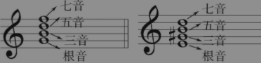

性质：根音与七音所形成的二度关系，决定了七和弦不稳定的性质及需要解决的倾向。

```abc
T:C自然大调中各音级上的七和弦
M:4/4
L:1/4
K:C
Q:60
"CM7""ⅠM7""主和弦"[CEGB] "Dm7""Ⅱm7""（上主和弦）"[DFAc] "Em7""Ⅲm7""（中和弦）"[EGBd] "FM7""ⅣM7""下属和弦"[FAce] | "G7""Ⅴ7""属和弦"[GBdf] "Am7""Ⅵm7""（下中和弦）"[Aceg] "Bm7-5""Ⅶm7-5""（导和弦）"[Bdfa] "CM7""ⅠM7"[cegb]
```


**V 级**：罗马数字的 5 级，指音阶中第 5 个音，例如 C 大调的 V 级就是 G 音；

**属音**：指 V 级音；

以任何一个音为根音都可以构成七和弦

#### 八个类型（以根音 C 为例）

| 常用名称                                                              | 系统名称           | 构成                                                                                                                                                                                                                                                                                                              | 标记                                                | 色彩               |
| ----------------------------------------------------------------- | -------------- | --------------------------------------------------------------------------------------------------------------------------------------------------------------------------------------------------------------------------------------------------------------------------------------------------------------- | ------------------------------------------------- | ---------------- |
| **大七和弦 <br /> Major seventh <br />（最常见**）                         | 大大七和弦          | 大三和弦（M）+大七度；根音 + 4个半音 + 3个半音 + 4个半音<br>提醒：七音（大七度）正好比一个纯八度低1个半音<br>                                                                                           | Cmaj7 <br/> CM7 <br/> C Δ 7 <br/> C Δ             | Happy/Calm       |
| **属七和弦 <br /> Dominant seventh <br />（从调式功能描述。很常见）**              | 大小七和弦（从和弦结构描述） | 大三和弦（M）+小七度；起始音 + 4个半音 + 3个半音 + 3个半音<br>提醒：用钢琴演奏时，弹奏大七和弦七音的手指向左移动一个半音就是属七和弦；<br>通常以属音为根音（注意不一定全是以属音为根音，只要满足大小七和弦，人们也习惯叫做属和弦）构成的七和弦，例如在 C 大调里，属音为 G，所以构成的七和弦为 GBDF <br />  | Cdom7 <br /> C7                                   | Tense            |
| **小七和弦 <br /> Minor seventh <br />（最常见）**                         | 小小七和弦          | 小三和弦（m）+小七度：根音 + 3个半音 + 4个半音 + 3个半音<br>提醒：七音（小七度）正好比一个纯八度低2个半音；<br>用钢琴演奏时，弹奏属七和弦三音的手指向左移动一个半音就是小七和弦<br>                                                                  | Cmin7 <br/> Cm7 <br/> C − 7                       | Sad              |
| 小大七和弦 <br /> Minor major seventh <br />（不常见）                      | 小大七和弦          | 小三和弦（m）+大七度：起始音 + 3个半音 + 4个半音 + 4个半音<br>提醒：用钢琴演奏时，弹奏小七和弦七音的手指向右移动一个半音就是小大七和弦<br>                                                                                           | Cmmaj7 <br/> CmM7 <br/> Cm Δ 7 <br/> C −Δ 7       | Confused Sadness |
| **半减七和弦 <br /> 小七减五和弦 <br /> Half-diminished seventh <br />（常见）** | 减小七和弦          | 减三和弦（dim）+小七度 <br />                                                                                                                                                   | Cm7 ♭ 5 <br/> C − 7 ♭ 5 <br/> C ø                 |                  |
| **减七和弦 <br /> Diminished seventh <br />（常见）**                     | 减减七和弦          | 减三和弦（dim）+减七度 <br />                                                                                                                                                 | Co7 <br/> Cdim7 <br/> Cm(♭ 7)♭ 5 <br/> C-(♭ 7)♭ 5 |                  |
| 增七和弦 <br /> Augmented seventh <br />（不常见）                         | 增小七和弦          | 增三和弦（aug）+小七度 <br /> 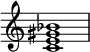                                                                                                                                                   | Caug7 <br/> C+7                                   |                  |
| 增大七和弦 <br /> Augmented major seventh <br />（不常见）                  | 增大七和弦          | 增三和弦（aug）+大七度 <br />                                                                                                                                                      | Cmaj7 ♯ 5 <br/> C+M7 <br/> C+Δ 7                  |                  |


【tip 根据音程转换的思想找小 7：找 G 的小七度时，先找大二度（9-7 = 2，大-> 小），找到 G 左边的键 F，把 F 升高 8 度得解】
以下是几种常见以 B 为根音的七和弦：

* B- #D - #F - #A = Bmaj7
* B- #D - #F - A = B7
* B - D - #F - A = Bm7
* B - D - F - bA = Bdim7
* B - D - F - A = Bm7-5

#### 音级

在 C 大调顺阶和弦当中，所有的三和弦都可以变化成为七和弦。


以自然大调内顺阶七和弦为例：

* 大七和弦——I 级（Cmaj7）、IV 级（Fmaj7）
* 属七和弦——V 级（G7）
* 小七和弦——II 级（Dm7）、III 级（Em7）、VI 级（Am7）
* 半减七和弦——VII 级（Bm7-5）

#### 性质

性质由两个三和弦与一个七度音程构成：

* 三和弦的感情色彩会比较单调，大三和弦色彩明朗，小三和弦色彩阴暗。而以 Cmaj7 和弦为例，把这个和弦的 4 个组成音 C-E-G-B 拆解开：

  * C-E-G 三个音组成了一个 C 和弦

  * E-G-B 三个音又组成了一个 Em 和弦

  Cmaj7 和弦也可以看成是两个三和弦的叠加，它同时拥有了大三和弦和小三和弦的两种色彩。

* 由于所有七和弦中的根音与七度音构成的都是不协和的七度音程，因此所有七和弦都是不协和和弦。

  注意：在大、小调和声中，不协和和弦是必须给予“解决”的，即要求进行到另一个相对协和稳定的和弦上。

#### 属七和弦（Dominant Seventh Chord）

定义：在调式音阶第Ⅴ级音（属音）上建立的七和弦。

属七和弦的结构为大小七和弦。在小调中，常用和声小调的属七和弦。

作用：在所有七和弦中，属七和弦最常用，它是巩固调性和变换调性必不可少的和弦。属七和弦常用于歌（乐）曲的终止处。

#### 性质

以 G7 和弦为例，把这个和弦的组成音 G-B-D-F 拆分开：

* G-B-D 组成了一个 G 大三和弦
* B-D-F 这三个音，因为 B 到 F 是增四/减五音程，所以组成了 B 减三和弦

因为增四/减五音程极其不稳定，有着强烈的回归主级的感觉，所以属七和弦回归主级的感觉要比其他任何的和弦都要强烈。

#### 润色

1. 用大七和弦演奏五声音阶，如原本 C 三和弦为 135，可以演奏为 1236

#### 练习技巧（重要）

* 练七和弦的前提是练熟了三和弦（一说某个三和弦，就能准确地在键盘上弹出，不需要思考），因为弹七和弦的时候，我们是在脑海中将七和弦拆成“某三和弦 + 间隔N个半音的音”来弹。
* 七和弦种类虽然很多（8种），但：
	* 它们的弹奏手型都是类似的，因此在练习各种七和弦时，可以以大七和弦的手型为基准来练习，其他七和弦就是在这个手型的基础上移动个半音之类的。
	* 需要优先练习常见的七和弦（大大=大七和弦；小小=小七和弦；大小=属七和弦；小大=小大七和弦）。
* 而大七和弦可以通过“大三和弦 + 7音就是比根音的高八度少一个半音”的方式来快速记忆 + 演奏。
* 虽然七和弦的手型是以三和弦为基础，但弹奏七和弦时，注意要练习习惯性地把手指整体向前伸，这样才容易弹出七音。
* 基础练习步骤：1. 弹大三和弦；2. 弹大七和弦；3. 弹属七和弦；4. 弹小三和弦；5. 弹小七和弦；6. 弹小大七和弦

### 转位和弦（Inversions、Inverted Triads）

#### 作用

* 让音高更相近（缩短高音或低音部分的音程）
* 增加变化，丰富和声（尤其在副歌部分）
* 通过转位实现根音连接。例如：（F → C → D）的和弦進行可以將中間的 C 和弦改成第一轉位，變成（F → C/E → Dm），將低音拉成一直線的音階下行

#### 含义

根音（Root）在低音（Bass）位置时称原位和弦，不在低音位置时称转位和弦。转位和弦的稳定程度要逊于原位。


和弦低音的选择决定了和弦的稳定性，以及和弦的情绪色彩。比如小七和弦 Am7 的第一转位 C6, 听起来反而更接近大三和弦。同样大七和弦 Cmaj7 的一转也会更接近小三和弦 Em 的阴沉感。

- 和弦根音在最下方叫原位和弦

- 和弦三音在最下方叫和弦的第一转位（first inversion）。
  在三和弦中，低音与上面的两个音分别构成三度和六度，故名三六和弦，简称六和弦，以数字“6”标记。

  在七和弦中，低音与其上的七音与根音分别相距五度和六度，故名五六弦，以数字“”标记

- 和弦五音在最下面叫和弦的第二转位（second inversion）。
  在三和弦中，低音与上面的两个音分别构成四度和六度，故名四六和弦，以数字“”标记
  在七和弦中，低音与七音、根音分别相距三度和四度，故名三四和弦，以数字“”标记

- 和弦七音或六音在最下方叫和弦的第三转位（third inversion）
  在七和弦中，低音与根音相距二度，故名二和弦，以数字“2”标记


注意：转位后的和弦，三音/五音/七音等之前是什么音，转位之后还是不变。如：C（根音，低音）E（三音）G（五音），转位后变成 E（三音，低音）G（五音）C（根音），写作 C/E（C 代表和弦，E 代表低音）。斜線唸做 **on**，或是 **slash**、**over**。例如：C/G 可讀作 C on G、C slash G、C over G。

例子：如图，以 C 和弦(C E G)为例。

* 把根音 C 翻高一个八度，和弦变成了 EGC，称为 C 和弦的第一转位。此时 E 就变成了根音，记为 C/E
* 接下来，把 E 再翻高一个八度，和弦变成 GCE，则称为 C 和弦的第二转位，G 为根音，记为 C/G
* 最后，再把 G 翻个八度，和弦再次变回了 CEG，即原位和弦


作用：和弦排列顺序的改变可以使和弦的听感发生改变。因为所有和弦都是为了旋律线条而产生的，因此转位和弦改变的是和弦的最低音，来可以构建流畅的低音旋律线条。

例如：用来避免高音和低音跨度太大，用转位和弦来提升低音旋律线条

#### 例子

| *Lead-sheet Symbol* | *Root of Chord* | *Notes in the Chord* | *Bass Note (Lowest Note)* |
| ------------------- | --------------- | -------------------- | ------------------------- |
| FAF/A               | FF              | FF–AA–CC             | AA                        |
| DmADm/A             | DD              | DD–FF–AA             | AA                        |
| GDG ∘/D ♭             | GG              | GG–BB ♭–DD ♭           | DD ♭                       |
| CGC+/G ♯             | CC              | CC–EE–GG ♯            | G                         |

#### 原位和弦与和弦第一转位的衔接

作用：让原位和弦与和弦第一转位衔接得更自然

如果一个原位和弦进行到第一转位和弦，则低音需要下行半/全音

如果一个第一转位和弦到原位和弦进行，则低音需要上行半/全音

例子：Leading Bass


新闻联播片尾


#### 练习技巧

* 如同在弹三和弦时，要建立固定的手型（shape），弹转位和弦也是如此。
  第一转位和弦的手型是：3rd + 4th，根音在最上方；第二转位三和弦的手型是4th + 3rd，根音在中间

识别技巧
* 前提：必须把原位三和弦 + 原位七和弦的乐谱符号记熟
* 根据乐谱上的构成音，直接识别出对应的X和弦
* 再根据根音位置，直接反应出是第X转位和弦。
### 挂留和弦（sus 和弦、suspended chord）与 Slash 和弦（Slash Chords）

流行乐常见。

挂留和弦是在三和弦基础上用挂留音代替三音而形成的非三度排列的和弦。


#### 作用

挂留和弦会带来紧张的感觉，古典乐理作用是增加音乐的张力（tension），所以在和弦的弹奏上，需要再解决（resolution）到原本的和弦；但爵士乐理就可不解决。

* sus4，7sus 听上去其实是 **比较中性的，大小和弦的感觉并不强**，主要还是以 sus 本身的模糊的色彩为主。

  而之所以会感到有大小和弦的色彩，应该是来自于和弦在和声进行中的位置所带来的暗示。比如同样是 Csus4，在 C 调里听起来就感觉更偏向大和弦，或者说会下意识地期待 sus 解决到大三度，同样地，在 Bb 调里，就会偏向于小和弦。

* 而 9sus，13sus，可以拆成斜线和声，比如 C9sus，可以写成 Bb/C，而 C13sus 可以写成 BbMaj7/C。因为上方的和弦都是大和弦，所以这两个和声听起来都有大和弦的听感，都很明亮。

* 而 7susb9 听起来就比较 phrygian 了，或者说更偏向于解决到 alter 音阶，所以听感上是非常暗的，比单纯的小三（七）和弦还要暗一些。

#### 挂四和弦（sus/sus4 和弦、suspended fourth chord）

是指三和弦或者七和弦里的三音被四音所取代，使之距根音为纯 4 度所形成的和弦（sus4 chord），因其 3 音被取代，没有大和弦与小和弦的声响，因此和弦听起来较为中性。

sus4 和弦一般情况下都是通过大三和弦和属七和弦变化而来，比如在 C 和弦中，C 和弦的组成音是 1、3、5，要想把 C 和弦变成 Csus4，就把 3 音去掉，再加上纯四度的 4，Csus4 和弦的组成音就是 1、4、5，属七和弦同理。

sus4 和弦在流行音乐中非常常见，sus4 和弦一般情况下是用在属七和弦之前。

### 加音和弦（add 和弦）

加音和弦就是在三和弦基础上再加一个音符，常用和弦为加九和弦。

Cadd9（C add nine）：加 9 和弦，在三和弦上附加根音上方九度音。135+升 2

但常用的形态是将九度音降低一个八度，变为根音上方二度音。

Cadd2：一个三和弦加了大二度音之后，会有一个模糊的感觉。因为这个二度音跟旁边的音距离非常近，三个音挤在一起会让人感觉不协和。加 2 之后，和弦功能不变。

注意把 add9 和弦和 sus2 和弦区别开，因为 add9 是四音和弦，而 sus2 是三音和弦。

### 减和弦（Diminished Chords）

定义：用小三度堆叠而成的和弦

从任何一个音开始堆叠，当堆叠到了第五个音，则重复回原来的音


因为两个小三度音程加在一起就变成了减五度（三全音）。减三和弦有一个三全音，减七和弦有两个三全音。三全音是一种非常不和谐的音程，所以减和弦在古典乐曲中常用来表示紧张、危险、惊吓或者要临死了，或者阴森的感觉。但也可以不紧张，如 Bdim（BDF）可以看做是缺了一个音的 G7 和弦（GBDF），所以有时可以把 Bdim 当作 G7 和弦来用。

### 借用和弦（Borrowed chord。调式呼唤，Modal Interchange。调式混合，Mode Mixture）

使用“同一主音，但不同调式”中的和弦

注意：因为借用和弦会产生离调的音，一般都是三度音（大 3 或者小 3），如果旋律音刚好是根音的小（大）三度而借用和弦含有大（小）三度音，那么这两个音会冲突，就不该使用借位和弦。

如用 C 小调中和弦替换掉 C 大调中对应同级的和弦


### 顺阶和弦（调内和弦、Diatonic Chord）

指完全用音阶内的音组成的和弦。

一个调里一共有 7 个顺阶和弦，通常我们会用罗马数字来表示级数，即 I、II、III、IV、V、VI 和 VII。所有大调的 I、IV、V 级都为大三和弦，II、III、VI 级都为小三和弦，VII 级都为减三和弦

#### 作用

* 顺阶和弦的规律可以让我们很快地分辨出调性
* 可以根据顺阶和弦快速移调
* 分析和声与编配和声

| C 大调音阶   | 1     | 2    | 3    | 4     | 5    | 6    | 7                                                            | 高音 1 |
| ----------- | ----- | ---- | ---- | ----- | ---- | ---- | ------------------------------------------------------------ | ----- |
| 音名        | C     | D    | E    | F     | G    | A    | B                                                            | C     |
| 顺阶 三和弦 | C     | Dm   | Em   | F     | G    | Am   | Bdim                                                         | C     |
| 顺阶 七和弦 | Cmaj7 | Dm7  | Em7  | Fmaj7 | G7   | Am7  |  | Cmaj7 |


#### 顺阶和弦进行


### **和弦识别方法（重要）**

目标：识别和弦的根音、性质（大小增减和弦）、低音（是否是转位和弦）、构成音

* 先把所有音都反转到高音谱表

  

* 看三个音是否都在线上或间上，

  * 如果是，则为三和弦原位
  * 如果不是，则看音符之间的远近，如果下面两个音近，上面两个音远为 `六和弦`。如果上面两个音近，下面两个音远为 `四六和弦`。并看上方音的最下一个音是什么，它是什么音，那它就是什么和弦的转位。

* 原位三和弦直接通过键盘数半音判断大小，转位和弦回到原位以后再数半音判断大小。

* 识别和弦级数与性质（大小增减等）：从 X 调数到 X 和弦，算下相差几度，那几度就是该和弦的级数：

  * 如在 D 大调中，E 和弦在 ii 级上（副下属和弦/小三和弦/小七和弦），因为 D-> E = 2
  * 如在 D 大调中，C 和弦在 vii 级上（导和弦/减三和弦/半减七和弦），因为 D-> C = 7
  * **如果出现了，升降号，则先判断不带升降号的和弦性质，然后再逐个加上升降号，判断和弦性质。**
    
    * 如 C 大调中 C-Eb-Gb 是什么和弦？先看 C-E-G 在 C 大调中级数为 1，因此它是 C 大三和弦（大三度+小三度）。再看 C-Eb-G，重新算音程关系，得到小三度+大三度，即 C 小三和弦。再看 C-Eb-Gb，重新算音程关系，得到小三度+小三度，即 C 减三和弦。
    * 如 A 大调中 C#-E-G 是什么和弦？先看 C-E-G 在 A 大调中级数为 3，因此它是 C 小三和弦（小三度+大三度）。再看 C#-E-G，重新算音程关系，得到大三度+大三度，即 C 增三和弦。
    
    进而锻炼出直接记忆：
    
    * 如果每个音都有一个 b 或#，则和弦性质不变
    * 如果三和弦中有两个音都有同一个 b 或#，则先根据“如果每个音都有一个 b 或#，则和弦性质不变”，将和弦看做每个音都有一个 b 或#，然后再增减一个半音判断。
    * 如果没有升降号的是大三度，则：
      * b 在根音与三音的是：
      * b 在三音与五音的是：减大三度
      * b 在五音的是：
    * 如果没有升降号的是小三度，则：
      * b 在根音的是：增三度
      * b 在根音与三音的是：
      * b 在三音与五音的是：减大三度
      * b 在五音的是：
      * #在根音与三音的是：减三度
      * #在三音与五音的是：增三度
      * #在五音的是：
    * 如果没有升降号的是减三度，则：
      * b 在根音与三音的是：
      * b 在三音与五音的是：
      * b 在五音的是：
      * #在根音与三音的是：
      * #在三音与五音的是：大三度
      * #在五音的是：

* 识别和弦的构成音：D7 和弦的构成音是？

  * D7 是以 D 为根音的属七和弦（识别和弦标记）
  * 属七和弦的结构是 1、3、5、♭ 7（各和弦类型的结构是什么）
  * 当 1 = D，3 是 F ♯，5 是 A，♭ 7 是 C。（音程反应能力）
  * D7 的构成音是 D、F ♯、A、C。

### 和弦总表

[Piano Chord Chart](https://www.songtive.com/en/chords/piano/C7sus4)

#### 三和弦

| 名称                    | 标记            | 组成          | 性质 |
| ----------------------- | --------------- | ------------- | ---- |
| C 大三和弦（Major）      | Cmaj、CM、C △、C | 大三度+小三度 |      |
| A 小三和弦（Minor）      | Amin、Am、A-    | 小三度+大三度 |      |
| B 减三和弦（Diminished） | Bdim、Bo        | 小三度+小三度 |      |
| C 增三和弦（Augmented）  | Caug、C+        | 大三度+大三度 |      |

#### 七和弦


| 名称                               | 标记                     | 组成            | 性质 |
| ---------------------------------- | ------------------------ | --------------- | ---- |
| C 大七和弦（Major）                 | Cmaj7、CM7、C △ 7          | 大三和弦+大七度 |      |
| C 大小七和弦（属七和弦）            | C7、Cdom7                | 大三和弦+小七度 |      |
| C 小大七和弦                        | CmM7、Cmin（Maj7）、C—△ 7 | 小三和弦+大七度 |      |
| A 小七和弦（Minor）                 | Amin7、Am7、A-7          | 小三和弦+小七度 |      |
| B 半减七和弦（Half Diminished 7th） | Bm7（b5）、Bm7-5、B ∅ 7    | 减三和弦+小七度 |      |
| B 减七和弦（Diminished）            | Bdim7、Bo7               | 减三和弦+减七度 |      |
| C 增七和弦、属七升五音和弦          | C7+5、Caug7、C+7         | 增三和弦+小七度 |      |

#### 挂留和弦（sus 和弦）

| 名称          | 标记   | 组成                                 | 性质 |
| ------------- | ------ | ------------------------------------ | ---- |
| 挂 2 和弦、sus2 | Csus2  | 用根音上方二度音代替三音             |      |
| 挂 4 和弦、sus4 | Csus4  | 用根音上方四度音代替三音             |      |
| 属七挂四和弦  | C7sus4 | 属七和弦中，用根音上方四度音代替三音 |      |

#### 加音和弦（add 和弦）

| 名称          | 标记   | 组成                                 | 性质 |
| ------------- | ------ | ------------------------------------ | ---- |
| 加 9 和弦、add9 | Cadd9  | 在三和弦上附加根音上方九度音         |      |
| 挂 4 和弦、sus4 | Csus4  | 用根音上方四度音代替三音             |      |
| 属七挂四和弦  | C7sus4 | 属七和弦中，用根音上方四度音代替三音 |      |

### 非顺阶和弦（非调内和弦）

指和弦里使用了音阶以外的音符。

非调内和弦在音乐中的使用非常常见。

在流行歌曲里，非调内和弦一般出现的时间比较短，使用次数不多，但是使用得当，会相当有提升效果。而在爵士音乐里，非调内和弦运用得相当多，经常用转调、离调来形成丰富的和声色彩

### 功能和弦（Function）

（主要关联知识：音的稳定性、和弦进行）

#### 功能和声

如果在一段调性音乐中，我们能够将所有被使用的和声分类成主功能、属功能和下属功能，那么我们称这类音乐使用的和声为功能和声(英语：functional harmony)。 如果在一段音乐中，我们无法将所使用的和声分类成主功能、属功能和下属功能，那么我们称这类音乐使用的和声为非功能和声(英语：nonfunctional harmony)。 功能和声被最大量使用的时期是 [共晓时期](https://zh.wikipedia.org/wiki/共晓时期)，也就是 17 世纪、18 世纪、和 19 世纪的西方艺术音乐。

##### 作用

* 快速给流行音乐配和弦

##### 类别

* 主和弦和副主和弦都由 13 组成，因此其功能差不多
* 属和弦、副属和弦、导和弦
* 下属和弦、副下属和弦

在大调体系中，有三种和弦族是相当重要的：主和弦、属和弦以及下属和弦。这三个和弦都是大三和弦，是支撑起大调和声框架的支柱和弦，称为正三和弦，其余四个和弦称为副三和弦。

* 主和弦（Ⅰ）：最重要的。给人稳定的感觉，常用于开始与结束一个乐句/乐段
* 属和弦（Ⅴ）：悬而未决+不稳定的感觉。属七和弦：悬而未决+不稳定的感觉更加强烈。多出来的七度的 F 与 B 形成很不协和的组合，这个组合叫做三全音（tritone。这两个音正好距离三个全音）
* 下属和弦（Ⅳ）：稳定性介于主和弦与属和弦之间。增加和弦的丰富性。在律动中运用下属和弦的一种常见的方法，是通过将其与 主和弦的交替进行(I/IV/I/IV/1)来增加和声运动

在小调体系中，有两种极为重要的和弦：主和弦与属和弦。

* 主和弦：Ⅰ min 和弦是小调中最重要的和弦。它也像“家” 一样，但要记住的是，这个小调和弦的整体色彩会弥漫在全部的歌词中。在 a 小调中，主和弦是 Amin 和弦。
* 属和弦：在小调体系中，有几种不同的属和弦可以制造出张力。Ⅴ min 和弦与 b Ⅶ和弦是其中最常见的两种属和弦。在 a 小调中，属和弦是 Emin 和弦、 g 和弦和 e 和弦。
  可以改变小调中Ⅴ min 和弦的色彩，使其变成大调中的属和弦，能够营造出更强的紧张感。

##### 调式

在功能和声中，从调式和声的观点来看，和弦之间存在着一个由倾向于主三和弦的倾向性统一起来的相互关联体系。这种关联体系既确定了一个旋律声部中的各音之间的旋律——音程关系，也确定了各和弦之间的总关系。

##### 调式功能

调式功能简称功能，是指音或和弦在调式中的作用。也可以说是指它（音、和弦）与别的音或和弦在同一调式中的相互关系。这种关系不仅表现在各音或和弦间的音程关系上，还表现在当这些音或和弦连接时显示出来的紧张与稳定（解决）的变化上。

##### 功能性

各种功能关系中所固有的紧张与解决的总和统称为功能性。最基本的功能性即功能的对比，特别是调式和声中主功能与其他非主功能的对比。 以调式功能学说为基础建立起来的和声理论成为 **功能理论**。

#### 具体

在使用和声调式的情况下，大、小调式和弦结构的差异，将主要体现于主和弦的不同。
重要的是对各级三和弦相互关系的把握。在这个问题上，大、小调式的原理基本相同：

* 一级三和弦都是协和的，是在其他和弦的积极支持下建立起来的一个稳定的中心，故名主和弦（Tonic，缩写 T）
* 五级、四级的三和弦也是协和的，它们分别从上、下五度方向对主和弦形成有力的支持，名曰属和弦（Dominant，缩写 D）、下属和弦（Subdominant，缩写 S）
* 主、属、下属三个和弦是确定调性的基础，甚至还是纯律大、小调音阶产生的依据，所以称作正三和弦。其他各级三和弦结构多样，分别与一、五、四级和弦呈上、下三度关系，直接或间接地与主和弦发生联系，称副三和弦。

以 C 自然大调为例：

[](https://zh.wikipedia.org/wiki/File:Scale_degrees_with_chords.png)

|              | 135                                  | 246                | 357                | 461                                                    | 572                              | 613                  | 724                                                          |
| ------------ | ------------------------------------ | ------------------ | ------------------ | ------------------------------------------------------ | -------------------------------- | -------------------- | ------------------------------------------------------------ |
| 和弦名       | C                                    | Dm                 | Em                 | F                                                      | G                                | Am                   | B-                                                           |
| 级数罗马数字 | Ⅰ                                    | ii                 | iii                | Ⅳ                                                      | Ⅴ                                | vi                   | vii °                                                         |
| 级数名       | 主（Tonic）                          | 上主（Supertonic） | 中（Mediant）      | 下属（subdominant）                                    | 属（dominant）                   | 下中（submediant）   | 导（leading note）                                           |
| 德文缩写     | T                                    | SP                 | Dp/Tg              | S                                                      | D                                | Tp                   |  |
| 功能名       | 主和弦                               | 副下属和弦         | 副属和弦           | 下属和弦                                               | 属和弦                           | 副主和弦             | 导和弦                                                       |
| 功能组       | 主功能组                             | 下属功能组         | 主功能组、属功能组 | 下属功能组                                             | 属功能组                         | 主功能组、下属功能组 | 属功能组                                                     |
| 听感         | 主和弦會有開始（或結束）、穩定的感覺 |                    |                    | 下屬和弦會有中介、跨出一步的感覺，常常被用來接到屬和弦 | 屬和弦會有還沒結束、不穩定的感覺 |                      |                                                              |

以 D 自然大调为例：

|        | 2 #4 6 |            |          |          |        |          |        |
| ------ | ------ | ---------- | -------- | -------- | ------ | -------- | ------ |
| 和弦名 | D      | E          | #F       | G        | A      | B        | #C     |
| 级数名 | Ⅰ      | ii         | iii      | Ⅳ        | Ⅴ      | vi       | vii °   |
| 功能名 | 主和弦 | 副下属和弦 | 副属和弦 | 下属和弦 | 属和弦 | 副主和弦 | 导和弦 |

主和弦、属和弦、下属和弦是正三和弦，且都是大三和弦。

副主和弦、副属和弦、副下属和弦是副三和弦，且都是小三和弦。副三和弦位于对应的正三和弦的上方三度或下方三度。因为这样的正、副三和弦中有两个音是共同音，因此二者功能相近。

##### 三个功能组

|      | 主功能组和弦（Tonic、T）                                     | 下属功能组和弦（Subdominant、S、Predominant、P、PD）         | 属功能组和弦（Dominant、D）                                  |
| ---- | ------------------------------------------------------------ | ------------------------------------------------------------ | ------------------------------------------------------------ |
| 级数 | Ⅰ级（主和弦）、Ⅲ级（副属和弦）、Ⅵ级（副主和弦）。<br /> 在 C 自然大调中，包含了 C、Am、Em 和弦。三个组中最稳定的一组 | Ⅱ级（副下属和弦）、Ⅳ级（下属和弦）、Ⅵ级和弦（副主和弦，可选）。<br /> 在 C 自然大调中，包含了 F、Dm、Am 和弦 | Ⅲ级（副属和弦，可选）、Ⅴ级（属和弦）、Ⅶ级（导和弦）。在 C 自然大调中，包含了 G、Em、Bdim 和弦。 |
| 功能 | 以 C 大调顺阶三和弦为例，一级主和弦 C 大三和弦，由于组成音为 1 3 5(稳定音)，所以和声的功能听起来是最稳定的，具有强烈的归属感。<br /> 它的上方三度和下方三度和弦分别为三级 Em(3 5 7)和六级 Am(6 1 3)，组成音有两个是相同的(如果是顺阶七和弦更是有三个音相同)，都含有主和弦中两个稳定音，因此和声的功能性相近 | 四级下属和弦 F(4 6 1）或者大七和弦 Fmaj7（4 6 1 3），由于含有不稳定音但却不含有调性三全音，所以稳定性介于主和弦和属和弦中间。<br /> 它和上方三度的二级和弦 Dm(2 4 6)组成下属和弦功能组 | 五级的属和弦 G(5 7 2)或属七和弦 G7( 5 7 2 4），由于组成音主要是不稳定音，且属七和弦中的三音 7 和七音 4 形成了调性三全音，本身就很不和谐、不稳定，导音 7 和下属音 4 都处于半音的位置上，这两个音有一种强烈的想解决回主音 1 和上中音 3 的趋势。所以属和弦给人的感觉是最不稳定，情绪最强烈，需要被解决的。<br /> 同样的，V 级属和弦由于和上下方三度（三级 Em 、七级 Bdim）组成音类似，功能相近。 |
| 作用 | 常见的大调歌曲一般都会用主和弦开始和结束，让音乐能带给人一种有始有终的感觉 |                                                              |                                                              |

提醒：可以结合音级的稳定性一起记忆：1、3、5 是稳定音级，2、4、6、7 音是不稳定音级。

在五度循环圈中，越相近的和弦共享最多相同的音，因此其和声功能相似。如 E 小三和弦（E, G, B）、A 小三和弦（A, C, E）都共享 C 大三和弦（C, E, G）中的两个音。


* 为什么三级和弦即存在于主和弦功能组里，又可以混在属和弦功能组里？大部分情况下（90%）三级和弦会属于主和弦功能组，但现代音乐里也有少量三级替代五级属和弦使用的例子。

注意：由于 3*3-7 = 2，因此有两个和弦同时属于两个功能组，即Ⅲ级和Ⅵ级和弦

在传统的和声学中，自然大调下：将主和弦、下属和弦、属和弦分别标记为 T（tonica）, S（subdominant）, D（dominant）。和声小调下：将主和弦、下属和弦、属和弦分别标记为 t, s, D。

西方传统音乐在很长很长一段时间内，遵循的是 T － S － D － T 的方式，由主功能进行到下属功能（也叫预属功能），再进行到属功能，最后又回归主功能。主功能是极为稳定的，属功能是极为不稳定的，下属功能则介于这两者中间，所以这个过程用文字来描述大概是：稳定－有些不稳定－非常不稳定－稳定。

实际上，许多的传统曲式也可以遵循这个方式，但它通常不同的是，我们平常说的 T － S － D － T 指的是和声在自然大小调中某单一调性里的功能，不涉及转调，而在传统各类曲式中通常会有转调，在这个语境下，T － S － D － T 不是指主和弦进行到下属和弦再进行到属和弦，最后回到主和弦的概念，它可能会成为一个调性的分布，把每一个功能都当作一个调，是指主调进行到下属调再进行到属调，最后回归主调的过程。

以 C 自然大调的单一调性举例，T － S － D － T 用最简洁的方式来表达，就是 C － F － G － C 这几个和弦，但如果将它们用调性分布的方式来看待，它就会从 C 调开始，经过发展，转入 F 调，再发展，转入 G 调，最后回归 C 调，这样一来，一段很简单的单一调性的 T － S － D － T 进行，扩展成了相对具有更庞大格局，包含多个调的音乐作品，但无论如何，它一定遵循一个由“不稳定”回归“稳定”的逻辑。

#### 和弦性质（Chord Qualities）

和弦性质列表：https://feelyoursound.com/scale-chords/a-harmonic-minor/

##### 自然大调和弦性质

|             | I        | ii       | iii      | IV       | V        | vi       | vii °       |
| ----------- | -------- | -------- | -------- | -------- | -------- | -------- | ---------- |
| 三和弦      | 大三和弦 | 小三和弦 | 小三和弦 | 大三和弦 | 大三和弦 | 小三和弦 | 减三和弦   |
| C 大调三和弦 | C        | Dm       | Em       | F        | G        | Am       | B °         |
| 七和弦      | 大七和弦 | 小七和弦 | 小七和弦 | 大七和弦 | 属七和弦 | 小七和弦 | 半减七和弦 |
| C 大调七和弦 | Cmaj7    | Dm7      | Em7      | Fmaj7    | G7       | Am7      | B °         |

##### 自然小调和弦性质

|             | i        | ii °        | III      | iv       | v        | VI       | VII      |
| ----------- | -------- | ---------- | -------- | -------- | -------- | -------- | -------- |
| 三和弦      | 小三和弦 | 减三和弦   | 大三和弦 | 小三和弦 | 小三和弦 | 大三和弦 | 大三和弦 |
| a 小调三和弦 | Am       | B °         | C        | Dm       | Em       | F        | G        |
| 七和弦      | 小七和弦 | 半减七和弦 | 大七和弦 | 小七和弦 | 小七和弦 | 大七和弦 | 属七和弦 |
| a 小调七和弦 | Am7      | B °         | Cmaj7    | Dm7      | Em7      | Fmaj7    | G7       |

##### 和声小调和弦性质

|             | i        | ii °      | III+     | iv       | V        | VI       | VII °     |
| ----------- | -------- | -------- | -------- | -------- | -------- | -------- | -------- |
| 三和弦      | 小三和弦 | 减三和弦 | 增三和弦 | 小三和弦 | 大三和弦 | 大三和弦 | 减三和弦 |
| a 小调三和弦 | Am       | B °       | C+       | Dm       | E        | F        | G#°      |
| 七和弦      |          |          |          |          |          |          |          |
| a 小调七和弦 |          |          |          |          |          |          |          |

##### 旋律小调和弦性质

|             | i        | ii       | III+     | IV       | V        | #vi °     | vii °     |
| ----------- | -------- | -------- | -------- | -------- | -------- | -------- | -------- |
| 三和弦      | 小三和弦 | 小三和弦 | 增三和弦 | 大三和弦 | 大三和弦 | 大三和弦 | 减三和弦 |
| a 小调三和弦 | Am       | Bm       | C+       | D        | E        | F#°      | G#°      |
| 七和弦      |          |          |          |          |          |          |          |
| a 小调七和弦 |          |          |          |          |          |          |          |


#### 大小调中三和弦的关系

#### 同主音自然大调与自然小调三和弦的关系

* 两种调式所有同级上的和弦都是不同的
* 除二级、七级之外，其他五个音级，大调的正三和弦都是大三和弦，副三和弦都是小三和弦。小调的情况相反，正三和弦都是小三和弦，副三和弦都是大三和弦
* 二级和弦在大调中是小三，在小调中是减三；七级和弦在大调中是减三，在小调中是大三


和声调式的应用使大、小调在和弦结构上有了更多的联系。

和声小调升高七级音的结果，使小调五级、七级的三和弦同于大调

和声大调降低六级音的结果，使大调四级、二级的三和弦同于小调

与此同时，小调的三级、大调的六级，都出现了自然调式所没有的增三和弦，这两个和弦在平行大、小调上存在着等音同构的关系


#### 功能和声音乐与调性音乐的区别

所有使用功能和声的音乐都是调性音乐，所有无调性音乐使用的都是非功能和声。 但应注意的是，**不是** 所有调性音乐都使用功能和声。例如西方文艺复兴时期使用的中古调式音乐、[传统五声调式音乐](https://zh.wikipedia.org/wiki/中國五聲音階)、和德彪西的印象派音乐等都有明确的调性中心、都属于调性音乐，但是这些音乐都不使用功能和声。调性与调性中心的确立手法除了使用功能和声以外还有很多，例如 [固定低音](https://zh.wikipedia.org/wiki/固定低音)、[持续低音](https://zh.wikipedia.org/wiki/持续低音)、持续高音、旋律 [终止式](https://zh.wikipedia.org/wiki/終止_(音樂))的结束音(英语：final)和吟诵音(英语：tenor)等等。

#### 表


### 和弦色彩（情感）

#### 重要性

* 作曲如同绘画。如果一幅画的主色调为蓝色，那么这种色彩想要表达什么？如果是红色的呢？在音乐中，有一种主要的音乐风格即被称为“蓝调”，这种音乐风格的特点正是其和声色彩的程示。
* 培养自己对音乐色彩的感知能力有助于把现实色彩与声音和感觉联系起来，以更加深入地认知与利用和声的一种渠道

#### 培养感知力的方法

* 观察一种色彩，然后用乐器找到那种色彩，运用音符再现色彩传递给你的那种感觉
* 弹奏一个和弦并描述它所呈现给你的色彩

#### 大和弦色彩

对大多数人来说，“大调”通常体现了一种欢快和明朗的感觉。大三音（E）赋予大和弦欢快、积极的音。
含有大三和弦律动的流行金曲包括：《走这条路》(Walk This Way) [C], 《情感救赎》(Emotional Rescue)[Bb]、《给我庇护》(Gimme Shelter) [Db] 等。

```abc
T:大和弦色彩（C大三和弦）
M:4/4
L:1/4
K:C
Q:120
[CEG]4 | C E G z |
[CEGc]4 | C E G c |
```

#### 小和弦色彩

对大多数人来说，“小调”体现了一种悲怆或自省的感觉。小三音（c）赋予小和弦悲怆与阴沉的色的音。
含有小三和弦律动的流行金曲包括

* 《我是一个男人》(I'm a Man) [Cmin]
* 《我只是一个摇滚歌手》(I' m Just a Singer in a Rock and Roll Band) [Amin]
* 《让它过去吧》(Let It Ride) [F # min]
* 《特别的周六夜晚》(Saturday Night Special) [Gmin]
* 《自由最可贵》(Best Things in Life Are Free) [F # min]
* 《燃烧》(Fire) [Dmin]
* 《西班牙魔法城堡》(Spanish Castle Magic) [F # min]
* 《你败坏了爱的名誉》(You Give Love a Bad Name) [Cmin]

```abc
T:a小三和弦色彩
M:4/4
L:1/4
K:C
Q:100
[Ace]4 | A c e z |
[Acea]4 | A c e a |
```

#### 强力和弦（强音和弦，Power chord）

加厚重力和弦的音色。对大多数人来说，它体现了一种强有力的、自信的，甚至是带有侵略性的感觉。在一种很慢的速度下，它听起来也很有神秘感。这种音效源自其省略了三音

含有强力和弦律动的流行金曲包括：

《我爱摇滚乐》(I Love Rock and Roll) [E5]

《毒药》(Bad Medicine) [E5]

《梭鱼》(Barracuda) [E5] 等。

强力和弦有两个音：根音和五音。通常，根音有两个，其中一个是将原根音升高八度。

```abc
T:E强力和弦色彩
M:4/4
L:1/4
K:C
Q:100
[EBe]4 | E B e z |
```


#### 七和弦色彩

对大多数人来说，它体现了一种蓝调的、时尚独特的，甚至是性感的感觉。这种感觉源自七音与大三音的搭配

含有七和弦律动的流行金曲包括：
《热舞不歇》(The Beat Goes On) [C7]
《在街上跳舞》(Dancin' in the Street) [E7]
《大步走》(Goin' to a Go-Go) [G7]
《短途旅客》(Day Tripper) [E7]
《骄傲的玛丽》(Proud Mary) [G7]
《最后一个孩子》(Last Child) [Eb7]
《收税员》(Taxman) [D7]

```abc
T:G7和弦色彩
M:4/4
L:1/4
K:C
Q:100
[GBdf]4 | G B d f |
[GBdfg]4 | G B d f g |
```

#### 变化和弦色彩

通过为基本和弦增加或替换音符的方法，来变化一个和弦的基本色彩，给律动带来新的色彩。 熟练地增加音符可以使基本的和弦色彩有两种或更多的版本，你也可以运用这些不同的和弦变形来创作律动。

通过增加音符来变化和弦律动的流行金曲包括：《名誉》(Fame) [G9]、《闪 亮之星》(Shining Star) [E7(#9)] 等。

例子：在 Dmin 和弦的基础上增加一个七音，变成 Dmin7

```abc
T:Dmin和弦与Dmin7和弦
M:4/4
L:1/4
K:C
Q:140
[CEG]4 | G B d f |
[GBdfg]4 | G B d f g |
```

##### 变化和弦的常用方法

你可以通过增加和替换四个基本和弦色彩的音符来变化和弦。基本和弦色彩和它们的变形共同被称做一个和弦族。

| 基本色彩 | 增加                       | 替换一个音符 并创作 |
| -------- | -------------------------- | ------------------- |
| 大调     | 6, Maj7, Maj9, add2        | sus2, sus4          |
| 小调     | 6, min7, min9, minll, add2 | minor sus4          |
| 强力     | sus2                       | —                   |
| 属七     | 9, 13, 或 #9                | 6, 7sus4, 11        |

```abc
T:基本和弦C、和弦变形CMaj7、Cadd2、Csus4
M:4/4
L:1/4
K:C
Q:50
%% MIDI=program 42
[CEG] [CEGB] [CEGD] [CFG] |
```

```abc
T:基本和弦Amin、和弦变形Amin7、Amin6、Amin(add2)
M:4/4
L:1/4
K:C
Q:50
[A,CE] [A,CEG] [A,CE^F] [A,B,CE] |
```

```abc
T:基本和弦E5、和弦变形Esus2
M:4/4
L:1/4
K:C
Q:50
[EB]2 [EB^F]2 |
```

```abc
T:基本和弦A7、和弦变形A7sus4、A13
M:4/4
L:1/4
K:C
Q:50
[A,^CEG] [A,DEG] [A,G ^c^f] z |
```

##### 和弦变形的交替

将一种和弦色彩的两种变形进行交替，是扩展一段单一和弦律动的另一种方法。
通过将一种和弦色彩的两种变形交替进行的流行金曲包括：
《回来》(Get Back) [A]
《冰冷》(Cold as Ice) [Emin]
《驾驶》(Drive) [B]
歌手查克-贝瑞的大部分歌曲
注意，和弦的各种不同的变形是通过增加和替换基本和弦中的音符来实现的。还要注意这些变形是如何使单一和弦的律动变得更加生动有趣的。

### 和弦连接（和弦进行、Chord Progressions）

（主要关联知识：功能和弦）

列表：https://en.wikipedia.org/wiki/List_of_chord_progressions

和弦进行的基本逻辑，就是从稳定的和弦再到不稳定的和弦，最后再到稳定的和弦（解决）。

按照主-下属-属的形式进行连接，形式可以多变（如：主-属-主，下属-属-主，主-下属-主等等）

切记不能进行属-下属的连接（和弦功能写为 D-S），因为这样的和弦连接在音响效果上极其破坏旋律性，除非作曲者刻意要让旋律有该效果

以上所说的是大小调中的主三和弦连接，另外还有副三和弦，副三和弦的使用是根据旋律情感来使用的（比如一个小节中出现 1 和 3，那么我们可以使用 C 和弦，也可以使用 a 和弦，两个和弦有 2 个共同音，是可以使用和弦借代功能的，并且他们同属关系大小调中的主和弦，若想让旋律明朗一点则配 C，若要忧伤一点则配 a。），同理，对应的 G 与 e，F 与 d 和弦，都可以做为主和弦连接功能的替代。

解决（术语）：从不稳定感觉到稳定感觉的过程

起承转合：主和弦—> 属和弦—> 属七和弦—> 主和弦


三个功能组互为倾向。乐曲的核心推动力就是和弦在这三个功能组之间来回推动。否则乐器会听起来很单调无聊。即旋律要么横向保持，要么上行，要么下行。

大跨度的和弦连接是不太好听的


基本和弦连接表（C 自然大调）

| 家        | 桥    | 外面  | 家   |
| --------- | ----- | ----- | ---- |
| C         | F     | G、G7 | C    |
| C-> Em     | Dm    | Bdim  | Em-> |
| C-> Am     | F-> Dm |       | Am-> |
| C-> Em-> Am | Dm-> F |       |      |
| C-> Am-> Em |       |       |      |

#### 连接方式

##### 自然音和弦的运用：与主音和弦交替进行

主音和弦与另一个自然音和弦之间，彼此交替进行是和声进行中最简单、 也最有效的类型之一。对于大调音阶，比较常见的一种和弦交替进行是从 I 到 IV。对于小调音阶，Ⅰ min-b Ⅶ及它的变形。

注意下例在 F 和弦中加入大七度音，赋予了歌曲伤感的色彩。

```abc
T:CMaj7、FMaj7
M:4/4
L:1/4
K:C
Q:50
%% MIDI=program 24
[CEGB] [FAce] |
```

```abc
T:a小调Ⅰmin（sus4）-bⅦ（sus4）的和声进行
M:4/4
L:1/4
K:C
Q:50
%% MIDI=program 24
[Ade] [Gcd] |
```

注意，尽管和声中运用了一个 G 大三和弦(Gsus4), 但该和声进行仍然带有小调的感觉。还要注意，和弦中增加的音 符给律动带来了一点爵士的风格

##### 根音连接

随着调式音阶中的音互相组合形成旋律的进行，这七个三和弦或者七和弦之间也存在着互相连接的可能，于是就出现根音相距二度、三度、四度、五度、六度、七度的两个和弦相连接的情况。

如下图所示，如果将根音相距五度、六度、七度的两个根音的进行方向互换，如Ⅰ-Ⅴ换为Ⅴ-Ⅰ，实际上根音还是相距四度，三度、二度的和弦连接。因此，在同一调中自然三和弦或者七和弦的连接都可以归纳为上行或者下行二度、三度、四度的和弦连接。


色彩：上行（根音上行）时会给人推动的感觉，下行（根音下行）时会产生下沉的感觉

和声力度：这种由于不同和弦连接所带来的动力和紧张度称为“和声力度”。和声力度的强弱程度，是由前后连接的两个和弦的根音音程与两者共音的数量决定的。

种类

* 二度连接：根音相距二度的两个三和弦或者七和弦没有共同音，和声各声部之间缺少联系（调式的下属和弦进行到属和弦除外），和声的力度比较强烈。建议连接各声部应少用单纯的同向进行，多采用重复的根音，低音声部反向进行，其他声部同向进行的连接。

* 三度连接：根音相距三度的三和弦有两个共同音，七和弦有三个共同音，各声部之间的联系比较强，和声力度较弱。根音三度连接时，上行与下行又有一些区别：根音上行三度，由于后面和弦的根音已经在前面的和弦出现过了，因此和声力度会较弱，根音下行三度时则没有上述情况出现，和声力度比前者略强。

* 四度连接（音响效果最自然）：根音相距四度的三和弦有一个共同音和两个不同音，七和弦各有两个共同音和不同音，其连接性相对比较自然。连接时共同音应尽量保持在同一声部，如共同音不保持在同一声部会造成几个声部的同向进行，没有音程的跳进，这就要求个别声部与它们成反向进行取得平衡，一般采用低音声部反向进行的手法，如：

  

通常在

#### 加花（fill in）

fill in 指的是在和弦与和弦连接出现空拍（拖长音、做呼吸、做乐句）时，或者为了情绪的推进，用一些音符来填充节拍的方式，就是我们常常说的加花。

具体加花位置

* 在乐句长音处。《可惜不是你》

  

* 在短暂气口处

  《好久不见》

  

* 在段落衔接处。《圣诞结》陈奕迅

  

  

形式

* 和弦填充式

  * 柱式和弦
  * 分解和弦
  * 延伸左手织体

  

* 旋律模仿式

* 和声推动式

* 低音推动式

* 情绪推动式

一般三种比较常见的形式：音阶式、和弦琶音式、音阶与和弦琶音式。

**音阶式**


我们以上图的和弦进行为例，把 Bm7b5 和弦 **三、五、七** 音中的一个作为目标音，在 C—Bm7b5 中间做一个 **fill in**，填充的音符最终目的就是要到目标音，在这里我们把三音“2”作为目标音。


在设计 fill in 的时候，要注意两点：一是 **节奏**，二是 **音符**。在这里我们的节奏形态设计是一个 **三连音** 加一个 **四连音**，然后采用 C 调音阶 **2345671** 填充，连接到目标音“2”。


或者我们将曲子编的偏 **爵士** 一点，可以加入半音 **#4**，将音阶设计为 **2 3 4 #4 5 6 7 1** 连接到“2”。

**和弦琶音式**

对于和弦我们的选择可以有很多种，所以琶音设计也是有很多种的，比如我们可以用 **Cadd9** 和弦，组成音是 **1352**，琶音式的 fill in 就可以设计为 **2351**，然后连接到目标音“2”。


或者使用 **Cmaj7**，组成音 **1357**，和弦琶音设计为 **3571** 连接到“2 "。


再或者使用 **C6**，组成音 **1356**，和弦琶音设计为 **3561** 连接到“2 "。这些都是可以自由设计的。

**音阶与和弦琶音式**


[钢琴演奏演示 3_腾讯视频 v.qq.com ](https://link.zhihu.com/?target=https%3A//v.qq.com/x/page/b0769s15n9o.html)


因为 C—Bm7b5 中间只空一拍，空间是比较小的，所以音阶和琶音结合起来编配时，和弦琶音就只选择 C 大三和弦 135 三个音，音阶就用 671，所以结合起来就是一个 **五连音 35671**，然后连接到目标音“2”。


在这里也可以将伴奏编的爵士一点，加入半音 **#1**，所以结合起来是一个 **六连音 3 5 6 7 1 #1**，最后连接到目标音“2”。

#### 流行乐常见套路

理论上，顺阶和弦可以任意连接。但是因为大众不太能接受“新奇”的和弦进行，比较能接受的和弦进行只有常见的几种，因此音乐人容易套用大众喜欢的和弦进行作曲。

想让乐曲各有个性，除了打破和弦套路外，还可以通过：

* 改变旋律、节奏
* 运用不一样的色彩和弦

##### 卡农和弦进行（Romanessca）

17654325（C--Em7/B--Am7--G7--Fmaj7--Am7/E--Dm7--G9sus4）

例子：《挥着翅膀的女孩》、《老鼠爱大米》、《手写的从前》《菊花台》（周杰伦）

```abc
T:卡农和弦进行（适合任何调式）
M:4/4
L:1/4
K:C
Q:140
CGAE | FCDG
```

##### 4536251（FGEADGC 下属-属-主，逆向四度圈）

可以和卡农和弦搭配起来，构成“1563+4536251”。例如《后来》的副歌部分

```abc
T:4536251（下属-属-主）
M:4/4
L:1/4
K:C
Q:140
FGEA | DGC z |
```

##### 1645、1451（CAFG、CFGC 通常作为前缀）

有种朴实、平静的感觉。常被民谣歌曲使用。例如《成都》（赵雷）

也可以将 1451 置换成 1251《会呼吸的痛》的主歌部分

```abc
T:1645、1451
M:4/4
L:1/4
K:C
Q:140
CAFG | CFGC |
```

##### 1564（CGAF）

《Someone like you》

```abc
T:1564
M:4/4
L:1/4
K:C
Q:100
CGAF
```

##### 6451（AFGC）

《菊次郎的夏天》

```abc
T:6451
M:4/4
L:1/4
K:C
Q:100
AFGC
```

##### 6415（AFCG）

《平凡之路》

常用在电音

```abc
T:6415
M:4/4
L:1/4
K:C
Q:100
AFCG
```

##### 6453（AFGE）

《燕尾蝶》

```abc
T:6453
M:4/4
L:1/4
K:C
Q:100
AFGE
```

##### 4566（FGAA）

《红色高跟鞋》

```abc
T:4566
M:4/4
L:1/4
K:C
Q:100
FGAA
```

##### 2516（DGCA）

《蓝旗袍》

```abc
T:2516
M:4/4
L:1/4
K:C
Q:100
DGCA
```

##### 2514736

在这一条和弦进行中，251 几乎贯穿整个和弦进行，在属和弦、次属和弦的不断解决下，推动曲子的发展（因为大量离调和弦的加入，调性变得模糊了）

用七和弦弹会更有爵士的感觉

另外，这个和弦进行是四度循环

```abc
T:2514736
M:4/4
L:1/4
K:C
Q:140
D G C F | B E A z |
```

##### 1526415

和弦开头用的是五度循环（1526）

例子：《最冷一天》的副歌（张国荣）

```abc
T:1526415
M:4/4
L:1/4
K:C
Q:140
CGDA | FDGz |
```

##### 15-6343251、13-6343251

##### 半音上行

```abc
T:半音上行
M:4/4
L:1/4
K:C
Q:140
A
```

##### 半音下行

```abc
T:半音下行
M:4/4
L:1/4
K:C
Q:140
a
```

##### 436（FEA）、4321（FEDC）

比较有 R&B 感觉

436 也可以理解成小调的 651

```abc
T:436、4321
M:4/4
L:1/4
K:C
Q:140
FEA z | FEDC |
```

* C——F——G 古典和声优良的正格进行
* C——G ——F 古典和声的禁止进行，但现代和声却用的很多，非常好听。小虎队《爱》，周杰伦《开 不了口》等的前奏~~~《我是一只鱼》
* C——G——AM——EM——F——C——F——G 来自己欧洲的经典和声啦。《开不了口》《简单爱》《爱一个好难》《约定》《深呼吸》《光辉岁月》
* C——AM——F——G 美国的经典乡村民谣进行。叶蓓《在却难逃》《纯真年代》
* C——AM——DM——G 乡村进行变化。〈爱〉
* C——EM/G——AM——G——F——EM——DM——G 经典根音下行的悲伤歌曲进行。学友的《祝福》等好象大调就这么多吧 ~~~~~小调还有些感情色彩，象 C ——AM——F——G ，又可以变为 C——AM——F—FM——G ，用了一个 4 级小和弦做色彩处理，效果相当好。这个《人鬼情未了》歌曲的结束
* C——AM——F——G ，还可以变为 C9——AM9——FMAJ7——G9—G—，也相当有追忆住事的味道~~~如《明天我要嫁给你啦》的前奏，它是 F 调。但和弦功能和级数是一样的
* C——AM——F——G ，还可以变为 C ——AM——F——降 B——G ，用了一个降 B 和弦，为 F 和 G 和弦过渡，典型唯美主义色彩的运用，很好听。齐秦《花葬》，韩红〈家乡〉，周艳泓〈春暖花开》C -F -降 B-G 等等

##### Leading Bass（顺阶低音。极其常见）

（注意：唱很多流行曲时，都可以配上这个和弦 Loop）

顺阶低音：顺着音阶下行的低音，其低音为 17654325。

C	G/B	Am	C/G	F	C/E	Dm	G7	C


1. 根据主和弦与属和弦的功能，得出开始、半终止与终止的和弦
2. 带 7 的和弦有：Em（753）与 G（275）。因为除了主和弦，其他和弦不能把和弦中的五音作为低音，因此不能配 Em 和弦（753），只能配 G/B 和弦（？？？）
3. 带 6 的和弦有：Dm（642）、F（164）、Am（316）。因为如果低音正好是和弦的根音，就尽量去配这个和弦。所以只能配 Am
4. 带 5 的和弦有：C（531）、Em（753）、G（275）。虽然在 G 和弦中，5 为根音，但因为它是属和弦有半终止的感觉。又因为 C（531）中的 5 虽然是五音，但因为它是主和弦，所以仍然可以配 C/G 和弦，也可以配 Em/G 和弦
5. 带 4 的和弦有：Dm（642）、F（164）。因为在 F 和弦中 4 是根音，所以配 F 和弦
6. 带 3 的和弦有：C（531）、Em（753）、Am（316）。因为在 Am 中 3 是五音，所以不能配 Am 和弦。因为在 Em 和弦中 3 是根音，所以配 Em 和弦，也可以配 C/E
7. 带 2 的和弦有：Dm（642）、G（275）。在 G 和弦中 2 是五音，所以不能配 G 和弦，只能配 Dm 和弦

低音谱上和弦的根音：17654325

主音下方低音谱中音的根音部分是：17654325。其中 Gsus4

因为在流行音乐当中，经常在属和弦前面配加一个挂四和弦来加强终止感

```abc
T:Leading Bass
M:4/4
L:1/2
K:C
Q:70
V:1 clef=treble
"C"[DEG] "G/B"[B,DG] | "Am"[G,CG] "C/G"[G,CG] | "F"[G,CG] "C/E"[G,CG] | "Dm7"[A,CF] "Gsus4"[G,C]/2 "G"D/2 |
V:2 clef=bass
[C,G,] [B,,G,] | [A,,E,] [G,,E,] | [F,,C,] [E,,C,] | [D,,D,] [G,,F,] |
```

##### 小调 Leading bass

a 自然小调音阶：65432176

前后两个 6 都是Ⅰ级，根据 251 技巧，在最后一个 6 前面配Ⅴ级 3（6 向上纯五度为 3）


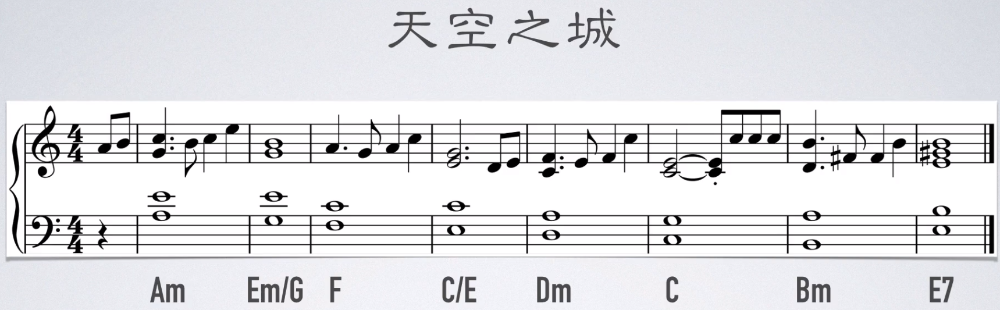

四度圈套路

#### 251 技巧

作用：用来丰富和弦色彩。https://www.sohu.com/a/158084726_789958

结构

* 大调：小七和弦—> 属七和弦—> 大七和弦。如 C 大调：Dm（2461）—> G7（5724）—> C（1357）
* 小调：半减七和弦—> 属七和弦—> 小七和弦。如 a 小调：Bo（7246）—> E7（3#572）—> Am（6135），如 c 小调：Do（24b61）—> G7（5724）—> C（1b35b7）。


例子：如遇到 Em7 和弦接 Dm7

满足条件：

* 二者根音相差正好大二度
* Em7 是小七和弦，可以作为Ⅱ级和弦
* Dm7 是小七和弦，可以作为Ⅰ级和弦。

因此试着加一个Ⅴ级和弦，从而构成 251 和弦进行，得出Ⅴ级和弦是 A7。

但因为这首曲子是 C 大调，其 251 和弦分别是：Dm7、G7、C，所以对于刚刚得出其他调上面的 Em7、A7、Dm7，需要进行临时转调（离调）

方法：看目标和弦是Ⅴ级和弦，还是Ⅰ级和弦。如果是Ⅴ级，就往前纯四度配一个小七/半减七和弦。如果是Ⅰ级，就往前纯四度配一个属和弦

用 251 技巧在目标和弦前面配和弦

对于 CM7、Am7、FM7、G7

因为 CM7 是第一个和弦，所以不能在其前面配和弦（目标和弦要么是 5 级，要么是 1 级，不能是 2 级）

Am7 是小七和弦，可以作为Ⅰ级或Ⅱ级和弦。但如果把它当做Ⅱ级，则Ⅱ级前没有和弦，没法配和弦。因此只能配Ⅰ级和弦。因此往下移纯四度配一个 E7 和弦（Ⅴ级）

同理，FM7 是大七和弦，只能作为Ⅰ级和弦，往前配一个Ⅴ级 C7 和弦

G7 和弦是属和弦，只能作为Ⅴ级，因此配在前面配一个Ⅱ级和弦 Dm7 或 Do7 和弦


在 Leading Bass 中的运用

C	G/B	Am	C/G	F	C/E	Dm	G7	C

注意：G/B 不是属和弦，而是Ⅰ级大三和弦（大三和弦的标记只有一个字母，而属和弦的标记是这个字母加上一个 7？？？）。因此在其前面给它配一个Ⅴ级属和弦 D7

Am 是Ⅰ级小七和弦，所以往前纯四度配一个属七和弦 E7

C/E 是Ⅰ级大七和弦，继续配一个属七和弦 G7

F 是Ⅰ级大七和弦，继续配一个属七和弦 C7

C/E 是Ⅰ级大七和弦，配一个 G7 和弦

Dm 是Ⅰ级小七和弦，配一个 A7

最后三个和弦 Dm、G7、C 本身就是 251，所以不用另外配和弦。

补充：升级版用了太多，听着不是很好听，四小节内用一个小节就好了，增加色彩


又因为转位和弦不适合做目标和弦，听起来不舒服。去掉转位和弦前面的新增和弦后，得到下图


在四度圈的应用

4536251

F	Bo/F	Em	Am	Dm	G	C	C7

F 是第一个音，所以不配和弦

Bo/F 是转位和弦，所以也不配

Em、Am、Dm。如果把 Dm 看作是Ⅰ级，所以 Dm 前面的和弦需要是属和弦，Am 不是属和弦，因此要将 Am 替换成 A7 属和弦（6135）。Em 即可以保留也可以变成 Eo（半减七）

Dm、G、C 正好是 251 的进行，所以不用额外配和弦

C7 是 C 延伸出来的，用来结束落在主音上，也不配

注意：251 受旋律的限制。如上例中既可以用 Em（3572），也可以用 Eo（35b72）。因此如果旋律为 7，则应该用 Em，而不应该用 Eo，否则会出现小二度音程（不和谐）。或者直接改旋律，如应要配 Eo，则将旋律改为 b7

### Chord Symbols in Sheet Music

Pop and rock music sheet music often includes "chord symbols" so that people can jam/improvise their own accompaniments to the tune, for example on the guitar. In popular music, the chords are usually given the letter name of the chord's name. For example, a C major chord is labelled with just a "C". 


In music theory books, chords are often given Roman numerals, so that we can more easily understand how similar chords work in different keys. The tonic chord/triad is chord number one: written with a capital letter I in Roman numerals. 


### 键位


### 和弦五线谱

要熟记这图中的 24 个和弦（大三和弦与小三和弦）。

能力目标：

* 看到构成音，能快速反应出它是什么和弦，反之亦然。
* 看到构成音或者和弦名，能快速在键盘上弹出，反之亦然。

记忆技巧：

* 先记住不带变音记号的和弦对应的构成音与和弦名，即①组。
* 再根据不带变音记号的和弦，与中音的变化，记忆②组。


## 织体（Texture）

织体就是旋律与和弦和声的结合。音符与音符之间，横向（同音色）可以构成旋律关系，纵向可以构成和声关系，这整个纵横交错的体系就是织体。

比如说一个流行乐队，主唱负责旋律，贝司负责低音，吉他键盘负责的是织体部分。

## 旋律（Melody）

旋律：若干乐音经过艺术构思形成的有组织、节奏的序列

旋律线：若将一首歌曲的音符记录在五线谱上，我们能够清晰地看到该曲的旋律线条

组成

* 起始音。一首歌从和声学角度来讲，就是一个由稳定到不稳定，再回到稳定的过程。起始音需要是一个稳定的音。例如突然唱“昨天你写的日记”，听起来就很突然。要从“今天你是否会想起，昨天你写的日记”才不突然。
* 经过音
* 延留音

旋律从哪来？模仿别人的旋律，不存在没人写过的旋律。

注意：音乐不是不受束缚的，而就是靠套路（就像古诗词，合辙押韵、对照工整、起承转合）。这些理论套路不是创作的源泉，却是提升的阶梯。创作的源泉是欲望，是创作的动机，然后再通过理论进行优化。

旋律线是由一系列（相同或不同的音高）的音以特定的高低关系和节奏关系联系起来的一种音的序列。

因为音符的音区越高，听众就越能察觉，而旋律又是一首歌最直观的部分。因此旋律通常在乐曲的音区上方（如位于和弦框架之上）

### 运动形态


### 种类

1. 平进。指旋律的“同向进行”，即“同音反复”，就是相同音高的音符的连续进行。平进属于旋律的“静止”运动，旋律线没有起伏感，但是它的节奏变化相对比较丰富。

   《我是一只小小鸟》（李宗盛词曲）

   

   “说唱”（Rap）属于一种特殊的平进形态。一般情况下，说唱歌曲多以节奏为主体，旋律线起伏较小，因此“同音反复”也就成了“说唱”的重要旋律形态

   说唱歌曲虽然缺乏旋律线，但是它有音高，所以在创作说唱歌曲时，不仅要注意节奏的布局，同时也要注意“平进”旋律的音高选择

   《爷爷泡的茶》（方文山词、周杰伦曲）

   

   此外，随着说唱歌曲的广泛流行，很多作者将“说唱”的素材融入到旋律化的流行歌曲中，即出现了一些旋律线起伏微小，但节奏丰富的流行歌曲。此类歌曲经常配以动感的 R&B 鼓点，因此它的节奏性一般要大于旋律性

   《欧若拉》（施立词、李天龙曲）

   

   《最后的战役》（方文山词、周杰伦曲）

   

* 上行式。细分为：波浪式上行

  

* 水平式

* 下行式。细分为：波浪式下行。旋律持续下行时，通常力度会随着旋律减低（但非绝对）。但如果旋律接近尾声，则力度还可以逐步增强

如说唱一般就是节奏的变化，旋律没变就是水平的。流行歌曲一般三者都有。

如《死了都要爱》的“*死了都要爱*, 不淋漓尽致不痛快，感情多深只有这样才足够表白”


上升式常见模式

* 级进：相邻二度音的组合。如 123456

  如：孙燕姿的《遇见》：“我遇见谁，会有怎样的对白。我等的人，他在多远的未来。我听见风来自地铁和人海，我排着队，拿着爱的号码牌”

  

  

* 跳进：135

## 倾向性（Tendency）

音符与音符之间的倾向性。

重要性：音乐的势能就是倾向性（就是地势可以让水流向不同的方向）

倾向性最高的音程关系就是小二度。两个音符离的越远，倾向性就越低。

单音旋律的倾向性很弱且旋律单调。而和弦的倾向性更强，这是因为和弦之间的各个音之间也具备倾向性，也是旋律更加丰富。如 164 的 F 和弦和 753 的 Em 和弦的之间的倾向性由带有 1 和 7，6 和 5，4 和 3 组合而成，更加丰富。

如图：上行旋律带有上行的倾向性


#### 就近解决与跳进解决

就近解决：为了让和弦平稳地进行，可以让各声部的进行不超过三度（两个和弦同一个声部之间相距不超过三度）。和弦与和弦之间的音以三度或者三度以内级进。

跳进解决：如果超过三度，那和弦就是不平稳进行


低音声部可以跳进，其他声部尽量保持平稳进行。
如果有共同音，就保持共同音。如果没有共同音，就进行到 3 °以内的其他音

错误：所有声部同向进行（下图高音谱的和弦走向和低音谱的音走向一致）


错误：连续出现两个纯五度（或纯八度），否则会让两个声部听起来像一样的。如下图中：15、63 都是纯五度，后面的和弦同理


加了七音和九音？（主音因为低音谱的根音没变，所以和弦的性质也没变？）


踏板的时机：在演奏和弦前马上松踏板，演奏和弦后马上踩踏板。这个就松太早，而踩得又太快（还在演奏和弦的时候就踩了）

钢琴生表示应该等弹到下一个和弦时再松然后再立刻踩，这样音乐不会断？？


## 稳定性

稳定性高的音具有结束感，相当于文章的逗号与句号。表现形式

* 延留音。
* 稳定性高的音。如果乐曲停留在 7，听起来就好像乐句没写完，没有句号。

稳定性从高到低排序：

大调中：1 3 5 6 2 4 7

```abc
X:1
T:大调
M:4/4
L:1/4
K:C
CEGA | D F B
```


小调中：6 1 3 2 4 7 5

其中，大调的 1 3 5 6 具有起始感。只有 1 具有结束感。小调的 6 1 3 2 具有起始感。只有 6 具有结束感

注意：大调中的 1 3 5 正好构成 C 和弦，小调中的 6 1 3 正好构成 Am 和弦

乐曲通常会以稳定性高的音开头与结尾，因此： 

大调的主旋律通常开始/结束到 1 或 C 和弦

小调的主旋律通常开始/结束到 6 或 Am 和弦

## 终止式（Cadence）

指以旋律或和声上的配置作为乐曲的解决或歇止。在调性音乐中终止式是用来强调乐句的主音的主要方法。

### 正格终止式（Authentic cadence）——Ⅴ-Ⅰ

正格终止式指 V-I 或 IV-V-I 进行，当中属七和弦可以替代属和弦。这终止式可以说是大部分调性音乐的必然收结。


#### 完全终止式（Perfect authentic cadence/PAC）

此终止式的和弦皆在它们的根音之上，而主音也在最后的和弦之顶。除了大调的 V-I 进行外，小调的 V-i 也可以属于此终止式。普遍来说，这种和弦是最强的一种，可以完全地达致和声和旋律上的终结。

给听众句号的感觉，情绪结束。常用于段落结束的最后一句，或者整首歌的最后一句。

构成完全终止：


由于旋律还在进行，所以并没有构成完全终止


感叹结束的感觉可以通过将终止的 1 音升高 8 度。下图旋律中 2 与高音 1 仍具有较强的连续性，因为听众可以脑补出 1 音。


#### 不完全终止式（Imperfect authentic cadence/IAC）

当旋律延留到 3，并且用一个 C 和弦就构成了不完全终止。是分号排比的感觉。将情感递进与升华的作用。

注意下属和弦（F 和弦），即没有逗号也没有句号的感觉。只能用在旋律开始与经过，不能用在旋律延留的时候。

可分为三类。

* 原位 IAC：主音并非为最后和弦最高音。
* 转位 IAC：一个或多个和弦出现转位。
* 导音 IAC：V 和弦变成被 viio 和弦所代替（但依然解决到 I 和弦上）。

#### 回避终止式（Evaded cadence）


### 半终止（Half Cadence）——Ⅴ

如果旋律不停留在 1 上，而停留在 234567，则都只会有逗号的感觉，是情绪的转折。

需要使用属和弦（G 和弦、Em 和弦）

#### 正格半终止（Authentic half cadence、正格半收终止）

用属功能的和声结束的终止式叫做正格半终止。以 V 和弦作结的终止式，之前的可以是 V、ii、IV、V/V、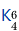 或 I 等等的和弦。此终止式给人未完或延续的感觉，因此通常来说是弱终止式，并预告乐曲的继续。

* 弗里吉亚终止式(Phrygian cadence)：iv6-V 进行的终止式。此终止式因低音部分的半音行进很像弗里吉亚调式中的 II-I 终止式而得名。此终止式源于文艺复兴时期，因此它听起来也有古老的感觉(尤其它之前有 v 和弦时)。另外巴洛克时期常用的做法是以此和弦终结一个缓慢的乐章，紧接着的是一个快乐章。
* 吕底亚终止式(Lydian cadence)
* 勃艮第终止式(Burgundian cadences)

#### 变格半终止（Plagal half cadence、变格半收终止）

用下属功能的和声结束的终止式叫做变格半终止。一般以 IV 级和弦结束，偶尔也可能以 ii 级和弦结束，之前一般是主功能和声，如 I、vi、iii 等，也可能是离调和弦。

### 变格终止式（Plagal cadence、阿门终止(Amen cadence)）——Ⅳ-Ⅰ

变格终止式也被称为阿门终止，由于它经常出现于圣诗中阿们歌词的部分。它为 IV-I 进行，但由于未能达到为乐曲的调性提供解决，在古典主义曲目中不常见，IV-I 进行通常伴随着正格终止式。另外，I-IV-I 进行有机会被解读成 V-I-V。

### 阻碍终止式（Interrupted cadence/Deceptive cadence）——Ⅴ-vi

以属功能和弦（一般是 V 或 V7）起但不以 I 作结(通常是大调的 vi 或小调的 VI、偶尔也出现大调的 IV6、小调的 iv6 等等)。它为一个弱终止式，因为它创造了一个悬念。由于 V 级和弦后一般期待的是 I 级和弦，但是在阻碍终止里，I 级和弦本应该出现的位置被 vi 级和弦替代了，给听众形成了一种意外的音响效果，因此，阻碍终止属于意外进行的一种。

阻碍进行是指在乐句任意位置属功能和弦进行到 vi 级和弦的过程，当阻碍进行发生在乐句末尾时，我们称之为阻碍终止；因此，阻碍终止是阻碍进行的一种。阻碍进行也是意外进行的一种。

### 应用

#### 大七和弦终止法

暂且只能用于大调中

原因：因为总是用主和弦终止，乐曲会显得无聊。

在 C 自然大调中主和弦是 CM7 大七和弦，因此主和弦就是大七和弦，大七和弦就是主和弦，大七和弦也能用于开始或终止。

开始功能：如图 C 自然大调中的 C 和弦与 F 和弦（或者 bDM7）都是大七和弦（尽管 F 和弦是下属和弦），而其他和弦就都不能用于开始


如 Leading Bass 是以 C 开头，四度圈是以 F（下属和弦）开头，它们都是大七和弦

终止功能：

通常属和弦后面接主和弦（如 G7 到 CM7），但其实属和弦后面接所有大七和弦都很顺畅，因此还可以尝试接在属和弦后面接其他大七和弦。
只是实际创作中要注意旋律与和弦的配合。旋律通常结束在主音 1 上，如何配上和弦 BM7（7 #2 #4 #6），因为 1 是和弦外音，所以搭配起来不好听。需要让和弦尽可能配上旋律主音 1

第二种：如 G7 属和弦后要终止。则可以先找到一个包含旋律音的大七和弦，如旋律是 1，则可以找到 bA（b6 b7 1 2 b3 4 5），这是利底亚音阶。可以立即结束，也可以平行大二度再接 bB 大七和弦、C 大七和弦，构成降六降七终止法。

也可以配 bD 大七和弦（b2 b3 4 5 b6 b7 1），平行大二度接 bE、F

也可以配 bE 大七和弦（b3 4 5 6 b7 1 2），平行大二度接 F、G

#### 降六降七终止法

暂且只能用于大调中

在原本的 G7 和弦—> C 和弦之间，添加两个和弦 bA、bB


#### 六级终止法（阻碍终止？）

暂且只能用于大调中

在原本的 G7 和弦—> C 和弦之间，添加一个和弦 Am


接上


#### 利底亚终止式（Lydian）

暂且只能用于大调中

让和声色彩更丰富、更时尚，可以在 C 和弦上演奏利底亚音阶（由原来的 C 自然大调 1234567，变为 123#4567）

在 C

### 

## 评价音乐好坏的常见标准

* 织体够不够丰富。因此要求和弦要丰富，以及往后的倾向性够不够。