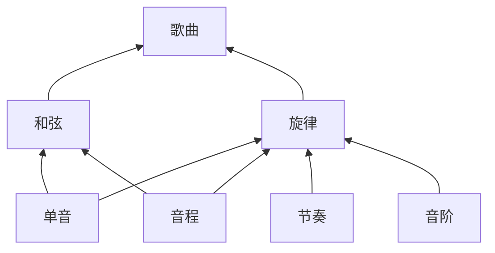

| [Ear training](https://en.wikipedia.org/wiki/Ear_training "Ear training") & Sight-reading                                                                                                                                                                                                                                                                                                                                                                                                                                                                                                                                                                                                                                                          |     |
| -------------------------------------------------------------------------------------------------------------------------------------------------------------------------------------------------------------------------------------------------------------------------------------------------------------------------------------------------------------------------------------------------------------------------------------------------------------------------------------------------------------------------------------------------------------------------------------------------------------------------------------------------------------------------------------------------------------------------------------------------- | --- |
| - [Counting](https://en.wikipedia.org/wiki/Counting_(music) "Counting (music)") - [Interval recognition](https://en.wikipedia.org/wiki/Interval_recognition "Interval recognition") - [Learning music by ear](https://en.wikipedia.org/wiki/Playing_by_ear "Playing by ear") - [Music psychology](https://en.wikipedia.org/wiki/Music_psychology "Music psychology") - [Relative pitch](https://en.wikipedia.org/wiki/Relative_pitch "Relative pitch") - [Solmization](https://en.wikipedia.org/wiki/Solmization "Solmization")      - [Solfège](https://en.wikipedia.org/wiki/Solf%C3%A8ge "Solfège") - [Tempo](https://en.wikipedia.org/wiki/Tempo "Tempo") - [Tonal memory](https://en.wikipedia.org/wiki/Tonal_memory) |     |
|                                                                                                                                                                                                                                                                                                                                                                                                                                                                                                                                                                                                                                                                                                                                                    |     |

# 视唱练耳与扒谱

注意：练唱的时候，要把注意注意力放到听上，要听自己唱+弹出来的音，而不是通过看APP来判断自己唱的准不准，而忽略了用耳朵去听

## 作用

* 增强乐感：提升音准、节奏感以及音乐感受力。

* 极大地提升读谱能力：

  * 只用看谱子，就能在脑海中播放“音乐”。
  * 识谱、读谱能力变强，提升练曲速度
  * 注意：看谱速度

* 极大地提升扒谱能力：

* 提升唱歌水平：因为唱音的同时，也是在练气息与音准，也能听出自己唱得准不准，如果不准，又怎么调整。

* 提升即兴演奏能力：练好视唱练耳是达到play by ear境界的前提。否则听都听不出弹得啥，压根做不到play by ear。

* 提升作曲能力：因为能在脑子里更加清晰地构建旋律，而且还能明白脑海中想的旋律具体是什么。

总而言之，基本上所有

节奏感的练习要点：找到正确的、适合自己的方法，与练习材料，跟着练熟即可。

特别地，其实即兴演奏也能练耳。因为即兴演奏的时候，会想着下个音大概要弹哪些音高，而真弹下去之后，出来的音响效果又能

无音高（听）

建立音位感（唱）

近似绝对音感

注意：唱谱准不准也非常影响听力的，它们是相辅相成的。唱其实也是在帮助把“听感”内化，如果唱不准，要么是没听准（只是听到一个音而已，但并没有感受到它的音高），要么是听准了，但没唱准。因此用唱的方式，可以帮助校验自己是否听准。

## APP

一定要下载一个能检测音高的APP，不然不知道自己有没有唱准。比如：Tuner - Perfect。

## 练习网站

* https://midi.city/
  强力工具！因为上面支持的乐器很多，而如果只听钢琴来练唱，容易养成惯性（听钢琴容易听得出音高，听其他乐器，就吃力），因此需要换着乐器来练视唱练耳。
* https://tonesavvy.com/music-practice-exercises/

* https://web.meludia.com

  类别丰富（不仅有传统的乐理练习，还有其他练耳训练）、大量练习、循序渐进、相对趣味性强，不容易无聊。

* https://app.flowkey.com.cn

做音高相关练习时，要跟着唱，这样有利于听得准。比如有时候听不出哪个音高，自己跟着唱一下，就明白哪个音高了。

## 课程

非常推荐找个课程先看看，不然很可能

* 陈鑫泽视唱练耳

## 所需时间

| 能力                                                         | 参考练习时常       |      |
| ------------------------------------------------------------ | ------------------ | ---- |
| 只想弹简单的曲子                                             | 可以不用学视唱练耳 |      |
| 能够听出简单的节奏、音程、旋律等                             | 3~8个月            |      |
| 能随便看谱唱出99%以上的流行歌。 扒主旋律、简单的器乐伴奏或器乐曲 听出音程、和弦、原位转位性质等 | 半年~两三年        |      |
| 能处理无论多复杂的乐谱 扒全乐队 快速听出复杂的和声、配器等 | 三四年或更久       |      |

## 学习容易犯的常见错误

视唱、练耳花大量时间练，但没效果

* 学习方法错误或不适合自己
* 练习时间安排不对
	* 不要两天打鱼三天晒网。长期坚持，才可以取得显著效果
	* 可以长期地、短时间地练
	* 在保证质量的情况下练习，而不是靠暴力堆时间练习
	* **正确安排练习时间：为了保证效率，避免听觉疲劳，每次练30~90分钟即可，如：**
		  * 单音+音程练半小时。
		  * 节奏练半小时。
		  * 音阶练半小时。
	 可以上午练半小时，下午再练半小时。
* 跳跃式学习，没有基础能力。
	* 要从音程、单音、节奏、音阶一个个练过去。
	* 就像是念英语。先念会音标、再念会单词、再念会句子、再念会段落、最后再念会文章。
	  不要跳跃式学习，不然学习效率非常低，并且学得也非常痛苦。
* 用错误的方法，越错越远
* 尊重记忆曲线，注意复习（可以跟着下面的五大练习项，复习前面练习过的项目），可以就花5~10分钟复习。

## 学习时的注意事项

* 构唱是听辨的前提,必须提前练习。
	* 如果经常唱错，容易在大脑中建立错误的音感。

* 掌握构唱与听辨是有联系的,不要分开，千万不要认为只练听或唱，而不练另一个。

* 先调内,后调外,先升降号少,后升降号

* 多注意不同音程关系比较，不要学了一个，忘了另一个

* 先修乐理基础

* 练习时，先听清楚了（听1~3秒），再跟着唱；

  或者同时弹+唱，这样可以通过听，比对唱的准不准。如果准的话，那两个音就很协和（因为是同一unison）

* 遵守记忆曲线，注意复习，不然熟悉了后面的知识，忘了前面的。

* 男女声差异：

  大部分情况下，男声的音域大致比女声低一个纯八度。

## 关于绝对音高与相对音高听觉

* 少数人具备绝对音高听力
* 大多数人只有相对音高听力
* 极少数人不具备相对音高听力
* 音高听力能力可以随着训练提高
* 争取做到给出参考音,可以听辨固定音高
* 少数学习能力差的学生,请放慢学习进度

## 关于听辨能力与扒带

* 旋律扒带能力与构唱水平有关
* 和声扒带能力与和声听辨能力有关
* 通过视唱练耳训练可以有效提高,同时可以结合widi软件检验扒带是否正确
* 四部和声听觉训练是有效的培养途径 

## 五大练习项（极为重要）

### 歌曲的构成元素（简要版本）

### 项目介绍

注意：一定一定需要循序渐进，一项一项练过去，不要跳。

阶段一：

* 单音：男生声音较低，可以唱C3~B3，女生声音较高，可以唱C4~B4。
* 音程听辨（旋律音程、和声音程）：听出任意两个音的音程关系
  * 旋律音程听辨是听旋律的基础；和声音程听辨是听和弦的基础
  * 掌握音程的音响特点
  * 大小二度、大小三度
  * 纯四五度、纯一八度、大小三和弦
  * 大小六度、大小六和弦、大小四六和弦
  * 三全音、减三和弦原位以及转位
  * 大小七度、属七和弦原位及其转位
  * 增二,减七、增五、减四度、增三和弦
  * 复音程
  * 四部和声听觉训练 
* 音阶 + 调式
* 节奏（Rhythm）：

阶段二：

* 和弦听辨（）：分辨各种和弦的特征，听出和弦的各种排布状态
* 旋律

阶段三：

* 乐曲

### 单音

工具

在线钢琴：https://www.onlinepianist.com/virtual-piano

唱音名时的要求：

* 音稳：唱音的时候，音不要划来划去，不要晃。
* 音准
* 音美

练习方法：
* 先用键盘弹，听清楚之后再跟唱，最好再用手机APP检测唱的准不准。
* 正确地慢练，而不是着急+错误百出地快练。

| Note  | Octave 0 | Octave 1 | Octave 2  | Octave 3  | Octave 4  | Octave 5  | Octave 6   | Octave 7   | Octave 8   |
| ----- | -------- | -------- | --------- | --------- | --------- | --------- | ---------- | ---------- | ---------- |
| C     | 16.35 Hz | 32.70 Hz | 65.41 Hz  | 130.81 Hz | 261.63 Hz | 523.25 Hz | 1046.50 Hz | 2093.00 Hz | 4186.01 Hz |
| C#/Db | 17.32 Hz | 34.65 Hz | 69.30 Hz  | 138.59 Hz | 277.18 Hz | 554.37 Hz | 1108.73 Hz | 2217.46 Hz | 4434.92 Hz |
| D     | 18.35 Hz | 36.71 Hz | 73.42 Hz  | 146.83 Hz | 293.66 Hz | 587.33 Hz | 1174.66 Hz | 2349.32 Hz | 4698.63 Hz |
| D#/Eb | 19.45 Hz | 38.89 Hz | 77.78 Hz  | 155.56 Hz | 311.13 Hz | 622.25 Hz | 1244.51 Hz | 2489.02 Hz | 4978.03 Hz |
| E     | 20.60 Hz | 41.20 Hz | 82.41 Hz  | 164.81 Hz | 329.63 Hz | 659.25 Hz | 1318.51 Hz | 2637.02 Hz | 5274.04 Hz |
| F     | 21.83 Hz | 43.65 Hz | 87.31 Hz  | 174.61 Hz | 349.23 Hz | 698.46 Hz | 1396.91 Hz | 2793.83 Hz | 5587.65 Hz |
| F#/Gb | 23.12 Hz | 46.25 Hz | 92.50 Hz  | 185 Hz    | 369.99 Hz | 739.99 Hz | 1479.98 Hz | 2959.96 Hz | 5919.91 Hz |
| G     | 24.50 Hz | 49 Hz    | 98 Hz     | 196 Hz    | 392 Hz    | 783.99 Hz | 1567.98 Hz | 3135.96 Hz | 6271.93 Hz |
| G#/Ab | 25.96 Hz | 51.91 Hz | 103.83 Hz | 207.65 Hz | 415.30 Hz | 830.61 Hz | 1661.22 Hz | 3322.44 Hz | 6644.88 Hz |
| A     | 27.50 Hz | 55 Hz    | 110 Hz    | 220 Hz    | 440 Hz    | 880 Hz    | 1760 Hz    | 3520 Hz    | 7040 Hz    |
| A#/Bb | 29.14 Hz | 58.27 Hz | 116.54 Hz | 233.08 Hz | 466.16 Hz | 932.33 Hz | 1864.66 Hz | 3729.31 Hz | 7458.62 Hz |
| B     | 30.87 Hz | 61.74 Hz | 123.47 Hz | 246.94 Hz | 493.88 Hz | 932.33 Hz | 1975.53 Hz | 3951.07 Hz | 7902.13 Hz |
### 音程

* 先掌握**级进**，即1->2、5->4等等
* 再掌握跳进，即3->6、7->2等等

建立音位感：要唱，

搭建音桥：

* 通过音阶搭桥：比如不会唱G，则通过音阶从C、D、E、F、G的方式唱到G，以记忆G的音。
* 通过音程搭桥：通过某个固定的音程关系，往上或下推

#### 练习方法

* 通过听，建立声音模型
  * 基于熟悉歌曲的旋律，将旋律拆解，为拆解出来的音程建立对应的音程+和弦+音阶的性质与标记，以在大脑中建立这种听感到乐理的联系。
  * 无音高听力的四个阶段（从上往下）
    1. 慢旋律进行（如：分解和弦）：单音时长长、音之间的间隔长
    2. 快旋律进行（如：分解和弦）：单音时长短、音之间的间隔短
    3. 重低音和声（如：柱式和弦）：低音更重、高音更轻
    4. 快/短和声（如：柱式和弦）：和弦“一闪而过”
    提醒：“进行”指前后发出的音，“和声”指同时发出的音
* 通过唱，感知音程关系
* 如果无法直接唱出2个音，通过唱音阶（二度音程），逐个从一个音唱到另一个音。
  先唱准基本音级（键盘上的白键），再唱变化音级（键盘上的黑键）。
  因此，这个技能的基础是能把音程唱准，特别是二度音程。

技巧：找锚点。就像初学者练五线谱识谱的时候，会先记忆C的音高。视唱练耳也是如此，先练熟C的音高（我是先“喉感”练熟），然后再通过级进的方式，记忆其他音高。

### 节奏

* 节奏一定要稳：跟节拍器。特别是一些人用了节拍器，就不会演奏了。
* 先练基础节奏型
* 复杂节奏型：如加入连音线、空拍
* 速记法

### 调式音阶与旋律

基础：

* 调式音阶听辨

* 调式音阶模唱

旋律视唱

旋律听写

#### 练习方法

* 听：调式特点
* 练：建立调式感、调式音程

## 音的唱名发音规范

唱名存在的意义：为了保持方便发音的口型与气息。

发音方式：
* 开口音：在语言学中，是指发音时口腔开口较大，声音比较直接从口腔发出的音。比如汉语拼音中的“a”“o”“e”等元音。
	* 如果类比到乐器演奏或人声演唱，可以理解为发音比较直接、开放的音色。
	- 在人声中，像“啊”（a）或“哦”（o）这样的元音发音比较开放，声音比较直接地从口腔发出，可以类比为“开口音”。
	- 在乐器演奏中，比如铜管乐器（如小号、圆号）发出的明亮、直接的声音，也可以看作是“开口音”。
* 闭口音：指发音时口腔开口较小，声音通过鼻腔或口腔后部发出的音。比如汉语拼音中的“m”“n”等鼻音，或者“u”“ü”等发音比较靠后的元音。
	* 可以理解为发音比较含蓄、内敛的音色。
	* 在人声中，像“恩”（m）或“嗯”（n）这样的鼻音或半闭合的元音发音，声音通过鼻腔或口腔后部发出，比较含蓄，可以类比为“闭口音”。
	- 在乐器演奏中，比如弦乐器（如小提琴）使用弱音器演奏时，声音会变得柔和、内敛，也可以看作是“闭口音”。
  

Traditional fixed do

https://en.wikipedia.org/wiki/Solf%C3%A8ge

|                        Note name                        | Note name |   Syllable   | Pronunciation | Pronunciation | Pitch class |
| :-----------------------------------------------------: | :-------: | :----------: | :-----------: | ------------- | ----------- |
|                         English                         |  Romance  |              |  Anglicized   | Italian       |             |
|  [C♭](https://en.wikipedia.org/wiki/C♭_(musical_note))  |    Do♭    | do （开口音）  |     /doʊ/     | /dɔ/          | 11          |
| **[C](https://en.wikipedia.org/wiki/C_(musical_note))** |  **Do**   |              |               |               | 0           |
|  [C♯](https://en.wikipedia.org/wiki/C♯_(musical_note))  |    Do♯    |              |               |               | 1           |
|  [D♭](https://en.wikipedia.org/wiki/D♭_(musical_note))  |    Re♭    | re （开口音）  |     /ɹeɪ/     | /rɛ/          | 1           |
| **[D](https://en.wikipedia.org/wiki/D_(musical_note))** |  **Re**   |              |               |               | 2           |
|  [D♯](https://en.wikipedia.org/wiki/D♯_(musical_note))  |    Re♯    |              |               |               | 3           |
|  [E♭](https://en.wikipedia.org/wiki/E♭_(musical_note))  |    Mi♭    | mi （闭口音）  |     /miː/     | /mi/          | 3           |
| **[E](https://en.wikipedia.org/wiki/E_(musical_note))** |  **Mi**   |              |               |               | 4           |
|  [E♯](https://en.wikipedia.org/wiki/E♯_(musical_note))  |    Mi♯    |              |               |               | 5           |
|  [F♭](https://en.wikipedia.org/wiki/F♭_(musical_note))  |    Fa♭    | fa （开口音）  |     /fɑː/     | /fa/          | 4           |
| **[F](https://en.wikipedia.org/wiki/F_(musical_note))** |  **Fa**   |              |               |               | 5           |
|  [F♯](https://en.wikipedia.org/wiki/F♯_(musical_note))  |    Fa♯    |              |               |               | 6           |
|  [G♭](https://en.wikipedia.org/wiki/G♭_(musical_note))  |   Sol♭    | sol （开口音） |    /soʊl/     | /sɔl/         | 6           |
| **[G](https://en.wikipedia.org/wiki/G_(musical_note))** |  **Sol**  |              |               |               | 7           |
|  [G♯](https://en.wikipedia.org/wiki/G♯_(musical_note))  |   Sol♯    |              |               |               | 8           |
|  [A♭](https://en.wikipedia.org/wiki/A♭_(musical_note))  |    La♭    | la （开口音）  |     /lɑː/     | /la/          | 8           |
| **[A](https://en.wikipedia.org/wiki/A_(musical_note))** |  **La**   |              |               |               | 9           |
|  [A♯](https://en.wikipedia.org/wiki/A♯_(musical_note))  |    La♯    |              |               |               | 10          |
|  [B♭](https://en.wikipedia.org/wiki/B♭_(musical_note))  |    Si♭    | si （闭口音）  |     /siː/     | /si/          | 10          |
| **[B](https://en.wikipedia.org/wiki/B_(musical_note))** |  **Si**   |              |               |               | 11          |
|  [B♯](https://en.wikipedia.org/wiki/B♯_(musical_note))  |    Si♯    |              |               |               | 0           |
|                                                         |           |              |               |               |             |

P.S. 建议不要把B，常作Si，而是唱作Ti，会更好唱。
带升号的唱名是把原本的唱名的结尾，唱作i。如C是Do，则C#是Di，以此类推。
带降号的唱名是把原本的唱名的结尾，唱作e。如B是Ti，则Bb是Te，以此类推。特别地，re本身就唱作re，因此它的降号音符唱作ra。

## 识谱（Sight-reading）

识谱快的人是因为他们已经理解、练习很多种音乐中常见的排列组合，已经熟悉了“音乐”这门语言，他们甚至能预测接下来旋律的走向。这就跟初学者和熟练者读外语文章一样。

EarMaster

## 扒谱（Transcribe）

重要性：学编曲最快的方式是编曲，而不是扒带。有效的方式之一就是扒带。

之所有有这种说法是因为，扒带的过程中要去理解别人的曲子中用到的理论知识，给自己学到的乐理一个验证和总结。而扒带只能学其表面，很难学会其内核，不成体系。

还有就是复杂的管弦乐没法扒。

自动扒谱：https://www.zhihu.com/question/22185725

个人感悟（非常主观）：一般是先听音乐，然后把听到的东西唱出来，再根据口腔的感觉（这个感觉源自平时的视唱练耳练习）推出音高。

### 测速

https://www.bilibili.com/video/BV1vE411Y7PE/?spm_id_from=333.788.videocard.8

节拍计算器：粗略测速，主要用来测自己歌的速度

范围选择配合节拍计算器：适合测匀速的歌曲。大部分流行歌都是匀速。

使用时间伸缩工具精准测量

## 即兴演奏

使和声更丰富的方法

* 在C大三和弦（135），添加一个七音B（距离半音，感情慎重）或一个九音D（距离全音，感情自由）
* 在Am小三和弦（613），添加一个七音G（距离全音，感情自由）或一个九音B（距离全音，感情慎重）
* 在G7属七和弦（572），添加一个七音F（距离全音，感情自由），或九音A（距离全音，感情自由），或十三音是E（五音到十三音距离全音，感情自由，有点爵士的感觉）

### 爵士的即兴演奏

躯壳排列（Shell Voicing）

在和声当中，**和弦能被另一个和弦替代是基于它们拥有不少共同音，这就是所说的“听感”**。

“根，3，7”三个音就构成了爵士的核心

根音决定这个和弦姓什么，比如F、B、E三个音，根音是G的时候它们叫做G13，根音是Db的时候它们叫做Db7。

3音（有时候是sus4）决定了这个和弦的大小，即记作m还是该记做M。

7音和3音一道，决定了这个和弦的属性，大三小七=属，大三大七=Maj7，小三小七=m7。

在shell voicing的R、3、7三个音里，其实3、7更重要一些，因为根音可以随便换，姓可以随便换，但是这个和弦的功能却不能换。比如一个ii-v-i进行，其实可以抽象为一个41－47－37的37音进行。这三个双音进行足够暗示ii-v-i了
