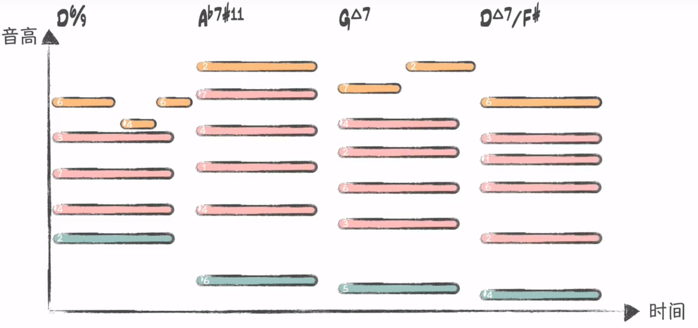
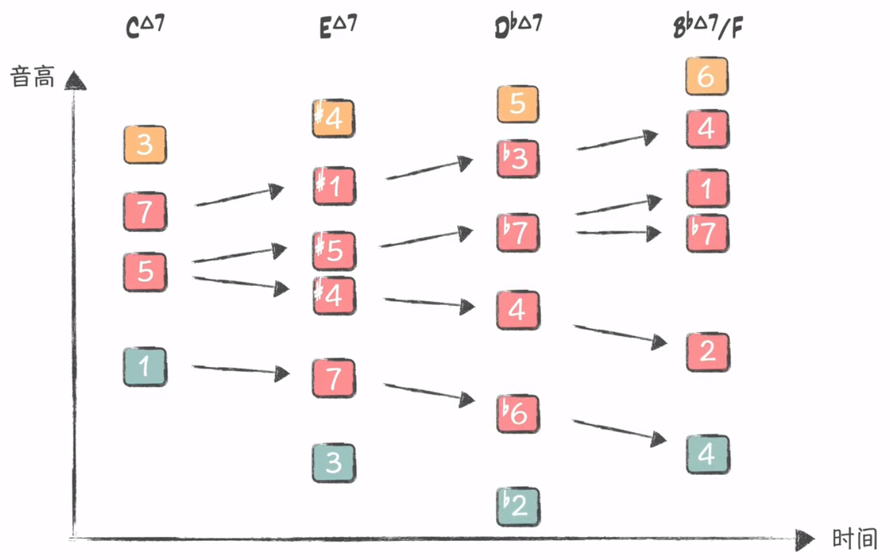

# 和声（Harmony。和弦与调式调性）

几个不同的音在同一时间的结合叫做和音。不同和音的连续进行（和弦进行）就是和声。 不同时期、不同风格、不同流派的音乐使用的和声也不同。

在古典音乐和现代音乐中有一定的区别，和声在古典音乐中是指的和弦与和弦之间的连接，以及和弦与和弦之间音符的连接，所以古典音乐和声相当于包含了和声（Harmony）与和音（Voicing）两个概念，在古典和声学中都是要求和弦的纵向和横向同步来学习，有一个很系统的体系。

和声在现代音乐中又叫和弦连接或者叫和弦编配，它通常只是讲和弦与和弦之间连接的用法要求，对和弦与和弦之间音符的连接并没有过多的要求，现代音乐中其实就是把古典音乐的和声分开来说明，因为在现代音乐中，风格太多样，所以就算用同样的和弦连接，在不同的风格中它用法以及和弦弹法也是不一样的

和声丰富多采的表现力，是基于和声进行中的**力度**和**色彩**两方面的因素所形成的

和声功能

* 声部关系的组织作用。
  在主调音乐中，音乐进行以纵向和弦结构与横向和声进行为主导。纵向各声部的乐音根据特定的“和弦结构原则”同时结合构成“和弦”。横向各和弦之间根据特定的“和声进行逻辑”作有序连接构成“和声进行”。
  各声部的乐音进行在和弦结构原则与和声进行逻辑的综合控制下纵横结合，组成多声部音乐的有机整体，从而体现出和声所具有的声部关系的组织作用

* 形成曲式的结构作用

  从宏观方面来看，首先，曲式结构的不同部分在和声应用上各有不同特点——在不同的结构段落采用不同的调性布局、不同的和声进行、不同的和声终止。其次，乐曲整体结构的有机组成有赖于和声发展的整体布局。
  从微观方面来说，不仅各种音乐“语气”的表达需要通过不同类型的和声进行予以支持，乐句、乐段等曲式单位的确立也需要通过不同的和声终止予以肯定

* 音乐内涵的表现作用

  采用不同的和弦结构与不同的和声进行，能够使多声部音乐产生不同的音响效果与不同的和声色彩，起到烘托旋律、刻画意境、塑造形象、表达感情的音乐表现作用

## 和声学

和声学是研究主调织体多声部音乐写作技法与创作原则的作曲技术理论学科

### 学习和声学的意义

* 学习音乐写作的规则
* 学习分析前人经典作品和创作思路的方法

和声学告诉你一些和弦连接的规则，如何保持声部线条的流畅度、歌唱性，实际上爵士和声与所谓的“流行和声”都是建立在古典和声学的基础上，学习它们你至少得保证对古典和声学的一些概念有足够的理解，比如各种功能。

当涉及到将和声分解成各个声部的乐器时，你就必须了解各个乐器的特性，它们的音域、演奏法、声响效果等等。我不建议初学者进行“只要好听就行，不要管写出来符不符合乐器的演奏法”这样的操作，因为你没有足够的音乐经验去判断，“好听”是个很主观的东西，它很容易把你带偏，让你自以为没有问题。

但你想编到像现在商业流行歌那个程度，偶尔带点弦乐或者四大件以外乐器那种，那么你就不能只学和声。

曲式復調配器中的很多東西都建立在和聲之上，所以如果沒有學過和聲去看這些書可能有的部分是看不懂的。反過來的話肯定就沒有什麼問題，和聲本來就是應該先學的。

### 起源

* 非洲人所创作的和弦进行是一种循环往复的、带有节奏或律动的音乐感觉。这种方式以调式的基本色彩与律动的节奏，共同烘托出了歌词故事的整体氛围
* 欧洲人创造了和弦的各种类型（大和弦、小和弦等），以及我们使用的大部分调式
* 传统和声还提出了这样的厩念：和弦在调式中被划分为“家”或“离家” 的两种进行。这种划分强调了和弦趋向于主和弦的行进，即向“家”的移动倾向，这样的和弦进行可以对歌词或旋律乐句进行润色
* 现代流行音乐是将这两种和声途径的有效结合，形成了欧洲与非洲和弦的混合体。体会这种类型的功效，有助于在写作歌曲的过程中找到自己的创意

### 和声分析步骤

* 谱例呈现
* 精确地判断出调性，即：某某调。其具有"坐标式核心地位"的意义，主导着和弦级数的标记。

## 基础知识体系

* 三大基础知识点

  * 调式与调性

    * 调式：音与音之间表现出的外在形式。即：围绕着某一稳定的中心音，按照一定逻辑关系组成的音与音之间的有机整体。以此构成诸多调式音阶，如:五声音阶、七声音阶、中古调式(教会调式)等。 
    * 调性：音与音之间所表现出的内在性质。即：调式类型与其某一稳定的中心音的统称。如：以G为主音的大调式(G大调)、以a为主音的小调式(a小调)等。因此，某某"调"指的是调性。

  * 和弦的构成、分类、转位：和弦是在泛音的基础上构建而成,并以三度叠置的形式予以扩展(三和弦、九和弦、十一和弦等)。

    和弦构成的六字诀：纵向三度叠置。“纵向"是形式，"三度叠置"是方式。分类与转位见上文

* 各级和弦的分组、"特性”、进行

* 节奏织体、时值长短与和弦分布

* 快速判断主调及自然和弦级数

## 声部

和声是指音乐作品中的和弦运动，是由若干个不同的和弦相继奏出而构成。 从一个和弦到另一和弦的运动叫“和弦进行”或“和弦序进”。

和弦的声部自上而下分别称为第一声部、第二声部、第三声部和第四声部。 最高声部和最低声部被统称为“外声部”，其余的中间声部被统称为“内声部”。 声部的横向运动叫做“声部进行”。

常见的和声写法为四声部，在四个声部的基础上，可以根据需要适当增减声部的数量。 对于三和弦或九、十三等和弦，如果要保持四个声部，就需要重复某个音以填补缺少的声部或省略某音以去掉多出的声部。

### Voicing（声部的纵向安排）

流行乐声部

1. 旋律声部
2. 低音声部
3. 内声部：在旋律声部与低音声部之间的声部

### 声部进行（Voice Leading、声部的横向安排）

含义：由一个和弦进行到另一个和弦，实际上是和弦的横向运动。声部的横向运动叫声部进行。声部运动不超过三度的叫平稳进行；超过三度时叫跳进。

任意性质的和弦都能通过Voice Leading彼此顺畅连接

## 四部和声（four-part harmony、SATB: soprano女高音, alto女低音, tenor男高音 and bass男低音）

含义：音乐作品由四个声部记谱，称为四部和声。四部和声是多声部音乐写作的常用形式，与混声四部合唱的记谱相同

各个声部按照和声进行相互独立的且有组织的结合。在这四部和声中，它们与人声的四种声乐类型相一致的，通常我们把最高的声部称作旋律声部。

四部和声具有和声音响丰满、各声部音区适中的特点，并能与人声的四个声部（女高音、女低音、男高音、男低音）相互对应，是多声部音乐写作最常使用的分部和声形式

和声学教材里，大抵都是用二分音符与四分音符的柱式和弦的四声部和声的形式在给各种和声连接及其相应规则举例。这是因为这些柱式和弦的四部和声谱例，并不是真实的音乐，而是真实的、鲜活的、细节化的、织体化的音乐的一种抽象。

大家在用四部和声谱例学习各种和声规则的时候，并没有有意识地把这些四部和声谱例和真实的音乐结合起来，也缺乏一种把真实的音乐谱例中的和声从各种织体中提炼出来抽象成四部和声柱式和弦的形式的训练

当我们在学和声的时候，用柱式和弦织体来写作，可以让我们最高效地把注意力放在和声的内容上