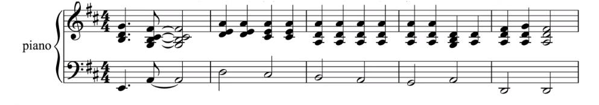
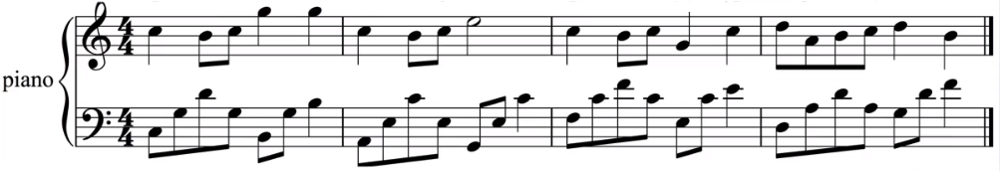
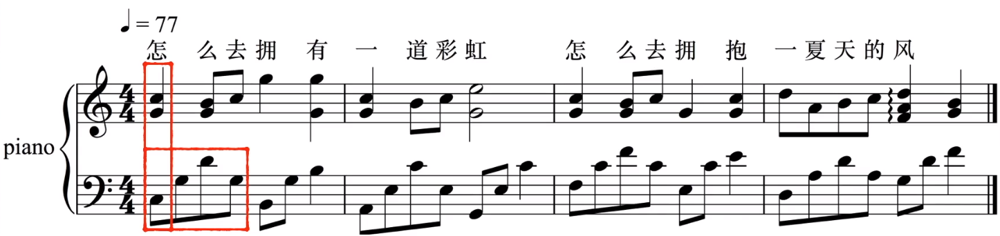
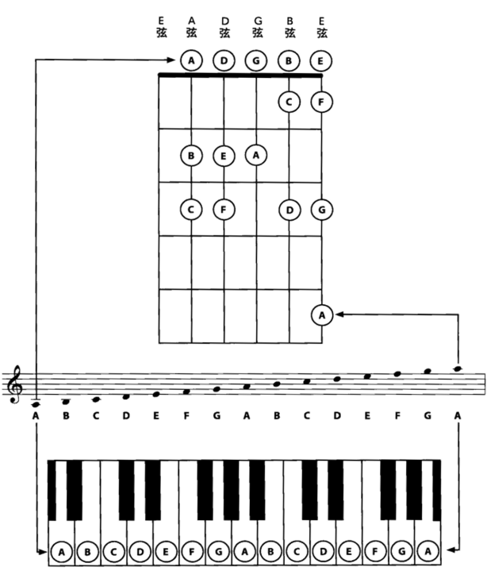
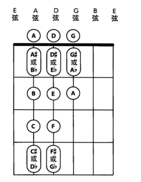
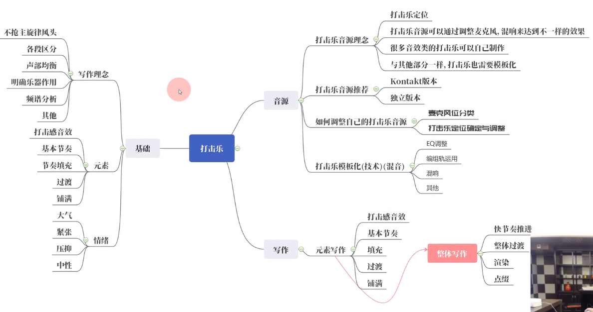
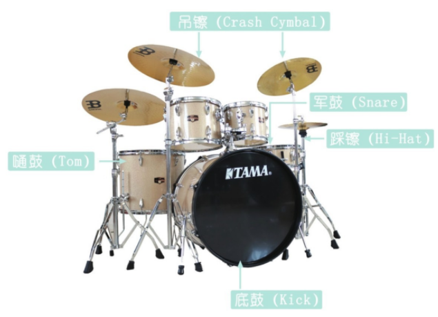
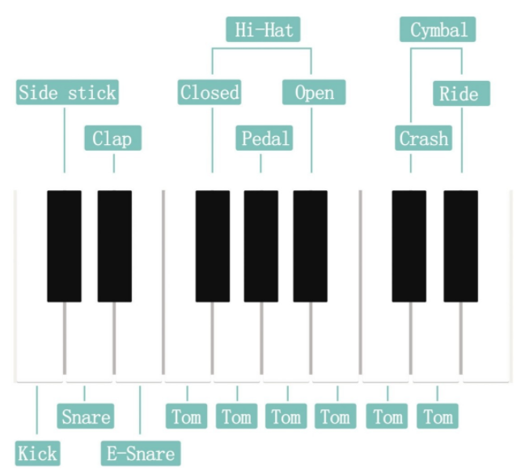

# 配器（Orchestration）

流行乐队的四大件乐器吉他,贝斯,鼓和键盘。

对于编写Bass&Drum电子舞曲，那么不需要对传统的曲式、配器甚至和声懂太多，掌握好节奏就行。但如果想编到现在商业流行歌的程度，偶尔带点弦乐或者四大件以外乐器那种，那么就不能只学和声。

### 配器的四个基本层次

一首完整的器乐合奏（包括伴奏音乐）应该包括以下几个最基本的织体层次：

1. 旋律层。这是每一首乐曲最先被别人听到的层次，他是全曲的灵魂所在

   特点：旋律不同于其他层次，具有可歌唱性、亲切而鲜明

   适用乐器：各种乐音乐器均可用于旋律的演奏

   这个层次还可扩展出副旋律层，第二副旋律等等.请听这个例子[(例1)](http://www.midifan.com/image/technology/li1.mid),大家可以听到的就是主旋律,接着我们单独听一下主旋律和副旋律,[(例2主旋律)](http://www.midifan.com/image/technology/li2.mid) [(例3副旋律)](http://www.midifan.com/image/technology/li3.mid)。

2. 和声节奏层。这是用某些乐器组或和声性乐器以恰当的和弦进行的方式，按音乐的律动规律衬托旋律的层次。和声的律动节奏型十分灵活，有柱式和弦[(例4)](http://www.midifan.com/image/technology/li4.mid)、半分解和弦[(例5)](http://www.midifan.com/image/technology/li5.mid)、分解和弦[(例6)](http://www.midifan.com/image/technology/li6.mid)、综合型[(例7)](http://www.midifan.com/image/technology/li7.mid)等等（以上例子均用钢琴作和声乐器演奏），这个层次既是音乐节拍律动的交待（节奏性的和声），又是调式调性的交待,同时还用来衬托音乐个性化的背景（背景性的和声）。请听[(例8弦乐和声背景)](http://www.midifan.com/image/technology/li8.mid) ;[(例9铜管乐舞蹈性节奏)](http://www.midifan.com/image/technology/li9.mid) ;[(例10竖琴的分解和弦背景)](http://www.midifan.com/technology/li10.mid)。

   类别

   * 节奏性的和声。节奏性的和声是器乐合奏中的一个层次，并不是某种乐器或某种伴奏型。

     5种织体类型

     * 柱式织体[（点击听）](http://www.midifan.com/image/tech/music/l1.rmi)
     * 半分解织体[（点击听）](http://www.midifan.com/image/tech/music/l2.rmi)
     * 分解织体[（点击听）](http://www.midifan.com/image/tech/music/l3.rmi)
     * 综合织体[（点击听）](http://www.midifan.com/image/tech/music/l4.rmi)  
     * 包含了以上四种的复式织体

     

     柱式和声主要在乐曲的配器手法简单的情况下使用，比如马丽安的without you一开头就是用的例1这种织体，简洁而带有淡淡的忧伤感

     在乐曲的发展性段落中常用分解或综合织体，因为流动感更强

     ### 实践原则

     原则：不要用很多乐器演奏同样的织体，各声部和声的丰满度要控制得当，不可堆砌，能省就省，不见得每个声部都要把和弦的所有音演奏出来。

     不堆砌的方法：可以在钢琴上演奏根音和五音，吉他声部出现三音，但不要都堆满。总的原则是三音、七音、九音和色彩音尽可能少出现（但不能没有），根音和五音可以多重复。

     使和声丰满的方法：有可能要留些空间给背景和声。节奏性和声声部的音量视不同段落给予调整，在声部较多时让他听不太清就好

   * 背景性和声。

     作用：适当的使用背景和声会让音乐变得清新动人，请听这段音乐[（例5）](http://www.midifan.com/image/tech/music/l5.rmi)弦乐背景和声刚出来时还是单音，渐渐的随音乐的推动发展成和弦

     误区：

     * 在乐曲一开头弦乐和声就铺天盖地的出来，除非要营造这样的戏剧性效果，否则到了发展段将无计可施。
     * 关于电吉他drive的效果背景，你可能在一个通道里使用drive的solo和背景和声，这样背景会随着solo变成前景，把主旋律淹没得一蹋糊涂。解放办法：大可把背景和声放到另一个通道中，这样好调节它的gain或volume，而且千万不要用密集的和弦，一般drive顶多用纯五度的双音走背景，或用单音也无防。  

3. 低音层 与和声节奏层一样低音层也是乐曲中非常重要的角色,没有好的低音的音乐是不完整的和单调的.主要的低音乐器除了传统的如Bass,Tuba,Basson等,在各种音源中还有许多合成音色,这些音色无论作和声节奏也好还是作低音也好都有传统乐器所不及的地方,这有待同志们去开发利用.但我也劝大家,低音层在以往种被人们忽视,仔细听一下,没有哪首好的乐曲不是低音设计得非常细致的.他既要体现每一个和弦的功能,同时低音的连接本身就是一段好听的旋律.,在作曲的过程当中我们还要注重低音的连贯性和旋律性.请对比一下:[(例11只有和弦根音的低音)](http://www.midifan.com/image/technology/li11.mid); [(例12带有节奏感的低音)](http://www.midifan.com/technology/li12.mid); [(例13旋律性更强的低音)](http://www.midifan.com/image/technology/li13.mid).可以很容易听出来最后一种低音的旋律,音乐更富流动感。

4. 噪音层 这是由一些非乐音成分组成的,如打击月,风声,鸟鸣声等,他们虽然在乐曲中不是主导地位,但对于音乐风格的展现和个性的表达起到了不可抹煞的作用.但也应该注意到,电子乐器和音源的使用使得噪音的运用变得空前的方便和简单,固不要忍不住就乱用,用得恰当可以使音乐陈述更加有力,用得不当只会适得其反。

### 十个基本准则

* 音色无好坏，运用有优劣。慎重选择演奏主要旋律的乐器音色，有其是主题的初次陈述，做到风格、性格、情绪或形象恰如其分，非他莫属。
* 音色保留有利于特定音色出现时的新鲜感。所谓音色保留，指当你需要一个重要的音色陈述一个重要的旋律片断时，其前面的配器应尽可能少用或不用该音色的乐器。如休止几小节或一个小段落，即故意“藏匿”一会，再露面时，常有“容光焕发“的效果。
* 音区保留是突出旋律的有效方法。所谓音区保留，指当主要旋律声部处于低音区或中音区时，要给他留出不受干扰的活动空间，其他织体因素最好不要在此音区出入。
* 和声节奏宜宽不宜紧。乐队曲中和声节奏的通常以宽为主，效果会更好些。比如一个乐句，或配一个和弦，或配两个和弦，切忌和弦变换的频率过快，以致和声音响混乱。
* “上秘下疏中不空”是和弦排列的基本原则。要注意低音区用密集的排列、中音区空洞无声部。特别是在配置音区分布较宽的全洲和弦时，遵循上秘下疏中不空的原则，才可获得均衡的有良好共鸣的音响效果。
* 重视“乐队踏板音”的使用。当音乐织体中和声音型程分解和弦形态并由多件乐器分别演奏时，若选择音色融合性较强的乐器以长音的形式予以支持，可避免乐队音响的干涩。这种做法有如钢琴演奏时延音踏板的效果。
* 乐队织体的清晰依赖各要素之间的对比。注意把握织体内部旋律与其他因素（如伴奏、陪衬等）之间在音色、音区、力度、形态等方面的对比。有对比才易发挥不同要素各自的功能，取得相得益彰的效果。要素之间缺乏对比的织体，其音响很可能是混成一团的。
* 乐队音响的涨落要与乐器的进入和退出联系起来。当需要乐队音响逐步增长时，应随着乐器的渐次进入，使音区不断扩张、织体逐步加厚反之，当需要乐队音响逐步消 退时，应使乐器渐次退出，织体逐步变淡、变薄、稀疏。那种仅仅依赖力度符号的改变依赖演奏上强弱变化来获得乐队音响涨落的做法，往往是徒劳的。
* 慎用齐奏和全奏。总谱不可写得太满注意“留白”。这是“保护”各种音色鲜明个性的最好办法。配器中运用不同的乐器，有如绘画中使用不同的颜色。红、黄、蓝 三原色，单独使用，对比鲜明。红黄混合成橙色，黄蓝混合成绿色，也很有特点。但如果不分青红皂白，将所有颜色混合在一起，即成为灰色。同理，乐队中的乐器音色各异，齐奏全奏过多，总谱写得太满，甚至所有乐器从头到尾不间断地使用，给人的感觉是灰调子，无变化，无个性，缺乏表现力。
* 力求每一个声部都生动流畅有趣味。不论主旋律声部、副旋律声部、和声低音以及和声内声部都应力求生动流畅有趣味，千万避免某一声部长时间无变化的枯燥乏味的写法

使用MIDI写作时，要遵循现实乐器的特点（如音域（旋律音域、伴奏音域）、技法、音色特点）

## 钢琴

### 钢琴伴奏织体的基本形态

柱式和弦：同时刻演奏一个和弦中所有的音。柱式和弦自身没有旋律，一般用于给歌手伴奏

分解和弦：依次演奏一个和弦中所有的音。一般右手演奏旋律（下图高音谱部分），左手演奏伴奏（下图低音谱部分）

半分解和弦：即有柱式和弦，又有分解和弦

## 管弦乐团的四大乐器

### 弦（Strings）

小提琴（violin）

中提琴（viola）

大提琴（cello）

低音提琴（double bass）

### 木管（Woodwinds）

长笛（flute）

双簧管（oboe）

单簧管（竖笛，clarinet）

低音管（巴松管，bassoon）

### 铜管（Brass）

小号（trumpet）

法国号（french horn）

长号（trombone）

低音号（大号，tuba）

### 打击（Percussion）

定音鼓（timpani）

大鼓（bass drum）

小鼓（snare drum）

铜钹（Concert cymbals）

锣（tam-tam）

铃鼓（tambourine）

三角铁（triangle）

马林巴琴（marimba）

木琴（xylophone）

铁琴（vibraphone）

高音铁琴（glockenspiel）

在交响乐团中，广义的打击乐分为定音鼓和打击乐，打击乐中又分为旋律类和非旋律类。旋律类有：木琴、马林巴、钢片琴、颤音琴等；非旋律类有：小鼓大鼓、镲、三角铁、铃鼓、沙锤、音树等等

水琴，无调性乐器，恐怖片里比鬼的存在感还高的东西

## 流行编曲四大件

键盘乐器、吉他、贝斯和打击乐器

### 键盘乐器

具体种类：钢琴、风琴、电子钢琴、合成器、羽管键琴、MIDI键盘等

作用：演奏旋律声部，也可以作为和声乐器担任伴奏声部

表现力强，可以演奏节奏鲜明、和声复杂的柱式和声。演奏复杂织体是钢琴最大的优势

特殊技巧：大范围的刮奏（要么全白键、要么全黑键）

音色组合：除了个别个性非常强的乐器，与其他任何乐器的音色都能配合

不要使用颤音、滑音等控制器

在爵士乐中通常不使用延音踏板，注意音的颗粒性。但在狭义的流行音乐中可以在慢速节奏中要使用延音踏板。在延音时，高音区的音消失得比较快，低音区则相反且浑厚 但要避免混乱

爵士乐中力度相较随意

由于钢琴的音头明显，因此无法用作和声性质的长音铺底（需要弦乐）

### 吉他

具体种类：木吉他、电吉他、古典吉他等

作用：它们丰富的演奏技巧赋予了音乐生动、华丽的表现力，可以奏出流行音乐中不可或缺的旋律以及和声

MIDI真实性：由于吉他类乐器演奏手法多样，所以想用MIDI来实现和真实演奏一样具有超高表现力的感觉是很难达到的，只能贴近真实演奏的感觉

标准调弦：“标准调弦”是指将吉他从六弦到一弦调至EADGBE（纯四度-纯四度-纯四度-大三度-纯四度）的，从最低的音弦（6弦）到最高的音弦（1弦）。吉他手（尤其是指弹吉他手）在吉他上使用了很多创造性的调弦方法，而在电吉他和古典吉他中，绝大多数时间都使用标准调音。

技巧：扫弦、击弦、勾弦、击勾弦、拍弦、闷音？

### 贝斯

贝斯又叫作低音吉他，和电吉他的原理基本一样，但是使用的琴弦要比电吉他粗很多。电贝斯通常都是四根弦,在音乐演奏中电贝斯主要负责演奏低音部分。当然，除四弦贝斯以外，还有五弦贝斯、六弦贝斯，甚至是八根琴弦的贝斯、木贝斯。

MIDI真实性：贝斯的演奏手法与吉他也很像，只是相对容易一些，MIDI制作起来也简单一些，易于模仿

### 打击乐

以爵士鼓（架子鼓）为主要节奏核心，常辅以辅助性小打乐器丰富节奏织体以及音色

注意：不同的音乐风格有相对固定的节奏音型和音色搭配

MIDI真实性：从声音形态来看，打击乐大多属于颗粒状音色，MIDI制作和模仿起来比较容易

### 架子鼓（爵士鼓、Drums）

作用：爵士鼓在音乐织体中虽然承担伴奏层面的功能，但它犹如乐队的指挥，引导着整体音乐的发展和律动（乐曲的节奏、律动、速度）

#### 各部位

* 底鼓（Kick）底鼓又称为大鼓或低音大鼓，是爵士鼓中的低音乐器。底鼓的音色结实、低沉、有力，与低音乐器有较好的融合性，常和军鼓构成基本的节奏型。底鼓使用脚踩踏板演奏，所以灵活性较其他乐器稍逊。

* 军鼓（Snare）军鼓又称为小鼓或小军鼓，军鼓音色清脆、响亮、穿透力强、力度变化较大。军鼓是用鼓槌敲击发声，很多音源中预制了不同力度的军鼓音色，在实际演奏中，敲击不同位置也可以得到不同的声音。

  常见的演奏有鼓击（Snare）（用鼓槌敲击军鼓中心位置的正常发声）、边击（Side）（用鼓槌敲击军鼓边缘的发声）等。

* 踩镲（Hi-Hat）踩镲是高音乐器，音色清脆、穿透力强、富有颗粒性。踩镲是用左脚踩踏和鼓槌敲击来进行演奏的。爵士鼓中的一般以四分音符、八分音符或十六分音符为单位做一定的循环来敲击，以平衡底鼓与军鼓的节奏变化。
  踩镲通常有3种演奏法：①用鼓槌敲击闭合的踩镲称为闭镲（Hi-Hat Closed），适合演奏密集和较快的节奏音型。②敲击打开的踩镲称为开镲（Hi-Hat Open），演奏效果不如闭镲奏法轻巧。③用踏板踩下踩镲使两个镲片合击的声音称为踏板踩镲（Hi-Hat Pedal），余音较长，通常和闭镲以及开镲结合使用，常用于乐段、乐句过门的地方，以提示乐段、乐句的结束。

* 嗵鼓（Tom）嗵鼓又称为嗵嗵鼓，由音高不相同的鼓组合而成。一般的爵士鼓中配有3~5个，用鼓槌敲击演奏。嗵鼓按照音高关系分为高音嗵鼓、中音嗵鼓和低音嗵鼓，常用在乐句、乐段、高潮的连接处，来推动音乐的发展以及过渡。

* 吊镲（Crash Cymbal）吊镲也称为炸镲，声音洪亮、穿透力强，在实际演奏中，敲击不同的位置会得到不同的音色。正常的敲击边缘能发出响亮的声音。鼓音源中一般至少有2~3个吊镲音色，有厚薄以及左右声像之分。吊镲中还有一个镲称为吊顶或者叮叮镲（Ride Cymbal），它是敲击镲的顶部，常代替踩镲演奏，效果比正常敲击吊镲的声音要清脆。鼓音源中一般有两个以上的吊顶音色，也有厚薄以及左右声像之分。

#### 键位图

下图是爵士鼓音源对应MIDI键盘的位置图，大部分标准音源都是采用的这种排列方式，个别电子鼓除外

打击的位置、声音的震动、底鼓的共鸣，电子鼓（便携、不扰民、可以改变音色）无法很好地表现，比较死板

#### 基本套路

Hiphop：在嘻哈编曲中，鼓组的律动感是决定整首歌曲基调的重中之重

### 风格技法

80年代：gated reverb

## 弦乐

加入弦乐烘托氛围，在流行乐中十分重要，大多以提琴组为核心，也有会用到管乐团做氛围的情况

## 其他乐器

整体的结构和频段铺满之后，可以尝试加入一些特别的乐器，例如铜管、弦乐的独奏、风琴、口琴
甚至二胡、古筝等民族乐器

## 具体实例

《神思者故宫的回忆》：其实很简单,钢琴一架,小提琴一把,drum kit一组(大约是Ambient风格的),一个电子键盘(可能是合成器或工作站或舞台键盘),用的是一种类似vibraphone的合成音色.还有一个应该是电子类的吹奏乐器，具体是什么听不出来
New Age的配器大多很简单，不过会追求新颖，加一些独特的小众乐器（大多来自世界音乐World Music），比如陶笛奥卡利那笛之类的。