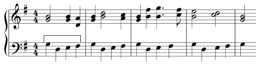
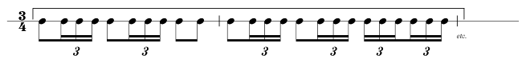
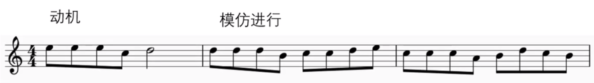

# 作曲法

织体由简单到复杂：https://www.youtube.com/watch?v=m6buIdQacoM

歌曲写作的组成：旋律、和声、曲式、歌词

和声写作的组成：和弦、调式、节奏、歌词、旋律

#### 步骤

1. 律动创作
2. 选择和弦

## 律动创作

律动的四个方面：拍子、风格、节奏强度、节奏动机

律动的重要性：可以在绝大多数耳熟能详的流行金曲中发现律动。律动与旋律、和声一样重要，特别是在诸如乡土布鲁斯（Funk）（是一种节奏性比较强，具有蓝调色彩的音乐形式）这样风格的音乐中尤为重要

学习方法：重新编排自己所熟知的流行金曲中的律动，是开始学习作曲的最好方法之一。编排练习要使用与流行金曲中相同的律动，但要变换和弦

律动示例（注意律动的中等速度和摇滚曲风）

```abc
T:律动一
M:4/4
L:1/4
K:C
B4 | B B B B | B2 B2 | B4 |
```

```abc
T:律动二
M:4/4
L:1/8
K:C
BBBB BBBB | B2 BB z4 | BBBB BBBB | B2 BB z4 |
```

```abc
T:律动三
M:4/4
L:1/16
K:C
Q:100
BBBB z4 z2 BB BB z2 | BBBB z4 z2 BB BB z2 | BBBB z4 z2 BB BB z2 | BBBB z4 z2 BB BB z2 |
```

另外，请注意单个的和弦是如何在不同的律动中发展出多种不同的动机的。 当你进一步学习和弦时，一定要将它们在各种不同类型的律动中进行尝试。

#### 练习方法

* 通过结合两首不同歌曲的和弦进行和节奏动机，先来创作一段新的律动。思考一下这段律动要表达怎样的感情。
* 然后再根据和弦进行，创作出你自己的旋律动机以及适合旋律的歌词。思考一下这段的旋律与律动的结合体，要表达怎样的感情，以及这首歌曲将要表达怎样的感情。

### 发展律动

当为歌曲选好了律动（速度、风格、节奏强度以及节奏动机）后，可以运用各种不同的方法将其发展成歌曲段落（主歌、副歌、桥段等）

#### 方法

绝大多数流行金曲都是通过以下三种方式中的一种，将律动发展成为歌曲段落的

* 完全重复。律动的节奏动机完全重复

  ```abc
  T:完全重复
  M:4/4
  L:1/8
  K:C
  Q:140
  B8 | B2 B2 B2 B2 | B4 B4 | B8 |
  B8 | B2 B2 B2 B2 | B4 B4 | B8 |
  ```

* 变化重复。节奏动机的某些部分发生变化后的再重复

  ```abc
  T:变化重复（12小节为动机，34为变化）
  M:4/4
  L:1/8
  K:C
  Q:140
  BBBB BBBB | B2 BB z4 | BBBB BBBB | BB z2 z4 |
  BBBB BBBB | B2 BB z4 | BBBB BBBB | BB z2 z4 |
  ```

* 增加动机。引入一种新的动机，或者与原先的动机相结合，或者二者交替出现

  ```abc
  T:增加动机（1小节为动机Ⅰ，2为变化为动机Ⅱ）
  M:4/4
  L:1/16
  K:C
  Q:100
  BBBB BBBB z4 z2 BB BB z2 | B2B2B2B2 B2BB z4 |
  BBBB BBBB z4 z2 BB BB z2 | B2B2B2B2 B2BB z4 |
  BBBB BBBB z4 z2 BB BB z2 | B2B2B2B2 B2BB z4 |
  BBBB BBBB z4 z2 BB BB z2 | B2B2B2B2 B2BB z4 |
  ```

  

```abc
X:1
T:大鱼 A段
M:4/4
L:1/8
K:C
A,C CD DE EA | G3 E D2 | A,C CD DEE2 | A,2 B,2 |

```


### 基本准则

为旋律配和弦，或者在和弦上写旋律时，如果某一小节的旋律偏重于某个和弦，那么就用这个和弦。

判断“偏重”的标准：

1. 弦内音的出现频率
2. 是否位于小节中的强音位置
3. 看是否为延留音

比如：某个小节中有：1	2	3 —，1一拍，2一拍，3两拍。因为1和3都是C和弦的弦内音，且2出现的频率低 + 44拍中，一三拍为强拍 + 3是延留音。所以可以给这个小节一个C和弦或者Am和弦

### 和弦先行作曲法

先设定好一个和弦套路（也叫做和弦框架。和弦先后弹响的一个顺序），再在这个和弦套路上进行旋律写作。

如先写好：C-Am-F-G这四个和弦。

重要性：由于和弦框架是音乐的推动力，旋律怎么写都不会难听。

例子：《月亮代表我的心》

八个和弦：C---	Em---	F---	G---	C---	Am---	Dm- G-	C---

### 和弦配置规则

* 每两拍或四拍配置一个和弦。具体几拍，要根据旋律走向、歌曲速度、个人审美
* 和弦中的音，要包含旋律中的音（并尽可能地多包含）。否则，就会冲突、刺耳
* 优先考虑长音和重要位置（强拍位置）的音

节奏型

* 柱式结构：把所有和弦的弦内音同时弹响

  

* 分解形：把和弦的构成音先后弹响

  

* 半柱式：同时有柱式与分解的感觉。

  

如果旋律和和弦混在一起，会造成条理不清晰和听觉混乱

解决方法：

* 升高或降低旋律/和弦一个八度
* 换乐器

如图：上方红色部分是旋律，下方是和弦。


### 方法二

1.	把和弦叠高到同一家族的十三和弦
2.	把这十三和弦中全部的音放到一个八度内、集合成一个音阶
3.	用那个音阶来写旋律

例子：如需要在C和弦（CEG）上写旋律，则可得到Cmaj13（CEGB DFA），并放到一个八度内（CDEFGAB），因此在这个八度内演奏旋律非常安全

### 旋律先行作曲法

先写旋律，再配上和弦。这作曲法不适合初学者，初学者很容易写跑偏，因为初学者把握不住旋律的倾向性，

### 横向规则与纵向规则

1. 在声部写作中很容易忽视横向线条，导致声部之间关系平淡，紧密度不够，写作上显得比较机械，缺乏音乐性

#### 需要避免的

1. 从音程谐和度上看
   * 增四度中的三全音效果会直接把音乐带向德彪西的风格。在四部和声阶段，这样构成的旋律会显得怪异。与增四度相对应的减五度，在某些时候能获得比较好的音乐效果，但使用时要小心
   * 大七度与对应的小九度，都是非常不协和的音程，在这两个音程上构成的旋律都会有比较独特的色彩，但这在四部和声阶段并不需要
2. 从写作形式上看
   * 反复音，颤音式的旋律在音乐效果上都不太好

## 旋律模板

灵感其实是大脑从脑海中的旋律模板选出来的一段旋律（类似想种庄稼时等的自然雨）。

而通过技巧可以主动地从脑海之中找到旋律模板（类似人工降雨）

练习方法：找喜欢歌曲的简谱（有旋律），吉他谱有和弦。在这个基础上进行二次创作。但这是术不是道。是练习方法，而不应该是真正的作曲方式。

对应的和弦编配没有标准答案，只有参考答案

## 模仿步骤

1. 找到原曲乐谱，原曲的乐谱中一定要有拍号、速度与主旋律。

   ```abc
   X:1
   T:天行九歌 A段
   M:4/4
   L:1/8
   Q:80
   K:C
   A,E ED E2 DC | B,C B,G, E,4 | A,C CB, C2 B,A, | B,C DG E4 |
   A,E ED E2 DC | B,C DB, G2 E,G, | A,2 EA, A,2 G,2 | A,8
   ```

2. 变为节奏谱。把原曲的旋律全部变为1，这样方便初学者识谱，每小节使用的节奏型与动机也更加清楚

   ```abc
   X:1
   T:天行九歌 A段
   M:4/4
   L:1/8
   Q:80
   K:C
   dd dd d2 dd | dd dd d4 | dd dd d2 dd | dd dd d4 |
   dd dd d2 dd | dd dd d2 dd | d2 dd d2 d2 | d8
   ```

3. 分析原曲节奏动机。歌曲通常都是八小节为一乐段，以两小节为一组乐句，原曲使用了三个动机来创作（AABC）。

4. 改编动机。使用现成的成品来进行改编，只需要改变原曲一点点，就会有不一样的效果。

   例子：把A动机的第二拍变为了四分音符，把B动机的第三拍变为了两个八分音符，把C动机的第三拍与第四拍变为了一个二分音符，这样简单的一个改变，就变为了自己创作的节奏动机

   ```abc
   X:1
   T:改编
   M:4/4
   L:1/8
   Q:80
   K:C
   dd dd d2 dd | dd dd d4 | dd dd d2 dd | dd dd d4 |
   dd dd dd dd | dd dd d2 dd | d2 dd d4 | d8
   ```

   5. 重新设定乐曲速度

      大部分的古风、中国风的歌曲速度都是设定在60~90拍，用这样的速度写出的歌曲非常有韵律，更能体现古风、中国风唯美的曲风

   

## 模进（Sequence）

含义：以不同的音高为起点，重复一个乐句或动机

种类

* 严格模进（real sequence）：模进时完全按照动机的音程关系。

  下例中，第一小节是动机，其余三小节是严格模进。音与音之间的关系都是大二度

  ```abc
  T:严格模进
  M:4/4
  L:1/8
  Q:80
  K:C
  C D E z | D E ^F z | E ^F ^G z | A B ^c z |
  ```

  

* 调性模进（tonic sequence）：模进时适用那个调原有的音，不考虑音程关系是否改变

  下例中，第一小节是动机，其余三小节是严格模进。动机中的音与音之间的关系是大二度，模进中的音与音之间的关系分别是大二度、小二度

  ```abc
  T:调性模进
  M:4/4
  L:1/8
  Q:80
  K:C
  C D E z | D E F z | E F G z | A B c z |
  ```

  

|                    | 同                 | 异                                       |
| ------------------ | ------------------ | ---------------------------------------- |
| 反复（Repetition） | 相同的旋律（动机） | 在同一声部相继出现                       |
| 模进（Sequence）   | 相同的旋律（动机） | 在同一声部相继出现，而音高的位置有所移位 |
| 模仿（Imitation）  | 相同的旋律（动机） | 在不同声部相继出现                       |
| 卡农（Canon）      | 相同的旋律（动机） | 在不同声部严格地、连续地模仿对位         |

## 工作流程

### 钢琴写作顺序（参考）

不会即兴伴奏的

1. 确定主旋律
2. 确定副旋律，过渡之类的
3. 宿主记录主旋律
4. 寻找合适的和弦
5. 宿主记录其他部分，并录入和弦

会一点点即兴伴奏的

1.	确定主旋律以及和弦进行
2.	确定其他旋律以及和弦进行
3.	弹

熟悉即兴伴奏的

1.	想一件事
2.	弹
3.	录

精通钢琴的

1. 录

## 歌曲的定位设计

大调：动感、广阔、悠扬、愉快、活泼、温馨、希望、大气、震撼

小调：悲伤、寂寥、恐怖、诡异、悬疑、猜忌、震撼、气势

先用钢琴写，写完之后再替换成其他乐器

## 编配

流行音乐的编配

基本步骤

1. 分析结构之后录入旋律、编配爵士鼓和小打（有的歌曲可能直接用Loop取代爵士鼓）。将旋律分成若干段落（前奏、间奏、尾奏与主旋律） 后录入
2. 静态织体的制作，确立调式、调性后进行和声铺底
3. 在播放音乐时录入电贝司
4. 动态织体的制作
5. 在旋律的适当地方加入副旋律

### 旋律的结构分析、核心节奏与小打

1. 旋律的结构分析。旋律是乐思陈述的主要承担者。流行音乐的旋律大致包括四个方面：前奏、间奏、尾奏（都是由器乐演奏）、主旋律（演唱或演奏部分）
   分析旋律的结构以及陈述类型，为具体的编配工作进行前期的准备，是编配流行音乐的首要工作。
2. 核心节奏。本文所涉及的核心节奏是指伴奏部分由爵士鼓演奏的固定节奏型，这种节奏型一般是由一小节、两小节或四小节一组循环演奏并贯穿全曲，有时根据不同的音乐表现内容进行适当的调整。这就是支配全曲、作为伴奏部分的核心节奏。现在有些软件已经设定好了核心节奏，以Loop的形式出现，编曲者直接调用不同的Loop构成核心节奏。乐队中的钢琴、吉他、合成器、电贝司或其它乐器的织体均要与核心节奏协调一致。
3. 小打。流行音乐中的小打泛指具有点缀作用并且能够勾勒乐句或乐段结构的、极具色彩的打击乐器。如康巴鼓、响板、沙锤、铃鼓等等。

#### 旋律的结构分析

具体工作：根据旋律的特性和结构，将前奏、间奏、尾奏与主旋律划分出来，再编配相应的核心节奏，以后所做的一切工作都是以此为基础

为声乐旋律编配核心节奏时，还要将相应的伴奏织体与副旋律进行适当的设计。编配前奏、间奏和尾奏时，我们首先要把整个乐队划分成三个音区：高音区一 含小字三组、小字四组和小字五组，中音区—— 含小字组、小字一组和小字二组，低音区一包含大字二组、大字一组和大字组。根据不同音区来选择乐器即可。

器乐部分（前奏、间奏和尾奏）的陈述形式包括以下10类：

1. 同度齐奏
2. 八度齐奏
3. 两个八度齐奏
4. 三个八度齐奏
5. 四个八度齐奏
6. 混合音色陈述
7. 单一音色齐奏陈述
8. 单一音色独奏陈述
9. 附加声部陈述（平行三六度）
10. 复调式陈述

### 动机（Motive、Motif）

一部作品中最核心的、相对短小的一段音乐材料（或者是节奏，或者是旋律），以此来作为乐曲的中心，围绕它来发展。

动机的来源：灵感。不是单靠技巧就能产生

例子：

```abc
X:1
T:电影《放牛班的春天》插曲（Vois Sur Ton Chemin）
M:4/4
L:1/8
K:C
eeecd4
```

#### 固定音型（Ostinato）

固定旋律音型（意大利语：ostinato，意思为“顽固的”）为乐曲中以同一个声部重复呈现的乐句，属于音乐动机的一类。

在古典乐里，固定音型的一种表现是固定低音（basso ostinato）。在众多流行乐里，固定音型叫作riff（loop），通常在节奏组乐器上重复，与不断变化的旋律行成对比（伴奏）。Figure 译为“音型”，用来指短小数音的固定组合，将ostinato译为固定音型，不佳。

Here is an example of an ostinato. It is in the left hand (bass clef) part of this piano piece. The pattern in bar 1 is repeated in bars 2, 3 and 4:



Ostinato patterns can also be made with just rhythm and no melody. A famous example is Ravel’s “Bolero”, which uses an ostinato played by the snare drum, all the way through the piece:



#### 动机发展（Motivic Development）

* 模仿进行：对原来的动机，在这个动机的基础上进行变形、变调、变奏，延展（音高）、拉宽（音域）、再现（反复动机）。

  调整音高、上下翻转音高、变化节奏

* 

* 

地位：在MIDI音乐制作或旋律写作中，作曲者都会先构思出一个动机，再将这个动机发展成一整首乐曲

类别

* 节奏动机——只有节奏的动机，不包含旋律
* 旋律动机——只有旋律的动机，不包含节奏
* 动机——包含节奏与旋律的动机

运用场景：动机不单单在旋律中使用，在编写伴奏以及其他乐器时也经常使用，比如我们常常会听到歌曲里有一个吉他伴奏规律地重复，一直到音乐结束，这样的形式也可以叫作动机。旋律也是同样道理，在现代音乐中，任何乐器都可以创造动机。

一个动机是一首乐曲或乐段都使用的一种节奏型。

##### 节奏动机

类型

* 一个动机

  ```abc
  X:1
  T:一小节一个动机
  M:4/4
  L:1/8
  K:C
  zD DD DD DD
  ```

  ```abc
  X:1
  T:两小节一个动机
  M:4/4
  L:1/8
  K:C
  zD DD DD DD | DD DD D2 z2
  ```

  ```abc
  X:1
  T:四小节一个动机
  M:4/4
  L:1/8
  K:C
  zD DD DD DD | DD DD D2 z2 | zD DD DD DD | D3 D D2 z2
  ```

  ```abc
  X:1
  T:使用两小节的节奏动机来构架的八小节的乐段
  M:4/4
  L:1/8
  K:C
  zD DD DD DD | DD DD D2 z2 | zD DD DD DD | DD DD D2 z2
  zD DD DD DD | DD DD D2 z2 | zD DD DD DD | DD DD D2 z2
  ```

```
  
* 两个动机

  含义：两个动机代表一首乐曲或乐段使用了两种节奏型态来进行创作

  作用：两个动机的写作方式非常常见。组合的方式也比一种单一的动机丰富了许多

  |      | 动机组合                                               |
  | ---- | ------------------------------------------------------ |
  | A起  | AAAB<br />AABA<br />ABAA<br />AABB<br />ABAB<br />ABBA |
  | B起  | BBBA<br />BBAB<br />BABB<br />BBAA<br />BABA<br />BAAB |

  例子

  ```abc
  X:1
  T:两个基础动机（前两节为A动机，后两节为B动机）
  M:4/4
  L:1/8
  K:C
  zD DD DD DD | DD DD D2 z2 |
  zD D2 DD D2 | D3 D D2 z2 |
```

  ```abc
X:1
T:使用了两组两小节的节奏动机来构架的八小节的乐段（ABAB）
M:4/4
L:1/8
K:C
zD DD DD DD | DD DD D2 z2 |
zD D2 DD D2 | D3 D D2 z2 |
zD DD DD DD | DD DD D2 z2 |
zD D2 DD D2 | D3 D D2 z2 |
  ```

* 同理三个动机与四个动机

例子：节奏动机可以是一小节、两小节或者是四小节


## 思想

### 如何培养管弦乐音乐素养

* 了解管弦乐中的基本乐器
* 多听古典音乐
  听古典音乐的方法：想象音乐对应的画面（猫和老鼠）
* 如果欣赏不了古典音乐：去听电影配乐
  方法：思考音乐对应的人物或场景的特点，以及音乐带来的直观感受
  风格1 :阿甘正传、阿丽塔战斗天使、头号玩家、间谍同盟、复仇者联盟3, 4、驯龙高手1、星球大战主线
  风格2 :疯狂的麦克斯4、蝙蝠侠黑暗骑士、蝙蝠侠黑暗骑士的崛起、加勒比海盗1、蝙蝠侠大战超人
* 电影配乐花时间长：听点罐头音乐、TSFH
  听的时候思考，为什么音乐能带来大气磅礴的感觉
  推荐：Starchild, Victory, Invincible, Sons of War, Colors of Love, Never Back Down, Empires of Angel

### 继承与突破

学习乐曲写作的规则，在于理论结合创作时，对于「什么时候该符合和声进行规则」、「什么时候要作突破」更加的有概念。

为何会有和声进行，声部连接（voice-leading）的各种规则？和声学的规则，是中世纪→17世纪，作曲家们的音乐创作经验汇总，并不是作曲家们，拿着一本《和声学》的小本本来进行创作。因为有不合乎听众预期、或音响效果空洞的音响效果，才会有所谓「不符合规则」的进行和声学的学习，是意识的建立、概念的建立，是思维训练。

在现代音乐，并没有「不可以出现与规则不符的连接方式」的说法。1. 知道常规的连接方式是如何，既然有了「常规」、「符合规则」的概念，才能对「非常规」、「突破规则」的方式建立意识。2. 建立了意识，在自行编配设计和声进行的时候，在一些音乐片段，用什么样的声部连接方式，更利于表达怎么样的音乐情绪（举例说：若要表达一些平淡的音乐情绪，用符合规则的连接方式会更容易做到）这离不开和声学理论的学习，灵感对作好曲并非不重要，然而，伟大作曲家们的授业老师，也不一定写过啥伟大作品。把乐理学得好，不仅不会让作曲家束缚手脚，而是要让有天赋的人的那些灵光一现的东西，变成常态。同理，先掌握写作的套路及规则，以合理的（旋律）进行方式、节奏动机的良好运用为前提，再视情况进行规则的突破，这样写出的乐曲；和完全没系统学习过音乐的小孩子，在键盘上乱按乱弹，是两种概念。意识一天不建立，创作、配乐只能一辈子「凭感觉」。

## 管弦乐情绪表现手法速查手册

管弦乐队的写作及编配手法经过了多年的发展，已经非常成熟。作曲大师在需要表现某种特定的情绪时，可以非常熟悉地运用相应的乐器搭配、和声功能、力度变化等手法来表现相应的情绪，完全可以达到顺手拈来、驾驭自如的境界。对于刚刚开始管弦作品的音乐人来说，因为成为大师是一个过程，所以必须在音乐制作的过程中注意积累，及时总结出一些常用、新的音乐表现手法，然后通过音乐向听众传达相应的情感。

由于每个人对音乐的理解都有其独特之处，不可能像套数学公式那样，对应一种作品情绪就有一种具体的表现手法。但我们可以适当总结出一些有共性的东西。比方说，可以参考其他音乐人对某一种情绪的理解及所运用的手法，将其中有共性的内容加入到自己的作品之中，丰富自己的作品内容；或者从模仿他人的音乐手法入手，逐渐形成自己的独特表现手法。

**一、宽音域气势磅礴的作品**

1、让每个乐器组都参与演奏，让每个音区都充满音符，同时注意音响平衡。
2、通过叠奏来加强声音的厚度与密度。
3、在小号组及长号组使用三音符的完整和弦。
4、充分利用整个管弦乐队的音域，从最低音到最高音都不要放过。
5、尽量发挥打击乐器的动态，特别是低音鼓、定音鼓及钹。
6、通过多种乐器的叠奏来突出旋律线条。
7、使用极强乃至最强的力度。


**二、含蓄的作品**
1、使用适当的音域范围，通常不需要使用管弦乐队的全部音域

2、对于旋律乐器的选用，在弦乐组可以使用小提琴独奏、中提琴独奏或大提琴，在木管组可以使用长笛独奏或单簧管独奏，双簧管或英国管也是不错的选择。不过这两适合表现忧郁、悲伤的情绪。也可以用圆号来担任旋律的演奏。

3、不重复或少重复和弦音。

4、使用密集的和弦排列方式。

5、少用或不用倍大提琴，通常使用大提琴本身就可以获得很好的效果。

6、除了圆号，少用或不用其它的铜管乐器。
7、使用中弱或极弱力度。

8．在实际演奏过程中使用较小的乐队编制，特别是要适当控制弦乐组的规模。


**三、紧张的作品**
1、使用多种和声色彩，特别是可以加入各种不谐和的和声效果，营造紧张情绪。

2、运用持续的弦乐颤音。

3、保持一个持续的音符不变，然后在其上方另外增加一个小二度的持续音，让新增加的这个持续音从上方小二度下滑到下方小二度，再回到与第一个音符相同的音高

4、和弦功能的切换频率适中稍速慢，不要过于频繁。
5、可以使用类似4分音符同音反复这样的音型，特别是低音弦乐及定音鼓。
6、使用幽暗的音色。


**四、激动的作品**

1、在低音区使用各种基本节奏型，特别是铜管乐器。

2、在乐曲进行中改变拍号，可以从偶数拍变化为奇数拍，然后再回到偶数拍。
3、使用切分等带有明显强弱感的节奏。
4、可用8分音符或16分音符的同音反复。
5、对于铜管乐器可以使用突强奏法，可以视情况加弱音器。


**五、绝望的作品**

1、让定音鼓慢速奏出4分音符的固定音形，可以让大提琴、低音提琴及较弱的低音鼓与其进行叠奏。

2、让单簧管在其中音区奏出不和谐的全音符。

3、运用钹及大锣音色。

4、用平直的弦乐单声（无颤音）悬在其他声部的上方。
5、推荐使用双簧管或英国管担任旋律声部的演奏。


**六．辽阔的作品**
1、采用开放的和弦的排列方式。
2、保证在极低音区与极高音区安排足够的音乐内容，同时在中音区做简单填空。
3、让第一小提琴与第二小提琴用平直的单音做八度叠奏

4、适当运用钹及锣的滚奏，同时加上比较夸张的混响，混响中应该包含更多的湿信号。


**七、军队进行的作品**
1、运用节奏感很强的固定音型，突出低音弦乐及长号。
2、小军鼓的固定音型与低音弦乐及长号保持一致。
3、低音鼓突出每小节的第一拍和第三拍。
4、3支小号通常以齐奏的方式，奏出号角般的声响。

5、让单簧管和双簧管以齐奏的方式演奏副旋律。
6、让小提琴演奏旋律或流动的琵音，并适当用长笛及双簧管与小提琴进行叠奏。


**八、梦幻般意境的作品**
1、运用缓慢的竖琴滑奏及琵音。
2、使用较为轻快的乐器编制，通常使用木管及弦乐就足够了，不要加入铜管。

3．让高音区的弦乐适时奏出大二度的颤音。
4、使用较少的声部进行伴奏，旋律应该缓慢，体现梦幻般的效果，有的情况下省略旋律也可以。
5、让长笛担任旋律或副旋律的演奏；也可以让圆号演奏旋律。


**九、超自然、黑暗、魔幻的作品**

1、用低音弦乐奏出固定音型。

2、运用不和谐甚至剌耳的和弦及调式，例如可以用小调式，并加入相应的增和弦、减和弦。
3、可以运用无调性的音乐手法，任意使用十二个半音。
4、在极低音区适时加入突强的长号，并采用密集的和弦排列方式。

5、运用相应的打击乐器来烘托气氛，例如，锣、定音鼓等。


**十、神秘、可疑的作品**
1、使用中弱及弱的力度。

2、使用突然的力度变化，例如在铜管组可以使用突强力度。
3、用弱音小号缓慢奏出渐强的效果。
4、让定音鼓、低音鼓及低音弦乐奏出固定音型。
5、让高音弦乐从平直的齐奏变化到不和谐的和弦演奏。

6、让所有的乐器突然休止，只留下高音区的弦乐继续发音，弦乐使用平直的声音，不加入颤音。


**十一、忧伤的作品**
1、以弦乐声部为主进行编配。
2、使用小调式。

3、使用较小的力度。

4、除了圆号演奏的和弦声部，不要使用其他铜管乐器。

5、除了必要的钹滚奏等成份，不要使用其他打击乐器，尤其还要使用定音鼓。

6、可以使用长笛、单簧管、双簧管及英国管来演奏旋律或副旋律。
7、使用密集的和弦排列方式，同时每个乐器组占用的音区应有所控制。

8、运用加了弱音器的弦乐音色会有很好的表现。


**十二、幽默的作品**
1、使用以下乐器音色在极高或极低音区独奏：大管、英国管、弱音小号或长号。其中，弱音小号特别管用。
2、加入一些特别的打击乐器声响，如木琴、梆子等。像口哨之类的特殊音色也可以使用。
3、使用较快的速度，让高音弦乐演奏琵音或16分音符跑动。

4、使用鲜明的节奏，同时让乐器组之间或乐器之间进行对位。


**十三、宽广的作品**
1、让持续不断的连绵旋律从中音区上行到高音区。

2、使用圆号齐奏的方式演奏旋律。
3、在和声进行中引入降七级和弦（在C大调中，降七级和弦是bB和弦）。

4、运用丰富的弦乐伴奏。

5、除了钹及定音鼓，少用其他打击乐器。

6、可以让圆号进行和弦伴奏，特别是可以用响亮的圆号引出乐曲主题。
