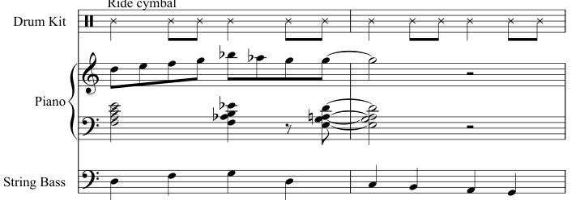
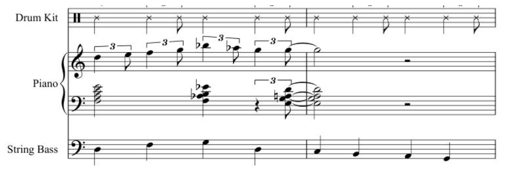
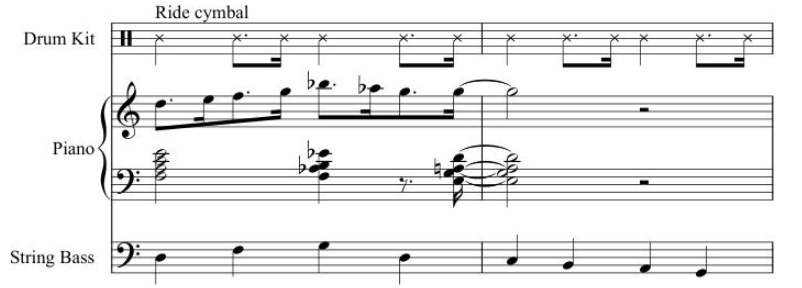

提醒：本章节是以爵士乐视角来研究各种乐理知识，一方面，尽量不要与“基础乐理”章节的内容耦合过多，也不要和古典乐的乐理弄混（侧重点非常不一样）。

## 推荐书籍

* Bert Ligon - Jazz Theory Resources - I & II
* Stuart Smith - Jazz Theory 4th Revised edition：一本书才89页，内容精简，通俗易懂，值得用于快速阅读学习。

基础音符时值通常是八分音符。
节奏：Swing
重音（Accent）：受非洲音乐节奏传统影响，传统爵士乐队会在44拍中的2、4拍上打稍微大点的重音。

* 旋律
* 风格：和弦+节奏+旋律要搭配，不要混搭；左右手也要搭配和谐；现代Jazz通常使用Mixolydian调式（属七和弦的音阶来源）
* **和声**（音阶+和弦+功能）：和声成分由相对较少的和弦进行类型所支配；然而，这些和弦进行——以及单个和弦本身——受到许多变化和修饰，这解释了爵士乐中遇到的真正复杂性的很大一部分
* 速度+力度

## 元素（爵士乐结构）

爵士乐中的很多内容都受到了爵士乐相当固化的结构的强烈影响。它带来优缺点：
* 优点：它提供了一组约定俗成的“游戏规则”，让音乐家们走到一起，演奏爵士乐，而无需进行更多的提前沟通，只需选择一段tune和它的调即可。
* 缺点：节奏、和声和曲式共同将爵士乐限制在相当狭窄的音乐可能性范围内。爵士乐一直因这些限制而受到批评。

爵士乐的结构有三个主要组成部分：节奏、曲式和和声。

* 音符+和弦：
	* 左手通常以伴奏形式配和弦，右手更为即兴演奏，反复创造张力，并解决；
	* 右手可以偏向freestyle左手和弦上的音避免出现突兀；
	* 左手如果不上黑键，右手就也不上，否则听起来很不和谐；
	* 注意左手手音的音程关系；最常用的是七和弦；

### 节奏（Rhythm）

节奏部分规定了参与的乐器之间固定的节奏关系。

#### 节奏结构

从节奏上讲，爵士乐有三个层次：旋律（melody）、和弦（chords）和低音（bass）。这些层次具有或多或少的固定节奏关系。

* 在典型的情况下，低音部分与节拍一致，通常是四分音符。
* 旋律通常以两倍的速度移动（即八分音符）。
* 和弦通常以低音的一半速度变化（即二分音符）。和弦变化的速率，即所谓的**“和声节奏”（harmonic rhythm）**：在一首曲子（piece）中，有时会减半为全音符，或翻倍成四分音符。

| 层                   | 典型音符时值  |
| ------------------- | ------- |
| 旋律（Melody）          | 𝅘𝅥𝅮 或 𝅘𝅥𝅯 |
| 低音线（Bass Line）      | 𝅘𝅥      |
| 和弦变化（Chord Changes） | 𝅗𝅥 或 𝅝 |

三层结构的实现取决于可用的乐器资源——独奏钢琴、二重奏、三重奏、合奏、大乐队等。例如，独奏钢琴家必须用两只手提供三层或两层。相比之下，大乐队有许多来实现三层结构。例如，和弦可以由钢琴家或吉他手演奏，也可以由可用的铜管乐器（brass instruments）和/或簧管乐器（reed instruments）的任何组合演奏。

##### 打击乐在节奏中的角色

在三重奏结构中，打击乐的作用是什么？要回答这个问题，有必要研究每一种风格，甚至是单独的团体或艺术家，看看打击乐实际上是如何运用的。

* 在传统的钢琴三重奏（piano trio：钢琴、套鼓、贝斯提琴）中，节奏镲（Ride Cymbal）或鼓刷（brushes）主要用于融合和统一钢琴和bass的声音（sound），并保持声音的连续性。
* 在以拉丁音乐为主的团体中，打击乐作为前景角色（foreground role）而起作用，这是音乐特点所必需的。通常需要多名打击乐手来实现这种音乐完整的节奏复杂性。
* 在大乐队中，鼓手作为基本的计时员（timekeeper），并通过击打（hits）、填补（fills）和独奏段落（solo passages）提供许多节奏的“重击”（punch），是必不可少的。

#### 爵士乐节奏的演绎（Interpretation）——Swing

爵士乐独特的节奏特点主要产生于**旋律层（八分音符层）**。这种节奏并没有被记录在爵士乐乐谱（lead sheets）、总谱（scores）和分谱（parts）中，而是必须由演奏者通过节奏演绎来提供。**这种演绎的重点在于八分音符的处理（即让节奏Swing起来）**。

Swing的复杂性与动态性：Swing节奏是一个活生生的概念，根据乐曲不同的速度、地区、子类型和个体音乐家而变化。

以下例子如果按照乐谱的节奏如实演奏，听起来将不会像爵士乐：从大约 ♩ = 60 的速度到中等快的爵士乐速度。

取而代之的是，这段乐段可能会像下面这样演奏（注意钢琴旋律部分）：根据演奏者，八分音符的三连音可能会略有重音：

**对八分音符的处理是赋予爵士乐特征“摇摆”的关键要素之一**。“摇摆”无法被精确地记谱，而是通过聆听更有经验的音乐家，然后尝试在自己的演奏中捕捉同样的感觉来学习的。

**当在低音层或和弦层出现的八分音符时，同样可以使用在旋律层的节奏演绎方式**。

随着节奏加快到快速的比博普范围，对八分音符的通常演绎越来越接近上述第一个示例中的直八分音符（straight eighth notes）。

##### 反例

爵士乐曲的记谱有时如下：

如果按照原谱演奏，几乎永远都是错误的。爵士音乐家认为附点八分音符/十六分音符节奏是“方”（square）的。这个例子应该用前一个例子的八分音符三连音的感觉来演奏。**但要注意，Ragtime的记谱方式就是这样的，演奏Ragtime乐曲时，应该严格按照谱子演奏。**

对于较慢的曲子，爵士音乐家通常称之为ballads（民谣、抒情歌），对乐谱上记录的节奏进行相当自由的演绎。使用的技巧包括弹性速度（rubato）和其他对给定音符时值的更改、在beat之后演奏、不按时演奏（即没有明显的节拍或pulse）。

### 曲式（Form）

主要基于流行歌曲的形式，它遵循一些小的、高度可预测的模式。

爵士乐从早期音乐中继承了许多曲式结构。典型的爵士乐表演是一种主题与变奏，这种形式可以追溯到几个世纪前的欧洲音乐。

在爵士乐**主题（theme）与变奏（variations）**中，

* 主题：表演以预先编好的旋律的陈述开始，通常是流行标准曲目（pop standard）或熟悉的爵士曲调（tune），爵士音乐家称之为**“头部”（head）**。这构成了“主题”部分。主题本身的曲式通常是在所有类型的流行音乐中都能找到的少数几个固定模式之一。
* 变奏：在主题/头部之后，是对主题的不确定次数的即兴变奏。这些即兴choruses（注意：这个词没有准确的中文翻译。勉强可以被称作“副歌、合唱”）通常非常紧密地遵循原始主题的结构和和声。通常，每个独奏者将轮流演奏一个或多个choruses；但是，几个独奏者可以通过“trading fours”或“trading eights”来共享一个或多个即兴choruses。在这种情况下，独奏者以轮换的方式即兴演奏4个或8个小节（bars）。
* 通常在表演结束时，演奏者会重新演奏原始head曲调（head tune）的部分或全部，以此作为结束。

更为复杂的爵士版的主题与变奏中，可能包括序曲（introduction）、一个或多个间奏（interludes），以及一个简短的“尾声”（tag）或一个扩展的尾声部分（extended coda section）。

补充：
* 关于“为什么是trading 4/8，而不是16/32”：
	* 节奏感：4小节和8小节的单位在爵士乐中非常自然，符合大多数乐曲的结构。它们能够保持流畅的节奏感，使得乐手之间的互动更加紧密。
	* 即兴演奏的灵活性：4小节或8小节的长度允许乐手在短时间内表达自己的想法，同时又给其他乐手留出足够的空间进行回应。这种短暂的时间框架使得即兴演奏更具活力和动态。
	* 传统和习惯：爵士乐的历史和传统中，乐手们习惯于以这种方式进行交流和演奏。它成为了一种约定俗成的演奏方式，便于乐手之间的默契配合。
	* 避免复杂性：使用16小节或32小节的单位可能会导致演奏变得过于复杂，难以保持乐手之间的互动和交流。较短的单位使得即兴演奏更为直接和有效。
* Tag：指的是在乐曲的末尾添加的一小段音乐。这个小段通常是对主题的简短回顾或是一个简单的结束句，用来给乐曲一个清晰的结束。在爵士乐中，tag可以是一个即兴的乐句，也可以是预先设计好的，它的作用是为乐曲提供一个自然的结束，让听众感到乐曲已经完整。
* Extended Coda Section：Coda是一个意大利语词汇，意为“尾巴”，在音乐中指的是乐曲的结尾部分。Extended coda section指的是一个扩展的、较长的结尾部分，它不仅仅是一个简单的结束，而是包含了更多的音乐内容和结构。在爵士乐中，extended coda section可能会包含更多的即兴演奏，或者是对主题的进一步发展和探索。这个部分可以是预先设计的，也可以是即兴创作的，它为音乐家提供了一个展示技巧和创造力的空间。

#### 曲式的重要性

所有的标准歌曲形式都包含在少数小节中，通常是32小节。

* 优点：只有少量这样的形式需要记住，而且每个形式都足够简单，演奏者可以在即兴创作时很容易地记住整个结构。这就是为什么这些曲式对爵士乐如此有用。相比之下，更长、更复杂的曲式需要特殊的技能来驾驭，使集体即兴创作更加困难。

* 缺点：由于标准曲式太短了，无法允许在几个不同的调中构建乐段，这严重限制了可以在这些曲式范围内完成的和声探索的数量。

  因此，传统爵士乐的和声创新者——Art Tatum、Duke Ellington、Thelonious Monk、Bill Evans、John Coltrane等——将他们的和声想象力集中在发展可以在相对较短的时间内实现的、新的和弦进行和独特的和弦音色和音响上。

#### AABA

迄今为止，最常见的歌曲形式是 32 节拍（32-bar）的“AABA”形式。在这种形式中，有两个不同的八节拍部分（eight-bar sections），称为“A”和“B”。

A 部分演奏两次，通常具有第一和第二结尾（second endings）。

* 第一结尾通常包含一个**turnaround（回转）**，即一段引导回到曲子开头的乐段（passage）。
* 第二结尾通常转调到 B 部分，即“桥接”（bridge）部分。
* 在桥接部分结束时，通常会转调回 A 部分。

##### 流行标准曲目

Ain’t She Sweet

The Man I Love 

Am I Blue Misty 

Anything Goes

Oh, Lady Be Good 

As Time Goes By

Round Midnight

The Birth of the Blues

Satin Doll 

Body and Soul

September in the Rain 

I Cover the Waterfront

Skylark 

I Got Rhythm

Softly, As In a Morning Sunrise 

I May Be Wrong

Someone to Watch Over Me 

It’s Only a Paper Moon

What’s New? 

Jeepers Creepers

You Are Too Beautiful 

Lullaby of Birdland

You Took Advantage of Me 

#### ABAC

另一种常见的歌曲形式被称为“ABAC”。这种形式有四个 8 小节部分，分为两个 16 小节单元（units）。两个单元除了各自的结尾不同外，这些单元的其他部分通常是相同的。

##### 流行标准曲目

But Not for Me

I Can’t Give You Anything But Love 

Dancing in the Dark

I Know that You Know 

Days of Wine and Roses

I Thought About You 

Do It Again

I’ve Got a Crush on You 

Dream

Sometimes I’m Happy 

Embraceable You

Time After Time 

Fine and Dandy

When Your Lover Has Gone 

Fools Rush In 

#### Through-Composed（通作曲、通谱歌）

少数歌曲是through-composed。它指的是整首曲子几乎没有重复的段落或固定的结构。与传统的曲式（如AABA或ABAB）不同，通作曲的音乐在每个部分都不断发展，通常会引入新的旋律、和声和节奏。

它们由一个从头到尾的大段落组成，尽管旋律可能仍由四个8小节的单元组成（产生“ABCD”曲式）。这种形式并不排除一定数量的主题重复。

##### 著名曲目

Avalon, Stella by Starlight

You Do Something to Me

#### Ternary（三部曲）

使用 ABA 或“三部曲”形式的乐曲数量要少得多，这种形式在欧洲艺术歌曲（European art songs）中很常见。与 AABA 曲调一样，这种形式有两个不同的部分，但 A 部分不会在 B 部分之前重复。

##### 著名曲目

I’ll Remember April

### 和声（Harmony）

爵士乐的和声部分由相对较少的和弦进行类型所支配；然而，这些和弦进行，以及单个和弦本身都有许多变化和修饰，这解释了爵士乐中遇到的真正复杂性的很大一部分。

#### 和弦

##### 基本概念

* 六和弦与七和弦：爵士和弦几乎总是在根音上方有一个六音或七音（即，基本的爵士和弦由四个不同的音符组成：根音、三音、五音、六音或七音）​。六音是大六度。七音是小七度，除非和弦符号明确指定是大七度或减七度。
* 延申音（Tensions）：基本的四个音符和弦可以向上延伸，包括九音、十一音和十三音。除另有说明外，九音和十三音默认为majo、十一音默认为perfect。
  在爵士乐和声中，六音或七音以上的和弦音被称为“tensions”​（注意：这里的“tensions”指代的是延申音，而不是功能和声中“张力”的概念）​。在当前的爵士乐实践中，几乎每个和弦都包含一个或多个tensions和/或以下描述的变音之一：。
  在乐谱中，tensions符号通常会跟在六音或七音符号之后，如下图所示：
  ![[Pasted image 20240919224646.png]]

##### 基础和弦类型

爵士乐的和声语汇由七种基本类型的和弦以及一些延申音和变化音构成。在爵士乐中，每个基本和弦都由四个不同的音构成（在爵士乐中，只会少量地使用不加修饰的原位和弦，但它们在当今的流行音乐中很常见）​。

* 大七和弦
  ![[Pasted image 20240920071912.png]]
* 六和弦
  ![[Pasted image 20240920071920.png]]
* 小六和弦
  ![[Pasted image 20240920071931.png]]
* 小七和弦
  ![[Pasted image 20240920072004.png]]
* 属七和弦
  ![[Pasted image 20240920072018.png]]
* 减七和弦
  ![[Pasted image 20240920072030.png]]
  在爵士乐中，变音记号的使用经常是随意的，而等音异名（enharmonic spellings）非常常见。乐谱中很少会看到双重升号或双重降号，然而它们才是使用正确的变音记号，例如，在上面右边的和弦中，A替换了B♭♭，但B♭♭才是正确的音符拼写。
* 半减七和弦
  ![[Pasted image 20240920073058.png]]
### 旋律

与和声和复调（counterpoint）能被教会不同，旋律在很大程度上仍是一种个人艺术。一些人对旋律有天赋，另一些人则没有。幸运的是，爵士乐有一种创作旋律的简单技巧，通常很成功：**riffing（即兴重复段）**。

一个Riff是一段简短的旋律片段，通常是两个小节的长度，需要重复多少次就重复多少次，以填充一段 8 小节、12 小节或 16 小节的曲子。
Riffing既可用于独奏者在即兴创作时，也可用于作曲家在创作新作品时。在爵士乐的大部分历史中，Riffing一直是一种基本技巧，但在 20 世纪 30 年代和 40 年代的大型乐队音乐中，它发挥了尤为突出的作用。这一时期的许多热门歌曲都是基于一个或多个riffs的简单曲调。今天，高中、大学和业余大型乐队仍在演奏这些曲子，这证明了riffing技术经久不衰的魅力和实用性。

在最简单的riffing中，riff是逐音重复的（repeated note-for-note）。贝西伯爵（Count Basie） 1938 年的一首热门歌曲《伍德赛德的跳跃》（Jumpin’ at the Woodside）采用了两小节的riff，在曲子的 A 段中重复了四次。这个例子显示了前两次重复的即兴重复段，以及与其伴奏的铜管乐器低音部分：

![[Pasted image 20240807064837.png]]

一种稍微复杂一些的riffing技巧会逐音重复即兴重复段，除了riff的最后一个乐句（the last statement），它通常是riff的修改版本。奥利弗（Oliver）的《一号作品》​（Opus One。1943年）是为汤米·多尔西（Tommy Dorsey）管弦乐团创作的，米尔斯兄弟（Mills Brothers）也录制了这首曲子。这首曲子重复了一个两小节的riff三次，之后是一个基于riff裁剪版的两个小节的单元。这个例子只显示了riff的前两次重复，而这个riff本身又包含了两个略有不同的简单乐句：

![[Pasted image 20240807065512.png]]

本尼·古德曼（Benny Goodman）和莱昂内尔·汉普顿（Lionel Hampton）的《飞回家》​（Flying Home。1940年）重复了以下riff三次，然后以一个不同的旋律想法结束。注意，乐谱中的和弦符号暗示了一个按比例（scalewise）递减的低音线:

![[Pasted image 20240807070629.png]]

格伦·米勒（Glenn Miller）的许多热门歌曲都是简单的、基于riff的曲调，在每次重复时，riff都会稍作修改，以适应流行的和声。例如，米勒的《在情绪中》​（In the Mood，1939）就使用了这种琶音式的riff，在一个非常简单的G布鲁斯和弦进行上：

![[Pasted image 20240807071237.png]]

埃林顿公爵（Duke Ellington）在他的作品中经常使用类似riff的旋律。在《醇美的音调》​（In A Mellow tone，1940）、《别再四处徘徊》​（Don’t Get Around Much Anymore，1942）和《什么都不要做直到你收到我的来信》​（Do Nothing ‘Til You Hear From Me，1943）——这三首是埃林顿经久不衰的最受欢迎的曲目——中，结合了riff的逐音重复（literal repetitions）、riff的修改版本和不基于riff的其他旋律。

riff可以作为乐曲的前景旋律（foreground melody），也可以作为乐曲或即兴旋律的背景。这两种用法通常在同一首乐曲中出现。无论如何，riffs不会凭空出现。至少，它们是在节奏乐器组（rhythm section）提供的背景中演奏的。像贝西伯爵（Count Basie）演奏的节奏乐段可以把像《伍德赛德跳跃》（Jumpin’ at the Woodside）中使用的简单的riff变成有力的音乐陈述。

### 发展低音线

除了独奏爵士钢琴家和偶尔的爵士二重奏（例如，两位吉他手，一位吉他手和一位管乐手（horn）等）​，大多数爵士乐队都有贝斯手。爵士贝斯手通常根据和弦符号提供的信息创造自己的低音线；然而，对于任何想要完全理解爵士和声的爵士音乐家来说，能够写出适当的低音线是很重要的。

理想情况下，爵士低音线将是一个真正的旋律，也许比主旋律简单，但仍然是一个旋律。与一般的旋律一样，写一个好的低音线是一门艺术；然而，可以通过遵循一些简单的指导方针来开始发展一个成功的低音线。假设一个半音和声节奏（half-note harmonic rhythm），使用以下步骤：

1. 将指示和弦的根音放在拍子1和3上，以创建低音线的骨架。尽可能选择根音，使它们之间的音程最小化（例如，选择上行四度而不是下行五度，下行三度而不是上行六度等）​。

## 配器

每个乐器的责任

* 号（Horn）：萨克斯管（saxophone）、小号（trumpet）和长号（trombone）（以及任何其他单音符乐器，包括人声）负责演奏旋律，既有谱面的（如head），也有即兴的（他们的个人独奏）。
* 节奏部分：由钢琴、贝斯和鼓 组成。它们的主要作用是为号手伴奏和提供支持；他们也可能即兴独奏。
   * 钢琴家的主要工作是以有活力的、有节奏的方式演奏和弦（即伴随旋律的音乐）。钢琴家还可以即兴演奏旋律。当他/她这样做的时候，他/她通过右手演奏单个音符，而左手伴奏演奏和弦来即兴创作旋律。
   * 贝斯手的主要工作是演奏和弦的根音，并“奠定一个优秀的groove”。低音（bass）是基础，是底部，是脉搏，是把大家凝聚在一起的“胶水”。
   * 鼓手的主要工作是保持节奏稳定，并补充独奏者(即兴演奏者)的演奏。鼓手通过引入有节奏的重音，并与贝斯手一起建立优秀的groove，为演出增添了兴奋感。
* 吉他：吉他手多才多艺。他/她可以像一个号演奏者(即演奏单音符旋律)，也可以像一个钢琴家(即演奏和弦)。