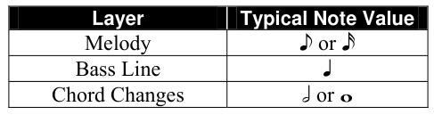

提醒：本章节是以爵士乐视角来研究各种乐理知识，一方面，尽量不要与“基础乐理”章节的内容耦合过多，也不要和古典乐的乐理弄混（侧重点非常不一样）。

## 推荐书籍

* Bert Ligon - Jazz Theory Resources - I & II
* Stuart Smith - Jazz Theory 4th Revised edition：内容精简，通俗易懂

基础音符时值通常是八分音符。
节奏：Swing
重音（Accent）：受非洲音乐节奏传统影响，传统爵士乐队会在44拍中的2、4拍上打稍微大点的重音。

## 元素（爵士乐结构）

爵士乐中的很多内容都受到了爵士乐相当僵化的结构的强烈影响。但是，这种结构远不是一种障碍，它提供了一组约定俗成的“游戏规则”，让音乐家们走到一起，演奏爵士乐，而无需进行更多的提前沟通，只需选择一段旋律和它的调子即可。

* 音符+和弦：左手通常以伴奏形式配和弦，右手更为即兴演奏，反复创造张力，并解决；右手可以偏向freestyle左手和弦上的音避免出现突兀；左手如果不上黑键，右手就也不上，否则听起来很不和谐；注意左手手音的音程关系；最常用的是七和弦；

### 节奏

节奏部分规定了参与的乐器之间固定的节奏关系。形式部分主要基于流行歌曲的形式，它遵循一些小的、高度可预测的模式。 

#### 节奏结构

从节奏上讲，爵士乐有三个层次：旋律（melody）、和弦（chords）和低音（bass）。这些层次具有或多或少的固定节奏关系。

* 在典型的情况下，低音部分与节拍一致，通常是四分音符。
* 旋律通常以两倍的速度移动（即八分音符）。
* 和弦通常以低音的一半速度变化（即二分音符）。和弦变化的速率，即所谓的**“和声节奏”（harmonic rhythm）**，有时会减半或翻倍——变成全音符或四分音符——在一首曲子中。

三层结构的实现取决于可用的乐器资源——独奏钢琴、二重奏、三重奏、合奏、大乐队等。例如，独奏钢琴家必须用两只手提供三层中的两层，或者省略一层。相比之下，大乐队提供了许多提供三层的方法。例如，和弦可以由钢琴家或吉他手演奏，也可以由可用的铜管乐器和/或簧管乐器的任何组合演奏。

##### 打击乐在节奏中的角色

在三重奏结构中，打击乐的作用是什么？要回答这个问题，有必要研究每一种风格，甚至是单独的团体或艺术家，看看打击乐实际上是如何运用的。

* 在传统的钢琴三重奏中，节奏镲（Ride Cymbal）或brushes主要用于融合和统一钢琴和低音的音色，并保持声音的连续性。
* 在以拉丁音乐为主的团体中，打击乐作为突出角色（foreground role）而起作用，这是音乐特点所必需的；

通常需要多名打击乐手来实现这种音乐完整的节奏复杂性。在大乐队中，鼓手作为基本的计时员，并通过击打、填补和独奏段落提供许多节奏“重击”，是必不可少的。

#### 爵士乐节奏的演绎（Interpretation）——Swing

爵士乐独特的节奏特点主要产生于旋律层或八分音符层。这种节奏并没有被记录在爵士乐乐谱、总谱和分谱中，而是必须由演奏者通过即兴演奏来提供。**这种即兴演奏的重点在于八分音符的处理（即让节奏Swing起来）**。

以下例子如果按照乐谱的节奏如实演奏，听起来将不会像爵士乐：从大约 ♩ = 60 的速度到中等快的爵士乐速度。

取而代之的是，这段乐段可能会像下面这样演奏（注意钢琴旋律部分）：根据演奏者，八分音符三连音可能会略有重音：

**对八分音符的处理是赋予爵士乐特征“摇摆”的关键要素之一**。“摇摆”无法被精确地记谱，而是通过聆听更有经验的音乐家，然后尝试在自己的演奏中捕捉同样的感觉来学习的。

**在旋律层使用的节奏演绎，同样也适用于低音或和弦层出现的八分音符**。随着节奏加快到快速的比博普范围，对八分音符的通常演绎越来越接近上述第一个示例中的直八分音符（straight eighth notes）。

##### 反例

爵士乐曲的记谱有时如下：

如果按照原谱演奏，几乎永远都是错误的。爵士音乐家认为附点八分音符/十六分音符节奏是“方”（square）的。这个例子应该用前一个例子的八分音符三连音的感觉来演奏。**但要注意，Ragtime的记谱方式就是这样的，演奏者应该严格按照谱子演奏。**

对于较慢的曲子，爵士音乐家通常称之为ballads（民谣、抒情歌），对乐谱的节奏进行相当自由的演绎。使用的技巧包括弹性速度（rubato）和其他对给定音符时值的更改，在beat之后演奏，以及不按时演奏（即没有明显的节拍或pulse）。

* 旋律
* 风格：和弦+节奏+旋律要搭配，不要混搭；左右手也要搭配和谐；现代Jazz通常使用Mixolydian调式（属七和弦的音阶来源）
* **和声**（音阶+和弦+功能）：和声成分由相对较少的和弦进行类型所支配；然而，这些和弦进行——以及单个和弦本身——受到许多变化和修饰，这解释了爵士乐中遇到的真正复杂性的很大一部分
* 速度+力度

### 曲式（Form）

主要基于流行歌曲的形式，它遵循一些小的、高度可预测的模式。

在爵士乐**主题（theme）与变奏（variations）**中，

* 主题：表演以预先编好的旋律的陈述开始，通常是流行标准曲目（pop standard）或熟悉的爵士曲调，爵士音乐家称之为**“头部”（head）**。这构成了主题与变奏的“主题”部分。主题本身的形式通常是在所有类型的流行音乐中都能找到的少数几个固定模式之一。
* 变奏：在主题/头部之后，是对主题的不确定次数的即兴变奏。这些即兴choruses（注意：这个词没有准确的中文翻译。勉强可以被称作“副歌、合唱”）通常非常紧密地遵循原始主题的结构和和声。通常，每个独奏者将轮流演奏一个或多个choruses；但是，几个独奏者可以通过“trading fours”或“trading eights”来共享一个或多个即兴choruses。在这种情况下，独奏者以轮换的方式即兴演奏4个或8个小节（bars）的形式。
* 通常在表演结束时，演奏者会重新演奏乐曲的head部分或全部，以此作为结束。

爵士版主题变奏曲的版本更为复杂，可能包括序曲（introduction）、一个或多个间奏（interludes），以及一个简短的“尾声”（tag）或一个扩展的尾声部分（extended coda section）。

#### 重要性

所有的标准歌曲形式都包含在少数小节中，通常是32小节。

* 优点：只有少量这样的形式需要记住，而且每个形式都足够简单，演奏者可以在即兴创作时很容易地记住整个结构。这就是为什么这些曲式对爵士乐如此有用。相比之下，更长、更复杂的曲式需要特殊的技能来驾驭，使集体即兴创作更加困难。

* 缺点：标准曲式带来的限制严重限制了可以在这些形式范围内完成的和声探索的数量。它们太短了，无法允许在几个不同的调中构建乐段。

  因此，传统爵士乐的和声创新者——Art Tatum、Duke Ellington、Thelonious Monk、Bill Evans、John Coltrane等——将他们的和声想象力集中在发展可以在相对较短的时间内实现的、新的和弦进行和独特的和弦音色和音响上。

#### AABA

迄今为止，最常见的歌曲形式是 32 节拍的“AABA”形式。在这种形式中，有两个不同的八节拍部分，称为“A”和“B”。

A 部分演奏两次，通常具有第一和第二结尾（second endings）。

* 第一结尾通常包含一个**turnaround（回转）**，即一段引导回到曲子开头的乐段。
* 第二结尾通常转调到 B 部分，即“桥接”（bridge）部分。

在桥接部分结束时，通常会转调回 A 部分。

##### 流行标准曲目

Ain’t She Sweet

The Man I Love 

Am I Blue Misty 

Anything Goes

Oh, Lady Be Good 

As Time Goes By

Round Midnight

The Birth of the Blues

Satin Doll 

Body and Soul

September in the Rain 

I Cover the Waterfront

Skylark 

I Got Rhythm

Softly, As In a Morning Sunrise 

I May Be Wrong

Someone to Watch Over Me 

It’s Only a Paper Moon

What’s New? 

Jeepers Creepers

You Are Too Beautiful 

Lullaby of Birdland

You Took Advantage of Me 

#### ABAC

另一种常见的歌曲形式被称为“ABAC”。这种形式有四个 8 小节部分，分为两个 16 小节单元，除了各自的结尾不同外，这些单元的其他部分通常是相同的。

##### 流行标准曲目

But Not for Me

I Can’t Give You Anything But Love 

Dancing in the Dark

I Know that You Know 

Days of Wine and Roses

I Thought About You 

Do It Again

I’ve Got a Crush on You 

Dream

Sometimes I’m Happy 

Embraceable You

Time After Time 

Fine and Dandy

When Your Lover Has Gone 

Fools Rush In 

#### Through-Composed（通作曲、通谱歌）

少数歌曲是through-composed。它指的是整首曲子几乎没有重复的段落或固定的结构。与传统的形式（如AABA或ABAB）不同，通作曲的音乐在每个部分都不断发展，通常会引入新的旋律、和声和节奏。

它们由一个从头到尾的大段落组成，尽管旋律可能仍由四个8小节的单元组成（产生“ABCD”形式）。这种形式并不排除一定数量的主题重复。

##### 流行曲目

Avalon, Stella by Starlight

You Do Something to Me

#### Ternary（三部曲）

使用 ABA 或“三部曲”形式的乐曲数量要少得多，这种形式在欧洲艺术歌曲中很常见。与 AABA 曲调一样，这种形式有两个不同的部分，但 A 部分不会在 B 部分之前重复。

##### 流行曲目

I’ll Remember April