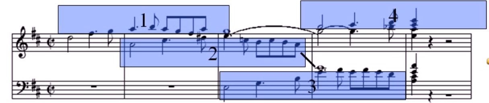
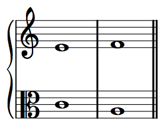
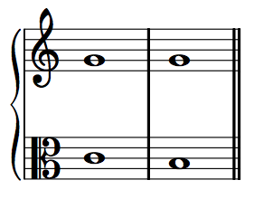
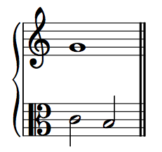
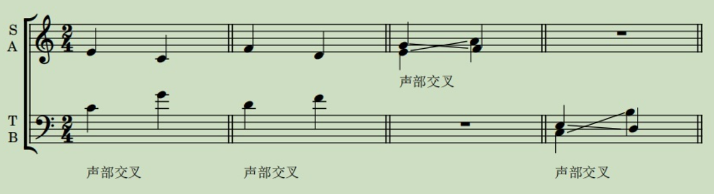
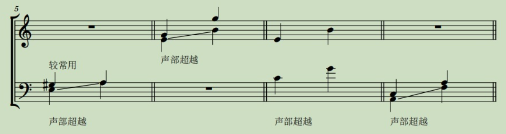
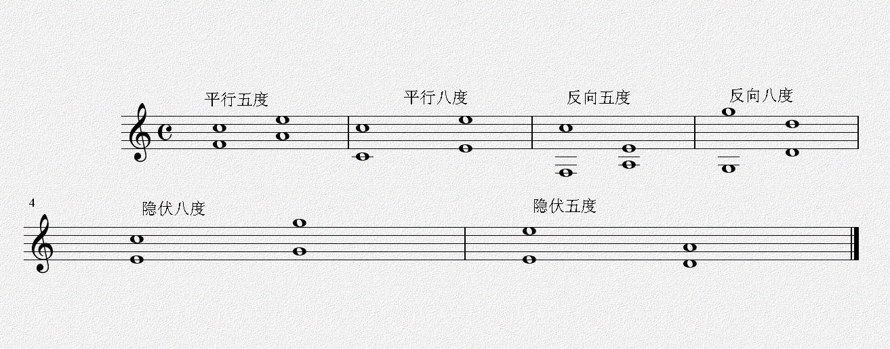

# 复调与对位（Polyphony and Counterpoint）

音乐如果按照织体来分类的话，大致可以分为三种：单声部音乐、复调音乐和主调音乐，平时大家常见的是单声部音乐和主调音乐。

**单声部音乐**可以理解为一个人独唱、清唱，因为音乐中只有一个主旋律，并没有其他任何装饰

## **主调音乐**（homophony、流行乐主流）

指有一个主旋律，再加上伴奏（陪衬）的形式，例如平时大家听的流行歌曲，基本上都是主调音乐，其中有一个歌手在唱主旋律，其他的乐器则作为伴奏。

伴奏特点

* 伴奏通常只是无明显旋律的和弦
* 低音构成隐伏级进旋律
* 和弦最高音也构成隐伏旋律
* 隐伏旋律不足以与主旋律抗衡

主调音乐并非与复调音乐完全对立，主调音乐中可以加入复调元素

陪衬部分也可以具备复调因素，旋律化

伴奏部分可以分为多个隐式的旋律

关键是音区的分块化

### 等节奏（Homorhythm）

在音乐中，等节奏是一种织体，指“所有声部都有相同的节奏”或“非常相似的节奏”。同音是主调音乐的条件。

### 主调音乐的和弦形式

特点

* 没有主旋律，只有和声
* 和声由很多线条同时复合而成
* 旋律片段服从于整体和声，旋律不能视为独立的
* 和声整体化是主调音乐一大特色，但仍旧存在着小的旋律进行，时而凸显

## **复调音乐**

指两个或两个以上的声部（旋律）在同时进行、互相形成和声关系、以对位法为主要创作技巧的音乐。若干个声部大致处于一个平等或平衡的地位。没有某一个声部的旋律是占据绝对主导地位的。似乎这个概念很难理解，看了下面的例子，相信大家就能明白了。

如果两条旋律，但如果旋律是同步重合或者八度重合，这种情况也不能算作两条旋律，而是一条

指的是将几条旋律线，按照一定的规则加以结合的一种"多声部音乐"，这几条旋律线都具有独立意义，注重各自的横向发展，这种各自具有独立旋律意义的多声部音乐，就称为“复调音乐”。

### 复节奏（polyrhythm）

### 重要性

* 杰出的作品都蕴含复调精神
* 复调与主调是不可分割的
* 主调下的复调因素
* 复调下的主调因素
* 无论交响乐，还是流行编曲，只要涉及到多乐器，离不开复调思维
* 和声中蕴含复调进行。和弦中有高音声部进行、内声部进行、低音声部进行，这些短旋律

### 表现体裁

* 交响乐、歌剧、室内乐
* 独奏曲、器乐曲
* 歌曲、合唱
* 流行音乐的编曲

### 分类

* 非模仿式复调音乐
  * 衬腔式（多条旋律轻微不一样）
  * 对比式（多条旋律完全不一样）
* 模仿式复调音乐（多条旋律前后模仿）：通常旋律之间时间上错开，后面的旋律模仿前面的旋律

#### 衬腔式复调音乐

技术条件

* 主旋律只能是单一的
* 衬腔的旋律时而重合（平行同度或平行八度），时而分开
* 衬腔重合时，音量需要加倍，不能保持跟前面旋律一样的音量？

对旋律的要求

* 性格鲜明，调性明确（没有转调）
* 节奏规整，句读分明（很少有切分、Shuffle、Swing、连音、附点）
* 低音旋律和高音旋律要融合

所有声部表达同一旋律的各种变体，听觉效果是听起来像只有一个旋律

例子：

2是从1中分支出来的，就叫做衬腔复调。1,2与3的音调和节奏几乎完全一样。1与2在某些地方略微不同（↓）。1,2与3在某些地方也略微不同（↑）

对比：对比可以有节奏对比，可以有音高对比。衬腔式复调中的旋律间的对比可以比较大，但仍不改变性质。衬腔的对比部分通常格外引人注目

蓝色椭圆区域的对比都比较大，但总体来讲下方旋律还是从属于上方旋律

#### 对比式复调音乐

至少具有两条显著不同的旋律。但可以具有另外的相同或相近的旋律

例子：

2,3构成衬腔复调，因为节奏音高几乎类似。1,2构成对比复调，因为节奏音高相差很多
。从整体来看是对比复调，从局部来看衬腔。

对比与衬腔主要看节奏是否同步

1,2的旋律几乎完全不同。1是悠长歌唱性的，2是音阶的，旋律性不强的
篮圈部分：旋律1听，旋律2起，是典型的对比式复调

对比的强弱主要看节奏对比的强弱

#### 模仿式复调音乐

特征

* 所有声部表达同一个旋律，但不是同时进行地
* 所有声部模仿第一个声部，可以不精确

例子：

1是单簧管声部，第一个进入
2是双簧管声部，第二个进入，模仿1的节奏
3是巴松管声部，第三个进入，模仿1的节奏
4是长笛声部，第四个进入，模仿1的节奏

模仿与否主要看节奏是否相同

### 主调与复调的联系

主调音乐蕴含复调精神

* 一个陪衬部分可以衬托多条旋律

* 陪衬部分本身可以具有旋律性

复调音乐蕴含主调精神

* 几个主要旋律，有着共同的和声基础
* 旋律可以有多条，但是最突出的很有限。那些不突出的内化为类似主调音乐的伴奏部分

## 对位法（Counterpoint）

### 含义

复调音乐的作曲技巧，是在音乐创作中使两条或者更多条相互独立的旋律同时发声并且彼此融洽的技术。

意为“音符对音符”。对位法并不是指单独的音符之间的和弦，而是指旋律之间的相互作用。它既可以是用两条或两条以上的旋律交织成和弦，也可以是以多组和弦交织表现出旋律。对位与和声的特点刚好相反，和声追求的是纵向的发展，除了一条主要的声部外，其他的声部在自己的进行中以特定的和声结构辅助这条主要的声部；对位追求的则是横向的发展，各个声部各不相同，但又要互相和谐不冲突。

### 重要性

对位法的目的并不是教一种某种作曲风格，而是引导学生从各种各样的音乐基础问题入手，开始进行音乐创作。主要包括以下音乐基础问题：

- 流畅性（smoothness）
- 旋律线的独立与融合（independence and integrity or melodic lines）
- 旋律音程的协和性（tonal fusion (the preference for simultaneous notes to form a consonant unity)）
- 多样（variety）
- 运动/进行（motion (towards a goal)）

### 历史

对位法是音乐史上最古老的创作技巧之一，也是欧洲在中世纪（公元800-1430）和文艺复兴时期（1430-1600）最主要的作曲技巧。在“对位”的概念被人们提出之前，应用对位法原理的音乐作品早已存在。现存最早的相关记载，见于公元900年左右一位无名氏所做的论文，Musica enchiriadis。在这篇类似教材的论文中，作者介绍了将给出旋律以对位法编排的方法。这种被称为固定旋律（cantus firmus）的方法是，将既有旋律以五度音程加以重复，再各将两条旋律以八度音程重复而得到四条旋律。当“对位法”这个名词开始流行的十四世纪，当时应用对位原理的作品少有以“音符对音符”形式写就的。当时标准的对位法作品，是一种华丽的多重唱（organum），即将多个音符以对位手法组织成一种进行缓慢的固定旋律。

对位法在巴洛克时期的音乐中得到了广泛的应用，其中以约翰·塞巴斯蒂安·巴赫所作的《赋格的艺术》以及《音乐的奉献》最为闻名。

时至今日，对位法原理仍然是调性音乐的基础，也是作曲的必修课。

### 声部运动的关系（对位运动、Contrapuntal motion）

对位运动是两个旋律线相对于另一条旋律线的运动关系。

* 同相进行（similar motion、direct motion）：两个声部非等距离、同方向运动

  

* 平行进行（parallel motion）：两个声部等距离、同方向运动。如下图两个声部都升高了半音。

  

* 反向进行（contrary motion）：两个声部反方向运动。音响效果和谐

  

* 斜向进行（oblique motion）：一个声部保持不动 另一个声部运动

  

  

拓展关系：

* 声部交错/交叉（voice crossing）：两个声部的音调在变化的过程中相互交叉

  

* 声部超越（voice overlap）：一个相对较低的声部的音调，跳进到更高的音调，而这个跳进到的音调，高于此次跳进前的相对较高的声部。或者是一个相对较高的声部的音调，跳进到更低的音调，而这个跳进到的音调，低于此次跳进前的相对较低的声部。（跳得比之前高的还高，或跳得比之前低的还低）

  

### 声部进行、和声与曲式的关系

西方音乐理论的研究包括三个主要部分：声部进行（voice-leading）、和声（harmony）和曲式（Form）。声部进行处理的是两条或多条音乐线(或旋律)如何组合成一个音乐理念的关系。和声则是介绍将和弦进行组合与发展的规则或规范。曲式是指将乐句（phrase）和其他小的音乐单元组合成更大的单元，包括整个movements和作品。

其中声部进行就是最为基础的部分。

### 分类对位法（严格声部进行、Species Counterpoint、Strict Voice-leading）

https://musictheory.pugetsound.edu/mt21c/SpeciesCounterpoint.html

分类对位（又称福克斯五类基本对位）是一种传统的对位法教学形式，也是对位法创作的所谓“严格形式”。在传统的对位法学习中，学生需要应对几种复杂程度不同的“类型”（Species），按照严格的对位法原则，由给出的固定旋律（cantus firmus、c.f.），谱出相应的对位声部。在熟悉了对位创作的不同分类后，学生可以开始创作“自由”对位，也就是不甚严格的对位法。

#### 固定旋律（cantus firmus、fixed voice、fixed melody）

自动生成：https://speciescounterpoint.com/

http://openmusictheory.com/Graphics/counterpoint/cantusFirmi.pdf

所有的例子都必定有一条固定旋律，这个固定旋律即可以自己写，也可以由练习题给出。

##### 特点

* 长度约8-16个音符
* 无节奏（arhythmic，只有全音符)
* 以do开始和结束
* 逐级接近结尾的主音（通常是re-do，有时是si-do）
* 所有音符对音符（note-to-note）的进行在旋律音程关系上都是和谐的
* 音程（最低和最高音符之间的间隔）不超过十度，通常小于八度
* 在旋律中只出现一次高潮（最高点）
* 从头到尾逻辑衔接清晰，造型流畅
* 大多是级进（stepwise motion），但也有一些跳跃（leap，大多是小的跳跃）
* 没有重复的动机（motives）或乐句片段（licks）
* 任何大的跳跃（四度或四度以上）都是在反方向上以级进方式跟随的
* 连续不超过两次跳跃；没有在同一方向上连续的跳跃（Fux的F大调固定旋律是个例外，它通过连续（back-to-back）的下降跳跃勾勒出一个和谐三和弦）。
* 由导音向主音进行
* 在小调中，导音只出现在倒数第二小节；升下中音（raised submediant）只在过渡到导音时使用

##### 旋律倾向（Melodic tendencies）

* 音高接近（pitch proximity）：旋律的发展倾向是：级进 > 小跳跃 > 大跳跃，以表现旋律的流畅与完整。

* 级进下行（step declination）：旋律更倾向于下行级进而不是上行级进，这可能是一种面向目标（goal-oriented motion、结尾）的运动的表达，因为我们倾向于将向下的移动视为能量的减少（趋向于静止状态）。

* 级进惯性（step inertia）：旋律在进行时，倾向于保持方向不变，而不是改变方向，以表现旋律的平滑，有时也是面向目标的运动。

* 旋律回归（melodic regression）：在极限音域（extreme registers）的旋律音符倾向于向中间发展。它是一种朝向静止位置的运动表示，用非极值的音符（non-extreme notes）表示“静止”（rest）。这也是旋律中音符统计分布的简单表达：一个音符越高，其下方可供作曲家选择的音符就越多，而上方的音符就越少。

* 旋律弓（melodic arch）：在一个乐句（phrase）的前半部分旋律上升，达到高潮，然后在后半部分下降的趋势。一种目标导向和静止-运动-静止（rest-motion-rest）模式的表达。

  此外，注意在乐句的上下文中综合使用上述的规则。

##### 写作方法

先写：

* 定好长度（Length）
* 起始音高（starting pitch）
* 倒数第二个音的音高（penultimate pitch）
* 结束音高（ending pitch）
* 高潮（climax）

然后在符合上述特点与旋律倾向的条件下，写一条流畅且和谐的旋律线。

#### 写作顺序

- 既定定声部（定旋律声部）⇒一类。
- 一类⇒二类。
- 一类⇒四类。
- 二类⇒三类。
- 五类对位则是「在一类对位的基础上、由二三四类任意组合而成」。

先写声部的结尾与开头，以避免中间旋律进行到结尾时大跳。结尾与开头附近的音可以结合和弦的倾向来配。

#### 写作规则

https://zhuanlan.zhihu.com/p/20498455

- 一类：两声部都是全音符、纵向一一对应，不得出现不协和音程。
- 二类：将一个声部的全音符分成两个二分音符，弱拍上的和弦外音可以是过渡音、邻音。
- 三类：在二类的基础上，用同样的和弦外音选取思路，将二分音符化成四分音符。
- 四类：在二类的基础上，引入挂留音、构筑不协和音程。
- 五类：将前四类所述技巧自由结合使用。

#### 分类对位法总则

（注意：后世的音乐理论家基本沿用了Fux的模式，但偶尔会对规则加以变通或修改。）

分类对位法适用于除罗克里安以外的所有调式（伊奥利亚调式、多利亚调式, 弗里吉亚调式, 利底安调式, 米索利底安调式和爱奥利亚调式). 以下规则适用于所有类型的对位创作。对于创作中的每个声部而言，必须遵守如下规则：

对所有类型的对位，以下规则适用于不同声部的组织：

* 必须以完全协和音（纯一度或纯八度）开始。
* 以低音声部為判斷聲響的基準。
* 不得出现声部交叉。因为声部交叉会减低声部的独立性，让它们难以通过听觉区分。
* 不得出现声部超越，以增强声部的独立性。
* 不得出现平行五度（两个声部原音程都是五度，目标音程还是五度）。和声效果空洞、呆板。
* 不得出现平行八度
* 不得出现高音声部跳进的隐伏五度：两个声部同向进行到五度或八度称为隐伏五度或隐伏八度（不管原来两个声部是几度音程），但这里有例外的是这两个声部是指高声部和低声部两个外声部，同时在高声部有跳进时形成的隐伏五度和隐伏八度才是禁止的。因为同向进行到五度或八度突出了他们空洞的音响，而在外声部形成的又是最明显的。
* 不得出现高音声部跳进的隐伏八度
* 平行三度不得连续出现四次或四次以上
* 平行六度不得连续出现四次或四次以上

其他声部的要求：

* 横向曲调自然，易于歌唱：自己演唱一遍
* 纵向和声必须尽可能得当既符合听觉又符合规则
* 符合对位法的旋律写作要求：既符合听觉又符合规则
* 符合对位法的规则：既符合听觉又符合规则
* 符合男女演唱的常用音域

所用的和声材料

* 只用原位三和弦或第一转位六和弦(和弦可以不完全，如C和弦只有C/D，没有G)
* 不用四六和弦，不用增五度、减五度以及其他和弦(如七和弦)

#### 类别（Species）

严格的对位法有五种创作手法。其实与其叫类别（Species），更像是阶段（Stage），从一至五层层递进，引入新的作曲问题让学生进行练习。赋格曲是用模仿方法创作的最高级形式。

应用对位法的最常见的固定形式的作品类型有赋格和卡农。

##### 第一对位（first species、one-against-one counterpoint、1:1 counterpoint）

在cantus firmus的上方或下方加一条旋律线（counterpoint），并且这条旋律线与固定旋律的音符一一对应，即1个全音符对1个全音符，构成二声部。

新加的counterpoint也遵循编写固定旋律时的规则，以及一些额外的规则：

* 以cantus firmus的P1/P5/P8音程开始。

  因此如果counterpoint在cantus firmus的上方，则必须是do或sol（P1/P5/P8）；

  如果在下方，则只能是do（距离cantus firmus P1或P8）。因为如果是sol，则会构成一个不协和的四度音程。而如果是fa，则会构成一个P5，让听者难以区分开头是以fa到do还是do到sol。

* 以cantus firmus的上方或下方P1/P8音程结束。

  为了结尾旋律的流畅、多样性与目标导向，无论大调还是小调，都需要以反向级进作为counterpoint的结束。如cantus以re-do（或ti-do）结尾，那counterpoint就要以ti-do（或re-do）结尾。因此倒数第二小节的音程要么是小三度，要么是大六度。

* 独立性。

  * 同Cantus firmus一样，counterpoint也要有一个高潮。为了保持旋律线的独立性与旋律的流畅性（避免某一时刻被特别强调），两条旋律线的高潮不应该同一时刻发生。
  * counterpoint发生一个重复或tie是被运行的，但尽可能避免重复，以创造多样性。

##### 第二对位

两个音符与一个音符间的对位 （Two notes against one），以2個2分音符對1個全音符。注意强拍与弱拍，强拍上的音比弱拍上的音重要；弱拍上的音可以和固定旋律构成不协和音程（二度、增四减五度、七度等），但注意要解决。

##### 第三对位

一组音符（泛称，包含三个、四个或六个等音符构成的一组）与一个音符间的对位 （Four notes against one）。以3~6個分音符對1個全音符，其中比较常见的是以4个四分音符对1个全音符。

##### 第四对位

延留音对位（Notes offset against each other），以2分音符的切分節奏對1個全音符

##### 第五对位（华彩对位、Florid counterpoint）

将以上四种综合运用的对位手法，採取混合節奏與 1個全音符相對

##### 派生对位 Contrapuntal derivations

##### 非协和对位

https://www.zhihu.com/question/321751246

## 作曲前要回答的问题

1. 叙述者是谁
2. 对谁叙述
3. 为什么要叙述

如果这三个问题没有弄清楚，乐曲就无法很好地表达情绪

根据干声作曲

1. 先测速