## 学习方向

* 音乐制作（Music Production）：因为包括但不限于录音（Recording）、编曲（arrangement）、混音（mixing）、制作母带（master）等。
* 

## 目前学这玩意的意义

* 玩/练爵士乐的时候，学习/使用宿主（包括学VST），可以更好地理解爵士乐的构成。这里指的构成有多个维度，比如最明显的，乐器的构成。还有爵士乐层次的构成。
* 可以增加玩/练爵士乐的乐趣：比如自己原本只是弹琴的，而现在可以自己编鼓组、bass给自己做伴奏。
* 可以增加即兴能力。
* 有机会综合地实践所学知识（如配器、和声、曲式等等）

* 最系统的 Urban 音乐风格编曲思维
* 各种流行乐器的和声与律动编写
* 百套编曲键盘的和声与律动实战谱例
* 编曲音色调制
* Sample 的制作使用手法
* 制作人听力训练(频段分层和编曲分层)
* Rough Mix 手法

### 课程前置知识

* 基础乐理

### 课程推荐

宿主类教程和音乐制作（Music Production）教程通常是一体的。而这类教程大体可以分为三大类：

| 类型    | 介绍                                                       | 子类                                           | 等级          |
| ----- | -------------------------------------------------------- | -------------------------------------------- | ----------- |
| 宿主操作类 | 以宿主的各种操作为基准，侧重于讲解宿主的各种操作本身，顺带提及或者就不提及相关音乐制作概念。大多教程是这类    | 1. 综合地、粗浅地讲解宿主的基操<br>2. 精细化地讲解宿主的某块功能        | 一般属于入门/初级教程 |
| 音乐制作类 | 以音乐制作本身为基准，默认用户已经懂得宿主各种操作了，侧重于讲解音乐制作本身，比如讲解如何做摇滚乐、EDM的编曲 | 1. 综合地、粗浅地讲解音乐制作<br>2. 精细化地讲解某块音乐制作（如编曲、混音等） | 一般属于中级~高级教程 |
| 综合类   | 由于一些课程篇幅长（几十个小时），即可以部分侧重讲操作，也可以部分侧重讲音乐制作                 |                                              | 一般属于初级~中级教程 |
明白这些分类，可以快速帮助自己识别出更适合自己的教程。

注意：很多宿主相关的课程是可以，比如说可以通过看在A宿主上教音乐制作的课程，来学习操作B宿主。因为宿主的功能其实大差不差，主要还是要音乐制作的思想要到位。

* 综合类：[【全网唯一】学院级·系统化·全系列 音乐制作编曲教程 [ 理论加实践 辅导带作业 ]](https://www.bilibili.com/video/BV1mM411f7fo/?spm_id_from=333.337.search-card.all.click&vd_source=a45d1028d2ae40d356ad6f174920c020)
* 综合类：欧阳箐宇的编曲课程。个人感觉他的教程应该是全网最系统的。
* 综合类：Lee

## 其他学习资料

* https://www.youtube.com/@Reverb/videos ：用于粗略学习各种乐器的玩法与风格。
  学编曲的时候会接触到大量的乐器与合成器，所以可以上这个频道或youtube去搜相关乐器的视频，然后发掘与感受这个乐器常见的演奏风格。
  注意：反而是不看这个乐器相关的编曲教程（盯着编曲教程看，脑子容易僵化），而是看它的诸如“乐器购买指南”之类的，反而能学到其他意想不到的，对学习编曲有帮助的东西。比如对Ride Cymbal感兴趣，就可以看《Choosing the Right Ride Cymbal For Your Style | Reverb》
## 编曲大致的知识体系

1. 和声

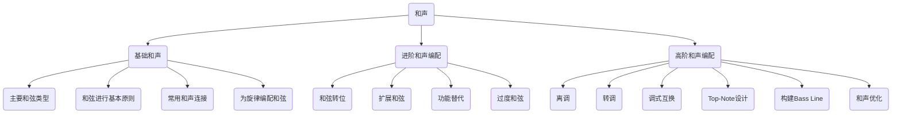

2. 键盘

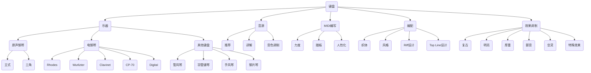

* 吉他贝斯
	* 乐器
		* 原声吉他
			* 尼龙吉他
			* 民谣吉他
			* 人性化
			* Riff设计
			* 电吉他箱头
			* Distortion
			* 十二弦吉他
			* 单把吉他
			* 效果器链路
			* Fuzz
			* 尤克里里
			* 多把吉他
			* Ambiance
			* 曼陀铃
			* 贝斯线条
			* Chorus
			* 班卓琴
			* Tremolo
			* Octaver
		* 电吉他
			* Telecaster
			* Stratocaster
			* Les Paul
		* 原声贝斯
			* 箱贝斯
			* 倍大提琴
		* 电贝斯
			* P贝斯
			* J贝斯
			* 无品贝斯
	* 音源
		* 推荐
		* 讲解
		* 音色调制
	* MIDI编写
		* 力度
		* 演奏法
	* 编配
		* 织体
		* 风格
	* 吉他拾音
		* 电/木吉他拾音
		* 电吉他效果器
	* 效果调制
		* Clean
		* Overdrive
* 打击乐
* 效果器
* 合成器
* 弦乐
* 采样
* 民族/交响乐
* 伴唱

## 硬件配置

电脑
* CPU：i7及以上，Mac M1/2/3皆可
* 内存：16G最基本，建议32G及上
* 显卡：没要求
* 硬盘：固态硬盘，2T及以上。若电脑本身储存空间有限,可外接更多硬盘(阵列或移动硬盘)。建议固态,或存储用机械,运行用固态。

外置声卡

* 相比电脑自带声卡：
	* 更强的运算处理能力。延迟更低，音质更好。但要注意，工程导出音乐的听感好坏，与声卡无关，是CPU的运算。
	* 通常具备话放（话筒放大器）功能，可以推动需额外供电的电容麦克风；耳放（耳机放大器）功能，推动阻抗较大的耳机。
	* 更多输入输出口,更好的录音效果。可输出至更多组音箱、耳机;接入更多麦克风,吉他贝斯等等。
	* 实时音频处理，特有的自带效果器。
* 若无录音需求，耳机阻抗大，不见得需要独立声卡。选购时注意根据自己实际需求，看好声卡的输入输出口数量。
* 推荐型号: 
	* 1~3K：MOTU马头M2、SSL2、Apogee one (mac推荐便携)
	* 3-7k: Apogee Duet3+Dock (Mac推荐)、RME Babyface

监听耳机
* 相比普通耳机，音染更少，更平直的频率响应，细节更好，尽可能还原真实的声音。
* 选购注意，监听耳机有几种类型：
	* 现场型：小巧，头戴式、入耳式，强隔音效果。不舒适，不宜久戴。
	* 录音型：强隔音效果，“夹头”，不宜久戴。
	* 制作型：适合在工作室编曲混音，弱隔音效果，佩戴舒适，可以久戴。
* 推荐型号：AKG系列: 240, 271, K701;舒尔SRHH840;铁三角M50x(夹头) ;索尼7506;拜亚动力DT880
 
监听音箱

* 相较监听耳机,声场表现更好,保护听力,声音细节则不如耳机,对环境要求较高,价位更高。
* 选购注意，不同尺寸，不同位置摆放(近场，远场)
* 推荐型号: Genelec (真力)系列、IK MTM

MIDI键盘

* 提升编曲效率。根据价格,看四方面,造价都用在了哪儿：
	* 键数:越小越便携,越大越专业。36键以下适合移动编曲; 61、88键适合工作室编曲
	* 力度感应:半/全配重,决定了手感。半配重适合没有学过钢琴的同学,按键轻。全配重键盘大多是88键,适合有钢琴功底的同学,模仿钢琴手感。用MIDI键盘练琴推荐使用88键全配重。
	* 其他控制器：是否带有其他旋钮，按钮，推子，打击垫等midi控制器。是否带有触后等功能。考量是否实用，误触还会影响编曲参数。
	* 自带音色：是否有自带的音色。
* 推荐型号
	* 入门级：M-Audio MK系列, MIDIPLUS X系列, Nektar LX系列
	* 中高级：Roland A88, Studiologic SL88, NI Komplete系列
* 数码键盘:所谓"电钢”通常有USB接口,可以连电脑当midi键盘使用。但大部分数码键盘没有Midi控制器(特别是调制/弯音轮) ,需单独配置。
* 合成器：合成器通常有USB接口，除了能自己产生声音输入到电脑，也可以当MIDI键盘使用。

# 宿主（Digital Audio Workstation）

宿主通常指用于音乐制作的工作站软件，工作站软件是一个大平台，一个工具箱，能提供录音、音频编辑、软音源编写、效果处理、乐谱生成等功能，以满足音乐制作的完整需求。目前常见的宿主有Cubase、Pro Tools、Studio One、Logic、Sonar、Ableton Live、FL Studio、Reaper等等。

DAW没有绝对好坏,挑选你称手的使用即可。编曲好坏关键还是看你怎么“编”。

## Cubase

德国Steinberg公司开发,现属YAMAHA旗下
* 专业：行业主流，功能全面，上手难度较高，价格较高（cubase13，3k左右）
* 多轨道同窗编辑：对于多声部编写（弦乐组，管乐组）有巨大优势。
* MIDI编辑功能强：多控制器窗口同时打开,映射表达式对于演奏法切换十分便捷。
* 逻辑性强：轨道种类多。可建立多轨道预制。分轨导出方便。

视频教程：
* 操作类：
	* [B站最全最详细的Cubase教程](https://www.bilibili.com/video/BV1K64y1Y7zM/?p=3&spm_id_from=pageDriver&vd_source=a45d1028d2ae40d356ad6f174920c020)

零散教程：
* https://www.youtube.com/@TheDigitalAudioManual

**官方使用手册（极为实用+重要！！！）：https://www.steinberg.help/r/cubase-pro/13.0/en**

快捷键：
* https://www.steinberg.help/r/cubase-pro/13.0/en/cubase_nuendo/topics/key_commands/key_commands_marker_category_c.html
* 或者直接看：Edit -> Key Commands

## Logic Pro

苹果公司旗下

* Mac原生：安装方便，Appstore直接购买安装。1k出头的价格，一次购买永久升级。稳定性强。但win不能使用。
* 综合性能强：MIDI编辑、音频编辑功能强大，效果器覆盖全面。
* 素材库丰富：自带的Apple loops素材库庞大。
* “音色好听”：加载自带音色的同时会加载相应的效果器，让音色听着更“好听”。

## Studio One

PreSonus旗下
* 新生代宿主
* 快捷键设置人性化：一键映射其他宿主
 
https://s1manual.presonus.com/en


## Ableton Live

* Live表演性：与Launcpad（打击垫）搭配使用，可完成一系列酷炫的表演。
* 音频编辑能力强：“弹性音频”（音频拉伸，音调，扭曲等编辑音质受损小）
* 效果器呈现直观：横向排列效果器，直接显示参数，理论上单轨可挂无限多效果器。
* 自动化编辑强
* 其设计逻辑非常适于电子，采样类等富于创意的音乐。

## FL (Fruity Loops) Studio 

Image Line公司推出，设计初衷是针对Loop处理的一款音序器。如今演变成功能全面的DAW。
* Pattern和Loop双模式：通过pattern写一个很短的部分，然后将其循环组合成完成音乐。
* 其设计逻辑对于做电子，采样类音乐有优势。
* 易上手，有吉祥物，但工作流程(逻辑)与其他宿主不同，难互通。

### 学习方法建议

关于宿主本身的知识：
1. 学会宿主的基本操作：
	1. 找个专门的宿主视频教程看，一般5小时~10小时。然后配合用官方文档查具体的概念与操作。
	2. 视频看完+操作完，再把官方文档粗略读一遍。
2. 粗略地学会运用宿主来完成整个音乐制作流程（即编曲、录音、混音等），侧重于知识的广度。
3. （个人侧重点）精进编曲相关内容，侧重于编曲知识的深度。


4. 先要理解宿主相关知识点的特点：1. 知识点零散，但常见/常用知识点就那么写，其实；2. 大部分知识点简单；3. 宿主都是大同小异，学会一个，其他宿主基本也都会了。


5. 先把上面的视频刷完+操作完（也才3个多小时），然后在脑海中构建出一个相对比较清晰的，知道宿主能做啥，大概怎么做。
   因此实操的时候忘了也没关系，知道怎么查就行。
2. （可选）如果没事做，也可以继续读：Cubase官方使用手册。纯读使用手册，还是挺无聊的，而且因为没有相关需求+实战，也记不牢，不过能查漏补缺。
3. 然后通常也没必要专门再去学宿主，而是专门用到哪模块的时候，要精进的时候再学（如翻Cubase的官方使用手册）。因为一般情况，学编曲的过程中，也能顺带就把宿主的实操就学了，而且这么顺带的学也不那么枯燥（专门学宿主还是比较“空”的），还能实战，真正地“学会”用宿主。
4. **提醒：宿主大多是零散的知识，而短期突击学完不现实，也低效（用到再学，有实际需求+实操，印象更深）。比如遇到Cubase的“Constrain Delay Compensation”按钮，但不知道它具体是什么意思以及用途。可以先Google搜“Cubase Constrain Delay Compensation”，然后找到Cubase的官方解释，在根据提示词：**
```
根据下文介绍，讲解“Constrain Delay Compensation”的具体用途是什么。
功能介绍：
XXXXXX
```
    **去让GPT来做具体的讲解。可以很大的提升学习效率。**

功能介绍：”，记得问GPT。

P.S. Cubase有很多隐藏的功能+快捷键，多到让我想到了日本的忍者屋，各种机关都做得很难让人找到。因此很多功能没人教，压根不知道它存在。产品经理真得不给力呀。


### Studio One

* 先学各种软件的主要功能和基本操作，如：。https://www.bilibili.com/video/BV1uX4y1q7Do/?p=2&vd_source=a45d1028d2ae40d356ad6f174920c020
* 
### 钢琴卷帘（Piano Roll、Key Editor）

电脑音乐制作软件常见的音符编辑模式有两种：①乐谱编辑方式（五线谱、六线谱、鼓谱等）；②钢琴卷帘编辑方式。其中，钢琴卷帘是MIDI音乐特有的音符编辑方式。我们可以在它音符编辑区域编辑音符，按照横向的小节时值刻度编辑音符长度，竖向的键盘对应着音符音高，一个音符就这样输入完成了。

#### 表示

调的表示：在钢琴卷帘中不需要设置调，因为钢琴卷帘就是一个键盘，当按照不同调的音阶来演奏时，它可以是任何的调

实例

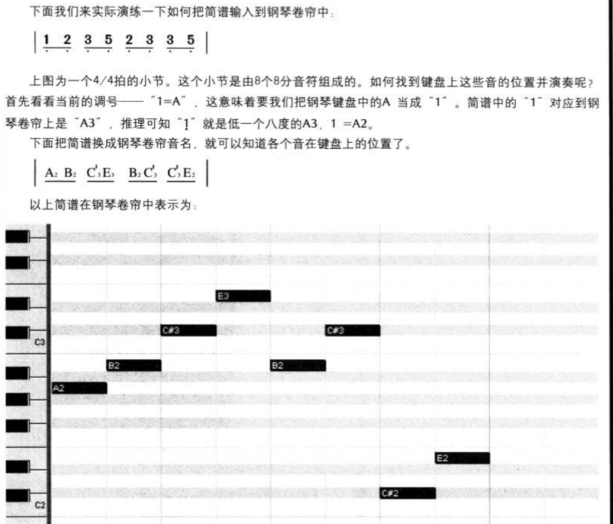

连音线的表示：用来连结同样高低的两个音的弧线叫连音线。连音线可以连续使用，将许多个同样音高的音连接起来，用连音线连接起来的若干个音要唱、奏成一个音，它的长度等于这些音的总和。
如下图中的2音（A大调）。连音线将前后两个八分音符连接起来以后，实际演奏或者在钢琴卷帘中输入时就变成 一个音，其长度相当于两个八分音符的总和，即一个四分音符。

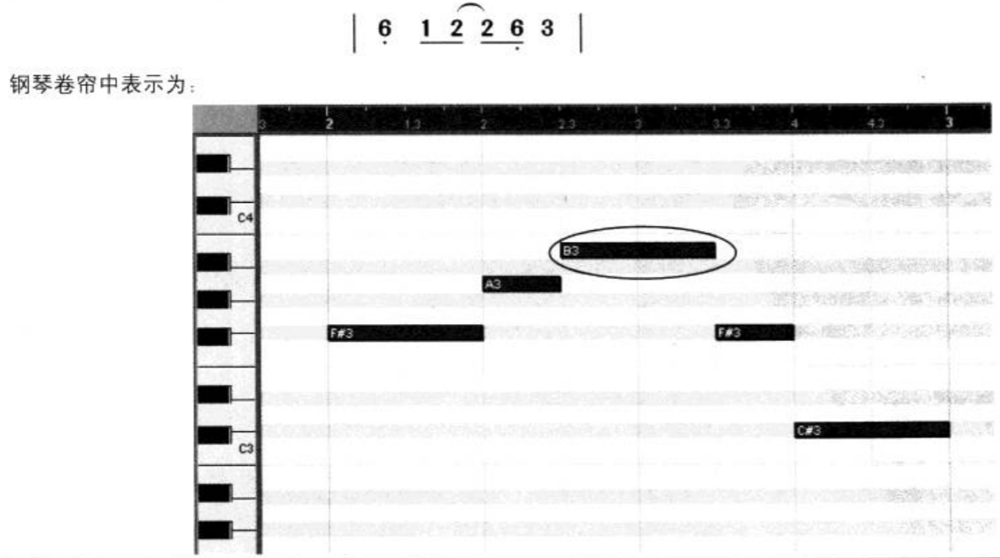


#### Middle C =C3

Pretty much everywhere else I know of (e.g. Vienna Symphonic Lib), middle C = C4, but in the Cubase piano roll (and perhaps elsewhere?) middle C = C3. Why is that, oh wise ones?

Middle C always refers to MIDI Note Number 60. There are 2 main systems in use for naming notes by octaves, one refers to middle C as C3, the other refers to the exact same note as C4. Neither system is right or wrong, they are just different and used in different contexts, like feet & meters (except even more confusing - like US and Canadian gallons). Both C3 & C4 refer to the same C note in the middle of your piano keyboard.

https://en.wikipedia.org/wiki/Scientific_pitch_notation#Similar_systems 提到中央C是C3

http://www.flutopedia.com/octave_notation.htm 提到中央C是C4

### 使用冻结轨道节省CPU

为了更有利于我们完成一些需要大量插件或音频效果器的作品，在总资源有限的情况下就有了冻结的办法，Cubase冻结轨道的原理，就是把已经完成的、或者说暂时不用再修改的某部分音轨直接导出成音频替代原来的音源、插件，然后暂停音源插件的工作，从而达到节省资源，减缓CPU负荷的效果，但需要注意的是，启用后无法再编辑VST乐器界面的参数，也无法再编辑卷帘器里的MIDI参数

## 声卡

缓冲：缓冲的大小主要是体现在midi信号到音频之间的延迟上的。越大的缓冲延迟越高，反之则延迟越低。
关于爆音的问题，主要是如果CPU和硬盘跟不上的话会有运算不过来导致的噪音，如果在daw里内录的话噪音会被录下来。但是离线导出一般没事。

常见问题

* 编管弦乐的时候不要在总轨上给加母带处理（一个效果器内使用多个效果，非常占CPU）
* 不要用机械硬盘加载大型音源，如柏林弦乐
* 不要一边编曲一边玩游戏，录制或编辑或导出视频
* 不要用很小的内存加载多麦克风位乐器
* 不要同时打开BBC和Junkie XI Brass

爆音可能的问题：声卡设置、CPU性能、硬盘性能

1.	将声卡缓冲调到最大（录音用硬件监听）
2.	在VST性能中，打开多线程处理
3.	观察系统性能表Average，开或关Audio-Guard（F12）
4.	在Kontakt中，设置音符，话筒位较多的乐器的Max-Voice
5.	观察系统性能表，根据RealTime，调整（调高）乐器的Preload-Size


CPU该换了的表现：
Kontakt表中弦乐连奏时CPU占用很不辑定，在30%-100%间跳动，并有时变红
没有选择实时导出，却提示CPU过载
Average-Load高

硬盘该换了的表现
Kontakt表中弦乐连奏时Disk占用很不稳定，在30%-100%间跳动，并有的时候变红InTime-Load高

## 音频插件

知识在前，工具在后。不管插件多寡与否，提高我们的创作水平、制作能力、乐理，多听和多分析，才是一切的基础。好的插件也需依托好的音乐人来驾驭发挥，恰好在自身提升的过程中，也能够逐渐了解到自己的工具所需。

### 类型

* 按格式。目前主流的插件格式包括**VST、AAX、AU**格式等。

  它们的主要区别是，Pro Tools宿主只支持AAX格式插件，Logic宿主只支持AU格式插件，除此以外的其他宿主都可以或只能使用VST插件。

  无论VST、AAX、AU都只是格式上的不同，市面上大多数插件都会推出多格式的版本，以满足在不同宿主软件、不同操作平台（Windows / Mac）、和不同系统环境（64位 / 32位）上的运行。我们需要在下载和安装时留意不要选错。

* 按功能。以VST为例，目前大家平时所说的VST概念通常泛指了**VST**和**VSTI**，这也刚好代表了以功能区分的两种插件类型，简单来说：

  1） **VST**（Virtual Studio Technology），可统称为效果器，是一种软件效果器技术，用于对已有的声音进行各种效果处理（从有到优）。

  2） **VSTI**（Virtual Studio Technology Instruments），统称为音源，是一种虚拟乐器技术，用于生成各种数字化声音（从无到有）。

* 按架构。无论是音源还是效果器，若按照插件的应用架构，所有插件又可分为独立插件和插件平台+专用插件两种结构类型。

  * 独立插件，是指单独安装成功后，就可以在宿主软件中打开并直接使用的插件。

  * 插件平台，则在安装之后不一定能直接使用，还需要再下载安装符合该平台格式的专用插件，才能才借助平台有效使用。插件平台和专用插件的关系，与手机系统和APP应用的关系是同理。

    比如，国内使用率最高之一的Kontakt，便是一个提供音源功能的插件平台，用户安装完Kontakt之后，还要下载所需的Kontakt平台**专用插件**，才能有效使用。

综上，一个更新到最新操作系统的Pro Tools的Mac端用户，如需使用Kontakt音频插件，需要下载安装MacOS版本的Kontakt，安装时选择AAX格式并确保是64位，然后再挑选Kontakt平台的专用插件进行下载安装，才可正常工作。

### 按功能分类

* 采样器（Sampler）：使用预先设置好的声音来当音色。本质上是加载了那些已经被制作好的音频文件，放入自己的工程而已。这些声音不是在我们的电脑中凭空生成的，不过采样器通常会再内置一些音频处理功能，我们可以在原始采样的基础上对声音进行二次修改，来获得一个或一组更特别的声音

* 合成器（Synthesizer）：使用计算机合成的声音来当音色。由电脑根据电子和声学原理来产生声音。合成器通常会提供多种合成模式和处理功能，让我们可以对原始电声进行变化、组合、加减、排列等，以加工成为更复杂有趣的声音。合成器是制作电子音乐必不可少的工具，一方面，它可以构建传统乐器难以奏出的音色及特性，另一方面，它又能够模拟出传统乐器的音色。理论上，通过足够复杂的变化组合，我们可以合成出任意一种我们能听到的声音，因此在以新、潮、酷为符号的电子音乐中，合成器带着无限的想象力站上了主舞台
  https://learningsynths.ableton.com/zh-Hans/

* 振荡器（Oscillator）：用来产生基本的声波

  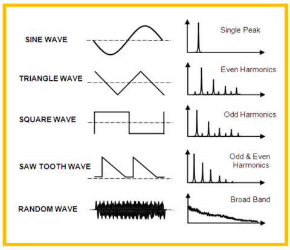

  种类

  * 加分合成（Additive Synthesis）
  * 减法合成（Subtractive Synthesis）
  * 波表合成（Wavetable Synthesis）
  * 微粒合成（Granular Synthesis）
  * 频率合成（FM Synthesis）
  * 物理建模（Physical Modeling）

### 其他

麦克风位：采样音源时，麦克风的摆位。因此麦克风位越多，内存占用也就越多。

5.1声道：三个麦克风位即可混5.1声道，分别是close、tree（mid）、outrigger麦克风

软音源大小的决定性因素：legato精度（如C到D音之间变化的精度）、round robin（同音采样数量）

正版音源

* 所有标准音色库的正版都应该有且仅有一个激活码，用于在Kontakt个人账号中激活的
* 几乎所有的非标准库音色都不能用免费的kontakt加载
* 喷火和Orchestra ITools公司的独立音源是没有人破解的
* 正版音源不允许传播
* 少买那种全是齐奏的，因为虽然声音厚，但是容易出现混音错误，以及会降低选择乐器的能力与音乐丰富度
* 选择在美元比较低的时候买，比如7.03
* 几乎所有音源都有打折的时候，比如Komplete 12
* 购买的时候注意，尤其是非独奏管弦乐音源，尽量选择麦克风位多的

盗版音源：盗版音源不可商用（无版权保护）

### 具体音源插件的选择

古董级音源（尽量不用）：East West Quantum Leap、Steinberg HyperSonic、Tascam GigaStudio

#### Synthesize综合类

Colossus Library---巨人综合音源
Q Library-----Q综合音源
RIG Library----HIP HOP 综合音源
Roland Fantom X6---罗兰采样合成器X6
The Conservatoire Collection-古典综合音色
Yamaha Motif ES7---雅马哈采样器合成器ES7
Yamaha Motif XF----雅马哈硬件采样合成器

#### Drums&Kits打击乐

8Dio EDM Drumstep V.1-----------Dubstep鼓
8Dio Epic Dhol Ensemble---------史诗鼓
8Dio Epic Taiko Ensemble--------史诗太鼓乐团
8Dio Solo Taiko Drums--------太鼓音色Solo版
8Dio The New Alien Drum v2---------外星人鼓
8Dio Zeus Drum-----------宙斯鼓
Cinemamtic Thunder Epic Orchestral Toms--------史诗交响大鼓
Cinesamples CinePerc AUX-------------影视打击
Cinesamples CinePerc CORE----------影视打击
CineSamples CinePerc EPIC---------------影视打击
Cinesamples CinePerc PRO-------------影视打击
Cinesamples Deep Percussion Beds 2--------影视打击乐2
Cinesamples Drums of War 2---------战争鼓2
Cinesamples Rio Grooves!--------巴西节奏打击乐
Drums Overkill---------电鼓音色
Elite Orchestral Percussion-----交响打击
Epic Cinematic Drums---------鼓乐设计
Forest Frame Drums-----------森林鼓
Heavyocity Master Sessions Ensemble Drums---------合奏鼓
Ocean Way Drums Gold------------海运之鼓
Orchestral Tools Berlin Percussion-----柏林打击（含定音鼓）
Percussion Ensemble 2--------启示录打击2
Premier Sound Factory Drum Tree--------套鼓音色
Project Sam True Strike 1--------电影交响打击 1
Project Sam True Strike 2--------电影交甬打击2
Rattly and Raw Martin France Drums--------演奏家鼓组
Sample Logic Rumble----------轰鸣打击乐
Soundiron Street Bukit-------街买即兴鼓手
Spitfire Hans Zimmer Percussion--------喷火汉斯季默打击
Vital Series Mallets-----木槌敲击乐
Vital Series Sticks Library-----小打类loops

#### Orchestra管弦乐交响类

Amadeus Symphonic Orchestra----------交响乐音色库
Berlin Brass v1.1-------柏林铜管（含A/B/C）完整扩展
Berlin Orchestra Inspire------柏林综合管弦乐团
Berlin Orchestra Inspire 2----柏林综合管弦乐团2代
Berlin Strings 2.5------柏林弦乐2.5+A/B/E/D扩展
Berlin Woodwinds 2 Library---------柏林木管2+solo/A/B/C/D扩展
Bravura Scoring Brass-------配乐铜管
Broadway Big Band 1.3---------百老汇大乐队
Chris Hein Ensemble Strings Library-----如歌弦乐合奏版
Chris Hein Horns Pro Complete Library------新现代管乐
Chris Hein Orchestral Brass Library-----古典铜管
Chris Hein Solo Cello Library------独奏大提琴2
Chris Hein Solo Contrabass Library------独奏低音提琴2
Chris Hein Solo Viola Library------独奏中提琴2
Chris Hein Solo Violin Library-----独麦小提琴2
CineBrass Descant Horn--------高音铜管
Cinematic Strings 2.1-------电影弦乐2
Cinematic Studio Brass------工作室铜管
Cinematic Studio Solo Strings------新弦乐独奏
Cinematic Studio Strings------工作室弦乐
Cinesamples CineBrass CORE 1.7d---------影视铜管标准版
Cinesamples CineBrass PRO 1.7a----------影视铜管专业扩展板
Cinesamples CineOrch--------交响齐奏
CineSamples CineStrings Core-------影视弦乐
Cinesamples CineWinds CORE---------影视木管
Cinesamples CineWinds Pro----------影视木舍扩展版
Cinesamples Hollywoodwinds---------好莱坞木管
CineStrings Runs--------影视弦乐
CineStrings Solo--------影视弦乐独奏
Complete Orchestral Collection Library-----管弦乐合集
Embertone Blakus Cello--------实用大提琴
Embertone Fischer Viola-------实用中提琴
Embertone Friedlander Violin-------实用小提琴
Embertone Joshua Bell Violin-------贝尔小提琴
Emotional Violin Library------情感小提琴
EWQLSO PRO XP Brass Library--------白金管弦——铜管
EWQLSO PRO XP Perc Library---------白金管弦——打击
EWQLSO PRO XP Strings Library--------白金管弦——弦乐
EWQLSO Pro XP Woodwinds Library---------白金管弦——木管
Heavycxity FORZO Modern Brass-----------史诗合成铜管
Heavycxity Media Novo Modern Strings-------新概念弦乐
Heavyocity Novo Pack 01 Intimate Textures------管弦乐合成音色
Heavyocity Novo Pack 03 Synthetic Strings------合成弦乐
Heavyocity Rhythmic Textures NOVO PACK 02---------影视弦乐
Kirk Hunter Studios Spotlight Strings------猎人弦乐
LASS Full 2 Library-----LASS弦乐2
London Contemporary Orchestra Strings---喷火伦敦现代交响弦乐
Metropolis Ark 1---------管弦丰碑 1
Metropolis Ark 2---------管弦丰碑2
Metropolis Ark 3---------管弦丰碑3
Metropolis Ark 4---------普弦丰碑4
Mojo 2 Horn Section---------爵士铜管2
Mojo Horn Section Library--------活力铜管
Musical Sampling Adventure Brass---------飞天铜管
Orchestral Brass Classic------影视铜管
Orchestral Essentials 2 Library 1.2------新管弦乐音源
Orchestral Tools presents Time Macro------柏林时间乐团
Output Analog Brass and Winds------------古典黄铜
Output Analog Strings---------现代弦乐音源
PRO XP Gold Library---------黄金管弦乐
Project SAM Organ Mystique 1.3-----------教堂管风琴1.3版
Projects AM Swing! Library-------爵士乐摇摆
Sable Strings Vol 1------喷火弦乐 1
Sable Strings Vol 2------喷火弦乐2
Sable Strings Vol 3a--------喷火弦乐3
Sample Logic Fanfare Library-------尊爵铜管
Sample Modeling French Horn and Tuba 3-------------圆号低音号
Sample Modeling The Trumpet 3------------新版小号音色
Sample Modeling Trombone 3---------新版长号音色
Sonic Symphonic Strings-------Sonic弦乐
Sonokinetic Ostinato Brass-------节奏铜管
Sonokinetic Ostinato Woodwinds-----------木管乐句
Spitfire Audio Albion II Loegria REDUX v3.22-------喷火史诗管弦乐
Spitfire Audio Albion III Iceni REDUX.v2.1---喷火管弦乐
Spitfire Audio Albion IV Uist------喷火管弦乐
Spitfire Audio Albion ONE v1.2-----喷火史诗管弦乐
Spitfire Audio Albion V Tundra-----喷火管弦乐
Spitfire Audio Masse--------喷火交响乐团
Spitfire Audio Orchestral Swarm----------喷火管弦乐
Spitfire Audio Spitfire Solo Strings-----喷火独套弦乐
Spitfire Audio Spitfire Studio Brass-----喷火工作室铜管专业版
Spitfire Audio Spitfire Studio Strings--- 喷火工作室弦乐专业版
Spitfire Audio Spitfire Studio Woodwinds-喷火工作室木管专业版
Spitfire Audio Symphonic Brass-----------喷火铜管
Spitfire Audio Symphonic Woodwinds--------喷火木管
Spitfire Olafur Arnalds Chamber Evolutions library-室内管弦音源
Straight Ahead Jazz Homs 2---------爵士铜管
Strings Run v 2.2--------弦乐大师
Swing More! Library---------大乐队/爵士/电影配乐
Symphobia 1 Library---------交响恐惧1
Symphobia 2 Library---------交响恐惧2
Symphobia 3 Library v1.5---------交响恐惧3（1.5新版）
Symphobia Colours Orchestrator Library-------多彩管弦
Symphonic Orchestra---------猎人管弦乐
Symphonic Strings Ensembles V.1.5---------喷火弦乐群奏
Tina Guo Vol 2 Library------美女大提琴2
Vienna Symphonic Library---------维也纳管弦乐套装

#### Piano&Keys钢琴类

Broken Wurli Library--------Broken Wurli电钢
CBechstein Digital Grand--------精选传奇钢琴
Cinematic Studio Piano--------精选工作室钢琴
CinePiano Library--------柔情钢琴
CineSamples Piano In Blue PROPER--------蓝调钢琴
EP73 Library---------EP73电钢
Galaxy II--------斯坦威钢琴2
Guilhermeosilva Nord Stage 2 Piano------很好的钢琴音色
Hammersmith Professional Editio---------不错的铜琴音色
Neo Soul Keys 3X---------新灵魂电钢3
PEARL Concert Grand---------Yamaha C7 钢琴
Session Keys Electric R-----舞台电钢
Session Keys Grand Y--------雅马哈钢琴
Session Keys Upright--------钢琴音色
Soundiron Emotional Piano Player 3------情感钢琴3
Spitfire Hans Zimmer Piano library------喷火钢琴
Walker 1955 Steinway D----------斯坦威 D 大钢琴
Wavesfactory Mercury--------法吉奥里钢琴
Chris Hein Bass-----------综合贝斯
Embertone Leonid Bass--------------低音提琴
Ilya Efimov Fretless Bass----------无品贝斯
Ilya Efimov Modern Bass------------摩登贝斯
Shreddage Bass 2--------六弦重金属贝斯
SR5 Rock Bass---------摇滚贝斯
Acou6tics Library-------虚拟木吉他版
Acoustic Legends HD---------传奇木吉他
Apollo Cinematic Guitars-------阿波罗影视吉他
Chris Hein Guitars------综合吉他音色
Cinematic Guitars Infinity-----电影吉他
Electri6ity Library-----虚拟电吉他
Evolution Banshee-------8弦金属摇滚吉他
Evolution Dracus--------8弦吉他
Evolution Flatpick 6--------钢弦吉他
Evolution Modern Nylon---------摩登尼龙吉他
Evolution Rick 12-------12弦电吉他
Evolution Sitardelic--------红木电吉他
Heavyocity Scoring Guitars 2-------好莱坞电影配乐2代吉他
Hummingbird Acoustic Guitar--------蜂鸟木吉他音色
Ilya Efimov Acoustic Guitar----钢线吉他
Ilya Efimov Nylon Guitar Strum-----尼龙木吉他扫弦版
Impact Soundworks Shreddage 2--------摇滚金属电吉他
Impact Soundworks Shreddage 3 Stratus------摇滚吉他
Prepared Acoustic Guitars Library------影视木吉他
Prominy V-Metal Library--------金属电吉他
SC Electric Guitar------ 芬达电吉他

#### Synth合成器键盘类

Ambience Impacts Rhythms-----合成器综合音色
Best Service Nitron---电子舞曲合成器
Heavyocity Aeon Melodic---奇幻电子元揍
Heavyocity Aeon Rhythmic--奇幻电子元素
Noise Kreate Kontskt Library-舞曲合成器
Output Substance------低音引擎合成器
Phaedra Ultimate Analog Library————Zero-G 虚拟电子合成器
Rhythm Objekt Library---电子节奏
Sample Logic Synergy X----配乐综合音色（升级版）
SyntAX-------交互式合成器
The Elements Expand-----元素合成器！扩展板
Tronsonic System 1000m----电子合成器
Umlaut Audio PADS-----合成器铺底音色

#### Folk民族类

Akki Plugs Virtual Bouzouki v1.1----布祖基琴 1.1 版
Ethno World 4 Pro--------世界名族4
Ethno World 5 Instruments----世界民族5-乐器
Ethno World 5 Voices-------世界民族5-人声
Ethno World 6 Instruments Library---世界民族6—乐器
Ethno World 6 Voices Library----世界民族人声
EWQL Rare Instruments--------世界民族
Min Zu Yin Yuan----------Kong Audio KJfi （中国民乐 130G）
Percussive Adventures 2 Library-----民族打击京
Ra Library-------RA世界民族
Sample Logic Gamelan---------印尼巴厘岛甘美兰
SonicCouture Balinese Gamelan II----巴厘岛甘美兰音乐2
World Impact Library-------世界民族打击乐

#### Vocal Chorus人声合唱类

8Dio Requiem Professional 1.1-----安魂曲人声 1.1 专业版
Best Service Altus Library----巴洛克之分声
Best Service Cantus Library---------圣歌合唱团
Best Service Kwaya Library---------非洲草原美声
Best Service Mystica------------女子室内合唱团音色
Cinesamples Voxos 2 Epic Choirs------新史诗合唱团2
EWQL Voices of the Apocalypse-----天使合唱团
Heavyocity Media Vocalise 2-----美丽人声
Mars Symphonic Mens Choir-------火星交响男声
Mercury Boys Choir-------水星英国男声
Output Exhale--------好莱坞人声合成器
Realitone Realivox Blue-------歌声合成器
Realivox The Ladies------质感女声
Shevannai the Voices of Elves Library---精灵物语
Soundiron Voices Of Gaia------盖亚之声
Soundiron Voices Of Rapture-----综合人声合集
Symphonic Choirs Library------交响乐人声
Vir2 Aeris Hybrid Choir Designer----史诗合唱团
Voices of War Men of the North------战争之声

#### Other Samples其他采样类

8Dio Dubstep--------Dubstep 音色
8Dio EDM Trap-------电子舞曲Trap
8Dio Mandolin Solo------曼陀林独奏
8Dio Mandolin Strummer------曼陀林扫弦
8Dio Rhythmic Aura Vol.1 Acoustic----合成综合音色
8Dio Rhythmic Aura Vol.2 Synthetic---合成氛围
Best Service Accordions 2 Library-手风琴2
Big Fish Audio Goth-----影视游戏配乐
Chris Hein Winds Vol. 1 Library 2.0--长笛2
Chris Hein Winds Vol.2 Library 2.0--单簧管2
Chris Hein Winds Vol. 3 Library 2.0-双簧管2
Chris Hein Winds Vol. 4 Library 2.0-巴松管2
Cinesamples CineHarps-------影视竖琴
CineSamples CineHarpsichord-----大键琴
Concert Harp EXP Library----音乐会竖琴
Convolution Space-------回旋空间音效
Gothic Instruments DRONAR Master Edition---史诗合成套装
Ilya Efimov Accordion-----手风琴
Insusurro Pads------Pads音色合集
Output Sounds REV-------好莱坞音乐创作
Output Sounds REV X-Loops-------好莱坞音乐创作机器
Output Sounds SIGNAL------好莱坞声音合成器
Red Room Audio Palette Symphonic-----好莱坞电影配乐合奏
Sample Logic Bohemian-------影视配乐
Sample Logic Cinematic Keys-----影视键盘乐
Sample Logic CinemorphX-----影视&游戏节奏
Sample Logic Havoc------影视敲击音色
Sample Logic Impakt-----影视配乐元素合成器
Sample Logic Morphestra 2-------影视电影配乐音色
Sample Logic Waterharp 2----水竖琴2
Sample Logic Xosphere 2-----环境音效虚拟乐器
Sasha Soundlab Library------DJ舞曲音色
Soundiron Antidrum Machine------现代环境音源
Spitfire Audio Grand Cimbalom-----喷火扬琴
Spitfire Flute Consort Vol 1 library-喷火长笛
Spitfire Harp Redux 2.1-----喷火竖琴
Tina Guo Artist Scries----含二胡、原声大提、电音大提
Universal Samplings Windchimes----风铃达人
Virtual Ensemble Trilogy----虚拟三部曲

#### 后期缩混效果器

ArtsAcoustic Reverb v1.6.0.15 老牌混响
BBE Sound Sonic Sweet.v4.0 激励器
Celemony Melodyne Studio 4.1.1.011 音高修正
D16 Group Audio Software Sigmund vl.1.0延迟效果器
IK Multimedia AmpliTube 4 Complete.v4.7.0B 吉他效果器
IK Multimedia Lurssen Mastering Console.vl.0.3母带效果器
IK Multimedia T-RackS.5 Complete.v5.1.1B：恐龙效果器
iZotope Nectar v3.00
iZotope RX7音频降噪
iZotope Insight v2.00
iZotope Neutron Advanced v2.00智能混音效果器
iZotope Ozone Advanced 8臭氧母带处理
Klanghelm DC8C v2.3.0
Klanghelm MJUC variable-tube compressor.vl.1 行家压缩
MeldaProduction.MTotalBundle.v8.0 2 套装效果器
Nomad Factory MAGMA v1.6.6吉他效果器
OverTone DSP DYN500 v2.3.2
OverTone DSP EQ500 .v2.3.2
OverTone DSP EQ4000 v1.0.0
OverTone DSP FC70 v2.3.6
Plug And Mix VIP Bundle v3.2.0模拟硬件全套效果器
SIR Audio Tools SIR2 V2.4.12 混响圣典
Sonalksis Studio One Bundle v3.02套装效果器
Voxenqo SPAN Plus v1.4频谱分析仪
FabFilter Total Bundle肥波效果器套装

#### 独立VST+AU音色库

Superior Drummer 鼓2.4.4版原版+扩展
SL-Allaire
SL-Avatar
SL-CVMKII
SL-HitFactory
SL-MetalFoundry
SL-MusicCity
SL-NYVol3
SL-RootsVol1
SL-RootsVol2

Spectrasonics四巨头公司套装包含4套音色库
Spectrasonics Trilian1.43d 新版贝斯音色
Spectrasonics Omnisphere 2.42 新合成器（含扩展）
Spectrasonics keyscape新键盘合成器音色
Spectrasonics Stylus RMX1.98c新版节奏鼓（含原版+9套扩展）
Toontrack EZkeysl.24完整版钢琴/原版+10套扩展含以下内容
Grannd piano（原版）
Upright piano（扩展）
Retro Electrics（扩展）
Classic Electrics（扩展）
Electric Grand（扩展）
Mellotoon（扩展）
Vintage Upright（扩展）
Pipe Organ（管风琴扩展）
Small Upright（扩展）
Studio Grand（扩展）
String Machine（扩展）
XLN Audio Addictive Keysl.11 钢琴
XLN Audio MarkOne（扩展）
XLN Audio Modern Upright（扩展）
XLN Audio Studio Grand（扩展）
XLN Audio Electric Grand（扩展）
Camel Audio Alchemy 1.25骆驼合成器/含17套扩展（电子利器）
Camel Audio Alchemy Factory Bonus Packs Vol 1 -4
Camel Audio Atmospheric
Camel Audio Atmospheric
Camel Audio Biolabs Alchemy Labs
Camel Audio Biolabs Dark Space
Camel Audio Cinematic
Camel Audio Dance And Trance
Camel Audio Dream Voices
Camel Audio Dubstep
Camel Audio Electronic
Camel Audio Himalaya Pads
Camel Audio Himalaya Vintage
Camel Audio JunkieXL Future Old Skool
Camel Audio Luftrum Ambient
Camel Audio Planet Earth
Camel Audio Viral Outbreak
Camel Audio Alchemy Player Arp Dimensions

Addictive Drums鼓2.07原版+扩展
EZ Drummer 2.13K 原版+33套扩展
FXPansion BFD 2.3版鼓（原版）+22套扩展
MusicLab RealLPC V4.0.0.7239电吉他
MusicLab RealRick V4.0.0.7250电吉他
MusicLab.RealGuitar.v4.0.0.723木吉他
MusicLab.RealStrat.v4.0.0.7239电吉他
SSD4板岩鼓白金版+四套扩展
Vengeance Producer Suite Avenger.vl.2.2复仇者合成器+扩展
Synapse Audio DUNE 2.5 沙丘合成器+扩展
IK Multimedia MODO BASS vl.5.1 物理建模贝斯

#### Sound FX，音效类

Best Service Blue Box 16（综合音效）
Best Service K-Size FX Edition （舞曲LOOP综合音效）
Best Service Studio Box Vol 1-4（工作室综合音效套装）
Blastwave FX Buzzsaw 2（音效库）
Blastwave FX Imaging Elements（音效库）
Blastwave FX Warfare 1 Sound Effects（战场环境音效）
Blastwave FX Zombie Apocalypse（僵尸音效库）
Blastwave Revolver 5.1 Production Elements（5.1环绕音效）
Bluezone Corporation Eerie Ambience&Sound Effect（怪异氛围）
Bluezone Corporation FX Mega Pack（FX合集包）
BOOM Library Sci-Fi Construction Bits（科幻综合音效）
BOOM Library Sci-Fi Designed（科幻音效）
Boom Library Assault Weapons Bundle（电影游戏机关枪声音效）
Boom Library Birds of Prey （综合鹰）
Boom Library Cinematic Darkness Bundle（电影黑暗音效）
Boom Library Cinematic Horror Bundle（电影恐怖音效）
BOOM Library Cinematic Metal（电影金属撞击音效）
BOOM Library Cinematic Trailers（电影预告片音效）
BOOM Library Cinematic Trailers Designed（实用影视音效）
BOOM Library Close Combat Construction kit（拳脚打斗音效）
BOOM Library Close Combat Designed（拳脚打斗音效）
BOOM Library Creatures（凶猛野兽！龙音效）
BOOM Library Dogs（狗音效）
BOOM Library Everyday Cars（汽车综合音效）
Boom Library Flowing Water（河流瀑布音效）
BOOM Library Gun Handling（枪械上膛、上子弹音效）
BOOM Library Guns Construction Kit（综合枪械环境，枪声音效）
BOOM Library Guns Designed（枪械环境，枪声音效）
BOOM Library Historical Firearms Construction Kit（战争枪炮音效）
BOOM Library Historical Firearms Designed（战争枪炮音效）
Boom Library Horses（马音效）
BOOM Library Medieval Weapons（影视游戏！综合武器音效）
BOOM Library Medieval Weapons Designed H6（影视游戏！武器音效）
Boom Library Outdoor Impulse Responses（室外环境音效）
Boom Library P-51 Mustang（飞机引擎声）
Boom Library Prairies（大自然草原音效）
Boom Library Silencers Bundle（枪械消音器音效）
BOOM Library The Interface（游戏跟其他音效）
Boom Library Thunder and Rain（雷和雨暴风）
Boom Library Tropical Forests（热带雨林环境音效）
Boom Library Upwellings Stereo（景气上升流音效）
Boom Library Virtual Foley Artist Footsteps（鞋周边环境声）
Boom Library Waves（海浪音效）
Boom Library Wetlands Stereo and Surround（大自然周边氛围）
BOOM Library Wildcats Tigers Lions（狮子音效）
Boom Library Winds Of Nature（自然风声音效）
Digiffects Series A City Sound Effects（城市环境音效）
Earth Moments Laya Project Ambience Vol.1 （氛围综合音效）
Ghost Samples Sweeps and Special Effect（神秘大气背景）
Hex Loops Sci Fi Sound Effects（科幻音效） 
Hollywood Edge Animal Trax 1-10（动物音效）
Hollywood Edge Eerie Edition （好莱坞万圣节恐惧音效）
Hollywood Edge Hot Trucks（好莱坞卡车音效）
Hollywood Edge Sound Designer Tool Kit 2（好莱坞音效）
Hollywood Edge Sounds of Speed（赛车音效）
Hollywood Edge The Car Chase Scene Set（好莱坞之巅音效）
Hollywood sound effects（好莱坞电影音效全集）
Jksound Synthetic Trance FX（舞曲FX音效）
Kindred Sounds Futuristic Deep Space FX（FX音效）
KMP Film Video Sound Effects Vol 1-9（电影音效库）
Loopmasters Designer Dance FX（舞曲FX）
Pressure Samples Essential FX Vol.1（电子舞曲音效）
Samplephonics Hollywood Tension FX（好莱坞电影预告片音效）
Samplephonics Static FX WAV Sampler Patches（电子音乐音效）
Shockwave FX Elements Progressive Edition Vol 2（电子舞曲音效）
Shockwave Studio Weapons FX Vol 4（电子FX音效）
Sony Pictures Sound Effects Series Vol 1-10（影视音效合集）
Sound Effects Bible Ambience（氛围综合音效）
Sound Effects Bible Fire（音效库）
Sound Effects Bible Household（音效库）
Sound Effects Bible lmpacts（音效库）
Sound Effects Bible Industry（音效库）
Sound Ideas BBC Sound Effects Library（广播公司BBC音效库）
Sound Ideas Digiffects Series G（休闲音效）
Sound Ideas Digiffects Series K Click Shop SFX（音效）
Sound Ideas Impact Effects Vol 1-3 （撞击音效库1.2.3）
Sound Ideas Noise Generator Production Elements SFX （音效）
Sound Ideas Power Surge 1+2（电能冲击波音效库1+2）
Sound Ideas Sci Fi Series 8000（空间科幻音效库）
Sound Ideas Sports Sound Effects Library（运动音效）
Sound Ideas The Dark Side Of Sound（幽灵音效库）
Sound Ideas The Lucasfilm Sound Effects（好莱坞电影音效）
Sound Ideas The Mix III（广播影视音效）
Sound Ideas The SFX Kit CD1-8（20000个游戏娱乐音效）
Sound Ideas The XV Sound Effects Series 1（综合音效）
Soundbox Killer FX Drops 3（舞曲FX过渡）
The Danish Radios Sound Effects Archives（综合音效）
The International Sound Effects Library（综合鸟、小动物音效）
Tonsturm 01 Breaking Glass 192 kHz WAV（玻璃音效）
Tonsturm 02 Electricity 192 kHz（高压电流声）
Transacord Steam Rail Sound Effects（蒸汽火车音效）
VideoCopilot Designer Sound FX （影视音效）
Videocopilot MotionPulse+ShockWave Sound Design（影视视频+音效）
Warner Bros Sound Effects Library（华纳兄弟公司音效）
Wave Alchemy SFX Collection 02 （影视合成音效）

#### Ueberschall（LOOP公司）

Elastik采样器
Ueberschall 8 Bit Stylez （游戏综合乐段）
Ueberschall 60s a GoGo （60年代采样乐段）
Ueberschall 60s Psychedelic Rock（60年代迷幻摇滚）
Ueberschall 70s Funk Rock （芬克摇滚乐段）
Ueberschall 80s Punk And New Wave （80年代朋克）
Ueberschall 80s Smash Hits （80年代流行乐段）
Ueberschall Acoustic Guitar（原声吉他）
Ueberschall Acoustic Guitar 2（原声吉他2）
Ueberschall Action Cuts （节奏打击乐）
Ueberschall Ambient Elastik Inspire Series（氛围综合乐段）
Ueberschall Ambient Noises （环境噪音）
Ueberschall Analog Attack （虚幻冲击乐段）
Ueberschall Analog FX （效果音效乐段）
Ueberschall Antigravity Maneuvers （蓝调雷鬼乐段）
Ueberschall Art Of Sounds （声音的艺术）
Ueberschall Astral Electro Flux （电子乐段）
Ueberschall Balkan Lines （巴尔干风格乐段）
Ueberschall Bass Saxophone （低音萨克斯）
Ueberschall Batucada （桑巴鼓）
Ueberschall Beyond Tech House （电子世界！乐段）
Ueberschall Big Beat Elastik （低音鼓！综合音色乐段）
Ueberschall Blues Colors （影视游戏！蓝调乐段）
Ueberschall Bollywood Pop （流行宝莱坞乐段）
Ueberschall BPM 120 （稀有的节奏）
Ueberschall Brasil Nova Primeiro （巴西风味）
Ueberschall C.R.U.N.K Southern Storm （美国南部说唱风暴）
Ueberschall Caribbean Flavors （加勒比海！拉丁乐段）
Ueberschall Chart Hits （流行舞曲排行榜）
Ueberschall Chart Hits 2 （电子流行乐）
Ueberschall Chillers Joint （虚拟合成乐段）
Ueberschall Chillout Breeze （休闲综合乐段）
Ueberschall Chillout Lounge（爵士乐风格）
Ueberschall Chillout Lounge 2 （trip-hop综合LOOPS）
Ueberschall Chillout Zone （弛放地带）
Ueberschall Cinematic Timeshift （电影配乐效果）
Ueberschall Club Rnb （酒吧慢摇RNB乐段）
Ueberschall Club Toolz （酒吧工具音色）
Ueberschall Commercial Pop （经典流行乐队乐段）
Ueberschall Concert Flute Delicate Melodic Moods （长笛乐句）
Ueberschall CrunkZilla （说唱节奏 loop 乐段）
Ueberschall Dancehall Madness （舞曲合奏1）
Ueberschall Dancehall Madness Vol2 （舞曲合奏2）
Ueberschall Daytime Tunes （流行综合）
Ueberschall Deep Electro House （深度电子House）
Ueberschall Deep House Club Sounds Vol.1 （House综合乐段）
Ueberschall Disco De Luxe （70年代Disco综合乐段）
Ueberschall Disco House （Disco House）
Ueberschall Drum and Bass Lounge （低音鼓&综合乐段）
Ueberschall Drum and Bass Vol.1 （低音鼓综合乐段1）
Ueberschall Drums （多风格！打击LOOP鼓）
Ueberschall Dubstep Destruction （Dubstep合成器乐段）
Ueberschall Dubstep Skillz （金属综合风格乐段）
Ueberschall Dubtechno （电子世界）
Ueberschall Elastik Studio Works （舞曲工作室）
Ueberschall Electro House 2 （电子地狱2）
Ueberschall Electro House Inferno （电子地狱乐段）
Ueberschall Electro ID （电子身份）
Ueberschall Electro Pop （流行电子舞曲乐段）
Ueberschall Electro Producer Pack 1 （电子工厂1）
Ueberschall Electro Producer Pack 2（电字工厂2）
Ueberschall Essentials Of The Order（电子舞曲乐段）
Ueberschall Finest RnB （RnB乐段）
Ueberschall Funk & Soul - Elastik Inspire Series （芬克灵魂综合乐段）
Ueberschall Funky Electro House （Funky电子浩室）
Ueberschall Funky Tonewheels （管风琴乐段）
Ueberschall Future FX （未来音效乐段）
Ueberschall Future Garage （未来车库风）
Ueberschall Glam Rock （华丽摇滚loop）
Ueberschall Groove Shadow （舞曲节奏loop）
Ueberschall Grunge （蹩脚货乐段）
Ueberschall Guitar Ballads （吉他民谣）
Ueberschall Hardtechno vs Schranz （后现代舞曲乐段）
Ueberschall Hip Hop Underground （底下HipHop）
Ueberschall Horn Section （综合风格铜管乐段）
Ueberschall House Elastik Inspire Series （House综合乐段）
Ueberschall Indie Rock（摇滚采样乐段）
Ueberschall Indie Rock 2 （摇滚采样乐段2）
Ueberschall Indie Rock 3 （摇滚采样乐段3）
Ueberschall Jazz Colors （拉丁爵士乐段）
Ueberschall Jazz Guitar （爵士吉他）
Ueberschall Late Night Session（流行！爵士乐乐段）
Ueberschall Looptool 2 （综合风格乐段）
Ueberschall LoungeOramA （电形配京混戏音乐）
Ueberschall Low Tuned Strings （另类乐器弦音色）
Ueberschall Metal （金属摇滚乐段）
Ueberschall Minimal Electro Vibes （微电子颤抖乐段）
Ueberschall Minimal House （ house舞曲节奏）
Ueberschall Minimal Techno （舞曲节奏）
Ueberschall Neurofunk （合成器乐段）
Ueberschall Nightshift （抒情综合乐段）
Ueberschall Nightshift 2 （深夜的音乐）
Ueberschall On the Rock （7-8-90年代摇滚）
Ueberschall Oriental RnB （东方RnB）
Ueberschall Percussion （综合手鼓LOOP）
Ueberschall Planet Trance （流行舞曲乐段）
Ueberschall Pop Ballads （流柠慢摇Loop）
Ueberschall Pop Charts （流行音乐乐段排行榜）
Ueberschall Pop Music （流行音乐乐段）
Ueberschall Pop Rock （流行摇滚）
Ueberschall Prog Rock （70-80年代摇滚乐段）
Ueberschall Pure Fire （古典弦乐和合唱）
Ueberschall Rare Grooves Vol.1 （70年代综合乐段）
Ueberschall Reggae Fundamentals （雷鬼乐段）
Ueberschall Reggae Fundamentals 2（雷鬼乐段2）
Ueberschall Reggaeton （拉丁雷鬼配乐东段）
Ueberschall Relaxed Guitar Grooves （休闲吉他）
Ueberschall Retro Action Score （复古综合乐段）
Ueberschall Retro Soul （复古灵魂综合！乐段）
Ueberschall Retrofit Sensory Disruption （卡通音效配乐）
Ueberschall Rock Ballads （摇滚民谣乐段）
Ueberschall Rock Classics （摇滚经典）
Ueberschall Rock Elastik Inspire Series （华丽摇滚综合LOOP）
Ueberschall Score Elements （恐怖神秘音效）
Ueberschall Score FX 2 （综合FX 2）
Ueberschall Shred Guitar （综合吉他乐段）
Ueberschall Solo Guitar （独奏吉他）
Ueberschall Soulful Pop （深情流行乐段）
Ueberschall Sounds of Berlin （柏林乐段）
Ueberschall soundscapes （生活环境采样）
Ueberschall Supreme Styles （主流风格乐段）
Ueberschall Synth Pop （流行电子合成器乐段）
Ueberschall Tech House （House舞曲乐段）
Ueberschall Tech House Producer Pack （数码House）
Ueberschall Techno ID （柏林电子）
Ueberschall The Resource （流行节奏合集）
Ueberschall Thrash Metal （金属乐段）
Ueberschall Trance ID1 （专业舞曲）
Ueberschall Trance ID2 （专业舞曲）
Ueberschall Trap （Trap嘻哈综合）
Ueberschall Twang （乡村摇滚吉他）
Ueberschall Uplifting FX （电子舞曲FX）
Ueberschall Uplifting Trance （舞曲综合乐段）
Ueberschall Upright Bass （贝斯乐段）
Ueberschall Urban （城市综合音效）
Ueberschall Urbanic（城市自由精神乐段）
Ueberschall Urbanic Guitars （综合吉他乐段）
Ueberschall Urbanic II （HipHop音色）
Ueberschall Urbanic Producer Pack II （城市之魂loop乐段）
Ueberschall Vocal Dance Hits （舞曲人声综合音色）
Ueberschall Vocal House （House舞曲人声）

### 影视配乐用音源

弦乐部分 (必选之一)
BBC Symphony Orchestra (E&S) / Cinematic String / Cinematic Studio String (E&S) / Berlin String Metropolis Ark I / Cinestring (E&S) / Hollywood String / Lass String / Spitfire Studio String Pro Venice String / Jaegar / Nucleus(最便宜)(E&S) / Vienna String (E&S) / Spitfire Symphony String

铜管部分 (必选之一)
BBC Symphony Orchestra (E&S)/ Cinematic Studio Brass / Berlin Bras^ (E&S)
Metropolis Ark I / CinesBrass (E&S) / Hollywood Brass / Modern Scoring Brass (最专业)(E&S) /
Spitfire Studio Brass Pro / Jaegar / Nucleus(最便宜)/
Spitfire Symphony Brass / JXL Brass (E&S) / Vienna Brass (E&S)

木管部分 (必选之一)
BBC Symphony Orchestra / Berlin Woodwinds (E&S)
Cineswinds / Hollywood Woodwinds (E&S)
Spitfire Studio Woodwinds Pro/ Nucleus®便宜)/
Spitfire Symphony Woodwinds/ Vienna Woodwinds (E&S)
(独奏推荐)
8Dio Claire Series

打击部分 (推荐)
Hanz Zimmer Percussion Pro/ Strikeforce / 8DIO New Epic Series
Damage / Albion Darwin Percussion / Jaegar

合唱团
(推荐)
8Dio Insolidus Choir / 8Dio Liberis Angelic Choir (E&S) / Oceania

人声独奏
Storm Choir II (E&S) / Voxes II (E&S) / Jaeger Hangar 4 - Vocals by Merethe Soltvedt (强烈推荐)

### 具体音源介绍

#### 采样器

##### 宿主自带的音源插件

宿主自带的音源插件是新手尝试的绝佳选择，除了采样器，合成器和效果器也同理。

宿主之间为了提升竞争力，在试用或购买时，都会附赠一些基础插件。这些插件的好处是免二次安装（宿主软件安装时自带）、涵盖类型广（有各种乐器和合成音色）、声音质量高（自家出品有保证），不足之处是泛而不深，点到为止，但对于Demo作曲编曲来说也已基本够用。

像是Logic Pro自带的采样器、Alchemy（合成器）等，都是业界口碑之作，风格多样。

Cubase Pro自带的HALion Sonic（综合音源）、Groove Agent（鼓/节奏类）、Padshop（铺底音色）等，也都是有保障的精品音源。

先在宿主自带的音源插件上摸索游玩，体会不同声音类型的趣味、找到自己所爱，那么在后续选装其他第三方插件时，也就有了方向，能够很好地节省时间和费用成本。

##### 插件平台/综合音源

l **Native Instrument Kontakt。**

首选NI公司的Kontakt。Kontakt已然是行业标杆，应该是当前使用人数最多、内容最全的音源，如果说要有一款“必装“插件，那它就不二之选。

Kontakt本身是一个**采样器插件平台**，我们可以选购和安装其专用插件，使我们可以在Kontakt的平台基础上使用各种采样音色。后文中提到的许多其他插件，也都需要基于Kontakt平台来运行。

Kontakt采样器自带的一套原厂音色库（Kontakt Factory Library），采样内容广泛包含了管弦乐器、流行乐器、复古乐器、打击乐器、合成音色、民族音乐等，不少采样的品质不亚于独立音源，也是一份新手宝藏。

其他与Kontakt同类的采样器插件平台，在使用率上已逐渐被Kontakt完全赶超，现在还有3款可作为辅助性的参考备选：

l **Best Service Engine。**

l **IK Multimedia SampleTank。**

l **Steinberg HALion。**

##### 钢琴/键盘类

钢琴/键盘类是软件音源最能胜任的原声乐器，因为在真钢琴上弹、和使用配重键盘在电脑上弹，效果已经相差无几，连脚踏板踩下的声音都能完整模拟。利用软音源还可以确保声音纯净无杂，省去录音的烦恼，并能做细微的音色后期调整。以及，键盘类乐器不涉及如揉弦、滑弦、颤音、震音等拨弦/弓弦类乐器特有技法，因此使用软音源弹奏和真实弹奏已经如出一辙。推荐：

l **Addictive Keys。**

Addictive Keys是一套包含了三角钢琴、立式钢琴、电钢琴的集合套装，音色正宗，有多种风格模板可以直接选用。

l **Spectrasonics Keyscape。**

Keyscape也是键盘乐器套装，并在电钢琴、管风琴上有更多选择。

这两款音源都属于“套装”，也就是装一款插件，能获得多款乐器的声音。使用套装或系列音源的好处是，同一套插件内，不同器乐的设计布局一致、操作模式相同，学会了一款，就学会了所有其他款，复用性能带来高效舒畅的数字制作体验。因此在后文出现的所有插件中，笔者也会优先参看套装款或系列款。

此外，还有其他几款音色出众、品质一流的音源，供参考备选：

l **Native Instruments Una Corda，**灵性、精致而超前的钢琴音色。基于Kontakt平台运行。

l **Native Instruments The Grandeur**，三角钢琴。基于Kontakt平台运行。

l **Native Instruments The Maverick**，三角钢琴。基于Kontakt平台运行。

l **e-Instruments Session Keys（系列）**，包含多款钢琴和电钢琴。基于Kontakt平台运行。

l **Native Instruments Vintage Organs**，包含多款管风琴。基于Kontakt平台运行。

##### 鼓/打击乐类

鼓/打击乐类同样是适合使用软音源来模拟的乐器。在电脑上制作鼓点节拍，能确保节奏的完全稳定性，这对于部分音乐类型来说十分重要。并且原声架子鼓的实录要耗费不少功夫，对录音师、混音师都有较高要求，对新手来说具有一定门槛。此类音源推荐：

l **Addictive Drums。**

Addictive Drums是相当优秀的原声架子鼓音源之一，包含从流行、爵士、摇滚、金属、复古、到拉丁等多套架子鼓风格，能从容应对泛流行音乐风格。

l **Native Instruments Battery。**

Battery不仅包含了原声架子鼓采样，还有大量电子鼓音色可供下载选装，是少有的能同时胜任架子鼓和电鼓音色的插件，采样库也足够全。

其他参考备选推荐：

l **Fxpansion BFD**, 原声架子鼓为主，第3代进行了全面升级，采样分层细致，扩展音色库强大，对于已有一定经验并希望精细打磨作品的制作者来说，也会是无出其右的利器。

l **Toontrack Superior Drummer**，偏流行音乐风格的原声架子鼓，可选音色库也十分丰富。

l **Native Instruments Studio Drummer**，偏流行音乐风格的原声架子鼓。基于Kontakt平台运行。

l **Native Instruments Abbey Road Modern Drummer**，偏流行音乐风格的原声架子鼓。基于Kontakt平台运行。

l **Native Instruments Action Striks**，偏氛围音乐风格（如影视/宣传/配乐等，下同）的打击乐。基于Kontakt平台运行。

l **Native Instruments Heavyocity（系列）**，偏氛围音乐风格的打击乐。基于Kontakt平台运行。

l **Cinesamples CinePerc**，含世界各地打击乐乐器，质优库全。基于Kontakt平台运行。


##### 吉他/贝司类

坦白来讲，吉他/贝司类就实录更好了，使用音源会或多或少缺失一些自然性弹奏细节，或换言之用音源插件来模拟的成本较高。

但是对于Demo编曲、缺人情况、或在音乐中所占比重较小时，还是可以在以下系列中选其一二。推荐：

l **Ilya Efimov（系列）。**

Ilya Efimov系列全套包含了钢弦木吉他、尼龙弦木吉他、电吉他、电贝司、无品电贝司等，可运用的技法丰富，扫弦、倚音、闷音、把位切换等都可以轻易操作实现。

l **Ample Sound（系列）。**

Ample Sound系列全套包括了钢弦木吉他、尼龙弦木吉他、电吉他、电贝司、尤克里里等，这一系列是民族之光，国产骄傲，同样功能全面，稳居第一梯队，是不少专业制作人的吉他软音源首选。

其他参考备选推荐，可作为吉他/贝司清音音色的补充：

l **MusicLab Real（系列）。**

l **Impact Soundworks Shreddage（系列）**。基于Kontakt平台运行。

l **Spectrasonics Trilian**，只有贝司。


##### 弦乐/管乐类

同样的，由于弦乐/管乐类乐器在实际拉奏和吹奏时，可运用多种技法以表达情绪，如果有条件，实录会更佳自然；特别是对于大型编制来说，实录反而会综合性价比更高。

在软音源上，我们可以在以下几套插件中选取一两套：

l **Spitfire Audio（系列）**，包含了弦乐、铜管乐、木管乐、打击乐、其他交响乐乐器等，还有与Hanz Zimmer的大师合作款。基于Kontakt平台运行。

l **Chris Hein（系列）**，包含了弦乐、铜管乐、木管乐、打击乐、其他交响乐乐器等，操作便捷。基于Kontakt平台运行。

l **East West Holywood Orchestra（系列），**包含了弦乐、铜管乐、木管乐、打击乐等，世界顶尖获奖团队出品。

l **Berlin（系列）**，包含了弦乐、铜管乐、木管乐、打击乐等，技法和音色细致度极高。基于Kontakt平台运行。

l **Cinesamples Cine（系列）**，包含了弦乐、铜管乐、木管乐、打击乐、其他交响乐乐器等，乐器种类丰富。基于Kontakt平台运行。

l **Best Service The Orchestra Complete**，包含大量的预设乐句样本，适合高效流水线作业。基于Kontakt平台运行。

l **ProjectSAM Symphobia**，包含大量的预设乐句样本，适合高效流水线作业。基于Kontakt平台运行。

l **Audiobro LA Scoring Strings**，只有弦乐，单就弦乐而言，全面优秀。基于Kontakt平台运行。


##### 民族音乐类

民族乐器大概是最不适合用纯软音源制作的类别了。如果所制作的音乐中民乐部分是主角，那么软音源的效果往往难尽人意。尤其是中国民乐，注重韵味传承、要求行云流水，如果想避免塑料中国风，那还是得有实录为佳。

以下按照音乐地域风格提供几套推荐：

l 各地综合，**Best Service Ethno World**。基于Kontakt平台运行。

l 中国，**Kong Audio（系列）**。基于Kontakt平台运行。只有Windows版本。

l 日本，**Sonica（系列）**。基于Kontakt平台运行。

l 古巴/印度/中东/西非/印尼，**Native Instruments Discovery（系列）**。基于Kontakt平台运行。

l 中国/日本/印度，**Impact Soundworks Complete World Bundle**。基于Kontakt平台运行。

以下插件已有年代感，但由于民族器乐的音色独特性，这些插件仍保持着一定价值，需要时可作为补充：

l 部落风格，**Best Service Forest Kingdom**。基于Engine平台运行。

l 各地民族打击乐，**Evolution Series World Percussion**。可选基于Kontakt或Engine平台运行。

l 中国戏鼓，**Best Service Peking Opera Percussion**。基于Engine平台运行。

l 中国/印度/非洲/美洲/澳洲/中东/土耳其，**East West Quantum Leap Ra**。

l 中国/印度/波斯，**East West Quantum Leap Silk**。

l 俄罗斯，**Ilya Efimov Russian Folk（系列）**。

l 欧洲弹拨乐，**Cinesamples Dulcimer and Zither**。

另外，各种小众的世界民乐乐器也大多能找到独立插件，需要的朋友可以按需搜寻。


##### 氛围/音效类

氛围/音效类音源是一个很大的话题。只要是“让人有感觉”的声音，甚至是日常生活中的各种声音采样，都可以归属于音效类音源；只要是能营造氛围感的声音，从舒缓、紧张、激烈到惊悚，从小桥流水到星际遨游，从广告宣传片到好莱坞大戏，涉及到的氛围可能性也不是潦草两句就能概括。幸运的是，这些各式各样的情绪和声音，我们大多能找到与之相符的音源或采样。

在这里，笔者主要考虑音源插件的独特性和前瞻性，为大家提供几个选择：

l **Sample Logic（系列）**，音效库强大，组合类型多。基于Kontakt平台运行。

l **Native Instruments RISE & HIT**，专注于过渡类音效。基于Kontakt平台运行。

l **Native Instruments Straylight**，专注于动态过渡氛围。基于Kontakt平台运行。

l **Native Instruments Analog Dreams**，包含一些前沿电子音色。基于Kontakt平台运行。

其实对于音效类音源，除了使用插件，我们还可以直接使用“采样包”。所谓采样包就是某类特定类型的音频素材打包，如汽车声、动物声、爆炸声、枪声等等。

有些公司专门制作了各式各样的采样包，音质和丰富度都还是不错的，其中素材较为全面的系列包括：

l **Boom Library（系列）。**

l **Epic Stock Media（系列）。**

l **Sound Ideas（系列）。**

l **SoundMorph（系列）。**

l **Cinetools（系列）。**

> 说明：此处主要是指以实录录音为主的采样包，并非电音音乐的合成音色采样包概念。


##### 人声类

平时我们在音乐尤其是影视/游戏配乐中，听到的一些哼鸣伴唱，比如Ah、Oh、Wu这样的长发音，许多是由软件音源模拟而成的。

对于这种词音变化少、不作为主唱声部的人声声部，用音源插件来实现是完全可行的方案。

我们可以先从以下几个系列入手一试，这几组插件都各自包含了男声、女声、童声的人声类型：

l **Soundiron Voice（系列）**。基于Kontakt平台运行。

l **Realitone Realivox（系列）**。基于Kontakt平台运行。

l **Strezov Sampling**公司的人声插件。基于Kontakt平台运行。

l **Best Service**公司的人声插件，多数基于Kontakt平台运行。

l **Sonokinetic**公司的人声插件，多数基于Kontakt平台运行。

#### 合成器

合成器虽然看起来界面复杂，按钮旋钮繁多，但其操作思维模式大同小异，只要学精了一款合成器，也就差不多学会了其他款合成器。

所以这里给大家推荐了3款适合作为入门学习的合成器音源，但初期只需要随意选择其中一款即可：

l **Xfer Records Serum。**

l **Native Instruments Massive。**

l **Sonic Academy ANA。**

这3款合成器除了通用性强以外，还有大量的原厂和额外预置（Preset）可供选择。我们可以通过加载达人们做好的预置，来直接获得不同电音风格的声音，无论作为插件学习、手法研究、或是借鉴运用，都是极好的。

另外再推荐2款混合合成器，它们的模式是基于已经制作好的音频采样进行二次合成处理，好处是有大量顶级音色采样可供下载扩展，省去了自己调制的功夫，比较适合“偷懒”：

l **Spectrasonics Omnisphere。**

l **reFX Nexus。**

## Kontakt

Kontakt 既有独立版（Standalone）又有插件版（Plugin），这些优化窍门对于童鞋们习惯使用的任何宿主工作站（DAW）都是适用的。在第一弹中，我想先讲一些 Kontakt 应用中最基础的，能够提升各位寻找并加载音色库效率的方法~   

### 手工加载音色库（Libraries） 

对于“福利版”横飞的天朝来说，估计大部分童鞋们都不清楚“康大哥”被官方称作 Library 和不叫 Library 的音色库到底都是咋回事，直接上手就用。实际上，所有的 Kontakt 音色库都有两种分类，分别是 Kontakt Player 版与非 Player 版。Kontakt Player 的原理就相当于音色库的播放器，并禁用了采样器的编辑功能（采样器可不仅仅是用来加载音色库的哦，大多数时候是让大家自制音色库的）。当音色库开发商费劲心血做出一款基于 Kontakt 的虚拟乐器时，他们一般会有两种选择——1，走非 Player 路线，直接把 NKI、NKM 等乐器文件和暴露的 NCW，AIFF，WAV 等采样文件（两者合称音色库）直接打包放到铺子里卖，无需任何激活码，也就是说我有100台电脑，买了一份就可以拷到我所有的电脑上一块儿用；2，Player 路线，联系 Native Instruments，把音色库发给他们，由 NI 用神秘的私有工具打包加密（采样统统快到 NKX 文件里来），这时这个音色库就不能随便用 Kontakt 打开了，必须通过 NI 的 Service Center 进行激活才可以使用，同时，激活的电脑是有数量限制的，而开发商在每卖出一套音色库时都要把收入的一部分拿出来给 NI ，相当于纳贡。其实选择第二条路线还有一个好处，就是 Kontakt Player 本身是免费的，对于事先没有买过完整版 Kontakt 的用户来说他们不用为了加载一个音色库破费买下完整版Kontakt了。

走Player路线的音色库要先点击图中的 Libraries 页面中的 Add Library 按钮来进行定位，然后再走 Service Center 的注册过程。之后下面的“壁纸”（Wallpaper）里面就会出现那个刚注册的音色库啦！

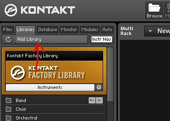
没错，非 Player 路线的音色库就不能用 Add Library 入库了，当然也不会出现在壁纸列表里。但是，无需注册验证，直接在 Files 页面中打开 NKI 就可以使用了！说实话，用正版的“康大哥”和音色库时，注册验证有时是挺烦人的。

看官莫急，上面讲的是最最基础的加载音色库方法，确实没什么新鲜的。我敢说这种方法绝对是大多数童鞋们使用的唯一加载方法。当你手中有一大堆音色库乱糟糟地堆在一个文件夹里，又有无数开发商发过来的Update 更新包，再加上无数次害怕硬盘挂掉和升级覆盖错文件的备份时，你就真得花一下午把所有音色库都分类、分文件夹整理好了；尤其是一些小厂商，pdf、壁纸（这个不是说 Libraries 页面里的壁纸，是乐器GUI的背景文件）、乐器文件都堆在音色库根目录下，看着也眼疼T^T。我推荐的文件夹结构如图。

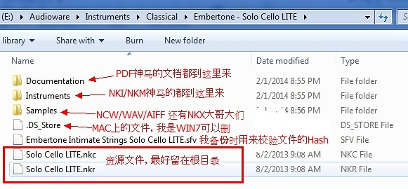
有时，在重新架构了文件夹后打开乐器文件时会产生 Sample Missing（丢失采样）的错误，这可能是因为 NKI 或 NKM 和采样的相对结构发生了改变。没关系，在本文的第三弹中介绍解决方法。（好吧，先睹为快，就是用错误窗口底下那几个按钮定位采样文件们。一般是用右边的 Browser for Folder。）

### 快速加载

嗯，文件夹神马的都整好了吧？看着清爽多了吧？找要用的开发商预置（Preset）乐器文件快多了吧？我的文章到此结束了吧？错！这算什么妙招窍门啊，当然还有更好的加载方法，先说一个—— Quick Load（快速加载）功能！点击“康大哥”上面那排按钮中的“Quick”按钮，将出现如图窗口~

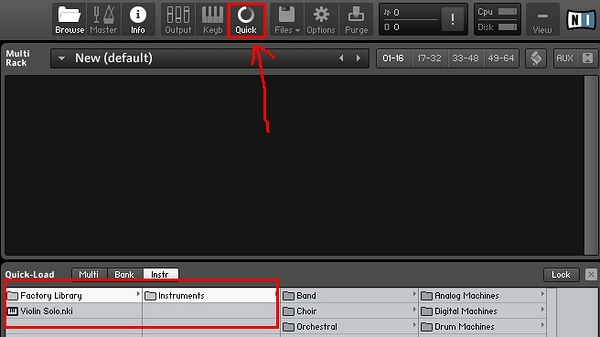

现在，把 NKI 和 NKM 拽进来吧。其实，整个把文件夹拽过来也行。我的做法是先把最常用的那几个 NKI 单独拽进来，然后再把常用的音色库整个文件夹拽进来。这样，我也可以同时在最高级的目录下看到最常用的预置了。哦对了，我们还可以对 Quick Load 窗口里的文件夹重命名的！放心，只是 Kontakt 内部数据库的修改，不会影响你硬盘上那个文件夹的物理名称~   

### 掌握“数据库”

还有个超爽的工具就是传说中的“数据库”（Database）了。这个工具在搜索、加载想要的乐器时非常的方便，但是我敢打赌知道并使用它的人极少。点一下图中“资源管理器”上面的“ Database ”切换到数据库页面，然后点击下面的“ DB Options ”。放心，这个数据库比 Oracle，MySQL 好学多了~

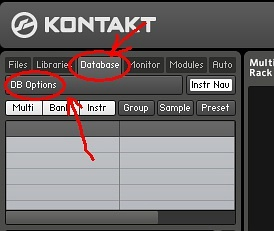
在这里你就可以定义想要纳入数据库的音色库了。加入几个文件夹，点下 Update，然后关掉对话框。

假如你想搜个东西，比如说原厂库（Kontakt Factory）的 VSL Violin Solo，直接在底下输入“Violin”，然后就……粗线啦！如果你想消磨大把的空余时间，那最适合的肯定是手工从“Files”页面下点开一个个文件夹这样来找（权当娱乐了…）。当然了，你也可以用上面说的“Quick Load”功能来进行搜索 B-)

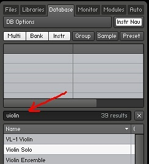
瞄到搜索结果双击或者直接拽过来到右边的空白（好吧，是“空黑”）部分就 OK。嗯……假如你还想再吊一点儿（再无聊一点儿..），你还可以选中那个想要的搜索结果，右键，“Edit”~ 咳咳，你可以自定义那个乐器文件的标签（Tag）啦！你现在可以把 Violin Solo 分类（Type）改成 Piano/Keys，音色（Timbre）改成Metallic……

值得注意的是，有很多音色库（大多是第三方，即非 NI 的）是没有预先打过标签的。没错，要是让用户手工一个一个加，还是有点过分……不过通过标签搜索只是数据库的一种“调教”方法，别忘了开始时我是直接打了Violin去搜索的。尤其是挑选管弦乐演奏技法时，面对一个文件夹里满眼只有细微差别的 NKI 们，这一招简直就真是拯救世界了!

### 硬件配置

- CPU：官方的最低配置要求——酷睿2或速龙64...差不多是七八年前的配置。如果用着最简单的乐器、开着最小的复音（Polyphony），这样的 CPU 绰绰有余。高中时我曾用 Atom N450 的上网本挂 ASIO4ALL 编曲，而且瓶颈在硬盘而不在 CPU。

  当然，那些先进的、内置一堆效果器、KSP Script 脚本长达万行的音色，得用 i3 或 i5 才能跑起来。CPU 跑不动会导致各种爆音，因为 CPU 无法实时处理音频信号。有时一个音色只有 100MB，但要进行复杂的物理建模，CPU 占用并不低于一个 10GB 的巨无霸音色。  

- 内存：官方推荐 4GB，至少 2GB。但光开机打开工作站，挂个 Kontakt 什么都不加，也占 1GB 了，但 Kontakt 默认仅把每个采样的一小部分加到内存，到了要用时才从硬盘读取，这种技术叫“硬盘直读”（DFD：Direct-from-Disk）。但内存越大，可以同时挂的乐器越多。而且如果有 32、64GB 内存，甚至可以直接关掉 DFD。

- 硬盘：程序本身不大，完整安装 600MB 左右，精简到只剩程序也就 10MB 左右，但音色可以很大，要是常用的音色动辄几十 GB

  * 最好把它们放在不同的硬盘（而不是同一硬盘的不同分区），因此硬盘越多，带宽越大。若采用 SSD 固态硬盘，不仅音色加载快，直读硬盘时爆音的几率也小。因此硬盘速度快时可以把 DFD 调大点，节省内存；土豪可以多买几块 SSD，一块装系统和软件，其他可放常用的音色库。
  * 可以移除不用的采样（如不同的麦克风位）

- 音频接口/专业声卡：Mac 内置声卡不错，但 PC 大多是 Realtek 板载声卡，因此如果要用虚拟乐器，最好考虑一个千元入门音频接口，绝对秒杀 Realtek + ASIO4ALL，并且更重要的是专业卡的驱动比民用卡稳定、崩溃的几率小。在同一延迟（Latency）下，声卡越好越不卡。好声卡的延迟还可以调得越小（方法：宿主里面有 Audio Option、Audio Device 等选项，延迟就是播放前缓冲（Buffer）的采样（Sample）个数（此采样非音色的“采样”））  

### DFD（硬盘直读）

可设置为全局有效，也可针对单个乐器设置。全局设置的话，如图打开“Options”，切换到“Memory”，选上 “Override Instrument’s preload size”，拖动滑竿来改变 DFD 预载量（Preload Size）。预载量越低，用到的内存越少，但要求的 CPU 运算更多。预载量高则相反——牺牲内存，解放 CPU 和硬盘。

要是用到的音色不多，却都是很长的采样，比如说钢琴（一个采样几十秒），DFD 预载越大，效率就越高。如果加载的是多话筒拾音的、20个力度分层的、N个同音替换（Round Robin）的打击乐采样库，这时如果内存不大，也会吃不消，因为每个采样都要耗掉一点内存。这时全局设置没有什么优势，可以考虑针对单个乐器进行设置。

点开扳手图标，点击“Instrument Options”，切换到 DFD 页面。

如果 CPU 和硬盘都很慢，需要注意这里设置是实时的！一旦松开鼠标（就算从默认的 60KB 拿鼠标拽了拽又回到 60KB）乐器就会重新加载！还有，要是之前选了全局设置的“Override”，就没法给每个乐器单独设置预载量了，被“覆盖”了嘛。但有一招可以让你“肆意”地调教 DFD，警告：进行以下操作前，一定要把乐器文件 NKI 或 NKM 备份一遍！

通常一个 NKI 由一或多个“组”（Group）组成，每个组又有若干个“域”（Zone）用来盛放采样与相关信息（比如力度、音高）。很多庞大的音色库有上百个条理分明的组，每个组都有精细的名称（一般由采样性质进行归类），比如同为拨奏（Pizzicato）、断奏（Staccato）。通常不小心摸过组设定、又不太懂的童鞋都悲剧地让乐器各种不正常了，但现在有小编指导又有备份，应该没问题！小编要教大家完全关掉 DFD、而不是调到最小的 6KB！

如图点开扳手，打开组编辑器（Group Editor），依次把红框的“DFD”改为“Sampler”，然后整个组的采样就统统跑到内存里啦！如果你手上的是刚才我说的采样又多又小的打击乐器，使用“Sampler”的内存消耗还真的大不了多少！

警告：如果那个组原来的“Source”模式不是 DFD，而是什么“Time Machine Pro”的就不要随便改动！一是他们本身就把采样全加载到内存了，相当于“Sampler”的高级扩展版；二是在脚本里可能会有调用，改了就会出现各种奇葩的问题！

### 巧用“清除大师”

实用的清除内存工具——无处不在的“Purge”！可以把 Kontakt 在全局或对某个乐器调用的内存完全释放。

如图，上面的大按钮是全局清理，下面的是单独乐器释放。在你内存即将告罄时，它会成为维护世界和平的救星！其实“清除”不是永久的，点了“Purge All Samples”后虽然下面的加载框变红，但你还可以弹几个音试试，有延迟、有爆音但可以玩起来（假设你可忍受）！此时“康大哥”只是读取加载你刚才弹过的调用的那些采样。

聪明的童鞋是否想到另一种玩法？对，如果你和高中的我一样用上网本来编曲，就可以先用效果差但不耗资源的虚拟乐器把音序器里的 MIDI 写好，然后替换打开“康大哥”开始加载豪华乐器——在加载还没完成时就“Purge”。现在可以回放啦！对，延迟、爆音破音不能忍...嗯，没关系，等等完成一遍回放后，待 Kontakt 把只有这回要用到的采样加载后，再回放并导出。

如果内存尚足，只是想把内存里没用的东西掏出来，那还可以这样做——使用“Purge”的“标记”（Marker）功能。现在把光标定位到整个编曲工程的起点，点击菜单里的“Reset Markers”，然后回放整个工程，回放结束后，再点击“Update Sample Pool”。哗！有木有感觉原来 Kontakt 霸占着不用的内存现在掉了一地？

### 优化 CPU 利用率

除了上面说的，还有N方面会影响 Kontakt 和处理器间的和谐关系。假设你的电脑不是单核（好吧 N450 上网本党们可以跳过啦），我们就可以瞧瞧“康大哥”的引擎设置了。点开上部齿轮“Options”按钮，然后点开 Engine 页面。

CPU 过载保护（CPU overload protection）：可防爆音破音，原理就是预先限制复音数。点开左边的下拉菜单可以选择这个掉复音的规则是否严格。目前我没开，因为我不跑什么大工程，童鞋们可以自己斟酌~

多处理器支持（Multiprocessor support）：这不废话吗？我这16核志强（Xeon）就是为多任务处理而生的！看官淡定...在 Kontakt 的独立模式把您的16核都挂上是必须的，但作为插件在运行时，有时还真说不定——大多数工作站都有自己的多线程算法，很可能会和“康大哥”算法冲突。如果你开多线程感觉还不如单线程快，就得把设置都试试：

- Kontakt multicore 开、宿主 multicore 关
- Kontakt multicore 关、宿主 multicore 开
- Kontakt multicore 开、宿主 multicore 开
- Kontakt multicore 关、宿主 multicore 关

绝对有最适合你的方法。怎么测试？我通常在 Kontakt 挂一个音色库，踩着延音踏板拿整条胳膊快速按压整个MIDI键盘——虽然不好听，但复音数绝对足以测试哪种设置最优！另外，有时加载一个 Kontakt 还不如多挂几个 Kontakt——比如一个 Kontakt 加载4个 NKI，可能不如挂4个 Kontakt 各加载一个 NKI 好。取决于系统配置的，请用实践检验真理~

### 桥接“康大哥”

就算电脑与音频接口超豪华，有时 Kontakt 还是会出问题，一个崩溃让你整晚的努力灰飞烟灭。大家可能会责备宿主软件，但问题其实有时在于“桥接”（Bridge 或 Bridging）。它指的是在和宿主保持 MIDI 或音频信号沟通的情况下，在宿主外部运行某个插件，比如 Kontakt。如果你用的是64位操作系统，运行32位宿主软件，你可以通过桥接为 Kontakt 调用 4GB（32位程序的限制）以上内存。桥接的方法不止一种：（注意桥接后插件的 CPU 占用率可能会升高）

方案1：宿主软件自带

大多数宿主工作站现在都内置自己的桥接工具，比如奇葩的32位“水果”FL Studio，所有64位插件会被自动桥接。非64位的插件也有 VST“加壳”（VST Wrapper）桥接的选项。要桥接，先试试宿主自带的工具，好好读读说明手册。

方案2：神器 jBridge

大名鼎鼎的、既支持 Win 又支持 Mac（叫 jBridgeM）的桥接工具，可以生成加过“壳”的插件文件（Win 上就是 dll 了）。再在宿主软件里面加载这个插件，打开任务管理器就会发现插件实际上在另一个进程里运行，不像原生插件在宿主进程内部运行。官方有免费 Demo 版：[http://jstuff.wordpress.com/jbridge](https://jstuff.wordpress.com/jbridge)。

方案3：传说中的 Vienna Ensemble Pro （简称 VEP）

和顶级的维也纳交响音色库同一公司 VSL 出品。这款奇葩软件不光可用来桥接，VEP 简直相当于大半个宿主工作站，而且是跨平台、跨空间的——对，可以用 VEP 构建一个本地网络，比如一个 Mac OSX 的主机发送 MIDI 和其他控制信息，几个专门负责跑 Kontakt、VI 采样回放的 PC 接收指令，然后把音频信号发给另外一台 Mac 专门跑混响，加效果...唔，又是土豪们的豪华解决方案！（这个可没有“福利版”~）

官网地址：http://www.vsl.co.at/en/211/497/1685/1990/1680.htm

### 内置效果器

再提醒一遍，进行有关乐器的高危操作前，一定要把乐器文件 NKI 或 NKM 备份一遍
作为采样器，“康大哥”有个诱人的卖点——内置效果器又多又牛！如下图所见，各种混响 Reverb、均衡器 EQ、压缩器 Compressor、滤波器 Filter、瞬态控制器 Transient Master；各种吉他效果器（Distortion、Skreamer）...

先不讨论这些效果器的质量和操作，我们注重的是 CPU 利用率和性能~ 事实上，这方面我感觉并不太好，这些内置效果器占用的 CPU，比在宿主工作站里挂的专业插件们要高不少。这些效果器就是各种音色库广告里写到的 “本音色库内置各种吉他音箱、高端混响和 N段 EQ” 的秘密所在。顺手拿Orange Tree Samples 的 Strawberry 电吉他看看：

不仅 CPU 占用率高，在童鞋们不知道这些效果器存在时，肯定还会在这个 Kontakt 音轨上挂其他重复的效果器。要是这些效果器都挂在组效果（Group Insert Effects）、而不是乐器效果（Instrument Insert Effects）上就更不爽了！如果乐器有几百个组（Group），每个组都有个压缩，那相当于同时挂几百个压缩器...当然我没遇过这么傻的开发商...
快看图（标记改成绿的了），要是你真遇上傻乎乎的开发商，或者你还在用上网本...点上面的 “Edit All Groups” 把组全选上（大闲人可以一个一个打勾），再点击小方框左上角那个小 “B”，就可以把它们全 Bypass（旁通）屏蔽掉！

一般情况下，音色库的内置效果器会在“乐器效果器”上而不是“组”上。再看图， 如果不想用 Kontakt 自带的卷积混响（反正自己还要挂更好的混响），就在这里把它屏蔽掉！要是你铁了心不想用，直接方框右上角点 “x” 删除，再也不用见了~ 比较罕见的还有总线层次的效果器（Bus Insert FX），类似组和乐器层次，也可以旁通或者点叉的！

### 再谈如何节约内存

一、数据库瘦身：
还记得[《第一弹》](http://www.exound.com/modules/tutorials/view.article.php/article=186)中的搜索调用加载神器 “Database” ？神器虽好，可不要贪多哦~ 每每你往数据库添加一条记录，康大哥就会往你机子的内存里添那么一笔。如果你是音色收藏家，还把所有的音色都添加到数据库检索目录里，那...打开宿主挂上 Kontakt 不干别的，就可能多消耗上百 MB 内存~
看图，删掉（Remove）几个检索目录，最重要的一点——把上面第二个勾取消！真心没必要导入采样条目！这个选项只对定位丢失采样时有效！真心鸡肋！
二、最大复音量
嗯，大家都知道增大复音会让 CPU 更忙更累，但是你想过，增大复音还会占用更多的内存——即使你琴键都没挨一下吗？有图有真相，我们瞅瞅 Kontakt 的引擎监视器（Engine Monitor）~ 随便加个乐器，左上角换到监视器 “Monitor” 子页面，再换到引擎 “Engine” 页面，真相大白。（左图为改变复音前，右图为改变复音后，图片点击放大）

对于体积很小很简单的乐器，复音调节的差别可能不大。拿出来你的巨无霸们溜溜！——在乐器很复杂尤其是本身复音内存就很大时，仅仅减少几个复音，就可以省掉很多内存！比如说你要用的那个乐器是个复杂的采样合成器，但是主要充当 Pad 的作用，复音不超过4个——那就限制成4个！会有惊喜滴！

顺便给童鞋们说说 Kontakt 的内存使用都分配给谁家了，主要是四个大分类——

- 对象内存（Object Memory）分配给数据库和你已加载的乐器，包括加载到内存的除了采样的其他资源（GUI 界面背景）、还有乐器调用的模块占用内存（比如上面提到的内置效果器等，一般卷积混响占用较多）。
- 采样内存（Sample Memory）就是每个乐器实际加载的采样（或者其片段）使用的内存。采样越多、时间越长、采样率越高，就用的越多。同时，乐器状态框本身显示的那个内存消耗就是这个，这个大家很熟悉吧？记住，这可不是所有的内存占用哦~
- 主复音内存（Voice Memory）最主要就是关系到上面说到的复音量产生的内存，不过也和你乐器调用的调制器（Modulator）、效果器有关。只有在有弹奏调用采样时，下面那个“Voice Memory Used”才会增多。
- 硬盘直读内存（DFD Voice Memory），弹奏时即时从硬盘调用采样占用的内存。

### CPU 分析模式

上面说了这么多，要是那些方法几乎都用了，Kontakt 还是卡，这如何是好？别担心，我们还有一招特别酷的：“CPU分析模式”（CPU Profiling Mode）。这个功能很简单——就在 “Engine” 子页面 “Restart Engine”（重启引擎）的 下面，点亮 “CPU Profiling Mode” 即可~

看上图，注意标记的部分，是不是哪个模块占用 CPU 多少一目了然了？现在再也不怕漏掉神马木有优化的啦~
再看下图，之前提过的神奇 Time Machine Pro 技术，这回知道它为什么是资源占用大户了吧？很多开发商都会在要应用 Time Machine Pro 或者 Time Machine（老版本）的乐器文件文件名上标注好 “TM Pro”、“TM” 等字样，就是为了提醒童鞋们 “该 NKI 将拖垮你的 CPU（尤其是高保真‘HQ’模式），慎用”！

### 批量重新保存

第一弹提到，文件夹结构改变后要是出现采样丢失，最常见的方法是“Browse for folder”（图右），定位采样所在的文件夹——一般都是把整个文件夹挪位而不是专门把里面几个采样挪出来，如果真这么做了就在定位一轮之后再定位别的文件夹...同样，NI 总是会给大闲人们另类的选择——可用“Browse for files”对丢失的采样逐个定位~
但要是文件夹最近有大规模改动，影响到几个音色库几百个 NKI / NKM 怎么办？真心一个个乐器定位？显然不是——批量重新保存！

第一步：永远都是备份备份再备份！尤其在批量重新保存这里，更改是立即生效的！
第二步：点开 Files 菜单，选择 Batch Resave，这时会弹出警告窗口，再选择警告的 “Yes”——你不需要预先加载乐器到 Kontakt！

第三步：在弹出的 Browse For Folder 对话框里，选择你要操作的所有 NKI/ NKM 乐器文件（而不是采样）所在的文件夹！
第四步：接下来会弹出窗口告诉你那些文件夹里乐器文件所有的采样丢失，对，是总和。在窗口下面记得一定选上“允许不同文件类型（Allow alternative file types）”，这样就会自动检查 AIFF、WAV 和 NCW 了。然后用 “Browse for folder” 定位所有丢失采样的位置，要是一遍定位没有解决，Kontakt 会再一遍遍问你，直到你跳过或问题解决。
第五步：那就...结束了！等“康大哥”吭哧吭哧把所有“重新保存”的活干完就没有了~ 终于可以愉快地玩耍啦~
对了，除了批量定位丢失的采样，批量重新保存往往还可以提升童鞋们加载乐器的时间，相当于针对你的文件系统进行优化。唯一的弊端就是可能会使老版本 Kontakt 无法加载——不过这也只是开发商担心的问题了，因为他们要尽量保证不喜欢更新的用户也能正常使用产品...所以用户们没事 Batch Resave 一下，也可以加快加载速度！

### 革命性的 NCW 采样压缩

2011年，NI 发布了 “NCW” 无损压缩格式（NI Compressed Waveform）。相比 WAV 或 AIFF，NCW 可以节约童鞋们 50% 的硬盘空间！不仅节约硬盘空间，有时还可以在相同条件下节约内存！现在放在铺子里卖的音色库基本都使用 NCW 格式作为采样了（走 Player 路线的还是会打包成 NKX，正常情况老百姓是摸不到采样的）。
是不是想赶紧把手上 WAV 格式的采样转成 NCW？我们拿 Orchestal Tools 的 Berlin Strings 开刀啦~

- 第零步：备份！！！
- 第一步：点击 “Files” 菜单，选择 “Collect Samples / Batch Compress”。同样，不需要事先加载乐器文件。
- 第二步：在对话框的“源文件夹（Source Folder）”选择你想压缩的乐器文件所在目录。注意：要是有采样丢失的话 Kontakt 这回是不会问你的，所以 NI 也推荐先批量重新保存一下，确保不会出错再来压缩。
- 第三步：在“目的文件夹（Destination Folder）”选择目的地，你可以随便取个名字。在压缩结束后，你会在那个文件夹找到乐器文件和对应的 NCW 采样。
- 第四步：强烈建议选上“采集采样并创建新目的文件夹（Collect Samples and create new destination folder）”！否则原乐器文件的采样要是在你之前“源文件夹”之外就没法压缩啦！同时目的采样格式（Destination Sample Format）别忘了选上“无损压缩 NCW（Lossless compressed NCW）”！
- 第五步：点击“转换（Convert）”！然后就是漫长的等待了...你可以去喝杯茶或者陪朋友吃顿饭~
- 第六步：要是第四步你照我说的选上了“采集采样并创建新目的文件夹”，那么结束后你的目的文件夹就会有两个子文件夹——“Collected Samples” 和 “Instruments”。顾名思义，前者是收集的采样，后者是乐器文件~
  现在可以随意发配你压缩过的音色库了吧？别急！如果你压缩的音色库是某些大牌开发商生产的，你很可能会在这里丢失其他资源——比如 NKA 预置，NKR 资源包里面的图片或用于卷积混响、模拟吉他音箱的 Impulse Response，某些外置的MIDI等等...千万别压缩完就把源文件夹删了！我的做法是在一切看起来没有问题之后再做一次 “Batch Resave”，再加一次保险~

没错，发现了吧？你也可以用这个方法把 NCW 转回无压缩格式，只需在第四步目的采样格式选为 WAV/ AIFF 即可~


综合音源：Hypersonic（古董）、巨人、Komplete（Native Instruments Komplete Version Comparison 2.0 https://docs.google.com/spreadsheets/d/1FuwkqEc7CqMwjRVjgcy2KhJlkVl3jTT3Ze1RsVFvzC4/edit#gid=427928755）

乐器技巧：有些是直接从采样中调用，有些是通过MIDI控制器演奏技巧

学习时

* 针对乐器或乐器组（如各种钢琴都属于键盘组）
* 主要学习该乐器能力与特性：如能否演奏和声，如果可以的话，是更适合柱式和弦还是分解和弦。能否演奏单音旋律，如果能，是更适合缓慢的旋律还是快速的旋律，单音能否延续。节奏表现力的能力
* 主要学习演奏技巧

### 信号路由

What：Kontakt是一个采样器、乐器机架着 管理器类音源，它允许我们加载最多64个乐器，当我们在一个机架内使用多个乐器时，需要规划各个音色的由谁触发（输入MIDI信号)，由谁接收声音(输出音频信号)，这个过程我们可以称之为「信号路由」。

Why：为什么我们要学这个？利用好这个特性可以极大的节约电脑的CPU占用，避免多乐器写作导致工程崩溃。可以用于给鼓音源导出各个鼓件的分轨，方便后续混音工作的开展。可以方便弦乐写作时的操作。

How-如何实现？基本逻辑：
  1.  给不同的乐器分配不同的MIDI输入信号
  2. 给不同的乐器分配不同的音频输出信号
  3. 让Kontakt的输出与宿主的音频轨道——对应起来


## MIDI修饰

### 力度控制器

力度分为0~127个等级

常用：P~F

3P = 0~15

2P=16~31

1P=32~47

MP=48~63

MF=64~79

F=80~96

FF=97~111

FFF=112~127

控制器：选中要修改的音符，用直线工具调整力度（画线来统一力度）？、设置参数，输入时指定力度

键盘卷帘上，音符的颜色越亮，则说明力度越大

### 呼吸控制器

### 延音控制器（延音踏板）

由于手指离开琴键以后，声音就会消失。因此对于要求音连贯的旋律，需要使用延音踏板。尤其是和声性的乐器音色中（钢琴、吉他）。

种类

* 音后踏板（最常用）。手指触键以后，然后踩踏板
* 音前踏板。先踩踏板，然后触键
* 踏板和琴键同时下落，手指离开琴键的同时，踏板松开

对于钢琴而言，一般一个小节一个踏板

吉他延音踏板的运用：也需要踏板是因为琴弦在拨动后还在振动与减弱。注意如果A音与B音同时在一根弦上

弦乐踏板的运用：为了让弦乐的音符紧密连接，防止旋律突然断裂。虽然可以用鼠标将音符紧密对齐，但在MIDI演奏时，音符间必然有间隔

#### 

### 弯音控制器（音高控制器、Pitchbend）

大部分宿主默认音高最大调整范围在大二度内（即变化范围是：-大二度~+大二度）。

音高绝对范围的数值表示：-8192~8191。如果对应的度发生了变化，该数值也不会发生变化

控制音符在某一个范围内升高或降低音高，

改变音高，多用于合成器、弦乐连奏、管乐连奏、吉他的击勾弦、滑音技巧

滑音（最大值通常由“Bend up/down”控制）

通常要有节制地使用弯音，只针对乐器中个别几个音做弯音

控制时需注意：滑音前后滑动速度的快慢（通常渐入快出。节奏）、滑音的范围、滑音的时长（节奏）

一般吉他滑二度音

* 音前滑音
* 同时滑音
* 音后滑音


### 颤音控制器（Modulation、tremolo）

给音符加入颤音。一般是对时值比较长的音符，一般用于独奏的乐器当中

控制元素：颤音速度、颤音幅度

### 滑音控制器

## **效果器插件的分类**

首先需要说明的是，目前市面上多数音源插件，都自带了效果器功能，可以对音源插件自己的声音做一些效果处理（多数是比较简单的处理）。但是在发行级作品的完整制作流程当中，尤其是混音/母带环节，还是必须要有专门的效果器插件作为应用工具。以下介绍的就是专门的效果器插件。

概括来说，效果器的给我们带来的作用包括两个方面：**特殊处理**和**音频优化**。

效果器的这两处作用不在于具体插件的不同，而在于使用方式的不同。

同一个EQ（均衡器）插件，将音乐频段调整至平衡合理，就是**音频优化**；将音乐频段扭曲得夸张奇特，就是**特殊处理**。

又比如我们录制了一段正常的讲话，可以通过效果器，把这段讲话变成喇叭喊话效果、打电话效果、空间反射效果、机器人说话效果等等，这些是进行**特殊处理**的思路。同时，而我们也可以让环境噪音减少、让声音变得更具有磁性、让音量保持平均不会忽小忽大等等，这些则属于**音频优化**的做法。

广义上，大家所说的“母带”工作，其实也是运用效果器对整首音乐进行统一音频优化，让它变得好听，变得迎合大众听觉审美或符合音乐工作者的艺术倾向。

无论是特殊处理还是音频优化，根据具体功能，常见的效果器包括以下几类：

1） 频段处理：均衡器（Equalizer）/滤波器（Filter）

2） 动态处理：压缩器（Compressor）/扩展器（Expander）/限制器（Limiter）及门限器（Gate）

3） 时间处理：混响效果器（Reverb）/延时效果器（Delay）

4） 声像处理：声像器（Panner）/立体声扩展效果器

5） 调制处理：相位效果器（Phaser）/合唱效果器（Chorus）/镶边效果器（Flanger）/颤音效果器（Vibrato）/震音效果器（Tremolo），等……

6） 失真处理：失真效果器（Drive）/过载效果器（OverDrive），等……

7） 音高处理：调节声音的音高

8） 其他针对性处理：人声处理器，等……

9） 检查分析：有些“效果器”专用于检测和反馈音频的特征状态（但无法直接改变声音），从而辅助指导我们运用具体的效果器。

尚存在陌生的知识点没有关系，我们可以在装上效果器插件后逐个试验，用耳朵来获取最直接的变化。


## **效果器插件的选择**

大师都有自己用的习惯的东西，很多是多年工作的累积，他用了好多年了用的顺手、也了解特性、功能也摸透了，做东西做的很好很快，但换成其他人可能就普遍用不顺手，会更倾向用比较新一点的东西，技术会更成熟、更人性化

大师通常不会以综合音源为主，基本上术业有专攻，单一乐器独立音源往往会比同时代的综合音源做的更好，综合音源一般用于补充一些小众的音色或者不重要的音色

优秀的效果器插件套装，一般都能包含上面提到的多数功能。其中可能包含针对单个效果的插件，也包含能同时处理多个效果的复合型插件。使用插件套装是目前比较为新生代音乐人所推崇的工作方式。

当下最推荐的2款综合插件套装是：

l **Waves**，大而全，并复刻了各种传统硬件效果器的模拟效果器，一套就能满足绝大多数编曲混音要求。

l **Fabfilter**，优而精，以全图形化展示和完全灵活可控的自由度为核心特点，新手可以用它来练习听力，老手可以用它来随心所欲。

此外，还有一些专攻特定领域的插件套装，如：

l **Audio Ease Altiverb**，纯混响效果器，集成了最全的真实混响环境。

l **Native Instruments Guitar Rig**，主要用于吉他效果，为电吉他注入生命力。

l **Antares Auto-Tune Bundle**，主要用于人声音高的特殊处理，电音作品常客。

l **iZotope Ozone**，主要用于后期混音/母带处理，在软混音插件中数一数二。


## **安装音频插件的准备**

介绍完了音源和效果器插件，我们就可以开始选购和安装啦。那么，在安装插件之前，我们需要做什么准备呢？

关键是需要准备个**好硬盘**。

CPU、内存、声卡等固然也重要，但这些属于音乐制作的整体硬性条件，单从插件角度而言，硬盘是其主要运行瓶颈，包括：

**1）** **硬盘容量。**

成千上万种插件虽然大小不等，但优质插件往往伴随着较大的硬盘占用空间，一套高品质音源插件动不动就几十GB、上百GB，准备一个大容量硬盘方能有备无患。

**2）** **硬盘速度。**

硬盘速度的影响在于，当我们在宿主软件中打开插件时，系统会先将插件加载至电脑内存中，加载完才可以开始用。如果硬盘读写速度较慢，那么加载到内存就会耗费更多的时间，这会间接影响工作效率和心情。因此硬盘速度也不可忽视，有条件的同学可以优先考虑使用固态硬盘。


## **如何更好地选购插件**

电脑硬件也准备好了，对插件也多少有些认识了，可是插件千千万，尽管本文已做出可能是全网最靠谱的精挑细选，但基于时间和费用成本考量，还是未必能一次性全部拿下。这时，应当如何做优先选择呢？

笔者提供几个思路：

1） 结合所需，优先选择更符合自己当前音乐风格的插件。

2） 这些插件都有官网，官网都有更详细的介绍和视听片段，通过观看官方宣传视频或视听官方音频，我们可以对当下插件有一个初步的整体印象，帮助我们进一步考究。

3） 被推荐的插件很多都是系列款，我们可以挑选其中一个先下载试用，如果好用，那么同系列的其他产品也会有同样的水准、相近的设计。

4） 各大音频厂商会在“黑色星期五”进行促销活动，可予以关注，能更便宜地购买到正版。

5） 各大音频厂商会推出“优惠打包套装”，跟炸鸡全家桶一个意思，如果已经决定了“小孩子才做选择，我全都要”，那么可以直接购买打包套装。


## **如何更好地使用插件**

最后一个问题是，当我们把插件下载好、安装好、甚至购买好、打开它，就会发现里面多数都是全英文，可以动的按键、旋钮、参数似乎也特别多，一时半会儿真不太能看懂。

怎么办？

不用怕。针对音频插件的上手，这里笔者也总结了几个科学有效学习方法，供大家参考：

1） 阅读官方说明书。

大厂出的插件，一般都会附带一份官方说明书，PDF格式，只要有PDF阅读器就能打开来看。官方说明书一般可以在插件安装目录下找到，或者在插件的应用界面中的某个角落打开。

官方说明书是最标准的学习方法，没有之一，可惜容易被多数人忽略。完整阅读官方说明书是不错过任何插件使用细节的唯一方法，不仅能让你充分发挥插件的效用、感受物超所值，还能在紧凑而没有多余废话的学习中快速成长，激发兴趣。

至于英文不太好的同学，也没有关系，打开翻译网站，复制粘贴我最行。

2） 找相关教学视频。

在音乐人网、某站和某宝上面，以及其他音乐制作交流网站上，我们不难找到主流插件的教学视频。这些视频虽然大多不是原厂官方出品，但至少比自己纯零摸索要来得更直观和抓重点，并且许多是中文教程。看视频的额外好处是，通过讲解，不仅能掌握插件本身的基础用法，还能通过作者的表述、进入作者的思维模式，学习或借鉴到一些编曲与混音的实战方法、甚至宿主软件的操作方法等等，可谓一举多得。

3） 问人。

别怕问，交流是能够互相促进的。主动认识更多音乐人朋友，加一些友善健康的音乐人群，有问题就抛出，往往能获得不同角度的回答。我们什么也没有损失，反而能让人看到在未来的进步。

4） 实操。

多使用音频插件来上场实操，其更大的意义不在于学习未知，而在于牢记已知。插件虽多，但对于性质相近的插件，它们的用法玩法都是有共通之处的，随着经验积累，便能愈发感受到知识财富所带来的复利增长。


差分环绕

哈斯效应

方法是通过左右声道时间延迟较短时间来使人耳在接收音频时更自然，更符合结构学和外界感知。

原理及解释编辑
在自然状态下，人耳在接收声波时，因为两耳距离位置不同，所以接收的时间也不同，两只耳朵带给我们立体的感觉，但在用耳机时，这种感觉是只存在于脑中的，差分环绕利用延迟输出的方法，模拟了自然状态，人耳接收声波时间差在15ms~30ms内，因为有时间差，所以可以辨别声音来源，从而获得方向感，所以这就解释了为什么差分技术会比别的环绕技术效果更震撼，更具有真实感，因为这是我们自我形成的感觉，就和3D技术一样，当两眼分别接收独立影像时，立体感就出来了，差分也就是利用了这个原理。偏音现象也就是因为这个方法产生的，因为会具有方向感，所以人们可以感觉到耳机内人声的偏向，通常是偏左，这是一个无法解决的技术难题，如果不改革差分环绕技术，这个问题将一直存在。

注意：差分环绕听久了之后，有段时间，会觉得不开这个听不下去，且耳朵会偏声，所以还是不要一次听太久的好，需要进行适当休息。

kontakt

kontakt的音色不需要安装，可以直接用kontakt打开

格式：nicnt、nkc、nkx、nki、nkr

NICNT files are not used to load a library into Kontakt, they are basically like an authorization file that allows the library to be shown in the libraries tab and allow to be used with the free Kontakt player. To actually load the library, you use .NKI files.

在专门音频领域，很少用Volume音量来描述电平，Volume更多是用来测量气体和液体，当我们描述人耳感知到的响度时，一般还是会用Level电平

频谱右边的纵坐标显示的就是信号电平（或者说振幅（Amplitude））。振幅越高，声音就越大。振幅越低，声音就越小

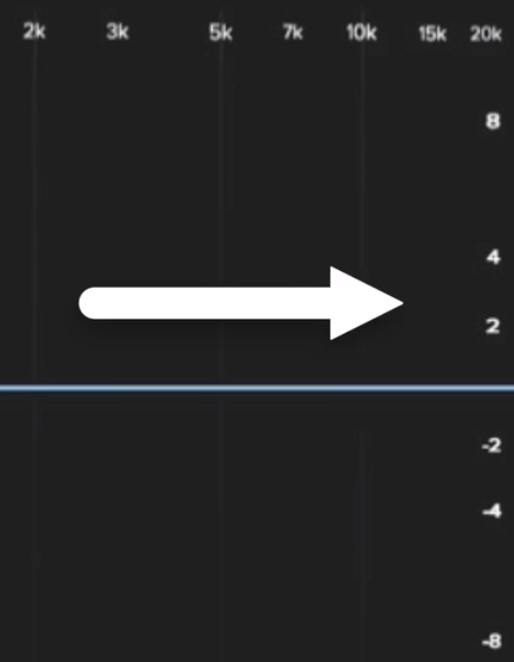

用EQ去增强某个特定频率，这个动作被称作Boost提升。当降低某个频率时，称之为Cut削减。增幅变化的单位是dB（分贝）

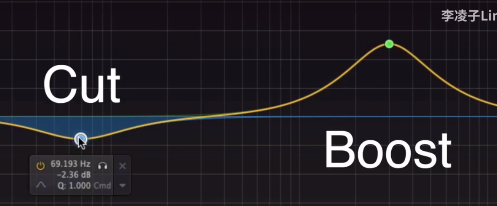

例子：如果为-3 dBFS，则表明距离失真还有-3dB的动态余量

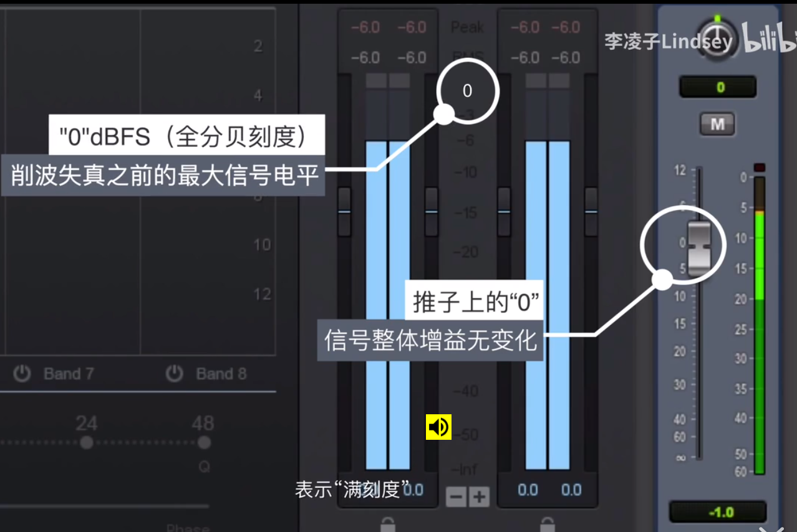

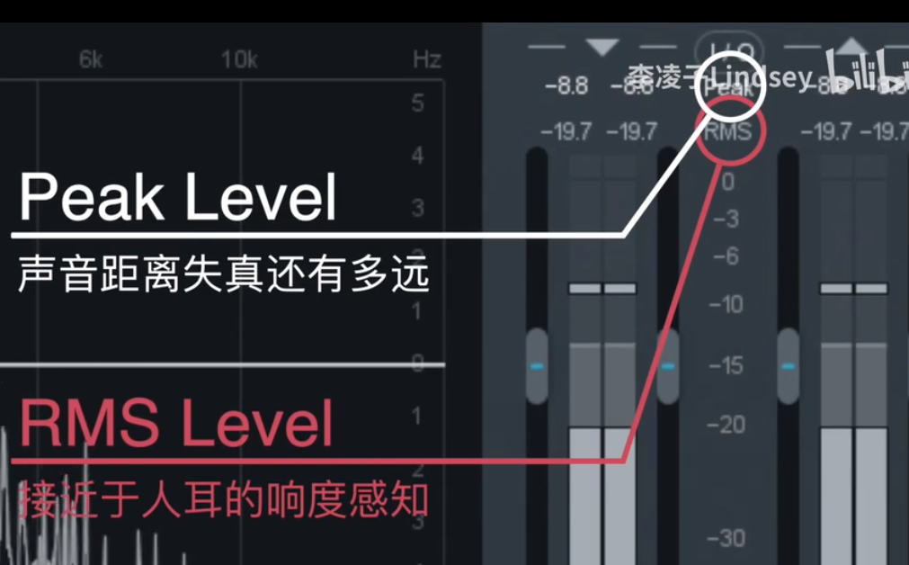

## 效果器名称中英文对照大全

Arpache5【琶音效果器】

Arpache SX【琶音效果器】

Compress【压缩效果器】用于排除电吉他信号在传输中出现的过载或不良瞬变发生，它与失真器不同的是提供不失真的多种弹奏音色，并能延长音符或缩短音符的时值，可产生打击音或长延音。

Density【密度效果器】

MicroTuner【音调微调器】

MidiEcho【回音效果器】

Midi控制

Note 2cc【音符控制器效果器】

Quantizer【量化MIDI效果器】

Step Designer【步进音序器】

Trackcontrol【轨道控制效果器】

Track FX【轨道效果效果器】

Transformer【逻辑处理效果器】

常用的效果器有均衡（EQ）、混响（REVERB）、压缩（COMPRESSOR）、延时（DELAY）、合唱（CHORUS）、移相（PHASER）

Dely【延时效果器】

TC Compressor DeEsser【压缩、消唇齿音效果器】

TC Filtrator【滤波效果器】

TCGraphic EQ【图形均衡效果器】

TC Limiter【限制效果器】

TC Native Reverb Plus【混响效果器】

[HALL大厅混响效果ROOM房间混响效果PLATE铁板混响效果（也译做金属板）]

TC Sonic Destructor【声音处理效果器】

TC Parametric EQ【参数均衡效果器】

AutoPan【声像效果器】

Chorus【合唱效果器】

Comp【压缩效果器】

Flanger【镶边效果器】

NoiseGate【噪声门效果器】

OptiEQ【均衡效果器】

OptiVerb【混响效果器】

Phaser【移相效果器】

ResoBeat共【鸣滤波效果器】

RingBeat【铃音调制效果器】

Stereo Delay【延迟效果器】

【T-RACKS母带处理器】

Clipper【修减效果器】

Compressor【压缩效果器】

EQ【均衡效果器】

Limiter【限制效果器】

【Blue DynamicsPack蓝色电子管系列插件包】

BT BrickWall BW2S【限制效果器】

Chorus CN2S【合唱效果器】

Compressor CP2S【压缩效果器】

Desser DS2S【消唇齿音效果器】

Driver DR2S【过载效果器】（过载是失真的一种）

Equalizer PEQ2A【均衡效果器】

GateLimiter GL201【门限效果器】

Limiter LM2S【限制效果器】

Long Delay LE【延迟效果器】

OilcanEcho TLE2S【回声效果器】

Phaser PH2S【移相效果器】

Stereo Imager【立体声扩展效果器】（可以把声场拉宽后收紧，通常用在音乐最后，把整首歌的声场做的宽广一些）

【顶级音频处理效果插件包UltraFunk】

Compreeeor R3【压缩效果器】

DelayR3【延迟效果器】

Equalizer R3【均衡效果器】

Gate R3【门限效果器】

Modulator R3【调制效果器】

Multiband R3【多段压缩效果器】

Phase R3【相位效果器】

Reverb R3【混响效果器】

Surround R3【环绕声效】

Wahwah R3【哇音效果器】

【AKAIVST效果插件】

D.C.Vocoder【声音合成效果器】

DecaBuddy【和声生成效果器】

PitchRight【修正效果器】

QuadComp【多段压缩效果器】

Rotator【旋转模拟效果器】

【GRM Tools效果器插件包】

BandPass【带通效果器】（用来祛除特定频率范围之外的一切频率）

Comb【梳状滤波效果器】

Delays【延迟效果器】

Doppler【多普勒效果器】

Freeze【冻结效果器】

PitchAccum【音高积聚效果器】

Reson【共振效果器】

Shuffing【搅拌效果器】

【WAVES插件包】

C1 COMP【压缩效果器】

DeEsser【消唇齿音效果器】

Doppler【多普勒声效变速效果器】

Enigma【英格吗迷幻效果器】

IDR【数码分辨率增加效果器】

IR1 Efficient【采样混响效果器】

L2【母带限制器】

L3【多段母带限制器】

LinEq Broadband【六段均衡器】

MaxxBass【低音增强效果器】

MetaFlanger【镶边效果器】

MondoMod【空间回旋效果器】

Morphoder【卷积变音效果器】

PAZ Analyzer【频谱图形效果器】

Q10-Paragraphic EQ【十段均衡效果器】

RComp【文艺复兴插件包里的压缩效果器】

RVox【文艺复兴插件包里的人声自动压缩器】

S1-Imager【立体声增强效果器】

SoundShifter【变调效果器】

SuperTap【打点延迟效果器】

TransX Wide【频段修整效果器】

UltraPitch【人声变调效果器】

Guitar Amp【吉他效果器】

Guitar Tyner【吉他调音器】

SSL Channel【均衡效果器】

SSL Come【压缩效果器】

SSL EQ【均衡效果器】

Stomp 6【吉他单块的效果器】

Dsound【吉他效果器】[包含了Chorus, Flanger,Autowah, Compressor, Noise Gate, EQ, Reverb, BPM Delay, Overdrive, Distortion,Auto Pan, Phaser和Tremolo效果单块]

Rock Amp Legends【吉他音箱模拟效果器插件】

Revalver【软吉他效果器】

Guitar Rig【吉他效果器插件】

Antares【麦克风模拟效果器插件】

SFX Machine RT【综合的效果器插件】[包含了大量的效果：颤音、震音、和声、延迟、混响、镶边等等效果，预置参数丰富，调节界面一目了然，非常好用的一个效果器插件。]

RaySpace【混响效果器插件】[可以根据你设定的3D环境模式来对声音进行混响处理，你只要设定好房间的围墙和高度以及声源和听者的位置，它就可以自动产生模拟出的混响效果。]

ntares Tube【电子管模拟VST插件】[电子管模拟效果器可以给你的音频加上温暖的电子管效果，Antarestube有两个电子管模式，可以为人声，吉他，小号，弦乐等各种声音信号增加传统电子管前置放大的温暖效果，起到美化声音的作用]

OrangeVocoder【人声效果处理器插件】[可以产生时下流行的电子人声效果，是一款模仿机器人声音的效果器插件。把自己的声音做成类似机器人的效果来唱歌那一定很好玩啊。]

Tuner【校音器插件】[有了它，调音可就方便了]

WizooVerbW2【混响效果器插件】

OhmBoyz【延迟效果器插件】

Auto-Tune【音高校正效果器】

BBE Sonic Maximizer【激励效果器插件】[它可以使高频段音质更加明亮，低频段音质更加丰满。]

Clone Ensemble【自动合唱效果器插件】[可以把独唱变成合唱，具体合唱的人数和男生还是女生都是可以调整的，这一下一个人也可以做出合唱的效果了。]


## General MIDI

General MIDI，简称GM，是MIDI的统一规格。GM patches中的patches指的是：一组预设的声音

GM仪器必须遵循以下关于乐器音色（program）以及控制事件（controller events）的惯例：

**音色转换事件（Program change events）**

以下的表单，列出各乐器音与与相应的音色编号（program change number）。

**旋律音色（Melodic sounds）**

| No.                                    | 英语                     | 中文                                                      |                                                              |
| -------------------------------------- | ------------------------ | --------------------------------------------------------- | ------------------------------------------------------------ |
| Piano（钢 琴）                         |                          |                                                           |                                                              |
| 1                                      | Acoustic Grand Piano     | 平台钢琴                                                  |                                                              |
| 2                                      | Bright Acoustic Piano    | 亮音钢琴                                                  |                                                              |
| 3                                      | Electric Grand Piano     | 电子钢琴                                                  |                                                              |
| 4                                      | Honky-tonk Piano         | 叮当琴（酒吧钢琴）                                        |                                                              |
| 5                                      | Electric Piano 1         | 电子琴 1                                                  |                                                              |
| 6                                      | Electric Piano 2         | 电子琴 2                                                  |                                                              |
| 7                                      | Harpsichord              | 羽管键琴、大键琴                                          | 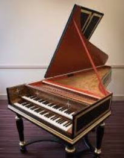 |
| 8                                      | Clavinet                 | 电子击弦古钢琴                                            |                                                              |
| Chromatic Percussion（半音阶打击乐器） |                          |                                                           |                                                              |
| 9                                      | Celesta                  | 金属片琴                                                  | 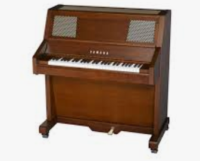 |
| 10                                     | Glockenspiel             | [钟琴](https://baike.baidu.com/item/钟琴)、钢片琴         | 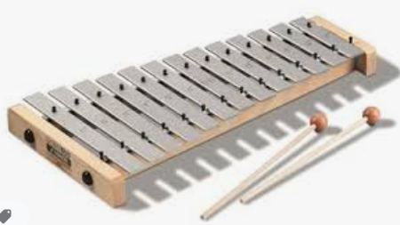 |
| 11                                     | Musical box              | [音乐盒](https://baike.baidu.com/item/音乐盒)、八音盒     |                                                              |
| 12                                     | Vibraphone               | [电颤琴](https://baike.baidu.com/item/电颤琴)             | 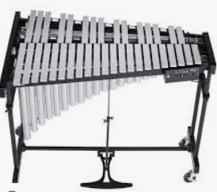 |
| 13                                     | Marimba                  | [马林巴琴](https://baike.baidu.com/item/马林巴琴)         | 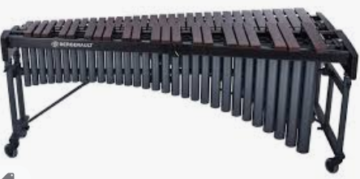 |
| 14                                     | Xylophone                | [木琴](https://baike.baidu.com/item/木琴)                 | 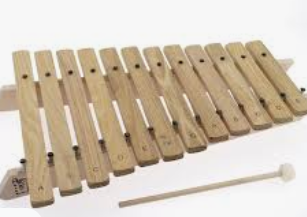 |
| 15                                     | Tubular Bell             | [管钟](https://baike.baidu.com/item/管钟)                 | 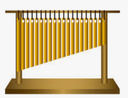 |
| 16                                     | Dulcimer                 | [扬琴](https://baike.baidu.com/item/扬琴)                 |                                                              |
| Organ（风琴）                          |                          |                                                           |                                                              |
| 17                                     | Drawbar Organ            | 音栓风琴、拉杆式风琴                                      |                                                              |
| 18                                     | Percussive Organ         | 敲击风琴                                                  |                                                              |
| 19                                     | Rock Organ               | 摇滚管风琴                                                |                                                              |
| 20                                     | Church organ             | 教堂管风琴                                                |  |
| 21                                     | Reed organ               | 簧风琴                                                    | 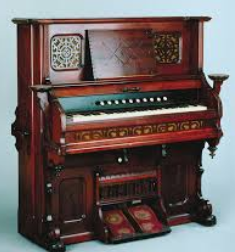 |
| 22                                     | Accordion                | [手风琴](https://baike.baidu.com/item/手风琴)             | 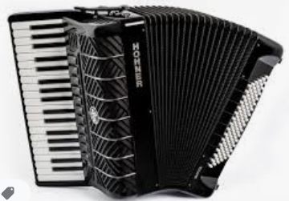 |
| 23                                     | Harmonica                | [口琴](https://baike.baidu.com/item/口琴)                 |                                                              |
| 24                                     | Tango Accordion          | 探戈手风琴                                                |                                                              |
| Guitar（吉他）                         |                          |                                                           |                                                              |
| 25                                     | Acoustic Guitar（nylon） | 木吉他（尼龙弦）                                          |                                                              |
| 26                                     | Acoustic Guitar（steel） | 木吉他（钢弦）                                            |                                                              |
| 27                                     | Electric Guitar（jazz）  | 电吉他（爵士）                                            |                                                              |
| 28                                     | Electric Guitar（clean） | 电吉他（原音）                                            |                                                              |
| 29                                     | Electric Guitar（muted） | 电吉他（闷音）                                            |                                                              |
| 30                                     | Overdriven Guitar        | 电吉他（破音）                                            |                                                              |
| 31                                     | Distortion Guitar        | 电吉他（失真）                                            |                                                              |
| 32                                     | Guitar harmonics         | 吉他合声                                                  |                                                              |
| Bass（贝斯）                           |                          |                                                           |                                                              |
| 33                                     | Acoustic Bass            | [贝斯](https://baike.baidu.com/item/贝斯)                 |                                                              |
| 34                                     | Electric Bass（finger）  | 电贝斯（finger）                                          |                                                              |
| 35                                     | Electric Bass（pick）    | 电贝斯（pick）                                            |                                                              |
| 36                                     | Fretless Bass            | 无格贝斯                                                  |                                                              |
| 37                                     | Slap Bass 1              | 重贝斯 1                                                  |                                                              |
| 38                                     | Slap Bass 2              | 重贝斯 2                                                  |                                                              |
| 39                                     | Synth Bass 1             | 合成贝斯 1                                                |                                                              |
| 40                                     | Synth Bass 2             | 合成贝斯 2                                                |                                                              |
| Strings（弦乐器）                      |                          |                                                           |                                                              |
| 41                                     | Violin                   | [小提琴](https://baike.baidu.com/item/小提琴)             |                                                              |
| 42                                     | Viola                    | [中提琴](https://baike.baidu.com/item/中提琴)             |                                                              |
| 43                                     | Cello                    | [大提琴](https://baike.baidu.com/item/大提琴)             |                                                              |
| 44                                     | Contrabass               | [低音提琴](https://baike.baidu.com/item/低音提琴)         |                                                              |
| 45                                     | Tremolo Strings          | 颤弓弦乐                                                  |                                                              |
| 46                                     | Pizzicato Strings        | 弹拨弦乐                                                  |                                                              |
| 47                                     | Orchestral Harp          | [竖琴](https://baike.baidu.com/item/竖琴)                 |                                                              |
| 48                                     | Timpani                  | [定音鼓](https://baike.baidu.com/item/定音鼓)             |                                                              |
| Ensemble（合奏）                       |                          |                                                           |                                                              |
| 49                                     | String Ensemble 1        | 弦乐合奏 1                                                |                                                              |
| 50                                     | String Ensemble 2        | 弦乐合奏 2                                                |                                                              |
| 51                                     | Synth Strings 1          | 合成弦乐 1                                                |                                                              |
| 52                                     | Synth Strings 2          | 合成弦乐 2                                                |                                                              |
| 53                                     | Voice Aahs               | “阿”音                                                    |                                                              |
| 54                                     | Voice Oohs               | “喔”音                                                    |                                                              |
| 55                                     | Synth Voice              | 合成人声                                                  |                                                              |
| 56                                     | Orchestra Hit            | 交响打击乐                                                |                                                              |
| Brass（铜管乐器）                      |                          |                                                           |                                                              |
| 57                                     | Trumpet                  | [小号](https://baike.baidu.com/item/小号)                 | 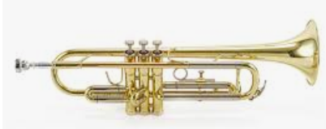 |
| 58                                     | Trombone                 | [长号](https://baike.baidu.com/item/长号)                 | 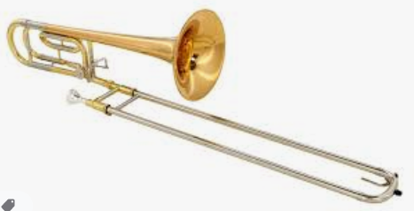 |
| 59                                     | Tuba                     | 大号（吐巴号、低音号）                                    |                                                              |
| 60                                     | Muted Trumpet            | 闷音小号                                                  |                                                              |
| 61                                     | French horn              | 法国号（圆号）                                            | 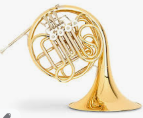 |
| 62                                     | Brass Section            | [铜管乐](https://baike.baidu.com/item/铜管乐)             |                                                              |
| 63                                     | Synth Brass 1            | 合成铜管 1                                                |                                                              |
| 64                                     | Synth Brass 2            | 合成铜管 2                                                |                                                              |
| Reed（簧乐器）                         |                          |                                                           |                                                              |
| 65                                     | Soprano Sax              | 高音萨克斯风                                              | 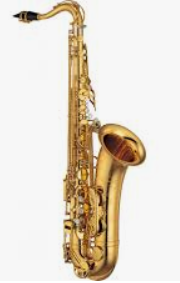 |
| 66                                     | Alto Sax                 | [中音萨克斯风](https://baike.baidu.com/item/中音萨克斯风) |                                                              |
| 67                                     | Tenor Sax                | 次中音萨克斯风                                            |                                                              |
| 68                                     | Baritone Sax             | 上低音萨克斯风                                            |                                                              |
| 69                                     | Oboe                     | [双簧管](https://baike.baidu.com/item/双簧管)             | 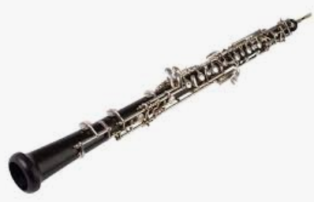 |
| 70                                     | English Horn             | [英国管](https://baike.baidu.com/item/英国管)             | 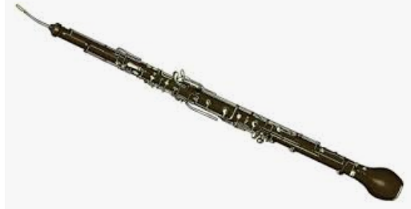 |
| 71                                     | Bassoon                  | 低音管（巴颂管）                                          |  |
| 72                                     | Clarinet                 | 单簧管（黑管、竖笛）                                      |                                                              |
| Pipe（吹管乐器）                       |                          |                                                           |                                                              |
| 73                                     | Piccolo                  | [短笛](https://baike.baidu.com/item/短笛)                 |                                                              |
| 74                                     | Flute                    | [长笛](https://baike.baidu.com/item/长笛)                 |                                                              |
| 75                                     | Recorder                 | [直笛](https://baike.baidu.com/item/直笛)                 | 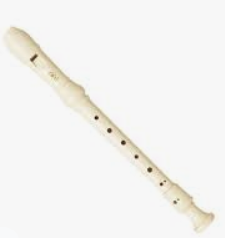 |
| 76                                     | Pan Flute                | [排笛](https://baike.baidu.com/item/排笛)                 |  |
| 77                                     | Blown Bottle             | 瓶笛                                                      |                                                              |
| 78                                     | Shakuhachi               | [尺八](https://baike.baidu.com/item/尺八)                 |                                                              |
| 79                                     | Whistle                  | [哨子](https://baike.baidu.com/item/哨子)                 |                                                              |
| 80                                     | Ocarina                  | [陶笛](https://baike.baidu.com/item/陶笛)                 |                                                              |
| Synth Lead（合成音 主旋律）            |                          |                                                           |                                                              |
| 81                                     | Lead 1（square）         | [方波](https://baike.baidu.com/item/方波)                 |                                                              |
| 82                                     | Lead 2（sawtooth）       | [锯齿波](https://baike.baidu.com/item/锯齿波)             |                                                              |
| 83                                     | Lead 3（calliope）       | [汽笛风琴](https://baike.baidu.com/item/汽笛风琴)         |                                                              |
| 84                                     | Lead 4（chiff）          | 合成吹管                                                  |                                                              |
| 85                                     | Lead 5（charang）        | 合成电吉他                                                |                                                              |
| 86                                     | Lead 6（voice）          | 人声键盘                                                  |                                                              |
| 87                                     | Lead 7（fifths）         | 五度音                                                    |                                                              |
| 88                                     | Lead 8（bass + lead）    | 贝士吉他合奏                                              |                                                              |
| Synth Pad（合成音—和弦衬底）           |                          |                                                           |                                                              |
| 89                                     | Pad 1（new age）         | 新世纪                                                    |                                                              |
| 90                                     | Pad 2（warm）            | 温暖                                                      |                                                              |
| 91                                     | Pad 3（polysynth）       | 多重合音                                                  |                                                              |
| 92                                     | Pad 4（choir）           | 人声合唱                                                  |                                                              |
| 93                                     | Pad 5（bowed）           | 玻璃                                                      |                                                              |
| 94                                     | Pad 6（metallic）        | 金属                                                      |                                                              |
| 95                                     | Pad 7（halo）            | 光华                                                      |                                                              |
| 96                                     | Pad 8（sweep）           | 扫掠                                                      |                                                              |
| Synth Effects（合成音—效果）           |                          |                                                           |                                                              |
| 97                                     | FX 1（rain）             | 雨                                                        |                                                              |
| 98                                     | FX 2（soundtrack）       | 电影音效                                                  |                                                              |
| 99                                     | FX 3（crystal）          | 水晶                                                      |                                                              |
| 100                                    | FX 4（atmosphere）       | 气氛                                                      |                                                              |
| 101                                    | FX 5（brightness）       | 明亮                                                      |                                                              |
| 102                                    | FX 6（goblins）          | 魅影                                                      |                                                              |
| 103                                    | FX 7（echoes）           | 回音                                                      |                                                              |
| 104                                    | FX 8（sci-fi）           | 科幻                                                      |                                                              |
| Ethnic（民 族 乐 器）                  |                          |                                                           |                                                              |
| 105                                    | Sitar                    | [西塔琴](https://baike.baidu.com/item/西塔琴)             | 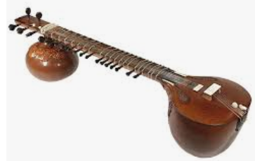 |
| 106                                    | Banjo                    | 五弦琴（斑鸠琴）                                          |                                                              |
| 107                                    | Shamisen                 | [三味线](https://baike.baidu.com/item/三味线)             |                                                              |
| 108                                    | Koto                     | 十三弦琴（古筝）                                          |                                                              |
| 109                                    | Kalimba                  | 卡利玛钟琴                                                |                                                              |
| 110                                    | Bagpipe                  | [苏格兰风笛](https://baike.baidu.com/item/苏格兰风笛)     |                                                              |
| 111                                    | Fiddle                   | 古提琴                                                    |                                                              |
| 112                                    | Shanai                   | [唢呐](https://baike.baidu.com/item/唢呐)                 |                                                              |
| Percussive（打 击 乐 器）              |                          |                                                           |                                                              |
| 113                                    | Tinkle Bell              | 叮当铃                                                    |                                                              |
| 114                                    | Agogo                    | 阿哥哥鼓                                                  |                                                              |
| 115                                    | Steel Drums              | [钢鼓](https://baike.baidu.com/item/钢鼓)                 |                                                              |
| 116                                    | Woodblock                | [木鱼](https://baike.baidu.com/item/木鱼)                 |                                                              |
| 117                                    | Taiko Drum               | [太鼓](https://baike.baidu.com/item/太鼓)                 |                                                              |
| 118                                    | Melodic Tom              | 古式高音鼓                                                |                                                              |
| 119                                    | Synth Drum               | 合成鼓                                                    |                                                              |
| 120                                    | Reverse Cymbal           | 回音钹                                                    |                                                              |
| Sound effects（特 殊 音 效）           |                          |                                                           |                                                              |
| 121                                    | Guitar Fret Noise        | 吉他品格杂音                                              |                                                              |
| 122                                    | Breath Noise             | 呼吸杂音                                                  |                                                              |
| 123                                    | Seashore                 | 海岸                                                      |                                                              |
| 124                                    | Bird Tweet               | 鸟鸣                                                      |                                                              |
| 125                                    | Telephone Ring           | 电话铃声                                                  |                                                              |
| 126                                    | Helicopter               | 直升机                                                    |                                                              |
| 127                                    | Applause                 | 拍手                                                      |                                                              |
| 128                                    | Gunshot                  | 枪声                                                      |                                                              |

**打击乐音符（Percussion notes）**

在General MIDI中，频道10被保留作为打击乐器使用，不论音色编号为何。 不同的音符对应到不同的打击乐器。见下表：

| No.  | English         | 中文                                                  |
| ---- | --------------- | ----------------------------------------------------- |
| 35   | Bass Drum 2     | [大鼓](https://baike.baidu.com/item/大鼓) 2           |
| 36   | Bass Drum 1     | [大鼓](https://baike.baidu.com/item/大鼓) 1           |
| 37   | Side Stick      | 小鼓鼓边                                              |
| 38   | Snare Drum 1    | [小鼓](https://baike.baidu.com/item/小鼓) 1           |
| 39   | Hand Clap       | 拍手                                                  |
| 40   | Snare Drum 2    | [小鼓](https://baike.baidu.com/item/小鼓) 2           |
| 41   | Low Tom 2       | 低音鼓 2                                              |
| 42   | Closed Hi-hat   | 闭合开合钹                                            |
| 43   | Low Tom 1       | 低音鼓 1                                              |
| 44   | Pedal Hi-hat    | 脚踏开合钹                                            |
| 45   | Mid Tom 2       | 中音鼓 2                                              |
| 46   | Open Hi-hat     | 开放开合钹                                            |
| 47   | Mid Tom 1       | 中音鼓 1                                              |
| 48   | High Tom 2      | 高音鼓 2                                              |
| 49   | Crash Cymbal 1  | 强音钹 1                                              |
| 50   | High Tom 1      | 高音鼓 1                                              |
| 51   | Ride Cymbal 1   | 打点钹 1                                              |
| 52   | Chinese Cymbal  | [钹](https://baike.baidu.com/item/钹)                 |
| 53   | Ride Bell       | 响铃                                                  |
| 54   | Tambourine      | [铃鼓](https://baike.baidu.com/item/铃鼓)             |
| 55   | Splash Cymbal   | 小钹铜钹                                              |
| 56   | Cowbell         | [牛铃](https://baike.baidu.com/item/牛铃)             |
| 57   | Crash Cymbal 2  | 强音钹 2                                              |
| 58   | Vibra Slap      | 噪音器                                                |
| 59   | Ride Cymbal 2   | 打点钹 2                                              |
| 60   | High Bongo      | 高音邦加鼓                                            |
| 61   | Low Bongo       | 低音邦加鼓                                            |
| 62   | Mute High Conga | 闷音高音[康加鼓](https://baike.baidu.com/item/康加鼓) |
| 63   | Open High Conga | 开放高音[康加鼓](https://baike.baidu.com/item/康加鼓) |
| 64   | Low Conga       | 低音[康加鼓](https://baike.baidu.com/item/康加鼓)     |
| 65   | High Timbale    | 高音天巴鼓                                            |
| 66   | Low Timbale     | 低音天巴鼓                                            |
| 67   | High Agogo      | 高音阿哥哥                                            |
| 68   | Low Agogo       | 低音阿哥哥                                            |
| 69   | Cabasa          | [串珠](https://baike.baidu.com/item/串珠)             |
| 70   | Maracas         | 沙铃                                                  |
| 71   | Short Whistle   | 短[口哨](https://baike.baidu.com/item/口哨)           |
| 72   | Long Whistle    | 长[口哨](https://baike.baidu.com/item/口哨)           |
| 73   | Short Guiro     | 短刮壶                                                |
| 74   | Long Guiro      | 长刮壶                                                |
| 75   | Claves          | [梆子](https://baike.baidu.com/item/梆子)             |
| 76   | High Wood Block | 高音[木鱼](https://baike.baidu.com/item/木鱼)         |
| 77   | Low Wood Block  | 低音[木鱼](https://baike.baidu.com/item/木鱼)         |
| 78   | Mute Cuica      |                                                       |
| 79   | Open Cuica      |                                                       |
| 80   | Mute Triangle   | 闷音[三角铁](https://baike.baidu.com/item/三角铁)     |
| 81   | Open Triangle   | 开放[三角铁](https://baike.baidu.com/item/三角铁)     |

**控制器事件（Controller events）**

GM也同时规范了数个控制器的工作

| No.  | 功能                                                    |
| ---- | ------------------------------------------------------- |
| 1    | Modulation（[颤音](https://baike.baidu.com/item/颤音)） |
| 6    | Data Entry [MSB](https://baike.baidu.com/item/MSB)      |
| 7    | Volume（音量）                                          |
| 10   | Pan（相位）                                             |
| 11   | Expression（表达）                                      |
| 38   | Data Entry [LSB](https://baike.baidu.com/item/LSB)      |
| 64   | Sustain（延音）                                         |
| 100  | RPN LSB                                                 |
| 101  | RPN MSB                                                 |
| 121  | Reset all controllers（重设所有控制器）                 |
| 123  | All notes off（消音）                                   |

**RPN（Registered Parameter Number）**

设定登录的参数需要传送（数字是十进制）：

两个控制转换讯息（Control Change messages），使用控制号码101和100去选择参数跟着任何1或2bytes的资料入口讯息（Data Entry messages）(MSB = 控制器 #6, LSB = 控制器 #38)最后是"End of RPN" 讯息，即表示结束之讯息以下的全球Registered Parameter Numbers (RPNs) 是经过标准化的（参数由RPN LSB/MSB对规范，值则由Data Entry LSB/MSB对设定）：

| MSB  | LSB  | 意义                                   |
| ---- | ---- | -------------------------------------- |
| 0    | 0    | Pitch bend range（滑音范围）           |
| 0    | 1    | Channel Fine tuning（频道细调）        |
| 0    | 2    | Channel Coarse tuning（频道粗调）      |
| 0    | 3    | Tuning Program Change（转换调节音色）  |
| 0    | 4    | Tuning Bank Select（转换调节群组）     |
| 0    | 5    | Modulation Depth Range（颤音深度范围） |
| 127  | 127  | RPN Null                               |

例：用RPN控制串设定粗调（coarse tuning）至A440（参数 2，值 64）

101:0, 100:2, 6:64, 101:127, 100:127

## 采样

十大國外嘻哈音樂取樣神曲：https://www.youtube.com/watch?v=l9G_JIjRyFI&list=PLaIMRdOvLrfmMBB_c52gBVrFbCdxNKQAu&index=4

AKAI MPC

鼓点Beat采样：找一段音频，截取短小且能够循环的鼓点，制作成Loop，反复听能不能Loop起来。

当能听起来像Loop了，需要再将Loop的时长与拍数对其：

将音频的Time stretching的time设置成none。这样当调整tempo（拉长/拉短音频）的时候，音频就能进行整体的拉长或缩放，而不是截取。

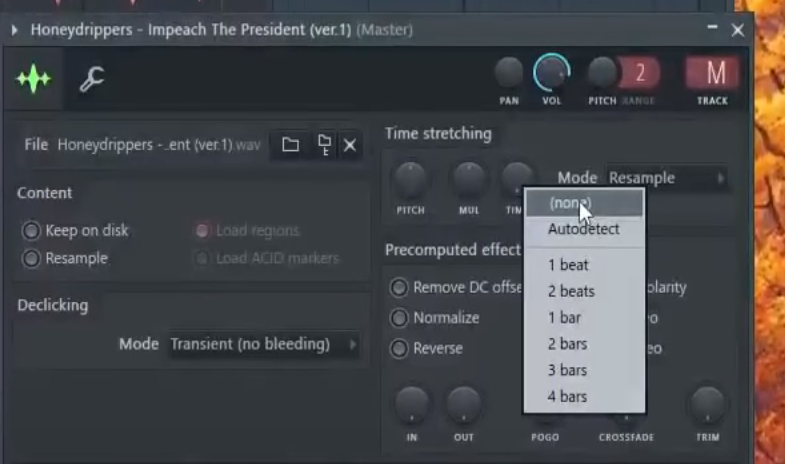

对齐拍后，将magnets设置成bar，并对刚做好的Loop进行复制粘贴，播放试听效果

并且再将time设置成工程的tempo数（点击auto-detect）

Piano采样：找到能让自己music orgasm的那part，通过音谱找到第一个音，划分musical pattern进行截取，试听能不能loop起来。

用同样的方式，将采样对齐，最后要将其tempo设置成一致

## 混音

### 动态处理

随着数字调音台的普及，在模拟时代昂贵的动态处理设备已经变成数字调音台普遍具备的内嵌功能。每个使用数字调音台的混音师都能对信号进行动态处理，然而只有正确地认识和操作才能达到所期望的效果。

**一．什么是动态范围？**

　　动态范围可以定义为最大音频电平和最小电平的比值。

　　举个例子，如果一台信号处理器标明最大不失真输入电平是+24dBu，输出本底噪音是-92dBu，则该处理器的动态范围为24+92=116dB。

　　通常来说，管弦乐队演出的电平可能在-50dBu至+10dBu之间，也就是动态范围为60dB。60dB的动态范围似乎不算很高的数值，但是做一下数学计算，我们便能发现+10dBu的信号电压要比－50dBu大1000倍！

　　而相比之下，摇滚乐的动态范围就要小的多了，典型的摇滚乐动态可能在-10dBu至+10dBu，也就是20dB。这使对一场摇滚演出的各轨信号混音相对简单一些。

**二．为什么需要压缩？**

　　考虑我们刚才所说的情形：假设你正在为一场摇滚演出混音，其音乐的动态范围为20dB。你想混入一轨未经压缩的人声到其中。未经压缩的人声的平均动态范围约为40dB。又或者说，人声信号的电平可能在-30dBu至+10dBu之间。当人声信号达到或超过+10dBu时会在混音中过于突出。而当人声信号为-30dBu或者更低时，就会被其他乐器的咆哮声彻底淹没。这种情况下我们便可以采用一台压缩器，将人声的动态范围减小（压缩）至10dB左右。经过压缩处理之后，人声的电平可设置在+5dBu左右。这时，人声信号的动态范围在0dBu至+10dBu之间。这样即便在低电平时，人声也会在乐器伴奏之上，而在大声时，也不会压过整体的音乐伴奏，这样人声就不会跑出“既定轨道”之外。

　　同样的道理对于乐器声也适用。每样乐器都有各自的表现空间，好的压缩器就是能在混音的全过程帮助调音师控制住每件乐器。

**三．每一件乐器都需要压缩处理吗？**

　　对于这个问题，会有很多人回答说“绝对不需要，过度的压缩简直就是灾难！”这句话说得没错，不过前提是要正确地定义：什么是过度压缩？

　　这个术语的出现实际上是因为压缩器工作时被人耳听出来。一款设计合理且正确设置的压缩器工作时不应该会被听出来！因此过度压缩的声音通常指某件乐器在经过压缩处理时采用了不合理的参数设置。当然，有时会为了特殊的效果而故意这样做，那就另当别论了。

**四．为何世界顶级的调音台会为每个通道配备压缩器？**

　　答案很简单，那就是：几乎所有乐器的声音都需要某种程度的压缩处理，可能时常只是很微妙的处理，从而在整个混音中得到更好的表现。

**五．为什么需要噪声门？**

　　之前我们讨论过给人声加压缩的例子：假如人声信号在经压缩处理后的动态范围为20dB。但是问题也随之而来，即动态范围的下限提高之后，这支人声话筒所拾取到的环境噪音（如空调噪音、鼓的串音）也会更容易被听到。可能有些人想着可以尝试在歌手每句唱词之间将话筒的通道哑音以去除那些恼人的噪音。然而，这种做法很不现实，并很可能以悲剧收场。更好的办法便是使用噪声门。噪声门的阀值可以设置为人声信号动态范围的下限，比如说-10dBu，这样噪声门就能够有效地去除歌手的唱词之间话筒拾取的噪音。

　　如果你曾经做过现场乐队混音，你肯定遇到过这样的问题——镲片的声音总是在通鼓的话筒通道里铮铮作响。特别是当你想让通鼓声更清脆而对高频进行提升时，便总是发现镲片的声音也会随之突出，并且余音挥之不去。在通鼓话筒的通道中加入噪声门，便能有效减小镲片的叮当声，这样会明显地让混音变得更加干净。

　　动态处理就是改变信号的动态范围的过程。通过动态处理，现场扩声系统或者是录音设备可以在不失真和最小噪音的前提下处理信号，使得每个音轨在整个缩混中得到应有的表现。

### 混音步骤

虽然对于录音和混音来说没有什么一定的原则，但是一旦你开发出一套自己的混音步骤，那么它至少可以告诉你混音工作应该从哪儿下手。 在混音中你会花大量的时间来进行各种各样的调整。 关于混音我们这里列出了最基本的13个步骤，而混音中最难的地方却是这些步骤之间的相互影响。

当你改变EQ设置的同时，电平值也会发生变化，这是因为你对声音中的某些元素进行了提升或是衰减，它会影响到其他的元素。 事实上，你可以认为混音就是一把“音频密码锁”。 当你将所有的号码都调到了正确的数字时，那么你就完成了一件伟大的混音。

让我们一起来看一看这13个步骤，但是你要切记一点，这只是某一个人关于混音的见解，你很可能需要一套完全不同的但却是最适合于你的混音方法。

**第1步：做好准备**

混音可能是一件非常单调而乏味的事情，因此要设置一个高效率的工作空间。 如果你没有一把坐感舒适的椅子，那么你最好还是到附近的办公用具商店去一趟。 准备一些纸张和一个笔记本，以便进行记录时使用，将灯光调整得暗一些，这样可以使你耳朵的灵敏度高于你的眼睛，还要让自己兴奋起来，开始你的“旅行”。

要定时进行休息(例如每隔45到60分钟)，这样可以让耳朵得到放松并使你保持一个清醒的头脑投入到工作当中去。 如果你是在录音棚中进行工作，那么这种休息就显得有些太奢侈了，但是这种两三分钟的休息却可以让你更加客观地进行判断，使你的混音工作得以迅速地完成。

**第2步：回顾音轨**

先使用较低的音量听一听所有音轨中都有些什么东西，然后记录下音轨的信息，并使用实时贴或是可以擦除的笔来简要地标明哪一个声音对应调音台上的哪一路。 最好按照一般的逻辑习惯来组合声音，例如将所有打击乐器的声音都放在调音台上相连的路中。

**第3步：带上耳机清除瑕疵**

检查录音细微的瑕疵是一件需要用到“左脑”的理性行为，这不同于用“右脑”来进行感性的混音工作。如果大脑在这两种性质不同的工作状态中跳来跳去一定会阻碍你创造力的发挥，因此在进行正式的混音之前，要尽可能地做好清理工作——消除录音中的杂音、弹错的音符以及其他类似的东西。这时你可以戴上耳机，分别单独播放每一个音轨来捕捉录时中的每一个细节。

如果你是对MIDI音轨进行混音，那么此刻你应该做的工作无疑是减少多余的控制器信号，消除重迭的音符，删去单音乐器音轨中多出来的声音(例如贝司和铜号的声部)。

为了整理录在磁带上(包括数字式磁带和仿真式磁带)的音轨，可以先将它们转录到硬盘录音机中，进行一些数字化的编辑和噪声抑制工作。 虽然一些细小的杂音单独听起来不会引注意，但是将一二十个音轨迭加到一起后，那些令人反感的声音就会原形必露了。

**第4步：优化所有的MIDI音源**

如果要对MIDI音序的东西进行录音，最好首先在MIDI乐器内部对声音进行优化。 例如，为了使声音更加明亮，你最好在电子乐器中提高该音色的低通滤波器截止频率，而不要使用调音台上的均衡器。 一个要点：使用电子乐器时，一定要始终将输出音量打到最大值，这样做的最好处是可以得到最大的动态范围。

如果需要的话，你可以在调音台上对电平进行调整。 当在特殊场合需要改变合成器输出电平的时候，可以使用第7号MIDI控制器信息，但是一定要保证合成器音轨中的最大音量值(控制器7号值)为127(或是非常接近127)，总之应该尽量在调音台上对合成器的音量进行调节。 如果你将调音台的音量推杆推到最大，而又将电子乐器中的控制器7号值设置为32，那么你作品的动态范围一定会大受影响。

**第5步：在音轨问建立相对的电平平衡**

混音进行到现在仍不要忙着加入效果，这里可以专注于各轨组合在一起的整体声音，而不要再被左脑所处理的各种细节问题所干扰。 对于一个优秀的混音来说，各个音轨自身的声音应该是非常棒的，但当各轨组合在一起相互作用时，声音应该更好。

进行整体聆听时最好先切入到单音色(mono)方式，如果各轨的声音录得很清晰的话，那么在单声道中它们将比在立体声中表现得更加明确。 如果是一开始就用立体声来试听，那么各音轨中彼此冲突的一些地方就不容易被听出来。

**第6步：调整均衡**

均衡器(EQ)可以用来突出不同乐器的特征，并使得声音在整体上更加平衡。 首先对歌曲中最重要的元素进行加工(例如人声、鼓和贝司)。 一旦所有的这些元素都“粘合”在一起了，再着手处理其它声部。

音频频谱只有一定的宽度，而每一种乐器又都要在整个频谱范围内占据其自己的一块领地，因此当各个乐器的声音组合到一起的时候，它们将填满整个频谱(当然，如何填满频谱首先取决于乐曲的配器，但均衡也在其中起着一定的作用)。 混音时要先从鼓组下手的一个原因就是鼓组中的乐器(从低声部的大鼓到高声部的钗)可以很好地覆盖整个音频频谱。 一旦鼓组安排停当，你就可以开始琢磨如何将其他乐器融合进去了。

对一个音轨进行均衡操作时会影响到其他的音轨。 例如，提升某一个钢琴音轨的中频部分可能会影响到人声、吉他以及其他中频段乐器的声音。 有时候对某一乐器的某个频率进行提升，还会导致该频率处其他乐器声音被消弱的现像。 为了使得人声更为突出，可以试着在其他乐器中将人声频率所在频段进行衰减，而不要一味地用均衡器对人声进行提升。

你可以将歌曲想成是一个频谱，然后去决定各个声音都就座在什么位置(也就是其较突出的部分)。 我在混音过程中有时会使用到一台频谱分析仪，这倒并不是因为耳朵不能够胜任工作，而是由于分析仪会提供一个绝好的耳朵训练机会，同时还会极为精确地显示出各个乐器在声音频谱中的位置。 一台分析仪会提醒你在某个频率区域内存在的声音能量的异常情况。

如果你真的需要那种“突破”型或是说“爆发”型的声音，那么可以试着将1KHZ到3KHz的频段进行少许提升。 不要对所有的乐器都使用这一方法，因为其目的是要用提升(或是衰减)操作来将一种乐器的声音与其他的乐器区分开来。

要想在混音中造成声音像是是从较远的地方发出来的感觉，那么你只要使用低通滤波器进行滤波就可以了，不必要非得用主均衡器不可。若你是使用高通滤波器对吉他、钢琴这些有向低频转移倾向的乐器进行滤波，那么会对这些乐器的低频段产生修减作用，使得贝司、大鼓这些低频中的重要成分都得到了充分地展开。

**第7步：施加基本的信号处理**

“基本的”并不意味着只使声音变“甜”，因为效果处理可以说也是“完整的声音”中的一个部分(例如，如果echo(回声)效果的回声落到了音乐的拍节上，就有可能改变节奏部分的特征，而distortion(失真)会将更加激烈地改变声音)

**第8步： 创建立体的声音舞台**

现在到了将乐器安排在立体声的舞台上的时候了。 你的目的可能还是非常传统的(也就是说，是要重现一个现场演出时的情景)，当然也可能是非常前卫的。 不管怎样，为单声道的乐器安排一个合适的声像位置时，要避免将声像设置得过于靠左或是靠右。 出于某些原因，过于极致的信号听起来可能会不十分真实。

由于低频声音的方向性不如高频声音明显(即通常说的“低频无指向性”)，因此可以将大鼓和贝司的声音放在中央。 还要考虑到平衡的因素，举个例子来说吧，如果你将hi—hat(富含高频谐波成分)安排在了右侧，那么就应将tambourine、shaker或是其他的高频声音安排在左侧。 这种概念对于中频段的乐器也同样是适用的。

信号处理器也可以将一个单声道的信号改变成一个立体声的图像。 办法之一就是使用有时间延续功能的效果，如使用立体声合唱或是一个较短的延时。 举个例子，如果一个信号的声像在左侧，那么将该信号的一部分施加短延时(5到15毫秒)后 再发送到另外一个声像为右的通道中。 当你进行这样的操作时，最重要的是要确认混音监听在这时是处于单声道状态，这是由于将效果声和直达声进行混音时有可能导致声音相位的抵消，而在立体声情况下你可能听不出这种现像。

另外一个技巧则要使用均衡器了。 将一个信号发送到两个分离的声道上去，但是对它们实行不同的均衡处理。 例如，将一个声音送到一台立体声图式均衡器的两个声道中，将一个声道偶数段的频率全部减弱，而将另外一个声道奇数段的频率全部减弱。

立体声的设置会十分有效地影响我们对声音的感受。让我们来对人声进行加倍，让一个歌手演唱一段，然后非常细致地将歌声进行一次加倍。试着将这两个声音输入声像相对的声道中，这时两个歌声将结合到一起，并使声像听起来是位于中央。这样产生的处于中央位置的声音会给人一种十分平滑的感觉，尤其是对于女歌手来说这将非常有效。这种声像相对的人声会表现出更加准确与清晰的音质，对于一个好的歌手来说更能体现其优秀。

**第9步： 在编曲上进行最后的改动**

你应该使乐曲中互相竞争的成份尽量减少，这样才能保证听众的注意力全部集中于曲调之上，而不使你的作品听起来乱哄哄的。 你可能非常为你添加的某些效果而骄傲，但是如果这种效果不能够很好地为乐曲服务，那么别无选择——去掉它。 相反的，如果你发现乐曲不需要某种特殊的声音，那么这就是你再迭录入一两个音轨的最后时刻。 在音乐最后完成之前不要沉迷于欣赏你暂时的工作成果。 切记：尽你最大的努力在混音中保持一种客观的工作态度。

你可以通过去掉或是加入某些特殊的音轨来在混音时改变乐曲的配器。 这种混音方式对于大多数舞曲风格的音乐作品来说是一种最基本的工作方法。 这时，可以不断反复地播放一段音乐，然后不断地切换各路的哑音键和变化主音量，你通过调音台就可以编配出一首舞曲音乐。

**第10步： 声学空间**

现在我们已经将我们的音轨都设定为立体声的了，接下来就要将它们安排到一个声学空间中了。 从为辅助输出口外接一台效果器并选择一个精彩的混响开始，然后再对选中的音轨增加混响和／或延时效果，为一个扁平的声场创造出一定的纵深空间。 通过开大一个声道的辅助输出并稍微地降低其推子，你就可以将一个音轨的声音放置到声场的后方。

通常情况下，你将会对整个乐曲使用混响，以建立一种特殊的声学空间(俱乐部、礼堂、音乐厅)。 然后对某一个单独的音轨再使用一次混响效果，例如对通通鼓使用一个门混响(gated reverb)。 但是要注意一点，如果你为了将一个声音做好而不得不将混响效果加到最大，那么你最好将这一轨重新进行录音。

**第11步： 拧、拧、再拧...**

此时此刻，混音已经有了个大概形状了，下面就该进行细调了。 如果你是使用自动混音，那么就开始编写你混音的每一个进程吧。 切记上面的各个步骤全都是相互影响的，因此你要反复在均衡、电平、立体声位置和效果之间进行调整。 监听的标准要尽可能地严格，如果你没有将那些给你带来麻烦的东西除去，它们就可能会在你试听混音结果时像幽灵一样总来捣乱。

直到得出满意的结果前，你这时所做的工作对于混音来说全都是十分重要的，可以说是关系到混音生死存亡的大问题。 但你千万也不要因此而神经质，进行混音也可以说是进行表演，如果你抠得太细，就将会失去那些能增加刺激感的自发性的东西。 一个不甚理想但却传达了热情的混音作品，听起来终究要比一个精细准确但却缺乏灵气的混音要有意思得多…吸引人得多。 出于保险的目的，不要总是反复删除再重新进行你的混音，当你第二天再听昨日做出的混音时，可能会突然发现以前的这版混音正是你梦寐以求的。

事实上，你可能自己都说不出你不同混音版本之间到底有多大的差别。 一位非常有经验的录音师曾经告诉我说，他对同一首歌曲缩混了十几个版本，因为他坚持认为每一个混音版本中都有应该改进的地方，并且这些改进还是非常重要的。 当几个星期之后他再听到这些混音时，结果对大多数的版本他都分辨不出它们之间的差别。 因此，注意不要在进行改动上浪费过多的时间，你可以在几天后再去处理这些问题。

一个重要的技巧就是一旦你捕获到了最满意的混音结果，你就应该马上缩混出几种不同的版本，例如只有伴奏音乐而无人声的版本、只有背景而没有独奏乐器的版本。 这些不同的缩混版本很可能在将来某个时候会派上用场，例如你突然有机会将你的音乐重新用在一部电影或电视版中，或是要将它改编成舞曲，那么你就会事半功倍了。

**第12步： 在不同的系统中检查你的记音结果**

在你停止一切混音活动之前，先要在各种各样的耳机和音箱上听一听，并且既用立体声来听，也用单声道来听，同时还要试验大音量播放和小音量播放间有什么不同。 入耳的频率响应是随着音量的改变而改变的(在音量较低时，我们听到的高频和低频成份均较少，而中频较多)，因此如果你仅在较低音量的情况下进行监听，则你的混音一定会在正常音量播放时显得低频过重或是高频过于明亮。

因此你应该尽量做到在所有的音频系统上玲听你的混音时感觉都较好。 如果你的混音是针对于某一特殊的系统而做的，例如多媒体音箱，那么你可以考虑就用这种音箱作监听来进行混音。 如果你不能做到这一点的话，也一定要在一个能够代表将来用途的系统上进行试听。

在一个家庭音乐工作室中，你有充分的理由暂时放下手中的混音工作，到第二天再来接着干，而其中的这段时间，你可以到多个系统上去试听你的混音结果，看看还需要将哪几个旋钮再拧一拧。

一个最常用的小技巧就是将不同版本的混音带在几盘盒带上分别试听，看哪一盘的声音最像你在汽车中听音乐的感觉。 因为道路上的噪声将会掩盖掉所有细微的东西，只留下那些最能打动人的声音。 另外我也建议你有可能的话最好到专业的大型录音棚中去试听一下你的混音结果。 如果在各种条件下你的混音都非常精彩，那么你的任务才算完成了。

**第13步： 让自己变为听众**

你可能会发现一个问题，尽管你辛辛苦苦地进行演奏，不厌其烦地编辑每一个片段，但是你却从来没有从欣赏音乐的角度来听过自己的作品。 现在，混音工作已经结束，是该款待一下自己的时候了。 打开最终的混音，不要再去“庖丁解牛”般地分析音乐中的成分，仅仅是去听音乐。 假装你正在大街上散步，突然听到了有人在放音乐。 你这时对音乐有何看法?

当然，你大概认为自己根本就不可能完全按上面所说的那样做。 但是事实上只要尽量放松，你还是会得出一些结论。 你可能会认为它真是棒极了，或者是认为它与你开始动手时的想法已经相去甚远。

如果你对一个独特的混音作品的感觉在几个月或是几年以后发生了改变，不要过于大惊小怪。 你的品位在改变，并且你在混音方面的知识、经验也在不断丰富。 但是只要你按照这些步骤一点一点来的话，你就会为你经过千辛万苦创建出的作品感到欣慰——你已经从你的劳动成果中得到了应有的乐趣。

**附1：关于自动混音**

现有的一些器材具有自动功能，它可以使精细的混音操作变得十分方便。 当然，也有一些混音工程师无视这些有利条件，坚决抵抗自动混音功能，他们认为这些自动的操作会破坏他们充满灵感的对音乐的把握。 并且，现在也没有哪一条法律条文提到说混音工程师必须要使用自动混音。

有一位曾经与我合作过的混音师，他工作非常努力，不厌其烦地调整着电平、均衡和混响，到了最后进行缩混的时刻，他能闭着眼睛准确、及时地调整好推子的位置。 他进行混音时使用的是一台八轨的设备，他将手指全部分开，以便能够分别控制每一轨的推子，并且能做到及时准确。 这种工作的挑战性是显而易见的，但是不可否认，这样作出的歌曲很活泼不呆板。

但实际上很少有人能严格地训练自己以掌握这种混音的高难技术。 因此适当地使用自动混音就成为了一种很好的选择。 现在的一些混音装置可以将你推推子或拧旋钮的动作记录下来，然后在混音过程中自动完成控制。 另外，在一些计算器音频工作站中，你甚至可以为音量或声像的变化描绘精确的包络线。 所以对于大多数操作者来说， 自动混音仍是一种最为方便地实现自己混音思路的工具。

另外，使用一些小手段也会使混音更加容易。 例如要突出一种声音，除增大音量外，改变均衡的设置也可以得到非常好的效果。 在独奏乐器演奏时，你可以试着提升高频段和中频段。 另外在进行淡出时，有时候你可以通过给某一种乐器的声道施加更多的混响，使这种乐器的淡化速度快于其他的乐器。

无论你如何去做，都要保证混音的活泼性和对听众的吸引力，但是保证这一点也不是非常容易的。 甚至片刻的改变就会对最终的回放产生巨大的影响。 不要出于对某种效果器的偏爱，就不管合适与否一味地使用它，使用效果器是要让声音增添更多的变化，使音乐作品的吸引力更大。 保持电平一直在“跳舞”，不要对进行尝试有任何畏惧心理。

**附2：关于结尾淡出**

一个优秀的淡出可以说是歌曲中的关键所在。 让我们假设你用一段很长的器乐 演奏作为歌曲的结束。 一种选择就是让声音的音量保持四个小节，然后用八个小节 将其渐弱淡出。 当然，一个淡出不一定非得是连续的。 你可以让渐弱有一些波动， 比如每两拍将推子拉下一点。

线性的淡出可不是最好的选择。 而凹入型的淡出，尤其适合于那些非常长的声音，它可以引发听众一直想不断听下去的渴望。 最初的急速衰减告诉听众 要仔细聆听了，当他们的心被你抓住之时，你则将渐弱慢慢延伸到结尾。 还有另外一种情况，就是凸起型的淡出，相比之下它的声音就有些突几，在音乐的感觉上让人有些不知所措，不知你要何去何从。

一个返回式的淡出是指在你将某些声音渐弱的过程中，又突然很快地将声音推大，然后再真正地将其完全渐弱。 这种小把戏可以在你制作的音乐中用上一两回， 它们的确会给你的作品带来一些变化。 应用这种方法最好的例子可能就是，当一首 歌曲渐渐淡出到零电平时，突然又以最大的音量重新奏起，然后再彻底淡出。

### 具体案例

#### 在后期时改善钢琴的音色

**1. EQ：**

调整钢琴音色时，几个可参考的频段范围：

**60-100hz：钢琴音色的“浑”、“重”质感，英语中称它为钢琴的“bottom（底部）”。**在钢琴独奏曲目中，如果你希望钢琴的低音更丰满，这里可以考虑增益，不过过多就会变得“浑浊”，除了用耳朵来判断，也可以用你的身体来感受这里强烈的低频。在钢琴作为伴奏乐器的歌曲中，可以尝试以60-80hz作为EQ操作时低切（对应英语High Pass或者Low cut)的基础，根据歌曲的需要，切到100-200hz的范围都有可能。

**150-350hz：钢琴音色的“温暖感”、“圆润感”，称它为钢琴的“Warmth（温暖度）”或者“Rounded Sound（圆润的听感）”。**当你钢琴音色的柔软程度需要改变的时候，这里是可以尝试的范围，根据需要，增益与衰减均可。

**400-800hz：钢琴音色的“沉闷感”，称之为“Nasal Qualtity（鼻音质感）”。**若是增益它，听起来仿佛像是把钢琴家套在了一个巨大的纸盒里进行演奏，或者说像是钢琴声从收音机里传出来一样。如果需要改善钢琴的清晰度，这个范围可以酌情衰减。

**1000-3000hz：钢琴音色的“敲击感”，称之为“Attack（打击感）”、“Strings Plucking(击弦感）”。**相信大家应该知道真正的钢琴在演奏者触键之后，其实是手指触键的力量带动钢琴内部的锤状物敲击“琴弦”而发出声音，正是这个频段。同时这里也是人耳的听觉比较敏感的地方，当钢琴演奏的音符需要更多的存在感时，考虑增益，钢琴与其他中频强烈的乐器“争抢空间”时（吉他、人声等），考虑衰减。

**6000-9000hz：钢琴演奏的“清晰感”、“临场感”，称之为“Clarity（清晰度）”、“Presence（临场度）”。**仿佛在这个频段可以感受到演奏者手指的触键等等演奏细节。

**10000hz以上：钢琴演奏的“空气感”，称之为“Hiss（嘶嘶声）”。**这里涉及到EQ的高切（对应英语的Low Pass或者High Cut)我选择了在16000-18000hz左右切除，因为我发现如果不这样做，在之后的压缩处理时，会带来额外的噪音，结合自己的实际情况，多试验。

音频实例中使用的实际数值如下：

低切/高切：40hz/16000hz；

低频：94hz处，6.8db增益；

中低频：620hz处，4.6db衰减，Q值（作用范围）偏窄；

中频：2860hz处，3.6db增益，Q值偏宽；

高频：8960hz处，2.6db增益。

**2. 压缩：**

一般情况下，越自然的钢琴音色会越好听，当然这不是绝对的，与**个人偏好与歌曲需要**有极大的关联。

**压缩比：2-4之间都是很好的起始点。**

**压缩量：**在此文中使用的音频，**大约在响度最大的部分，也只有1-3db左右的音量衰减。**比起压缩，更大的效果实际上是添加一点压缩器的“色彩”。

**Atack与Release：偏快的设置不失为很好的起始点**，最大程度保留钢琴原本的音色。

音频实例中使用的实际数值如下：

首先在SSL通道插件里，我就已经使用了一点压缩：

Ratio（压缩比）:2.2；

Threshold（阀值）:-2.1；

Attack:自动；

Release:0.19。

接下来又串联了CLA-3A压缩器，两个压缩器的串联会给我带来不一样的“色彩”，同时分担各个压缩器的“压力”：

Peak Reduction:4.04；

Gain:3.95；

Analog模拟:开启，60hz；

Hi freq与Flat旋钮：71.1（此旋钮控制压缩器是倾向于压缩高频还是全频段，设定为100时为压缩全频段）。

**3. 饱和度(Saturation)：**

进一步放大那些在EQ调整阶段增益的“悦耳”频段。

Waves的这款Vitamin实际上是一款多频段的饱和度插件，可以看到我增益的主要范围是256hz左右，以及2000-3000hz之间的范围，对应上文中提到的“温暖感”和“敲击感”（图片中的具体数值很清晰，不再赘述）。除了此插件，还可以尝试使用各种“磁化饱和”插件，比如Waves的KramerMaster Tape插件。

**4. 声像扩展：**

如果钢琴在歌曲里作为伴奏，它的声像不一定是越宽阔越好，不过独奏曲目，可以考虑增加它的声像宽度。

**5. 总结：**

除了上文中提到的方法，在实际的操作中还可以考虑的是：

**1.在最初选择钢琴音色的时候，就选择一个最合适、听起来最悦耳的。**后期的混音工程只能改变一些声音的特质却不能改变它的本质，如果在源头处就把“音色”这个问题大致解决，混音时的操作会方便、简单得多。

**2.配合混响，给钢琴带来新的生命。**比方说一首歌曲里的钢琴伴奏，也许你会需要使用一些混响，让钢琴伴奏相比人声更加有一种“靠后”的感觉。

**3.使用各种效果器大胆创造。**Chorus（合唱）、Phaser（移相）等等效果器与钢琴配合都能做出些不一样的音色。


## 杂

* 裁剪音频时，要在横线与波形的交叉点进行裁剪。这样音频拼接的时候不会出现爆音。因此可以使用cubase上方工具栏的snap to zero crossing功能，自动将光标snap到交叉点。
* 合并音频的方式：
	1. 用胶水模式合并两个音频时，要点击前面的音频，而不是后面的。
	2. 选中全部音频，按alt+鼠标右键---合并导出选择内容

## 杂——概念

这些知识都可以问GPT，这里把一些相对抽象的概念专门抽出来，方便复习。
### 延迟补偿（Delay Compensation）——用于解决音轨之间延迟不同步的问题

在数字音频工作站（DAW）中，"延迟补偿"（Delay Compensation）是一种技术，用于确保音频信号在经过数字处理（如插件处理）后仍然能够保持同步。这是因为数字音频处理通常需要一定的时间，这个时间就是所谓的"处理延迟"。如果不同音轨或信号路径的处理延迟不同，就可能导致音频信号之间的相对时间错位，从而影响最终的混音效果。

延迟补偿的"补偿"具体是通过以下步骤实现的：

1. **测量延迟**：DAW 会测量每个音频通道或插件引入的延迟。这通常在启动 DAW 时自动完成，或者在添加新插件时进行。
    
2. **记录延迟**：DAW 会记录每个音频通道或插件的延迟信息，并在处理音频时考虑这些延迟。
    
3. **调整音频**：在播放或录音时，DAW 会根据记录的延迟信息，对音频信号进行适当的时间调整。这通常意味着在信号的开始处添加一个相等但相反的延迟，以确保所有信号在最终输出时能够对齐。
    
4. **同步音频**：通过这种方式，即使某些音频通道经历了更多的处理和因此引入了更多的延迟，DAW 也能够确保所有音频信号在最终播放时是同步的。
    
5. **实时调整**：在实时演奏或录音时，DAW 会动态地应用延迟补偿，以确保音乐家能够听到与他们演奏同步的声音。
    
6. **优化性能**：在某些情况下，如使用 "Constrain Delay Compensation" 功能时，DAW 可能会减少延迟补偿的量，以减少实时演奏时的感知延迟，但这可能会牺牲一些同步精度。

延迟补偿是数字音频处理中的一个重要方面，它对于保持多轨录音和现场表演的同步至关重要。通过正确实施延迟补偿，可以确保音频的质量和听众的听觉体验。

### 自动化（Automation）——实现音频参数的自动变化

自动化允许用户记录、编辑和回放对混音台（MixConsole）或效果器参数的实时控制变化。这意味着你可以自动化几乎任何可以调整的参数，如音量、声像、均衡、压缩、混响等，从而在音乐制作过程中创造出动态和流畅的混音。

以下是 Cubase 自动化的基本概念和操作步骤：

1. **启用自动化**：
    
    - 要开始自动化一个参数，首先需要在相应的轨道或效果器上启用自动化。这通常通过点击 MixConsole 中的自动化按钮或在轨道头部的自动化车道中添加参数来完成。
2. **记录模式**：
    
    - 在 Cubase 中，你可以将自动化设置为“记录”模式。当你调整参数时，DAW 会记录下这些变化，并将它们与时间轴上的位置关联起来。
3. **编写自动化**：
    
    - 你可以在“写入”模式下实时演奏自动化，或者在“画笔”模式下手动绘制参数的变化。这允许你精确地控制参数随时间的变化。
4. **编辑自动化**：
    
    - 一旦创建了自动化数据，就可以使用 Cubase 提供的各种编辑工具来调整自动化曲线。你可以添加、移动或删除自动化点，调整曲线的形状，甚至复制和粘贴自动化数据。
5. **查看自动化**：
    
    - 在 MixConsole 或轨道头部，你可以清楚地看到自动化数据的表示。自动化曲线显示了参数值随时间的变化，使得编辑和调整变得直观。
6. **自动化事件**：
    
    - Cubase 允许你创建自动化事件，这些事件可以在时间线上触发特定的参数变化。这些事件可以是瞬时的（如推子事件）或持续的（如淡入淡出）。
7. **参数控制**：
    
    - 你可以自动化几乎所有的参数，包括插件设置、发送级别、插入效果、组和主控设置等。
8. **场景自动化**：
    
    - 除了传统的参数自动化，Cubase 还提供了场景自动化（Scene Automation），允许你在不同的工作场景（Scene）之间自动化参数的变化。
9. **回放和微调**：
    
    - 在混音过程中，你可以回放项目并实时监听自动化效果。如果需要，可以在回放时进行微调，以确保自动化的精确和音乐的动态。
10. **导出自动化**：
    
    - 在项目的最终导出阶段，Cubase 会将所有自动化数据包含在最终的音频文件中，确保你的混音在不同播放环境中保持一致。

自动化是混音和音乐制作中的一个关键工具，它为音乐增添了生命力和情感深度。Cubase 提供了灵活而强大的自动化功能，使得用户可以轻松地实现复杂的动态变化。
### 切入/切出（Punch In/Out）——实现快速补录

"Punch in/out" 是一种录音技术，它允许录音师在不停止整个录音过程的情况下，重新开始录制某个特定的部分。这是一种非常有用的功能，尤其是在录制音乐或对话时，当表演者需要重新录制某个错误或不理想的部分，而不需要重新录制整个音轨。

以下是 "Punch in/out" 功能的详细解释：

1. **Punch In**：
    
    - 当录音进行到某个预定的点时，DAW 会自动切换到录音模式，开始重新录制音频。
    - 这个过程通常在录音的某个特定部分开始，比如一个音乐段落的开始或一个错误之后。
2. **Punch Out**：
    
    - 一旦到达预定的结束点，DAW 会自动切换回监听模式，停止录制，并恢复播放之前录制的音频。
    - 这样可以确保只有选定的部分被重新录制，而不影响音轨的其他部分。
3. **自动化**：
    
    - "Punch in/out" 通常是自动化的，可以通过 DAW 的录音设置预先编程。
    - 用户可以设置特定的 "punch in" 和 "punch out" 点，DAW 会在播放到这些点时自动执行相应的操作。
4. **编辑和修复**：
    
    - 使用 "punch in/out" 功能可以轻松修复录音中的错误，而不必牺牲之前录制的完美部分。
    - 这种方法可以节省时间，提高录音效率，尤其是在需要多次尝试才能达到理想表现的情况下。
5. **无缝拼接**：
    
    - 现代 DAW 通常能够无缝拼接 "punch in/out" 录制的音频，使得新录制的部分与原有音频听起来像是一次连续的录音。
6. **标记和导航**：
    
    - 在 DAW 中，用户可以通过标记（markers）来设置 "punch in/out" 点，这些标记可以轻松导航到，并且通常有视觉提示。
7. **练习和准备**：
    
    - 在实际执行 "punch in/out" 之前，表演者可以进行练习，确保在正确的时间开始和结束新的录制。
8. **灵活性**：
    
    - "Punch in/out" 功能提供了灵活性，允许录音师在录音过程中快速做出决策，以获得最佳的录音效果。

"Punch in/out" 是 DAW 中的一项基本功能，对于提高录音质量和效率至关重要。它使得录音过程更加流畅，同时也减轻了表演者的压力，因为他们知道即使犯了错误，也有简单的方式来纠正。

### 量化（Quantize）——让音频、音符的位置更规整（如让音符与网格对其）

### 表情（Expression）——控制音乐的属性

MIDI "表情"（Expression）是 MIDI 信息的一部分，用于控制音乐表现的细微差别，如音量、音色、演奏的强度和情感等。

MIDI 表情通常通过 MIDI 控制器（如 MIDI 键盘、吉他、打击垫等）上的特定旋钮或滑块来实现。以下是 MIDI 表情的一些常见用途：

音量控制：MIDI 表情最常用的功能之一是控制音量的变化。这可以通过 MIDI 键盘上的音量滑块或通过自动化实现。

音色变化：在某些合成器和音源中，MIDI 表情可以用来改变音色的某些参数，如滤波器截止频率、共振、包络深度等。

动态变化：MIDI 表情可以用来模拟真实乐器的动态变化，如渐强（crescendo）和渐弱（decrescendo）。

颤音效果：在弦乐和键盘乐器中，颤音是一种常见的表情技巧。MIDI 表情可以用来控制音高的微妙波动，模拟这种效果。

滑音：MIDI 表情可以用来控制从一个音符滑到另一个音符的过程，这在吉他和键盘演奏中很常见。

调制效果：调制是改变声音波形的一种效果，MIDI 表情可以用来控制调制的深度或速率。

混响和延迟：在一些复杂的 MIDI 设置中，表情可以用来控制混响和延迟等效果的程度。

自定义控制：许多现代 DAW 和虚拟乐器允许用户自定义 MIDI 表情如何影响声音，提供了几乎无限的表现力可能性。

在 DAW 中，MIDI 表情可以通过以下方式进行编辑和自动化：

MIDI 编辑器：在 DAW 的 MIDI 编辑器中，可以手动绘制表情曲线或直接在钢琴卷帘中调整音符的表达值。
自动化车道：在 DAW 的时间线上，可以创建自动化车道来控制 MIDI 表情参数，实现参数随时间的变化。
MIDI 控制器：通过连接外部 MIDI 控制器，可以在录音或演奏时实时控制表情参数。

### 装多少音源才够？

把课里推荐的音源（清单）装上，再加上一些采样素材库，加起来2~3T，就非常够用。人的精力有限，熟练掌握一些称手的音源，用好，用精。装太多，实际上可能用不上。注意力回归到音符的编写上。

### 什么音源最好

就跟你问哪种菜最好吃一样。音色只有适合不适合，没有绝对好坏。课里将会着重讲解这一点，将重点放在搭配不同曲风里合适的音色上。

### 不会弹键盘，可以当鼠标党吗

确实有很大部分新人甚至部分职业编曲人都是鼠标党。编曲有很多流派，对键盘演奏要求不尽相同。例如Beats、素材编辑、电子类的曲风：Hiphop. EDM. DISCO等等使用键盘类乐器不多，甚至不太需要键盘输入，所以对键盘水平要求不高。但如果想做流行，钢琴弦乐， R&B. Funk、Jazz、Latin等等的风格，键盘演奏就比较重要了，所以还是建议练起来。当水平还不够娴熟的时候，可以弹完再修。

### 可以做C调键盘手吗

当然可以,无论是midi键盘，还是DAW,都有移调功能。可以将不同的调歌曲移到C调或者你熟悉的调上来编。对新手友好,坏处是对形成绝对音感不利，对有转调的歌曲也容易不熟练。

### 音量多大合适

宿主总输出电平尽量不爆红（超过0db），单轨乐器音量尽量保持在-6db左右（打击乐保持在-3db左右），通常需要整体降低所有轨道音量来避免总线爆红。在前面参数的基础上再调整音响/耳机的音量。

### 音量不够提力度

音量跟力度是两个概念，一般乐器提升力度确实会提升音量，但音色也会改变，“提升悄悄话音量不等于放声大吼”。采用正确的力度，单独调整音量大小。

### Midi轨音量

一定要分清楚MIDI轨和乐器轨。Midi轨是单纯的Midi信号输入（音符时值，音高，力度，控制器信息），Midi轨信号进入对应的音源，使音源通过音频输出轨道发生，所以MIDI轨没有音量这一说。乐器轨=MIDI轨信号→音源→音源音频输出轨。

### 想提升乐器音量，提升调音台轨道还是乐器内部输出

皆可，但都要避免爆红。如果插件内部爆红了，而宿主调音台轨道没爆红，也是不正确的。要确保插件内部输出和在宿主里的轨道都不爆红。

### 不好听是因为没混音

音色合理，乐器音区、书奏织体合理，编曲哪怕不加效果器，听上去也是平衡且好听的。音高=频率，音符能解决的，不要推给EQ，力度能解决的不要推给压缩，做的事情不一样（化妆解决不了整容的问题，烹饪解决不了食材不好的问题）。编曲时亦要考虑乐器的空间位置（前后左右）。

### 做母带

不要以为在总线轨道上挂效果器就是母带。在过去，需要非常多年经验的混音师才有资格接触母带处理，门槛是很高的。对听觉要求及其严苛，大多是整张专辑为了统一每首歌曲色调做的“封装”。而现在很多编曲人也在谈论母带，追求音量最大化，是很大的误导。不是什么歌都要最大化，很多时候弄巧成拙，让歌曲更难听。一定要注意总线处理，不会的话宁可不做操作。

### 编曲先编什么乐器

因人而异，就像绘画，建议先画线稿（主干乐器），也就是能决定整体和声和律动的乐器，做细致了再加新乐器和其他色彩元素。
* 抒情歌：主奏钢琴或吉他→打击乐→贝斯→弦乐→其他色彩乐器
* Hip-hop、EDM: Riff→打击乐→和弦类→其他色彩类乐器

### 没人脉接不到活儿

过去可能如此，但哪怕有人脉,没水平也难以支撑。如今信息时代,每个人都有展示自己的舞台，只要你的作品好，会有人看得到，并且找到你。

### 如何快速提升

编曲是一门技能，就像乐器，画画，设计，需要长期大量练习，方能有成就，这个过程是逃不过的，但是每个人成长速度不一样。

### XXX风格怎么编

每个风格有其独有的乐器、音色、音阶、节奏律动构成，且下属的子风格和流派数不胜数。想要编出某风格，首先自己要多听，感受和分析其内在成分，再结合所学知识，将其实现出来。若你平时不听拉丁音乐，要编就不大现实。广泛涉猎不同音乐风格对编曲有很大帮助，还可以将不同风格融会贯通，形成自己的特色。
## 专业音频术语中英文对照表

https://zhuanlan.zhihu.com/p/31501387


## 音源类型

按音色种类
* 单个(种类)乐器型：该音源只有一个或一种类型的乐器，如Ample、lliya、柏林、喷火、BFD等系列。音色采样精度高，细节好，专而精。
* 综合型：该音源涵盖了大量不同类型音色。如HALion Sonic，Sampler，Kontakt原厂音色等。大而全，但细节不尽如人意。
 
按音色载体分类
* 独立插件：作为VST/AU插件，直接在宿主里打开。如Ample、BFD、“四巨头”、三体民乐、Serum等。需单独安装。
* 音色管理器：先打开采样管理平台再加载音色。常用采样平台：Kontakt、UVI、Battery、Engine等。需入库到该管理器。
* 采样素材：以WAV/AIFF等格式存在的音频素材（包），无需安装，可以灵活的被各个宿主调用。

按音源厂商分类
* 宿主(DAW)自带：每个宿主自带的音色插件，通常大而全，对电脑配置友好，但音色细节不佳，个别音色有奇效，满足入门使用。不同宿主不可共用。
* 第三方厂商：非宿主厂商制作的音色，往往质感更佳，需要额外安装。种类...海量，存储杀手，选择困难。不同宿主可共用。

## 音源为何如此之多

* 乐器种类多：键盘乐器、弹拨乐器、弓弦乐器、打击乐器、合成器、人声、特效.....、
* 乐器型号多：每种乐器又细分不同厂商和型号，例如：
	* 钢琴：分三角/立式，又有众多品牌： YAMAHA、KAWAI、STRAUSS, STEINWAY、SPYKER、MACALAN...每个品牌旗下又有众多型号。
	* 吉他：分电/木吉他，木吉他有不同族系、不同桶型，电吉他有不同琴体（全空心、半空心、实心），不同拾音器（单、双线圈）、不同厂商..…
	* 架子鼓：有不同鼓棒演奏，可以敲击不同部位，每个部件有不同厂商、尺寸，材质，工艺，外设
* 拾音采样因素多：音源制作过程的拾音环境，麦克风，前级和后期处理不同。造成哪怕采样同一个乐器，得到的声音也不相同。例如：自带声场的管弦乐器
* 厂商多：每个厂商有自己设计定位、技术优势和特色功能。对数据的优化和延伸性，反映在乐器的演奏法拟真和顺畅度，功能性延伸。例如：
	* 管弦乐音源的连奏、表情反应、吉他的滑弦、揉弦、扫弦等演奏法切换自然度。
	* 合成器的UI设计，功能、算法，可操作性。
	* Noire作为一款钢琴音源，也搭载了粒子合成器功能和诸多的乐器调制和效果调制等等

## 音源操作（通用）

每个音源因厂商的不同,安装方式、界面、布局、功能、都有所不同,有的简洁,有的复杂。它们也都有一些共同点。

* 音色/预制列表：可以选择该音源所提供的音色或预制效果（音源核心），刚开始会选音色就可以了。
* 性能参数：可以对该乐器相关性能进行调整（整容），改变该乐器本身音色。如乐器噪音、拾音方式、明暗度（物理）等等。
* 效果参数：插件自带的（音频）效果器。可以给乐器加上如均衡、压缩、失真、空间等效果（化妆），使音色更加有表现力。此项可以用插件外的第三方效果器插件替代。
* 映射键：除了发出正常音高的不同midi键位,很多音源具备切换演奏法或演奏状态、效果、乐句素材的映射键。通常在正常发声音区键的上方或下方。例如吉他切换演奏法、把位，特效类音源切换效果参数，打击乐类切换loop节奏等等。
* 通用参数：该插件的输出音量、声相、音高、采样率、力度曲线、等等基础参数。
* 音源的MIDI通道
	* 很多音源特别是管理器类音源，一个音源可以加载多个音色，如Kontakt, Omnisphere.打击垫类音源。这时就需要建立多个MIDI轨道，来与之加载的每个音色相对应。先在音源内部给每个音色分配MIDI通道,然后在宿主(DAW)里建立MIDI轨道与之对应。让同一个音源里的不同音色发声。
* 音源的输出通道
	* 如果一个音源能加载多个音色，除了能建立不同的MIDI轨与之对应，还可以给这些音色分配不同的音频输出轨，使这些轨道出现在宿主的调音台里（如将一个鼓音色的各个鼓组成部分的演奏，分配到不同的音频输出轨上），方便进行更细致处理，但这些轨道在默认情况下是隐藏的。
		* 在Logic pro里，加载音色的时候就要选择多通道模式，例如x16，然后在调音台该插件主轨道下按+，激活其他输出轨道。
		* 在Cubase里，要在观测区逐一激活这些轨道。
* 音源/效果插件独立运行
	* 很多音源、效果插件除了作为AU/VST格式在宿主里被加载，还可独立软件运行。适用于练琴、电吉他挂载效果器演奏、演出等。

## 工作流

* 熟练掌握宿主操作：能大大提高编曲效率。因此要学好Cubase等宿主的常见操作。
* 设置个性化的快捷键：
	* 把一些常用操作,或者个人偏好的操作设置自定义快捷键,也能大大提升编曲效率。
	* 例如常说的量化，除了量化音头对准网格，还有量化音尾，量化踏板。可以设置快捷键快速编辑。
* 建立自己的预制/模板
	* 音色预制：把自己调制满意的音色储存为预制，方便下次调用。
	* 轨道预制：除了在音源里储存音色预制，还可以直接将整个轨道连同效果器设置也一并保存为轨道预制。
	* 多轨道预制：甚至将多个轨道设置进行编组保存为多轨道预制。
	* 工程模板：或者干脆将常用乐器提前加载好，保存为工程模板，以便下次开工时快速进入工作流程。
* 善用各类轨道
	* 乐器轨：加载音源插件通常使用乐器轨。可挂载音频效果器
	* MIDI轨：本身不发声，只产生MIDI信号（音符时值、力度、控制器信息等），依附于拥有多输出的乐器轨，本身只能挂载MIDI效果器。
	* 标记轨：哪里有想法先写上。
	* 和弦轨：标记对应和弦。(Logic暂无)
	* 文件夹轨：养成整理好习惯，工程整洁又好看。将同类型乐器放进相应文件夹。
	* 编组轨：将需要进行批量效果处理的轨道输出到编组轨,方便统一处理。如左右吉他,小打击乐声部等等。
	* 效果轨：通常用发送的方式,对声音进行并联处理。如混响发送、延迟效果发送、平行压缩、平行失真、侧链等。
	* 拍号轨：标注变拍位置。
	* 速度轨：更直观观测变速位置。

### 为旋律配和弦

1. 确定速度、拍号。
	1. 跟着打节拍，画V字形或三角形，对应四拍子和三拍子。
	2. 找强弱位置。
2. 把输入旋律Midi。
3. 确定调式、调性。
	1. 找主音：通常是旋律停留较多的音、或起稳定作用的音。
	2. 从主音开始找音阶。
	3. 从主音开始构建三度，旋律音在大三度，则多为大调，在小三度，则多为小调。
4. 划分歌曲段落： Verse(主歌)、Pre-Chorus(预副歌)、Chorus (副歌)、Bridge(桥段)...
5. 配第一个和弦。
	1. 大调：通常是主和弦开始，也有从四级，二级开始的情况。
	2. 小调：通常是主和弦开始。
6. 在段落结尾处构建251。
	1. 段落最后会衔接下一段落的第一个和弦，通常也是主和弦。可以在主和弦前构建251或451
7. 填充中间和弦。
	1. 根据主要的旋律音，给出和弦可能性。
	2. 根据前后和弦来确定使用和弦。
	3. 当不好判断时，尝试把带入前面提到的和弦连接套路。
8. 优化和弦。
	1. 构建低声部线条，合理转位和弦。
	2. 优化和弦属性。在不与主旋律打架的情况下，适当增加延伸音，丰富听感。
	3. 构建Top-line.