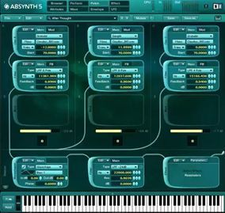
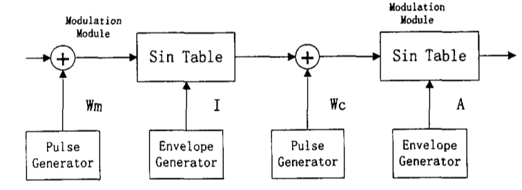
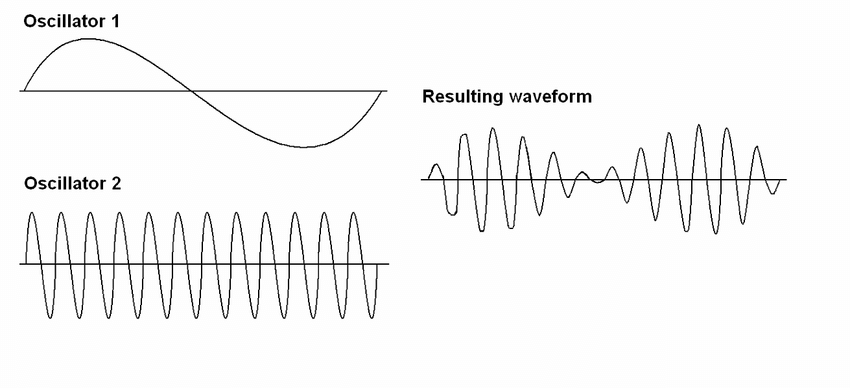

# MIDI与合成器

参考文档：

[Constructive Synthesis](http://thewessens.net/synthbook/#constructive-synthesis)

[YAMAHA合成器参数说明书](https://tw.yamaha.com/files/download/other_assets/4/330184/cp4cp40_synth_zh_pm_a0.pdf)

[MOX6/MOX8说明书](https://usermanual.wiki/Yamaha/mox6mox8zhrmb0.4063800285.pdf)

## 概述

MIDI 是乐器数字接口(Musical Instrument Digital Interface)的简写，是音乐设备和计算机软件之间交换数据信息和控制消息的数据通信协议。现已广泛应用于计算机的多媒体应用、游戏和专业音乐系统中。MIDI的核心技术是合成。目前在此技术上比较领先的是美国的Sonic公司和日本的YAMAHA、ROLAND公司。

### 历史背景

在还没有制定MIDI标准之前，在80年代初，数字音乐迎来了第一个繁荣期。但同时也相应出现了另一个难以解决的问题，那就是各厂家生产的电子音乐设备(主要是合成器)相互之间不能进行数据通信，或者这种数据通信会产生误差。原因是各生产厂家都按照自己的规格生产电子乐器。当单独使用某一厂家的设备时，还不会遇到什么问题，可是当同时使用几家公司的设备构成一个数字音乐系统的时候，麻烦就来了。怎么使一台美国E-MU的音源在日本ROLAND的键盘上弹奏一个标准的A调呢？因此当时若有作曲家创作了一首电子音乐作品，那么他只能在自己的设备上孤芳自赏了。所以人们急于寻求一个国际统一的标准，MIDI协议的概念就是在这时候出现的。它定义了一个统一的协议，使MIDI数据可以被精确地传输。此后，所有的商业电子乐器的背后都出现了MIDI硬件接口，乐器之间也就不再存在“语言障碍”。今天凡是具有MIDI接口的乐器都遵循这个协议。

## MIDI硬件规范

MIDI设备一般都会带的3种MIDI端子：MIDI OUT 输出信号，MIDI IN 接收信号，MIDI THRU（穿越）用于菊花式链接多个MIDI设备，以将接收的信号再传给其他设备。通过这3种接口，多台MIDI设备通过此连接方法可以进行同时演奏。MIDI设备一般都是用5pin DIN接口来连接，现在USB比较普及。大多数设备直接用USB即可。

菊花式链接设备：

方法一：设备1的THRU连设备2的IN，设备2的THRU连设备3的IN。

方法二：设备1的OUT连设备2的IN，设备2的OUT连设备3的IN。

MIDI控制器：当作乐器使用的一种设备，它能把演奏转换成实时的MIDI数据流。

MIDI音序器：允许MIDI数据被捕获、存储、编辑、组合和重奏的装置。

MIDI数据流是单向异步的数据位流，常由MIDI控制器产生，比如乐器键盘、吉他等；也常由MIDI音序器产生。

## 在DAW宿主软件中的使用

如果要在DAW宿主里播放MIDI，一般要在DAW宿主软件中建立一个MIDI轨，在这个MIDI轨道里输入MIDI音符。这时候演奏是没有声音的。这是因为MIDI本身只是电子信号。并没有音源，所以要再建立一个乐器轨道。然后把它们连接起来才可以正在的播放。 这时候就要弄清楚MIDI IN 和MIDI OUT了。建立了乐器轨道之后，在宿主软件中把MIDI IN设定为刚才输入好的MIDI轨道，然后MIDI OUT就是我们建立的音源乐器轨。这时在播放一下就有声音了。

## MIDI协议

MIDI是由美国Sequential Circuits 公司的David Smith提出，并于1982年在国际乐器制造者协会的会议上通过。1983年MIDI协议1.0版正式制定出来。1991年又公布了“通用MIDI协议”，即[MIDISpec1991]。[MIDISpec1991]中定义了标准的硬件和数据格式。

标准的MIDI文件是包含**MIDI事件（events）**的数字文件。事件只是一个**MIDI消息（messages）**，但带有一个指定事件timing的附加信息。附加的计时信息是字节数组，指示何时执行消息所描述的操作。换句话说，一个标准的MIDI文件不仅指定要播放哪些音符，而且还指定何时播放每一个音符。有点像乐谱。

标准MIDI文件中的信息称为**序列（sequence）**。一个标准的MIDI文件包含一个或多个**音轨（tracks）**，而每一个音轨通常都包含一个乐器所演奏的音符。**音序器（sequencer）**是一种软件或硬件设备，可以读取序列，并在正确的时间发送序列中的MIDI消息。音序器有点像管弦乐队指挥：它拥有所有音符的信息，包括它们的计时，并告诉其他实体何时演奏这些音符。

**即Sequencer具有一个Sequence，而Sequence包含一组Tracks，而Track包含一组MIDI Events。**

### MIDI 消息(Messages)

MIDI消息用于MIDI设备间交换信息。除实时和专用消息外，一个MIDI消息通常是由一个8位的**状态字节（status bytes）**和一或者二个**数据字节（data bytes）**构成的。

#### 两大类消息

##### 通道消息（Channel Messages）

MIDI通道消息就是和MIDI通道有关的消息。MIDI通道消息包含和演奏有关系的通道声音消息和通道模式消息。

通道消息在状态字节中4位用于通道消息的类型，另个4位用于指定通道编号（channel number），因此共有16个MIDI通道。

##### 通道消息的类型

通道消息的类型有两种：

* 通道声音消息(Channel Voice Messages)。用于控制乐器的声音,是通过声音通道发送的。它包括音符起始、音符终止、控制变化等各种消息。
* 通道模式消息(Channel Mode Messages)。用于决定乐器对声音消息的反应方式，由乐器的基本通道发送。它包括Omni方式开、Omni方式关、全部音符关等各种消息。

##### 主要消息

|                                 | 介绍                                                         | 详解 |      |      |      |
| ------------------------------- | ------------------------------------------------------------ | ---- | ---- | ---- | ---- |
| Note Off                        | 松开键盘时发出的信息，用来阻止音的发音                       |      |      |      |      |
| Note On                         | 按下键盘的瞬间发出的信息，包含音高、强弱                     |      |      |      |      |
| Poly Key Pressure               | 按下键盘之后，在不松开的状态下增加或减少力度可以使音色发生变化的消息 |      |      |      |      |
| Control Change                  | 乐器演奏时的音色变化、音高变化、柔音等信息，共有0-119种消息  |      |      |      |      |
| Program Change                  | 用来呼出音源或效果器预制好的音色、奏法、可快速进行切换的消息 |      |      |      |      |
| Channel Pressure                | 对于和弦音来说，按下键盘后的力度强弱变化产生的音色变化       |      |      |      |      |
| Pitch bend Change（弯音轮控制） | 吉他和管乐器的弯音奏法控制消息                               |      |      |      |      |

#### 系统消息

MIDI系统信号信息就是和MIDI系统设备有关系的信号。它包含了各种系统设定的相关信息。 

系统消息不是发给某个特定通道的，因此状态字节中不含通道地址。

##### 系统消息的类型

系统消息的类型有三种：

* 系统共同消息(System Common Messages)。系统共同消息是发给系统中全部接受器的,主要包括选歌、系统专用结束标志、乐曲位置指针和调谐请求等消息。系统实时消息是发给系统中全部接受器的,主要用于MIDI组件之间的同步。它们仅含状态字节,没有数据字节。
* 系统实时消息(System Real Time Messages)。系统实时消息可以在任何时刻传送,甚至可以在其它由两个或更多字节组成的消息之间插入系统实时消息。
* 系统专用消息(System Exclusive Messages)。系统专用消息可包含任意数目的数据字节,由一个EOX(专用结束符)或任意一个其它状态字节(系统专用消息除外)结束。因此,它常用于数据的批传送。系统专用消息包含一个厂家识别号(ID),后面紧跟按厂家定义的数据结构的数据。

#### MIDI事件处理流程

发送（transmit）MIDI事件：由MIDI设备的输入端口（input port）、音序器输入或直接软件生成等

接收（receive）MIDI事件：MIDI事件会发送给合成器（synthesizer）或MIDI设备的输出端口（output port），它们会进行音频合成。合成器通常会控制着16个MIDI通道，并将其收到的消息根据消息指定的通道编号发送给指定通道，通道再根据这些消息合成音乐。但光有消息还不足以生成音乐，还要指定**乐器（Instrument）**（模拟真实世界的乐器或音响效果）来演奏。而合成器通常就包含着一组预设（presets）的乐器，或通过soundbank文件导入。

### MIDI数据类型(Data Types)

MIDI数据类型包括状态字节(Status Bytes)和数据字节(Data Bytes)。

状态字节是一个8位二进制数,最高位(MSB)为1。状态字节用于识别消息类型,也就是表明随后的数据字节的作用。除实时消息外,新的状态字节发出时,接受器会立即采用此状态,即使上一个消息没有结束。

运行状态(Running Status)。运行状态仅适用于声音和方式消息。当一个状态字被接收和处理时,接收器将维持这一状态直到另一个不同的状态字节被接收。因此如果要重复相同的状态字节,它可以被省略,而仅发送数据字节即可。

不执行状态(Unimplemented Status)若接收器不执行某功能,则忽略刚刚接收的状态字节,随后的数据字节也被忽略。

未定义状态(Undefined Status)不应使用未定义的状态字节。尤其应注意防止电源接通和断开时发出的非法消息。收到未定义的状态字节时,它将与随后的数据字节一起被忽略。

### MIDI通道（Channel）

通常每个MIDI通道(不应该与音频通道相混淆)被用来给不同的乐器（instrument）发送音符（notes）。例如，两个常见的通道消息是Note On和Note Off，Note On表示开始一个音符的声音，Note Off表示停止它。这两个消息各占用两个数据字节：第一个指定音符的音高，第二个指定音符的“速度”（velocity）(假设是键盘乐器，其代表按键被按下depress或释放release的速度)。

## 合成器（Synthesizer、Synth）

### 四大类别

* 模拟信号具有近乎无限的分辨率、自由流动的连续信号。换句话说，扬声器产生的摆动与振荡器经过滤波器和放大器时所产生的摆动“相似”。
* 数字信号是用1和0来创建的，它们代表信号值中的特定步骤。

如果合成器的整个音频路径都是纯模拟的，则通常将其标记为“模拟”。这意味着振荡器，混频器，滤波器和放大器是真正的模拟。

通常，控制路径（与音频路径相反）中的合成器组件（例如LFO，包络和MIDI）是数字的。但我们仍将合成器视为模拟，因为您听不到数字成分，只听到它们对模拟音频成分的作用。

如果合成器具有可以完全绕开的数字效果，而信号没有被数字化，我们也认为它是模拟的。

如果某些音频跳线部分是数字的（例如具有数字振荡器但具有模拟滤波器的合成器），则我们将该合成器称为“混合”。

如果合成器在其音频路径中具有所有数字分量，则它被认为是数字合成器。

#### 模拟合成器(Analog Synthesizer)

最早的合成器都是模拟的，出现在现代计算机的鼎盛时期之前。这些设备依靠特殊设计的电路，结合特定的、电子元件(如晶体管、电阻和电容)来创造和修改声音。在大多数情况下，20世纪60年代和70年代设计的合成器都是模拟的。

模拟合成器是靠电子振荡发出声音的，它通常来自于内部电压控制振荡器(VCO)所造成的电容和电感间的微观电子振荡。这就导致模拟合成器的电子元件会给最终的声音带来轻微的不稳定性，且大部分模拟合成器的面板上充满了无数用来调节音色的旋钮，操作十分繁琐，在调出满意的效果后还需精确的记录下所有参数以便日后再用。而且这些合成器往往体积巨大、价格昂贵，所以在舞台上往往见不到它们的影子。

著名DJ&制作热Deadmau5工作室中价格不菲的模拟合成器：

#### 数字合成器(Digital Synthesizer)

数字合成器则有的在最初就使用数字信号(如采样回放法合成器)，有的则是在处理振荡信号的某个步骤中开始使用数字计算的方法，从而将模拟信号数字化。虽然数字合成器可以被认为是“模拟”了真正的模拟合成器，但数字合成器最初研发的出发点，就是希望音乐家们能更稳定更完美地演奏出模拟合成器的音色。

现在的数字合成器光是预制音色就有成百上千种，用户甚至还可以在网上下载更多的大师音色，演奏时只需选择好保存的音色按下确定键即可。数字合成器应为体积小、音色易于调节和价格便宜等优点深受广大音乐人喜爱，因此数字合成器也成为了舞台上键盘手们的心头爱。

Roland最新推出的模拟合成器Boutique系列 复刻了许多传奇合成器：

模拟合成器往往比数字合成器更昂贵，而数字合成器通常具有更多的功能，参数和声音选项。数字合成器通常比模拟合成器具有更多的复音，因为您必须为复音的每个附加音符复制许多音频路径电路。在数字合成器上，附加说明仅要求加快其内部处理速度。这就是为什么和弦数字合成器几乎总是比同等功能的模拟等效器便宜的原因。

因此，如果数字合成器通常更便宜，功能更多，选项更多，复音性更轻，重量更轻，那么为什么在地球上有人会花更多的钱购买模拟合成器呢？答案是，尽管数字合成器在模拟模拟合成器方面每年都在不断提高，但是在某些情况下，模拟合成器听起来和对您的演奏响应更好。例如，除了非常高端的数字合成器外，模拟合成器上的高音会更清晰。这是因为数字合成器需要具有极高的处理速度，才能在没有混叠的情况下演奏具有大量谐波的高音。当数字合成器的采样率不低于其尝试产生的最高频率的两倍时，就会发生混淆。模拟合成器不使用采样，因此可以避免混叠。当以音频频谱的速率（大约20Hz至20kHz）对一个组件与另一个组件进行调制时，模拟合成器也更好。再次是因为混叠。但是，请不要因此而劝阻您不要考虑数字合成器。在您的音乐用途类型中，您极有可能不需要音符或调制来达到这些极限。

就功能而言，某些全模拟合成器（尤其是那些允许您使用电缆手动修补组件的合成器）不具有保存预设的功能。这对您来说可能很重要，也可能不重要，这取决于您是否现场演奏，或者仅在录制情况下才重要。大多数数字合成器都允许许多工厂和用户预设。除最高端的模拟合成器外，数字合成器通常具有更多的LFO和包络，并且如上所述，它们通常具有更多的复音和多音色层。

#### 模块合成器（Modular Synthesizer）

模块化合成器一般都是模拟合成器。简单说，就相当于把合成器的各个部件取出来单独做成了块，然后你就可以通过上面的输入/输出/同步等接口，用跳线形成电路，然后得到需要的声音。Eurorack就是著名的模块化合成器系统。

### 大致的工作原理

大多数的软合成器(硬件合成器也是的)是通过模拟合成器创造声音的，实际上许多数字合成器的数字合成方法就是基于模拟合成原理的。模拟概念可以帮助你理解那些合成器的工作原理。

合成器是用来创造声音的，不管怎么创造，都要涉及到3个原理：音高(pitch)、音调(tone，或者称之为音色timbre)和响度(loudness)。模拟合成器也有这3个阶段的处理过程：

1. 音调发生器(Tone generation)：从DAW中输入MIDI音符进入**震荡器**，通过音量控制发出持续不断的声音
2. 音调形态(tone shaping)：相当于一个**滤波器**，每一种波形所包含谐波的不同就决定了它们各自音色的不同，例如：正弦波、三角波、方波、锯齿波、噪声等。最后通过AMP（音量控制）控制音量，但是仍不足以让一开始输入的声音断掉
3. 音量形态(volume shaping)：通过**ENV（包络发生器）**控制输出音量，四段包络分别叫做起音（attack）、衰减（decay）、保持（sustain）、释音（release）
   * 起音（attack）：决定了声音从发出的初始音量到设定的最大音量所需的时间长短
   * 衰减（decay）：声音到达最大音量后到发生衰减的时间间隔长短
   * 保持（sustain）：衰减后的声音音量高低程度
   * 释音（release）：声音从原有保持的音量慢慢到最小音量的时间长短
4. 效果器调节：先进入delay（延时）、后进入reverb（混响）、最后随个人喜好选择是否加载driver（过载）
5. 连接低频振荡器：将LFO（低频振荡器）连接在自己想控制的地方即可，随着LFO的震荡，相对应连接的模块就会跟随其深度与频率两个参数而震荡。频率决定着发出波形的频率，深度决定波形的振幅

### 五大常见类型

|                                       | 作用                                                         | 特点                       | 例子                                                         |      |
| ------------------------------------- | ------------------------------------------------------------ | -------------------------- | ------------------------------------------------------------ | ---- |
| FM合成器（频率调制合成器）            | 它是以一个拾音信号频率控制另外一个拾音信号频率。它可以通过很多的振荡器互相调制，再通过不同的声音包络让声音的动态变化达到最大化。 FM合成是根据傅立叶原理——一个任何形状的波形都可以用几个正弦波的叠加来解释。它通过正弦波来模拟各种乐器的波形。但是由于民用市场上，声卡的FM振荡器只有2到3个，因此导致效果很差，坏了FM的名声。实际上，专业领域中FM一般有20个左右的振荡器，效果已经很好了。 | 较难调制，但效果极具吸引力 | FM8合成器             |      |
| 减法合成器（Subtractive Synthesizer） | 作为传统合成器类别，它通过把所形成的声音通过滤波件减去一部分。目前大部分合成器都会有滤波这一功能，减法合成器代表了传统的合成器类别 | 音色专业、音色便于调制     | Sylenth合成器、ANA合成器   |      |
| 采样合成器                            | 由各个采样音色组成，采样通常说来就是一段声音的样本，比如说钢琴中央C的声音。假设如果所有的声音都可以被记录下来，那么当合成时，只需要回放声音样本就可以了。因此，如果可以的话，可以完全记录下钢琴88个键的声音，到时候回放波形就可以了，效果会很逼真。 加载音色后看不到波形的调制界面，只能进行简单的音量包络控制、效果器以及最后一次的滤波处理 | 简单易上手                 | Nexus合成器、Ominisphere合成器   |      |
| 波表合成器（Wavetable Synthesizer）   | 在减法合成器的基础上，赋予几款基础波形复杂化，并且在此基础上再对声音进行调制。 采样合成的优点是可以提供最完美的还原效果，但是有一个很大的缺点——容量问题，如钢琴有88键，还有各种不同的音量，那么采样的总量将达到88*N个，假设一个采样需要1MB，这么多的采样需要多大？因此，波表合成产生了。波表合成就是通过一定的算法用有限个真实的采样模拟无限种采样的效果——即真实乐器的效果。波表合成对采样进行升调，降调，增益（提高音量）或衰减（减少音量）的处理，然后输出处理后的波形。波表合成的缺点之一是有些设备的波表是固定的，无法更换。 | 可塑性更强                 | Native Instruments的Massive合成器、Serum合成器   |      |
| 粒子合成器（Particle）                | 将声音打散后重新组合成粒子，同样的在采样过后再进行其他合成器都有的效果器处理、滤波处理等等，也可以理解为是采样合成器的一种延伸 | 灵活性高、可自制想要的音色 | iZotope合成器         |      |
| 其他合成器                            | 目前有几款合成器的特殊之处就是他们具有FM调制、波表，也可以放入采样采样 | 可塑性强                   | Absynth 5、Zebra 2   |      |

目前MIDI合成器的类型主要有两种：

* 频率调制(Frequency Modulation)合成。FM合成是使高频振荡波的频率按调制信号规律变化的一种调制方式。它从理论上讲虽然可以产生出任何声音,但是用到实际上就不是件容易的事了。这是因为乐器的某个音调除了由其基调组成外,还包括各种音色。而各种音色是很难用几种音调去模拟的。所以大家在听由FM合成的MIDI音乐时,都感觉到不真实。 
* 波形表(Wavetable)合成。波表合成方式中，每种乐器对应一种波形或多种波形，合成音乐时以查表方式获取乐器波形，数据经合成后通过D/A转换器和扬声器输出。相对于FM合成，波表合成具有以下几个优点：
  * 由于采用的是实际乐器的采样，音乐的效果更逼真
  * 成本低。硬件波表是把波表存储在ROM中，而且现在也有软件波表
  * 复音实现起来更加容易

### 组件（Components）

由Xfer Records出品的serum合成器是现如今大多数电子音乐制作人的必备合成器：

合成器可以包括用于生成，成形和调制声音的各种组件。

振荡器通常会产生具有不同音色的波形（例如锯齿波，正弦波或脉冲波）。

低频振荡器（LFO）产生用于调制参数的波形，例如振荡器的音高（产生颤音）。

压控滤波器（VCF）–通常在包络或LFO的控制下，“塑造”振荡器在频域中产生的声音。这些对于减法合成是必不可少的。

包络发生器–提供包络调制，以在时域中“成形”所产生音符的音量或谐波含量，其主要参数为起音，衰减，维持和释放。这些用于大多数形式的合成中。

ADSR控制由 包络发生器. 压控放大器（VCA）控制音频信号的音量或增益。可以通过其他组件（例如LFO和包络）来调制VCA。

由一个（或多个）混合VCO产生的信号已通过滤波器和LFO修改，并且其波形已由ADSR包络发生器整形（轮廓化）后，再传递至一个或多个压控放大器（ VCA）。 VCA是一种前置放大器，可在将电子信号传递到外部或内置功率放大器之前对其进行增强（放大），以及使用衰减器控制其幅度（音量）的手段。 VCA的增益受以下因素影响： 控制电压 （CV），来自信封生成器，LFO，键盘或其他一些来源。 

#### 振荡器（Oscillator、OSC）

振荡器通过各种电路通电后发生微弱振荡而产生的声音。以SERUM合成器举例：

* Waveform：波形选择——正弦波、三角波、方波、锯齿波、噪声等
* Level/Amp/Volume：音量——控制单独振荡器的音量
* Pan：声相
* Detune：音高偏移——通过音高偏移使原本类似单声道的音色变成多个不同波形的音高，通过声音波长的相位效果导致一种宽广的感觉，多用于pad音色上
* Phase：波形相位——播放波形的时长控制
* Stereo：立体声扩展——拓宽立体声或将振荡器的声音变成单声道的效果
* Unison/Voices：声音数——当前振荡器可以产生的声音数量
* Pitch：音高调节——音高变化程度决定了三类的调制类型，分别是Oct（八度音高）、Note（半音音高）、Fine（音高微调）
* Retrigger：波形重置——通过打开波性重置，使每次的音符都会限制在同样的位置来产生声音，常用于贝斯上
* WT（Wave Table） Position：波形变化——针对于波表合成器，可达到256层的声音波形数，再通过WTP选择播放任意一层的波形音色
* Ratio/Coarse：泛音列音高变化——针对于FM合成器，它没有上述的三类音高调节，而是直接根据泛音列而产生

#### 滤波器（Filter）

滤波器的作用是滤除音频中不必要的模块，以Serum为例，蓝色部分代表被滤除的部分

* Cut off：截止频率。体现在凸起频点的频率位置
* RES/Resonance：Q值（截止频率前的突起）
* 滤波模式/滤波器类型：Lowpass（低通）、Highpass（高通）、Bandpass（带通）、Peak（截止频率的增益）、Notch（陷波）
* Drive：调大滤波声音，通过滤波器进行过载，让声音产生饱满的效果

#### 包络（Envelope、Env）

包络（Envelope）：传统的ADSR包络就包括起音、衰减、持续以及释音。而目前包括起音（attack）、保持（hold）、衰减（decay）、持续（sustain）、释音（release）、延时（Delay）。

* 起音（attack）：决定了声音从发出的初始音量到设定的最大音量所需的时间长短
* 保持（hold）：决定了起音结束后还可以保持的时间
* 衰减（decay）：声音到达最大音量保持后到发生衰减的时间间隔长短
* 持续（sustain）：衰减后的声音音量高低程度
* 释音（release）：声音从原有保持的音量慢慢到最小音量的时间长短
* 延时（Delay）：决定了声音输入到触发音量的持续时间

当然通过包络不仅仅可以控制音量，还可以通过它来控制滤波器。

#### 低频振荡器（Low Frequency Oscillator、LFO）

它可以产生人察觉不出的低频信号，用于调制合成器中其他参数。多用于重复性、背景性的音色，从而达到增加动态的效果。

* Rate：速度——数值越高，声音变化速度就越快
* Wave：波形选择——含有锯齿波、方波等等
* Sync/BPM：速度锁定（节奏模式）——大部分合成器的速度与宿主绑定，按钮Sync即代表与宿主同步
* Amp/Gain/Depth：程度/深度——波形的深度
* Attack/Rise：起始时间——LFO被完全施加到参数上的时间
* Offest/Phase：错位——通过拖动波形达到声音的变化
* Delay：延时——LFO的开始启用所需要的时间
* Trig/Restart/Free：自由模式——LFO会完全独立的开始运转，音高就变的不确定了，一般在歌曲中会让LFO不断运行作为节奏片段

#### 路由（Routing）

#### 步进器（Sequencer）

#### 琶音器（Arpeggiator）

#### 效果器（Effects）

### 五大波形（Waves）

大部分音色都是基于五种不同的波形，同时也对应了五种不同的电路设计与五种音色。

|                           | 介绍                                                         | 图例                                                         |
| ------------------------- | ------------------------------------------------------------ | ------------------------------------------------------------ |
| 正弦波（Sine Wave）       | 正弦波是最简单、最单一的波形，只有基频没有谐频，声音会比较干净透彻。如果把我们平时听到的所有声音，按频率分割，我们就会得到不同频率的正弦波。相反的，理论上正弦波也可以模仿出所有的声音。在日常生活中，电话拨号音就是最常见的正弦波。 在音乐制作中，正弦波常被用来制作lead与sub bass音色，仅仅是一个简单的正弦波，加一点点混响，便是一个非常出色的独奏lead音色。由于正弦波的频率单一，它也是做加法合成的好素材，是中声部的和声层音色的不错选择。 |  |
| 方波（Square Wave）       | 方波拥有奇数倍的谐波，声音比较有特色，90年之前的8bit卡带游戏机音乐首选音色。超级马里奥、90坦克等游戏的背景音乐和动作音效都是由它完成，最具代表性的就是吃金币的声音。  方波与黑管、萨克斯等单簧片类乐器的音色具有类似的谐波，当他被用作lead音色时，旋律一般会继承单簧片类乐器的灵活快速。若写作大胆一些，可以尝试快速的上行下行大跳，甚至超八度。 |  |
| 锯齿波（Sawtooth Wave）   | 由于泛音丰富，未经修饰的锯齿波音色非常刺耳，也正是这一原因，锯齿波被广泛用于当下EDM的各类音色，各种lead、pad类音色都是在锯齿波的基础上进行滤波、调制等处理而产生的音色。锯齿波的pad常常还会加上一个与底鼓有关的侧链压缩，针对底鼓音量进行闪避。 |  |
| 三角波（Triangular Wave） | 声音与方波类似，但是没有方波那么多的高频谐波，因此音色也相对比较闷。三角波同方波一样也经常出现在8bit游戏音乐中，一般担任贝斯声部。魂斗罗第一关经典bgm就是用三角波演奏了一个非常快速灵活的贝斯声部，以造成一种热血又紧张的氛围。 |  |
| 白噪音（White Noise）     | 小时候家里的电视机没信号了屏幕上就会跳出密密麻麻的雪花，声音也变成了呲~~~~~的噪音。这个声音就是白噪，白噪没有音高，频谱也最复杂。拿它来做减法合成再合适不过了。 |                                                              |

#### 与谐波的关系

因为每种波形都包含了不同的谐波，这些谐波决定了不同的波形都有自己独特的声音。每个声波的真实音高都取决与他的基波。比如正弦波听起来非常清澈纯净，就像笛子一般，这是因为正弦波没有谐波，完全都是基波。也就是说谐波越多，音量越小。所以锯齿波声音非常丰满像铜管一般，而方波的声音却像单簧管一般。三角波有点像正弦波，但他比正弦波多了一些谐波。脉冲波也比较常见，它听起来鼻音很重，就像双簧管。大部分的震荡器都有音高的控制让你设定输出的音高，这就像一个八度音阶的调节器。键盘或音序器发出的音符信息都是通过震荡器来创造实现的。

### 合成器的主要评判标准

* 容量。理论上，一个音色的容量越大，还原越真实。因此，容量对于MIDI合成器的好坏是个很重要的衡量标准。
* 复音数。就是一个设备可以同时发出多少个声音，比如Sound Blaster Live!宣称它的复音数为1024，也就是可以同时发出1024种声音。
* 功能（尤其算法）。可以说一个MIDI合成器的好坏，采样决定60%，算法决定40%。看待算法的很显著特征就是看它可以提供多少个参数。一般来说，参数越多，可供调节的余地越大，效果也就越好。

### FM合成技术

FM合成利用频率调制产生各种乐器的音色,一种声音的音色在很大程度上依赖于其谐波的频率和振幅。FM合成器对声音的音色提供简捷而有效的控制。频率调制FM合成器包含18个操作单元。调频合成需要两个操作单元：调制单元和载波单元。

每个单元有三个功能模块：脉冲产生器；包络产生器；正弦表。每个单元具有生成一个正弦波的能力，正弦波的频率依赖于脉冲产生器，振幅依赖于包络产生器，如图所示。

调制单元的输出用于调制载波单元。载波单元的结果输出波形包含谐波，其频率等于载波频率与调制频率各种倍数的和值或差值。谐波的振幅依赖于调制波形的振幅。通过改变调制单元的频率和振幅，就可以改变FM合成器产生的音质。 

### **1.VCO (Voltage Controlled Oscillator) 压控振荡器**

压控振荡器，也就是用电压控制音高的振荡器，依靠振荡电路产生波形信号。VCO是最早的振荡器形式之一，出现在了几乎所有的模拟合成器中。

### **2.DCO (Digital Controlled Oscillator) 数控振荡器**

数控振荡器，使用数字时钟电路来控制音高，可以保证音高的绝对稳定（这是VCO的一大难点），不过由于原理限制，难以实现FM调制和AM调制，首次出现在Roland Juno-6上，在之后的Korg Poly 800、Prophet Rev2等产品上都有它的身影。

### **3.Mixer 混音器**

混音器，一般出现在振荡器和滤波器之间，用于混合多个振荡器和信号源，并调整它们的音量。信号源一般包含振荡器、噪声源、环形调制。有些合成器的Mixer可以被过载，产生谐波失真(Harmonic Distortion)，从而得到非常饱满的声音，这一点在Minimoog和同时代的许多产品上都有体现。

### **4.Filter 滤波器**

滤波器，用于将声音信号的高频或低频部分滤除的电路。滤波器当初并未为合成器而设计，但却在合成器上找到了一片天地。合成器滤波器独特的地方在于，其并不追求声音过滤能力，弱反馈或者对声音的影响，唯一的考量是声音品质。滤波器是减法合成器的心脏，也是“减法”一词的由来。不同的滤波器有着自己的声音特点，带来了丰富的声音。常见的滤波器有低通(Low pass)滤波器、高通(High pass)滤波器、带通(Band pass)滤波器、陷波(Notch)滤波器、梳状(Comb)滤波器。生活中也有物理的滤波器，例如当隔着一扇门听音乐时，声音很闷，就是因为声音的高频部分被吸收了，这就是一种低通滤波器。

### **5.Cutoff 截止频率**

截止频率，这是滤波器上的参数，表示滤波器开始发挥作用的频率，即高于/低于某个频率的声音会被滤除，对于带通、陷波滤波器则是保留/滤除某个频率附近的声音。

### **6.Resonance 共鸣**

共鸣，也是滤波器的参数。滤波器通过将输出的信号送回滤波器来强调某一个频率的声音，这个参数有着不同的名称，MiniMoog上叫做Emphasis，MS-20上叫做Peak。当共鸣高于100%时，滤波器可以自激震荡，会在无信号输入（实际上是模拟电路中的噪音）时产生一个截止频率的正弦波，配合适当的调制，常被用于制作Kick音色，以及一些效果音。

### **7.Envenlope 包络**

包络，合成器中最重要的一个调制源。其能产生一个随时间阶段性变化的调制值（调制：合成器中各组件在参数上的相互影响成为调制），用来营造各种动态变化效果。常见的Envenlope是ADSR型，有着4个参数：Attack（起音时间），Decay（衰减时间），Sustain（保持音量），Release（释放时间），其中Sustain是唯一一个与时间无关的参数。举个例子，Pluck音色需要接近0的Attack来达到快速的反应，之后接一个较为快速的Decay以及为零的Sustain来模拟声音快速消去的效果，Release一般和Decay相等，这样就算短按一下琴键，也能得到和长按同等长度的声音。如果是Ambient风格的长音，那就需要非常长的Attack时间。

包络可以调制各种参数，例如进行振荡器同步时，用包络调制振荡器2就可以得到经典的Sync音色。经典的模拟合成器有两个包络，一个调制AMP，另一个调制滤波器。

### **8.LFO 低频振荡器**

全称Low Frequency Oscillator。曾经用来指代频率低于20Hz的振荡器。由于其处于次声波频率，所以自然不是用作声音源，而是用来进行调制。例如，用2Hz左右的LFO进行音高调制，就可以达到颤音的效果，用LFO调制脉冲宽度，就可以得到丰满的PWM声音。不过现在的LFO早已突破次声波的领域，现在已经轻轻松松地达到了1kHz以上。由于调制速度非常快，这已经达到了FM的领域，产生的声音相当有金属感。现在还有一种步进LFO，其实本质上就是一个音序器，但是其不会触发音符，而是产生不同的调制值。

### **9.AMP 放大器**

Amplifier。这个很好理解，模拟合成器中的振荡器、滤波器都是真实存在的电路，而音频在其中的存在形式自然就是电信号。从实用的角度出发，电路中的电流是非常弱的，很明显你不能将其直接接到输出（这么做还会产生外部回路致使什么声音都发不出来），所以就需要一个放大器将电信号放大到线路水平（Line Level），并起到内外信号的隔离作用。通过调制AMP，就可以得到音量的动态变化。

### **10.FM 频率调制**

Frequency Modulation。既是一种调制手段，也是一种合成原理。

在调制手段中，我们将调制对象为频率（振荡器频率、滤波器频率等）的这种调制称为FM调制。不过这是广义上的描述，为了更精确地描述，我们一般把调制源为音频频率的信号的调制称为FM调制。例如，用振荡器1的音高调制振荡器2的音高，这就是一种FM调制。此举在模拟合成器中可以得到富有金属感、失真感的声音。

而FM也是一种合成原理，大名鼎鼎的DX7就是一台FM合成器，不像模拟合成器，DX7有6个正弦波振荡器，它们互相进行FM调制，叠加得到独特的声音。其没有滤波器，而控制音量的AMP参数也集成在了每个振荡器内部，著名的DX7 Bell就是利用了FM做出的。FM十分擅长合成敲击声（例如马林巴琴）、还有击弦乐器的声音，同时也是音效合成中必不可少的部分。

几乎所有的FM合成器都是数字合成器，因为FM合成中的FM调制对振荡器音高的稳定程度要求非常高，并且为了音色一致，振荡器的起始相位也是一致的，这是模拟合成器做不到的，所以虽然模拟合成器中也有FM功能，产生的声音却大相径庭。

### **11.Operator**

Operator是FM中的振荡器，是为了与模拟合成器区分开来而取的名字。由于FM是一个振荡器的输出用来调制另一个振荡器的音高，所以总会有一个被调制着和调制源，我们将作为调制源的振荡器称为**Modulator**，而被调制的振荡器称为**Carrier**。一个典型的Operator有以下参数：Coarse、Tune、Fine、Level、Envenlope。Coarse是大体的音高调整，不过与模拟合成器上的4’ 8’ 16’的八度关系不太一样，Coarse调整的是相对于基础频率的倍数，假如你谈的是标准A，那么Coarse为1时，就是440Hz，Coarse为2时是880Hz，当Coarse为3时，就是1320Hz了。

Tune和Fine的含义与其在模拟合成器中的意义是一样的，是对音高进行半音和微小量的调整。

Level是个很重要的参数，当一个振荡器不调制别的振荡器调制时（也就是作为声音输出时），Level就意味着音量。但当这个振荡器正在调制别的东西时，它的输出音量就是调制的深度Depth（换句话说，就是参数的改变量），对Level的各种调制构成了FM合成的关键一环。

### **12.Feedback 反馈**

这也是一个多重含义的词语，在带有外部输入功能的模拟合成器中，你可以将辅助输出（例如耳机）接到音频输入中，这种将输出返回到输入的接线方法就叫Feedback。模拟合成器的过载非常独特，因为模拟电路的混音器通常会以一种悦耳的方式产生过载失真。Minimoog上就可以运用这个技巧，得到非常非常厚重的低频。

另外一种Feedback是FM合成器上的。一个Operator在没有被调制的情况下可以自己对自己进行FM调制，这就是FM上的Feedback。使用Feedback可以轻松创建出带有复杂谐波的波形，丰富了FM的声音范围，调制Feedback也是FM的一个技巧。

### **13.Sync 振荡器同步**

这是模拟合成器中非常基础和常见的一个功能，当你有两个振荡器时，你可以让一个振荡器与另一个振荡器同步，也就是振荡器1和2先自由运行，等到振荡器1完成一个周期以后，将振荡器2归零，再与振荡器1同步开始。

如此以来便可以使振荡器2始终拥有与振荡器1相同的基础频率（除非振荡器2频率更低），这样通过调制振荡器2的音高就可以改变总输出的谐波，从而得到富有电子味和摇滚味的声音。举个例子，周董的本草纲目开头就用了Sync音色。

### **14.Ring Modulation 环形调制**

通过一个首尾相接的二极管电路（这就是环形一次的由来）实现振荡器1对振荡器2的AM调制（振幅调制，也就是一个振荡器的音量调制第二个振荡器的音量），这是一种非常低成本的得到复杂声音的方法，在合成器中非常常见。运用的得当可以获得带有金属感的Bell音色，用两个三角波进行环形调制可以实现很好的Bell音色。

### **15.Cross Modulation 交叉调制**

其实就是两个振荡器的其中一个对另一个进行FM调制，不过由于VCO的音高都不太稳定，所以进行交叉调制时的声音往往不那么具有音乐性，微量的交叉调制可以为声音带来更丰富的质感，大量的调制则可以创造出狂野的音效。

### **16.S&H 采样&保持**

这是一个早年合成器上的实验性功能，全称叫Sample&Hold，简单来说就是对一个信号源不断采样，将得到的数值（在模拟合成器中是电压值）作为调制源。如果你的采样速度非常快，那么就会得到和原信号一样的信号。不过S&H往往只有较慢的采样频率，采样可以通过键盘或者是LFO触发，也就是每按下一次键盘或者LFO走完一个循环后就取一个样。用S&H对噪音采样可以得到一段一段的不断变化的调制值，将其调制音高你就可以得到R2D2的声音:D

S&H往往还会有一个Lag参数，效果类似于滑音，每一次采样后的调制值会按照你设定的速度过渡过去而不是瞬间切换过去。

### **17.Keytrack 键盘跟踪**

本身是一个非常简单调制的方法，将键盘演奏的音高作为调制值就是了。其实，所有的合成器都是在用键盘的音高来调制振荡器的音高，否则当你按下键盘，振荡器的音高是不会改变的。Keytrack最常见的地方是滤波器中，这样演奏的音符越高，滤波器开的就越高。

当你将滤波器的共鸣开到最大，将其当作一个正弦波振荡器时，Keytrack就十分有用了，因为此时滤波器发出的音高就是Cutoff频率，当Keytrack开到100%时，你就可以用键盘来控制滤波器的声音了。

### **18.Unison 合奏**

复音合成器的功能。当你有两个振荡器时，你可以Detune它们，然后音高之差产生的相位变化就可以使声音更厚。如果你的振荡器有6复音，每复音有2个振荡器，那么这台合成器就有12个振荡器！如果将这12个振荡器放在一起用，那就能得到非常夸张的声音了。Unison就是这样，让复音合成器的所有声部演奏同一个音高，然后就像振荡器1和振荡器2的Detune一样，Unison模式下你通常可以控制Detune，也就是各声部间音高差异的量。

随着数字技术发展，数字合成器上上百复音是很轻松的事，所以Unison也非常容易实现，在JP-8000中，著名的SuperSaw音色就是7个锯齿波叠加在一起而成。在现代的Serum、Sylenth等软件合成器中，你可以非常轻松的创建Unison。

### **19.Wavetable 波表**

模拟合成器一般只有锯齿波、脉冲波（方波）、三角波作为基本波形可选，如果能扩充振荡器波形的数量，不久可以创造出更多声音吗？数字合成器的先驱者们就是这么想的，波表实际上就是将某种波形采样下来，再作为一个振荡器波形回放。所以这实际上就是一种带有采样的合成原理，由于只采样波形的一个周期，采样精度可以达到非常高，所以可以十分接近模拟合成器的音质表现。那为什么要叫“表”呢？因为很明显，单个波形还是太无趣了，如果想要PWM这种动态变化的声音，那么单个采样是无能为力的。所以，波表合成器中的一个波表实际上是**一系列**波形采样，你可以在一个波表里将PWM的各种宽度依次采样下来，回放时在这些波形中来回切换，就可以得到同样的效果了。波表一般是连续的，这样来回切换时声音是渐变的。波表振荡器的关键参数叫Position，也就是波表的位置，换句话说，就是这些波形中的哪一个在被播放，通过调制Position，就可以使声音不断变化。

波表由于是数字的采样，声音会显得冷而富有金属感，不过这正是波表合成器独特的声音魅力，Serum就是一个优秀的波表合成器。

### **20.Paraphonic 协音**

Paraphonic是Polyphonic的子集，后者指你能同时弹奏多个音符，而Paraphonic表示你弹的多个声音会通过同一个滤波器和放大器。不明白？想一想复音合成器，其实就是多个的单音的合成器叠加而成，每一个复音都是相互独立的，但是在Paraphonic的合成器中，只有振荡器是这样，所有复音的振荡器在这里合并在一起，通过同一个滤波器、放大器输出。这样的话，当连续弹奏多音，触发包络调制时，每次调制带来的效果会体现在所有音符上。比方说，当你做了一个Brass式音色，当你按住一些琴键再按下新的琴键时，新产生的声音应当是独立的，只有这一个音符的声音会再经历变明亮而有变暗的过程，但是在Paraphonic合成器中，所有的声音都会发生同样的变化，这减少了声音的多样性和真实性，所以Paraphonic往往是降低成本的选择。

## SoundFont

SoundFont是如今民用音乐制作领域中普遍采用的一种采样合成技术，特点就是可以随意更换波表和采样，因此这种技术拥有无穷的扩展力。除了创新AWE32级别以上的声卡支持SoundFont，现在很大一部分合成软件也支持SoundFont了。

## ADSR包络

ADSR包络主要有两个要点，概括如下：

* 循环技术的采用。由于声音的频谱特性在Sustain段改变极小,通过对采样声音段采用循环技术,节省了大量的采样数据存储所需的内存空间。
* ADSR包络的调制。根据声音的特性,采用ADSR包络对声音的振幅进行了调制。这样得到的声音效果与实际的声音效果非常接近。 

## 变调技术

为了减少采样的内存，可以采用变调技术，以达到从一种乐器的某一给定的音调的采样数据得到此乐器其它音调的目的。在实现变调技术的过程中，针对无线通信设备的特点，可以应用线性插值算法，并把线性插值算法和过度采样两者相结合，即一般情况下应用线性插值算法，而在最需要的情况下应用不同倍数的过度采样。线性插值算法对于许多需要变调的声音提供了一种可以接受的精度的数据，而且还不象其它复杂插值算法那样对处理器的性能提出过高的要求。采用过度采样，在回放过程中所选取的数据会更加接近真实的采样值。实践证明这种把线性插值算法和过度采样两者相结合的方法能够产生很好的音效。

## 分区概念

为了保持自然的声音，一种乐器的某一音调的采样只能用于一段区域的音调。为了覆盖整个乐器的音调，可以采用几个不同的采样，每一个采样用于一段区域的音调。这样产生的结果就是每种乐器都成为“多个采样”的乐器。通过分区概念的引入，既保持了自然的声音，又节省了大量的内存。触键力度分区是指针对不同的音调触键力度应用不同的采样。

## 音频编辑功能与手法

4.VariAudio修正音高
  5.音频素材的自动吸附
  6.Envelope(音量包络)
  7.FadeIn(淡入)与Fade0ut(淡出)使用技巧
  8.Gain(增益)
  9.NoiseGate(噪声门)
  10.Normalize(化)
  11.PhaseReverse(反相)
  12.PitchShift(移调)
  13.Resample(重采样)
  14.Revei’se(反转)
  15.Silence(静音)
  16.stereoF1ip(立体声转换)
  17.Time-Stretch(时间伸缩)

## 音频效果器与混音

 节 音频效果器综述
  1.怎样使用插入式音频效果器
  2.怎样使用发送式音频效果器
  课后练习
 第二节 常用音频效果
  1.EQ(均衡)效果器
  2.Reverb(混响)效果器
  3.Compress(压缩)效果器
  课后练习

## MIDI vs MusicXML

### MusicXML优点

MIDI tracks hold MIDI notes and other MIDI data. A MIDI note in Cubase is only defined by its position, length, pitch and velocity. This is not enough to decide how the note will be displayed in a score. For a correct representation, Cubase also needs the following information:

- Stem direction, beaming.
- Expression marks (staccato, accent, ties and slurs).
- Information about the instrument in the score.
- Key and basic rhythm of the piece.
- Grouping of notes, etc.

MusicXML can save a great part of this information. However, you have to adjust the scores with the tools available in the Score Editor.

### MIDI优点

Although MusicXML has obvious advantages in the representation of musical scores, there are also restrictions in sound. This is due to the fact that MusicXML as a music notation format has a graphical background and is designed for exchanging representation, not sound.

When playing back MusicXML files in Cubase, the following parameters, among others, are not considered:

- On and Off velocities
- Dynamics
- Controller data
- SysEx
- Standard MIDI file meta events
- Audio
- All Cubase-specific data like automation, MIDI effects, Input Transformer, etc.

## MIDI文件格式

http://www.music.mcgill.ca/~ich/classes/mumt306/StandardMIDIfileformat.html

## MIDI音符编号

绝对倍频数指定基于中间C = C4，这是一个任意但使用广泛的分配。

提醒：高半音=把编号加1；高八度音=把编号加12。

声音频率与MIDI编号的关系公式：频率 = Math.pow(2, (MIDI音符编号-69)/12)*440。其中440代表440Hz。

| 八度 | 音符编号 |      |      |      |      |      |      |      |      |      |      |      |
| ---- | -------- | ---- | ---- | ---- | ---- | ---- | ---- | ---- | ---- | ---- | ---- | ---- |
|      | C        | C#   | D    | D#   | E    | F    | F#   | G    | G#   | A    | A#   | B    |
| -1   | 0        | 1    | 2    | 3    | 4    | 5    | 6    | 7    | 8    | 9    | 10   | 11   |
| 0    | 12       | 13   | 14   | 15   | 16   | 17   | 18   | 19   | 20   | 21   | 22   | 23   |
| 1    | 24       | 25   | 26   | 27   | 28   | 29   | 30   | 31   | 32   | 33   | 34   | 35   |
| 2    | 36       | 37   | 38   | 39   | 40   | 41   | 42   | 43   | 44   | 45   | 46   | 47   |
| 3    | 48       | 49   | 50   | 51   | 52   | 53   | 54   | 55   | 56   | 57   | 58   | 59   |
| 4    | 60       | 61   | 62   | 63   | 64   | 65   | 66   | 67   | 68   | 69   | 70   | 71   |
| 5    | 72       | 73   | 74   | 75   | 76   | 77   | 78   | 79   | 80   | 81   | 82   | 83   |
| 6    | 84       | 85   | 86   | 87   | 88   | 89   | 90   | 91   | 92   | 93   | 94   | 95   |
| 7    | 96       | 97   | 98   | 99   | 100  | 101  | 102  | 103  | 104  | 105  | 106  | 107  |
| 8    | 108      | 109  | 110  | 111  | 112  | 113  | 114  | 115  | 116  | 117  | 118  | 119  |
| 9    | 120      | 121  | 122  | 123  | 124  | 125  | 126  | 127  |      |      |      |      |

