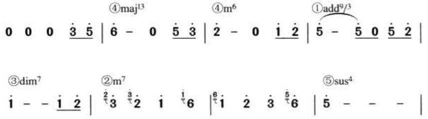

# 乐曲分析

[Musical Analysis Visiting the Great Composers 6th Edition](https://www.fransabsil.nl/archpdf/musanbk.pdf)

### 乐谱分析

1. 如果乐谱没有调号，则扫一眼乐谱的大部分音是在哪个自然音级上，尤其注意变化音级，然后快速反推其调号。如G大调有一个#F，其他的都是自然音。

### 以歌曲《大鱼》为例分析旋律的走向和发展

在了解了旋律的走向（运动形态）和发展之后，就可以针对一些流行歌曲进行简单的作曲分析了。下文将以歌曲《大鱼》为例进行分析。

#### 旋律走向分析

可以看到，本曲中的主歌部分以级进为主，夹杂跳进。其中首句采用了连续级进，造成了较强的推动性，连续级进的跨度达到了一个八度。主歌部分是典型的五声调式。在副歌部分则加入了si音。本曲的高潮部分（副歌）大跳的比例较多，如mi-sol-do-si-mi , mi-re-do-la-do , re-mi-la.
此外，本曲中出现的大跳大部分都有反向的预备，如2）和5）。

#### 旋律发展的分析

图中紫色数字代表的是乐句标号，红色部分为注解。

可以看到，本曲用到的旋律发展手法是丰富的，包括严格重复、变化重复、引申、顶针、模进等等。其中4,10,16乐句是同一个旋律片段（严格重复），高潮（副歌）部分也采用了严格重复。

### 《青花瓷》

#### 结构分析

结论

方框A表示A段，下面两个并排的a、a'表明A段包含a、a'两个乐段。“8小节”指的是a或a'段一共是8个小节。《青花瓷》的编曲顺序是属于比较常见的结构安排方式。
顺便给大家说说流行歌曲中两种也比较常见的编曲结构安排：

* 前奏——歌曲部分——间奏——歌曲部分——副歌反复——尾奏
* 前奏——歌曲部分——小过门——歌曲部分——间奏——副歌反复——尾奏（收尾）

###### 具体分析

从曲谱中很容易发现
素胚勾勒	出青花	笔锋浓转淡
瓶身描绘	的牡丹	一如你初妆
冉冉檀香	透过窗	心事我了然	宣纸上走笔至此搁一半

釉色渲染	仕女图	韵味被私藏
而你嫣然	的一笑	如含苞待放
你的美一缕飘散	去到我去不了的地方

第一段一共3句，前2句的结构是（xxxx、xxx、xxxxx)。第3句的结构是(xxxx、xxx、xxxxx、xxxxxxxxxxxxxx)。
第二段的前2句结构跟第一段的前2句式完全一样，第二段第3句的结构(xxxxxxx、xxxxxxxxx)与第一段的第3句不一样，是因为第二段第3句要连接下一个不同段落，因此段落结构需要做一些变化。
由此可见，这两段无论是乐句数量，还是乐句的旋律以及字数都是基本相似的，这样连续的两个主歌乐段，我们称前者为A段，后者为A'段。

我们再看到间奏过后反复的这两段：

色白花青	的锦鲤	跃然于碗底
临幕宋体	落款时	却惦记着你
你隐藏在	窑烧里	千年的秘密
极细腻犹如绣花针落地

帘外芭蕉惹骤雨	门环惹铜绿
而我路过那江南	小镇惹了你
在泼墨山水画里你从墨色深处被隐去

显然，这两段是反复过后的A、A'段。
我们再来看看：

天青色等烟雨	而我在等你
炊烟袅袅升起	隔江千万里
在瓶底书汉隶仿前朝的飘逸	就当我为遇见你伏笔

天青色等烟雨	而我在等你
月色被打捞起	晕开了结局
如传世的青花瓷自顾自美丽	你眼带笑意

纵观整曲，相似的乐段除了反复的几个A段以外，就剩这两段了。那么这两个乐段是结构中的什么成分呢，刚才我们也讲到了，流行歌曲一般分为二部曲式或三部曲式，即A、B段或A、B、C段，至此我们已经找出了《青花瓷》结构的A段，那么它必然就还有B段，或者B、C段。而：

天青色等烟雨	而我在等你
炊烟袅袅升起	隔江千万里
在瓶底书汉隶仿前朝的飘逸	就当我为遇见你伏笔

天青色等烟雨	而我在等你
月色被打捞起	晕开了结局
如传世的青花瓷自顾自美丽	你眼带笑意

以上两段第1、2句以及第3句前半句在字数上和旋律基本是一样的，只是第3句的后半句由于第一段起着承接的作用，第二段起着结束的作用，因此旋律有细微的差别，可以判断它们是重复的两段。加之目前为止，我们已经找出了A段，而最后两段是整曲段落的另外一种格式。因此我们可以判断出《青花瓷》是二部曲式，最后两段为B段，前者为B段，后者为B'段。

前奏：此前奏属于高潮型前奏。这个前奏分为两个部分，引子和主体部分各占2小节。开头两个小节由大鼓和鼓棒声组成的节奏作为引子，随后在第一小节第3拍后半拍，古筝作为主奏乐器进入主体部分，把听众渐渐引入音乐情景，随着两个小节古筝的演奏后，一声笛子的五声音阶上行带入前奏的高潮部分，所有乐器进入，开门见山展现出整首歌曲的基本风味，提前预见了全曲的主题，最后一个小节暂且消停所有乐器以便进入A段即主歌部分。

主歌部分（A段）：此段整段以引子的节奏作为基础，用音色稍微有些浑浊的电吉他音色作为分解织体，其中穿插着木鱼的填充音。整段配器风格属于叙事型，人声得以在音乐的铺垫下将故事缓缓道来。

副歌部分（B段）：随着古筝和弦乐的推进过渡，曲子进入了副歌部分。副歌是相同的两个乐段反复构成的，在这里的气氛是跟主歌部分不一样的，气氛更加高涨，情境更加深远，风味更加浓郁。节奏乐器R&B Kit、低音乐器Bass、弦乐组乐器和民族主奏乐器的进入，使得曲子在深度和广度上更进一层，低音的加入改变了主歌部分急需解决的低频空缺的听觉心理，而弦乐组的加入更让音响实现了中低、中、中高音区齐全的丰满：在民族主奏乐器方面，采用常见民乐乐队编制，把古筝、琵琶轮指、笛子组合成一个合并的音色，并且在第二次副歌部分加入小提琴的八度演奏，形成了一个由古筝、琵琶轮指、笛子、小提琴的八度演奏组合成的中西结合音色。它在节奏、贝斯低音、吉他分解、大、中提琴铺垫的基础上，与人声交相辉映、丝丝入扣、荡气回肠，让人听完以后大呼过瘾。

尾奏部分：此部分跟前奏的引子部分相类似，只不过作了一些改变，就是加入了吉他的分解，用于慢慢缓解高潮动人心魄、激情尚存的心理。随着几声板鼓的敲击，整首歌曲结束在下属和弦上。

#### 和声分析

青花瓷整个编曲的和弦进行按照结构顺序列在下表中：

前奏部分——引子部分（1-7小节）：

④maj13—①add9/3—②m9—①add9 这个和声进行意在追求4—3—2—1的低音顺阶下行，所以把第二个①级呈第一转位（以3音做最低音）从而构建起这个顺畅的低音流向。

值得一提的是，虽然是大调的歌曲，但青花瓷并不是以传统的①级和弦作为开头的，而是⑤级开头。因为流行音乐的和声学与传统和声学是不完全一样的，也许你听得最多的就是传统和声学中不允许属和弦进行到下属和弦，可是在流行音乐中，这个连接是完全可行的，特别是在爵士乐中，任何一个和弦都允许连接到其它的任意和弦，只要你觉得它好听。再加上不同的和弦延伸音产生千变万化的和弦声位，爵士乐的和弦连接可谓是上亿种。
流行音乐的特性激发了流行音乐人极大的创造力，一首歌曲的开头不一定要用大调①级或小调①级开头，可以是：
②级，如杨坤的《月亮代表我的心》、超裁乐队的《如果我现在》，爵士乐经典的《秋叶》。
④级，如许巍的《蓝莲花》、刘德华的《孤星泪》。
用下属功能组的和弦作为开头，音乐让人感觉“已经在路上”，而不是“正准备出发”。

高潮部分（7-11小节）

⑥m7—②—⑤sus4—⑤进行的方向是五度的关系，我们知道，属和弦和主和弦之间就是五度关系， 因此这样按照五度圈进行的和弦无疑是通畅的，合理的。

A段部分（11-26小节，51-66小节）

* a部分①sus2—⑥m11—④sus2—⑤sus4—⑤很好理解。①—⑥—④—⑤是流行歌曲最常见的和弦走向，源于爵士乐的基本和弦进行Ⅰ—Ⅵ—Ⅱ—Ⅴ。⑤sus4（低音512）—⑤（低音5低音72）目的是在此进行结束前制造一个1—低音7的解决（属调的4—3解决）。
* a'部分①sus2 —③m7—⑥m7—④sus2 —⑤sus4―①sus2―⑤m7①7，其实就是在⑥级前加上一个副调的属七和弦③m7，让其产生临时转调增加和弦进行的趣味。⑤sus4 （ 低音512）—①sus2 （125）我们明显看出两个和弦的和弦音是一样的。虽然两个和弦和弦音都一样，但是它们的级数功能还存在。这样做既能使和弦合理进行，又因为和弦音一样而使得和弦进行的过程比较平稳。

B段部分（27-42小节，67-82小节，83-98小节）

B段部分的和弦进行包括了前两部分的和弦进行特点，既有为了保持低音线条的转位⑤/4，又有副调属七和弦①7，以及⑤sus4-①sus2。高潮部分反复连接的两个和弦是非常有意思的两个和弦：⑤m7和①7（Em7和A7），即小⑤级七和弦和①级属七和弦，这个连接是一个典型的五度圈连接，Em7—A7—D7，前者分别是后者的属七和弦。我们知道，属和弦进行到主和弦是一个很正统的解决，因此编曲者通过建立副主和弦，连续使用的两个属和弦到主和弦的进行，使得B段的和声连接得非常紧密自然。

间奏部分（43-50小节）

间奏部分的和声进行就比较有意思了。从总体来看它还是保持了高潮部分的和弦进行结构，只是在细节上加上了一些妙笔。

* ④maj13—④m6—①add9/3—③bdim7—②m7将④m6和③bdim7/7替代了⑤/4，⑥m7，在低音上保持一个4—4—3—b3—2的顺阶下行，使得低音线条平稳而流畅。
* 其它和弦音也保持一系列具有现代音乐感的小二度下行，如从④级的6—④m6的b6—①add9/3的5—③bdim7/7的b5―②m7的4，最后流向⑤sus4的5。

尾奏部分

转调后的副歌结束以后就是歌曲的收尾部分。这一趋于结束的过程在情绪上相对于副歌高潮部分，显然是平静了许多的。在这里钟兴民老师使用了①级接④级的和声进行来舒缓高潮部分高涨的情绪，并在第二遍时候用⑥级替代了①级，产生了短时间的小变化，心情在这暗淡的小调主和弦中平静了下来，歌曲最终在④级和弦所产生的意犹未尽感中结束。

## 音乐风格

因素：旋律搭配、和弦进行（和声）、节奏型、律动

日本音乐分类：https://ja.wikipedia.org/wiki/Template:%E6%97%A5%E6%9C%AC%E3%81%AE%E9%9F%B3%E6%A5%BD

电子音乐类型：https://zh.wikipedia.org/zh-cn/Template:%E9%9B%BB%E5%AD%90%E9%9F%B3%E6%A8%82%E9%A1%9E%E5%9E%8B

Bass Music： 电子舞曲中的一种 以鼓和贝斯为主导 通常有变化多端连绵起伏的bass，包括DnB、Jungle、Dubstep（广义）、EDM Trap等等

狭义Dubstep（UK dubstep）： Bass Music中的一种，通常具有2-step节奏型，通常bpm140左右 实际大概是70bpm左右的咚-哒-咚-哒节奏，伴随连绵起伏的wobble bass，整体曲风黑暗沉稳

Brostep（Heavy Dubstep）：dubstep的衍生风格，bass更加粗犷，曲风更高调，鼓点更重

（广义来说Dubstep是UK Dubstep及其衍生风格的统称）

House 电子舞曲的一种，主要节奏型是bpm120-130的动次打次，子风格很多，现在商业EDM主力军也是各种house

EDM：电子舞曲Electronic Dance Music的缩写，一般来讲包括所有“电子”的“舞曲”，节奏循环往复，律动性很强。Bass Music、Techno、Trance、House这些都算EDM

狭义的EDM是近几年出现的概念，一般是指短小精悍、商业化的快餐电子舞曲，时长很难超过5分钟，就是全场嗨一下然后就切歌的那种。有时也作为前缀标签，比如EDM Psy Trance

### 爵士乐

https://zh.wikipedia.org/zh-cn/%E7%88%B5%E5%A3%AB%E4%B9%90

知识图谱：https://en.wikipedia.org/wiki/Template:Jazz

Twelve-bar blues

### City Pop

教程关键词：シティポップの作り方

https://zh.wikipedia.org/zh-cn/%E5%9F%8E%E5%B8%82%E6%B5%81%E8%A1%8C

https://www.sohu.com/a/404414349_562485?_f=index_pagefocus_3&_trans_=000014_bdss_dknfqjy

https://www.youtube.com/results?search_query=city+pop+composition

https://www.youtube.com/watch?v=Hbt7FCVHyfE&list=RDHbt7FCVHyfE&start_radio=1

City Pop 是日本经济泡沫时代背景下形成的音乐类型。彼时沉浸于欢脱和奢靡之中的日本民众不再能够欣赏传统民谣这般苦涩的「靡靡之音」，从美国流入日本的 Disco、Funk、Jazz 以及当时正在浪头的 New Wave 等多种音乐流派给城市带来了全新的生命活力。然而来自西洋的音乐又尚且有距离感，于是日本的人们开始往传统的日式歌曲中灌入西洋的元素，并在日本都市的独特洗练下，用来描绘享乐生活和度假心情。 City Pop 不仅仅是一种音乐流派，它更是用来表达日本都市生活者价值观和感情的独有美学。

二战后美国对日本的重建改革，加上后来日本在朝鲜战争、越南战争期间巧妙发挥自身优势，60 年代末的日本已一跃成为世界第二大经济体。到了 70 年代之后高度发达的汽车制造业和诸如索尼 Walkman 之类的消费电子产品更让日本政府和人民都呈现出生活富裕的状态。一个空前繁荣国家和无法安分守己的社会与传统保守的儒家传统价值观碰撞，左翼运动开始式微，这些都让发展主义和享乐主义的价值观深入人心。因此理所当然地，日本人对于文化娱乐消费方面也展现了前所未有的需求： **人们开始听美国流行音乐，并试图从漫画和电影中了解美国中产阶级的享乐生活**，爵士乐伴随着各种酒吧和咖啡馆爆发式生长，60 年代因饱含沉重人生和社会批判题材而风靡日本的传统民谣在如此的背景之下亦变得不再流行。

City Pop 的根基其实是电子合成器音乐，故有日本化「Synth Pop」之称。

山下达郎在 1980 年发行的《Ride On Time》一直被认为是 City Pop 音乐的开山之作。这首歌将 Funk 的吉他节奏放到了合成器键盘上，将电子鼓机融合进爵士乐的散乱编曲中，这种结构上看似复杂、听起来却相当轻松的编排形成了一种新式的舞曲风格。
「现在马上奔向湛蓝的水平线/集中精神感受时光的消逝/Ride On Time 点燃心中的火焰」——这首讲述快消爱情、夏日海滩、及时行乐，轻浮浪漫感满溢的歌曲瞬间传遍日本的大街小巷，成为了都市年轻男女的最佳配乐

除了山下达郎、竹内玛莉亚夫妇以外，书写 City Pop 历史的还有一大批代表性创作者。例如在 80 年代初期大受欢迎的 寺尾聪便以一首满载都市孤独男性本色的 《ルビーの指環》大卖超过 160 万张，在当时受到老老少少的欢迎，而此次的大畅销也将 City Pop 推上了日本乐坛的主流。在他之后，包括 池田聪、 松田圣子、 菊池桃子等等偶像级别的人物都以演唱 City Pop 曲风而闻名， 矢泽永吉、 井上阳水等的摇滚及民谣资深唱将也因走 City Pop 路线而大卖特卖。当然还有歌曲都市感极强的 杉山清贵、 大贯妙子、 角松敏生，在专辑封面上可圈可点的 大泷咏一、 佐藤博、 浜田金吾都是将 City Pop 这一音乐流派推向顶峰的重要功臣。

我国亦涌现了不少主打 City Pop 的乐队或音乐人，例如台湾的乐队落日飞车及女歌手 9m88 便是两大典型代表

### 视觉美学

山下达郎的一首《Ride On Time》，我们光是从歌词内容上就能非常直观地体会到它的音乐画面。以至于后来很多人把 山下达郎的 City Pop 音乐归为「日间派」，通常描绘夏日和海滩，曲风也较为清新明亮，这也是 City Pop 专辑中最常见的风格。其实除了 Jazz、Funk、Disco 等音乐元素以外，City Pop 本身就与源自美国加州西海岸的 Surf Rock（冲浪摇滚）有着相似的精神内核。为了突出这样的主题和美学，当时不少音乐人都将大海、沙滩、冲浪的景象直接作为专辑封面上：像是山下达郎 1984 年的《Big Wave》、菊池桃子 1986 年的《ADVENTURE》，还有 2010 年代以后再次将 City Pop 音乐带回乐坛的女歌手一十三十一也有多张类似风格的主题封面。 

另一类则是以角松敏生为代表的「夜间派」，往往勾勒出夜晚与城市的画面，多用都市夜景作为封面，歌词内容所描写的通常是都市的痴男怨女和夜生活，曲风也更接近于 R&B 的感觉。

代表动画（大量使用City Pop）：猫眼三姐妹（由女歌手杏里演唱的 City Pop 风格动画主题曲以动感的 Funk、舞曲风格充分匹配了如此的夜都市浪漫感）、城市猎人、加州危机、 回首再见她、街角的童话、轻井泽症候群

### 蒸汽波

蒸汽波是一种「拿来主义」的电子舞曲制作形式，即采样多年前的欧美、日本流行歌曲（多为 80 年代 City Pop）的片段，将其进行大量如放慢、倒带、刻意做旧、扩大音场等后期手法重造。《Plastic Love》便是蒸汽波采样曲名单中的主角，采样次数多到经常被歌迷戏称「流水的蒸汽波，铁打的塑料爱」。

但是对于蒸汽波音乐界人士来说，这首「塑料爱」并不是一切的开端。北美电子音乐人 Macintosh Plus 被认为是蒸汽波音乐的鼻祖，他于 2011 年发行的专辑 《フローラルの専門店》（Floral Shoppe）从音乐风格到视觉艺术的呈现上都奠定了后来蒸汽波的基本结构。这张专辑封面中的复古平面设计、罗马雕塑半身像、日本文化等等元素也成为了往后蒸汽波的标配。在 Macintosh Plus 之后，无数蒸汽波创作者像雨后春笋般涌出，从墨西哥的蒸汽波组合 MACROSS 82-99、美国的 YUNG BAE，到意大利的 bl00dwave…… 诸如此类的音乐人层出不穷，他们都试图从日本 80 年代泛 Funk 乐曲当中挖掘灵感。

提起蒸汽波，很多人脑海里第一个浮现的画面便是城市里高频流动的车辆、的士里的深夜广播、情色理发店的条形霓虹灯、酒馆里谈天说地的孤男寡女、老式电视的显示屏和盒式录像带的噪波——而 80 年代的日本动画所描绘的场景中恰好包含了所有蒸汽波应有的元素。于是， 蒸汽波不但将 City Pop 音乐作为灵感来源，也将日本黄金时代的动漫作为封面或 MV 紧紧地捆绑在了一起。

### 音乐性分析

https://zhuanlan.zhihu.com/p/177156632

https://note.com/craftsoundstudio/n/n2056e0897977

https://www.youtube.com/watch?v=7FrHrBIsIS8&ab_channel=%E3%82%B5%E3%83%83%E3%82%AD%E3%83%BC%2FSakky

#### 旋律

强调弱拍（鼓打强拍，键盘在弱拍？）

#### 和弦进行

常用循环和弦进行

#### 节奏

Groove风格的shuffle节奏

#### 音色(音)

吉他：干净地演奏カッティング技法

贝斯

鼓：军鼓、低重心的大鼓

合成器/MIDI键盘

歌唱

推荐新手：先从鼓开始，再加MIDI键盘、再加贝斯（加在节奏空闲之处？）、再加吉他、最后合成器，做个loop（4~16小节），找出groovy律动的感觉，找到一个合适的单位不断循环和弦进行，并加入鼓与贝斯，跟着这loop的旋律作曲；而不是直接用键盘上来写旋律，容易写飘

### 土、烂俗、Low

[《从作曲的角度分析，抖音神曲和优质流行歌的差距到底在哪里》](https://zhuanlan.zhihu.com/p/150117443)

[从周传雄、薛之谦、隔壁老樊来看华语乐坛创作水平的下降丨深度分析](https://zhuanlan.zhihu.com/p/150872514)

“土、俗”，往往就是指那些听感单调、陈旧、不和谐、同质化严重、千篇一律的作品

所谓“俗”，字面意思上理解，就是俗套、庸俗，就好比写文章时，那些没有新意、没有亮点的文字、情节。具体投射到作曲中，可以理解为：在烂大街的和弦走向中，大量使用同质程度高的旋律组合，节奏型单调的曲子。

特点

* 选用最常见、烂大街的和弦进行，且毫无变化。解决：即使在套路化的和弦框架内，依然可以利用很多作曲上的技法，把曲子写出不俗的听感
* 用已经在无数作品中出现的同质化旋律，并以此为“亮点”，在作品中大量重复，千篇一律。
  为了避免同质化的旋律，可以有意识地去减少高同质度的动机的使用率，尽可能给听众带来耳目一新的感觉
* 曲子节奏单一，四平八稳，变化较少。解决：在遵循一定规律和章法的条件下，丰富曲子的节奏和律动，活用切分音、反拍等手法，让曲子更“活”，避免节奏上的死板

### New Age

钢琴采用大的回响，听起来比较空灵

New Age的配器大多很简单，不过会追求新颖，加一些独特的小众乐器（大多来自世界音乐World Music），比如陶笛奥卡利那笛之类的。

### 阴森

林夕作词的那首幽媾之往生：https://www.zhihu.com/question/27059706

首先你要确定自己BGM的风格，因为用不同配器都能编出阴森的音乐，但用途各异，比如你需要给中世纪奇幻电影配阴森的BGM，就不能使用合成器音色。配乐的曲风一定要跟你整体的风格匹配。然后看用途1.如果只是为了烘托氛围。首先是Drone类音色铺底，然后是大量PAD音色叠加。一般而言，这两类音色最好不要演奏和弦，那样会太厚了，而且会形成不必要的情绪，造成喧宾夺主的效果。我们只需要用低音把观众的肾上腺素调动起来就行。这两类音色（有的音源里还会提供Soundscape、Ambience类铺垫音色，也可以用）要选择细节丰富一些的，内部稍有纹理变化的，以避免单调，像Padshop、Omnisphere都是神器，当然你自己用合成器调一个也行。然后是节奏类音色，这看需要，有时候需要在BGM里加一些节奏，主要使用工业感强一些的打击乐器，像Action strike这种音源里的loop可以借用一下，但切记喧宾夺主，点缀一下就好。最后就是音效。一些扭曲的工业音效能起到吓人的效果。如果不需要吓人就适当使用平缓一些的音效推动一下就行，推荐USB X-treme FX音源。必要时，可用噪音或失真度极强的音色。若风格要求不可以使用原声乐器，比如cyber punk，那就用合成器搞定上述一切。如果不可以使用合成乐器，比如好莱坞奇幻电影，那就用管弦来搞定。Drone和pad都可以用提琴的连奏，音效可用提琴制造的音效——好一些的弦乐音源都有提琴音效，专门给恐怖片用的。节奏的话，如果需要还是得从Action strike里找。2.其他音乐性较强的桥段。目的不是为了烘托氛围，只是在推进剧情时，想时不时的吓一下观众，或需要大量调动观众情感——总之是动态较强的音乐——就用大量的增减和弦的弦乐、管乐，吉他分解和弦。调式用和声小调、旋律小调或其它不常见的调式，或干脆用无调性乐器。推荐BigfishAudio的Zodiac，里面有大量实验性和无调性乐器。还是跟上一段一样，如果是现代一些的风格就用合成器或电吉他，古典一些就用管弦和Organ类。根据配乐的风格不同，可以选择模仿一些既有的音乐风格有时候会有事半功倍的效果，比较成功的例子是寂静岭的配乐。现实中常见的公认的阴森的音乐有：Trip-hop（尤其Portishead，节奏极慢，大量老电影采样）、Trap（节奏极慢）、工业氛围（例如Most of the taciturn）、古典一些的如Darkwave（例如Eland，他们用了大量的圣咏）、死亡民谣（例如Current93）、中世纪音乐（例如This mortal coil）等风格。吸收这些风格中的阴森部分，学习他们的配器，使用在配乐里会有奇效。题主说道钢琴，钢琴是万金油，而且加以调教其实能替代很多声部，比如你可以用大量效果器处理钢琴，让它变成扭曲的音效。或者调整钢琴的采样的ADSR让它变成Pad，再加以各种效果器。应该能胜任的场合会更广一些。

乐器：水琴

低频与高频远离开阔，中间可以尝试写一些细碎的离调音，不协和音程增加紧张度。

洛克里安调试，或者小调用一个小三降6和弦

大量运用增四度(减五度)，大小二度，你可以试着用钢琴直接弹增四度琶音应该就有点感觉了。可以用一组半音阶不断重复，能制造紧张的效果

增减和弦、洛克里安、全音阶做loop、管风琴，倍大错位拨弦

### Jazz HipHop

Beat

* Soft jazz piano

* retro funk drums。听起来像Bomb bap（底鼓加军鼓，鼓点被高度强调，比较震撼）：https://rhythm-lab.com/breakbeats，由70s的真人演奏，the slight offbeat hits and human dynamics的效果不是机械式的程序能够模拟的。

  适合被采样的：Jazz pianist Vince Guaraldi

* juxtaposing modern vibes with old-school flavor

### Hiphop

结构：https://zhuanlan.zhihu.com/p/29833754

#### 常见曲风

Old School：70~90年代的饶舌曲风。具体又分东岸与西岸。
东岸的鼓点比较中规中矩，歌词相对沉重，牵涉到政治、种族等社会问题。代表人物：阿姆
西岸（West Coast）。鼓点大气，kicks，常带有一点hihat，snare通常拖得比较长，曲风相对轻松（话题阳光、海岸、沙滩）。代表人物：Dr.dre、五角。

南岸（South Side），偏派对舞曲，延伸曲风如Crunk。代表乐器808底鼓常出现在Trap与Crunk音乐中。

Trap：通常有跟南岸一样的808底鼓，并且更明显。hihat活泼乱跳

grime：融合电子乐元素，rapper用old school的flow跟唱腔

gangster：帮派，江湖味重。经常涉及贫民窟、枪支、毒品。GAI

G-Funk（G=gangster）。snoop dogg

### 中国风（广义。包括古风）

[中国有形成过一套像西方音乐一样完整的音乐体系吗？](https://www.zhihu.com/question/348680171)

#### 导读

"中国风”字面上的意思就是具有中国味的音乐风格，是三古三新（古辞赋、古文化、古旋律、新唱法、新编曲、新概念）结合的中国独特乐种。歌词具有中国文化内涵，使用现代音乐唱法和编曲技巧烘托歌曲氛围。歌曲以古代的中国背景与现代节奏的结合，制作出含蓄、忧愁、幽雅、轻快等意境。“中国风”分为纯粹中国风和近中国风两种：纯粹中国风是满足以上六大条件的歌曲；近中国风是某些条件不能满足但又很接近于纯粹中国风的歌曲。
“中国风”歌曲与传统中国音乐的区别主要在于编曲（节奏、和声、编曲概念与风格）、曲式结构、唱腔的不同。

* “中国风”音乐的编曲新概念和新风格：“中国风”音乐的编曲新概念和新风格体现在歌曲中就是中国传统音乐元素结合现代音乐（Hip-hop、R&B、电子等）的节奏、旋律、和声，并加入特殊音效，在流行歌曲编曲概念嵌入情节对话等。比如风声—林俊杰《江南》、胡彦斌《红颜》，雨声——周杰伦《发如雪》，冷兵器相撞声——周华健《刀剑如梦》、原生态人声采样（呼麦）——王力宏《那在遥远的地方》等，还可以使用不断升Key法、无乐器人声伴奏法等。
* “中国风”音乐的节奏：在“中国风”改编的传统音乐中加入流行音乐的节奏，把古老的旋律变得更加流行、时尚。
  最主要的节奏变化是现代节奏讲究低音，如底鼓贝斯这些节奏点强的乐器而中国传统音乐比如戏曲、民歌等历来是没有低音这个概念的，就算节奏乐器也是高音的“滴滴哒哒”。而现在加入了低音的节奏点，使得歌曲更加富有张力和融合性，更具现代音乐的动感更符合现代人的审美观念。比如将Hip-hop风格音乐中的Loop巧妙地结合到了中国风音乐中，像陶告吉的《苏三说》、王力宏的《在梅边》等，都是中国风音乐京剧唱腔+Rap+Loop很好的例子。
* “中国风”音乐的和声：中国传统音乐历来是没有和声这个概念的，民族乐器大多都是独奏乐器。而像吉他、钢琴这类又能独奏又能伴奏的乐器，更是少之又少。“中国风”歌曲广泛使用现代音乐和声进行作为歌曲构架，使用西洋乐器比如木/电吉他(Acoustic/Electric Guitar)、钢琴(Piano)、电钢琴(Electric Piano)等作为节奏和声乐器，使用民族乐器作为旋律乐器，充当如副旋律、填充、长音旋律线等角色。“中国风”的很多歌曲编曲中都使用了像7、9、11、13等延伸和弦或延留挂留和弦。现代和声的运用，增强了歌曲的广度和深度，再加上民族乐器娓娓道来、交相辉映，营造出一个古色古香的泼墨山水画氛围。
* “中国风”音乐的曲式：“中国风”歌曲曲式结构是常见的流行音乐曲式分为乐段、二部曲式和三部曲式。一般乐段的结构较少见。
* “中国风”音乐的唱腔：演唱“中国风”歌曲的唱腔跟传统唱法有很大区别，主要以流行唱法为主，加入R&B、嘻哈(Hip-hop)、灵魂乐(Soul)等美式现代音乐唱法，在中文发音基础上加上西方韵味或者英语单词、转音，增加歌曲现代感，使之更国际化。一些华语艺人还会在歌曲中间偶尔穿插戏曲唱法上如京剧唱法、秦腔，更增添一股浓浓的中国风味。

注意：大部分“中国风”音乐都比较低劣，学习知识时要注意取舍

流行音乐（嘻哈、R&B、电子、摇滚等）+民族配器的结合。如果把民族配器去掉，其实跟一般流行音乐相差不大。

特别注意：中国风，不能算是一种音乐形式，而是以某一种音乐类型为基础，在其中置入中国风元素。中国风元素与其他音乐风格相碰撞，才会产生火花。因此其实所有风格都可以变成“中国风”

#### 主要分支

* R&B：陶喆的《Susan说》（节奏感非常鲜明，曲子流畅，唱腔随意）
* 嘻哈：《盖世英雄》——王力宏（很难听，之后换个例子。节奏感鲜明，律动感也比R&B更强，旋律以Rap为主，会穿插五声音阶的旋律）
* 电子：西皮士。（有点像new age空灵+环境音？？？PAD合成器）
* 有点new age：《宁月 Silent Moon》——和平之月
* 摇滚：《曹操》——林俊杰（注意：这首歌没有使用民族乐器，但歌词、编配和旋律总体的感受而言，是有中国风色彩的）

《芊芊》，回音哥正式打入流行乐坛之作，曲风中带有J-Pop的影子（银临的《锦鲤抄》更加明显），加入民族乐器，加入五声音阶。

花田错》，典型王力宏式R&B风格，配合戏曲唱腔，加入五声音阶。相同风格的还有后弦的《西厢》，被称作R&C风格。

《红颜》，胡彦斌早期惊为天人之作，R&B打底，辅助电子音乐元素，配合并不明显的五声音阶和民族乐器。

《烟花易冷》，周董的作品在我是歌手舞台上的重新演绎，流行+古风的代表，纯钢伴+民族乐器+五声音阶。

《新贵妃醉酒》，典型华语流行乐的配置打底，加入戏曲唱腔，五声音阶，民族乐器。

《仙儿》，二手玫瑰的代表作，英伦摇滚混入五声音阶、民族乐器与二人转唱腔。相似的还有谭维维在数个舞台上和华阴老腔的合作。

《辛弃疾》，摇滚加入民族乐器，五声音阶。

《你飞到城市的另一边》，典型的好妹妹风格，民谣吉他，加入戏曲唱腔，五声音阶，民族打击乐。同样的还有《青城山下白素贞》和《相思赋予谁》。

《菊花台》《红尘客栈》——周杰伦

蔡志展的台湾古风音乐：《武林群侠传》《武侠群英传》《网路三国》《紅樓夢之十二金釵》《江南才子唐伯虎》《水浒传之梁山好汉》《风云之天下会》等游戏音乐

骆集益： 仙剑系列游戏音乐

罗晓音 ：剑侠系列游戏音乐

国内五大音乐工作室：小旭游戏音乐、喜糖音乐、月之门音乐、阿鲲游戏音乐、墨明棋妙

小旭游戏音乐（游戏配音富士康） ：《诛仙OL》《大唐豪侠》《QQ斗地主》《口袋西游》《盘龙神鼎记》《凡人修仙传》

月之门游戏音乐：《剑侠情缘网络版3》《仙剑神曲》《武易》

喜糖音乐：《天龙八部OL》

#### 特点

常用完全四度、完全五度音程，少用大小三度与六度

* 和声特色
  * 完全用中国民族调式的编配。即五声调式、六声调式、七声调式
  * 有中国民族调式参与的编配
  * 没有中国民族调式参与的编配

元素

* 五声音阶。五声音阶主要体现在旋律上，比如笛子、二胡的solo、人声的旋律等等。
* 民族配器（非必须）。注意：陈淑桦的《笑红尘》、周杰伦《烟花易冷》、常石磊《天地鉴》、霍尊《恰好》，就都没有用民族乐器。笛子和二胡这种长线条的乐器，往往出现在华彩、间奏或加花的部分，而短线条的扬琴、古筝常出现在织体之中，丰富和声层。
  民族乐器一大特点就是演奏手法多样，比如古筝的滑奏往往出现在加花处，用于引出副歌，扬琴的轮指往往出现在副歌，加密和声，笛子的solo中又常用到波音、倚音，增强乐器的呼吸感。
  民乐一般都是实录的，因为技法比较复杂，且音源难以模拟出演奏的韵律与呼吸性。不过可以用音源在编曲时做替代，比如“Kongaudio中国民族乐器软音源”

### 民族配器

#### 打击乐

打击乐的音色及节奏，直接影响了乐曲风格，需要重点考虑

古风中常见的打击乐主要有以下几种：
1）手鼓、铃鼓、非洲鼓等打击乐，往往节奏较轻，可以在“世界民族打击乐音源”里获取
2）中国大鼓，大锣，往往用在乐句开头，强调重音，可以在“Kongaudio中国民族乐器软音源”里获取
3）R&B的鼓点，这类音色一出现，R&B基调就被奠定了。这类音源多得很，如Battery4，Overkill Drum，BFD鼓音源中都有
4）套鼓，往往用来加重节奏，套鼓一出现，流行的感觉就出来了。这个音源太多了，BFD，Superior Drum，Studio Drum等等
5）一些“不知名的、奇怪的”打击乐，我们称为Loop，往往都是Stylus RMX音源中的，或者是wav格式的音效（比如雨滴声，风声，战场声等等），主要用于铺垫气氛，若隐若现

比如民谣的歌，可以选用手鼓、铃鼓；流行一些的可以选用Stylus RMX+套鼓；R&B的话就直接选用特定的鼓点，加一些民族的打击乐作为点缀就完全可以；至于摇滚，往往都是正常的套鼓，没有其他复杂的点缀。

#### Pad与伴唱

Pad是电子合成的铺垫乐器，一些Pad具有非常强的空间感、缥缈感，因此，常在古风音乐中可作为气氛的烘托，往往起到画龙点睛的作用。
伴唱的原理与之相仿，拓展声场（录两轨，一左一右），增加缥缈的感觉。
具体音源的话，可以去“omnisphere合成音源”，以及“Fantasya环境音效”里面找找看。

#### 混响

古风音乐中，巨大的混响几乎是必备的，尤以钢琴，打击乐，人声为甚。巨大的混响会营造虚无缥缈感，烘托意境，同时也掩盖细节上的不足。

西皮士：有结合氛围音乐的感觉？

#### 调式、和弦织体

#### 模仿动机

#### 框架结构

前奏、间奏、尾奏构思设计

#### 配器定位

吹拉弹打民族乐器编配

弦乐编配

#### 音源

https://www.zhihu.com/question/46502163

鼓：Steven Slate Drums

贝斯：Trilian

更多时候是鼓根据bass写。通常让Bass与kick的律动保持一致。

因为贝斯如果只演奏和弦的根音，听起来很无聊。贝斯可以加花（通常是演奏和弦的五音），但因为重拍一般是演奏和弦的低音，因此不要加在重拍（和弦的第一拍）。第二是加花的时值不能太长

## 音乐形式

序曲 (Overture)
前奏曲 (Prelude)
间奏曲 (Intermezzo)
终曲 (Finale)
协奏曲 (Concerto)
大协奏曲 (Concerto grosso)
小协奏曲 (Concertino)
晨曲 (Aubade)
变奏曲 (Variation)
回旋曲 (Rondo)
奏鸣曲 (Sonata)
交响曲 (Symphony)
交响诗 (Symphonic poem)
夜曲 (Nocturne)
小夜曲 (Serenade)
进行曲 (March)
随想曲 (Caprice)
幻想曲 (Fantasia)
狂想曲 (Rhapsody)
叙事曲 (Ballade)
叙事短曲
传说曲 (Legend)
浪漫曲 (Romance)
诙谐曲 (Scherzo)
卡农曲 (Canon)
赋格曲 (Fugue)
组曲 (Suite)
练习曲 (Etude)
三重奏 (Trio)
四重奏 (Quartet)
五重奏 (Quintet)
六重奏(Sextet)
七重奏 (Septet)
八重奏(Octet)
歌剧 (Opera)
正歌剧 (Opera Seria)
轻歌剧 (Opera buffa)
喜歌剧 (Opera comique)
神剧 (Oratorio)
清唱剧 (Cantata)
舞曲 (Dance)
圆舞曲(Waltz)
芭蕾（Ballet）
小步舞曲(Minuet)
波尔卡(Polka)
库朗特
加洛普
福里亚
帕凡 (Pavane)
波莱罗 (Boléro)
塔兰泰拉 (Tarantella)
萨拉班德 (Sarabande)
西西里舞曲 (Siciliano)
基格 (Gigue)
吉格（Jig）
康塔塔
阿拉贡
哈巴捏拉
波罗舞曲
霍塔
布列
路尔
恰空
凡丹戈
兰德勒
阿勒芒德（Allemande）
马祖卡 (Mazurka)
波洛奈兹（Polonaises）
加沃特 (Gavotte)
踢踏舞 (Tap Dance)
拉丁舞 (Latin Dance)
恰恰 (Cha-cha)
探戈 (Tango)
曼波 (Mambo)
