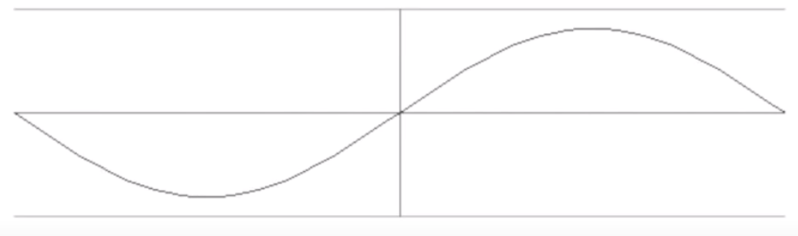

TODO：补充psychoacoustics（心理声学）内容

# 基础声学（Acoustics）

第1章　声音　
　1.1　压力波和声音的传播　
　1.2　声强、声功率和声压级　
　1.3　声波的叠加　
　1.4　平方反比定律　
　1.5　声波的反射、干涉和衍射　
　1.6　时域和频域　
　1.7　频谱分析　
　
第2章　听觉特性　
　2.1　听觉系统的构造 　
　2.2　临界频带 　
　2.3　频率和声压级可听范围 　
　2.4　响度感觉 　
　2.5　噪声引起的听力损失 　
　2.6　听觉对声源的定位能力 　
　
第3章　乐音与和声的物理和生理基础　
　3.1　乐音 　
　3.2　音高感知理论 　
　3.3　乐音的听音 　
　3.4　音律　
　
第4章　乐器的声学模型　
　4.1　乐器的“输入—系统—输出”模型　
　4.2　弦乐器　
　4.3　管乐器 　
　4.4　打击乐器　
　4.5　语声和歌声　
　
第5章　音色感知与听觉幻觉效应　
　5.1　什么是音色　
　5.2　音色的声学特性　
　5.3　音色的心理声学　
　5.4　管风琴作为音色合成器　
　5.5　听觉的“欺骗”效应　
　
第6章　听音的声学环境　
　6.1　封闭空间的声学特性　
　6.2　房间简正模式和驻波　
　6.3　吸声材料　
　6.4　扩散结构　
　6.5　隔声　
　6.6　房间边界对扬声器输出频率特性的影响　
　6.7　箱体衍射效应的减小　
　
第7章　声学和心理声学相结合的应用　
　7.1　审听室设计 　
　7.2　纯音和语音听力测试法　
　7.3　心理声学测试　
　7.4　滤波与均衡 　
　7.5　公共广播系统　
　7.6　降噪耳机　
　7.7　“蚊子单元”和“青少年蜂响器”铃声　
　7.8　音频编码系统　
　7.9　本章总结　
　
傅里叶变换　

## 音的产生

声音是由物体振动产生的，它包括发音体、外力和共鸣体三个要素。例如：钢琴、小提琴、琵琶等以琴弦为振动主体的乐器，正是通过演奏者击弦、拉弦或拨弦等外力，使琴弦及共鸣体振动，产生音波， 当这些音波传递到人耳时，鼓膜也会振动，大脑可以检测并解释这些振动，以表示“声音”。

人耳所能听到的声音频率范围为20~20000Hz，悦耳的乐音频率范围为40~4000Hz。  

## 音的属性

| 音的性质             | 形容 | 决定因素                                                     | 单位       |
| -------------------- | ---- | ------------------------------------------------------------ | ---------- |
| 音高（Pitch）        | 高低 | 频率：发声体振动次数的快慢。频率越高、振动就越快，声音的音调就越高 | 赫兹（Hz） |
| 音值（Duration）     | 长短 | 时值：发声持续时间的长短                                     | 拍         |
| 音量（Volume）       | 强弱 | 振幅：发声体振动幅度的大小                                   | 分贝（dB） |
| 音色（Tone、Timbre） |      | 谐波：泛音的多少及排列的次序                                 |            |

## 音的分类——乐音与噪音

音是由发声体振动产生的。

* 乐音。振动规则的、听起来音的高低明显的音
* 噪音。振动不规则、听起来音的高低不的音

乐音还可细分为“直音与腔音”。

直音就是发音持续过程中音高始终不变（频率固定不变）的单个乐音，如钢琴上正常奏出来的音，古筝、二胡的空弦音。

腔音就是发音持续过程中音高发生变化的单个乐音，如古筝、二胡运用演奏法使音高发生变化的按弦音。

其实，噪音也有高低区别，只是听起来不明显而已。如大军鼓与小军鼓相比，大军鼓音低、小军鼓音高。在音乐活动中，如无固定音高的锣、鼓等噪音乐器，在音乐风格和音乐感染力方面，是各种乐音乐器所无法替代的。

## 基音（Fundamental）与泛音（overtones）

基音：整体振动产生的音，称为“基音”。它是复音中频率最低而振幅最大的一个成分（分音），它决定着复音的频率。钢琴是基音频率范围最宽的一种乐器，其键盘最高音是C5，为4186赫兹，最低音是A2，为27.5赫兹。男低音的基音范围是90至300赫兹，女高音的基音频率范围为300至800赫兹。

泛音（也称为“倍音”）：局部振动产生的音，称为“泛音”。

复合振动：整体与局部同时振动的现象。复合振动所产生的基音与泛音按高低次序的组合排列，称为“分音列”；不含基音，由泛音按高低次序的组合排列，称为“泛音列”。

泛音在音乐表演和理论研究中，具有重要意义。弦乐器的泛音奏法、管乐器的超吹、音律的制定、和弦的构成都与泛音有关。

## 共振频率（Resonant frequency）、基频（fundamental frequency）、泛音、谐波（harmonics、harmonic wave）

* 共振频率：对于任何物体，都有一组频率，如果使物体以这些频率振动，则会导致物体以最大振幅振动。这些频率称为共振频率。
* 基频：发生共振的最低频率称为基频。
* 泛音：指频率高于其基频的系统的任何谐振频率，它们不包括基频。例如，“第一泛音”总是具有高于基频的频率。在一般情况下，泛音的频率与基音频率成整数倍关系，但有时泛音的频率不与基音频率成整数倍关系，有些声源所发出的声音，其分音不是严格的整数关系，如定音鼓在特定条件（不同鼓腔、鼓膜张力）下，其各分音频率之比为1.0445、1.7945、2.7632、3.7565等。
* 谐波：
  * 指基频的整数倍的谐振频率，包括基频。 例如，“一次谐波”始终是基频本身。 “二次谐波”是基频的两倍，等等。
  * 是每个音符对应于具有特定频率的声波。 例如，音符“中C”具有261.6Hz的频率。 但是，当人听到乐器上正在演奏音符时，不会听到纯粹是这个频率的声音（如果只听到一个频率，则只会听到蜂鸣声）。 实际听到的是该频率以及该频率的倍数的其他频率。也就是说，与“纯” 261.6 Hz一起，还将听到523.2 Hz（= 2×261.2 Hz），784.4 Hz（= 3×261.2 Hz）等频率。 频率的较高倍数逐渐降低。 对于不同的乐器，频率的较高倍数具有不同的相对振幅。 这就是导致每种乐器听起来不同的原因。

### 谐波产生过程

设想波动一根琴弦，然后产生声波。由于琴弦的两端是固定的，所以琴弦的两端总是 **波谷**，而且波在传播的过程中遇到端点便开始反向传播，然后影响了本来的波形。由于已经存在了两个波谷，那么客观在波震动中总会产生一个 **波峰**。那么两个波谷加上一个波峰，就决定了基音的频率。

由于波的反向传播，要想波形达到标准稳定的状态，那么势必会将弦分成弦长相等若干等分。于是就产生了如下图所示的谐波。

根据弦长，各级泛音的音高总是基音的整数倍，所以我们很容易的可以得出下列的结论。也就是说，自然振动产生的声音，所产生的谐波总是固定的。而谐波产生的声音就是泛音。

## 驻波（Standing Wave）

古典乐乐器发出的声音就是由驻波产生的。古典乐乐器发出的声音就是由驻波产生的

### 标准音A4A4部分分音表

|         频率         | 级别 |   名称   |              波形图              |               分子图               |
| :------------------: | :--: | :------: | :------------------------------: | :--------------------------------: |
|  1⋅f=440Hz1⋅f=440Hz  |  1   |   基音   |  |  |
|  2⋅f=880Hz2⋅f=880Hz  |  2   | 一级泛音 |  |  |
| 3⋅f=1320Hz3⋅f=1320Hz |  3   | 二级泛音 |  |  |
| 4⋅f=1760Hz4⋅f=1760Hz |  4   | 三级泛音 |  |  |

## 复音（complex tone）与纯银

由几种不同频率的单一正弦振动合成的声波，在听觉上是多于一个音调的声音，自然界的几乎所有声音都是复音，复音由多个纯音组成，可以包含多种泛音。

## 泛音列（Harmonic Series）

耳朵听到的“一个音”，其实不只有“一个频率”而已，而是由很多频率的音组合而成的。

如用弦乐弹奏低音C（130Hz），那么这根线会在一秒钟内上下摆动130回

二倍频率：如果一根弦被分成2段振动，那么其频率为130Hz*2=260Hz，则产生高八度的C

三倍频率：如果一根弦被分成3段振动，那么其频率为130Hz*3=390Hz

以此类推

钢琴的振动是所有模式的综合（非常随机），因此当弹下一个低音C时，钢琴会产生130（基础音）、260（第二泛音）、390（第三泛音）、520（第四泛音）、650（第五泛音）等等Hz的音

当大脑同时接受到这些频率的音时，大脑会自动把基础音理解成这个音的音高，把后面的所有泛音理解成音的音色

## 乐器的发声原理

## 杂（尚未整理）

1、最大声压级：

扩声系统在厅堂听众席处产生的最高稳态准峰值声压级。

另一解释：在扩声系统中，音箱所能发出的最大稳态声压级，最大声压级越高，说明系统的功率储备就大，声音听起来底气足、动态大、坚实有力。决定扩声系统最大声压的因素主要是功放、音箱总功率和声场大小等。

音箱等设备所能达到的最大稳态声压，人耳不能承受120BD的音量，舒服的情况下是85DB，从70DB到73DB声音＋3DB声音放大一倍。

2、最高可用增益：

扩声系统在所属厅堂内产生反馈自激临界增益减去6dB时的增益。另一解释：扩声系统在反馈自激（啸叫）临界状态的增益减去6分贝时的增益，此时扩声系统应绝对没有声反馈现象存在。在反馈临界状态下，由于还存在振铃现象，即声音停止发声后音箱中会继续有尾音（余音），还会对音质造成破坏，声反馈的影响并没有消除，减去6分贝后这种现象消失，定为最高可用增益。此值越高，说明话筒路声音的放大能力越强，声反馈啸叫抑制得好，话筒路声音可以开得很大。

当啸叫发生时，下降6DB就达到了设备的最大稳态可用增益。

3、传输频率特性：

扩声系统达到最高可用增益时，厅堂内各听众席处稳态声压的平均值相对于扩声系统传声器处声压或扩声设备输入端的电压的幅频响应。

另一解释：扩声系统的频率响应特性，为房间和音响设备共同的频响特性，考察系统是否能够将各频率声音音量比例真实再现，即对各个频率的信号放大量一致，优秀的扩声系统，不应该出现某些频率声音过强、某些频率声音不足的现象。获得良好的传输频率特性的主要方法有：合理的建声设计、用粉红噪声频谱分析仪法调整均衡器以及采用频率响应特性好的音箱放音等。

在声音处理时频率要平稳，这样表示设备的性能较好，或者说音箱能够较好的还原声音

4、传声增益：

扩声系统达最高可用增益时，厅堂内和听众席处稳态声压级的平均值与扩声系统传声器处声压级的差值。

另一解释：扩声系统在使用话筒时，对话筒拾取的声音的放大量，是考察扩声系统声反馈啸叫程度的重要指标，传声增益越高，声反馈啸叫越小（少），话筒声音的放大量越大。计算方法是将话筒音量开到最大（不能有声反馈现象），在话筒前放一个声源，同时测量声场中和话筒前的声压级，用声场中声压级减去话筒前声压级，即得到了该扩声系统的传声增益。

话筒前声音与音箱发出来的声音之间的差值

5、动态范围：

为声接收用的电声换能器的过载声压级与等效噪声声压级之差。注：（1）能接收的声压级低限是由媒质的声噪声或电路中的电噪声决定的。起作用的噪声应加说明（如环境噪声、热噪声、设备噪声等）。

（2）过载性质（如信号崎变、过热、损伤等）和测量方法应加以说明。

另一解释：音响设备的最大声压与可辨最小声压级之差。设备的最大声压级受信号失真、过热或损坏等因素限制，故为系统所能发出的最大不失真声音。声压级的下限取决于环境噪声、热噪声、电噪声等背景条件，故为可以听到的最小声音。动态范围越大，强声音信号就越不会发生过荷失真，就可以保证强声音有足够的震撼力，表现雷电交加等大幅度强烈变化的声音效果时能益发逼真，与此同时，弱信号声音也不会被各种噪声淹没，使纤弱的细节表现得淋漓尽致。一般来说，高保真音响系统的动态范围应该大于90分贝，太小时还原音乐力度效果不良，感染力不足。在专业音响系统调整过程中，音响师在调音时注意以下两方面问题：一是调音台的输入增益量不要调的过小，否则微弱的声音会被调音台的设备噪声所淹没。二是压限器的阈值和压缩比的调整要格外慎重，阈值过小和压缩比过大，都会使声音动态压缩严重，故应该在保证效果的前提下，尽量减少对声音的动态损失。

另外，在放大电路和音源中也存在动态范围，此时即可分辨的最小信号和可达到的最大不失真的信号之差，值越小，表现的效果越好6、平均声[压]级：

声压的平方的空间或（和）时间的平均值与基准声压(20μPa)的平方之比的以10为底的对数，单位为贝[尔]，B。但通常用dB为单位。对声压的平方的平均方式应同时指明。

7、声场不均匀度：

厅堂内（有扩声时）各听众席处得到的稳态声压级的差值。

另一解释：房间听音区域的最大声压级与最小声压级之差，要求各处音量不能相差太多，声场均匀意味着听音区域音质的一致性好。

8、声压：

有声波时，媒质中的压力与静压的差值。单位为帕[斯卡]，Pa。注：（1）一般使用时，声压是有效声压的简称。有效声压是在一段时间内瞬时声压均方根值，这段时间应为周期的整数倍或长到不影响计算结果的程度。

（2）声压的瞬时值、平均值、峰值、最大值或峰到峰值等应分别注明为瞬时声压、平均声压、峰值声压、最大声压或峰到峰值声压。

另一解释：声波通过媒质时所产生的压强改变量，即由声波引起的气压压强变化。当声波传播时，介质各部分能产生压缩和膨胀的周期性变化，压缩时压强增加，膨胀时压强减少。

最大与最小声压差值，

9、声功率：

单位时间内垂直通过指定面积的声能量，单位为瓦，W。声源的辐射声功率则常指在单位时间内向空间辐射的总能量。

10、声压级：

声压与基准声压之比的以10为底的对数乘以2，单位为贝[尔]，B。但通常以dB为单位，基准声压必须指明。

另一解释：声级的单位，用分贝来表示，在通常情况下，声压级等于声强级。

11、声级：

用一定的仪表特性和A、B、C计权特性测量得的计权声压级。所用的仪表特性和计权特性都必须说明，否则指A声级。基准声压也必须指明。

注：基准声压为20μPa。

另一解释：与人们对声音强弱的主观感觉相一致的物理量，单位为分贝。听阈对应的声级为0分贝，但0分贝并不意味着没有声音，而是可闻声的起点，声强每增加10分贝，其声级就增加10分贝，房间本底噪声的声级大约为40分贝，正常话为70分贝，交响乐高潮时为90分贝，人的痛阈声级120分贝

12、声源：

发射声能的振动系统，例如，人的口、乐器和扬声器等。声源发出声波的波长如远大于声源的尺寸，则声源可看成一点，声波以球面波形式向四面均匀传播，如声源发声面和新型的狭缝发音的音箱，就会有比较良好的集中一个方向的现象，提高了音箱发出声能的利用率，使声音传播的更远。

13、标准声源：

具有稳定的声功率输出，宽带频谱的声源。在100－1000Hz的范围内所有1/3倍频带声功率级的最大和最小的差值应在12dB之内，相邻两个1/3倍频带声功率级偏差不超±3dB，任何1/3倍频带的指向性指数不超过9dB，输出声压级至少应超过背景噪声10dB。有气动源，电动源和机械等形式。注：可用于比较法测量机械设备辐射噪声的声功率。

14、点声源：

声音从一点向四面八方传播的声源，此种声源形成球面波，波前面积与距离的平方成正比，因此声强按距离平方比的规律衰减，即距离每增加一倍，声级衰减6分贝。

15、测试声源：

为了测量扩声系统的各项指标专门组成各种形式的发声器。

16、声源指向性因数（Q）

声源位于房间的不同位置时，由于界面反射而使声级增加的倍数。如音箱在空中吊挂时，指向性因（Q）等于1；位于一面墙或地面上时，Q等于2；；位于两墙面交线上时，Q等于4；位于三面墙角时，Q等于8。

17、自由声场：

开放空间形成的，如开阔的、周围无任何建筑特的空旷场地和野外等，露天演出即属于此类情况。界面吸声性能非常好（吸音系统接近1）的房间一般也属于自由声场，如消声室和某些声学实验室等，此类房间一般用于电声器件（如话筒、扬声器和音箱）的测量和声学实验。在自由声场中，声音不受反射界面影响，相当于无限大容积的空间，没有由于反射而产生的声音干涉现象，故音色纯正，但听起来发干，混响时间几乎等于零，距离每增加一倍，声压级衰减6分贝。

18、声场：

媒质中有声波存在的区域

另一解释：亦称音场，有声波存在区域或空间，即声源发现的声音在空间中传播的分布情况。由声音所处的环境、音箱（话筒）的摆放与布置方式以及音箱（或话筒）的指向性特性决定

19、直达声场：

室内稳态声场中声源周围直达声强度大于反射声强度的区域。20、声学比，声强比：

在室内某点的混响声强与直达声强之比，表示该点声场漫射的程度21、声波：

能引起听觉的振动波，频率在20赫兹至20千赫兹间，在空气等媒质中传播，振动方向与传播方向相同，声速等于340米／秒。22、声波吸收：

声波在各种媒质中传播时，能量会由于不断地被介质吸收而逐渐减少。在空气中传播时，距离越远、湿度越低、湿度越小、频率越高衰减越大，反之，衰减越小。

23、声道：

声音信号占有的专门电路路径或通道。在单声系统中，一个声道就可以传送全部声音信息，但在立体声系统中，就必须要有两个或两个以上声道传送声音信号，否则无法实现立体声效果。

24、声短路：

振动方向相反的一个或几个声波在空间相遇后相互抵消或损耗的现象，无障板扬声器和音箱反相时都会产生声短路，声短路不仅会使音箱放音音量受到损失，还会造成音质不良和立体声声像失去定位等一系列问题。

25、声环境：

声音放送时所处的环境，由房间的内装修、体形和布局等决定，良好的声环境，可以获得优秀的声音再现效果。

26、声线：

声音的传播路线，声线图可以表现声音在空间传播情况及其分布情况，是反映空间声场变化的重要手段。在均匀静止的媒质中，声线一般可用自声源射出的直线代表，用这些线来表达声的传播和反射等过程较为直观。

27、声像：

又称虚声源或感觉声源。用两个或两以上的音箱进行立体声放音时，听音者对声音位置的感觉印象，故有时也称这种感觉印象为幻象，声音图像的空间分布由人的双耳效应决定。立体声放音正是以声像的形式，再现原来声音的空间分布，从而使人们产生一种幻觉，诱发立体感觉

28、声像调节：

调音台上调节左右声道音量比例的旋钮，用于调节声像的空间分布，往左旋到尽头，表示声源在左边，往右旋到尽头，表示声源在右边，若放在中间位置则表示声源在中间位置。这种调节对于真实再现立体声效果有重要意义。

29、声阻抗：

媒质对声波所呈现的阻抗作用，用某一面积上的声压与通过该面积的声通量的复数比来量度。

30、声强：

声波振动强弱程度的参数，在空间某点指定方向上，通过垂直于该方向单位面积的平均声通量，即声源在单位时间内向外辐射的总声能。

31、声聚焦：

凹曲面对声波形成集中反射的现象，它使声能集中于某一点或某一区域，致使局部音量过强，而其他区域则相对声音较弱，属于音质设计缺陷，有可能导致扩声系统反馈啸叫、声场不均匀的多种问题。

32、声音的软硬度：

声音的软硬度也可以称为声音的松紧度，一般是针对低音效果而言，对再现声音的艺术风格有很大影响。在大多数的情况下低音的软硬度要保持适中，但在表现某些特殊的音乐风格时，声音的软硬度就要有一定的侧重，以使音乐风格更加鲜明突出，如摇滚乐的声音要硬些，而交响乐则要柔和些。软的低音一般听起来低音长度长，而硬的低音的强度强，阻尼系数和转换速率等指标可以决定声音的软硬度，而音箱是决定声音软硬的最重要部分。目前很多音响周边设备都可以调整低音的软硬度，如激励器、压限器和均衡器等，但它们的控制机理和声音效果不尽相同。

33、声桥：

在双层或多隔声结构（例如，房屋中双层间壁、楼板等）中传播声音和影响隔声效果的连接物，是造成房间隔声不良的重要原因之一。

34、声影区：

由于障碍物阻挡或物体折射等原因，使声音辐射不到的区域，或声源的直达声无法到达的区域。在声影区内，声压级很低、音量很小、使整个声场不均匀。如果听音区域出现声影，要采取加装补音音箱，除去声音阻挡物等技术措施加以消除，拾音时，如果有条件，应尽量使话筒避开声影区。

35、声柱：

由数只同相使用的扬声器，以直线排列安装在柱状外壳内组成的扬声器组，声柱的幅面为平面或曲面，各扬声器的轴线在声柱内可互成一角度或位于同一平面上，利用这种排列所存在的声波干涉现象，使指向性在沿轴线延伸的平面上较尖锐，声音可以送得很远，且远近距离均能得到较均匀的声场，提高了扩声系统效率，并能防止啸叫和减少回声，适用于广场、大厅等场合。

36、声谱：

声音频谱的简称，指构成某一声音的分音幅值（或相位）随频率分布的图形

37、声学：

研究声波的产生、传播、接收和效应的科学，是物理学的一个部门。

38、室内声学：

研究室内音质问题的科学，对大厅堂音质设计有重要的指导意义。

39、声学测量：

研究声学量测量技术的科学，包括建声测量和电声测量两部分，测量内容一般是厅堂声学特指标和音响设备电声特性指标，是音响系统客观评价的基本手段。

40、可听声：

耳可以听到的一定频率范围的声音。根据实验统计，可听声的频率范围为20赫兹至20千赫兹，儿童最低可听到17赫兹，最高可听到接近20千赫兹，随着人的年龄增长，高频听力不断下降，中年人可听到17千赫兹左右，而多数老年人只听到13千赫兹左右。41、受声场：

从声源到话筒之间的区域或空间，即话筒的拾音区域，有近讲声场和远讲声场两种情况，与话筒的拾音质量有密切关系。

42、当扩声：

总声扩声系统达到最高可用增益，但无有用声信号输入时，厅内各测点处噪声声压级的平均值

43、混响声场：

室内稳态声场中主要由反射声和散射声起作用的区域。

另一解释：闭合间形成的，由于有地面、墙面和顶面的反射，故声音传播具有辐射和扩散两种作用，声音在空间传播复杂，电影院、剧场和歌舞厅等文化娱乐场所等就属于混响声场。

44、声压灵敏度（声压响应）：

接收换能器输出端的开路电压与换能器接收表面上实有声压的比值。单位为伏每帕，V／Pa

45、声级计：

预加校准的，包括传声器、放大器、衰减器、适当计权网络和具有规定动态特性的指示仪表的仪器，用以测量声级。

注：（1）如输入端接拾振器，则成为振动计

（2）线路内加上积分设备则成为积分声级计，可以测量一定时间内噪声暴露的大小。

另一解释：预加校准的包括拾音话筒、放大器、衰减器、适当计权网络和规定动态特性的指示仪表的一种测量声级的仪器。有A、B、C等计权方式，A计权测量声级范围0至30分贝之间，B计权测量声及范围为30至60分贝之间，C计权测量声级范围为60至130分贝之间。

46、声分析仪：

包括滤波器系统和用以读出通过滤波器系统的相对信号能量的指示仪表的设备，用以求得所加信号的能量对频率的分布。

注：分析速度较一般大为加快的系统称为实时分析仪或快速傅里叶分析仪。

47、声级记录仪：

自动记录声级变化的信器。

48、声反馈acoustical feedb

扬声器放出的部分声能反馈到传声器的效应，通常是指因此而引起声音明显畸变乃至系统产生自激发生啸叫的情况。

另一解释：音箱发出的声音通过声传播方式传到话筒而引起的啸叫现象，反馈类型为正反馈。除了啸叫情况以外，当声音停止发声后，音箱中如果仍然存在类似振铃声音的衰变声，则说明系统仍存在声反馈。声反馈使得话筒音量不能得到充分提升，破坏音质，严重的还会烧毁功放、音箱，是扩声系统的一种不良声学现象，要及时和充分地抑制。抑制声反馈的主要方法有使音箱的声音不容易传到话筒中、利用能抑制声反馈的设备和搞好房间建声设计等多种。49、语言标准声级：

多数人多次试验中，在距讲话人唇部正前方一米处，正常讲话产生的声压级的平均值：一般取为65dB.

50、清晰度指数：

通过大量语言清晰度测试导出的，具有频带可加性的，用来计算给定的语言传递系统的语言可懂得的一个指数，它取值在0与1之间。

51、音节清晰度：

测听人员对规定的音节语声判断准确率的统计平均值。

52、清晰度、可懂度：

一个或几个发言人说话，经过音响系统后，被听音者听清楚的语言单位百分数。习惯上当语言单位间的上下关系对决定听音者的确认不占重要地位时，就用清晰度这个词；当上下文关系占重要地位时，就用可懂度这个词。室内清晰度指脉冲响应中有益声能（对清晰度有帮助的声能，取直达声能和50毫秒以内的反射声能）占全部声能的比例。

53、八度：

在音乐声学中倍频程常称作八度。

54、传声介质：

指能够传播声音的媒质，声音必须通过媒质传播，如气体、液体和固体。媒质性质，包括该媒质的状态、温度、压力等与声波传播速度和方式等有密切关系。如声音在气体中传播以辐射特性为主，在固体中传播以传导特性为主，而在液体中传播时以上两种特性均存在。

55、平均自由[路]程：

声音在室内两次反射间经过距离的平均值。表达式：d=4V/S，V为房间容积，单位为立方米，S为房间内总表面面积，即地面、墙面和顶面面积之和，单位为平方米。

56、扩散场距离：

在有混响的房间内，各方向的平均均方直达声压与均方混响声压相等的点到声源的声中心距离。注：扩散场距离又称混响半径。

混响半径：又称临界距离。以声源为中心，直达声等于反射声的圆半径，在室内，距声源距离小于混响半径时，直达声占主要成分，大于混响半径时，反射声占主要成分。

57、染色[效应]：

某些反射声和直达声叠加引起原来声音的某些频率成分被增强而使音质变差的现象。声染色亦称音染，由于室内（有时也指音响设备）频率响应变化，使原始声音信号被赋予外加频率，原信号频谱有了某种改变，某些频率的声音得到加强的现象

58、哈斯效应：

当回声的相对声级给定时，听者感觉到回声干扰的百分数随直达声和回声间的时延而变化的现象。双声源系统的一个效应，两个声源中的一个声源延时时间在5至35毫秒以内时,听音者感觉声音来自先到达的声源，另一个声源好象并不存在。若延时为0至5毫秒，则感觉声音逐步向先到的音箱偏移；若延时为30至50毫秒，则可感觉有一个滞后声源的存在。

59、赛宾[吸声]因数：

用Sabine混响时间公式算出的吸声材料的吸声量除以该材料的面积。

注：Sabine 混响时间公式是

T＝0.163v/as

式中：T－混响时间，s;

v－房间体积，立方；

a－平均Sabine因数；

s－房间表面积，平方。

此公式适用于标准大气条件，760mmHg,15℃

60、赛宾吸声量：

用Sabine 混响时间公式算出的吸声量。塞宾公式（计算方间混响时间的公式）提出了影响房间混响时间的主要因素，此公式的出现，标志着建筑声学从臆测阶段发展了科学阶段，但塞宾公式在吸音系数较小时，计算结果较为准确，吸音系数较大时，计算结果误差很大。

61、艾润[吸声]因数（Eyring[吸声]因数）,艾润[吸声]系数（Eyring[吸声]系统）

Eyring 混响时间公式算出的吸声材料的吸声量除以该材料的面积。

注Eyring混响时间公式是

T＝0.163V/[SIN(1-a)]

式中：T－混响时间，S；

V－房间体积，立方；

a－平均Eyring 因数；

S－房间表面积，平方。

此公式适用于标准大气条件，760mmHg, 15℃。

艾润公式：计算房间自然混响时间的公式，在塞宾公式的基础上，对房间的自然时间作了进一步精确的分析、推导，解决了塞宾公式在吸音系数较大（大于0.2）时计算误差较大的问题，对各种吸音系数场合都可应用此公式进行混响时间计算。

62、德.波埃效应：

双声道放声系统一个效应，与听音者中轴左右对称的两个声源间的强度差和时间差均为零时，声像位于中轴线；当时间差为0，音量差为0，音量差逐渐增大时，声像朝向音量大方向移动；当音量差大于15分贝时，声像与较响的声源完全重合。当音量差为0，时间差改变时，则声像朝先到达的声源方向移动，当时间差大于3毫秒时，声像与前导声源完全重合。

63、劳氏效应：

双声道放声系统一个效应，与听音者中轴左右对称的两个声源间的强度差和时间差均为零时，声像位于中轴线；当时间差为0，音量差为0，音量差逐渐增大时，声像朝向音量大方向移动；当音量差大于15分贝时，声像与较响的声源完全重合。当音量差为0，时间差改变时，则声像朝先到达的声源方向移动，当时间差大于3毫秒时，声像与前导声源完全重合。

64、双耳效应：

人们依靠双耳间的音量差、时间差和音色差判别声音方位的效应，由于两耳朝向、距离等原因，致使两耳听到的声音出现差别，感觉声音来自音量较大、较早到达和音色较好的方向。

65、隐蔽效应在聆听一个声音的同时，由于被另一个声音（称为隐蔽声）所掩盖而听不见的现象，被掩蔽声的频率越接近掩蔽声时，隐蔽量越大；掩蔽声的声压级越高，掩蔽量越大；低频声容易隐蔽高频声，而高频声较难掩蔽低频声。在音乐进行的过程中，人们感觉不到噪声的存在，但当音乐停止或间歇过程中，人们就可以感觉到音箱发出的本底噪声，这种效应就是掩蔽效应。

66、梳状滤波效应：

由于声音之间相互干涉而引起的频率响应曲线梳状起伏现象，会导致声音音色还原不良和保真度差等问题。

67、近讲效应：

亦称球面波效应，声源距话筒很近时，低音成分逐步增加，距离越近，低音加重越显著。在使用时，可以利用此效应来增加声音的温暖感和柔和感，但若演唱或演奏时不断变化与话筒间距离，则会使音色改变较大，故应确定一个使用距离。在调音时，音响师要根据不同音乐的要求，有控制地应用或利用好话筒的近讲效应。

68、趋肤效应：

亦称集肤效应，交流电流过导体时，由于感应作用引起导体截面上电流分布不均匀，越接近导体表面电流密度越大，这种现象称为趋肤效应。趋肤效应使导体有效电阻增加，频率越高、电阻越大，高频信号损失越大。解决是增加导线表面面积、减少导线表面电阻和采用多股导线等，现代音频传输线采用的里兹线结构和智能型导线，可以有效减少趋肤效应对声音信号的影响。

69、房间吸声量

房间内各表面和物体的总吸声量加上房间内煤质中的损耗。

注：媒质中的损耗等于8aV,a是空气中的衰减系数，Np/m;V是房间体积，立方

70、房间常数：

房间内总吸声量以1减去平均吸声因数来除所得的商。

注：（1）房间常数公式是：

R=aS/(1-a)

式中：R－房间常数，平方

a－平均吸声因数;

S－房间表面积，平方。

（2）在一般情况下，R＝Sa,a 为Sabine 吸声因数。71、消声室：

边界有效地吸收所有人射声音，使其中基本是自由声场的房间。

另一解释：一种界面吸音系数接近于1，容积相当于无穷大的房间，声音打到消声室的地面、墙面和顶面后，根本没有反射现象，声音完全被吸收，为了获得最大吸音系数，房间各界面均采用吸音尖劈结构和强吸声材料。消声室为双层建筑结构，在室内一定高度上悬空设置金属网，由于金属网的表面面积极小且呈不光滑的细丝，故声音的反射极小，可以忽略不计，一般在金属网上进行声学教学、科研和声学实验。在消声室中可以准确地测试电声单元（如话筒、扬声器和音箱）的技术参数和声学特性，根据测量结果可以描绘出设备的指向特性图和频率响应曲线，得到最大声压级和灵敏度等指标，故它对音响设备的产品性能指标的测量有重要意义。

72、混响室：

混响时间长，使声场尽量扩散的房间。另一解释：一个封闭式的强反射硬壁结构建筑，墙壁采用瓷砖或硬质水泥，地面采用马赛克等材料建成，以求制造声音的强列反射而获得长时间、高强度的混响声。最早的人工混响效果就来自混响室，它是利用一个隔声良好、扩散均匀、具有高反射性表面的房间，并在其内设置扬声器和话筒而组成的人工混响系统，由混响室内的扬

声器发出需要加混响声的信号，由话筒接受从扬声器发出的直达声以及有各墙面、天花板和地面反射的反射声从而得到混响特性，使用方向性较强的话筒，并将话筒背向扬声器可使话筒接收到的直达声减到最小，在混响室内安装一些可变吸声材料，可控制混响时间，混响室能在中、高频获得良好音质的混响声，但它有体积大、混响时间不易调整等不足。

73、吸声材料：

由于多孔性，薄板作用或共振作用而对入射声能具有吸收作用的材料

74、空场：

除必要的测量技术人员外，厅内没有观众和演员。测量时，厅内设置与相对应的满场正常使用时间完全相同。

另一解释：没有观众和演员的场地，空场测量和调音结果与满场结果存在一定的差异。

75、比特：

二进制数字中的位，信息量的度量单位，为信息量的最小单位。数字化音响中用电脉冲表达音频信号，“1”代表有脉冲，“0”代表脉冲间隔。如果波形上每个点的信息用四位一组的代码表示，则称4比特，比特数越高，表达模拟信号就越精确，对音频信号还原能力也越强。

76、残响：

声源停止发声后，由于惯性和反射等原因，声音没有立即停止，而是呈缓慢衰减的现象。在音响系统中，利用声音的残响效果，可以改变声音的余音过程，使声音更加圆润丰满。

77、频率：

声音信号每秒钟变化或振动的次数，频率越高、振动就越快，声音的音调就越高。

78、基音：

指复音中频率最低而振幅最大的一个成分（分音），它决定着复音的频率。钢琴是基音频率范围最宽的一种乐器，其键盘最高音是C5，为4186赫兹，最低音是A2，为27.5赫兹。男低音的基音范围是90至300赫兹，女高音的基音频率范围为300至800赫兹。

79、谐音：

指复音中的频率与基音频率成整数倍关系的分音，通常基音称第一谐音，频率为基音二倍或三倍的分别称第二谐音或第三谐音等。80、复音：

由几种不同频率的单一正弦振动合成的声波，在听觉上是多于一个音调的声音，自然界的几乎所有声音都是复音，复音由多个纯音组成，可以包含多种泛音。

81、泛音：

复音中频率比基音高的所有分音，按频率从低到高依次称为第一泛音、第二泛音等。在一般情况下，泛音的频率与基音频率成整数倍关系，但有时泛音的频率不与基音频率成整数倍关系，有些声源所发出的声音，其分音不是严格的整数关系，如定音鼓在特定条件（不同鼓腔、鼓膜张力）下，其各分音频率之比为1.0445、1.7945、2.7632、3.7565等。

82、波长：

声波振动一次所传播的距离，用声波的速度除以声波频率就可以计算出该频率声波的波长，声波的波长范围为17米至1.7厘米，在室内声学中，波长的计算对于声场的分析有着十分重要的意义，要充分重视波长的作用。例如只有障碍物在尺寸大于一个声波波长的情况下，声波才会正常反射，否则绕射，散射等现象加重，声影区域变小，声学特性截然不同；再比如大于2倍波长的声场称为远场，小于2倍波长声场称为近场，远场和近场的声场分布和声音传播规律存在很大的差异；此外在较小尺寸的房间内（与波长相比），低音无法良好再现，这是因为低音的波长较长的缘故，故在一般家庭中，如果听音室容积不足够大，低音效果很难达到理想状态。83、长波：

频率从300千赫兹至30千赫兹的无线电波，其传播方式主要是绕地球表面以电离层波的形式传播，作用距离可达几千至上万公里，此外，在近距离（200至300公里以内）也可以由地面波传播，该波段的电场强度夜晚比白天增大，波长越短，增加越甚；电场强度随季节的影响小，传播条件受电离层骚动的影响小，稳定性好，不会产生接受强度的急剧变化和通信突然中断现象。

84、短波：

频率从3兆赫至30兆赫的无线电波，以地波和天波方式传播，地波传播时，因大地对电波的强烈吸收，衰减大，传播距离不超过几十公里；天波传播时，借电离层的一次或多次反射，可作远距离通信，受电离层变化的影响大，地波传播时衰减快而天波传播时不稳定

85、超短波：

亦称甚高频（VHF）波、米波（波长范围为1米至10米），频率从30兆赫至300兆赫的无线电波，传播频带宽，短距离传播依靠电磁波的辐射特性，用于电视广播和无线话筒传送高频信号，采用锐方向性的天线可补偿传输过程的衰减。在专业音响领域，V段无线话筒的频率稳定度稍差，价格相对较低，但容易出现频率漂移现象，通过各种技术措施，可以使频率稳定度达到满足需要的水平。86、次低频：

亦称超低音，一般指频率为100赫兹以下的低音。次低频决定声音

的丰满度，使低音悠长、深沉、有力，这个频率几乎无声像定位感，故声场中次低频音箱的位置变化对声像定位影响不大。次低频所在的音域为低音提琴、低音鼓和管风琴等乐器的音域，可以使这些乐器的声音完美表现。音频中的次低频成分不足时，声音听起来不够厚实，略嫌单薄，但次低频过强时，声音浑浊。

87、特高频：

频率为300－3000MHz的无线电波，英文简写为UHF，U段无线话筒使用的载波就是此段，U段无线话筒的频率稳定度较高，使用效果优于V段无线话筒。

88、纵波：

传播方向与振动方向相同的波，亦称疏密波，声波即属于纵波，将振动引起的气压变化传送开来，气压高（正压）的地方空气致密，气压低（负压）的地方空气稀疏。

89、平面波：

波阵面为与传播方向垂直的平行平面的声波，将多只音箱组合成平面放音阵可产生类似平在的声波，如果不考虑空气的吸收，在平面波的情况下，距离增加，声压级没有衰减，但事实上，从目前的情况看，还不可能制造出纯粹的平面波。

90、球面波：

波阵面为同心球面的声波，距离每增加一倍，声压级衰减6分贝，如果不加处理，绝大多数的声源所发出声音均将为球面波。

91、驻波：

两列传播方向相反的声波迭加干涉产生的声音起伏变化的现象。声音在介质界面（如墙壁）上，入射波发生反射，反射波与入射波迭加，以及两声源发出的声音相遇等会形成驻波，驻波是引起声音在空间传播时声染色（亦称音染）现象的主要原因。

92、柱面波：

波阵面为同轴柱面的声波，一般为线声源（如声柱）或声音通过较长的狭缝所产生，在传播中衰减小于球面波，距离每增加一倍，声压级衰减3分贝，使扬声器发出柱面波是扩声系统提高声波传播距离的重要手段。

93、扩散：

声波在空间传播的方式之一，由于空间在存在声音的音量差。致使从声音声压级高的区域向声压级低的区域（或从能量密度大的区域向能量密度小区域）传播。在建筑声学设计中，利用各种扩散结构或扩散体。可以使室内声场分布更加均匀，避免或减少各种声学缺陷的产生。目前，声音的扩散传播现象已经被人们所承认，但在声扩散理论上，尚存不同意见。

94、衍射：

亦称绕射，声波在传播时，如果被一个大小近于声波波长或等于波长的物体所阻挡，就会绕过这个物体，继续行进。当阻挡物较小（与波长相比）时，其后面仍能清晰地听到声音；但当阻挡物较大时，就会在其后形成声影区，音量明显减少。

95、折射：

声波在两种物质（或密度不同的物质、媒质）的接触面上由于声速变化而改变传播方向后，进入第二种物质的现象，例如声音从空气中进入墙体，方向就会发生改变。

96、散射：

声波媒质中传播中，遇到障碍物边缘或小障碍物后偏离原方向而分散传播的现象，声音散射现象似在媒质中形成了一个新声源。97、绕射：

声波在空间传播时，如果被一个大小近于或小于波长的物体阻挡，就绕过这个物体，继续前进。低频声音的绕射能力高于高频声音的绕射能力。

98、反射：

声波在传播时遇到障碍物或原来媒质不同的媒质时的折回的现象，反射物尺寸大于一倍声波波长时正常反射，小于波长时会出现散射、绕射等现象。平面反射时，声音的人射角等于反射角，在反射界面的另一侧形成声源的虚像；凹面反射时，会出现声聚焦现象，使声源同一侧的空间中局部音量得到加强；凸面反射时，声音发散；漫反射时，声音反射杂乱，可以消除多种声缺陷。

99、漫反射：

凹凸不平的表面所形成的声音反射，反射杂乱，是消除各种声缺陷、改善声环境的重要方法之一，建筑声的扩散结构即属于此类反射。100、干涉：

两列（或两列以上）具有相同频率、相同振动方向和恒定相位差的声波在空间迭加时，在交迭区形成恒定的加强和减弱的现象，声音干涉后，会引起驻波和梳状滤波现象，破坏再现音质。扩声场合在多只音箱放音时，必然会出现各个音箱发出声音之间的干涉现象，合理地音箱布局和优异的音箱防干涉特性，可以使音箱间声干涉现象显著减少。

101、辐射：

声音从声源出发，在空间或媒质中向各个方向传播的过程。各种声源都具有自己的辐射特性，但一般都是高音辐射面窄，低音辐射面宽，充分利用声源的辐射特性对声音拾取和放送有着十分重要的意义。如用话筒拾音时，要根据声的辐射特性选择最佳角度，拾取理想的音色；用音箱放音时，要根据其辐射特性尽量使声场均匀，频散效果好。

102、电声学：

研究电声换能原理、技术和应用的科学，是电子学和声学的交叉学科，包括声电与电声转换、保存声音、制造声音、美化修饰声音和电声测量等多方面内容,具有综合性、跨专业和技术与艺术相结合等特点，是现代音响学的基础。

103、音响技术：

物理学的分支，是研究声波发生、传播、接收以及声信号处理的学科。

音响美学研究人对声音审美关系的一门科学，是美学的一分支。人对声音的审美关系主要表现在对声音的认识和听音感受方面，音响是听觉的外在形式，是思维与感情的外部表现，人是音响的接受体。音响作为人们欣赏音乐等听觉艺术作品的媒介、载体和交流语言，在被聆听者感觉到以后，必须会给人们带来各种各样的感受。音响美与声音效果的完美程度密切相关，而声音完美程度不仅取决于声音的保真程度，还与声音是否是优美和谐密切相关。欣赏音响美与听音者的民族、对声音的理解和感知能力、音乐素养以及心理和生理状态等有密切关系，所以音响美学亦可以称为聆听艺术科学。

104、模拟音响技术：

把声音信号在模拟状态下传送、记录、重放以及加工处理的技术，是音响系统依靠的最基本的也是最传统的技术。自然界的声音是以模拟状态存在的。故在声－电和电－声转换的过程中，声音信号必须要模拟化，无论何时音响系统中无法离开模拟技术，但模拟音响技术与数字音响技术相比，在噪声、失真和动态等技术性能方面逊色很多。

105、建筑声学：

研究厅堂内听音质量、建筑物内外声音隔离和建筑材料声学性能等问题的一门学科。主要根据声波特性和人对声音的感觉，从建筑设计、材料、构造等方面进行研究并提出合理措施，以保证听音清晰，音质优良。

106、计算机厅堂声学设计软件

一种用厅堂声场的计算机软件。存有各种房间体形、吸音材料、扬声器等资料，可以根据实际需要进行选择、设计，计算出房间的混响时间，描绘出声场分布图、声线图和各种声学特性曲线，为厅堂音质设计和音响工程施工提供了很大的方便。

107、分贝：

电功率增益和声强的量度单位，由单位贝尔的十分之一而得名，功率每增加一倍为增加3分贝；每增加10倍为增加10分贝。

108、共振（共鸣）：

外界振动频率与物体固有频率相一致而使这个频率得到加强的现象。在厅堂中存在两种共振形式：（1）机械共振，即舞台台板、门窗等共振，采用加固等措施可以减少或消除。（2）简正共振，由房间体形（长、宽、高比例）和体积决定，采用无理数比例等可以尽可能减少简正共振。

109、共振吸声结构：

利用空腔吸收声音能量的结构，一般用于低音的吸收，由于它的装饰性强并且强度好，故在建筑中广泛使用。主要有单个共振器、穿孔板共振吸声结构、微穿孔板共振吸声结构、狭缝共振吸声结构、薄板共振吸声结构和膜状材料等多种，设计者可以根据实际需要进行选择。

110、共振峰：

在泛音中带有共鸣性质而且被增强的那一部分，在频谱中有其固定的位置，对于乐器的音色有至关重要的作用，同时也与乐音的强度直接相关，强度不同，共振峰的多少也就不同。对同一音高弱奏时只有一个共振峰，而强奏时则可能有三个共振峰，弦乐器、双簧乐器和铜管乐器的声音中均有明显的共振峰存在。最典型的是人发音时产生共振峰，口腔、咽腔、鼻腔、胸腔、鼻窦等部位都可产生共振峰，语言的元音者有共振峰，而辅音是没有的，所以人们把共振峰称为“元音色彩”，并把这种元音色彩具体到乐器的描述：明亮、敞开的“A”元音色彩，体现在小提琴、小号和双簧管上；大管的音色可以解释为元音“O”共振色彩；带有鼻音的共振峰在1.8至2千赫兹之间，正是萨克司管音色的体现。大多数乐器者有数个共振峰，其中振幅最大的一个称为主共振峰，其他的为次共振峰。对共振峰成分的补偿，可以修正和改善声音音色，使再现声音加逼真。111、响度：

声音在人耳中被感受的强弱程度。主要由声音的强度和频率所决定。人耳感受声音强弱的程度与声波功率的大小不成线形正比关系，而是与声波功率比值的对数成正比，即声音强度增加100倍，人耳感受到声音的响度只增加了20分贝。对声强相同的声音，人耳感受1000于4000赫兹之间频率的声音最响，超出此频率范围的声音，其响度随频率的降低或上升将减小，声到20赫兹以下或20千赫兹以上时响度为零，即在音频范围以外，物体的振幅再大，人耳也听不到其声响。响度的单位是宋。

112、响度级：

某一频率声音的声压级，即此声音与1000赫兹的纯音比较，当两者听起来一样响时，这1000赫兹纯音的声压级数值就是该声音的响度级。响度级的单位为方。

113、等响曲线：

人类的听音特性曲线，是反映人们对声音振幅范围心理和生理因素的曲线，每条曲线上对应于不同频率的声压级是不相同的，但人耳感觉到的响应却一样，因此称为等响曲线，每条曲线上注有一个数字，为响度单位，由等响曲线族可以得知，当音量较小时，人耳对高低音感觉不足，而音量较大时，高低音感觉充分，人对2至4千赫兹之间的声音最为敏感。

114、响度控制：

亦称等响控制，是为补偿人耳的听觉对中音比较敏感而对低音和高音比较迟钝而设置的一种控制方式，当放大器开大音量时它不起作用，而当放大器音量关小时，响度控制电路能自动将信号的高音和低音适当加以提升，从而得到响度频率补偿。由于人耳在音量大时对低音和高音感觉较好，而在音量小时低音和高音感受力不良，听音时就会出现音量大时人们感觉高音低音合适，而当音量小时高音低音明显不足这一现象。响度控制是一种带补偿的音量控制器，它能补偿人耳在不同音量情况下对听觉特性的差异，不论音量开大或关小，人耳听觉感觉只是声音的响度发生变化，音色不变。115、削波：

亦称切顶，由于音频信号过强或动态范围过大，超过线性区而造成的一种信号的峰值顶部被齐齐地切去的现象。削波现象导致信号削波失真，削波失真不仅会破坏音质，还有可能烧毁设备，如随之产生的高频谐波会烧毁音箱高音头，而直流分量亦可烧毁低音单元。避免的方法是适当调整信号电平，保证音响系统中各设备的削波灯（峰值显示）在最大声音信号时不能亮

116、心理声学：

研究声音的主观听觉和物理量关系的科学，它着重研究声刺激与其反应的关系，人们对声音的正确感受和理解能力对听音评价十分重要。

117、主观评价：

根据人耳的听音结果对声音进行评价的方法，是音质评价的重要方面，可以对音质做出定性评价，具有简便易行的特点，但评价结果带有一定的个人主观色彩，对评价者的听力水平要求较高。118、音质评价标准：

判断音质的依据，通常分为主观评价标准与技术（客观）评价标准两方面，音响系统的音质评价，应采用主观评价与客观评价相结合的方法。一般来说，主观评价很差的系统，客观评价也会很好；主观评价很好的系统，客观评价不会很差；客观评价很差的系统，主观评价一定很差；客观评价很好的系统，主观评价不会很差。

二、音响

119、总噪声级：

扩声系统达最高可用增益，但无有用信号输入时，厅堂内各厅众席处噪声声压级的平均值。

另一解释：扩声系统在无用声信号输入的情况下，音箱发出的本底噪声级。系统总噪声级与音响工程质量、音响系统设计、音响系统的调试和音响设备本身等因素有关。

120、噪声：

有多种定义：（1）不同频率和不同强度的声音，无规律地组合在一起即成噪声，听起来有嘈杂的感觉，为人们所不需要的声音。（2）在电路中，由于电子的特殊杂乱运动或冲击性杂乱运动而在电路中形成频率范围相当宽的杂波，如电子在热作用下的杂乱运动（热骚动），电子不够均匀的流动，都将产生持续存在的噪声；雷电、电火花等感应到电路中就产生冲击性的噪声。

121、噪声门：

利用扩展器原理制成的一种降低背景噪声设备，输入信号小于一定程度（阈值）时噪声门无输出，大于此值时正常输出，可以消除声音间歇过程的本底噪声，在音响领域中除了降低背景噪声外，还可以用于提高声音分离度、处理鼓声等。

122、噪音：

不和谐、不悦耳的声音，物体无规律的振动产生噪音。乐器在产生乐音的同时，还会伴随着产生噪音，各种乐器的噪音有不同的特色，弦乐产生的噪音最大，其次是木管，木管中首先是长笛，这些噪音是随演奏而来的，由各种摩擦引起的，与乐音结合在一起，构成了各种声音的特色，是声音中不可缺少的部分，音响节目中有适量的噪音，会使人感到自然、真实、有现场感，但噪声成分过多，会使声音难听。

123、无规噪声：

时值不能预先确定的声振荡。无轨噪声的瞬时值对时间的分布只服从一定统计规律。

注：无规噪声不一定是白噪声

124、白噪声：

用固定频带宽度测量时，频谱连续并且均匀的噪声。白噪声的功率谱密度不随频率改变。

注：白噪声不一定是无规噪声。

白噪声：整个音频频率范围内，功率密度谱均匀公布且等比例宽度的能量相等的一种噪声，即各个频率幅度值相等的随机噪声，一般用于测量试音响设备的频率响应等特性。

125、粉红噪声：

用正比于频率的频带宽度测量时，频谱连续并且均匀的噪声。粉红噪声的功率谱密度与频率成反比

126、环境噪声：

在某一环境下总的噪声。常是由多个不同位置的声源产生。

127、背景噪声：

在发生、检查、测量或记录的系统中与信号存在与否无关的一切干扰。

128、本底噪声：

亦称背景噪声。无有用声信号时音箱发出的噪声，包括音响设备噪声的放音环境声两部分，过强的本底噪声，不仅会使人烦躁，还淹没声音中较弱的细节部分，使声音的信噪比和动态范围减少，再现声音质量受到破坏

129、噪声评价

在不同条件下，采用适当的评价量和合适的评价方法，对噪声的干扰与危害进行评价。常用的评价量有：平均声级、A声级、等效声级、暴露声级等。

130、相干噪声：由外界电磁场以及外接电源等引入的干扰噪声，在音响系统中存在着市电、可控硅调光、强信号和电磁辐射等外界干扰源，这些干扰源会给系统带来交流哼声和高频扰动声等多种噪声，解决方法是采取加强信号屏蔽、系统良好接地、远离干扰源和交流电源隔离等措施。

131、间歇过程噪声：

无音乐等有用声信号时音箱发出的本底噪声，由于人耳的掩蔽效应，在有音乐中，系统的本底噪声并不明显，但一旦音乐停下（即间歇），噪声就会格外引入注目，利用噪声门就可以有效地消除这种噪声。

132、随机噪声：

一种非周期性的白噪声。包括电路中各元器件的本底噪声，以及温度升高时由于电子的热运动所产生的热噪声和晶体管的扰动电流噪声。随机噪声是一种普遍存在的现象，其能量在整个频谱上均匀分布，在20赫兹至1千赫兹之间的能量仅占全部能量的5％，而10至20千赫兹之间，热噪声的比例却高达50％，因些它给人以咝咝的高频噪声感觉，通带每增加一倍，随机噪声将增加3分贝，信号每复制一次，噪声亦增加3分贝。根据随机噪声能量－频谱特点，可以得知，利用低通滤波器（即高切）可以较有效地抑制随机噪声，例如对语言信号，10千赫兹以上的频率成分少得可怜，故一般可以将要10千赫兹以上的频率滤除，这样即将噪声的主要能量消除掉了，又不会对声音赞成很大破坏。

133、空气声：

建筑中经过空气传播而来的噪声。

134、结构声：

建筑中经过建筑结构而来的机械振动引起的噪声

135、回声：

小和时差都大到足以能和直达声区别开的反射声或由于其它原因返回的声。

注：有时泛指反射声。

另一解释：声音的传播路径上，遇到反射面比声波波长大的障碍物而反射回声源的声波。当反射波比入射波延迟50毫秒以上时，才能成为清晰的回声。许多密集反射回声的重叠能够形成混响声，它会造成声音模糊不清的现象，应尽可能避免，但有时也可以利用它创造特殊的声音效果。

136、多重回声：

同一声源所发声音的一串可分辩的回声

137、颤动回声：

同一个原始脉冲引起的一连串紧跟着的反射脉冲。

颤动回声：平行墙壁间声音相互多次反射所引起的声音颤动现象，属于严重的建声缺陷，会造成再现声音音量不稳定、音质不良等，最有效的消除方法是避免平行墙壁、采用强吸音材料以及将墙表面处理成凹凸不平的漫反射结构等。

138、多频声：

由几个频率不同但相差不多的波合成的声。常用在混响测量中。139、脉冲声：

短短的声音，同正弦波的短波列或爆炸声形成。

140、撞击声：

在建筑结构上撞击而引起的噪声。脚步声是最常听到的撞击声。141、直达声：

自声源未经反射直接传到接收点的声音。

另一解释：从声源（即音箱）发出直接到达听者的声音，是声音的主要成分。在音响系统中，未经过经处理的声音信号也称为直达声。在传播过程中，直达声不受室内反射界面的影响，距声源的距离每增加一倍，直达声的声压级衰减6分贝，音色非常纯正，但听起来发干，现代音响声场设计要求充分利用从音箱发出的直达声，合理控制反射声，音箱吊挂是获得直达声的最好方案。在听音区获得音箱直达声的条件是：（1）听音区可以看到所有音箱；（2）听音区位于所有音箱交叉辐射的区域。

142、侧向反射声：

来自厅堂侧墙从两侧到达听众的反射声，它对空间感有重要贡献。143、早期反射声

在房间内可与直达声共同产生所需音质效果的各反射声，一般是指延迟50ms以内的反射声。

另一解释：亦称近次反射声，直达声后50毫秒以内到达的、经一次或两次反射的声音。在声场中，合适的早期反射声可以使声音加厚、加重，甚至可以加强直达声，但过强时会破坏声像定位，要通过声学设计，合理利用和控制界面的早期反射声。

144、启动时间：

又称上升时间，压限器从不压缩状态进入到压缩状态的时间，定义为一个突然变化的输入的信号加入压限器后，压限器的增益从初始值变化到最后值的63％所需的时间。一般压限器的启动从0.1毫秒（S）至100毫秒（S）之间，新型压限器的启动时间可以达到200毫秒。启动时间长时，进入压缩状态后的声音比较硬朗，突然变化的输入信号起始部分在输出端被加强，声音信号出现前冲现象，瞬态感觉强烈；启动时间短时，会使压限器的增益随输入信号的峰值而变化，声音偏软，有压抑感。

145、恢复时间：

输入信号撤掉后，压限器的增益恢复到起妈增益的37％时所需要的时间，即压限器从压缩状态恢复到不压缩状态所需要的，压限器有恢复时间一般在0.1秒至几秒之间。恢复时间过长，在强声音信号过去之后因增益下降的持续时间较长，而影响后面较弱的声音再现，使这此声音无法被听见，声音的余音过程也会变得短促；如果恢复时间超音乐的节拍间隔时间，由于音乐的第一拍均为强拍，故压限器在第一拍即进入压缩状态，压限器会长期（整个拍节中）处在压缩状态，声音会偏软。恢复时间过短，增益会快速恢复，声音较硬朗，但会使节目之间的背景噪声或声音的余音出现回潮现象，即产生喘息效应或手风琴效应。利用压限器的恢复时间，在使用压限器旁链功能时，还可以不产生不同的画外音效果。

146、混响：

声源停止发声后，声音由于多次反射或散射而延续的现象。或声源停止发声后，由于多次反射或散射而延续的声音。

另一解释：声波经界面（地面、墙面、顶面）多次反射，在某空间区域形成的声音延续现象，由直达声和反射声交混叠加而成。在邻近声源处，声音以直达声为主，远离声源处声音以混响声为主，适用利用混响，可以改善音质，美化和修饰声音。

147、混响声

早期反射声后到达的、经房间界面多次反射的声音。合适的混响声可以使声音具有环境感，有利于提高声音的丰满度，过强的混响声会破坏声音的清晰度。混响声与直达声比例，决定着听音时声源的距离感，混响声比例大时感觉声源距离较远，比例小的感觉声源距离较近。在音响系统中可以通过调节未经过效果器处理的声音与经过效果处理的声音比例关系，控制距离感，如效果器中设有混响强度调节钮，左边为干（即直达声），右边为混（效果声），此钮可调节声音中的混响量。

148、混响[稳态]声,漫射声：

房间内在稳态时所有一次和多次反射相加的结果

149、混响时间：

声音已达到稳态后停止声源，平均声能密度自原始衰变到其百分之一（60dB）所需要的时间。单位为秒，s。

注：测量时，常用开始一段声压级衰变5dB至35dB的情况外推到60dB衰变所需的时间。

混响时间：声源达到稳态，待停止发声后，室内声压级衰减60dB 所需的时间。

另一解释：表示声音混响程度有参量，声源停止发声后，声压级减少60分贝所需要的时间，单位为秒。房间的混响长短是由它的吸音量和体积大小所决定的，体积大且吸音量小的房间，混响时间长，吸收强且体积小的房间，混响时间就短。混响时间过短，声音发干，枯燥无味，不亲切自然；混响时间过长，会使声音含混不清；合适时声音圆润动听。效果器的混响时间一般调在1至2.5秒之间比较合适，这个参数的量值给人以房间大小的感觉，混响时间长时感觉房间较大，反之较小。调整效果器混响时间参数时，要根据实际情况灵活掌握，如房间的自然混响时间较长则应调短些、演唱者为女声和非专业歌手时可调长些，使用音量大时要调小些

150、最佳混响时间optimum reverberation time

在一定使用条件下，听众认为音质最佳的混响时间，它是根据人们长期使用经验得出的，并且具有一定的容许范围。

注：通常是指中频500－1000Hz的混响时间，并根据不同的使用要求确定低频和高频混响时间与中频混响时间的比值

151、相对混响时间：

声源停止发声后，声压级衰减到人耳听不到的程度所需要的时间。152、混响进入时间：

亦称混响延时量，声音在室内传播时，直达声与混响声的时间差。混响声突然进入，声音缺乏真实感，等于声音在时间上发生了染色，时间关系上产生失真。为了使混响效果有一个合适的进入时间，声音自然而不突兀，贴切而不生硬，效果器中设有这个参数，可以根据实际需要调节。

153、混响密度：

亦称致密度，两次连续反射之间的时间间隔量，房间的体积越小，混响密度越高。在效果器中，设有混响密度参数调节功能，可经根据实际需要和房间大小进行调节。

154、混响时间比率：

在房间混响时间指标中，以500赫兹混响时间为基准混响时间，考察不同的频率的混响时间与500赫兹混响时间之间比例关系的指标。一般来说，房间的低音的混响时间与500赫兹的混时间的比率应大于1，且随着频率的变低而逐步变大；高音的混响时间与500赫兹的混时间的比率应小于1，且随着频率的变高而逐步变小，如果不符合这个规律，则说明房间有建声缺陷。这是因为在声音的反射和传播过程中，吸音材料和空气对声音中的高频成分吸收的多、低频成分吸收的少，就会造成低音混响时间长，高音混响时间短的情况，在效果器中，可以根据实际情况调节高频混响时间比，即高频混响时间与低频混响时间的比例，这一比值越（越接近1），高频衰减过程就越慢，反之则表明高频衰减迅速。在应用中，音响师可以用它修正房间存在的混响时间比率缺陷，使混响效果声更回逼真自然。

155、早期衰变时间：

声源停止发声后，室内声场衰变过程早期部分从0dB到-10dB的衰变曲线的斜率所确定的混响时间。

156、延时时间：

同一声音随时间的前后到达时间差。在房间中用声源与反射面的距离除以声速即可计算出声音发出后返回的延时时间，延时时间短时（小于50毫米）为早期反射声效果，较长时则为颤动声和回声效果。有些效果器把早期反射声之间的预延时时间和混响声之前的进入时间统称为延时时间，而不具体分是初始延时还是混响延时。效果器的延时间调得短时（小于50毫秒），声音近似混响声；在50毫秒至0.2秒之间时，可以创造不同颤动频率的颤音效果；大于0.2秒时，为回声间隔时间。

157、倍频程：两个基频相比为2的声或其它信号间的频程。

另一解释：两个频率相比为2的声音间的频程，一倍频程之间为八度的音高关系，即频率每增加一倍，音高增加一个倍频，图示均衡器的各频点之间就是倍频程关系。

158、传声损失：

在一传声系统中，声自一点传输到另一点时声压级的降低。

159、主动分频：

亦称电子分频、电压分频或前级分频。分频器位于功率放大器之前，将音频信号分频后，按不同频段分配给各功率放大器，各功率放大器将不同频段的音频功率信号送至各扬声器，因电流较小可用小功率的电子有源滤波器实现。优点是调整容易，电声指标高，信号损失小、音质好，但由于这种方式每路要用独立的功率放大器，故成本高，电路结构复杂，适用于专业扩声系统。

160、被动分频：

亦称功率分频，利用音箱内LC滤波器对音频信号进行分频的方法，分频器网络设置在功率放大器和扬声器之间。由功率放大器输出的功率音频信号，通过LC滤波器，将信号分频后按不同频段分配给各扬声器。被动分频方法简单、成本低，使用方便，不足的是分频网络要流过大电流，所以要用较大体积的电感，而且由于它的参数与扬声器阻抗有着直接关系，而扬声器的阻抗又是频率的函数，与标称值偏离较大，因此误差较大，调整较难。

161、编组输出：

调音台的输出形式之一，是将调音台声像调节后分出的左右声道信号继续进行编组分配，故为立体声输出方式，一般情况下，单数编组为左声道，双数编组为右声道。编组既可以单独输出，也可以送入左右主声道后从左右声道输出。编组输出多用于给返送音箱系统输送信号，也可根据需要灵活使用。

162、辅助输出：

调音台的输出形式之一，一般为单声道输出，有衰减前（俗称推子前）和衰减后（俗称推子后）两种输出方式，衰减前辅助输出不受所在路音量电位器（推子）控制，衰减后辅助输出则受所在路音量电位器（推子）控制。调音台的辅助输出在大多数场合下用于给效果器提供信号（如话筒信号），也可根据需要做其他用途。

163、静音：

亦称哑音，将声音被切断或关闭，音响系统不再送出声音信号，在某些专业音响设备（如调音台）和民用音响设备中设有此功能。为防止操作时出现开关噪声，不能简单地使用机械开关，多采用场效应管组成的电子开关来控制音频信号电平的大幅度衰减，以获得声音悄然停止的效果。

164、背景音乐：

在公共场所连续放送的音乐，以不影响人们对话为放音的响度标准，可以调节人们的精神状态，创造舒适、温馨的环境。背景音乐通常不是立体声系统，多采用音箱分散多放音，故声音分布均匀，不良声环境对听音的影响小。

165、定值衰减：

调音台输入信号衰减键，一般衰减量为－20分贝，有些调音台标为线路选择。在使用话筒输入调音台时，此键不能按下，否则，会由于输入信号太弱，会被噪声淹没，信噪比减小，有些调音台甚至信号不能输入。在使用线路信号输入调音台时，必须按下此键，否则输入信号太强会导致削波失真，声音发劈、发破，音质变差。166、额定功率：

连续工作八小时而不损坏的功率，功率放大器和音箱的标称功率一般指的就是额定功率，此功率是功放与音箱进行功率配接和确定功率数据的最基本的依据。

167、音乐功率：

音响设备在短时间内爆发出的猝发功率，由于音乐信号时强时弱，设备有间歇机会，不像正弦信号长期持续作用使设备疲劳程度高，因此设备的音乐峰值功率一般可标为额定功率值的3至5倍。168、峰值音乐功率：

指音响设备对瞬间强信号的承受能力，这个值可以标得很高，一般可以标为额定功率的8至10倍。许多进口民用音响套机往往用此种功率标注。

169、平均功率：

音频功率信号在一周期内的平均值，为瞬时功率的一半。

170、扬声器额定功率：

亦称扬声器标称功率，扬声器的非线性失真不超过规定值时能长期正常工作的最大输入功率，主要取决于扬声器音圈及振动系统的机械强度，音圈漆包线越粗，圈数越多，纸盆面积越大的扬声器，额定功率也就较大，在使用中，为保证扬声器不致过负荷而损坏，输入功率应在额定功率的1/2至2/3之间。

171、同相：

两个声音信号之间的相位差等于0的情况，在音响系统中指两种状态：一是两只（或多只）扬声器输入同一个信号时振动方向一致，音箱同相会使声音叠加，立体声像定位正确，低音浑厚有力；二是两只（或两只以上）话筒拾取同一声音时，输出信号之间相位差等于0。

172、反相：

两个相同声音信号相位相差为180度的情况，在同一声音的策动下音箱或话筒之间的振动方向相反亦属于反相。音响系统有左右声道之间反相、真实相位（即输入信号与输出信号之间相位）反相、话筒之间相位反相和多只音箱组成的阵列中部分音箱反相等四种情况。反相导致声短路（即声音之间互相抵消，音量减小）、声像失去定位和低音浑浊等现象，对再现声音造成破坏。

173、反馈：

亦称回授，通过一定的网络把放大后输出的电压或电流送回输入端的技术，此网络输出的信号成为“反馈信号”。经反馈网络输出的信号成为“反馈信号”。按反馈的极性可分为正反馈和负反馈，正反馈的反馈信号与输入信号同相位，负反馈的反馈信号与输入信号反相位；按反馈信号类型，可分为电压反馈和电流反馈；按反馈信号加到放大器输入端的引入方式，可分为串联反馈和并联反馈

174、分布参数：

音响设备或导线由于两导线间可看成一个容量极小的电容、每根导线相当于一个小电感，故当通过音响系统高频电流时，由于这些分布电容和分布电感的作用，会使电路频率、相位特性发生少量变化，影响声音的良好再现

175、分频点：

音响设备或导线由于两导线间可看成一个容量极小的电容、每根导线相当于一个小电感，故当通过音响系统高频电流时，由于这些分布电容和分布电感的作用，会使电路频率、相位特性发生少量变化，影响声音的良好再现

176、高音：

频率在5千赫兹以上的声音，是声音的特征音色部分,振动幅度极小，依靠音量并实现声像定位，声音定位能力较强，具有非常好的方向性。适宜的高音成分会使声音鲜明多彩、特色突出，过强的高音会使声音嘶哑、语言的呲声过强，高音不足会使声音缺乏细节、无亲切感。

177、中高音：

频率在500赫兹至5千赫兹之间的声音，是声音的华彩部分。适宜的中高音成分会使声音具有良好的明亮度，过强的中高音会使声音呆板，中高音不足会使声音朦胧

178、中低音：

频率在150赫兹至500赫兹之间的声音，是声音的结构部分。适宜的中低音成分会使声音具有良好的力度，过强的中低音会使声音生硬，中低音不足会使声音软绵绵

179、低音：

频率在150赫兹以下的声音，约占声音能量的一半以上，是声音的基础部分，振动幅度大，具有较强的穿透固体（如墙壁）的能力，方向性较差，以时间差来实现声像定位。但声像定位能力不强。适宜的低音成分会使声音具有良好的丰满度，过强的低音会使声音浑浊，不足的低音会使声音单薄。

180、峰值：

声音信号的最大瞬时值，在峰值状态，如果系统动态范围不足够大会造成声音信号失真，还会导致信号过冲击和谐波失真过大而烧毁音响设备（主要是音箱和功放）故一些音响设备设有峰值灯，当信号过强失真时，此灯会闪亮。

181、峰值节目表：

表示声音信号峰值状态的电平表。一般有50分贝的有效刻度，其额定电平（0dB）到满刻度一般留有5dB余量，标准的PPM表的0dB相当于信号准峰值为1.55伏，但在实际使用时0dB对应电压值可根据具体情况来确定。PPM表的上升时间非常短，一般为1至10毫秒，下降时间较长，一般为1.5秒，便于使用者观察峰值的变化情况，以尽量避免由于信号过强而导致的过载和削波失真，但用它判断当前的音量变化情况很不准确，PPM显示值大时，音量不一定很大。

182、峰值显示：

亦称削波显示。当音响设备输入信号过强时，会产生过激励失真，破坏音质，还有可能导致设备烧毁，为了将过强状态及时地显示出来，所有调音台以及大多数音响设备都设有峰值显示，当它闪亮太频繁或者总是处于亮的状态时，表示输入信号过强，必须要调整信号增益。

183、辐射指向性：

音箱辐射的声能在空间的分布情况。

184、辐射阻抗：

亦称声阻，扬声器纸盆或振膜与空气交换能量时所受到的阻力，各频率声音声阻的均匀一致可以使电阻抗均匀，声音还原效果进一步提高。

185、高保真：

音响系统或设备再现声音的真实性，音响设备还原的声音必须在音量、频率和时间等多方面与原来的声音完全一致，才是真正意义上的高保真。高保真HiFi是英文High Fidelity的字头缩写，这个词在五十年代就已经开始流行了，随着时代的发展，人们对高保真的定义、要求和诠释在不断地赋予新的内容，音响设备所重放的高保真音响效果也比过去有了极大的提高。人们对高保真声音再现效果的追求是永无止境的，因为世界上不可能存在绝对意义上的高保真产品，这乃是人们刻意追求高保真声音、日益完善高保真音响系统的原因和魅力所在。

186、高通：

亦称低切，高于某给定频率的信号可有效传输，而低于频率的信号受到很大衰减的滤波器，这个给定频率称为滤波器的截止频率，高通滤波器可切去话筒近讲时气息噗噗声、不需要低音成分，还可以切去声音信号失真时产生的直流分量，防止烧毁低音箱。在音箱分频电路中，高通滤波器将音频功率信号分频后，将高频信号送到高音扬声器。

187、低通：

亦称高切，低于某给定频率的信号可有效传输，而高于此频率（滤波器截止频率）的信号则受到很大衰减的滤波器，低通滤波器可以切去音响系统中不需要的高音成分。在音箱LC分频电路中，低通滤波器将音频功率信号分频后的低频信号送到低音扬声器。188、带通：能让某一选定频率范围的信号通过的滤波器。均衡器提升某一频率时也相当于带通滤波器。在音箱LC分频电路中，利用带通滤波器将音频功率信号中的中音信号送到中频扬声器。

189、咝声：人类发音时，由于气流与发音器官的某些部分（唇、舌、齿）磨擦所产生的高频无调声，在人声中，无论是讲话还是唱歌，都有可能偶尔或不时地出现这种声音，咝声的高频成分十分丰富，声能级较高。在声音中存在适量的咝声，会给人以亲切自然之感，但咝声过强，反而会使人感觉声音吊板、刺耳、夸张。在音响系统中，过强的咝声还有可能导致设备出现过荷失真，对声音产生破坏作用，故人声中的咝声成分要掌握适度，在录音系统中要严格限制。再比如，西方语言的咝声成分要多于汉语，故西方语言可多去咝声，而汉语则要相对少去些咝声，如果西方语言和汉语千篇一律的处理会便声音失去特色。

190、转折频率：

亦称截止频率，全电平通过的信号与被衰减或截止信号的分界频率，高于此频率的信号可以全电平通过，低与这个频率的信号则完全不通过（实际上是迅速得到衰减）。如在低切或高通滤波功能键旁所标的频率就是转折频率，意味着低于这个频率的声音不复存在，高于这个频率的声音正常通过，有些设备的转折频率是连续可调的。

191、啭声：

频率作正弦式调制的纯音。常用在混响测量中。

192、交流声：

亦称交流哼声，市电干扰造成的交流噪声，当音响设备无声音信号输入时，听到的以低频为主的噪声。由50赫兹市电通过电磁感应和电源等途径进入音响系统所致，解决方法是做好音响系统线路屏蔽，采用交流隔离变压器、接地旁路和超净交流稳压电源等措施。193、失真：

亦称畸变，有非线性失真和线性失真两大类。在音响设备中，指输出的音频信号与输出的音频信号不一致，重放声不能忠实反映原声音的情况，还原的声音音质与原来的声音有所变化，严重时会使人感到声音刺耳，甚至无法接受。

194、互调失真：

指两个振幅按一定比例（通常为4:1）混合的单音频信号通过重放设备后产生新的频率分量的一种信号失真，属于一种非线性失真，新的频率分量包括两个单音频信号的各次谐波及其各种组合的加拍和差拍

195、切割失真：

扬器纸盆振动发出声音时，由于不同频率的声音振动幅度不同（振幅与频率的平方成反比，低音振幅大、高音振幅小），导致同一纸盆振动差异巨大，出现各种振动间互相扭曲，声音失真，低音扬声器中如果有高频声音信号或旋律存在，就有可能导致切割失真现象。

196、系统失真：

扩声系统由声输入信号到输出声信号全过程中产生的非线性畸变。注：当测量由声输入到声输出的非线性失真有困难时，允许测量由电输入到声输出的非线性失真作为系统失真，但应注明。一般常用谐波失真来近似衡量系统失真。

197、相位失真：

频率相位失真的简称，是音响系统线性失真的一个重要方面，由于不同频率的音频信号通过电阻、电抗的电路时的相移不同，以及由于音箱发出不同频率的声音到达听音者的时间顺序不同等，改变了声源声音各频率成分之间的相位（即时间）关系，输出的声音信号波形不再与原来的声音波形相同。相位失真会对再现声音的音色（改变了基波与谐波的相位关系）和声像定位（声音的前后、左右顺序发生混乱）产生一定影响，并导致低音模糊、高音层次变差等问题，在立体声放音系统中，相位失真对还原的声像定位影响尤为严重。它是一种不容忽视的失真现象，故在音响系统中要尽量减少相位失真

198、谐波失真：

非线性失真的一种，信号通过重放设备后产生新谐波分量的波形失真，以输出信号中的谐波成分与总输出声音信号之比来表示失真的大小。研究表明，奇次谐波对声音音色破坏最大，如三次谐波使声音变尖，五次谐波产生金属感，七次及以上奇次谐波会产生极尖锐刺耳的声音；而偶次谐波则不同，如二次谐波比基频高八度，听起来不但没有不和谐感，反而能够使音色更丰富，现代激励器就是利用这个特性，人为地给声音增加了偶次谐波成分，人而改善了再现声音音色。但任何严重的谐波失真都会使声音发劈、发破、发毛、发炸、要尽量减少音响设备的谐波失真。

199、线性失真：

一种使正弦信号的波形不发生改变的失真，即非谐波失真，线性失真不产生新的频率成分，只改变各频率间信号值的相对大小，包括频率失真和相位失真两大类，线性失真会破坏声音的声像定位特性和频率响应特性。

200、非线性失真：

亦称波形失真、非线性畸变，表现为音响系统输出信号与输入信号不成线性关系，由电子元器特性曲线的非线性所引起，使输出信号中产生新的谐波成分，改变了原信号频谱，包括谐波失真、瞬态互调失真、互调失真等，非线性失真不仅会破坏音质，还有可能由于过量的高频谐波和直流分量烧毁音箱高音扬声器和低音扬声器。201、扬声器失真：

扬声器输出声信号较原输入的音频信号发生了畸变的状态，主要由扬声器振动系统的振动幅度与输入电平不成线性关系变化而产生谐波，以及扬声器振动系统的瞬态特性跟不上电信号的变化而产生，这种失真是扬声器固有的。

202、可控硅调光干扰：

灯光系统采用可控硅器件进行调光控制而对音响系统造成的干扰，表现在灯光系统电源后，当灯光亮度调到一半时，音响系统噪声出现最大失真，关闭灯光系统电源后，噪声消失。主要原因是由于可控硅器件控制交流电时，改变了其导通角，引起信号失真，即而产生大量高频谐波成分，这些高频谐波成分能过电磁辐射和供电线路等途径传到音响系统中，就会造成干扰，出现干扰声。解决方法有三：一是做好音响系统信号屏蔽，防止电磁辐射干扰；二是音响系统和灯光系统单独供电，不能使用同一交流电源；三是音响设备和线路一定要远离灯光设备和线路，以免感应干扰。

203、集中式声场：

音箱位于房间一侧，适用于面积较小的厅，有长边一侧和短边一侧两种。优点是：（1）视听一致性好，即画面来自什么方向声音就来自什么方向。（2）音箱之间声音干涉小、音质好。不足是：（1）声场不均匀，距音箱的的区域音量大，远的区域音量小。（2）由于音箱集中在舞台一侧，而话筒大多在舞台区域使用，话筒与音箱距离较近，易产生声反馈啸叫。

204、分散式声场：

音箱位于房间四周，适用于面积较大的厅。优点是：（1）声场均匀。（2）受声环境影响小。不足是：（1）视听不一致。（2）音箱间距离超过17米时会有假回声现象。（3）相对放置的音箱间相互有声干涉。前两个不足可以采用给后区音箱加延时的方法解决。

205、简正共振：

房间的声学共振，由房间的长、宽、高、高比例（体形），以及容积等因素决定。

另一解释：声音在闭合空间的传播中，由于反射的作用，会激发这个房间某些固有频率（即简正频率）出现房间共振情况。当发生共振现象时声源中的某些频率被加强了，出现了声染色现象。此外，还会使房间中某些频率（主要是低频）的声音在空间分布上很均匀，即出现了某些固定上的某些频率声音得到加强和某些固定位置上的某些频率声音得到减弱的现象，在一些体积小的矩形房间常常会出现低频嗡嗡声，一般不是由于简正共振引起的。简正共振是由驻波而产生的，有轴向共振、切向共振和斜向共振三种，会对再现声音的频率响应产生影响。控制方法有加大房间容积、房间的长宽高采用无理数比例和对室内表面进行吸声处理或漫反射扩散处理等。206、近场：

距离为两倍波长以内的声场，声波的最长波长（即频率为20赫兹时）为17米，故对于整个音频范围来说，小于34米的声场为近场，近场的房间称为小房间，在近场的情况下，声音将发生干涉，声场中会存在菲涅尔声干涉区。

207、远场：

大于两倍波长的声场，声波的最长波长（即频率为20赫兹时）为17米，故对于整个音频范围来说，大于34米的声场为远场，尺寸达到远场的房间为大房间，在远场的情况下，声音之间可视为无干涉。距离每增加一倍，声压级衰减6分贝。

208、扩散场：

能量密度均匀、在各个传播方向作无规则分布的声场，在此声场中任何一点所接收到的各个方向的声能将是相当的。

209、扩声场：

从音箱到听音者之间的空间，是决定听音效果的重要因素。

210、满场：

有观众的场所，由于观众的吸音影响，满场的声音效果与空场相比，有所不同，故在现场扩声中，应充分考虑满场对声音的影响。211、力度：

音乐表演时音响的强度，音乐的力度范围从ppp到fff之间共有8级，在音乐进行过程中，突强（rf）时力度的变化最大。音响设备的动态范围越小。意味着再现声音的力度变化范围将变小，会出现强声不强、弱声不弱的现象，声音听起来的压抑感。要避免由于动态范围中不足造成的声音力度不能良好表现的问题，在选购时，要选择动态范围大的设备，在系统调整时，应尽量减少动态的破坏。212、单声道：

像通过钥匙孔听到声音（匙孔效应），无声像群落感觉，声音贫乏无味、单薄肤浅，即使多只扬声器放音，由于都是没有差异的声音，声音不会有任何改善，借助于不同声源之间的音量差，听起来会略有纵深度变化感觉。

213、立体声：

具有空间感的声音，音乐厅听到的声属于自然立体声。立体声的感觉包括了声音的展开感、纵深感、方向感、声包围感、声像的定位感、声像的移动感和临场感等。

214、制式立体声：

立体声拾音方式之一，使用灵敏度和指向性（常用心形指向性）完全相同的两只话筒，彼此相距约为1.5到2米（也可减少到0.5米，视声源排列宽度而定），置于声源方面拾音，然后分别以左右声道信号输出。优点是简单易行，拾得的声音富有自然感，以时间差为主的拾音方式，而时间差的存在可以反映出较多的音乐厅的早期反射声，现场感好，适合录制古典交响乐。不足的是如果两话筒相距较远，听音时会有中间空洞现象和凹陷现象，如果一声源横向移动，则会感到声像通过中间的速度较快，有跳跃感，严重时，会使声像集中分布在左右扬声器附近，若将左右声道信号混合播放，会产生声音干涉现象，使有的频率左右声道信号同相增强、反相抵消，输出信号频响是梳状滤波器特性形状，致使声音不悦耳。

215、立体声分离度：

系统中通道间信息隔离程度，通常用串音和通道隔离表示。立体声分离度习惯上用双通道立体中一条通道的信号电平和泄漏到另一条通道上去的信号的电平与主信号电平之差来表示。理论上讲，如断开左声道信号，重放时左声道音箱应无声，可是仔细听就会发现有微弱的声音，这是右道声声音信号经电源、公共地线或其他途径漏到左声道时，两者之差越大，立体声分离度越大，分离效果越好。解决方法是两路功率放大器采用两个独立电源供电，地线和其他设

施也相互独立，或用两台同型号的单声道功率放大器单独放大左、右声道信号，以充分减少声道间的相互干扰、串音的情况发生。216、环绕立体声：

声音好像把听音者包围起来的一种重放方式，这种方式产生的重放声场，除了保留着原信号的声源方向感以外，还伴随着产生围绕感（被声源包围感）和扩展感（声音离开听者扩散或混响的感觉）的音响效果，聆听者能够区分来自前后左右的声音，可使声音声像由线扩展到整个平面，因此可以逼真地再现厅堂的空间混响过程，具有更为动人的临场感。

217、厅堂式环绕立体声：

利用声像扩展原理和延迟电路来模拟音乐厅声场效果的立体声系统，将两声道信号的差信号（L－R）经延迟后作为后方环绕声道信号，同时再分别与原两路立体声信号相加作为前方左右声道信号，这种方式形成的声场具有强烈的空间感，对来自四面八方的声音感觉明显，对立体声节目源的再现效果显著，临场感强。

218、双声道立体声：

采用两条独立通路传输音频信号，并用两只分开放置在听音者左右前方的音箱放音的音响系统，是最早的立体声模式，与单声道相比，能较好地再现声场中的声像方位，能感觉到声源的空间分布的状况，但缺乏临场感。

219、串扰：

立体声系统各声道间声音信号隔离程度指标，严重的串扰会影响立体声信号的隔离度，使声音的展开感、定位感和空间感变差。减少串扰的措施除了提高设备的技术性能外，在实际使用中，还可以采取左右声道使用独立的功放和声处理设备等措施，避免声道间信号感应，达到良好的隔离。

220、迷笛（MIDI）：

英文原意为数字音乐设备接口，利用迷笛技术可以进行音乐的制作和演奏以及对声音信号加工处理。国际标准化组织已经制定了迷笛信号标准，一些音响设备设有专门的MIDI接口，可以直接对迷笛信号进行传输。

221、旁路：

亦称直通开关，在所有音响周边设备中，均设有此按键，该键弹出时，输入信号不经过设备处理而直接输出；按下该键后，指示灯亮，输入信号经过设备处理后才输出，可用于对比加与不加处理前后声效果对比和设备暂时退出等。

222、旁链：压限器的一个种特殊信号控制的压缩方式。旁链信号的强弱可以控制压限器左右声道的声音信号输出情况。当旁链信号达到一定程度（或较大）时，左右声道信号进入压缩状态，压限器的输出信号变小；当旁链信号较小时，压限器的输入信号变大，此种控制称为画外音控制。

223、匹配：

前级设备与后级设备在功率、阻抗、阻尼系数和瞬态等方面相适的情况。

224、线路电平：

在音响系统中通常是以在600欧姆负载上产生1毫瓦的功率定义为基准功率，此时的电平称为线路电平（零电平、绝对电平），其电压值为0.775伏，计量值为0分贝。

225、频带宽度：

亦称通频带，音响系统的上限频率与下限频率之间的范围，上、下限频率是指声音信号幅度衰减3分贝的频点，频带越宽，设备性能越好，目前一些音响设备的频带宽度已经超过了音频频率范围，低音的丰满度和高音的解析力进一步提高。

226、品质因数：

称为Q值，表示滤波器频带宽度的指标，品质因数越大，带宽越窄，反之则越宽。现代均衡器均采用恒定Q值技术，可以有效减少由于调整均衡器而引起的相移现象。高档参量均衡器亦具有Q值调整功能，可以任意调节滤波器的频带宽度。

227、滤波衰减率：

在转折频率或分频器以外的声音信号电平随频率（倍频程）变化的快慢程度，单位是分贝／倍频程。在理想情况下，转折频率以外的声音信号应该完全截止，无法通过，即衰减量要趋于无穷大，但实际上这是办不到的，有时，要根据音响设备和声音效果的要求等选择不同的衰减率，常见的衰减率有6分贝／倍频程、12分贝／倍频程、18分贝／倍频程和24分贝／倍频程几种。

228、取样：

在数字脉冲编码中，每隔一定时间将原始模拟信号瞬时值取出来组成一系列幅度不同的脉冲信号的过程。为保证信号复原，瞬时取值的间隔时间许由取样定理决定，取样频率必须大于模拟声音信号最高频率的两倍，否则声音信号的主频上限频率还原效果会出现失真现象

229、输出阻抗：

电路的输出阻抗就是输出具有的内阻。在音响系统中，功率放大器的输出阻应等于音箱阻抗，获得最大和最佳功率输出；系统间配接时，前级设备的输出阻抗应远远小于后级设备的输入阻抗，这样才能保证不被后级设备连接所影响，故要求设备的输出阻抗应尽可能小

230、输入阻抗：

设备输入端阻抗，即输入端电压与电流的比值。音响设备要求输入阻抗尽可能大，以便作为后级设备时，与前级设备连接后不致对前级输出造成不良影响。

231、瞬态特性：

亦称顺应能力，指对脉冲信号迅速而明确的响应能力，音乐中存在很多猝发信号，如钢琴、打击乐等，它们的上升沿很陡峭，音响设备若不能及时跟上信号的升降变化，就无法真实地反映声音原有的特征，对声音信号的起始段和结束段，必须有适当的反应速度，过慢则难以跟随突变信号，声音听起来拖泥带水，当然过快或过度的变化夸张会带来突兀感，听起来也不一定舒服。

232、稳态特性：

对平衡声音的再现能力，声音从时间上可以分为稳态和瞬态，起始段和衰减段之间为稳定段，稳定段是声音的基本特征，不同声源稳态阶段所占比例有所不同，吹奏乐和拉弦乐的稳定段较长，打击乐较短。

233、调制：

将欲传送的信号加到无电波上去的过程，用来运载传送信号的无线电波称为载波。调制方式可以分为连续波调制和脉冲波调制和脉冲波调制两大类，前者是用音频信号来控制载波的振幅、频率或相位，因而有调幅、调制和调相三种方法；脉冲波调制是先用音频信号来控制脉冲波序列中的振幅、宽度和位置等，然后再用这已调脉冲对载波进行调制。

234、听觉疲劳：

人们在强烈声音环境中经过一段时间后，会出现听阈提高的现象，即听力有所下降。如果这种情况持续时间不长，则在安静环境中停留一段时间，听力会逐渐恢复，这种听阈暂时提高，事后可以恢复的现象称为听觉疲劳。

235、听觉定位：

人耳判断声源的方向和远近的功能，人耳确定声源远近的准确较差，而确定声源方向却相当准确。听觉定位是由双耳效应引起的，声源发出的声音到达两耳时，会产生音量和时间差，频率高于1400赫兹时，强度差起主要作用，低于1400赫兹时，则时间差起主要作用。人耳对声源方向的辨别，在水平方向上比垂直方向上好。在声源处于正前方，即水平方位角为0度时，一个正常听觉的人，在安静无回声的环境中，可以辨别1至3度的水平方位的变化和左右耳间0.5至1分贝的声级变化，在水平方位角为0至60度范围内，人耳有良好的方位辨别能力，而超过60度就迅速变差。在垂直方向，人耳定位能力相对较差，但通过头部摆动可以大大改善垂直定位能力。

236、听阈：

能引起听觉的最小声压，即人耳能够听到的最小声音，听阈上移即耳背现。

237、痛阈：

人耳对声音产生难受感时的声压，不同频率的声音具有不同频率的痛阈，例如50赫兹声音的痛阈在10帕左右，而1000赫兹声音的痛阈则达200帕左右，对各种频率的痛阈画成一条曲线，叫做“痛阈曲线”。

238、最小可辨阈：

对于50至1000赫兹之间的任何纯音，在声压级超过可听阈50分贝时，人耳大致可以辨别1分贝的声压级变化，在理想的实验室条件下，声音由耳机供给时，在中频范围，人耳可察觉听0.3分贝的声压级变化。当频率为1000赫兹而声压级超过40分贝时，人耳能察觉到的频率变化范围约为0.3％；声压级相同，但频率低于1000赫兹时，人耳约能察觉3赫兹变化。人耳对频率变化的最小可辨阈与是否受过训练而有所不同，在50至15000赫兹之间，特性偏差超±2分贝以上，就可以感觉到。

239、最大可听极限：

在强声级作用下，人耳会有不舒服以至疼痛的感觉，每个人能容忍的声压级上限与其在强烈声音下暴露的经历有很大关系，未经历过强声暴露的人，极限约为125分贝，而经常处于强声级环境的人，极限可高达135至140分贝。通常，声压级在120分别左右，人就会感到不舒服；130分贝左右耳内会有痒的感觉，达到140分贝，耳内会感到疼痛，当声压级继续升高，会造成耳内出血甚至听觉机构损坏。要保护好耳朵，就必须尽量避免在过强声级下长期暴露，使耳朵劳逸结合

240、阈值：

亦称门限电平，即拐点电平。压限器、噪声门和扩展器的信号增益转折变化时的电平量。压缩器的阈值定义为压缩器从不压缩状态进入到压缩状态时的电平值。阈值较小。信号较弱压限器即进入压限状态。动态损失严重；阈值较大，信号很强压限器也不进入压缩状态，压限器不起作用。噪声门的阈值定义为开门电平。阈值过大，较弱的声音信号无法通过，而较大信号会有开门声；较小时，任何信号都可以通过，噪声门不起作用。扩展器的阈值定义为扩展器从扩展状态进入到扩展状态时的电平值，阈值较小，较弱的信号就会使扩展器进入扩展状态；阈值较大，信号很强扩展器也不进入压缩状态，扩展器不起作用。

241、拐点：

压缩器、限制器、扩展器、噪声门等动态声音信号控制设备中，放大器增益发生变化的点，即阈值点，现代动态控制设备有硬拐点与软拐点之分，为了使听音者不容易察觉到声音经过拐点时的变化，目前软拐点技术被普遍采用。

242、吸声：

声波通过媒质或射到媒质表面上时，将声能转换为其他能量形式，致使声能减少的过程。

243、吸声材料：

相对地具有较大吸声能力的材料，或任何能够吸收声波能量的材料，通常指平均声系数超过0.2以上的材料，用于需消除声波反射的场合。一般疏松柔软的材料都具有吸声作用，吸声材料的表面积越大，吸声效果也越好。

244、吸声系数：

入射声能被材料表面或媒质吸收的百分数，吸声系数越大，对声能吸收的越多。

245、信噪比：

信号噪声比的简称，信号平均功率与噪声平均功率的比值，信噪比越高，系统本底噪声越小，较弱的细节声音信号就不容易被噪声所淹波，设备的动态范围也会相应提高。

246、压缩比：

输入信号增益与输出信号增益之比，一般用某数比一来表示，如1.5:1的压缩比不能说成3:2，这就是说，超过阈值的输入信号电平每增加1.5分贝，输出增加1分贝，压缩比为无穷大比一时，输入信号再增加输出信号也不再增加，此时，压缩器作为限制器使用。247、压缩扩展降噪法：

在录音时用压缩器来压缩输入信号的动态范围，放音时再用扩展器来扩展复原，以提高低电平信号的信号比，不足的是难于使压扩两端获得完全互补的特性。容易产生失真，信号突增时容易产生过冲。还容易出现噪声喘息现象，即噪声的大小随信号电平的增减而变化等，因此它不适合高保真录放机降噪用，但它是许多降噪系统的基础。

248、扬声器灵敏度：

扬声器电声转换效率的参量，通常以扬声器在输入1瓦功率信号的情况下，其轴线一米处测得的声压级为指标，声压级越大，扬声器灵敏度越高，根据扬声器的灵敏度和额定功率，可以推算出该扬声器的最大声压级的指标。

249、扬声器频率响应：

扬声器输出特性随频率变化的情况，主要由扬声器本身的惯性系统元件以及谐振频率等因素决定。如声波辐射时声阻抗减少，使低频段灵敏度下降；振动系统的惯性使高频段的灵敏度降低。通过对音箱的结构进行合理设计、选用优秀的扬声器单元和音箱材料等。可以改善扬声器的频率响应特性，补偿扬声器本身的频率缺陷

250、扬声器阻抗曲线：

描述扬声器阻抗随频率变比的特性曲线，在谐振峰频率处，阻抗达最大值，在反谐振峰频率（谷）处，阻抗达最小值，通常以此值作为扬声器的额定阻抗，当频率高过反谐振峰对应的频率时，扬声器线圈的感抗作用增大，阻抗曲线就继续升高，阻抗曲线对于设计音箱及阻抗匹配等都有一定参考作用。

251、阻尼系数：

反映音响设备瞬态特性的指标之一，计算方法是：音箱阻抗／功放内阻＋导线阻抗。扬声器放送声音时，纸盆的往复振动，会导致低频共振，只要功放的内阻和音箱线的阻抗最小，就有可能将扬声器共振时音圈产生的感应电动势短路，起到抑制的目的，从而使声音清晰明了。阻尼系数过小，声音出现拖尾，造成浑浊；过大，声音硬而干涩无味，一般在10至30之间较为合适。

252、遥控：

亦称远距离控制，把作用于被控制对象执行机构上的信号传送到远处去的技术，由操纵机构、编码装置、发送装置、通信道、接收装置、译码装置和输出变换装置等组成

253、音质：

房间中传声的质量。房间音质的决定因素是混响，扩散和噪声级。音质评价在语言的情况主要是靠语言可懂度，在音乐的情况则靠音乐的欣赏价值来决定。

另一解释：声音的品质，包括失真度、本底噪声、清晰声和声音的还原能力等多方面，音质并不等于音色，而是音质中包括了音色，是声音质量的全面概括，故可以这样讲，音质非常好的音响设备，音色一定好。

254、音质设计：

在建筑设计过程中，从音质上保证建筑物符合要求所采取的措施。255、音频频段的划分：

在音质评价和音响系统调整中，通常要将音频范围分为若干个频段，不同频段声音信号的提升与衰减对于听音评价者来说，主观听音感受有所不同，根据不同要求，音频频段可以分为3段、4段和7段等，最多将音频分为极低音、低音、中低音、中音、中高音、高音和极高音等7个频段。极低音的频率范围是20至40赫兹，负责声音的重度，这个频率的多寡决定了声音的沉重感，合适时声音强而用力，能控制雷声、低音鼓、贝司和管风琴的声音，过度提升会使用声音含混不清。低音的频率范围是40至150赫兹，负责声音的宽度，吉他、贝司和管风琴的声音，过度提升会使声音变得轻松，听起来有拖长的感觉，合适时低音张驰得宜，不足时声音单薄、欠丰满。中低音的频率范围是150至500赫兹。负责声音的力度，人声位于这个频段，这个频段不足时，演唱声会被音乐声淹没，声音软绵绵，过强时会使低音生硬，合适时低音有力度且硬朗。中音的频率范围是500至2K赫兹，负责声音的亮度，包含大多数乐器低次谐波和泛时，过强时，会产生类似电话中听到的声音，但小军鼓等打击乐的特征音就在此范围，合适时透彻明亮，不足时声音朦胧。中高音的频率范围是2K赫兹，负责声音的透明度，为人类听音最敏感的部分，弦乐器的特征音（如拉弦乐弓与弦的磨擦声、弹拨乐手指触弦的声音）位于此频段，过强时会掩蔽语音声音的识别，不足时声音空透力下降。高音的频率范围是5K至10K赫兹，负责声音的脆度，影响声音的距离感、亲切感和色彩感，过强时会使木管（如短笛、长笛）和小提琴的声音突出，语言的齿音明显。极高音频率范围是10K至20K赫兹，负责声音的纤细度，合适时三角铁和立镲的声音金属感剔透逼真，沙锤的节奏清晰可辩，不足时声音的细节听不到。

256、音频分配器：

将一路音频信号分配给几路的音响设备，如1入4出分配器可以将一路音频信号分成四路。有源分配器的每路输出之间信号互不影响、一致性好、保真度高，在专业音响中应用广泛。

257、音色：

某声音由于波形成频谱结构不同所具有的本质性特征，是谐波或泛音成分不同所形成的声音属性，音色由声音的基波与谐波组成，基波是声音的音高，谐波是声音的泛音，谐波成分是基波的整数倍，即如果一人声音的基波频率是f赫兹，那么其谐波成分则为2f、3f…….。二胡和小提琴拉同一音高、用同一音量，听音者可以很容易地辨别出哪个是二胡的声音、哪个是小提琴的声音，就是由于它的谐波的成分不同，优秀的音响系统应该是声音音色纯正地再现。258、音响：

大致有以下三种含义：（1）声音，如巨大的音响震耳欲聋。（2）拾取、保存、处理、再现、还原声音的设备总称，如组合音响、家庭音响。（3）声音效果，如发烧音响。

259、音域：

指某一乐器或人声所能发出的最低音和最高音之间的范围。260、预延时：

亦称初始延时，为早期反射声与直达声之间的时间间隔，不同体形和体积的房间的预延时时间是不尽相同的，但它主要与房间大小有关，可以用房间的平均自由程度来计算。效果器的预延时调得较大时，可以获得大空间、大厅堂效果，同时可以避免反射声直接对直达声的干扰而造成的声染色，但也不宜调得过长，一般应调到听音空间与房间的实际空间大小相适和声音清晰、声像殷实的程度。261、增益：

即放大量或提衰量，放大器对信号放大能力的指标，等于放大器输出信号与输入信号之比的对数，正增益为提升，负增益为衰减，有功率增益，电压增益和电流增益三种。通过调整音响设备增益量，可以对音频信号电平进行调节，使系统的信号电平处于一种最佳水平。

262、自动增益控制：

为了避免接收机在接收微弱信号电台和近地强信号电台的输出音量变化悬殊而设计的电路，自动增益电路的作用是调整放大电路增益，当接收弱电台信号时使电路有一定的放大倍数；当接收强信号时使电路的放大倍数有一定的限制，防止信号被阻塞。

263、最起码容积：

获得最小声音频率下限的容积。房间的低音下限频率，取决于其容积大小，容积越大，下限频率越低。房间最起码容积（V）与下限频率对应的波长（λ）的关系是：Vmin≥4λ3max ，工程上可以用这个公式对某房间的下限频率的波长进行估算，用声速除以波长即可求出该房间的下限频率。

264、最佳听音位：

亦称听音皇帝位，为听音区域中音箱中心轴线上与两音箱夹角为60度的位置，此位置与音箱之间形成等边三角形。聆听音乐时，在此位置可获得最佳音响效果，故一般均在此位置对音响设备音质进行评价，或聆听和欣赏音响系统再现的声音。

三、器材

265、周边设备：

专业扩声系统中，对声音信号进行加工处理设备的统称。可以对声音信号在时间、频率和幅度等多方面、全方位的处理，以达到真实再现声音、美化修饰声音和保护设备等目的。常见的有均衡器、激励器、效果器和压限器等。

267、[频响]均衡：

在传输系统中，为了获得所需总的频率响应而用的一切频率甄别设备的效果

268、均衡器：

为了补偿厅堂扩声系统传输（幅度）频率特性，而加入的频率特性调节装置。

另一解释：频率均衡器的简称为均衡器，对音频信号的频率响应特性进行补偿、调节和处理的声音处理设备，为最重要的声音信号处理设备，均衡器将整个音频范围分为若干个频段，使用者可以根据实际情况，对不同频率的声音信号进行不同的提升和衰减，以达到补偿由于各种原因造成的声音信号中欠缺的频率成分和抑制过多的频率成分的目的，有图示均衡器、参量均衡器和房间均衡器三类。均衡器的主要作用是：（1）对音响设备和房间的频率响应曲线做必要的补偿，减少失真，这种补偿是客观的。（2）使再现音乐的风格与原来的风格更加贴近，因为不同风格的音乐所需要的均衡曲线是不尽相同的。（3）使声音更加逼真，对声音进行美化和修饰，达到某种特殊的艺术效果。

269、房间均衡器：

用于调整房间内的频率响应特性曲线的均衡器。由于内装修材料对不同频率的吸收（或反射）量不同以及简正共振的影响，会导致室内某些频率声音过强、某些频率声音不足的现象，造成声染色，故必须用房间均衡器对由于建声方面的频率缺陷加以客观地补偿调节

270、图示均衡器：

亦称图表均衡器，通过面板上推拉键的分布，可以直观地反映出所调出的均衡补偿曲线，此类均衡器的最大特点就是非常直观，当音响师调整完毕后，各个频率的提升和衰减情况一目了然。图示均衡器均采用恒定Q值技术，每个频点设有一个推拉电位器，无论提升或衰减某频率，滤波器的频带宽度始终不变。图示均衡器面板上有多个频点，为了使人的听音感觉与均衡器的调节相一致，这些频点以倍频程关系分布。10段均衡器各频点关系为1倍频程，即后面的一个频率是前面一个频率的2倍。此种均衡的频段较宽，其调整曲线比粗糙，只能对声音的频率响应进行粗调，或作为简单的频率补

偿调节，一般附设在调音台上，市场上没有单独的10段均衡器，其频率分别为31.5、63、125、250、500、1K、2K、4K、8K、16K。15段均衡器为2／3倍频程，即后面的频率是前面频率的1.6倍，其各频点频率分别25、40、63、100、160、250、400、630、1K、1.6、2.5K、4K、6.3K、10K、16K，市场上有单独的15段均衡器，但频点不够多，不能满足精细调节的需要。31段均衡器为1／3倍频程，即后面的频率是前面频率的1.3倍，其各频点频率分别为20、25、31.5、40、50、63、80、100、125、160、200、250、315、400、500、630、800、1K、1.25K、1.6K、2K、2.5K、3.15K、4K、5K、6.3K、10K、12.5K、16K、20K，31段为图示均衡器的最多频点数，通常用于系统频率响应精细调节。专业图式的均衡器每个频点的最大提升和衰减量有±6分贝和±12分贝两种，一般均带有增益调节和低切（或高通滤波）功能，有些还带有高切功能。图示均衡由于结构简单、直观明了，故在专业音响中应用非常广泛，图式均衡器为扩声系统必备设备，可用于调节扩声系统的频率响应和抑制声反馈啸叫等，在文化娱乐场所中应用广泛。

271、参量均衡器：

亦称参数均衡器，对均衡调节的各种参数都可细致调节的均衡器，多附设在调音台上，但也有独立的参量均衡器。调节的参数内容包括频段（如低、中低、中高和高频等）、频点（扫频式，可任意选择）、增益（提衰量）和品质因数Q（频带宽度，有任意可调式和高Q和低Q选择式）等，一般用于对声音进行主观调节，为艺术创作需要，对声音信号做特殊加工处理。如参量均衡器可以美化（包括丑化）和修饰声音，使声音（或音乐）风格更加鲜明突出、丰富多彩，达到所需要的艺术效果。

272、低频均衡器：

可对频响曲线的低频频段（小于100赫兹）作提升或衰减控制，响应曲线多为搁架形。

273、中频均衡器：

可对频响曲线的中频频段（1至2千赫兹）作提升或衰减控制，响应曲线多为峰形。

274、高频均衡器：

可对频响曲线的高频频段（一般为5至10千赫兹范围）作提升或衰减控制，响应曲线多为搁架形。

275、话筒：

亦称“麦克风”、“传声器”、“咪”等，将声音信号转换成相应电信的一种电声换能器件，声波引起的空气振动作用在话筒的换能元件（振膜）上，使之产生电流或改变电抗参量（如阻抗或电容量），完成声－电转换过程。

276、话筒灵敏度：

在距话筒1米处，单位声压话筒所产生的开路电压，单位是伏/帕（V/Pa）。

277、话筒指向性：

话筒灵敏度随声波入射方向而变化的特性，由话筒的内部结构决定，通常用极坐标曲线图的形式进行描绘，以表示不同频率的声音在不同角度下，话筒的拾音灵敏度的变化情况。常见的指向特性有心形、全向型、双向型、超心形和强指向形等，不同指向性的话筒适合不同场合。

278、指向传声器：

灵敏度随入射声波方向变化的传声器。

279、心形话筒：

由全向特性曲线和8字形特性曲线合成的，具有较大的拾音角度，在180度角处声音达到最大抑制，是最常见的指向特性。

280、超心型话筒：

指向特性曲线为超心形的话筒，电容话筒通过改变幻象电源的馈给方式即可得到超心形指向特性，超心形话筒更偏重于拾取从0度角进入话筒的声音，即正面面向话筒声音，超心形话筒在120度角处的声抑制效果最好。

281、带式话筒：

亦称压力带式或铝带式话。利用金属带（一般为铝带）在声波的驱动下切割磁力线产生相应电流的话筒，声音柔和温暖，频响特性好，以双向（8字形）指向特性居多，适用于人声拾音，在会议语言系统中应用效果尤佳

282、电容式话筒：

电容器极板间距离随声音振动产生变化而改变电容量，造成电容器两端电压改变来实现声－电转换的话筒，其振膜又薄又轻，使之具有优良的频率特性和瞬态特性，且振动噪声较低，具有灵敏度高、频带宽、畸变小、瞬态响应好等优点，但必须加幻象电源，改变极化电压的馈给状态，就可以方便地改变其指向性，可得到无方向、心形、8字形等以及介于其间的任意指向性。

283、动圈话筒：

亦称电动式话筒，依靠声波振动线圈使之在磁场中运动，以产生相应的电流，实现声－电转换的话筒，使用时间最久，特点是牢固、方便、不需要另加电源和动态范围大，但灵敏度较低，常用于近讲、通俗演唱和强声级乐器拾音。

284、近讲话筒：

专门为靠近口边使用而设计的话筒，为压差式或复合式话筒。近讲话筒一般为动圈式话筒，以保证足够的动态范围，其指向特性以心形居多，但频响特性极为特殊、与众不同。为了满足近讲使用，近讲话筒均在结构上安装有防震系统和防风罩，以防止使用者手持话筒时的振动噪声串入话筒以及呼吸气流冲击而产生噗噗声，保证拾音质量。

285、全向话筒：

亦称无方向性话筒，指向特性曲线为圆形，从话筒的各个方向拾取声音的能力完全相同，对来自四面八方的声音信号都有大体相同的灵敏度，多作为厅堂声学特性指标测试话筒，由于拾音范围广，也可用于在演出乐队中大范围的拾音。

286、复合式话筒：

当振膜受到声波作用时，作用力即与声压有关，又与声压差有关，振膜两面也受到声波的作用，但两面的声学条件不同，即振膜内外两表面上所加的声压路径不同，它们不是对称地与外界相接触。复合式接收方式可以由电复合式和声复合式两种方法实现。电复合式可以看作将两种指向性的接收器靠近放置，并将两者的输出电压串联迭加起来。声复合式是利用话筒的机械－声学系统结构来实现，如将压力式话筒后部开一小孔，即形成复合式话筒

287、无线话筒：

将声波转换成音频电信号并以无线电波形式传输的话筒，由话筒（有手持式和领夹式两种）和接收机两部组成。手持式无线话筒内除了有驻极体话筒以外，还装有能将音频信号以调频电磁波方式发射出去的发射单元及配用的电池和天线等。领夹式无线话筒的体积很小，使用时演员或节目主持人佩带在胸前，电信号由腰间连有的一台小型超高频发射机以调频波的方式发射出去，接收机接收到无线话筒发射的无线电调频信号后，经过解调和放大，将相应的声音信号输出，送至扩声或录音系统中，即完成了整个工作过程。无线话筒的载波频率一般为超高频，有U段和V段两类，专业级的无线话筒有效范围约100米至500米之间，由于没有话筒线的限制，适用于载歌载舞的演唱场合，在文艺演出及教学中得到了广泛的应用。

288、驻极体话筒：

用驻极体材料作成的一种电容式话筒，其结构是由一个张紧的被敷有金属薄膜的振膜和驻极体作背极组成的平行板电容器。声波作用时，振膜与驻极体背极间的距离改变，使平行板电容器电容量发生变化，两端电压随之改变，其变化与声振动相对应，完成声电转换过程，这种话筒除具有一般电容话筒的理想形、8字形间变化。但由于输出信号比较微弱，依然需要加前置放大器。

289、扬声器：

把电能转换为声能并在空气中辐射到远处的电声换能器。

注：由于所用换能原理或元件不同，有电动（纸盆）、永磁、恒磁、励磁、感应、电磁（舌簧式）、静电、压电（晶体，陶瓷）、磁致伸缩、气流、离子等扬声器。

另一解释：亦称喇叭。将电信号的能量转换为声能并将声音有效地在空气中辐射出去的一种电声器件。按工作原理的不同，常用的扬声器分为电动式、晶体式、电容式、和空气压缩式等类型，其中永磁电动式使用较普遍；按辐射声音方式的不同，扬声器分为直接辐射式、喇叭式和气流式等；按发声材料可分为纸盆式、号筒式、膜片式；按发音频率可分为低音扬声器、中音扬声器和高音扬声器等。290、音箱：

亦称扬声器箱，是一种提高电声转换质量的声学装置。根据障板原理，将扬声器安装在一个箱子中，用来分割扬声器前后的声辐射，避免扬声器前后声音的声短路效应和干涉现象，而且可以声共振进行有效的控制，增大声阻尼作用，使放音乐优美动听。目前音箱的种类大致有敞开型、封闭型、倒相型、空纸盆型、克尔顿型、对称驱动型、内藏型、迷宫型、前置号筒型、背向号筒型和组合号筒型等多种，随着音响技术的发展，音箱的种类将越来越多。

291、喇叭式扬声器：

利用喇叭把发声元件耦合到外界媒质的扬声器。

292、[声]喇叭：

截面积逐渐改变，两端面积不同的无孔刚性管，用途是改变声阻抗和控制指向性图案。

293、布基折环扬声器：

纸盆扬声器的一种改进形式，纸盆边缘采用敷有涂料的布质材料制成折环，基本性能和用途与橡皮边缘扬声器类似。

294、低音扬声器：

低频响应特性好的电动式纸盆扬声器，因在音箱中专用作低音单元而得名，结构特点是音圈直径及纸盆较大，磁路系统磁性较强，一般多采用折环扬声器作低音扬声器，其中，橡皮边扬声器的顺性好，谐振频率下限甚低，如直径为250至300毫米的橡皮折环扬声器，谐振频率下限可达到20赫兹左右，能良好地重放低音。295、中音扬声器：

音箱中专用作中音单元的扬声器，一般采用中口径纸盆扬声器作中音扬声器，也有采用效率高、瞬态失真小的导筒式扬声器作中音扬声器的，较新的为球顶式中音扬声器，与高音、低音扬声器配合，可以改善重放音质。

296、动反馈扬声器（MFB）：

动反馈是指将与扬声器振动系统的振动成正比的音圈反相电动势（电压）反馈到作为驱动系统的功率放大器的输入端，以控制振动系统的振动方式。它可以有效地减少扬声器振动系统的失真，改善声压频响特性，其工作原理与负反馈放大器基本相同。

297、动圈式扬声器：

音圈中流过音频电流时，在磁场的作用下，随电流的变化而产生振动，带动纸盆振动发出声音，由永磁体、音圈、纸盆等组成。音圈一般用漆包线绕制在管上，并且被弹性定心支片（簧片）保持于磁路空气隙的磁场正中，电动式扬声器电器性能良好，应用广泛。其中内磁式扬声器的永磁体是被置于软铁磁路内部，体积较小，对外界无杂散磁场影响。按磁路结构可分为内磁式、外磁式；按纸盆型式可分为指数式和直线式，圆形和椭圆形；按辐射方式可分为直射式（如纸盆式）和反射式（如号筒式）等。

298、多导管式音箱：

音箱下部装有多个不同长度导管的音箱，原理与倒相式音箱一样，但解决了倒相式音箱只对某一低频频段增强的问题，不同长度的导管可以提升不同频率的低音，导管越长，提升的频率越低。多导管式音箱可使低频在较宽的范围内都得到良好提升，使低音频率响应更加平衡。

299、多格号筒扬声器：

由几个小号筒组成的扬声器号筒，各个号筒口的边缘互相连成一曲面，或将一个大号筒分割成若干个小号筒，使用多格号筒的目的是要控制声波辐射的指向性。

300、多频带音箱：

由两个或两个以上不同频率范围的扬声单元，通过分频方法组合而成的音箱。这是因为：（1）任何一只不同口径和材质的扬声器都有其工作的最佳频段，在非最佳段放音，会使失真严重。（2）低音振动幅度大，高音振动幅度小，振动幅度与频率的平方成反比，如果一个振膜发音使振动幅度偏差过大，会产生切割失真，破坏音质。（3）同一振膜发出不同频率声音，如果不进行特殊处理，就会产生声音的干涉。为了使音箱能够完成全部音频范围的重放任务，通常使用双频带（二分频）、三频带（三分频）、四频带系统，每个放音单元只承担一段频带的重放。

301、球顶形扬声器：

利用球顶形振膜直接辐射声波的扬声器，属电动式扬声器，振膜是一个半球形膜片，用振膜折环直接支撑音圈而没有定心支片，特点是高频响应好，指向性宽及失真较小。这种扬声器振膜的好坏往往决定了扬声器的质量，一般用浸胶布基或真丝、铝合金箔制成，高级产品用钛箔或其他新型金属箔制成，多用做中音或高音扬声器。302、活塞发声器：

一个小腔，其中具有振动频率和幅值已知的往复活塞，在腔中可产生已知声压。

303、直射式音箱：

扬声器纸盆与空气直接耦合的音箱，主要依靠扬声器的声辐射特性将声波传到空间，直接放在地面或位于紧靠墙角位置，会使低音由于反射而加重变浑，最好用金属架垫高40厘米以上，或在音箱前铺设吸音地毯，摆放在距侧墙大于40厘米，后墙大于20厘米，于房间中心轴线对称的位置上。

304、恒指向性号筒：

亦称双径向号筒，由美国EV公司发明，其喉口水平面内和垂直面内声波波阵面设计为圆弧状，由于这种圆弧形的波阵面呈同心圆状在号筒内部传播，所以到开口处仍保持原来没有指向性状态的辐射，使水平指向性和垂直指向性在频率变化时能基本保持不变，解决了当听音偏离号角轴线时，高音逐渐减少的问题，频散特性较好的且声音传播距离较远。

305、反射号筒扬声器：利用声音在号筒中迂回多次反射的方法，增加号筒发出声音的截止频率，增强了声音的高音部分，充分提高声音（主要是高音）辐射效率。由于声波在号筒内多次反射，故失真较大。

306、非对称号筒扬声器：

指几何图形不对称的号筒，一般的圆形截面、矩形截面的呈筒均是对称的，而非对称号筒是指声场型号筒，例如长方形厅堂中，此种号筒受控范围为长方形，可减界面一次反射的影响，使声音尽可能地覆盖听音区域，还可以使与距离音箱距离不同的听音者，获得的声级相关不多。

307、封闭式音箱：

除扬声器口外，其余部分全部封闭的音箱，扬声器纸盆前后被分隔成两个互不通气的空间，一个是无限大的箱外空间，一个是具有一定容积的密闭箱内空间，消除了扬声器纸盆前后的声短路及干涉现象，但由于箱体密封，纸盆振动会使箱内空气产生反复的压缩和膨胀过程，所以这种箱体的各部分应具有足够的强度和密闭性能，否则，容易产生板振动而影响特性。其主要特点是音色纯正，但灵敏度偏低，适用于家庭音响。

308、复合式号筒：

由高音号筒和低音号筒复合而成的号筒，在同一振膜的两边一侧安装低频用的长号筒，另一侧安装高频用的短号筒，振膜振动产生声音时，长号筒对较低频率压缩良好、声阻适宜，发出低音，短号筒对较高频率压缩良好、声阻适宜，发出高音，使重放频率得以展宽。309、海尔式扬声器：

以发明者美国的海尔博士的名字而命名的扬声器，1973年问世，将振膜折叠成褶状，振膜不是前后振动，而是像手风琴风箱似的在声波辐射的横方向振动，是一种特殊结构的电动式扬声器，主要用于高频。

310、号筒式扬声器：

俗成高音喇叭，电动式扬声器的一种，由高音头和一个按一定规律逐渐展开的组成。号筒在声学上是一种“变压器，它使高音头的声阻抗与号筒自由空间的声阻抗达到匹配，从而使声辐射效率大大提高，号筒形式目前有多隔间号筒、扇形号筒、双辐射号筒、恒定指向号筒、多歧管号筒和复式号筒等多种。

311、号筒式音箱：

在扬声器纸盆前面安装一个木质号筒的音箱，必要时还可采用折迭式号筒，号筒的形状有指数式、双曲线式和圆锥式等，如果使这种号筒工作在较低的频率上,就必须开口很大。由于号筒存在低频截止频率，因此这种音箱的低频响应不及倒相式和封闭式音箱好，但它辐射效率高。如果用纸盆后部的箱体构成号筒，就可以产生类似倒相式的作用（称为后向号筒式音箱），其低频响应还可以得到一定改善。号筒式音箱适用于电影院等厅堂放声系统。

312、后置音箱：

亦称环绕音箱，环绕立体声放音时摆放在听音区域后方（或后方两侧）的音箱，它提供环境声，决定着放送声音的包围感、临场感等身临其境的感觉。杜比定向逻辑环绕立体声系统的环绕信号是单声道信号，它的频率范围在100至7000赫兹之间，功率只要达到前置声道的三分之一左右。THX系统对环绕音箱设备有特殊要求，

为了真实还原电影中的声音效果，在电影院中的观众席后面要沿墙安装十几只环绕音箱包围着观众，用以形成的环绕声场。但在家庭中，由于房间面积的限制，不可能安装如此多的环绕音箱，故家庭THX的环绕音箱采用一种特殊的前后双面发声的“偶极型（dipole）”音箱，此种环绕音箱发出的声音能经反射向室内良好扩散，形成弥漫的环绕声场效果，使环绕声接近电影配音的逼真效果。AC－3的环绕声采用立体声方式，频率响应范围是20赫兹至20千赫兹，承受功率要求比杜比定向逻辑环绕方式大，若在大房间使用，环绕音箱应该与前置音箱基本一致，解码方式置于“大”模式，若在小房间使用，可以采用较小功率环绕音箱，低频在100赫兹即可，但解码方式应置于“小”模式。

313、前置音箱：

环绕立体声放音时摆放在听音区域前方两侧的音箱，称为左前和右前音箱，它提供节目声音的主要信号，决定着放送声音的风格，故要求保真度高、音质好。

314、中置音箱：

位于听音区域前方正中央的音箱，中置声道主要表现电影的语言道白，加强语言的定位，提高对白的清晰度和真实感，消除左右声道音箱放音时的声音“中空”现象，还可以提高视听一致性，因为当听音者偏离左右音箱中央轴线时，由于距一只前置音箱较近、距另一只前置音箱较远，声像将向较近的音箱偏移，这就会出现当画面上的讲话者位于较远音箱一侧时，听到的声音却来自另一侧，视听不一致，会破坏欣赏的真实感，加上一只中置音箱，就可以解决这个问题。具有杜比定向逻辑解码器的A V放大器，有普通、宽广和幻象三种中置方式，普通方式的中置音箱低频下限频率不要求很低，故可采用小箱体音箱。在使用宽广方式时，中置音箱应该具有与前置音箱一样的低频响应，音箱体积较大，此时中置声道的全部信号基本上被中置音箱播放。在幻象形式中，可以不用中置音箱，中置声音被分解在前置左右音箱中播放，但听音者不能偏离左右声道音箱的中央轴线，否则视听会不一致。

315、返送音箱：

面向舞台或演唱区域放音的音箱，主要为演员（如演唱者和演奏者等）而设置，目的有二：（1）让演唱（演奏）者在表演过程中能够清楚地听到自己的演唱（演奏）声音，以便更好的控制和调整自己的声音；（2）使演唱、演奏和伴奏之间彼此能听到各自的声音，以便良好配合，音乐合拍同步。

316、监听音箱：

一种用评价节目声音质量的高保真音箱，在专业音响领域，用它监听正在录制、播放和放送节目的声音效果。监听音箱的性能要求很高，主要表现在输出声压级大（在1米处至少110分贝）、动态范围大、频率响应平直和保真度高等多方面。在音质上监听音箱优于各种民用音箱，但价格较贵。

317、辅助式音箱：

在音箱前面上下装有两只扬声器，一只扬声器与功放相接，另一只扬声器空接，导相孔位于音箱后部，工作原理与空纸盆音箱类似，但声音效果有所不同。当一只扬声器振动发声时，另一只扬声器的纸盆也随之产生振动，其音圈在磁场中振动，从而产生了音频电流，这个电流作用在自身的音圈上，推动纸盆产生了一个小的振动，这个振动产生的声音经原来的声音略微延迟了一定的时间，形成了一种“残响效应”，对声音进行了特殊的修饰，声音效果纯真厚实，美化作用明显，但不适合大动态音乐。

318、静电式扬声器：

利用静电型换能的扬声器，即利用电容级板上静电场产生的机械力（静电力）而工作，因此又称电容扬声器，此扬声器构造简单，瞬态响应良好，可用作高频扬声器。

319、空纸盆式音箱：

亦称被动辐射式音箱，是倒相式音箱的另一种形式。这种音箱是在倒相孔上装一个空纸盆。当扬声器纸盆振动时，箱内空气压力随之改变，空纸盆被驱动而产生振动，在音箱谐振频率上，空纸盆振动幅度最大，产生较强的同相声压辐射，加强了音箱的低频辐射声压，空气阻尼亦有所增加。与倒相式音箱比，这种音箱低频损失比一般倒相孔小，因此低响应更好些，且声音比较柔和丰满，但在大功率使用时，空纸盆的大幅度振动会产生较大的非线性失真，而且稳定性较差。

320、铝带式扬声器：

利用置于磁场之中的铝带随音频电流变化而振动发音的扬声器。其结构是由条状的磁铁构成N、S两极间的磁隙，在磁隙中装置一条铝制薄片做振动体，当铝带两端送入音频电流时，在磁场磁力线的作用下，铝带随音频电流的变化而产生振动，这样就完成了将音频信号转换成声音的过程。由于铝片非常薄、质量就很小、重量也极轻，每秒的振动次数就会做得很高，也就是说可以再现很高频率的声音（最高可达22千赫兹），故铝带式扬声器的高频特性优异，音色纯正，适合做高音单元。

321、迷宫式音箱：

亦称曲径式音箱，其特点是扬声器的后辐射声波通过折叠的管道辐射到空间中去，当管道的长度等于某一频率的1/2波长时，管口的声辐射就和扬声器纸盆前的声辐射同相，使该频率的辐射声压得到加强，这个频率就是该音箱的谐振频率。当频率为两倍的谐振频率时，管长就与该频率的波长相同，因而管口辐射和纸盆前辐射反相，使该频率的合成辐射声压减弱，因此可以选谐振频率等于扬声器共振频率的一半，这样，不但可使扬声器共振频率处的谐振峰得到抑制，从而获得平坦的频率响应，而且使低频响应延伸到谐振频率，为使管口不辐射更高的反相频率声波而造成谷值，可在管道中辅设吸音材料，因为通常吸音材料的吸音量与声波频率成正比。迷宫式音箱的不足是管道较长，箱体体积大，结构复杂笨重。

322、倒相式音箱：

装有倒相孔的音箱，在封闭音箱的前面板开一个附加的出音孔（称为倒相孔），并在出音孔后面安装一导声管（倒相管），就构成了倒相式音箱，通过倒相孔，可以将一部分音箱内部的声音发送出来，与扬声器发出的声音叠加，音量有所增加，从而使电－声转换效率进一步提高。倒相管内的空气形成一个附加的声辐射器，通过合理设计倒相孔的大小和管的长短，使倒相孔内声波相位倒转180度，这样倒相孔辐射出来的声波，就与前面的声波迭加，从而加强了低频声辐射。其主要优点：（1）扩展了低音下限频率，低音效果更佳。（2）减少了下限频率附近的扬声器振幅失真，大音量放音效果较密闭式音箱好。（3）灵敏度高，效率高。以上优点决定了倒相式音箱在专业和民用音相中得到广泛应用。

323、内藏式低音箱：

将低音扬声器装在音箱箱体内部的一个斜面上的音箱。充分提高低音扬声器电声转换效率的一种最好方法就是利用低音的谐振，将低音扬声器置于音箱内部，使箱体内形成一个或上下两个空气腔，就可以产生低音谐振，大大地提高了低音的强度，两个容积不同的空气共振腔就会有两个共振频率，使低频频率响应范围加宽且特性更加平直，低音下限频率更低，声音更加丰满厚实。内藏式音箱有纯低音型和全频式两种，低音扬声器装在音箱内部，高、中音扬声器装在音箱正面面板上。

324、对偶同轴音：

纯点声源同轴音箱，由英国天朗公司首先研制，采用郁金香花瓣形高音波导（属于复式高音号角）和高低音单元同轴技术，具有高频声阻均匀、声音无相位失真和声像定位准确等特点。

325、同轴音箱：

高低音扬声器同心地安装在同一轴线的音箱，高音扬声器位于中心位置，为点声源音箱，声像稳定、定位好、有二重同轴和三重同轴两类。

326、三轴扬声器：

由三个独立的扬声器单元组合的电动式扬声器系统，它包括相互独立的低、中、高频扬声器单元，高、中、低音扬声器同轴放置，每个单元覆盖总播放频带的一部分，并把输入电信号分成三部分来驱动低、中、高音单元的分频器和控制电路，分频器及附带的控制器都装在分离单元中，用连接接到各扬声器单元上。这种扬声器体积小，点声源效果好，声像定位较高、中、低音分离式音箱准确。327、气流调制式扬声器：

一种非可逆电声换能器的扬声器，它是利用空气动力学原理和声音在空气中传播特性理论，以压缩空气做声音能源，用电信号控制和调制气流来辐射声能，它输出的声功率最高可以达到数千声瓦，如此大的声功率是其他任何扬声器所望尘莫及的，一般用于大音量放音

328、双音圈扬声器：

内部装有双音圈结构的扬声器，其两个音圈同轴呈上下位置安装，上部的音圈匝数少，下部的音圈匝数多，上下音圈由一个弹性折环连接。对于低频输入信号，音圈作整体振动；而对于高频输入信号，匝数多的较重部分音圈不振动，而匝数少的较轻部分音圈振动，使得高频部分的阻抗减少，从而在高频和低频都能得到均匀的响应，高低频声音比例协调，声音再现效果好。

329、无折环扬声器：

边缘没有弹性折环的扬声器，其目的是消除折环在低频段产生的非线性，并减少中频段产生的异常的振动，但要设法消除和减少由于振膜和骨架之间出现空隙而产生的声漏，为此可采用悬丝防止振膜横振，给纸盆振动提供一个恢复力

330、吸顶扬声器：

亦称天花板扬声器，一种专门为分散配置在房间天花板上而设计的扬声器。一般功率较小，采用功率合成或定压方式功率放大器的相配接。通常安装在会议室、厅堂走廊、车站等场所的顶部，用于播放背影音乐或进行一般扩声，属于分散式声场，声场均匀，受声环境影响小。

331、橡皮边扬声器：

将纸盆扬声器的折环用橡皮代替的一种纸盆电动式扬声器，由于纸盆边缘采用富有弹性的和内阻尼的丁腈橡胶（或其它橡胶），故具有高顺性的特点，可使扬声器的谐振频率降得很低，同时也大大削弱了边缘共振的影响。一般用做低频扬声器单元，尤其用在密闭式音箱中，可以在体积较小的音箱内重放较低频率的声音。

332、压电式扬声器：

利用压电型换能器的扬声器，即利用逆压电效应制成的扬声器，它用于几千赫兹以上的高频，但因特性欠佳，故目前很少应用。333、折叠式号筒扬声器：

分成多段、用折叠安置或卷曲的方法尽量缩小体积和物理长度的号筒，主要用于电影院、剧场和礼堂等场所。

334、纸盆：

扬声器实现终端电声能的一种锥状纸质振动膜体，由掺人碳纤维或其他材料的纸浆经热压而成，也有用防弹布等材料制成的。纸盆张角一般为90至120度，为了获得较宽的频率响应，纸盆特做成中心厚、外缘薄，纸盆可分为折环和锥体两部分，通常折环与纸盆为同一整体，可增加振动系统的顺性，改善低频响应特性，减少非线性失真，但高频响应及效率较差。

335、锥盆扬声器：

振膜（为圆形或椭圆形）随音圈振动辐射声波的扬声器，为目前使用较广泛的是纸盆扬声器。它用纸浆加工做成锥盆，结构简单、价格便宜，但性能不高。随纸盆面积加大，辐射能力增强，辐射效率提高，但频率升高后，较大面积纸盆将出现分割振动，产生失真，使频率特性变坏，反映在频响曲线上是一系列峰峰谷谷。

336、活塞辐射器：

扬声器的振动表面，如纸盆等。

337、障板：

扬声器振动发声时，纸盆（或振膜）前后空气的疏密（或气压）变化情况恰好大小相等、方向相反，即相位差为180度。频率较低时，纸盆前被压缩的空气会绕过扬声器去填补纸盆后的稀疏空气，前后两部分声音互相抵消，辐射能力减弱，出现声短路现象。为避免声短路，可用一个巨大的板将扬声器前后隔开，使纸盆前后的声音互不干涉，这个起隔离扬声器前后声音的板即障板。

338、伺服系统：

对机械运动的某些参数进行自动反馈、自动调整的系统，在需要电机的音源设备中，不断对电机的转速进行检测、比较和调整，以便得到稳定的旋转速度、转速和正确的相位，从而保证信号拾取和同步。在电路中也有这种自动调整的伺服系统。

339、扩声系统：

扩声系统由扩声设备和声场组成。主要包括：声源和它周围的声环境，把声信息转变为电信号的传声器，放大电信号并对信号加工的设备、传输线，把电信号转变为声信号的扬声器和听众区的声学环境。

340、监听系统：

为音响师监听正在录制、播放和放送的声音而设置的系统，通过监听耳机或监听音箱对声音进行监听。调音台上有专门为监听而设的接口、开关和电位器，能够由音响师任意选择所要监听的声音，使用起来十分方便，监听系统要求操作方便灵活，声音保真度高。341、降噪系统：

用来降低音响系统本底噪声的系统，降噪系统在降低噪声的同时，一般不会降低音响系统的其他电声指标。在磁带录音技术中，常见的有杜比降噪系统、自动降噪系统和动态降噪系统等，降噪系统对于提高再现声音的信噪比和动态范围等性能指标起着十分重要的作用。

342、自动降噪系统：

基本原理与和杜比系统相同，只是两者的压缩－扩展特性不同，在自动降噪系统中，编码器采用可调负反馈放大器，其压缩－扩展特性是乘、除关系，自动降噪系统和杜比系统基本可以兼容，但电路较杜比系统大为简化。

343、DBX降噪系统：

降噪系统预加重特性和全频带压缩扩展特性相结合的互补型降噪系统，dbx系统也首先着眼在动态范围扩展上，因为信噪比与动态范围有着密切关系，即最大不失真信号与噪声电平之比为动态范围，而额定信号电平与噪声电平之比则为信噪比，所以如果额定信号电平取最大不失真电平，那么信噪比就等于动态范围，也就是说若要大幅度的高信噪比就必须扩展动态范围。Dbx系统的特点是：（1）从低频到高频的整个频带都有降噪作用，降噪量大，在高频

端由于预加重的作用，降噪效果更显著。（2）由于编码器对于比额定值大的输入信号做衰减压缩，所以改善了最大录音电平。（3）由于采用有效值检波器，所以即使信号相位失真，其检出电平也不会变化，从而提高了系统精度。（4）压缩扩展为线性变化，故即使录音过程中电平配合偏差，也不会产生频率特性恶化现象。目前dbx 系统有两种类型，一种用于盘式录音机，另一种用于盒式录音机，其区别在于动态补偿特性稍有不同。

344、动态降噪系统：

一种非互补型或单端型降噪系统，只在放音时进行处理，不需要对声音信号预先编码，它能降低信号中的噪声，通常降噪量为10至14DB。其优点是兼容性极好，因为DNR在录音时不需要任何处理，降噪过程均在放音时完成，故它对所有的普通灵通磁带和音频信号均能起到降噪作用，甚至在非音频信号系统和数据传输系统中，也可以用它降低系统的本底噪声。

345、杜比降噪：

消除录音时磁带高频噪声的装置。在录音前，将声音信号的高频部分先行提升12分贝（预加重），然后再录到磁带上；放音时，将磁带上拾取的声音信号衰减12分贝，从而有效地减少了高频噪声，增加了高频信噪比，声音保真度进一步提高。

346、扬声器系统：

一个或几个扬声器和相应附件如障板、喇叭、分频网络等组成的，作为驱动电路和周围空气耦合的设备。扬声器系统的目的是获得所需频率特性、声场分布以及特殊声效果等。

347、立体声系统：

由若干个传声器，传输通路和扬声器组成的系统，经过适当安排，能使听者有声源在空间分布的感觉。注：立体声系统可直接用作扩声系统，也可以用于录声和广播。

348、录声，录音：

把声能转换为其它形式的能量并加以存储的技术。

349、立体声编码器：

将左声道信号和右声道信号组合成立声复合信号的设备。

350、立体声解码器：

从立体声复合信号恢复成左声道信号和右声道信号的设备。

351、储备功率：

超过音箱所要求的功率放大器最低输出功率以上的功率部分，或达到所需最大声压级的功率以上的功率。音响系统（一般指功放和音箱）的功率储备越大，放出的声音越厚实丰满、底气越足、动态就越大；反之，再现强大、突变的声音效果时，听起来会有声嘶力竭和沉闷之感。在一般情况下，功率放大器的功率应超过音箱功率的1.5倍，但有时可以达到音箱功率的3倍。

352、最大峰值功率：

音频功率信号的瞬时最大峰值功率，为设备额定功率的8－10倍。353、放大器：

具有放大电信号功能的电子电路，利用有源元件在输入信号的作用下，控制电源输出电流变化，实现放大作用。种类很多，按放大元件可分为晶体管、场效应管、电子管、集成电路及参量放大器；按电路基本功能可分为电压、电流、功率、选频及运算放大器；按工作频率可分为直流、低频、中频、高频和射频放大器；按工作状态可分为甲类、乙类、甲乙类及丙类放大器；按耦合方式可分为直接耦合、变压器耦合、阻容耦合放大器；按其输出方式可分为单端、推挽、OTL、OCL、BTL放大器等。主要技术参数有电压放大倍数、输入阻抗、输出阻抗、工作频率、幅频特性、非线性失真等。设计时，根据工作频率和放大倍数确定电路形式和级数。

354、功率放大器：

将音频弱信号（线路级信号），进行功率放大，以推动音箱发声的设备。功率放大器与音箱配接要注意以下三方面：（1）功率放大器的功率一般要比音箱功率高1.5倍以上，以保证足够的功率储备，避免过载失真。（2）功率放大器的输出阻抗应等于音箱的输出阻抗，以保证最大和最佳功率输出。（3）阻尼系数匹配，以使音箱与功率放大器良好配合。功率放大器一般有三种输出方式，在它的后面板装有模式转换开关，使用者可以选择：（1）立体声模式。将功率放大器左右声道的两个输出红和黑接线柱分别与左右音箱的红和黑接线柱连接，分别从功率放大器的左右声道输入接口输入音频信号，用功率放大器左右声道电位器分别控制左右声道音箱音量。（2）桥接单声道模式。将功率放大器的两输出红接线柱与音箱连接，从功率放大器的左声道输入接口输入音频信号，右声道输入接口空着不接，用功率放大器的左声道音电位器控制音量，右声道音量电位器放在0的位置，但在桥接模式中，功放的输出阻抗增加一倍，功率增加3至4倍。（3）并联单声道模式。功率放大器的两输出红接线柱用跨线连接，然后将一个红端和一个黑端作为输出端子与音箱连接，从功率放大器在左声道输入接口输入音频信号，右声道接口空着不接，用功放的左声道电位器控制音箱的音量，在这种模式下，功放的输出阻抗减少1倍，功率增加1倍。以上均以专业功放为例，家用功放使用较简单。

355、前置放大器：

把各种微弱信号进行放大（以推动功率放大器）的放大器，同时还有对信号进行控制和加工的功能，包括音量控制、音调控制、响度控制、平衡控制和带宽控制等。不同的信号源对前置放大器有不同的匹配要求，如动圈式和电容式话筒的输出较小，需要低噪声的话筒放大器先行放大，而录音座的线路输出信号电压为0.775伏左右，需要先行衰减，有些音源设备的信号需要进行频率均衡处理。356、OCL功率放大器：

无输出耦合电容的功率放大器，输出级与扬声器之间直接耦合，克服了OTL功放的缺点，是OTL功率放大器的改进，其输出信号的低端频响得到了很大改善。这种电路采用正负极性的电源，以便获得直流零电平，由于电路直接耦合，为减少零点漂移，输入电路采用差分电路。但这种功放在使用中要充分注意扬声器的保护问题，否则扬声器较容易烧毁，此外,它要求很高的是电路稳定性，故元器件的性能指标必须要保证良好，此类功率放大器一般在对音质要求较高的场合下应用。

357、OTL功率放大器：

无输出变压器的一种推挽放大器，其输出端和扬声器之间只有一个隔直流电容器，使得功率放大器体积变小，易于同集成电路配合，频响宽、失真小、不易自激。其基本部分是互补对称电路，可实现两推挽管交替工作，在负载上输出波形合成，电路效率接近理想。实用电路中需要采用单电源，需要配合调整复合管输出级及其工作点，配合限流以及与前置放大级的连接等，以保证高保真度和适当的功率输出。但由于输出端电容器的影响，低频限频率受到限制。358、BTL功率放大器：

亦称桥式推挽电路，功率放大器的输出级与扬声器间采用电桥式的联接方式，主要解决OCL、OTL功放效率虽高，但电源利用率不高的问题。与OCL和OTL功放相比，在相同的工作电压和相同的负载条件下，BTL是它们输出功率的3至4倍，在单电源的情况下，BTL可以不用输出电容，电源的利用率为一般单端推挽电路的两倍，适用于电源电压低而需要获得较大输出功率的场合

359、定压功放：

输出电压不随负载阻抗变化而变化，即输出的音频信号的最大电压恒定不变的功率放大器，由于采用了深负反馈，输出电压十分稳定，在额定功率范围内所接负载多少对放大器的输出电压影响很小。为降低距离功率传输中传输线的功率损耗，需要使用输出变压器，输出电压主要有60V、90V、120V和240V四种，电压越高传输线损耗越小，但由于使用输出变压器，故音质不十分优秀，一般用于多音箱放音的扩声系统中，如放送背景音乐的吸顶扬声器和有线广播系统等。使用时，系统必须满足以下两个条件：（1）扬声器标称的额定电压小于功放输出电压；（2）所有扬声器的功率之和小于功放的额定功率。

360、定阻功放：

对负载阻抗有严格要求的功率放大器，其输出电压与负载阻抗有关，会随负载阻抗的变化而变化，负载阻抗主要有4欧姆、8欧姆和16欧姆等几种，由于指标不很理想，目前已经不采用这种功放。

361、电子管功率放大器：

亦称胆机，利用电子管（真空管）作为信号放大器件的功率放大器。特点是动态范围大、功率大、线性好、声音柔和、甜美、细腻，适合古典音乐风格。由于电子管本身的特性，信号过强时，缓慢进入失真状态（即软失真），人耳不易察觉，即使信号失真也多激发偶次谐波，这些谐波对音质无损。不足的是：（1）内阻大，阻尼系数

小，影响声音的瞬态特性。（2）需要高压供电，会由于使用变压器而引入失真。（3）体积大、价格高。

362、集成电路功率放大器：

利用集成电路（IC）作为信号放大器件的功率放大器。特点是可靠性高、一致性好、外围电路简单，组装方便，信噪比高、保护功能（如热保护和负载短路保护等）齐全。不足是转换速率偏低，音质略逊于分立元件功率放大器。

363、晶体管功率放大器：

利用半导体晶体管（分立元体）作为信号放大器件的功率放大器。特点是转换速率高，阻尼系数高、瞬态特性好、频率响应好、声音硬朗通透。适用于现代音乐。不足是由于信号过强失真后，会激发奇次谐波，对音色影响较大。但由于目前晶体管功率放大器在电路设计和元器件选用等方面不断改进，并充分用新技术，如采用大电流、超动态、超线性的菱形差动放大器和霍尔曼电路，输入级采用低噪声、大动态的结型场效应和管，以及动态偏置，双电源供电和全互补等一系列新技术，使它的失真极小、频率响应特性平坦、各项技术指标均非常优秀，所以目前仍是优质专业级功率放大器的主导产品。

364、桥接：

功率放大器的一种输出连接方式，在桥接的状态下，功放的输出功率将增加3至4倍，输出阻抗也将增加一倍，信号要从功放A端（即左声道）输入，由A端的音量电位器控制输出功率，B端的音量电位器应放在最小位置。

365、板式混响器：

亦称金属板混响器，在混响器的发展历史上具有重要意义。现代混响器中的金属板效果即源于此。利用金属板的弯曲振动，提供适应于各种环境要求的可变模拟混响特性，钢板混响器是采用一张2米长、1米宽、厚为0.5至1毫米的钢板，材料和尺寸是严格按照高密度共振频率的要求选择的，钢板由弹簧垂直吊挂在钢架的四个角上，吊装要平衡，否则会影响音色，一个动圈子激励器与钢板中心附近的临界点接触，另一个压电陶瓷的拾音器安装在附近或钢板另一面进行拾音，在信号激励时，一系列变化复杂的振动波就向四周辐射出去，并在边界之间来回反射，直到混响状态结束为止。通过改变混响板与另一块与其大小相同并相互平行的多孔阻尼板之间的间隔，可以调节混响时间，两板靠得越近，空气与多孔材料的摩擦声能吸收得越多，混响时间也就越短。钢板混响器体积大而且重，只能固定使用，安装时要有一定的隔声和防振措施，此外它还有声染色现象。

366、电子混响器：

利用大规模集成电路或数字电路制成的混响器，没有传统的机械混响器声染色、怕振动和体积大等不足，音色好，可调性好，可存储等。现代效果器不仅有各种厅堂的声场混响效果，还拥有各种特殊的混响效果（如金属板效果）等。

367、房间效果：

拥有短促的高密度中、早期反射声和快速碰击的扩散反应，产生杂乱的声学环境。

368、金属板效果：

模仿金属箔混响器或板式混响器的声音，以高密度扩散开始，形成平滑衰减，声音清脆嘹亮，爽朗有力，给人以生机勃勃的感受，在音响效果器中常设有此类效果。

369、厅堂效果：

具有密度较低的早期反射声，衰减迟缓平滑，混响时间有限，在直达声上加上辅助的环绕声，声音显得清脆，给人以深旷和现场扩大的感觉，如同在音乐厅、长廊或大会堂内听音一样。

370、移相效果：

效果器中的一种特殊声音效果。声音在房间传播过程中，声源发出的直达声与延时反射声之间由于存在相位差，当两个声音遇到一起后。就会产生一种在声学上被称为梳状滤波效应的现象，即在某些点上互相加强形成峰点，而在另一些点上则互相抵消形成谷点。效果器的移相（Phasing）效果就是利用了这个现象，它设有直达声（即未经过处理的声音信号）与反射声的延时时间量参数调节功能，可以控制梳状滤波效应的峰与谷出现位置，从而使声音中奇次谐波增强、偶次谐波削弱，或者使奇次谐波减弱、偶次谐波增强，以便达到改善声音音色、滤除某些失真所产生的多余谐波成分的目的。梳状滤波器蜂谷幅度相差的大小由延时信号和直达信号的混合比例决定，两者的混合比例为1：1时相差最大，效果最明显，此时峰点幅度比混合前的直达信号高6分贝，谷点幅度为0。梳状滤波器通常选用短延时，其延时时间在1至20毫秒之间

371、法兰效果：

亦称为镶边效果。如果对移相效果中的延时时间进行调制，即让延时时间按照一定的规律变化，则梳状滤波器的频率特性将随调制信号规律而变化，峰点频率与谷点频率将在一定的范围内上下变化。仔细选择延时时间和延时时间变化律，不仅可以使峰频间隔和谷频间隔等于音乐谐波的谱线间隔，还可以使某一瞬间奇次谐波约增加6分贝，偶次谐波衰减；而在稍后的另一瞬间，则是奇次谐波衰减，偶次谐波增加约6分贝，如此往复循环，使音乐频谱结构不断变换，这种效果被称为法兰效果。

372、金属箔混响器：

亦称金箔混响器，用金属箔（一般为金箔）代替钢板做振动体的板式混响器，由于金箔可以做的很薄，因此在保持固有频率的条件下可以减少板的尺寸，结构上也有限大的改进，它将阻尼板插入缝隙而实现小型化，而且中、低频的混响时间可以调整，因此可以得到比钢板式混响器较为平直的混响时间频率特性，金箔采用长290毫米、宽270毫米、厚度只有18微米的高纯度镀金箔，整个混响器

的体积只有钢板式的1/8至1/10。

373、弹簧混响器：

由处于自由状态的反相扭弹簧组成，弹簧经过特殊处理，沿着弹簧的长度其质量是不均匀的，它是利用扭转力矩的传输产生振动，弹簧两端各有一组由两个紧固连结的线圈构成动圈系统，并放置在强磁场中，把需要混响的信号送给动圈系统的一个线圈，而用另一线圈拾取，同时把拾取的信号的一部分经180度反相后，通过放大再送到前一个线圈，这样就在弹簧端点产生一个控制弹簧振动的可调节的反作用力，此外还按照反馈原理沿弹簧放置了适宜的阻尼材料，以控制混响时间，信号经校正电路，可调整其频响特性，与板式混响器相比，弹簧混响器具体有成本低、体积小、可移动和隔声防振性能好等特点，但其声染色现象较明显，高频响应较差。374、扩展器：

扩展声音信号动态的设备，信号小于一定值（阈值）时，增益较小，大于阈值时增益较大，使高于扩展阈值的信号提高增益，即响度大的信号更响，响度弱的信号更弱，增加了信号的动态范围，扩展器的扩展比为无穷大比一时，扩展器为噪声门。高电平扩展器是用来解除压缩的扩展器，信号小于阈值时正常输出（扩展比为1：1），大于阈值时信号被扩展，可以将录音时记录在磁录上被压缩的信号恢复成原来的信号。低电平扩展器是当输入信号小于阈值时，输入信号被扩展，高于阈值时，输出信号与输入信号的关系仍维持在1：1,正常输出，与压缩器配合使用，可用来降低音响系统的噪声，提高信噪比。

375、限制器：

输入的声音信号小于一定程度时，正常输出，信号过大（超过阈值）时，使声音信号不再增加设备。压缩器的压缩比调到无穷大比一时，它就变成了限制器。一般用于除去一些偶然的、短的高平峰值信号，在扩声系统中，还用于限制过强信号，使听音区域响度适当并保证功率放大器和音箱不致由于信号过强而烧毁，限制信号峰值时，一般采用快启动时间和恢复时间，其他情况应根据实际需要确定启动和恢复时间的调节量。

376、压缩器：

声音信号小于某一数值（阈值）时正常输出，大于某一程度（阈值）时，输出按一定压缩比放大的设备，其主要作用是：（1）压缩信号的动态范围，防止过载，保护功放音箱。（2）产生某些特殊的声音效果，如控制声音软硬度和旁链画外音等。（3）降低噪声电平，提高声音信号传输通道的信噪比。（4）录制前进行信号动态压缩，使信号处于记录的动态范围之内。（5）减少强声与弱声之比，使强声不强，弱声不弱。

377、压限器：

将信号压缩功能、限制功能组合到一起的设备，具有压缩和限制双重功能，一般还附设噪声门功能。在扩声系统中，压限器调整不当不仅会破坏音质，甚至还会烧毁设备，正确的工作状态应该是：无有用声信号输入时（即声音信号间歇的过程中）噪声门关闭，无噪声信号输出：当信号合适，且并不很强时，噪声门打开，压限器处在不压缩状态；当信号很强时，压限器开始进入压缩状态；当信号非常强（有可能烧毁功放、音箱或听音者无法接受）时，压限器进入限制状态。

378、滤波器：

一种只能容许某一频率范围的声音信号通过、而阻止此频率以外的声音信号通过的电路装置。滤波器对所通过的频率范围（即通带）的声音信号呈现低于预定值的衰减；对阻止的频率范围（即阻带）的声音信号呈显著的衰减。划分通带和阻带的频率称为滤波器的截止频率中转折频率，一般由电容、电感和电阻和陶瓷滤波器等元件组成，有低通（高切）、高通（低切）带通和带阻等滤波形式，是构成分频器、均衡器、反馈抑制器等音响设备的重要电路单元。379、带阻：

能对某一选定频带产生很大衰减而让其余信号通过的滤波器。均衡器衰减某一频率时，即为带阻。反馈抑制器就是由多个带阻滤波器组成，当出现声反馈信号时，反馈抑制器可发现反馈频率，并随即将这些频率的信号有效地衰减下来。

381、反馈抑制器：

抑制和消除声反馈啸叫的设备，当提升扩声系统话筒声音时，一旦出现声反馈啸叫，反馈抑制器可以立即找到啸叫频点，并迅速将这些频率进行有效地衰减下来，是解决扩声系统所特有的声反馈啸叫问题的几种方法之一，目前，反馈抑制器可以显示出反馈频率的频点、衰减量、衰减频带宽度等，各种参数均可以被记忆、存储。381、分频器有两种：

（1）功率分频器，位于功率放大器后，在音箱中设置LC滤波网络，将功率放大器输出的功率音频信号分为低音、中音和高音，分别送至各自扬声器，这种方法被称为被动分频，连接简单，使用方便、但信号损失较大。（2）电子分频器，将音频弱信号进行分频的设备，位于功率放大器前，分频后将低音、中音、高音信号送至各自功率放大器，然后由功放分别送给低音、中音、高音扬声器，这种方法被称为主动分频，再现音质较好，信号损失小，但需要一台分频器。382、分配器：

将一路音频信号分成几路信号的设备，如分成6路，则称为（一入六出）。一般采用有源电路，要求各路的输出一致性好、对音频信号无不良影响，有些分配器还可调节各路输出信号的音量。

383、激励器：

利用人的心理声学特性，对声音信号进行美化和修饰的声处理设备，通过给声音增加高频谐波成分等多种方法，可以改善音色、提高声音的穿透力、增加声音的空间感。现代激励器一般还带有低音处理功能，能够进一步完善低音效果，使低音更加满意。

384、动态噪声限制器（DNL）：

用于磁带录音机放声环节的动态降噪装置，可以使4千赫兹以上的高频信号的信噪比明显提高，但高频有用声信号亦会有所损失，由于降噪作用明显，使用很方便，因而在录音系统中广泛应用。385、模数转换器：

亦称A／D转换器，将声音信号的模拟量或连续变化的量进行量比（离散化），转换为相应数字量的电路。将模拟音频信号按时间分成若干点，并采用一系列数字代码来表示该点的特征，点越密，声音信号的保真度越高，失真度就越小。由采样、保持、量化和编码四个步骤完成。

386、电子乐器：

利用电子信号发生器或声电转换等方法产生声音信号的设备，有键盘类（如电子琴）、模拟类（如电鼓）和传统乐器加电类（如电吉他）等，是现代电子科技发展的产物。

387、调音台：

一种声音信号混合设备。具有多个输入通道，可同时输入多路信号并将其按一定比例进行混合，其中，每个输入通道的声音信号都可以进行单独的加工处理，主要包括信号放大、衰减、均衡、声像定位等。输出方式有左右声道、编组和辅助等多种。

388、半开放式耳机：

耳垫采用密闭式耳机结构，但电声换能器有完整的声旁路元件（从动振膜），声波会从耳机后部辐射出来，因此它克服了密闭式耳机和开放式耳机的不足，能够获得平坦的频率响应，听音评价表明，半开放式耳机的放声可得到逼真的立体声重放效果，这种耳机比较流行，发展较快。

389、二芯插头（座）：

有直径为2.5mm、3.5mm、6.3mm三种，属于非平衡信号传输，一般用于音响系统音频信号输出与输入连接。

390、卡侬插头（座）：

一种平衡音频传输接口，1为接地端，与屏蔽网相连，2为信号高端（热端），3为信号低端（冷）端，屏蔽性能和抗干扰性能好，多用于专业音响系统间信号配接。

391、莲花插头（座）：

亦称同心插头（座）或电唱盘插头（座），因最早用于电唱盘输出线而得名，属非平衡音频传播方式，视频传输亦采用此种接口，在音响系统中，多用于音源设备的音频（或线路）输出端子，在其他设备中也有用此接口做音频信号输入、输出。

392、三芯插头（座）：

有直径为2.5mm、3.5mm和6.3mm三种，由头端、环端和接地端组成，在专业音响中有四种用途：（1）只接头端和接地端可作为大二芯非平衡连接使用；（2）头端接左声道、环端接右声道用于传送立体声信号；（3）头端接平衡传输高端、环端接平衡传输低端可进行信号平衡传输；（4）头端输出（送出）信号，环端输入（返回）信号，可在系统的插入（INS）接口路插入某个声处理设备。393、五芯插头（座）：

亦称德国DIN标准插头（座），可以作为单声和立体声信号的输入，输出接口。单声道信号传输时，4和1.5和2相连，1为录音输入，2为屏蔽，3为放音输出；双声道信号传输时，1为左声道输入，2为屏蔽，3为左放音输出，4为右声道输入，5为右放音输出，一般用于盒式录音机与放大器之间的配接。

394、热端：

亦称高端，音频信号平衡时的信号正端，在卡侬插头中一般中为2端（也偶尔有三端为高端的情况），大三芯插头中一般为头端。

插入连接。

395、平衡传输：

一对信号传输线的两根芯线对地阻抗相等，当有共模干扰存在时，由于平衡接法的两个端子受到的干扰数值相差不多，而极性相反，因此干扰信号在平衡传输的负载上可以互相抵消，所以平衡传输具有很强的抗干扰能力。在专业音响系统（尤其是录音系统）中，平衡传输被大量应用，但在民用音响系统中，为了降低成本，往往不采用平衡传输419、平衡连接：

音响系统的连接方式之一，将两根彼此绝缘的芯线包在金属屏蔽网中，一根为信号高端（亦称热端，为红色），另一根为低端（亦称冷端），此种连接具有良好的抗干扰特性，适用于话筒等弱信号传输或对信号噪声要求高的场合（如录音）。

396、非平衡连接：

音频信号接方式之一，由屏蔽网和芯线组成，大二芯和荷花插头属于非平衡传输。非平衡传输抗干扰能力略逊于平衡传输，适用于线路电平音频信号传输和对抗干扰要求不十分高的场合，由于连接方法简单，在音响系统中（尤其在民用音响系统中）非平衡连接被普遍采用。

397、母线：

亦称总线，汇集和分配电流的导线（导体）。在调音台中，设有左右声道、编组、辅助和矩阵等多条信号输出母线。

398、屏蔽线：

为抗干扰而设计的音频弱信号线，信号传输时，特别是小信号传输时，必须使用屏蔽线，话筒与放大设备之间、周边设备之间等都需要采用屏蔽线连接，常见的有单芯屏蔽线，单芯线指屏蔽层中有一根芯线，为非平衡传输，双芯线指屏蔽层中有两根互相绝缘的芯线，为平衡传输。有些屏蔽有两根以上的芯线，如5芯线、7芯线等，用于配合专用的插接件使用。

399、传输线：

音响系统中各设备间的连接线，其质量会直接影响音响系统的音质和声音原质量。传输线对声音信号的影响不仅限于直流电阻，由于分布参数、趋肤效应、多芯线失真等因素影响，随之而来的涡流损耗和电磁感应会对音质起到一定的破坏作用，导致不同频率信号通过导线时，阻抗不尽相同，相移量也有所有不同。传输线对声音信号的影响取决于导体材质（如铜、无氧铜、金、银、铝等）、线的几何结构（如线径、股数、绞合方式、导线外绝缘材料）以及线的技术工艺等多方面。在满足使用要求的前提下，传输线应尽可能短且与设备接触有音频屏蔽线、数字线和音箱线等。

400、地线：

接至大地，并利用大地作为电流回路的导线，主要作用是保证用电安全和抑制各种干扰信号，把干扰源产生的电场限制在金属屏蔽以外，将屏蔽体表面感应的电荷引入大地，避免在音响系统无有用声信号时，由于干扰而使系统的本底噪声过大。对音质要求高的音响系统应安装音响专用地线，接地电阻应小于1欧姆，为了使接地电阻尽量小，应采取扩大导体的接地面积、深埋和浇盐水等方法。标准中对地线有明确的要求和规定。

401、接地：

将音响系统的公共地接到大地，是降低噪声干扰的最有效方法之一，为了保证良好接地，音响系统的接地电阻应小于1欧姆。402、音箱线：

亦称喇叭线，用于功放与音箱之间的连接，由于功放输出给音箱为音频功率信号，导线中电流较大，故要求导线电阻尽量小，以减少音频功率信号损失，一般音箱线由多股细铜线扭织而成，既粗又柔软，有时为了提高阻尼系数，应采用在铜线表面镀银导线和最高音之间的范围。

403、保险丝：

又称熔断器，一种熔点很低的合金丝或铝丝，利用电流热效应，当电路中电流超过额定值时，保险丝变热被溶化，使电路断开，保护设备和电路的安全。

404、电源：

供给电器设备能量的装置，可分为交流电源和直流电源两大类。交流电源一般是50赫兹的单相220伏或三相380伏（美国等国家为110伏／60赫兹），利用单相导电元件可将交流变成直流，滤除脉动成分后，就可得到直流电压（或电流）。直流电源除由交流经整流，滤波变成直流电源外，还有化学电源和物理电源等。

405、幻象电源：

电容话筒用于将电容变化转换成电压变化的直流电源，通常为＋48伏。

406、多孔吸声材料：

从表到里具有大量的互相贯通的微孔的吸音材料，当声波入射到多孔材料表面时，激发起微孔内的空气振动，空气与固体筋络间产生相对运动，由于空气的粘滞性，在微孔内产生相应的粘滞阻力。使振动空气的动能不断转化为热能，从而衰减了声能，此外在空气绝热压缩时，空气与孔壁间不断发生热交换，由于热传导的作用，也会使声能转化为热能，从而吸收了声音。

407、单工：

通信的工作方式之一，通信双方的发送和接收必须交替进行，即任一方在发送时不能同时接收，接收时也不能同时发送。

408、双工：

通信的工作方式之一，指通信双方均可同时进行信号发射与接收通讯。