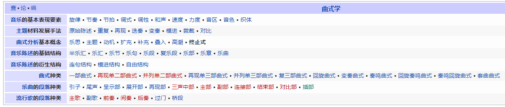

**（自用乐理学习笔记）**

笔记内容主要以下述目标为方向：

* 重点：
	* 基础乐理
		* 能够理解、熟练识别与演奏各种基础乐理涉及到的知识（如复合节奏、各种奇形怪状的和弦、转调等）
	* 视唱练耳
		* 能够听出、扒出大部分标准爵士乐的和声与旋律
	* 视奏：
		* 能够直接视奏大部分流行乐、练几遍就快速视奏出大部分爵士乐（不是特别复杂那种）
	* 爵士乐钢琴：
		* 能够分析爵士乐乐谱（曲式分析；一是为了提升演奏水平；二是为了识别Real Books中的错误）
		* 能够快速创作爵士乐和声+旋律+节奏（帮助提升即兴演奏的水平；特别地：记得即便弹错了，也要能即兴接下去，把“失误”变成即兴的一部分）
		* 能够即兴改变任何曲风的乐曲成为爵士乐风格
		* 熟练理解与演奏各种爵士乐音乐风格的乐理知识（和声+旋律+节奏）
		* 能够演奏每个爵士乐风格音乐的standards
		* 能够基于任意主流爵士乐风格（如Swing、Cool、Bebop、Modal、Latin等等）进行即兴演奏
	* 编曲
		* 能够“即兴”地在宿主上编任意主流爵士乐风格的乐曲。
	 （注意：编出成品是非常次要的、可有可无的“顺带”目标。这里学编曲，主要是为了培养编曲思维，以及综合训练并实操各种能力，如和声+旋律+配器+各种乐器的基本演奏习惯等等，然后让自己可以更好地玩爵士乐）
* 辅助： 
	* 古典乐：学古典乐主要不是为了学古典本身，而是为了学它的知识体系，以及用它丰富的学习资料，如和声/曲式。
	* 合成器+效果器：主要用来玩Fusion，以及增加即兴演奏时的乐趣（有点用各种语言痛快表达自己的感觉）。（P.S. 目的不是为了编曲）
	* 宿主：用于编曲练习，以及自己给自己编练习素材。注意编曲学习的方向是：Urban
* 额外：20世纪的J-pop、布鲁斯演奏等

P.S. 

* 日爵才是本体。因此要特别注意：学有丰富资料的流行乐+古典的一切（如乐理、编曲）就像是“异地求学”一样，但最终还是要回归日爵，这才是“快乐老家”，注意不要被带偏了。
* “快乐老家”：日爵Jam。个人感觉：日爵特色是旋律（如福居良的early summer），美国爵士是律动（groove）。
* “蹦迪老家”：美国Club。个人感觉：美国Club和其他国家的clubs不同点在于：美国人是真有轻松自由蹦跶的氛围。
# 主要内容

* 教学大纲

* 音乐基础

  * 基础乐理
  * 视唱练耳与扒谱
  * 和声（作曲的四大件之一）
  * 曲式（作曲的四大件之一）

  * 配器（作曲的四大件之一）

  * 复调与对位（作曲的四大件之一）

  * 乐曲分析

  * 作曲

  * 基础声学

  * 音乐心理学

* 宿主

* MIDI与合成器

  * 音序器（宿主）
  * 音源
  * 合成器
  * 效果器

* 爵士乐（爵士钢琴）

* 唱歌技巧

如果说基本乐理是教说话，那和声是教说更多好听的话，配器是教用不同方式说话，曲式是教言之有物。不掌握曲式的话，编曲的过程中容易没思路。

必须要会键盘，不然学习的时候，只看乐理无法感受音效效果，这样的学习对于后期的旋律创作以及即兴创作没有帮助。

# 拜男神Tom

# 学习方法

* 专注练琴，不要三心二意。不要一边想着其他事情（一会吃什么、看什么、玩什么、学什么、做什么等等），一边练琴。练琴要固定一个时间专心练。（没事多做正念练习）。
* 入格是为了出格（先学会规则，然后打破规则）：学所有知识都是如此。初学的时候，通过规则来框定知识体系，而当所有知识都内化之后，这些规则就可以被“遗忘”和打破了。
  就像学外语一样，初学外语时，需要记忆一堆词汇+语法等，但等外语说熟了，甚至接近母语水平，这些规则就不重要了（因为已经内化了）。如同我们对母语的语法的理解水平，很可能比不上把它当作第N外语学的人，但我们对母语的运用水平可以远远高于这些第N外语者。
* 关于笔记中练习技巧的重要性：很多技法的原理都是非常简单的，如转调（简单来说，给原调的每个音提高/降低多少个半音），这些对计算机来说再简单不过，但人脑+手不是机器。因此初学各种技法时，一定要思考好练习技法的技巧，不要上手就开始瞎练。好的技法，可以减少大脑的推演次数。也因此，一些人说，练乐器不仅仅是在练手，更是在练脑。
* 人的注意力是有限的。练习时，最大的注意力最终一定要放在听上。
* 每天的练习中，先练相对难的，这样才能有progress，再练相对简单的，这样才容易有正反馈（不然一直卡在难的部分，很有负反馈）。不然练完简单的就累了，就懒得练后面的难的了。
* 遇到难点时的练习方法：
	* 把练习乐段缩短
	* 慢慢练
	* 简化，比如先练一只手演奏、先练一个调。
* 感觉练习点简单时的做法：
	* 把24个大小调全都练一遍
	* 加速
	* 添加元素

* **每个技法需要练到不需要推演，就能演奏出的程度，进而把这些技法都内化成自然反应 + “本能”，否则在演奏时，大脑需要做大量“运算”，会明显感觉很累，且练习效率很低。**
  这个就跟学外语一样，如果每说一句外语，都要一个字一个字地思考每个单词的变形（如用什么时态，这个单词需要怎么变成这个时态等问题），那不仅脑子很累，而且说得极慢。讲稍微长的话，大脑就需要一直“运算”，疯狂“做题”，非常疲累与痛苦。
  **因此练习技法时，一定要往“不再需要推演”地程度去练习。进一步来说，一定需要将技法拆成最小单位去练习。**
  而“不需要推演”主要有以下几个方面：
    1. 乐理知识到演奏不需要推演。如一说“弹个C major”，不需要思考，手就能直接弹出
    2. 演奏到乐理知识不需要推演。如手随便在键盘上一摆，就知道手摆的音是什么和弦。
        1/2两个可以没事多在键盘上弹，然后思考自己弹的是啥来练习。
    3. 乐谱上的音符到乐理知识不需要推演。如乐谱上奇奇怪怪摆了4个音，你不需要思考，就反应出了它是X七和弦。
    4. 乐理知识到乐谱上的音符不需要推演。提醒：通常是通过在脑海中，想象某乐理知识在乐谱上长什么样来练习（可以在走路没事做的时候，在脑子里练）。
        3/4两个主要通过多看乐谱，多分析+学乐理时，想象对应的乐谱来练习。
    5. 乐谱上的音符到演奏不需要推演。提醒：其实这一步通常是建立在步骤3（即“乐谱上的音符到乐理知识不需要推演”）上的，即：当看到乐谱的符号时，自动反应出它是X和弦，然后大脑就根据X和弦以往的手感，直接演奏出。
        如果步骤3没练好，就直接演奏乐谱，人在视奏的时候就容易感到疲劳（因为得疯狂推演乐谱上的每个音对应什么乐理知识，然后再根据乐理知识推它的手型；或者直接让手一个个摆乐谱上的符号，然后自己弹得是啥也不知道）。
    6. 演奏到乐谱上的音符不需要推演。
        5/6两个主要通过多看乐谱，然后演奏+演奏时，想象对应的乐谱来练习。
    而由于大部人学习乐谱的方式是play by sight（而不是play by ear），**因此可以考虑优先重点练习：1. 乐谱上的音符到乐理知识不需要推演（多在乐理app/web上做练习），侧重于练脑；2. 乐理知识到演奏不需要推演（技法在步骤1中练熟了，就狂练），侧重于练手感。这样子，既可以加快视奏学习速度，还能快速把乐谱/乐理/演奏三者串起来。当然，也要注意聆听，以锻炼听感/乐感。**
* 一定要注重乐理的学习。学乐理的意义除了那些被说烂的理由，还有另外一个重要意义，即：知道自己不会什么，然后专门找资料去练。举例来说，一些人练钢琴曲，如果只是单手弹旋律，就觉得演奏起来非常简单，但同样简单的旋律，只要两只手同时演奏就会懵逼，也不知道如何提高，网上查也只能查到一些“分开练 + 慢慢练 + 多练”这样的理由，但如果乐理学得多，就知道本质是节奏感差，通常就没练过复合节奏（polyrhythms）。因此多学乐理，能更清楚、更准确地知道自己缺得什么知识+练习，然后更高效+有方向地去查漏补缺，而不是无脑全靠低效的“多练”来解决。

教材/课程类别：
* 教科书/课程：综合的、循序渐进的教科书/课程：系统学习时，以这类教材为主。
	* 教科书配套练习书/课程：基本不讲技法，纯练习题集：配合教科书内容，用这个来练。
* 乐理书/课程：侧重讲乐理、技法概念，少练习，或没练习：可以作为教科书/课程的补充、辅助来用；或者作为专攻乐理、查漏补缺时的书籍来用。
* 技法书/课程（Technique）：侧重讲各种实际演奏技法，可能有大量配套练习，也可能少练习，或没练习：可以作为教科书/课程内容的补充、辅助来用；或者作为专攻技法、查漏补缺时的教材来用。
* 乐曲练习册：纯乐理练习册，基本不会讲任何乐理+技法，纯练习册。主要用于学各种音乐风格+各种标准曲目。

TODO：补充视唱练耳部分

## 资源库

* https://pdfcoffee.com：淘爵士乐书籍的宝库（当然也能淘其他书）
# 学习APP

Play-along（伴奏是为了练习目的而制作的、带有bass、鼓和有时是钢琴的录音。伴奏是极好的学习工具，因为它们迫使你以稳定的节奏演奏，让你准备好与乐队一起演奏，并让你听到贝斯提供的和声环境）

* youtube搜：“backing track”
* IReal Pro：自动伴奏（可以练合奏 + 增加学习的趣味性） + 查询乐曲和弦
# 杂

## 值得关注的人/公众号/杂志

啟彬與凱雅的爵士樂 Chipin & Kaiya's Jazz：https://www.chipinkaiyajazz.com/

好和弦：
* https://www.youtube.com/@nicechordwiwi/videos
* https://nicechord.com/archives/：强烈推荐。能学到很多“我不知道我不知道”的知识。

[emastered](https://emastered.com/blog)

哎呀君：https://www.zhihu.com/people/iyamusic/posts

Haoshen Qi：https://www.zhihu.com/people/haoshen-qi/posts

https://www.youtube.com/@PianoFromScratch/videos

https://www.bilibili.com/video/BV1PJ411R79Q/?spm_id_from=333.788.videocard.19

https://zhuanlan.zhihu.com/p/177156632

https://magazine.midifan.com/

## 优秀资料

《粤语流行曲的发展与兴衰：香港流行音乐研究》—— 黃霑：评价：仙品。

[如何用音乐来表达抽象的感觉](https://www.huxiu.com/article/428049.html)

[为什么一张专辑，通常只有一首好听的歌？](https://www.huxiu.com/article/484633.html)

[车尔尼、哈农不具备音乐性](https://www.zhihu.com/question/305729156)
