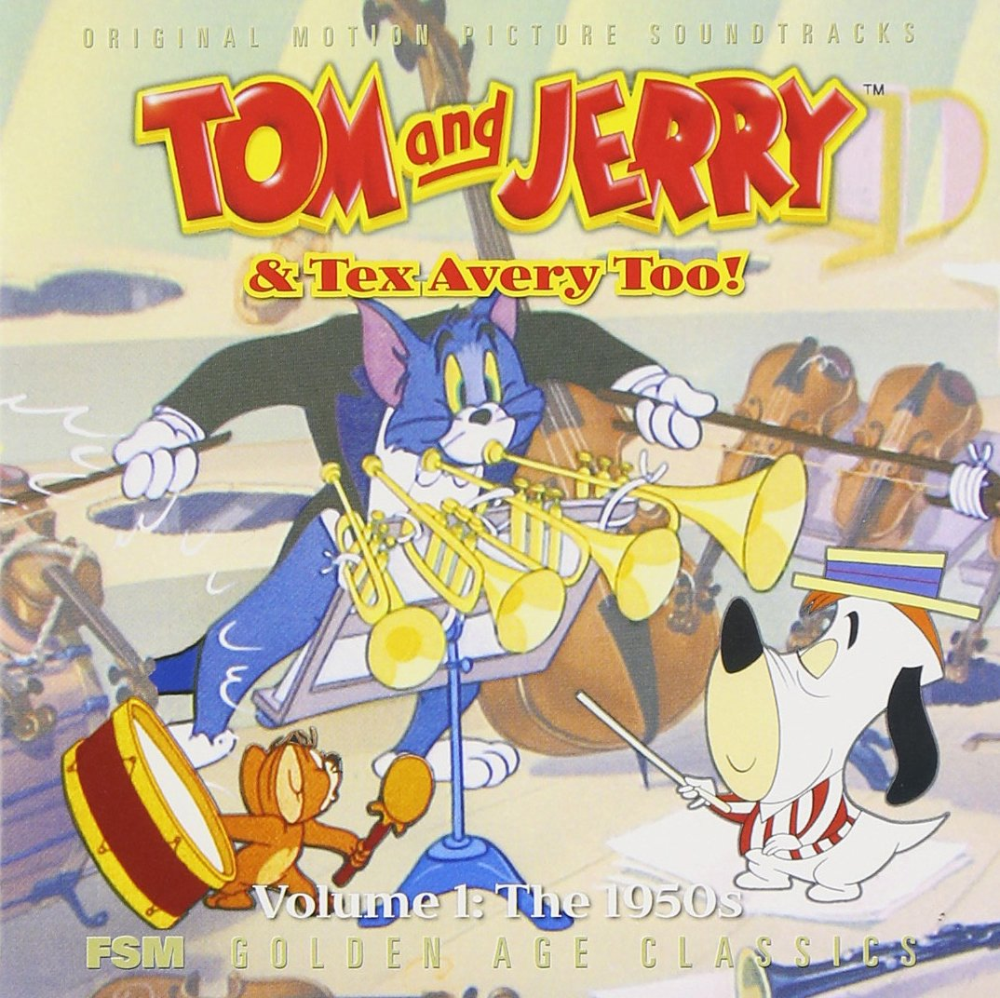

**（自用乐理学习笔记）**

# 主要内容

* 教学大纲

* 音乐基础

  * 基础乐理
  * 视唱练耳与扒谱
  * 和声（作曲的四大件之一）
  * 曲式（作曲的四大件之一）

  * 配器（作曲的四大件之一）

  * 复调与对位（作曲的四大件之一）

  * 乐曲分析

  * 作曲

  * 基础声学

  * 音乐心理学

* 宿主

* MIDI与合成器

  * 音序器（宿主）
  * 音源
  * 合成器
  * 效果器

* 爵士乐（爵士钢琴）

* 唱歌技巧

如果说基本乐理是教说话，那和声是教说更多好听的话，配器是教用不同方式说话，曲式是教言之有物。不掌握曲式的话，编曲的过程中容易没思路。

必须要会键盘，不然学习的时候，只看乐理无法感受音效效果，这样的学习对于后期的旋律创作以及即兴创作没有帮助。

# 拜男神Tom

# 学习方法

* 关于笔记中练习技巧的重要性：很多技法的原理都是非常简单的，如转调（简单来说，给原调的每个音提高/降低多少个半音），这些对计算机来说再简单不过，但人脑+手不是机器。因此初学各种技法时，一定要思考好练习技法的技巧，不要上手就开始瞎练。好的技法，可以减少大脑的推演次数。也因此，一些人说，练乐器不仅仅是在练手，更是在练脑。

* 每个技法需要练到不需要推演，就能演奏出的程度。
  这个就跟学外语一样，如果每说一句外语，都要一个字一个字地思考每个单词的变形（如用什么时态，这个单词需要怎么变成这个时态等问题），那不仅脑子很累，而且说得极慢。讲稍微长的话，大脑就需要一直“运算”，疯狂“做题”，非常疲累与痛苦。
  **因此练习技法时，一定要往“不再需要推演”地程度去练习。进一步来说，一定需要将技法拆成最小单位去练习。**
  而“不需要推演”主要有以下几个方面：
    1. 乐理知识到演奏不需要推演。如一说“弹个C major”，不需要思考，手就能直接弹出
    2. 演奏到乐理知识不需要推演。如手随便在键盘上一摆，就知道手摆的音是什么和弦。
        1/2两个可以没事多在键盘上弹，然后思考自己弹的是啥来练习。
    3. 乐谱上的音符到乐理知识不需要推演。如乐谱上奇奇怪怪摆了4个音，你不需要思考，就反应出了它是X七和弦。
    4. 乐理知识到乐谱上的音符不需要推演。提醒：通常是通过在脑海中，想象某乐理知识在乐谱上长什么样来练习（可以在走路没事做的时候，在脑子里练）。
        3/4两个主要通过多看乐谱，多分析+学乐理时，想象对应的乐谱来练习。
    6. 乐谱上的音符到演奏不需要推演。提醒：其实这一步通常是建立在步骤3（即“乐谱上的音符到乐理知识不需要推演”）上的，即：当看到乐谱的符号时，自动反应出它是X和弦，然后大脑就根据X和弦以往的手感，直接演奏出。
        如果步骤3没练好，就直接演奏乐谱，人在视奏的时候就容易感到疲劳（因为得疯狂推演乐谱上的每个音对应什么乐理知识，然后再根据乐理知识推它的手型；或者直接让手一个个摆乐谱上的符号，然后自己弹得是啥也不知道）。
    7. 演奏到乐谱上的音符不需要推演。
        6/7两个主要通过多看乐谱，然后演奏+演奏时，想象对应的乐谱来练习。
    而由于大部人学习乐谱的方式是play at sight（而不是play by ear），因此可以考虑优先重点练习：1. 乐谱上的音符到乐理知识不需要推演（多在乐理app/web上做练习）；2. 乐理知识到演奏不需要推演（技法在步骤1中练熟了，就狂练）。这样子，既可以加快视奏学习速度，还能快速把乐谱/乐理/演奏三者串起来。
TODO：补充视唱练耳部分
# 杂

## 值得关注的人/公众号/杂志

好和弦：https://www.youtube.com/@nicechordwiwi/videos

哎呀君：https://www.zhihu.com/people/iyamusic/posts

Haoshen Qi：https://www.zhihu.com/people/haoshen-qi/posts

https://www.bilibili.com/video/BV1PJ411R79Q/?spm_id_from=333.788.videocard.19

https://zhuanlan.zhihu.com/p/177156632

https://magazine.midifan.com/

## 优秀资料

[如何用音乐来表达抽象的感觉](https://www.huxiu.com/article/428049.html)

[为什么一张专辑，通常只有一首好听的歌？](https://www.huxiu.com/article/484633.html)

[车尔尼、哈农不具备音乐性](https://www.zhihu.com/question/305729156)
