音乐知识

* 基础乐理
* 和声（作曲的四大件之一）
* 曲式（作曲的四大件之一）
* 配器（作曲的四大件之一）
* 复调与对位（作曲的四大件之一）
* 音乐风格
* 乐器演奏

设备操作

* 设备连接
* 电脑
* 音序器（宿主）
* 音源
* 合成器
* 效果器

如果说基本乐理是教说话，那和声是教说更多好听的话，配器是教用不同方式说话，曲式是教言之有物。不掌握曲式的话，编曲的过程中容易没思路。

必须要会键盘，不然学习的时候，只看乐理无法感受音效效果，这样的学习对于后期的旋律创作以及即兴创作没有帮助

# 基础乐理

https://www.musicbody.net/music/theory/index.html

非常全面的乐理书：https://musictheory.pugetsound.edu/mt21c/DiatonicChordsInMinor.html

https://musictheory.pugetsound.edu/hw/MusicTheory-Aug-2020.pdf

Jazz：https://www.thejazzpianosite.com/jazz-piano-lessons/

## 重要性

对于乐器演奏而言，如果不懂乐理就直接死练乐谱，就好像背古诗，不懂古诗的意思，直接死记硬背古诗，这样不仅背得机械、痛苦、且背得效率也很低，肌肉记忆没了就不会演奏了。而如果懂了乐理再练乐谱，就好像背古诗时，不仅能读懂表面意思，还能品味每个词所代表的意象，甚至能联想到背后的。比如“寒蝉凄切，对长亭晚”（长亭是陆上的送别之所），最次的是要把字面意思看出来，然后再根据其意象明白其背后的含义，然后读/背/写各种古诗才能豁然开朗，融会贯通，甚至对其中的妙处拍手叫绝，更提升兴趣，为日后自己创作打下基础，乐理也是一个道理。

## 音乐

音乐的三大要素：和声、旋律、节奏。节奏与旋律的产生是人类音乐本能使然，而和声则是人类音乐思维发展到高级阶段的产物

#### 种类

* 根据发声媒介，将音乐分为声乐和器乐
* 根据作品的产生方式，将音乐分为民间音乐和创作音乐等
* 另外，还可从音乐作品的表演形式、社会功用、曲式、体裁、声部数量、织体类型、风格等不同角度对其进行更为具体的种类划分

#### 声部

由单音连续进行构成的横向旋律线条称为“声部”。

根据声部数量的多少，音乐作品分“单声部音乐”和“多声部音乐”两种类型

#### 单声部音乐（单声音乐、单音音乐）

定义：仅由一个旋律声部构成的音乐称“单声部音乐。

例如：无伴奏的独唱、齐唱，单声乐器的独奏、齐奏等。

#### 多声部音乐（多声音乐）

定义：由两个以上不同音高的声部同时发声构成的音乐称。

例如：重唱、重奏，合唱、合奏，带伴奏声部的独唱、独奏，多声乐器的独奏等。

#### 织体

多声部音乐中，各声部之间的关系、声部组合方式及其整体表现形态称为“织体”。

#### 主调音乐织体（主调音乐）

主调音乐织体有一个声部是主要旋律，其余声部缺乏独立性，只对主要旋律声部起陪衬、充实作用，这种多声部织体，称“主调音乐织体”

主调音乐根据“和声学”原则写作，以纵向和弦结构与横向和声进行为主导，其思维方式是和声性的


#### 复调音乐织体

定义：两个以上各具独立意义的旋律声部相互结合构成的多声部织体，称“复调音乐织体”

复调音乐根据“对位法”原则写作，以多个旋律声部的横向进行为主导，其思维方式是线条性的


#### 混合织体

主调音乐织体和复调音乐织体在实际作品中可混合使用，从而构成混合式织体形态。

## 音

### 音的产生

声音是由物体振动产生的，它包括发音体、外力和共鸣体三个要素。例如：钢琴、小提琴、琵琶等以琴弦为振动主体的乐器，正是通过演奏者击弦、拉弦或拨弦等外力，使琴弦及共鸣体振动，产生音波并形成声音。

人耳所能听到的声音频率范围为20~20000Hz，悦耳的乐音频率范围为40~4000Hz。  

### 音的属性

| 音的性质     | 决定因素                     | 单位       |
| ------------ | ---------------------------- | ---------- |
| 音高（高低） | 频率：发声体振动次数的快慢   | 赫兹（Hz） |
| 音值（长短） | 时值：发声持续时间的长短     | 拍         |
| 音量（强弱） | 振幅：发声体振动幅度的大小   | 分贝（dB） |
| 音色         | 谐波：泛音的多少及排列的次序 |            |

### 音的分类——乐音与噪音

音是由发声体振动产生的。

* 乐音。振动规则的、听起来音的高低明显的音
* 噪音。振动不规则、听起来音的高低不的音

乐音还可细分为“直音与腔音”。

直音就是发音持续过程中音高始终不变（频率固定不变）的单个乐音，如钢琴上正常奏出来的音，古筝、二胡的空弦音。

腔音就是发音持续过程中音高发生变化的单个乐音，如古筝、二胡运用演奏法使音高发生变化的按弦音。

其实，噪音也有高低区别，只是听起来不明显而已。如大军鼓与小军鼓相比，大军鼓音低、小军鼓音高。在音乐活动中，如无固定音高的锣、鼓等噪音乐器，在音乐风格和音乐感染力方面，是各种乐音乐器所无法替代的。

### 基音与泛音

物体除整体振动外，还同时存在局部振动。整体振动产生的音，称为“基音”；局部振动产生的音，称为“泛音”（也称为“倍音”）。整体与局部同时振动的现象，称为“复合振动”。

复合振动所产生的基音与泛音按高低次序的组合排列，称为“分音列”；不含基音，由泛音按高低次序的组合排列，称为“泛音列”。

泛音在音乐表演和理论研究中，具有重要意义。弦乐器的泛音奏法、管乐器的超吹、音律的制定、和弦的构成都与泛音有关。

#### 泛音列（Harmonic Series）

耳朵听到的“一个音”，其实不只有“一个频率”而已，而是由很多频率的音组合而成的。

如用弦乐弹奏低音C（130Hz），那么这根线会在一秒钟内上下摆动130回

二倍频率：如果一根弦被分成2段振动，那么其频率为130Hz*2=260Hz，则产生高八度的C


三倍频率：如果一根弦被分成3段振动，那么其频率为130Hz*3=390Hz

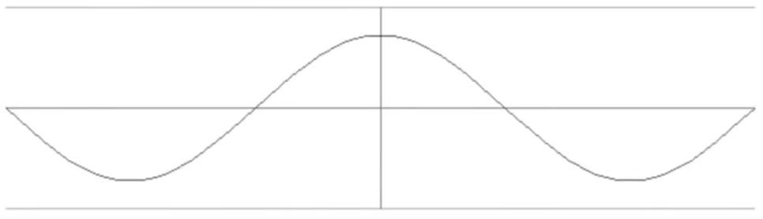

以此类推

钢琴的振动是所有模式的综合（非常随机），因此当弹下一个低音C时，钢琴会产生130（基础音）、260（第二泛音）、390（第三泛音）、520（第四泛音）、650（第五泛音）等等Hz的音

当大脑同时接受到这些频率的音时，大脑会自动把基础音理解成这个音的音高，把后面的所有泛音理解成音的音色


### 音域与音区

音域是指某一乐器或人声所能发出的最低音到最高音之间的声音范围。音区是指在某一乐器或人声的整个音域中，根据其音高或音色特点所划分的若干部分，每一部分称为一个音区，通常分为低音区、中音区、高音区。

#### 音的分组

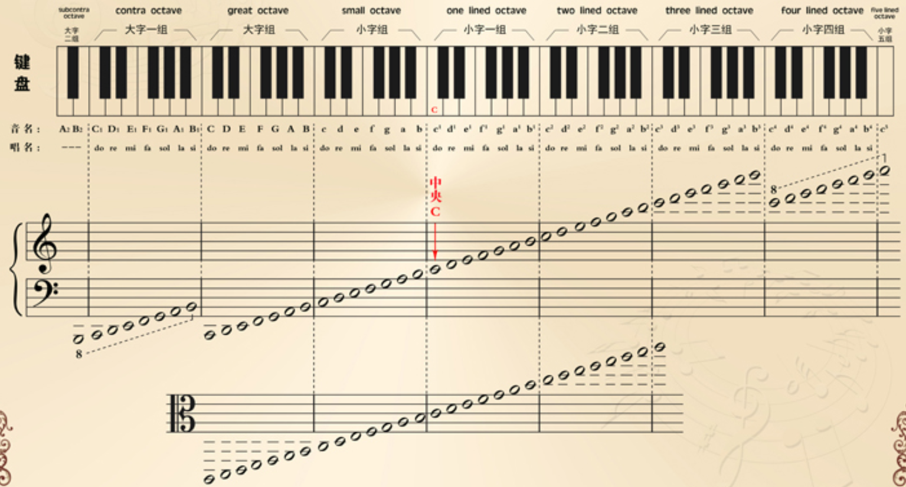


分组时每七个基本音级为一组，称为一个音组（包括7个白键，5个黑键）

1. 音组可分为大字组与小字组两类
2. 识别中央C。在琴键上，即在钢琴键盘上从左往右数第四组并列的两个黑键左下方的白键即为中央C音。在五线谱上，中央C的固定位置如下图：


3. 音名分组的正确写法：小字组音名为小写字母，在音名字母右上角标注音的组别，如D²，读作小字二组d；大字组音名为大写字母，在音名字母右下角标注组别，如E₁，读作大字一组E。

### 标准音

1834年德国斯图加特物理学家会议确定a1为440Hz，称为“第一国际音高”。我国轻工业部于1956年在北京召开的乐器专业会议上，规定采用第一国际音高作为中国乐器制造的标准音高。

### 乐音体系

乐音体系：音乐中所使用的乐音的总和。普通钢琴一般有88个琴键，其中有52个白键，36个黑键，几乎包含了常规人声和乐器所需要的全部乐音

音列：把乐音按照一定的音高关系和次序排列起来的一组音

音名：在乐音体系中，每个乐音都有其固定名称。通常用字母C、D、E、F、G、A、B来表示。在钢琴键盘上的位置是固定不变的


### 音阶级数（音级，Scale Degree）

https://www.tonegym.co/tool/item?id=scale-analyser

根据输入的音，找对应的音阶：https://showscale.com/

定义：音乐中使用的各个固定音高

#### 种类

脱离于调性时，音级分为两类：

* 基础音级。指七个具有独立名称的音级，即C、D、E、F、G、A、B。键盘的白色琴键。
* 变化音级（变音）。升高或降低基本音级而得来的音级。键盘的黑色琴键。有时，不同的音级代表同一个音高，如#E和F、B和bC、#G和bA等。这样关系的音级互为等音（Enharmonic Equivalence）。由于只有在十二平均律下才能使得所有半音关系相同，所以十二平均律是产生等音的前提条件。


在调性内讨论时，不使用调内的临时变音记号表示的音级称为**自然音级**，这与脱离调性时的划分并不完全对应：若这些音级是被调号升高或降低的，虽然它们属于变化音级，但也同时是自然音级。

##### 当首调遇上自然小调，自然小调的主音应该唱La还是唱Do

实际上，**两种唱法都存在**。第一种叫“**Do-based Minor**”，也就是把小调主音唱做“Do”。如下图，a小调的1级A音唱“Do”，b3级C音则唱“Me”（降Mi）。


另一种国内大部分人使用的就是“**La-based Minor**”，把小调主音唱做“La”。如下图，a小调的1级A音唱“La”，b3级C音则唱“Do”。


第二种使用的人更多，因为它与关系大调的唱名相同，整个音阶没有升降音，更容易唱。

而第一种“Do-based Minor“则会产生3个降音：Do、Re、Me（降Mi）、Fa、Sol、Le（降La）、Te（降Ti）。

如果考虑转调的情况，两种唱法各有利弊。假设有一首歌从C大调转c小调，采用“Do-based Minor“唱法，唱名跟具体音高保持一致，在听感上会感觉更协调。


而如果采用“La-based Minor“唱法，转调后同样的音高则需要换一个唱法。


但是如果一首歌从C大调转到其关系小调a小调，情况则正好相反，具体可自行推衍。

##### 变音记号（Accidentals）

临时升降号对同一小节内的同一个八度音有效

* 升记号（#）：升记号表示要将基本音级升高半音来演奏（唱）

  特别注意：E和F、B和C是半音关系，因此#E在钢琴键盘上的实际位置应是F，#B在钢琴键盘上的实际位置应是C

  

 * 降记号（b）：表示要将基本音级降低半音来演奏（唱）

   特别注意：E和F、B和C为半音关系，因此bF在钢琴键盘上的实际位置应是E，bC在钢琴键盘上的实际位置应是B

   
   
   
   
 * 重升记号（×）表示将基本音级升高两个半音（一个全音）。
   
 * 重降记号（bb）表示将基本音级降低两个半音（一个全音）。
   
 * 还原记号（♮）表示将已经升高或降低的音还原。提醒：有时还原记号只是其提示作用，提醒演奏者前面的音虽然临时升降号了，但这个音不需要。

#### 和声中的级数与名称（Scale Degree Names）

|                              級                              | 音级半音数 |                      中文名稱                      |             英文名稱              |                            意思                            | C調中的例子 |
| :----------------------------------------------------------: | :--------: | :------------------------------------------------: | :-------------------------------: | :--------------------------------------------------------: | :---------: |
| [](https://zh.wikipedia.org/wiki/File:Scale_deg_1.svg)/Ⅰ |     0      |     [主音](https://zh.wikipedia.org/wiki/主音)     |               Tonic               | [音階](https://zh.wikipedia.org/wiki/音階)中最**主**要的音 |      C      |
| [](https://zh.wikipedia.org/wiki/File:Scale_deg_2.svg)/ⅱ |     1      |   [上導音](https://zh.wikipedia.org/wiki/上导音)   |      Superleading tone/note       |                     从上方導向主音的音                     |     ♭D      |
| [](https://zh.wikipedia.org/wiki/File:Scale_deg_2.svg)/Ⅱ |     2      |   [上主音](https://zh.wikipedia.org/wiki/上主音)   |            Supertonic             |                    主音上方一个全音的音                    |      D      |
| [](https://zh.wikipedia.org/wiki/File:Scale_deg_3.svg)/ⅲ |     3      |   [小中音](https://zh.wikipedia.org/wiki/小中音)   |           Minor mediant           |                      小主三和弦的中音                      |     ♭E      |
| [](https://zh.wikipedia.org/wiki/File:Scale_deg_3.svg)/Ⅲ |     4      |   [大中音](https://zh.wikipedia.org/wiki/大中音)   |           Major mediant           |                    大主三和弦的**中**音                    |      E      |
| [](https://zh.wikipedia.org/wiki/File:Scale_deg_4.svg)/Ⅳ |     5      |   [下屬音](https://zh.wikipedia.org/wiki/下屬音)   |            Subdominant            |              屬音之下的音/主音下方纯五度的音               |      F      |
| [](https://zh.wikipedia.org/wiki/File:Scale_deg_4.svg)/IV⁺ |     6      |   重属[导音](https://zh.wikipedia.org/wiki/导音)   | Double dominant leading tone/note |                        導向属音的音                        |     ♯F      |
| [](https://zh.wikipedia.org/wiki/File:Scale_deg_5.svg)/Ⅴ |     7      |     [屬音](https://zh.wikipedia.org/wiki/屬音)     |             Dominant              |              第二重要的音/主音上方纯五度的音               |      G      |
| [](https://zh.wikipedia.org/wiki/File:Scale_deg_6.svg)/ⅵ |     8      | [小下中音](https://zh.wikipedia.org/wiki/小下中音) |         Minor submediant          |                      小下属和弦的中音                      |     ♭A      |
| [](https://zh.wikipedia.org/wiki/File:Scale_deg_6.svg)/Ⅵ |     9      | [大下中音](https://zh.wikipedia.org/wiki/大下中音) |         Major submediant          |                      大下屬和弦的中音                      |      A      |
| [](https://zh.wikipedia.org/wiki/File:Scale_deg_7.svg)/ⅶ |     10     |   [下主音](https://zh.wikipedia.org/wiki/下主音)   |             Subtonic              |                    主音下方一个全音的音                    |     ♭B      |
| [](https://zh.wikipedia.org/wiki/File:Scale_deg_7.svg)/Ⅶ |     11     |     [導音](https://zh.wikipedia.org/wiki/導音)     |    Leading-tone / Leading-note    |                        導向主音的音                        |      B      |

属音之所以被称为属音是因为它是由主音产生出来的，它属于主音。属和弦就是任何基于属音的和弦，而且使用同一音阶的音。

记忆方法：先死记1级（主音）与5级（属音），再根据各级的名称记忆各级所代表的音：2级比主音高一个全音，所以它是上导音；3级在1级与5级之间，所以是中音；4级在属音下方，所以是下属音；6级是大下属和弦的中音，所以是大下中音；7级是导向主音的音，所以是导音。

##### 音的稳定性（C大调）

稳定音：1 > 5 > 3。所以C大三和弦也非常稳定。

不稳定音：6 > 2 > 4 > 7

音阶中的音有着不同的微妙特性，这涉及到自然泛音的共振理论。泛音与基音的声波呈现出周期性的重合，会造成声音和谐程度的不同，也产生了稳定音与不稳定音。

一个基音的泛音列中，不算重复音的话，最先出现的是五度的属音，然后是三度音，然后是七度音，然后是九度，十一度和十三度。

因此音阶中的主音(第一音)是最稳定的，其次是第五音(属音)，再次是第三音(中音)。 

音阶中的第二音(上主音)、第六音（下中音）属于较不稳定的音，它们趋向于稳定音。第二音可以移动到第一、三音，第六音可以往下移动到第五音，有时也可经过第七音向上移动到主音。

第四音（下属音）和第七音（导音）由于恰好处于音阶的半音位置，在整个音阶中属于最不稳定音，它们有强烈的解决回稳定音的倾向（第七音导音解决到主音，第四音下属音解决到第三音中音）。

##### 音的倾向性（C大调）

不稳定音—>稳定音

2—>1	4—>3	6—>5	7—>1

音名是固定的，CDEFGAB在键盘哪个位置就始终在哪个位置。而唱名随着音乐的调变了，唱名也会变。所以编曲与弹吉他通常交流都是用音名

#### 调式变音

含义：调式音阶之外的临时变化音

使用目的：起到装饰作用，丰富旋律的色彩性，形成旋律的独特性

出现形式：

* 一般情况下，大多出现在旋律的弱拍、弱位等次要位置
* 以短时值居多
* 调式变音的运用一般以半音级进为主
* 在流行音乐中，调式变音的运用一般都是经过性的，以过渡音形式出现

### 唱名法（Solfège）

定义：用固定的音名（Note Name）唱出乐谱中的音高，常用do、re、mi、fa、sol、la、si来表示音的唱名（syllables），简谱中也用1、2、3、4、5、6、7来表示。

#### 种类

* 固定调唱名法（fixed do）。各音的音高是固定的，音名与唱名相一致，即C唱do，D唱re，E唱mi……依此类推。固定调唱名法不随调号的变化而改变唱名，这种唱名法有利于培养学生的固定音高
* 首调唱名法（movable do）。随着调号的变化而改变唱名，钢琴键盘上依据调号的不同任意一个音都可以唱成do，如C调，C唱do；D调，D唱do；E调，E唱do……依次类推

###  音程（Intervals）

音程：两个音之间的距离。

半音（Half Step）：两音之间最小的距离。钢琴键盘上相邻的两个琴键的距离就为半音，如E和F、B和C即为半音。

* 由两个相邻音级构成的半音叫自然半音：E-F、B-C、C-bD、#C-D、×F-#G
* 由同一音级的两种不同形式或不相邻的两个音级间构成的半音叫变化半音：bD-D、C-#C、#B-bD、E-bbG

全音（Whole Step）：两个半音可以构成一个全音。从钢琴键盘上来看，全音的特点是两音中间相隔一个琴键，如C和D、F和G这样的两音中间相隔一个黑键即为全音。

* 由两个相邻音级构成的全音叫自然全音：C-D、#F-#G、bC-bD、bB-C
* 由同一音级的两种不同形式或不相邻的两个音级间构成的全音叫变化全音：bC-#C、C-bbC、bbB-B、#C-bE、A-bC

#### 旋律音程（Melodic Intervals）与和声音程（Harmonic Intervals）

##### 旋律音程

音程中的两个音，先后发声，叫做旋律音程，旋律音程依照其进行的方向，分为上行，下行和同音进行。

按照音程的大小，可以分为：狭音程和广音程。狭音程是指三度以及三度以下的音程，而广音程则是四度或四度以上的音程。由狭音程构成的旋律一般比较平和、宁静、流畅、轻盈。而由广音程构成的旋律一般比较跌宕、起伏、开阔、奋进。

###### 从纯一度到纯八度，各种旋律音程的主要特点

* 纯一度：实际上就是同音保持，是思想之延续、力量之凝聚。
* 小二度：是典型剧烈的音程，倾向性极强。比如导音具有解决到主音的倾向。
* 大二度：是自然调式中旋律流畅进行的基本音程，平稳和温和。
* 三度：在大小调式中和五声调式中均应用广泛。在大小调式中，三度是小跳进音程。小三度表现出小调特性，大三度表现出大调特性。在五声调式中，小三度和大二度一样是旋律流畅进行的基本要素，是平稳级进而非小跳进（如mi 到 sol）。大三度很少用于五声调式。
* 纯四度：承上启下。弱起小节的纯四度上行具有号召、战斗性。（如国歌第一句的开头处）弱起小节的纯四度下行则具有雄伟沉着的特点。而在一拍或者以小节内使用纯四度，往往具有抒情性质。
* 纯五度：开阔，能将旋律推向高潮。
* 六度：是高潮的开头旋律常出现的音程，善于表现起伏较大的思想感情。
* 七度：由于不协和性，应用比较少。
* 纯八度：是大跳音程，能将乐曲推向高潮，开朗广阔。

##### 和声音程

音程中的两个音，同时发声，叫做和声音程。

#### 单音程（Simple Intervals）与复音程（Compound Intervals）

复音程是大于八度的音程

#### 特性音程

#### 音程表

[Interval Calculator](https://www.musictheory.net/calculators/interval)

| 半音数   | 0                              | 1                            | 2                          | 3                                       | 4                           | 5                              | 6                                                            | 7                             | 8                           | 9                           | 10                      | 11                            | 12                       |
| -------- | ------------------------------ | ---------------------------- | -------------------------- | --------------------------------------- | --------------------------- | ------------------------------ | ------------------------------------------------------------ | ----------------------------- | --------------------------- | --------------------------- | ----------------------- | ----------------------------- | ------------------------ |
| 音程     | 纯一度<br />（Perfect Unison） | 小二度<br />（Minor Second） | 大二度<br />(Major Second) | 小三度<br />（Minor Third）             | 大三度<br />（Major Third） | 纯四度<br />（Perfect Fourth） | 增四度/减五度<br />（三全音、Augmented Fourth、Diminished Fitth） | 纯五度<br />（Perfect Fifth） | 小六度<br />（Minor Sixth） | 大六度<br />（Major Sixth） | 小七度（Minor Seventh） | 大七度<br />（Major Seventh） | 纯八度（Perfect Eighth） |
| 协和性   | 完全协和音程                   | 不协和音程（Dissonant）      | 不协和音程                 | 不完全协和音程（Imperfect consonances） | 不完全协和音程              | 协和音程                       | 不协和音程                                                   | 协和音程                      | 不完全协和音程              | 不完全协和音程              | 不协和音程              | 不协和音程                    | 完全协和音程             |
| 英文缩写 | P1                             | m2                           | M2                         | m3                                      | M3                          | P4                             | A4、d5                                                       | P5                            | m6                          | M6                          | m7                      | M7                            | P8                       |

* 增音程 > 大音程 > 小音程 > 减音程
* 增音程 > 纯音程 > 减音程

注意：音程的度数不受变音记号影响

#### 快速识别音程

##### 对于自然音程

判断度数：

* 音程=高音-底音-1（C=1,D=2,E=3...）。对于超过八度的音，可以先按照高音和低音在一个八度算，最后再加7。

* 参考该方法：如果两个音同在线上或者间上，那就是3、5、7...，如果一个在线上一个在间上，那就是2、4、6...

  

  

判断性质：

* 记住：7个音级中，有两组自然半音，即E-F和B-C

* 二度和三度（大小）：

  * 有跨过这两组自然半音的音程就是小音程

  * 没有则是大音程

    举例：

    * E-G，其中就包含了E-F的半音，因此是小三度（3个半音），包含B-C半音的音程也同理。
    * F-A，其中没有包含任何E-F或B-C的半音，因此是大三度（4个半音）。

* 四度和五度（增减纯）：

  * 包含一组自然半音的是纯音程

  * 包含两组半音的是减音程

  * 没有包含任何半音的是增音程

    举例

    * E-A，包含了一组E-F半音，因此是纯四度（5个半音）
    * F-C，包含了一组B-C半音，因此是纯五度（7个半音）
    * B-F，同时包含了B-C和E-F，因此是减五度（6个半音）
    * F-B，没有包含任何自然半音，因此是增四度（6个半音）


    另外，白键中没有任何五度音程没有半音，也没有任何四度音程能同时跨越两组半音，因此自然音程中只且仅有一组增四和一组减五。

* 六度和七度（大小）：

  * 包含一组自然半音的是大音程

  * 包含两组自然半音的是小音程

    举例

    * D-B，只包含了一组E-F半音，因此是大六度（9个半音）
    * E-C，同时包含了E-F和B-C，所以是小六度（8个半音）
    * C-B，只包含了一组E-F半音，因此是大七度（11个半音）
    * D-C，同时包含了E-F和B-C，因此是小七度（10个半音）


##### 对于变化音程

* 排除变音记号，音符距离几个音就是几度。如D与E#相隔二度。注意误区：E#在键盘上是F，但它们不是小三度，在乐理中，五线谱两个音之间的距离不受键盘实际距离的影响，五线谱中的距离是几度，它就是几度。
* 无视变音记号，先根据`对于自然音程`的方法，确认原来的音程是什么性质。比如D与E是大二度。
* 加上变音记号，判断比原来的音程多或少了几个半音。所以D与E#是增二度。
  * 对于纯音程，大一个半音是增，小一个半音是减。如E与A是纯四度，与A#就是增四度
  * 对于大小音程，大一个半音是增，小一个半音是减
  * 增音程多一个半音是倍增，减音程少一个半音是倍减

#### 音程的转位

规律：原位与转位的度数相加等于9；大小增减互换，纯音程不变。

* 原位C-D：大二度

  转位D-C：小七度

* 原位C-E：大三度

  转位E-C：小六度

* 原位C-F：纯四

  转位F-C：纯五

* 原位C-Eb：小三

  转位Eb-C：大六

* 原位C-F#：增四

  转位F#-C：减五

#### 音程的协和性（听起来舒服与否）

* 完全协和音程：纯一度、纯八度
* 协和音程：纯四度、纯五度
* 不完全协和音程：大小三度、大小六度
* 不协和音程：大小二度、大小七度、增四度/减五度（三全音）

#### 音程的解决

不协和音程创造张力（tension），需要通过协和音程解决（resolve）

##### 不稳定音程的解决

在调式中，I级、III级、V级为稳定音级，II级、IV级、VI级、VII级为不稳定音级，Ⅱ倾向于Ⅰ，Ⅳ倾向于Ⅲ，Ⅵ倾向于Ⅴ，Ⅶ倾向于Ⅰ。由稳定音级构成的音程为稳定音程，如果音程内含有不稳定音级都为不稳定音程。

当不稳定音级有向稳定性音级倾向的要求时，这种要求就叫做“解决”。最简单的方法就是：就近解决到邻近的音程。如果不稳定音程中含有稳定音级，那即可以选择保持不动，也可以选择解决到邻近的稳定音级。

在音程的解决中，要避免平行五度（平五）和平行八度（平八）的出现，即由一个纯五度（或纯八度）进行到另一个纯五度（或纯八度）。两者是一种不良声部的进行。

##### 不协和音程的解决

不协和音程一般解决方法是把它进行到协和音程。这里要注意的是，所解决的协和音程会出现2种情况，它可能是稳定，也可能是不稳定的。那碰到不协和音程要怎么办呢？
解决方法：根据所制定的调，解决到协和音程。

解决要点：1.明确调式调性，音的进行要服从音的自然倾向性。2.不稳定音级做二度级进，解决到稳定音级上，这时稳定音级可保持或跳进到另一个稳定音级上。3.增音程扩大解决，减音程缩小解决。

不协和音程进行到协和音程，叫做“不协和音程的解决”。

主要方式仍是根据不稳定音到稳定音的倾向：

* 将不稳定音进到最近的稳定音
* 稳定音可以保持在原位不动或进到其他稳定音
* 增音程需向外扩大，减音程需向内缩小

#### 三全音（魔鬼音程、Tritone）

##### 定义

由三个音调或六个半音组成的音程。

每一个全音阶中只有一个三全音，它表现为四级音到七级音之间的距离。由于这个音程能将八度均分，所以它还可以表现为七级音到四级音之间的距离。所以在C大调中，F到B和B到F的音程都是三全音。

##### 音响效果

一种非常不和谐的音程，令人感到奇怪和出于意料

不协和的原因：当两个音符的频率之间存在一个固定的比例时，音高听起来就会很和谐。两个八度音符最合适的比例是2:1，这听起来会非常和谐，我们甚至给这两个音符起了相同的名字。下一个最和谐的音程是完全五度音阶，（3:2）。它在整个音程范围内都是连续的。

而三全音的音符最终会以45:32这一不堪入目的比例而结束（或者64:45，取决于你调的方式）。

##### 应用

由于在自然调式中便存在着三全音，所以这样的一个音程相较于其它的不存在于自然调式中的不协和音程来说，在各种情况下的应用也要更广泛。最典型的便是经典的D-T进行了，即属到主的进行。这里的属和弦一般都会采用属七和弦。以C大调为例，属七和弦的构成是G、B、D、F，其中B与F之间便是三全音的音程。

三全音也常应用在警报和紧急警报领域。

##### 三全音的解决

由于三全音听感不协和，性质不稳定，故而B和F两个音都有向旁边相距半音的位置进行解决的倾向。即B向C上行，F向E下行，从而变成一个不完全协和音程大三度，变成了G、C、D、E。由于在属七和弦中，五音对于和弦性质的影响最小，故而D音可以省略，这样的话，我们就得到了G、C、E三个音，这三个音刚好构成了C大调的主和弦C和弦。

于是，一个从属和弦到主和弦的进行便完成了。我们可以明显地看出，三全音的解决是促成这个进行的最大的动力。

##### 三全音代理（Tritone substitution）

一个属七和弦中存在一个三全音，但是一个相同的三全音却被两个属七和弦共享，因此我们可以认为它们是等同的可以互相替代。比如G的属七和弦和Db的属七和弦的三全音都是F和B。

##### 由G的属七和弦推导出Db的属七和弦的方法

1. 前面我们提到，在七和弦中，最不重要的音是五音，故而在换音之后的和弦中，B音或者F音都不应该成为五音。这样一想，唯一的解决方法就只有把B和F两个音的位置互换，让原本三音位置的B音移到七音位置，原本七音位置的F音移到三音位置，构成G、F、D、B。

2. 由于前面我们提到B到F和F到B之间都是三全音关系，故而这种变换不会对音程本身的性质带来改变。接下来我们得思考剩下的两个解决音应该怎么选。

   为了保持属七和弦的性质，我们需要新和弦的根音与新的三音F音之间的音程为大三度，那么，新的根音就应该是Db音；Db音向上推一个纯五度我们可以得到五音，即Ab音。

3. 因此得到和弦构成音：Db、F、Ab、B，即Db属七和弦。和弦中的B音我们可以看作是Cb音，这样构成音就是Db、F、Ab、Cb了，标准的属七和弦的结构。

这样的一个Db属七和弦，在一些情况下如果能拿来代替G属七和弦的话，也许就会给和弦进行增色不少。

不过需要注意的是，这种替代不是一定可行的，还是要根据旋律声部的进行来进行取舍。毕竟，这个和弦内部出现了两个听起来可能会让人感觉不适的调外音。

##### 具体应用

三全音代理不仅能应用在属到主的进行中的，而且在任何和弦前面都可以接上一个根音比目标和弦高半音的属七和弦。

即：某个和弦—>想要接的和弦算起上面五度音的属七和弦—>想要接的和弦

如C接Amin，则可插入E7（从Am算起），即便E7不是C大调中的和弦也没关系。由于属七和弦中有一个很不协和的音程，三音与七音距离三个全音（即三全音）

## 节拍与节奏

[The Rhythm Randomizer](https://www.rhythmrandomizer.com/)

### 节奏（Rhythm）

广义的节奏不仅包含音乐进行中各个音的长短组织关系，而且蕴涵着强弱拍交替（有无规律、有何种规律等）即节拍，以及力度、速度、重音、推进力、动感等等多方面的因素。

#### 重要性

节奏，在音乐中的地位十分重要，它和旋律是构成音乐的两个基本成分。人们常说，节奏是曲调的骨骼，音乐的生命。节奏可以脱离旋律而存在，旋律却离不开节奏。

在音乐中，节奏与旋律（指音高方面）、和声（含复调）合称三大要素并融为一体。但节奏也可脱离旋律与和声而独立，表现为不定音高的疏密，断连的点、线组合形式，且仍有一定的表现能力。如打击乐演奏时用的节奏。


速度：如80bpm（beats per minute）、120bmp，每分钟多少拍

小节：在乐曲中, 由一个强拍到下一个强拍之间的部分。一定数量的拍组合成小节（4/4：4拍为1节）

### 节拍（Meter）

定义：重拍和弱拍周期性的、有规律的、重复进行的模式

#### 节奏与节拍的区别

节奏具有多样性，是在某种节拍基础上不同时值的音灵活的、千变万化的组织形式。

节拍具有均匀性。节拍是强弱规律性的反复交替，没有时值变化。因此，有人称节拍是被合理地设计出来的，人工地、机械地规定出来的。节奏包含着节拍的特点，而节拍却不能概括节奏的全部意义。


单位拍：用某种固定时值的音符来表示节拍中的每一个时间片段，即“一拍”（Beat）。单位拍内也有强位、弱位之分。 

拍号（Time Signature）：表示节拍的记号。它由上下两个数字组成，下方数字代表单位拍的音符时值，上方数字代表单位拍的数量即拍子。 比如3/4拍是：三拍子、以四分音符为单位拍，念四三拍，英文是three four。

拍子（Meter）：将单位拍按照一定的强弱关系组织起来。

流行歌曲中，最常用的节拍是4/4拍，其次是3/4、6/8拍，再次是2/4拍，其他拍子不太常用。

### 形态分类

两套分类体系：德国-苏联-中国体系、英美体系

* 单拍子（Simple Meter）：每小节只有一个强拍的拍子（连“次强拍”也没有）。 如二拍子、三拍子
* 复拍子（Compound Meter）：两个或两个以上同类型单拍子的组合（至少有两个强拍）。如四拍子、六拍子。注意：在英美体系中，复拍子是把单拍子的每个拍再细分成三等分（一个附点音符）的拍子，并把三等分后的拍子当作一拍的三连音或一个附点音符。因此如果：拍子除以3是大于1的整数，那它就是复拍子。如四四拍，因为4/3=1.333不是整数，所以四四拍是单拍子。注意：三拍子还是单拍子。
* 混合拍子（Mixed Meter）：两个或两个以上不同类型单拍子的组合。 如五拍子、七拍子。
* 一拍子：每小节只有强拍，没有弱拍，常出现在我国戏曲或说唱音乐中。
* 自由节拍：在乐曲中,强音位置与单位拍时值都不是十分明确和固定的拍子。

#### 常见拍子

| 分类     | 英美体系 | 拍号 | 别称   | 含义                                                         | 强弱规律                                |
| -------- | -------- | ---- | ------ | ------------------------------------------------------------ | --------------------------------------- |
| 单拍子   | 单二拍子 | 2/2  | 二二拍 | 以二分音符为一拍，每小节两拍                                 | 强-弱                                   |
| 单拍子   | 单二拍子 | 2/4  | 四二拍 | 以四分音符为一拍，每小节两拍                                 | 强-弱                                   |
| 单拍子   | 单三拍子 | 3/4  | 四三拍 | 以四分音符为一拍，每小节三拍                                 | 强-弱-弱                                |
| 复拍子   | 单四拍子 | 4/4  | 四四拍 | 以四分音符为一拍，每小节四拍                                 | 强-弱-次强-弱                           |
| 复拍子   | 复二拍子 | 6/8  | 八六拍 | 以八分音符为一拍，每小节六拍。<br />英美：每小节有两拍，每拍三等分 | 强-弱-弱-次强-弱-弱                     |
| 复拍子   | 复三拍子 | 9/8  | 八九拍 | 以八分音符为一拍，每小节九拍。<br />英美：每小节有三拍，每拍三等分 | 强-弱-弱-次强-弱-弱-次强-弱-弱          |
| 复拍子   | 复四拍子 | 12/8 |        | 以八分音符为一拍，每小节十二拍。<br />英美：每小节有四拍，每拍三等分 | 强-弱-弱-次强-弱-弱-次强-弱-弱-弱-弱-弱 |
| 混合拍子 |          | 5/4  | 四五拍 | 以四分音符为一拍，每小节五拍                                 | 强-弱-弱-次强-弱<br />强-弱-次强-弱-弱  |

3/4与6/8不可混淆，但它们每小节的总时值相等，所以只要变化重拍位置就可以互相衔接。

| 名称                         | 含义       | 强弱关系            | 效果                                               |
| ---------------------------- | ---------- | ------------------- | -------------------------------------------------- |
| 二拍子<br />（duple meter）  | 每小节两拍 | 强—弱               | 表现方整、对称、顽强、刚健、有力。如进行曲、曲军乐 |
| 三拍子<br />（triple meter） | 每小节三拍 | 强—弱—弱            | 表现优美、流畅、灵活自由。如圆舞曲                 |
| 四拍子<br />（quadruple）    | 每小节四拍 | 强—弱—次强—弱       | 表现宽泛                                           |
| 六拍子                       | 每小节六拍 | 强—弱—弱—次强—弱—弱 | 表现舞曲                                           |

当一拍包括平均地两个音的时候,它就相当于二拍子，第一个音强，第二个音弱。同理其他的拍子。四三拍子中的六个八分音符，是由三个四分音符分解而成，所以每拍中的两个八分音符，第一个强，第二个弱。三拍连在一起，就变成了强、弱、次强、弱、次强、弱。


例子

| 名称     |                            |
| -------- | -------------------------- |
| 四三拍子 | 强、弱、次强、弱、次强、弱 |
| 八六拍子 | 强、弱、弱、次强、弱、弱   |

如图***\*红框\****为4/4拍的1小节。

一般演奏习惯

* 以一小节为单位，拍点上的音，力度较大，小节总体会有细微的渐弱
* 时值越长的音，力度会越大。时值越短的音，力度会越小

#### 变换拍子（polyrhythm、cross-rhythm）

两种或两种以上的拍子交替出现。变换拍子可能是有规律地循环出现，这时可将两种或两种以上的拍号并列标明，是流行歌曲中经常运用的一种形式。

一般情况下，使用变换拍子都是因为歌曲内容的需要，或是乐句对称的需要，或是音乐对比的需要

由于变换拍子使音乐的强弱规律发生变化，因此在律动上具有很大的对比性。

用法

* 无规律的变换拍子，即随处插入变换拍子，如《飞鸟与鱼》（齐豫）、《b小调雨后》（叶蓓）、《黑鸟》（Black Bird，披头士乐队）
* 有规律的变换拍子，即在固定乐句或段落间变换拍子，如《缀满钻石的天空中的露西》（Lucy In The Sky With Diamonds，披头士乐队）、《关于理想的课堂作文》（李晓东）等。

#### 情感

在创作一首歌曲时，首先要选择一个跟歌曲内容和情感相吻合的节拍，因此了解各种节拍的形象特征，有助于节拍选择的定位

* 4/4拍：表现范围比较广泛，节奏型的运用比较自由，基本上可以表现各种情绪的内容

  一般情况下，快歌以八分音符或大于八分音符的时值为基础，慢歌可使用任何节奏，但是最小时值一般不小于十六分节奏（Rap除外，它经常会采用小于十六分时值的节奏型）

  快速的4/4拍可以表现热烈、激情的情绪和动感的旋律，如《眉飞色舞》（郑秀文）、《红日》（李克勤）、《大女人》（张宇）、《女孩与四重奏》（丁薇）等

  慢速的4/4拍可以表现深情、稳重的情绪和舒缓的旋律，如《东风破》（周杰伦）、《听海》（张惠妹）、《最浪漫的事》（赵咏华）等

* 3/4拍：强弱分明，律动感较强

  在流行歌曲中，3/4拍的作品多以中速或中快速为主，如《棋子》（王菲）、《真心英雄》（李宗盛等）、《独角戏》（许茹芸）、《野花》（田震）等。节奏不宜太密集，音符时值不宜太短，一般都以八分音符以及大于八分音符的时值为基础，起骨干节奏作用，小于八分音符的时值可作为辅助节奏或色彩节奏运用

  快速的3/4拍子，适合表现欢快、热烈的情绪，如《相约九八》（王菲、那英）

  慢速的3/4拍，适合表现抒情、优雅的情绪，如《把根留住》（童安格）

* 6/8拍：由于它是6拍一个强音轮回，因此它的线条性较强，适合表现旋律柔美，具有曲线性的作品。

  一般情况下，6/8拍的歌曲速度较快，慢速歌曲大约在每分钟150拍左右，快速歌曲至少达到每分钟200拍以上
  
  6/8拍既具有3/4拍中3拍子的律动感，又具有4/4拍中复拍子的特点，因此，它是一种介于4/4拍和3/4拍之间的节拍类型，具有一种特殊的音乐气质。
  
  既可以表现抒情、柔美的旋律，如《同桌的你》（老狼）、《我想我是海》（黄磊）、《明天的明天的明天》（动力火车）、《那一场风花雪月的事》（周治平）、《寂寞在唱歌》（阿桑）、《当男人爱上女人》（When A Man Loves AWoman，迈克尔·波顿）等
  
  也可以表现大气、雄伟的情绪，如《一九九七永恒的爱》（群星合唱）、《永不分开世界的爱》（群星合唱）等
  
* 2/4拍是单拍子，每小节只有一个强拍一个弱拍，强弱非常分明，适合表现雄壮、有力、欢快、活泼的情绪
  
  由于2/4拍强弱太过分明，节奏一般都比较简单，多以四分、八分节奏为基础。因此在当代流行歌曲中，2/4拍歌曲相对较少，如《对面的女孩看过来》（任贤齐）等
  
  不过在20世纪三四十年代的“大上海”时期，由于受到美国爵士乐的影响，流行歌曲多用2/4拍，如《夜上海》（周璇）、《玫瑰玫瑰我爱你》（姚莉）、《凤凰于飞》（周璇）、《蔷薇处处开》（龚秋霞）等。
  
  早期在新奥尔良和芝加哥发展起来的“新奥尔良爵士”多以2/4拍为基础。20世纪三四十年代，“大上海”流行歌曲受到美国早期爵士乐的影响较大，因此也多用2/4拍
  

### 不完全小节（pickup measure、anacrusis）

在一个小节内，所有音符时值相加恰好是拍号所标明的拍数时，被称为“完全小节”若所未能达到拍号所标明的拍数，被称为“不完全小节”。

不完全小节通常出现在歌曲开头或是结尾。

注意弱起小节是没有资格计入第一小节的，第一小节一定是完整的

### 节奏型（Rhythmic Pattern）

https://www.youtube.com/watch?v=Y5_27Gc28ls&ab_channel=SaherGalt

作用

* 有助于快速试奏乐谱
* 规范记谱

如果我们将每两组节奏型组合，它就变成了4/4拍，在我们以后弹奏乐谱的时候，遇到4/4拍，我们就把它分为2拍来识谱

```abc
X:1
T:以2拍为单位的八分音符节奏型
M:2/4
L:1/8
K:C
DD DD | D2 DD | DD D2 |
D D2 D | D3 D | D D3
```
如果我们将每两组节奏型组合起来，它就变成了2/4拍，在我们以后弹唱乐谱的时候，遇到2/4拍，我们就把它分为1拍来识谱。遇到4/4拍我们就把它分为4拍来识谱

```abc
X:1
T:以1拍为单位的十六分音符节奏型
M:1/4
L:1/16
K:C
DDDD | D2DD | DDD2 |
DD2D | D3D | DD3
```


#### Shuffle和Swing


Shuffle节奏起源于乡村布鲁斯音乐，是将三连音中第二个拍点去掉不弹，整体听起来很有力量，很有顿挫的感觉。


如下图：讲每拍分为三等分，中间的那一个拍点不弹


Swing所表现的是将三连音三个拍点中的第一及第二个音符用连接线将它们连起来，整个的节奏就有一种轻盈跳跃的感觉。

很多教材里面都是这样描述的：swing是三连音中两个音连在一起（这种说法《好和弦》说是错的），shuffle是三连音中间的音休止。

如果按照节奏声部来说，这样说没错的，但这种说法很笼统，单独弹solo是分不出Swing和Shuffle的，在旋律乐器里面，演奏Swing和Shffle听起来都是一样的。

从节奏声部区分：Shuffle这种节奏类型，是Blues音乐当中最常用的一种节奏

Show Me The Money - Buddy Guy

以上是一首传统布鲁斯，你会发现底鼓的声音很强烈！而且每拍都很满很重“动-动 哒-动 动-动 哒-动”

Count 'Em - Count Basie

从鼓组来看，Swing中很少听见像Shuffle那样强烈的底鼓，常听见的是镲片“次 次-次 次 次-次” 这样的声音，而且鼓手通常在第一拍和第三拍只打一下，在二四拍演奏swing的八分音符，swing的节拍也相对比较松散。

Swing这种节奏类型是摇摆乐的灵魂，摇摆乐最早起源于1930年前后，在1935-1946年间达到巅峰，其中最能代表这个乐风的则是「摇摆乐之王」班尼固德曼所领军的六重奏(BennyGoodmanSextet)

在贝斯的演奏上，Shuffle中的贝斯通常会持续有力地演奏三连音的八分音符，而在Swing中，贝斯手会演奏WalkingBass，这一点从上面两首歌曲中也有很明显的体现。

Swing演奏技巧

把一对八分音符中，前面那个音弹长一点，后面那个音短一点。（注意长度不一定是2:1，随意就好）

前面那个音弹轻一点，后面那个音重一点，但也不是一定的

不要把音跟音之间弹得太重叠

注意休止符的时机

把装饰音弹得比它后面的音大声

把一些比较快的音处理成Ghost Notes

偶尔可以把整个旋律的拍点延后

让强音与弱音的反差大一些

Swing完全不是古典音乐中的Tempo Rubato

常见错误：

1. 根本忽略需要Swing节奏
2. 误解Swing为弹性速度
3. 太重叠、太圆滑、太歌唱性
4. 太多跳音、太可爱
5. 没有明显的轻重之分

注意：Swing的节奏不是绝对的，以下只是一种参考节奏


```abc
X:1
T:原节奏+Swing（没断）+Shuffle（有断）
M:1/4
L:1/8
K:C
Q:140
CDEF GFED | C6 z2 |
C2DE2F G2FE2D | C6 z2 |

```


### 切分音（Syncopation）

定义：从弱拍或者弱部分开始，并延续到下一个强拍或强部分的音符，简单说就是“由弱到强”的音符就是切分音。带有切分音的节奏就叫做切分节奏。

且切分音一般强于其前后的两个音

作用：改变音的强弱关系

一拍=前半拍（强位）+后半拍（弱位）。注意还可以继续这个划分下去

例子：下图中的二分音符在弹奏的时候是弱拍，但它延续到了后面的次强拍。因为这个音是由弱到强，所以它是一个切分音


我覺得流行歌曲之所以那麼多切分音，除了使音樂變有趣以外，還有個重要因素：這樣比較容易填詞、唱念。 歌詞某個詞尾的字或句尾的字都需拉長，於是就會形成「短、長」這種 iambic （抑揚格）的詩歌音步。當然，詩歌的音步還有其他類型的韻律。詩歌的「韻律」與音樂的節奏可互相印證。[https://zh.wikipedia.org/wiki/%E9%9F%B5%E5%BE%8B](https://www.youtube.com/redirect?q=https%3A%2F%2Fzh.wikipedia.org%2Fwiki%2F%E9%9F%B5%E5%BE%8B&stzid=UgioXQHJO5BmdngCoAEC&redir_token=QUFFLUhqbG4xdERrS2JIamZLVWpqQVpqdHdaeERfdWRSQXxBQ3Jtc0ttVFdGMUpzT0wxbjBMN0RFN0tTeG9iYXNvTWQ0LVgwdHFwbHBtVTNtRDA1S1NsZ3AwYWtFTmJFYlJzcHRvNHFrMlNCeVQzS1Y5eGx1dFRxTTlkM0RHV2RsekROZ2JpZzl3aklnWUtQUnM2aEJXMVc1bw%3D%3D&event=comments)  另外，中文因為有聲調（每個聲調有自己的調值和調形），優秀的創作者能夠順應調域或旋律線的形狀，以免產生歧義。

### 反拍节奏（backbeat、offbeat）

在一般的hiphop音乐中，一般歌曲是4/4拍（即一个小节有四拍，每拍时长为一个四分音符），把四分音符分为两部分就是两个八分音符，那一个小节就有八个八分音符，hiphop里的正拍（on beat）一般在第每个四分音符上的第一个八分音符，所以在1,3,5,7个八分音符上，反拍就在2,4,6,8上，底鼓在重拍，所以是1,3,5,7八分音符，如果按照反拍唱，那么就是要把节奏卡在2,4,6,8个八分音符上，参考雷鬼风格（不是hiphop的雷鬼唱法）和某些电子摇摆乐。

当音乐以4/4拍为节拍，clap和snare出现在第二拍和第四拍这种节奏模式，我们称为*反拍节奏（backbeat）*


SUBDIVIDE THE BEAT 1-2-3-4 BECOMES 1-8-2-&-3-&-4-&SYNCOPATED NOTES COMEON THE 'AND' SYLLABLE

### 连音（Tuplet）

为在指定的节拍中加以分拆或结合而成的音符组合，包括三连音和二连音。标记方法为加上数字或比例，以指出对固有节拍的改变，有时亦会用向下的中括号或连结线标出连音的范围。

通常标示连音只会简单地标上数字，但这方法有时会引起误会。如七连音可以由四拍、六拍分拆而来或由八拍结合而来。为了有效分辨它们，会分别以7:4、7:6、7:8表示，前者为音符数目，后者为节拍数目。

另外，一个六连音可以看成两个连续的三连音（重音在第一、四个音）或每两个音为一组的一个三连音（重音在一、三、五个音），因此在有可能引起误会时应小心标记。

补充：英语Tuplet源于后缀的误用，从Quintu(s)-(u)plet和Sextu(s)-(u)plet等取出。其余代替此字的有：Irrational rhythm、Artificial division、Irregular rhythm、Irregular rhythmic groupings等。

#### 作用

因不同长度的音符只带有二分关系，连音可以用以构造特别的旋律。它也可以在特定的时间内加上更多的音符或减少一些音符，造成速度的改变。有时候连音标志着乐曲的旋律较为自由，该部分可供演奏家作演绎之用，加强乐曲美感。

#### 三连音（Triplet）

https://en.wikipedia.org/wiki/Tuplet

三连音是最常见的连音，在两拍中加上三个音符，使得每个音符长度为 2/3 拍。 一长一短的音也可以为三连音，如一个四分音符和一个八分音符，长音的长度为 2/3 拍，短音为 1/3 拍。下图第三至第五个音符为三连音：

[](https://zh.wikipedia.org/wiki/File:Irrational_rhythm.png)

#### 二连音（Duplet）

在复拍子中，二连音可以看成两个附点音符，每个音带3/2拍，惟使用二连音或四连音比连续使用附点音符更常见。

#### 虚线连音

由西方传入，顾名思义这种连音以虚线表达，但不同的是使用乐器演奏并无改变，改变的是跟着音乐唱歌的人，当唱到虚线连音的部分，歌手便要把那个歌词连续数个音符(高低音)连起来唱(英、中亦可)。

#### 演奏

演奏三连音时，三个音的力度要均衡（上下浮动的误差在正负8之间），尤其不要习惯性地把第一个音加强

## 钢琴键盘 

1.两个琴键之间相差**半音**（如上图红色两个键）。黑键（36）+白键（52）=88个


2.黑键与白键的表示（【C#（C sharp）】：升C，【Db（D flat）】：降D）


3.分组

最右边一个键：小字五组（小写字母+左上角数字）

最左边三个键：大字二组（大写字母+右下角数字）。A₂

中央C：小字一组的c   

4.软件的中央C是C5   

------

## 五线谱记号

https://en.wikipedia.org/wiki/List_of_musical_symbols

小节线：在乐曲的记谱中，使小节被此分开的垂直细线。小节线起到分割小节的作用，它作为强拍的标记，写在强拍的前面。

### 连音记号（Legato。圆滑线、连音线、Slur）

用连线标记，一般记写在音符的上方或下方，表示连线内的音要唱、奏得连贯、流畅。


在器乐曲中用连线来划分乐句：弦乐曲中表示用一弓拉完连线内的乐句；管乐曲中表示用一口气吹奏完连线内的乐句。

在声乐曲中连线表示一字多音。

在较长的乐段一直有圆滑流畅的要求，则用Legato字样来标记出来。

### 跳音记号（Stagato。顿音、断音）

用小圆点、倒三角来标记，一般记在音符的上方或者下方，表示该音要唱、奏得相互分离、短促、跳跃（断奏）。

类别

* 长跳音。用小圆点标记，演奏该音符的一半时值
* 短跳音。用倒三角标记，演奏该音符的1/4时值


#### 保持音记号

保持音记号（Sostenuto），用短横线来标记，一般记写在音符的上方或下方，表示该音要唱、奏得饱满、时值保持充分，同时要稍稍加强一些力度。


### 滑音记号

多用于民间音乐。用斜波线或弯曲的箭头来标记，表示该音在唱、奏时要有向上或向下的滑音，或者是从该音滑向另一音。


在钢琴、手风琴、竖琴、木琴等乐器上所用的滑奏（也称刮奏），也是类似于滑音的奏法，刮奏标记用glissando（简写为gliss）来表示。

#### 琶音记号

琶音记号（Arpeggio），用竖直的波线来标记，一般记写在音符的左方，是钢琴、竖琴等乐器的常用奏法，只用在和弦上，表示该和弦中的音由下向下逐个奏响、并保持到该和弦的结束。也可以在其正文加上箭头，表示该和弦中的音是由上向下逐个奏响。


### 反复记号（Repeats）

乐曲部分或全部重复时，可使用反复记号。反复记号按其功能的不同：

1.小节内的音型反复记号

用斜线标记，斜线的数目与符尾数目相同，表示反复前面的音型。


2.全小节的反复记号

用斜线和圆点标记在小节内，斜线的数目与符尾数目相同，表示反复前面的整小节。


3.两小节的反复记号

用斜线和圆点标记在小节线上，表示反复前面的两小节。


4.从头反复记号

用标记，表示从头反复。


5.中途反复记号

用标记，表示记号内的部分反复。如果“前反复记号”正好在乐曲的最开始，则可以省略


6.多结尾反复记号

，表示反复后有不同的结尾。第三小节上方有个1，表示第一结尾，第四小节上方有个2，表示第二结尾


7.*D.C.*反复记号

*D.C.*表示从头反复到*Fine* *D.C.* 处结束。D.C.是意大利语，全称为Da Capo。“al Fine” => “to the end”。


Fine后面是“终止线”，因为这里是真正的结尾，而D.C. al Fine后面是“段落线”，因为这里不是乐曲结尾：1、2、3、4、5、6、7、8、1、2、3、4。注意：从头演奏时，可以跳过其他反复记号，只需演奏一遍。


8.*D.S.*反复记号

*D.S*表示从处反复到*Fine* *D.S.* 处结束。Dal Segno


9.带有跳跃记号的D.C.或D.S.记号

跳跃记号(——)标记在乐曲中间的某一部分，表示乐曲反复时，越过记号范围内的部分直接唱奏后面。跳跃记号会出现两个，有时前面那个会带上To Coda，表示从这里跳到Coda段落，后面那个跳跃记号会带上Coda，指这里就是Coda段落。遇到这样的记号，在D.C.或D.S.反复过后需要跳过跳跃记号中间的段落。


例如下面这个五线谱，就是D.C. al Coda，正确演奏顺序为1、2、3、4、5、6、1、2、3、4、7、8。


下面这个五线谱，就是D.S. al Coda，正确演奏顺序为1、2、3、4、5、6、2、3、4、7、8。


10.自由反复记号

记号，表示自由反复记号内的曲调，根据需要反复若干次。


混合型反复记号

1, 2, 3, 4, 1, 2, 3, 5, 6, 7, 8, 2, 3, 9, 10, 11, 12


### 意大利音乐术语

意大利文经常被用于音乐记谱，指导演奏者如何演奏音乐。音乐术语最早是在 17 世纪由意大利作曲家使用，自此之后传播到世界各地。

#### 速度（Tempo）

谱上指示的每分钟拍数（BPM）仅是一般的指引。在现代乐中，节拍器标记指示的 BPM 拍数（例如 ♩= 120）可以作为速度标记的补充或替代。以下列表为速度标记：

| 术语               | 意义                   | BPM        |
| :----------------- | :--------------------- | :--------- |
| *adagietto*        | 小柔板，比柔板稍快     | 72-76      |
| *adagio*           | 柔板                   | 66-76      |
| *allegretto*       | 稍快板，比快板稍快     | 112-120    |
| *allegrissimo*     | 极快的快板             | 172-176    |
| *allegro*          | 快板                   | 120-168    |
| *allegro moderato* | 中庸的快板，比快板稍慢 | 116-120    |
| *andante*          | 行板                   | 76-108     |
| *andante moderato* | 中庸的行板，比行板稍快 | 92-112     |
| *andantino*        | 小行板，比行板稍快     | 80-108     |
| *grave*            | 缓板                   | 25-45      |
| *larghetto*        | 稍缓板，比慢板稍快     | 60-66      |
| *larghissimo*      | 极慢板                 | 25 或以下  |
| *largo*            | 慢板                   | 40-60      |
| *lento*            | 慢                     | 45-60      |
| *moderato*         | 中板                   | 108-120    |
| *prestissimo*      | 最急板                 | 200 或以上 |
| *presto*           | 急板                   | 168-200    |
| *vivace*           | 活泼的快板             | 140-176    |
| *vivacissimo*      | 极活泼的快板           | 172-176    |


Larghissimo* – very, very slow (24 bpm and under)

*Adagissimo* – very slow (24-40 bpm)

*Grave* – very slow (25–45 bpm)

*Largo* – slow and broad (40–60 bpm)

*Lento* – slow (45–60 bpm)

*Larghetto* – rather slow and broad (60–66 bpm)

*Adagio* – slow with great expression[[10\]](https://en.wikipedia.org/wiki/Tempo#cite_note-10) (66–76 bpm)

*Adagietto* – slower than *andante* (72–76 bpm) or slightly faster than *adagio* (70–80 bpm)

*Andante* – at a walking pace (76–108 bpm)

*Andantino* – slightly faster than *andante* (although, in some cases, it can be taken to mean slightly slower than *andante*) (80–108 bpm)

*Marcia moderato* – moderately, in the manner of a march[[11\]](https://en.wikipedia.org/wiki/Tempo#cite_note-11)[[12\]](https://en.wikipedia.org/wiki/Tempo#cite_note-12) (83–85 bpm)

*Moderato* – at a moderate speed (108–120 bpm)

*Andante moderato* – between *andante* and *moderato* (thus the name) (92–112 bpm)

*Allegretto* – by the mid-19th century, moderately fast (112–120 bpm); see paragraph above for earlier usage

*Allegro moderato* – close to, but not quite *allegro* (116–120 bpm)

*Allegro* – fast, quick, and bright (120–156 bpm) (*molto allegro* is slightly faster than *allegro*, but always in its range; 124-156 bpm)

*Vivace* – lively and fast (156–176 bpm)

*Vivacissimo* – very fast and lively (172–176 bpm)

*Allegrissimo* or *Allegro vivace* – very fast (172–176 bpm)

*Presto* – very, very fast (168–200 bpm)

*Prestissimo* – even faster than *presto* (200 bpm and over)

##### 速度的改变

速度標記通常標記在樂曲第1小節或轉換速度之處，在最高一行樂器的五線譜之上。在管弦樂總譜裏，速度記號也會出現在弦樂組之上，以讓指揮容易看見。而速度漸變的標記，如*rit.*或*accel.*，在鋼琴或其他鍵盤類樂器的樂譜裏，常常標記在兩行之間。

下列为速度变化的术语和缩写。渐进式的变化术语可以用破折号来延伸，以表示变化的持续时间，例如 "*rit. _ _ _*".

| 术语                       | 缩写          | 意义                                                         |
| :------------------------- | :------------ | :----------------------------------------------------------- |
| *a piacere*                |               | 速度任由演奏者决定                                           |
| *a tempo*                  |               | 用於漸快和漸慢標記之後，表示回復漸快或漸慢之前的速度         |
| *rallentando*              | rall.         | 渐慢，特別用於章節結束的地方                                 |
| *ritardando*               | rit., ritard. | 渐慢                                                         |
| *ritenuto*                 | riten.        | 立即慢下来                                                   |
| *stretto*                  |               | 立即加快                                                     |
| *rubato*                   |               | 弹性速度                                                     |
| *Allargando*               |               | 逐漸減慢轉強，特別用於作品結束的地方                         |
| *stringendo*               |               | 渐快，字面上有“收紧”之意                                     |
| *accelerando*              | accel.        | 渐快                                                         |
| *Meno Mosso*               |               | 緩慢點                                                       |
| *Più Mosso*                |               | 稍快點                                                       |
| *Tempo primo* 或 *Tempo I* |               | 如果樂曲有多次速度轉變，Tempo primo 表示回復樂曲一開始的速度，例如一首三段曲式的作品，可以是Allegro - Andante - Tempo Primo |

###### 中國音樂的速度

傳統中國音樂亦有慢板、中板、快板、流水板的標記，稱為板眼，在傳統器樂或戲曲的樂譜裏常見，通常標記於1段樂曲之前或1段唱詞之前。

在戲曲音樂，板眼更接近於西方的拍號而非速度記號：慢板通常指「一板三眼」（又稱一板三叮），即1個重拍，3個輕拍，可視為西方的四拍子。而中板是「一板一眼」，可視為西方的兩拍子；快板或流水板是「有板無眼」，可視為西方的一拍子。

中國音樂的引子或尾聲常常是「散板」，散板的意思是沒有固定的節奏，演奏者可以自行決定每個音的長度，作彈性的快慢處理，在意義上和古典音樂的Senza misura（沒有節拍）和ad libitum（自由節拍）相近。

因為沒有準確的速度標記，中國戲曲音樂和傳統中國音樂的速度常常是約定俗成，即某一體裁習慣上是以某一速度演奏，則會依據這種傳統演奏。但同一樂曲的速度，在不同地方和不同流派可以有不同的演繹。

而20世紀以來，中國音樂受到西方影響，作曲家亦常常會加上西式的速度和感情標記。

#### 力度（Dynamics）

下列为常见的力度记号；这些记号表示响度的相对变化，并不是指特定的音量级别。与其他意大利术语记号相反的是，力度记号标记通常会写在五线之下，或介于两个五线之间。

| 术语            | 符号      | 意义 |
| :-------------- | :-------- | :--- |
| *pianississimo* | ***ppp*** | 最弱 |
| *pianissimo*    | ***pp***  | 极弱 |
| *piano*         | ***p***   | 弱   |
| *mezzo piano*   | ***mp***  | 中弱 |
| *mezzo forte*   | ***mf***  | 中强 |
| *forte*         | ***f***   | 强   |
| *fortissimo*    | ***ff***  | 极强 |
| *fortississimo* | ***fff*** | 最强 |

##### 力度变化（Dynamic changes）

渐强渐弱符号 () 用于表示几个小节的力度变化，而 *cresc.* 和 *dim.* 则用来表示较长乐句的力度变化。术语的指示则可以用破折号来延伸，以表示变化的持续时间。

| 术语                             | 符号                                                      | 意义                         |
| :------------------------------- | :-------------------------------------------------------- | :--------------------------- |
| *crescendo*                      | ***cresc.*** 或  | 渐强                         |
| *diminuendo*、decrescendo        | ***dim.*** 或  | 渐弱                         |
| *fortepiano*                     | ***fp***                                                  | 强后即弱                     |
| *sforzando, forzando, szforzato* | ***sfz***, ***sf*** 或 ***fz***                           | 突强（用于音符或和弦）       |
| *rinforzando*                    | ***rfz*** 或 ***rf***                                     | 突强（用于音符、和弦或乐句） |

#### 技巧

下列为常见的演奏技巧术语，这些术语指示演奏者使用特定的演奏技巧，以产生所需的声响。

Articulations specify the length, volume, and style of attack of individual notes.

| 术语             | 缩写        | 意义                                                         |
| :--------------- | :---------- | :----------------------------------------------------------- |
| *arpeggio*       | arp.        | 琶音；指和弦的音由低到高或由高到低依次奏出                   |
| Accent           |             | 重音。An accent indicates that a note should be played louder, or with a harder attack than surrounding unaccented notes. It may appear on notes of any duration.<br />[](https://en.wikipedia.org/wiki/File:Music-marcato.svg) |
| Marcato          |             | A marcato marking indicates that the note should be played louder or more forcefully than a note with a regular accent mark. In organ notation, this sign often does not indicate marcato, but instead that a pedal note should be played with the toe. When printed above the note it indicates the right foot, and below the note indicates the left foot.<br />[](https://en.wikipedia.org/wiki/File:Music-strong-marcato.svg) |
| *glissando*      | gliss.      | 滑音；指两个音之间连续变化音高，以达到上下运行的效果         |
| *legato*         |             | 连奏又称连音，是一种音与音平滑相连的演奏法                   |
| *mano destra*    | m.d.        | 右手                                                         |
| *mano sinistra*  | m.s.        | 左手                                                         |
| *con sordino*    |             | 加弱音踏板，或者不加延音踏板（以钢琴为例）                   |
| *senza sordino*  |             | 不加弱音踏板，或者加延音踏板（以钢琴为例）                   |
| *pizzicato*      | pizz.       | 拨奏；用手指拨出声响，而不是使用弓来拉奏                     |
| *portamento*     | port.       | 滑音；指两个音之间连续变化音高，以达到上下运行的效果         |
| *tutti*          |             | 乐团全体演奏                                                 |
| *staccato*       | stacc.      | 断音奏法；音与音之间不连接<br />[](https://en.wikipedia.org/wiki/File:Music-staccato.svg) |
| *staccatissimo*  | staccatiss. | 特短断音奏法；音与音之间明显分隔<br />[](https://en.wikipedia.org/wiki/File:Music-staccatissimo.svg) |
| tenuto           |             | 保持音                                                       |
| Fermata or Pause |             | 延音记号。A fermata indicates that a note, chord, or rest is sustained longer than its written value. It will usually appear on all parts in an ensemble. The fermata is held for as long as the performer or conductor desires.<br />[](https://en.wikipedia.org/wiki/File:Music-fermata.svg) |
| *vibrato*        |             | 抖音；音符的音调快速反复微变化                               |

#### 情绪

以下为常用的情绪术语。这些术语可帮助演奏者通过节奏、力度和演奏技巧来捕捉作品的情绪。

| 术语         | 意义             |
| :----------- | :--------------- |
| *agitato*    | 激动、急促的     |
| *animato*    | 活泼、精神焕发的 |
| *cantabile*  | 如歌似的         |
| *con amore*  | 带有爱的         |
| *con brio*   | 充满活力的       |
| *con fuoco*  | 如火如荼的       |
| *con moto*   | 活跃的           |
| *dolce*      | 甜蜜的           |
| *doloroso*   | 悲伤的           |
| *energico*   | 精力充沛的       |
| *espressivo* | 充满感情的       |
| *grazioso*   | 优雅的           |
| *leggiero*   | 轻快的           |
| *maestoso*   | 庄严的           |
| *marcato*    | 用力的           |
| *risoluto*   | 坚决有力的       |
| *scherzando* | 诙谐的           |
| *sostenuto*  | 延宕的           |
| *tenuto*     | 持续的           |
| *tranquillo* | 宁静的           |

#### 反复记号（Repeats）

下列为反复记号。这些反复记号指示演奏者重复演奏作品的某些段落。

| 术语                | 记号                              | 意义                                                         |
| :------------------ | :-------------------------------- | :----------------------------------------------------------- |
| *Fine*              |                                   | 反复到此记号结尾                                             |
| *Coda*              |    | 表示该段落为乐章结尾                                         |
| *Segno*             |  | 反复的开端或结尾                                             |
| *Da Capo*           | D.C.                              | 从头再奏                                                     |
| *Da Capo al Fine*   | D.C. al Fine                      | 从头再奏后，演奏到 *Fine* 记号为止                           |
| *Da Capo al Coda*   | D.C. al Coda                      | 从头再奏后，演奏到  记号为止（有时会以 *To Coda* 取代），再跳至第二个记号完结 |
| *Da Capo al Segno*  | D.C. al Segno                     | 从头再奏后，演奏到  记号为止 |
| *Dal Segno*         | D.S.                              | 从  记号再奏                |
| *Dal Segno al Fine* | D.S. al Fine                      | 从  记号再奏，演奏到 *Fine* 记号为止 |
| *Dal Segno al Coda* | D.S. al Coda                      | 从  记号再奏，演奏到  记号（有时会以 *To Coda* 取代），再跳至第二个记号完结 |

#### 一般术语

下列为一般术语，这些术语一般用来修饰其他术语 *allegro molto*（非常快）和 *con amore*（带有爱的）。

| Term            | Meaning                      |
| :-------------- | :--------------------------- |
| *ad libitum*    | 任意（通常指的是速度和风格） |
| *assai*         | 非常                         |
| *con*           | 带有                         |
| *ma*            | 但                           |
| *ma non tanto*  | 但不太                       |
| *ma non troppo* | 但不过分                     |
| *meno*          | 较不                         |
| *molto*         | 甚                           |
| *non*           | 不                           |
| *più*           | 更                           |
| *poco*          | 稍微                         |
| *poco a poco*   | 逐渐                         |
| *senza*         | 无、不带有                   |
| *simile*        | 按照、同                     |
| *subito*        | 突然、快速                   |

## 调（广义上的Mode, 和声学范畴）

### 调（Key）

调式的中心音，简单说就是音阶开始的音。Key of C是说主音为C。

主音在音乐中可以通过以下方式加以确立：

* 作为首音、尾音
* 作为最高/低音
* 作为最响的音
* 作为反复出现的音

当主音确立后，其他音听起来的音响效果都将相对于它，它们相对于主音的音程也将创造出张力与解决效果，因而也尝试了音的倾向性。

### 音阶（Scale）

定义：调式中的音，按照高低次序（上行或下行），由主音到主音排序起来就叫做音阶。

在记忆构成大调/小调的音级时，可以先将该调的基础音级写出，再在基础音级的基础上根据音级关系加上#或b记号。


#### 全音阶（Whole tone scale）

全音音阶，由6个音组成，音阶中所有音之间的音程都是全音。

##### 特征

这种音阶回避了半音的倾向性，因而具有一种游移不定的独特魅力。

##### 组成音

主音、上主音、大中音、重属导音、小下中音、下主音。

##### 全音音阶表

| [主音](https://zh.wikipedia.org/wiki/主音)         | ♭C                                                           | ♭G                                                           | ♭D                                                           | ♭A   | ♭E   | ♭B   | F    | C    | G    | D    | A    | E    | B    | ♯F   | ♯C                                                           | ♯G                                                           | ♯D                                                           | ♯A                                                           |
| -------------------------------------------------- | ------------------------------------------------------------ | ------------------------------------------------------------ | ------------------------------------------------------------ | ---- | ---- | ---- | ---- | ---- | ---- | ---- | ---- | ---- | ---- | ---- | ------------------------------------------------------------ | ------------------------------------------------------------ | ------------------------------------------------------------ | ------------------------------------------------------------ |
| [上主音](https://zh.wikipedia.org/wiki/上主音)     | ♭D                                                           | ♭A                                                           | ♭E                                                           | ♭B   | F    | C    | G    | D    | A    | E    | B    | ♯F   | ♯C   | ♯G   | ♯D                                                           | ♯A                                                           | ♯E                                                           | ♯B                                                           |
| [大中音](https://zh.wikipedia.org/wiki/大中音)     | ♭E                                                           | ♭B                                                           | F                                                            | C    | G    | D    | A    | E    | B    | ♯F   | ♯C   | ♯G   | ♯D   | ♯A   | ♯E                                                           | ♯B                                                           | [](https://zh.wikipedia.org/wiki/File:DoubleSharp.svg)F | [](https://zh.wikipedia.org/wiki/File:DoubleSharp.svg)C |
| 重属[导音](https://zh.wikipedia.org/wiki/導音)     | F                                                            | C                                                            | G                                                            | D    | A    | E    | B    | ♯F   | ♯C   | ♯G   | ♯D   | ♯A   | ♯E   | ♯B   | [](https://zh.wikipedia.org/wiki/File:DoubleSharp.svg)F | [](https://zh.wikipedia.org/wiki/File:DoubleSharp.svg)C | [](https://zh.wikipedia.org/wiki/File:DoubleSharp.svg)G | [](https://zh.wikipedia.org/wiki/File:DoubleSharp.svg)D |
| [小下中音](https://zh.wikipedia.org/wiki/小下中音) | [](https://zh.wikipedia.org/wiki/File:Doubleflat.svg)A | [](https://zh.wikipedia.org/wiki/File:Doubleflat.svg)E | [](https://zh.wikipedia.org/wiki/File:Doubleflat.svg)B | ♭F   | ♭C   | ♭G   | ♭D   | ♭A   | ♭E   | ♭B   | F    | C    | G    | D    | A                                                            | E                                                            | B                                                            | ♯F                                                           |
| [下主音](https://zh.wikipedia.org/wiki/下主音)     | [](https://zh.wikipedia.org/wiki/File:Doubleflat.svg)B | ♭F                                                           | ♭C                                                           | ♭G   | ♭D   | ♭A   | ♭E   | ♭B   | F    | C    | G    | D    | A    | E    | B                                                            | ♯F                                                           | ♯C                                                           | ♯G                                                           |

#### 变化音阶（alt音阶、Altered Scale）

用于爵士乐中。

##### 属和弦的变化音（Alterations in Dominant Chords）

把属和弦里的某一些音，升高或降低一个半音。这些音通常是5度或9度音，而5度与9度都可以升高或降低，因此可以得到b5（#11）、#5（b13）、b9、#9。如在C9和弦（C-E-G-Bb-D）中，G可以弹G/Gb/G#，而D可以弹D/Db/D#，因此C9和弦可以有9种（3*3）弹法。而它的音响效果要靠多听。

##### 含义

以X为主音的变化音阶就是：X升高半音后的旋律小音阶。如以C为主音的变化音阶就是：Db旋律小音阶（D♭、E♭、F♭、G♭、A♭、B♭、C、D♭），其中，E♭音等于D♯音，F♭等于E音，A♭音等于G♯音。把这几个替换一下，便可以更直观地看到Alt音阶与旋律小调音阶的联系（D♭、D♯、E、G♭、G♯、B♭、C、D♭）：


##### 运用

在爵士乐中，通常可以用MixoLydian（1 2 3 4 5 6 b7）这条音阶来演奏属七和弦，因为这条音阶的1 3 5 b7刚好组成一个属七和弦（图中红圈里的音）。


而为了获得更加丰富、更加有张力和紧张感的声响效果，以突出乐曲的灵活，避免死板，因而会采用变化音阶来演奏属七和弦。

##### 練習方式

需要反复练习。練習彈每一個調，左手彈省略五度音的屬七和弦，右手彈 Altered Scale。

##### 来源——属七和弦

Alt音阶与属七和弦联系得十分紧密的。Alt音阶在一定程度上可以说就是由属七和弦发展过来的，或者说，为了迎合属七和弦的听感而被制造出来的。

C属七和弦的构成音为：C、E、G、B♭，而在属七和弦中，对其和弦性质影响最小的音便是五级音。所以我们可以去掉C属七和弦里的G音，保留C、E、B♭三个音。然后按照“变化”的原则，把音阶里其余的所有音（D、F、G、A）全部改成变化音，比如D音我们可以改成D♭和D♯两个音、G音可以改成G♭和G♯、A音可以改成Ab和A♯，F音只能改成F♯，但是，A♯和B♭是等音关系，所以A♯省去不要。这样一来，我们就可以得到以C为主音的Alt音阶了：


如果继续放在C属七和弦的框架内看待这个和弦，那么除了原始的C、E、B♭三个音之外，其余的音我们可以理解成该和弦的♭9音、♯9音、♯11音、♭13音。

#### 减音阶（Diminished Scale。八声音阶。爵士乐常用）

两个减七和弦合在一起的音阶。

只用记忆以C、C#、D为开始的三组半全减音阶，就可以记住所有的减音阶，另外9个音开始的音阶都是重复的

在平常的学习中，我们习惯从音阶推导和弦。但是在减音阶的学习中，我们反其道而行之，用减七和弦推导减音阶，反而更有效。

##### 推导步骤

1. 推导减音阶的根音。如从C减七和弦：C、Eb、Gb、Bbb（A），可以推导出C减音阶的根音C、三音E b、五音Gb和七音Bbb（A）。
2. 推导延伸音。如果要给一个和弦加延伸音，这个延伸音必须是和弦音的大九度。因此由于C减七和弦是由C、Eb、Gb、Bbb（A）组成的，那么它的延伸音分别有D（C的大九度音），F（Eb的大九度音），Ab（Gb的大九度音），B（Bbb（A）的大九度音）。
3. 组合根音与延伸音，得到减音阶。将C减七和弦内音和它的延伸音进行组合，就可以得到一条C减音阶了，它们分别是C、D、Eb、F、Gb、Ab、Bbb（A）、B。这条音阶包含了8个音

##### 种类

* 全半减音阶（Whole-half diminished scale）。音阶相邻两个音的音程关系是全半交替的。如C减音阶（C、D、Eb、F、Gb、Ab、Bbb（A）、B）。C和D是全音，D和Eb是半音，Eb和F是全音，F和Gb是半音，Gb和Ab是全音，Ab和Bbb（A）是半音，Bbb和B是全音
* 半全减音阶（Half-whole diminished scale）。音阶相邻两个音的音程关系是半全交替的。

注意两种音阶中的音是完全一样的。如D开头的半全减音阶和#D开头的全半音阶，里面的音完全一样。


在C半全减音阶中，包含了一个C7属七和弦（CEG bB），音阶中的另外4个音对于C和弦的角度来看，bD是降九音，#D是升九音，#F是升十一音，A是十三音，这四个音都是在属七和弦上常用的变化音或延伸音，因此C的半全减音阶=C7和弦+四个常用的变化音/延伸音，因为很多变化音，所以围绕C7和弦乱弹变化音，也比较好听。

### 音律（Temperament）

“音律”简称“律”，是指乐音体系中各音的准确高度及音高的相互关系。确定每个音准确高度的方法，称为律制。目前，国际上通用的律制主要有十二平均律、五度相生律、纯律三种。

其中，十二平均律在世界的应用最为广泛。

#### 十二平均律（Equal Temperament）

指将纯八度（如 c1-c2），分成十二个均等的部分（即半音）。

调号：C	#C	D	#D	E	F	#F	G	#G	A	#A	B
（共12个。从左到右，由低至高）

##### 半音阶（半音音阶，Chromatic Scale）

在一个八度中，一连串所有的十二个音符

调式：在一个音阶中，环绕一个主音的和声关系构建出的音与音之间的排列模式（如：全全半全全全半）

#### 五度相生律（Pythagorean Intonation）

以分音列中的第二分音与第三分音之间的音高关系，连续相生而求得各音（律）的准确音高的方法，叫作“五度相生律”。中国的五度相生律采用三分损益法产生，是世界上最早的求律方法。根据五度相生律定出的C、D、E、F、G、A、B七个音的高低关系，与十二平均律中的七个音，音名相同，但音的高低却不完全相同。这种音高上的差异，就是由于定律法的不同而产生的。

#### 纯律

以分音列的第二分音和第三分音之间的纯五度，再插入一个第四分音与第五分音的大三度作为求律的方法，叫作“纯律”。欧洲发现和使用纯律的历史比中国晚得多，南北朝时期，中国的琴律已广泛以七弦十三徽徽位作为定弦标准音使用，这说明纯律的律学理论在当时已经具体运用于实践。

### 调号（Key Signature）

调号表明了一段旋律的调式，并标明音符的升或降。线、间上调性的临时升降记号会影响旋律中所有的音符，除非有一个还原号。

记忆技巧：

* 调号中每个音的升降号位置是固定的

* 如果升降号都没有，那就死记它是C大调、A小调

* 如果是升号，那就看最后一个升号在哪个音上，给它加一个半音，得出来的音就是X大调的主音，而给它减一个全音，那得出的音就是X小调的主音。如调号只有一个F#，那就给F#加一个半音，得到G，那它就是G大调。而给它减去一个全音，得到E，那它就是E小调。

  注意：E#升高一个半音是F#、B#升高一个半音是C#。

* 如果是降号，那就看倒数第二个降号在哪个音上，那个音就是X大调的主音。如果只有一个降号，那就死记它是F大调/D小调

|                        Key signature                         |                    Major key                     |                    Minor key                     |
| :----------------------------------------------------------: | :----------------------------------------------: | :----------------------------------------------: |
| [](https://en.wikipedia.org/wiki/File:Treble_clef_with_empty_staff.svg) no sharps or flats | [C major](https://en.wikipedia.org/wiki/C_major) | [A minor](https://en.wikipedia.org/wiki/A_minor) |

|                        Key signature                         | Added ♯ |                        Major key                        |                        Minor key                        |                        Key signature                         | Added ♭ |                       Major key                        |                       Minor key                        |
| :----------------------------------------------------------: | :-----: | :-----------------------------------------------------: | :-----------------------------------------------------: | :----------------------------------------------------------: | :-----: | :----------------------------------------------------: | :----------------------------------------------------: |
| [](https://en.wikipedia.org/wiki/File:G-major_e-minor.svg) 1 sharp |   F♯    |    [G major](https://en.wikipedia.org/wiki/G_major)     |    [E minor](https://en.wikipedia.org/wiki/E_minor)     | [](https://en.wikipedia.org/wiki/File:F-major_d-minor.svg) 1 flat |   B♭    |    [F major](https://en.wikipedia.org/wiki/F_major)    |    [D minor](https://en.wikipedia.org/wiki/D_minor)    |
| [](https://en.wikipedia.org/wiki/File:D-major_b-minor.svg) 2 sharps |   C♯    |    [D major](https://en.wikipedia.org/wiki/D_major)     |    [B minor](https://en.wikipedia.org/wiki/B_minor)     | [](https://en.wikipedia.org/wiki/File:B-flat-major_g-minor.svg) 2 flats |   E♭    | [B♭ major](https://en.wikipedia.org/wiki/B-flat_major) |    [G minor](https://en.wikipedia.org/wiki/G_minor)    |
| [](https://en.wikipedia.org/wiki/File:A-major_f-sharp-minor.svg) 3 sharps |   G♯    |    [A major](https://en.wikipedia.org/wiki/A_major)     | [F♯ minor](https://en.wikipedia.org/wiki/F-sharp_minor) | [](https://en.wikipedia.org/wiki/File:E-flat-major_c-minor.svg) 3 flats |   A♭    | [E♭ major](https://en.wikipedia.org/wiki/E-flat_major) |    [C minor](https://en.wikipedia.org/wiki/C_minor)    |
| [](https://en.wikipedia.org/wiki/File:E-major_c-sharp-minor.svg) 4 sharps |   D♯    |    [E major](https://en.wikipedia.org/wiki/E_major)     | [C♯ minor](https://en.wikipedia.org/wiki/C-sharp_minor) | [](https://en.wikipedia.org/wiki/File:A-flat-major_f-minor.svg) 4 flats |   D♭    | [A♭ major](https://en.wikipedia.org/wiki/A-flat_major) |    [F minor](https://en.wikipedia.org/wiki/F_minor)    |
| [](https://en.wikipedia.org/wiki/File:B-major_g-sharp-minor.svg) 5 sharps |   A♯    |    [B major](https://en.wikipedia.org/wiki/B_major)     | [G♯ minor](https://en.wikipedia.org/wiki/G-sharp_minor) | [](https://en.wikipedia.org/wiki/File:D-flat-major_b-flat-minor.svg) 5 flats |   G♭    | [D♭ major](https://en.wikipedia.org/wiki/D-flat_major) | [B♭ minor](https://en.wikipedia.org/wiki/B-flat_minor) |
| [](https://en.wikipedia.org/wiki/File:F-sharp-major_d-sharp-minor.svg) 6 sharps |   E♯    | [F♯ major](https://en.wikipedia.org/wiki/F-sharp_major) | [D♯ minor](https://en.wikipedia.org/wiki/D-sharp_minor) | [](https://en.wikipedia.org/wiki/File:G-flat-major_e-flat-minor.svg) 6 flats |   C♭    | [G♭ major](https://en.wikipedia.org/wiki/G-flat_major) | [E♭ minor](https://en.wikipedia.org/wiki/E-flat_minor) |
| [](https://en.wikipedia.org/wiki/File:C-sharp-major_a-sharp-minor.svg) 7 sharps |   B♯    | [C♯ major](https://en.wikipedia.org/wiki/C-sharp_major) | [A♯ minor](https://en.wikipedia.org/wiki/A-sharp_minor) | [](https://en.wikipedia.org/wiki/File:C-flat-major_a-flat-minor.svg) 7 flats |   F♭    | [C♭ major](https://en.wikipedia.org/wiki/C-flat_major) | [A♭ minor](https://en.wikipedia.org/wiki/A-flat_minor) |

### 形成 "调" 有三个条件

1.有一个主音 (Root)。主音也就是根音，最重要的音。调的名称以根音命名，之后的第二个名称表示调的音程关系。

（1）C Major：C 为根音，是一种大调音程关系。

（2）G Mixolydian：G 为根音，Mixolydian (调五) 的关系。

2.具备形成音阶的音程关系 (Interval)。形成音阶的关系有两个条件：

（1）有限的音程关系所构成 "音群"。有限的音程指的是：可以让音阶回到根音，造成关系不断反复的关系结构。像 C D E F G A B C <-- 一定是从 C 会回到自己 C，如果回不来，就无法定义成音阶。

（2）音群必须有先后次序。音的排列有先后次序，C D E 跟 D E C 是不一样的。

3.形成有次序的顺阶和弦观念：简单说，就是和声系统。条件一二是确立音阶的基本要素，他们成立之后，才能够继续定义其顺阶和弦。顺阶和弦是用音阶作为其组成的元素，换句话说，顺阶和弦的组成音必定落在音阶里。

所以，我们一般在说一首曲子是什么调时，会说： "C 大调"，或者 "a小调"。"a小调" 就等于告诉大家歌曲的基本信息为：

- 曲子使用的音阶根音 (Root,或说是主音) 为 A

- 音程关系为小调 =>1 2 b3 4 5 b6 b7 => W H W W H W W

- 有一组顺阶和弦通过此音阶。歌曲中超出顺阶和弦以外的，要用其他理论解释。（以七和弦为例）

  | Level    | Ⅰ     | Ⅱ    | Ⅲ    | Ⅳ     | Ⅴ    | Ⅵ    | Ⅶ     | 备注/说明 |
  | -------- | ----- | ---- | ---- | ----- | ---- | ---- | ----- | --------- |
  | 顺阶和弦 | Cmaj7 | Dm7  | Em7  | Fmaj7 | G7   | Am7  | Bm7-5 | 不断反复  |

当一个乐句，或者一个段落的和弦进行落在其顺阶和弦上，同时旋律也落在音阶上，则该段落可能为"某调"。"可能" 是因为还没确定根音到底是谁，因为相同的音阶可能 "同时" 符合很多音程关系，乐理分析的专有名词叫做“关系调”。
要确立调的根音，可以参考歌曲的终止或者起始。接下来 "调式" 将解释当根音落在不一样的起始点的时候，他们的意义就不一样了。

### 调式（Mode）

以主音为基础计算出来的，固定的音程结构。两洋音乐有大调式与小调式之分。

调式是以 "调" 的观念为基础，但是从不同角度理解的概念。
先看一般的理解方式，大部分都会从有一样的音阶音群来看，像是 C 大调跟 G Mixolydian 为例，他们有着同样的音阶音群，但是他们的根音分别为： C 跟 G。他们使用同样的音，但是这些音有着不同的次序：


使用到的 "音" 相同，但是次序不同，所以就表面上而言，他们似乎一样，但是实际上，他们却有不同的音程关系：


在聆听时，我们听的应该是音程关系，然后配合加上终止式，然后来决定歌曲到底是哪一个调式。
另外一个最常见的例子就是关系大小调，例如：


他们也有相同的音群，但是却有着不同的根音，他们的音程关系却是完全不一样。如下表：


所以不难发现，学习调式的时候，实际上音程的关系是非常重要的，也就是跟一般 "调性" 的差异是在于音程关系的不同。所以把第一段调性提到的 "构成调性三个要素" 的第二个点，以 C Ionain 和 C Aeolian 比较，如下表：


这样就很明显的发现，根音一样，但是音程不一样。这也就是我们聆听调式音乐时实际上和调性音乐的差异。

### 转调（Transpose）

"调" 的观念建立于根音、音阶的音程关系、顺阶和弦。一般来说，所谓 "转调" 指的是调的根音改变(其实音程关系改变也算，但习惯用调式来解释音程改变)，其他不变。

例子：由 C Major 改变成 G Major (属调关系)。

- G Major 的根音为 G
- 为大调关系 W W H W W W H
- 使用音群已经变成： G A B C D E F#
- 顺阶和弦却已经变成：GM7 Am7 Bm7 CM7 D7 Em7 F#m7-5

如果是从 C Major 转到 G Mixolydian：

- 他们的根音不一样： C& G
- 音程关系不同，但使用音群一样都是： C D E F G A B
- 使用的和弦一样

从上面 C Major -> G Major，和 C Major -> G Mixolydian 的例子就可以很清楚，调式跟转调之间的差异性。

由一个调进行到另一个调，或是由主调（基本，稳定的调性）进行到副调（从属，不稳定的调性）称为转调。转调可以改变调号或不改变调号，可以改变调式或不改变调式，但在不改变调式的情况下必然要改变调式主音。

#### 中介和弦转调

原调和新调中都存在的和弦，叫做共同和弦，可以用做转调的中介和弦。比如G大调和C大调中都存在A-C-E这个和弦，那么从G大调转到C大调时，就可以先进行到A-C-E这个和弦，然后再从这里接到C大调去。

把乐曲从当前调移到其他调时，调和调之间必须有共同和弦过度，两个调之间在功能上来讲，大多是从主调（1）转到他的下属（4）或者属调（5）上。

转调的概念是建立在首调唱名法的基础上，对于固定调，不存在转调

方法：找到目标调的V级属和弦

例如：从C大调到bE大调，则先找到bE大调的V级和弦，即bB7。然后就可以先进行到bB7和弦，然后再从这里接到bE大调去。（补充：下例挂四和弦用来丰富和弦色彩，bE之后的旋律是Leading Bass）

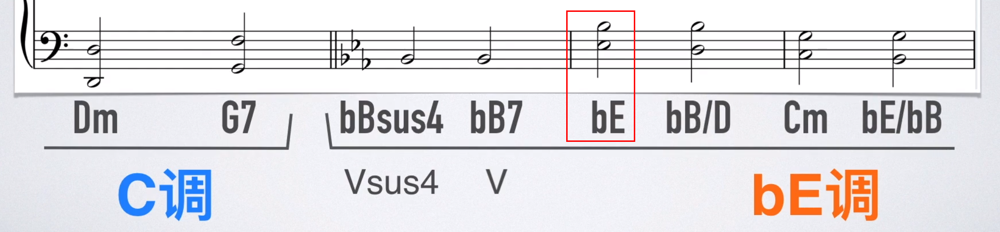


突然转到E大调的原因是：Fm、bB7和转调后的E构成251，听起来很舒服


例如首段C大调，中段G大调，再现段C大调，此时中段可以称作转调

### 转调与调式的应用

转调与调式经常混用，流行歌里常见的例子就是关系大小调的混用，之后再转平行调。

转调可以很快的让歌曲转换到另外一个更强烈的情绪。但是情绪维持不会久，通常为了延续情绪，会改变节奏的配置，例如鼓增加镲片的次数。有些歌曲为了让情绪不断提升，甚至会转调两次。调式的情绪没那么强烈，但是情绪却可以一直延续很长。

**以 《GNR - Sweet Child O' Mine》 来说，**歌曲的 A，B 两段都是 D Mixolydian，实际上整首歌曲都有接近 G 大调的感觉，因为 D Mixolydian 跟 G 大调刚好是关系调 (音阶音群一样)，所以熟悉自然大调的我们很容易判断成 G 大调。
但因为歌曲一开始的 D C G D 进行，加上终止的听觉概念：属和弦会在终止、主和弦会在起始，使的我们会觉得整首是围绕在 D 为主音的感觉，所以我们把判定为 D 为主音。然后以 D 大调做参考，分析 AB 两段的旋律，会发现 b7 这个特征音，符合 Mixolydian 的音程关系，所以歌曲 A B 两段判定为 D Mixolydian。
最后情绪一直延续到尾奏 Guitar Solo。尾奏 Guitar Solo 转成根音围绕在 E 音，但是因为旋律出现了很明显的和声小调，所以判定为 E 小调 (G 大调关系调，或解释为 E Aeolian)，和 A B 两段的 D Mixolydian 也是有间接关系，继续歌曲有延长情绪的效果。

一般编曲/作曲要改变情绪，转调和调式都是其中的技巧之一。除了这两种，还会利用编曲技巧来变换情绪，像是改变配器、声线、和声、对位、节奏配置、对点等。

### 离调（主化、Tonicization）

#### 借用和弦（调式混合、Borrowed chord、mode mixture、modal mixture、substituted chord、modal interchange、mutation）

作曲与即兴演奏的技法之一。

通常会向近关系调（参考五度循环圈）借调外和弦。比如：

| G大调        | D大调        |
| ------------ | ------------ |
| Gmaj（1级）  | Gmaj（4级）  |
| Am（2级）    | Amaj（5级）  |
| Bm（3级）    | Bm（6级）    |
| Cmaj（4级）  | C#dim（7级） |
| Dmaj（5级）  | Dmaj（1级）  |
| Em（6级）    | Em（2级）    |
| F#dim（7级） | F#m（3级）   |

上述的同一行的音通常可以互相替换，但通常不替换成减和弦。如在G大调中借用D大调和弦，通常可以借：Amaj、F#m，而不借C#dim。

#### 含义

在一个调式当中，临时性地借用（Borrow）调外音和调外和弦，使得调性色彩发生转变，然后再次回到主调上的这种现象，叫做离调。

离调和移调并不相相同，离调足够简短，主音并没有消失或被取代，可以被看作是简短的或是转瞬即逝的移调，并没有真正切换到那个调式中去。

例子：《南山南》

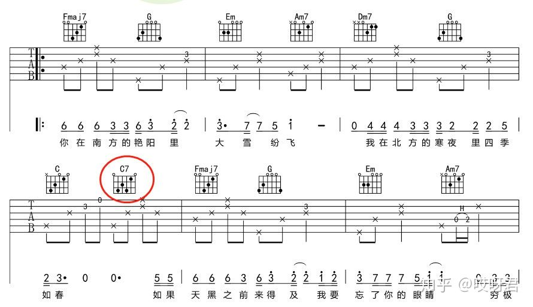

这首歌是一个典型的4536251（C大调当中 F、G、Em、Am、Dm、G、C）的和弦进行

但是在第一段和弦进行的结尾C和弦之后，出现了一个本不属于C大调和弦的C7和弦，之后的F和弦又迅速后回到了C大调的和弦进行当中

这时，这个短暂出现的C7和弦就属于一种离调现象

#### 用法

离调最广泛的用法，就是“**重属七**”用法。

比如在C大调内，终止式251的和弦进行Dm - G - C三个和弦之中，可以在属级G和弦之前再放上一个和弦作为**过渡和弦。**此时就要暂时把要弹的调式想象成G大调，在G大调中，它的属七和弦是D7，那么就在G和弦前面加上D7和弦。

利用这两个和弦，制造出从属级解决向主级的“**归属感**”，然后后面又回到了C大调之中，使得整体的和弦进行有一种**递进上升的感觉。**

### 移调（Modulation）

含义：改变一首乐曲的调式

作用：使乐曲更容易演奏

#### 移调方法

* 等距离移动所有和弦的根音
* 新根音产生的和弦须与原和弦的类型相同

例子

* 若要将1=C调的歌移到1=D调，则因为C到D是一个全音的关系，所以需要把这首歌的所有的音符都提升一个全音
* 若要将G调的歌移到C调，即可以降低三全一半，也可以升高两全一半。因为音阶是一个循环体系。
* 若要将Bb和弦移调至C，则因为Bb和C相差一个全音，因此该首曲子里的其他和弦变化为：Gmin7—>Amin7、Cmin7—>Dmin7、F7—>G7

注意：无论一首歌变成什么调，唱名是永远不变的。比如之前是123（doremi），移调之后还唱123（doremi）

一个调号可以对应：

* 大调。自然大调、和声大调、旋律大调
* 小调。自然小调、和声小调、旋律小调

### 1.大调的固定模式（全全半全全全半）


【例-图1】C大调：主音是C，下面do re mi叫“音级”。

【例-图2】D大调：主音是D，升号调，故写作F#和C#。

【例-图3】F大调：主音是F，降号调，故写作Bb。

            

确认歌曲调的方法

1. 先把旋律中的音找出来（视唱练耳）
2. 如果旋律没有升降音，则可能是C大调或A小调
3. 再看开头音与结束音，通过规律“大部分乐器的开头音与结束音落在主音上”判断

###  调式中各音级的名称


### 调性（Tonality）

调性（Tonality）是调的主音（Key）和调式（Mode）类别的总称，例如，以C为主音的大调式，其调性即是“C大调”，以a为主音的小调式，其调性就是“a小调”等。以此类推，一般音乐中主要有24个调性。

**从音阶排列的特性上看，决定一组音阶调性大小的核心是三音的升降，即大小调的Ⅲ级（上中音）是调式的特性音级**：大调的主音和三级音构成大三度；小调的主音和三级音构成小三度。为了方便记忆，任何一组音阶只要三音是降三音，都是算是小调性的音阶，没有降就是大调性音阶。

#### 无调音乐（无调性音乐、Atonality music）

无调音乐（Atonality music )，又称无调性音乐，是现代音乐的一种重要流派与表现形式之一，无调性音阶就是指音与音之间缺乏调性感，其构成方式与有调性的古典音乐差异颇大却具有互补意义。

##### 主要特征

产生于20世纪初期，由19世纪后期音乐中变音体系的极度发展、调性的频繁变化、和弦结构的复杂化以及功能联系的消失等因素而逐步形成。

特点：无中心音或中心和弦，无调号，无调式特性，半音阶的各音均可自由套用，尽可能不采用传统的和弦结构，避免能产生调性作用的和声进行。与此有关的是旋律、和声、曲式、节奏与音乐构成方法均与传统有极大的差异。由于无调性音乐乃逐步形成，因此，调性模糊的音乐与无调性音乐之间，在感觉上常无明确的界限。

该音乐形式有其构成法则，但是不同于传统音乐：

* 以全音阶作为其音阶形式。
* 没有系统主音，12音地位对等。
* 没有主和弦与正三和弦体系，任何组合均可构成和弦。
* 无调音乐对系统中出现的传统音乐成分似有排斥作用，如：旋律、和弦等。
* 因为“无调性”，无调音乐没有调性音乐具有的调式、和声指向性，如：动，静，解决，完结等属性，也没有协和弦，不协和弦的差异；但也有观点认为：无调音乐仍有解决向量，只是其方式不同于调式音乐。

从其构成特征来看，无调音乐是对传统音乐的一种反叛；但其构成及实践表明，无调音乐存在自然法则或自然逻辑基础，不是人为、人工规则或与自然法则无关的“创新”。

#### 大调

##### 色彩

大调是最常见的调式色彩，它像是大三和弦经过扩展和丰富后的色彩。在这种调式中，主和弦与调式中的其他和弦之间是相互关联的，并且它们对调式的整体色彩和特点都有着重要影响。
大调色彩的流行金曲包括：
《你就是你》(Just the Way You Are) [D]
《无尽的爱》(Endless Love) [Bb]
《我想要牵你的手》(I Want to Hold Your Hand) [G]
《陪我度过漫漫长夜》(Help Me Make It through the Night) [C]
 《离开家乡》(Gone Country) [C]

```abc
T:C自然大调音阶
M:4/4
L:1/4
K:C
Q:60
"C""Ⅰ""主和弦"[CEG] "Dm""Ⅱm""（上主和弦）"[DFA] "Em""Ⅲm""（中和弦）"[EGB] "F""Ⅳ""下属和弦"[FAc] | "G""Ⅴ""属和弦"[GBd] "Am""Ⅵm""（下中和弦）"[Ace] "Bdim""Ⅶ-""（导和弦）"[Bdf] "C""Ⅰ"[ceg]
```

调式中的音符或和弦音都为自然音。如上面谱例中所示，大调中包括自然音组成的大和弦、小和弦、减和弦。

##### 自然大调（Natural Major、伊奥尼亚）

自然大调音阶由五个全音和两个半音组成，其音阶结构是全音-全音-半音-全音-全音-全音-半音。为了便于熟记，编成口诀为：全、全、半、全、全、全、半。

|                  |          | Ⅰ    | Ⅱ    | Ⅲ    | Ⅳ    | Ⅴ    | Ⅵ    | Ⅶ    | Ⅷ    |
| ---------------- | -------- | ---- | ---- | ---- | ---- | ---- | ---- | ---- | ---- |
| C大调            |          | 1    | 2    | 3    | 4    | 5    | 6    | 7    | 1    |
| bD大调（降号调） | 5个b号调 | b2   | b3   | 4    | b5   | b6   | b7   | 1    | b2   |
| D大调（升号调）  | 2个#号调 | 2    | 3    | #4   | 5    | 6    | 7    | #1   | 2    |
| bE大调（降号调） | 3个b号调 | b3   | 4    | 5    | b6   | b7   | 1    | 2    | b3   |
| E大调（升号调）  | 4个#号调 | 3    | #4   | #5   | 6    | 7    | #1   | #2   | 3    |
| F大调（升号调）  | 1个b号调 | 4    | 5    | 6    | b7   | 1    | 2    | 3    | 4    |
| bG大调（降号调） | 6个b号调 | b5   | b6   | b7   | b1   | b2   | b3   | 4    | b5   |
| G大调（升号调）  | 1个#号调 | 5    | 6    | 7    | 1    | 2    | 3    | #4   | 5    |
| bA大调（降号调） | 4个b号调 | b6   | b7   | 1    | b2   | b3   | 4    | 5    | b6   |
| A大调（升号调）  | 3个#号调 | 6    | 7    | #1   | 2    | 3    | #4   | #5   | 6    |
| bB大调（降号调） | 2个b号调 | b7   | 1    | 2    | b3   | 4    | 5    | 6    | b7   |
| B大调（升号调）  | 5个#号调 | 7    | #1   | #2   | 3    | #4   | #5   | #6   | 7    |

除了C大调没有升降号外，其他大调都有升降号。并且一个大调只有升记号或降记号，不会同时拥有两个记号。

##### 和声大调与旋律大调（极少出现，理解为主）

这两个调式中都存在一些比较奇怪的和声，一般仅会在小众音乐中才会见到。

和声大调将自然大调的六级音降低半音

旋律大调将自然大调的六级与七级音都降低半音（一般用于下行旋律）

注意：一整条旋律里，就算在自然大调里出现了一次降六级，那它不一定是和声大调。比较合理的解释是：这条旋律是和声／自然小／大调，只是因为需要规避增音程／减弱色彩的亮度而临时穿插了旋律／和声小／大调

|           | Ⅰ    | Ⅱ    | Ⅲ    | Ⅳ    | Ⅴ    | Ⅵ    | Ⅶ    | Ⅰ    |
| --------- | ---- | ---- | ---- | ---- | ---- | ---- | ---- | ---- |
| C自然大调 | C    | D    | E    | F    | G    | A    | B    | C    |
| C和声大调 | C    | D    | E    | F    | G    | bA   | B    | C    |
| C旋律大调 | C    | D    | E    | F    | G    | bA   | bB   | C    |

```abc
X:1
T:C自然大调
M:4/4
L:1/4
K:C
CDEF | GABc
```

```abc
X:1
T:C和声大调
M:4/4
L:1/4
K:C
CDEF | G_ABc
```

```abc
X:1
T:C旋律大调
M:4/4
L:1/4
K:C
CDEF | G_A_Bc
```

#### 小调

##### 色彩

悲情、悲剧、恐怖、阴森

大调歌曲变成小调歌曲的效果非常直观：https://www.youtube.com/results?search_query=original+in+minor+key

小调是继大调之后最常见的一种调式色彩。它像是经过其他一些和弦的 “润色”、扩展后的小三和弦。

小调色彩的流行金曲包括：《痛苦之王》(King of Pain) [Bmin]、《我 们是冠军》(We Are the Champions) [Cmin]、《漫步月球》(Walking on the Moon) [Dmin]、《俄亥俄州》(Ohio) [Amin]、《牛仔去了何方？》(Where Have All the Cowboys Gone?) [Fimin]、《被你的手指缠绕》(Wrapped around Your Finger) [Amin]等。

```abc
T:a自然小调音阶
M:4/4
L:1/4
K:C
Q:60
"Amin""Ⅰmin""主和弦"[A,CE] "Bdim""Ⅱdim""（上主和弦）"[B,DF] "C""bⅢ""（中和弦）"[CEG] "Dmin""Ⅳmin""下属和弦"[DFA] | "Emin""Ⅴmin""属和弦"[EGB] "F""bⅥ""（下中和弦）"[FAc] "G""bⅦ""（导和弦）"[GBd] "Amin""Ⅰmin"[Ace] "E""Ⅴ/Ⅴmin"[E^GB]
```

一些罗马数字前有降音符号(b)，这表示这个和弦是在小调中，例如“flat 6” (bⅥ)、“flat 7 (bⅦ)等。

##### 自然小调（Natural Minor）

###### 构成

自然小调音阶也由五个全音和两个半音组成，其音阶结构是全音-半音-全音-全音-半音-全音-全音。为了便于熟记，编成口诀为：全、半、全、全、半、全、全。

###### 与自然大调的关系

自然小调是以自然大调的六级音为主音发展出的调。如a自然小调就与C自然大调的构成音完全相同。因为他们之间的7个共同音，所以a自然小调是C自然大调的平行（关系）小调。

为方便记忆自然大调与自然小调的关系，可以记成将大调的主音往下移小三度就是其关系小调的主音。

将大调音阶（如：C自然大调）的Ⅲ、Ⅵ、Ⅶ级音降低半音，即可得到对应的小调音阶（如：c自然小调），它们是同主音转调关系。

```abc
X:1
T:c自然小调
M:4/4
L:1/4
K:C
CD_EF | G_A_Bc
```


上图可知，a小调的所有构成音全部在白键上（C大调亦然，只是主音不同，这叫“关系大小调”）

#####  和声小调（Harmonic Minor）

常见。

和声小调：将自然小调中的七级音升高半音

###### 为什么会出现和声小调

自然大调中第七级音（即导音）与主音是小二度关系，属于距离很近的两个音，因此第七级音十分倾向于进行到主音（这一点你只要听的曲子多了自然就明白）。

而自然小调的第七级音与主音之间是大二度关系，所以第七级音对主音的倾向性就稍差些，于是人们把自然小调的第七级音升高半音得到了和声小调，这样一来和声小调既保持了小调的特性（主音与中音相隔小三度），同时还增强了第七级音对主音倾向性，这就是和声小调的产生原因。

#####  旋律小调（Melodic Minor）

常见。

旋律小调：将自然小调中的六级七级音升高半音。另外，古典理论中分上行与下行：上行需要在原先自然小调的基础上升高第6，7级，但下行需要还原成自然小调。而爵士理论上下行都是一样的弹法。

小技巧：判断自然小调的六级七级音，可以从主音倒着数1/2两级的音，而不是正着数6/7两级的音，这样算着更快。

###### 为什么会出现旋律小调

和声小调也有一个缺陷，那就是第六级音与第七级音之间是增二度关系，在听觉上有时会稍有不协和感（尤其是在上行音阶中），所以人们把和声小调上行音阶中第六级音升高半音，得到了旋律小调，这样一来就三全其美了——既保持了小调的特性，又保证了第七级音对主音的倾向性，还避免了增二度进行。不过，旋律小调音阶的后五个音与自然大调完全相同，所以那一部分听起来有时略有大调感觉。

乐曲中和声小调的下行音阶还是时而能见到的，但和声小调的上行音阶却极其少见，这是因为增二度在上行音阶中的不协和度要高于在下行音阶中（因为上行时，5级要导向1级，而下行时，1级不需要向下导向），毕竟上行时更讲究音与音之间的进行（例如导音到主音），所以旋律小调重点是针对和声小调的上行音阶进行改进。这就是为什么旋律小调只有上行时把第六、第七级音升高半音。事实上，在作曲过程中，你也可以下行时仍然使用旋律小调上行的模式，即把第六、第七级音仍然升高半音，只不过这并不常见，一旦遇到了也可以视为旋律小调。

而和声大调与旋律大调则是仿效和声小调与旋律小调的音程关系对自然大调进行改造而成的。显然和声大调与旋律大调从音程关系上以及第七级音对主音的倾向性上来看并非像和声及旋律小调那样是对自然调式的一种改进，因此和声大调和旋律大调只能说是对自然大调的一种“改造”，而非一种“改进”。

|           | Ⅰ    | Ⅱ    | Ⅲ    | Ⅳ    | Ⅴ    | Ⅵ    | Ⅶ    | Ⅰ    | Ⅴ-Ⅵ-Ⅶ-Ⅰ的音程关系    |
| --------- | ---- | ---- | ---- | ---- | ---- | ---- | ---- | ---- | -------------------- |
| a自然小调 | A    | B    | C    | D    | E    | F    | G    | A    | 小二度-大二度-大二度 |
| a和声小调 | A    | B    | C    | D    | E    | F    | G#   | A    | 小二度-增二度-小二度 |
| a旋律小调 | A    | B    | C    | D    | E    | F#   | G#   | A    | 大二度-大二度-小二度 |

```abc
X:1
T:a自然小调
M:4/4
L:1/4
K:C
CDEF | GABc
```

旋律小调上行和下行的不同：

 和声小调和旋律小调**都没有自己的调号**，用的自然小调的调号。


三种小调与大调的关系（以C调为例）

|           | Ⅰ    | Ⅱ    | Ⅲ    | Ⅳ    | Ⅴ    | Ⅵ    | Ⅶ    |
| --------- | ---- | ---- | ---- | ---- | ---- | ---- | ---- |
| C大调     | C    | D    | E    | F    | G    | A    | B    |
| c自然小调 | C    | D    | Eb   | F    | G    | Ab   | Bb   |
| c和声小调 | C    | D    | Eb   | F    | G    | Ab   | B    |
| c旋律小调 | C    | D    | Eb   | F    | G    | A    | B    |

##### 和声大小调与旋律大小调有没有意义

“和声大调与旋律大调是没有意义的”，这确实是很多学者所持的一种观点。当时这两个概念是斯波索宾提出后被一些中国学者传入中国的，但后来人们逐渐发现其实即使不提出这两个概念，很多音乐调式调性问题也都可以正常解释，也就是说和声大调与旋律大调这两个概念完全没有必要产生。

但也有一部分认为，这两个概念的产生让很多音乐现象的解释变得更加方便和灵活，例如如果没有和声大调的概念，可能很多出现和声大调和旋律大调的旋律就只能用一些变和弦或更复杂的和声来解释。

因此，这两种观点都有道理，支持哪一种都是可以的。

##### 现代小调音阶

上行或下行都使用旋律小调音阶，常见于爵士乐曲里面，也被叫做爵士小调。

A现代小调音阶：A->B->C->D->E->F♯->G♯->A->G♯->F♯->E->D->C->B->A

#### 根据乐谱大致分析一个谱子是什么调

https://www.zhihu.com/question/327659173/answer/703924209

1. 先看调号。如果连调号都没有，那就直接看乐谱里大致是哪些音，首先要重点关注带升降号的音，并输入到：https://showscale.com/?scaleSelector=emin，根据这些音反推包含这些音的调。如一段旋律包含3个带升号的不同音，那它就可能是A大调或F#小调。

2. 得到大致的调号范围后（如要么G大调，要么E小调），结合音感，根据：

   * https://www.musictheory.net/calculators/scale
   * https://www.tonegym.co/tool/item?id=scale-analyser

   看这段旋律的开头最低音是什么，该音是该调的第几级音。如C大调，D是2级音；如F大调，C是5级音。根据该度数，判断该旋律可能是X大/小调的第N阶调式。如C到D是2度，则判断它可能是Dorian调式；如F到C是5度，那判断它可能是Mixolydian调式。
   
   或重音部分反复出现的音符通常时
   
   每个调（大小调、和声、旋律）大致的音级关系，得出是什么调。

注意：很多歌曲都不是由单一的调构成的，换言之，我们应该着重去分析歌曲的哪一段落使用了什么样的和弦进行以及这一段带给人什么样的感觉逐步来分析歌曲

###  关系大小调（关系调、平行大小调、Relative Keys）

平行调，指一对调号相同的大、小音阶。例如：C大调跟a小调。也就是平行大小调用的音列是一样的，但是主音不同。比如C大调的音阶是C、D、E、F、G、A、B；a小调的音阶是：A、B、C、D、E、F、G。C大调的主音是C，a小调的主音是A。

注意：平行调一词从俄文Параллельные тональности翻译而来，但英文中的parallel key（直译为平行的调）指的是同主音调。这导致了在中文和英文乐理书籍翻译中的一些混淆。解决办法是统一使用字词，或中文不要使用“平行”一词，相同调号的大、小调式称为“关系调”，同主音的大、小调式称为“同名调”，或是用“并行调 (parallel key)”和“平行调 (Параллельные тональности)”区分。

#### 24个平行大小调

下表根据五度循环圈，共有30个调，但因为有3对等音调（C#和Db、F#和Gb、B和Cb），所以30-6=24个平行大小调。

|       Key signature        |                        Major key                        |                        Minor key                        | 是平行大小调         |
| :------------------------: | :-----------------------------------------------------: | :-----------------------------------------------------: | -------------------- |
| B♭, E♭, A♭, D♭, G♭, C♭, F♭ | [C♭ major](https://en.wikipedia.org/wiki/C-flat_major)  | [A♭ minor](https://en.wikipedia.org/wiki/A-flat_minor)  | 否。和B大调是等音调  |
|   B♭, E♭, A♭, D♭, G♭, C♭   | [G♭ major](https://en.wikipedia.org/wiki/G-flat_major)  | [E♭ minor](https://en.wikipedia.org/wiki/E-flat_minor)  | 否。和F#大调是等音调 |
|     B♭, E♭, A♭, D♭, G♭     | [D♭ major](https://en.wikipedia.org/wiki/D-flat_major)  | [B♭ minor](https://en.wikipedia.org/wiki/B-flat_minor)  | 是                   |
|       B♭, E♭, A♭, D♭       | [A♭ major](https://en.wikipedia.org/wiki/A-flat_major)  |    [F minor](https://en.wikipedia.org/wiki/F_minor)     | 是                   |
|         B♭, E♭, A♭         | [E♭ major](https://en.wikipedia.org/wiki/E-flat_major)  |    [C minor](https://en.wikipedia.org/wiki/C_minor)     | 是                   |
|           B♭, E♭           | [B♭ major](https://en.wikipedia.org/wiki/B-flat_major)  |    [G minor](https://en.wikipedia.org/wiki/G_minor)     | 是                   |
|             B♭             |    [F major](https://en.wikipedia.org/wiki/F_major)     |    [D minor](https://en.wikipedia.org/wiki/D_minor)     | 是                   |
|            None            |    [C major](https://en.wikipedia.org/wiki/C_major)     |    [A minor](https://en.wikipedia.org/wiki/A_minor)     | 是                   |
|             F♯             |    [G major](https://en.wikipedia.org/wiki/G_major)     |    [E minor](https://en.wikipedia.org/wiki/E_minor)     | 是                   |
|           F♯, C♯           |    [D major](https://en.wikipedia.org/wiki/D_major)     |    [B minor](https://en.wikipedia.org/wiki/B_minor)     | 是                   |
|         F♯, C♯, G♯         |    [A major](https://en.wikipedia.org/wiki/A_major)     | [F♯ minor](https://en.wikipedia.org/wiki/F-sharp_minor) | 是                   |
|       F♯, C♯, G♯, D♯       |    [E major](https://en.wikipedia.org/wiki/E_major)     | [C♯ minor](https://en.wikipedia.org/wiki/C-sharp_minor) | 是                   |
|     F♯, C♯, G♯, D♯, A♯     |    [B major](https://en.wikipedia.org/wiki/B_major)     | [G♯ minor](https://en.wikipedia.org/wiki/G-sharp_minor) | 是                   |
|   F♯, C♯, G♯, D♯, A♯, E♯   | [F♯ major](https://en.wikipedia.org/wiki/F-sharp_major) | [D♯ minor](https://en.wikipedia.org/wiki/D-sharp_minor) | 是                   |
| F♯, C♯, G♯, D♯, A♯, E♯, B♯ | [C♯ major](https://en.wikipedia.org/wiki/C-sharp_major) | [A♯ minor](https://en.wikipedia.org/wiki/A-sharp_minor) | 否。和Db小调是等音调 |


#### 关系

##### 一级关系调

在和声学中存在着对调的认识，十二平均律中包含了二十四个大小调，在调性的关系中，以该调的主和弦在功能上的相互关系为依据的，两个调的主和弦关系越简单、共同音越多则两个调的关系就越近，在和声学中，把两个调之间关系最近的调称作一级关系调。

在大调中，一级关系调包括它属调、下属调、关系小调、属关系小调、下属关系小调和小下属调。 比如：C大调的一级关系调包括，G大调、F大调、a小调、e小调、d小调和f小调。

在小调中，一级关系调包括它属调、下属调、关系大调、属关系大调、下属关系大调和大属调。 比如：a小调的一级关系调包括，e小调、d小调、C大调、G大调、F大调和E大调。

##### 二级关系调

二级关系调包括相差2个调号的调和它们的平行调（关系调）

比如：C大调的二级关系调包括，D大调、bB大调、b小调、g小调； c小调的二级关系调包括，F大调、bD大调、d小调、bb小调。

##### 三级关系调

三级关系调包括相差3到5个调号的调和它们的平行调（关系调），在这里大调的三级关系调不包括升某某调；小调的三级关系调不包括降某某调。

比如：C大调的三级关系调包括，A大调 E大调 B大调 bE大调 bA大调 bD大调 c小调 bb小调； c小调的三级关系调包括，a小调 e小调 b小调 be小调 ba小调 bd小调 C大调 D大调。

##### 四级关系调

四级关系调包括相差6个调号的调和它们的平行调（关系调），还包括从一级到三级关系调中剩下的调。

比如：C大调的四级关系调包括♯F大调、♯d小调、♯c小调、♯f小调、♯g小调； c小调中的四级关系调包括♯f小调、♭A大调、♭G大调、♭C(B)大调、♭F(E)大调。

#### 记忆技巧

* 以大调音阶的六级音为主音，算出的小调，就是该大调对应的关系小调。如C大调的六级音是A，以A为主音的小调，就是a小调，因此C大调和a小调是关系大小调。

* 或者，将一个大调的主音降低3个半音，得到的就是其关系小调的主音；反之，将一个小调的主音升高3个半音，得到的就是其关系大调的主音。

  换言之，如果看到一个调号，先根据我们上述讲过的方法，先快速判断出该调号的大调是什么，再根据上条的方法，推出其关系小调是什么。

### 同主音大小调（同主音调、并行大小调、Parallel Key）

它指的是两个调的主音相同，但音列不同的关系。例如C大调的同主音小调是c小调。将C大调的1/6/7级音降低半音，得到的就是c小调。

### 民族调式

#### 日本调式（平调子）

传统琉球筝和雅乐筝定弦均为中国传统五声调式

组成：13467。

```abc
X:1
T:平调子
M:4/4
L:1/4
K:C
DEFA | B
```


雅乐律旋: 1 2b3 4 5 6b7 1=6 71 2 3 #45 6

```abc
X:1
T:雅乐
M:4/4
L:1/4
K:C

```


都节音阶: 1 2b3 4 5b6 b7 1=6 71 2 34 5 6
琉球音阶: 1b2 b3 4 5b6 b7 1=34 5 6 71 2 3 [1]

当中国传统五声音阶（首调记谱时）的所有音下转三度（不考虑大小三度）的情况下，五声音阶就可以自然转换成日本五声调式。


#### 五声音阶

组成：12356。清角4、变宫7

中国民族音乐的基础是五声音阶，爵士乐有时也用五声音阶

五声音阶是以五度相声规律排列。五度相声即纯五度关系往上堆叠（1 5 2 6 3），纯五度是除纯八度外最协和的音程。

同七声音阶相比，它没有不协和的小二度、增四减五旋律进行。所以怎么弹，旋律都是和谐的。就算偶尔用到了不协和的音程，也只是在小节的弱拍带过

注意：五声音阶是以五度相声规律排列。五度相声即纯五度关系往上堆叠（1 5 2 6 3），纯五度是除纯八度外最协和的音程。

同七声音阶相比，他没有恐怖片特效的小二度 增四减五旋律进行。所以怎么弹，旋律都是和谐的。

黑键组成的音阶的确就是一个五声音阶的结构。这个五声音阶可以在白键上也可以在黑键上也可以在黑白键上。怎么弹都是协和的是因为黑键音阶是 F# G# A# C# D# ,  简化一下，相当于C D E G A。这个音阶内部是不含不协和的三全音和小二/大七度的，所以，从根本上避免了不协和音程出现的可能性。由于五声音阶没办法在和声上造就一种不协和的紧张感，也导致了民族音乐听起来很平和没起伏。

注意：不是所有五声音阶听起来都像中国风，如肖练黑键就没有中国风

中国风特点

* 要有大量且连续的大二小三叠加，用简谱表示就是235 356 612这样的，并且中国风的曲子都是在这个范围内转来转去的，像兜圈子

  ```abc
  X:1
  T:茉莉花
  M:4/4
  L:1/8
  K:Eb
  Q:80
  E2 EG Ac cA | G2 GA G4 | E2 EG Ac ca |
  G2 GA G4 | G2 G2 G2 EG | A2 A2 G4 |
  E2 DE G2 ED | C2 CD C4 | ED CE D3 E |
  
  ```

* 中国旋律一般都比较平，大音程比较少，很少出现四度五度，甚至大三度。就算出现了这些大音程，也是经常在这个范围里面兜圈子，绕两圈才能出来继续往下

  比如黑键第一句135161513513都是大小调和弦，没有连贯的大二小三，后面的几乎所有地方也都是有大量的四五度跳跃，所以一点都不像中国风

  

```abc
T:五声音阶
M:4/4
L:1/4
K:C
CDEGA
```


#### 布鲁斯蓝调（Blues）

组成：C bE F bG G bB C（1 b3 4 b5 5 b7 1）

### 教会调式（中古调式、教会旋法调、Church Modes、Modern Modes）

列表：https://www.tonegym.co/tool/item?id=scale-analyser

教会调式（Gregorian mode或church mode），即中古调式，为中世纪罗马教会统治欧洲时期的音乐所使用的调式，后来的人们称做“教会调式体系”。这些调式有一个共同特点：音阶由七个音构成，全部都是自然音，没有变化音，因此也称作“自然调式体系”。教会调式在当时被广泛运用在葛利果圣歌中，在经过大量的音乐创作之后，再由音乐理论家从音乐中整理出规律，方便规范音乐的创作。

#### 记忆方式

以Dorian调式为例，比如C自然大调的2级音阶就是D Dorian音阶（D、E、F、G、A、B、C、D），音程关系为全-半-全-全-全-半-全，具备这样音程关系的调就是Dorian调式；又比如Bb自然大调的2级音阶是C dorian（C、D、Eb、F、G、A、Bb、C）。注意音阶以其根音命名，其调式说明了根音之后接的是什么音。

记忆口诀：我（I）的（D）霹（P）雳（Ly）猫（M）阿（A）洛（Lo）


爵士乐经常用到这些音阶

#### 作用

* 如果先知道和弦，如何思考这个和弦可以搭配哪些音阶。

  我们常用的三套音阶体系有自然大调、和声小调、旋律小调，首先我们要认识这三套音阶体系的顺阶和弦及对应的音阶有哪些，每套音阶都有7条对应的调式音阶，那么这3套音阶就一共对应有21条调式音阶（如：C大调、C Lydian调式、A Aeolian调式），知道这些之后，我们再从和弦出发来看每个和弦可以搭配哪些音阶么，就会很容易了。

  https://www.zhihu.com/question/53227976

#### Ionian Mode（伊奥尼亚调式——自然大调音阶）

1、2、3、4、5、6、7 。C大和弦（1357246）能构成伊奥利亚音阶

```abc
T:Ionian Mode
M:4/4
L:1/4
K:C
CDEF | GABc
```

#### Dorian Mode（多利亚调式——自然大调2级音阶）

1、2、b3、4、5、6、b7。Dm小和弦（2461357）能构成多利亚音阶

```abc
T:Dorian Mode
M:4/4
L:1/4
K:C
CD_EF | GA_Bc
```

#### Phrygian Mode（弗利几亚调式——自然大调3级音阶）

1、b2、b3、4、5、b6、b7。Em小和弦（3572461）能构成多利亚音阶，但由于4在Em里难听，所以经常被去掉，也就不是弗里几亚音阶了。

```abc
T:Phrygian Mode
M:4/4
L:1/4
K:C
C_D_EF | G_A_Bc
```

#### Lydian Mode（利底亚调式——自然大调4级音阶）

1、2、3、#4、5、6、7。FM大和弦（4613572）能构成利底亚音阶

```abc
T:Lydian Mode
M:4/4
L:1/4
K:C
CDE^F | GABc
```

#### Mixolydian Mode（混合利底亚调式——自然大调5级音阶）

1、2、3、4、5、6、b7。G7属和弦（）能构成混合利底亚音阶

```abc
T:Mixolydian Mode
M:4/4
L:1/4
K:C
CDEF | GA_Bc
```

#### Aeolian Mode（爱奥利亚调式———自然小调音阶）

1、2、b3、4、5、b6、b7 。Am小和弦（6135724）能构成利底亚音阶

```abc
T:Aeolian Mode
M:4/4
L:1/4
K:C
CD_EF | G_A_Bc
```

#### Locrian Mode（洛克利亚调式——自然大调7级音阶）

1、b2、b3、4、b5、b6、b7。半减七和弦能构成洛克利亚音阶

```abc
T:Locrian Mode
M:4/4
L:1/4
K:C
C_D_EF | _G_A_Bc
```

https://www.tonegym.co/tool/item?id=scale-analyser

| Scale                                      | 音阶                        | 音程关系             | Nature | 主和弦   |
| ------------------------------------------ | --------------------------- | -------------------- | ------ | -------- |
|   | 1, 2, 3, 4, 5, 6, 7, 8      | 全-全-半-全-全-全-半 | 大     | Cmaj7    |
|  | 1, 2, ♭3, 4, 5, 6, ♭7, 8    | 全-半-全-全-全-半-全 | 小     | Dm7(Dm6) |
|   | 1, ♭2, ♭3, 4, 5, ♭6, ♭7, 8  | 半-全-全-全-半-全-全 | 小     | Em7      |
|  | 1, 2, 3, #4, 5, 6, 7, 8     | 全-全-全-半-全-全-半 | 大     | Fmaj7    |
|   | 1, 2, 3, 4, 5, 6, ♭7, 8     | 全-全-半-全-全-半-全 | 大     | G7       |
|   | 1, 2, ♭3, 4, 5, ♭6, ♭7, 8   | 全-半-全-全-半-全-全 | 小     | Am7      |
|  | 1, ♭2, ♭3, 4, ♭5, ♭6, ♭7, 8 | 半-全-全-半-全-全-全 | 半减   | BØ7      |


1、以首调唱名do为主音的调式，叫伊奥尼亚调式（Ionian）。它的音阶关系是：全音、全音、半音、全音、全音、全音、半音。表面上看，它与自然大调式、中国七声清乐宫调式的音阶结构完全相同,因此属于大调类调式。

2、以首调唱名re为主音的调式，叫[多利亚调式](https://baike.baidu.com/item/多利亚调式)（Dorian）。它的音阶关系是：全音、半音、全音、全音、全音、半音、全音。这个调式的特点是：与自然小调相比，主音下方有一个小三度，这个三度叫做多利亚三度。表面上看，它与中国七声清乐商调式的音阶结构完全相同，因此属于小调类调式。

3、以首调唱名mi为主音的调式，叫弗里几亚调式（Phrygian）。它的音阶关系是：半音、全音、全音、全音、半音、全音、全音。这个调式的特点是：与自然小调相比，主音上方有一个小二度，叫做弗里几亚二度。表面上看，它与中国七声清乐角调式的音阶结构完全相同。因此它属于小调类调式.

4、以首调唱名fa为主音的调式，叫利底亚调式（Lydian）。它的音阶关系是：全音、全音、全音、半音、全音、全音、半音。这个调式的特点是：与自然大调相比，主音上方有一个增四度，叫做利底亚四度。增四度是三全音的音程，它给这个调式带来了一种特殊的、神秘的韵味。它属于大调类调式.

5、以首调唱名sol为主音的调式，叫混合利底亚调式（Mixolydian）。它的音阶关系是：全音、全音、半音、全音、全音、半音、全音。这个调式的特点是：与自然大调相比，主音上方有一个小七度，我们把它叫做混合利底亚七度。表面上看，它与中国七声清乐徴调式的音阶结构完全相同,它也是大调类的调式。

6、以首调唱名la为主音的调式，叫爱奥尼亚调式（Aeolian）。它的音阶关系是：全音、半音、全音、全音、半音、全音、全音。这个调式的特点是：它的音阶结构与自然小调式、中国七声清乐羽调式完全相同,因此属于小调类调式。

7、 以首调唱名si为主音的调式，叫洛克利亚调式（Locrian）。它的音阶关系是：半音、全音、全音、半音、全音、全音、全音。这个调式的特点是：与自然小调式相比，主音上方有一个小二度和减五度，我们把这个五度叫做洛克里亚五度。与增四度一样，减五度也是一个三全音音程。它是最具小调特点的调式，音响效果通常最为阴森。

“演奏”的意思是：将原来和弦中音与音的关系，改为目标音阶的关系。如G7和弦原本是56712345，如果要演奏成旋律小调四，则变为567#12345（G7#11）。如果要演奏成旋律小调七，则变为5 b6 b7 b1 b2 b3 4 5（G7alt）

可以在任何一个大和弦上演奏那伊奥尼亚音阶、利底亚音阶

可以在任何一个小和弦上演奏多利亚音阶、爱奥尼亚音阶

可以在任何一个属和弦上演奏混合利底亚音阶

可以在任何一个属七和弦上演奏旋律小调四（456712b3、全全全半全半全）、七（712b3456、半全半全全全全）、混合利底亚音阶

可以在任何一个半减七和弦上演奏旋律小六（6712b345、全半全半全全全）、洛克利亚音阶

#### 調式的亮度

調式的亮度，和其升降記號有直接的關係。升記號多，亮度較大；反之，降記號多，亮度較小。

亮度由大到小依序為（括號內的數字代表以大調的「第幾音」開頭）：

Lydian（4）
Ionian（1）
Mixolydian（5）
Dorian（2）
Aeolian（6）
Phrygian（3）
Locrian（7）
由括號內的數字可以看出，亮度和「五度」有相當密切的關係。

### 调式色彩

大多数流行歌曲都采用了五种调式色彩中的一种。调式的色彩就像是主和弦色彩经过了扩展：调式中既有主和弦的基本色彩，又有因为在和弦上增加了的其他音符而复加的一些其他色彩，即变换复合和弦色彩。

歌曲中运用和弦的方法有两种

* 循环往复的和声进行
* 先脱离“中心”（主和弦或“Ⅰ和弦”）再返回的和声进行

### 调、调高、调性、调式与音阶的区别

特别注意：

* “调”至少指代三个概念：1：泛指所有调相关的知识；2. 调高（Key）；3. 调性（Tonality，调高+调式）
* “调性”至少指代两个概念：1：调（调高+调式）；2. 调（调高+调式）所呈现出来的色彩特征

调（这里指代“调性”）：一个调，包括调高（主音的音高，Key）和调式（音群内的音关系特征，Mode）两个基本要素。一个调是以其主音作为核心的，调内各音均与主音有着某种特定的联系，故其整体的“调性”（调的色彩特征），均由各音与主音之间的音关系性质而来。

调高：某一个调式的音阶可以用任何一个音作为它的主音（Root），用什么做主音就叫什么调音阶，比如大调音阶的调式主音为C时，就叫C大调音阶，小调音阶的主音为E时，就叫E小调音阶。所以调（Key）不会像调式那样去很直接的改变旋律的色彩，而是改变旋律的音域，比如同一首歌，因为女声音域比男声高，很可能用C大调唱就刚好，男声用若用C调唱就会觉得唱不上去要么低不下去，所以转成G调可能就刚好。

调式：可以理解为音符递进的规律，每个调式的递进规律都不同就形成了不同的风格色彩的音阶。比如中国风的大调五声音阶，布鲁斯感的小调五声音阶，明亮的大调音阶，阴暗的小调音阶，其声响特点都是受调式影响的。

音阶：在一个八度内，按照调（调高+调式）的音高顺序排列得到的音，就是音阶。调式的直观表达形式，就是音阶。所以在某种意义上，音阶等同于调式，比如“自然大音阶”就是指自然大调中一个八度的自然音。

比如：C Locrian调式，C指调高，Locrian指调式；又比如D自然大调，D指调高，自然大调（Lonian调式）指调式。

------

###  五度循环圈（Circle of Fifths）

https://online-musical-scales.com/

https://showscale.com/

定义：从C开始，按顺时针方向的纯五度音程（7个半音）关系，可以构成一个循环圈


提醒：

* 一个调升一个纯五度音程，可能得到两个不同的调。如E大调 -> B大调与Cb大调。
* 部分大调或小调的音完全相同，但它们的书写方式不同，如B与Cb大调。

https://zhuanlan.zhihu.com/p/27028014

在一个八度内顺时针演奏五度圈


在一个八度内逆时针演奏五度圈


单独拎出纯五度的原因：两个相差纯五度的音一起响，协和程度最高。

#### 调关系

https://www.zhihu.com/question/422789121

调关系分为四级，一级关系调也称作近关系调（每一个调有5或6或7个近关系调，看不同的分法）。从西洋调式来说，一级关系调有：

* 调号相同的平行关系调。以C大调为例，就有平行关系小调a小调。
* 相差一个调号的调及其平行关系调。以C大调为例，就有G大调e小调，F大调d小调。
* 同主音大小调。以C大调为例，就有c小调。从和声方面来说，因为3中，同用了相同的属七和弦，致使其倾向性很相似，因此它们的关系很近。

##### 近关系调（Closely Related Key）

### 四度循环圈（Circle of Fourths）

定义：在五度循环圈基础上，从C开始，按逆时针方向的纯四度音程（5个半音）关系，可以构成一个四度循环圈。

以C自然大调为例：

F	Bdim	Em	Am	Dm	G7	C	C7

F	Bo/F	Em	Am	Dm	G	C	C7

大调四度圈的第一个和弦就是大调的Ⅳ级

是Bo/F（724），而不是G7和弦（5724）的原因是：因为G7属和弦具有导和弦的特性才能这么替换，一般根音是不能省略的，会改变和弦性质。

小调四度圈（不常用）


小调四度圈的第一个和弦就是小调的Ⅳ级

例子


------

## 和弦（和声学范畴）

总表：https://en.wikipedia.org/wiki/Template:Chords

https://www.zhihu.com/question/68032614/answer/259390369

https://www.zhihu.com/question/46536599

（好和弦教程：https://www.bilibili.com/video/BV1Xs411374a）

音感训练：https://www.bilibili.com/video/BV1rt411M7ZP?p=6

计算器：http://www.harmoniccycle.com/hc/music-08-chord-calc.htm

Chord Finder：https://pianolit.com/tools/chord-finder

定义：由3个或3个以上的音符，按照三度或者非三度排列起来的一组音叫作和弦。

重要性：音乐的核心就是推动力，而大多数音乐的推动力就是和弦（而不是旋律）。即有纵向上的作用，又有横向上的作用（倾向性）

流行和声比较自由，一些理论有悖于一些古典和声理论

所有和声学上的规则都是根据长期的经验总结为写作训练而设计，不是为创作而设计。创作音乐没有任何禁忌，只有好与差之分

注意：和弦标记是告诉两个方面的内容，第一是这个和弦的构成音有哪些，第二是这个和弦的低音是什么。

以G/B为例，左边的G表面构成音是GBD这三个音，但并不意味着每一个音都只出现一次，出现多少次都可以，比如GBGBDG，GBDGBDGB，他们都是GBD这三个音构成的，都可以用一个G来表示

而G/B右边的B，它表示低音从哪个音开始，所以这个和弦的意思就是GBD这三个音随便出现多少次，但是低音一定是B，这就叫G/B。比如从下到上BDG、BGDG、BDGBD、BDBGGDB等等，都是G/B

### 组成

* 根音。是建构和弦的根基,不以位置的变化而更名,其主导和弦级数。根音是音名（A、Bb、F#）
* 低音。是音高概念下的最低音,可以是任何一个和弦音,其主导和弦转位
* 类型。如大三和弦、小三和弦（min）、减和弦、增和弦。
* 增加的音符。是任意音位上的音名（7、9、13）

例子

* Amin	a小三和弦有一个根音a，小三和弦类型，没有增加的音符
* C	C大三和弦有一个根音C，大三和弦类型，没有增加的音符
* Bb7	Bb7有一个根音Bb，大三和弦类型，以及一个增加的七音
* Emin7(9)	Emin7(9)有一个根音e，小三和弦类型，以及增加的七音和九音

### 和弦排列形式

和弦在应用中，各音均可作八度的转换，从而引起和弦排列法或低音位置的改变。

* 密集排列。和弦音密集，相邻声部距离不超过四度，不能插入第三个和弦音。这种排列音响集中、厚重，但声部独立性不强
* 开放排列。相邻声部距离五度以上，并能插入第三个和弦音。这种排列音响均衡扩散，声部清晰可鉴

和弦排列法或低音位置的不同，只有音响的差异，并无优劣之分，全凭作曲家的创意取舍。排列法和低音位置的变化，一般不改变和弦的性质，各和弦音的名称也不会因此而更改


种类：三个音符构成的和弦最常用、四五个音符则不太常用，大于五个音符则很少用。和弦之间只有难易不同，没有贵贱高低之分，没必要刻意用多音符的和弦。

#### 音程关系

在传统和声中，和弦各音之间多为三度音程关系。在现代和声中，和弦各音之间也有其他音程关系

传统和声：

非传统和声：

#### 和弦音的名称

和弦按照三度叠置后，最下方为根音，其他各音的名称根据与根音的音程关系而来。


C大三和弦（135）的Csus2挂二和弦是三音变成二音，Csus4（或Csus）挂四和弦就是把三音变成四音。

注意：根音左右两边的音与根音所属和弦共同演奏时是和谐的，不要拘泥于死板的形式

#### 和声外音（和弦外音。Non-chord tone）

##### 含义

在乐曲中，如果旋律音在和弦中，就叫做和弦音。凡是不能纳入正常和弦结构的音，均叫做和弦外音。

补充：和弦音偏向于落在强拍上

##### 作用

是和声旋律构成的必要因素

* 促进旋律进行的流动性、构成旋律型（在一定的和声背景上使旋律和声部进行复杂化、音型化的处理，称为旋律音型）
* 使声部之间形成丰富的节奏组合
* 增强和声的色彩与紧张度的变化（色彩的意思：渲染情绪的表现形式，有明亮，坚定，柔和，暗淡）

##### 解决

和弦外音在所处的和弦内，常属于不协和音，需要解决到和弦音去。不同类型的外音有着不同的解决方式，一般作下行或上行级进解决，但也有的外音作跳进解决。

##### 种类

* 经过音（passing tone）：在弱位上，以级进填充形式出现在两个和弦音之间的和弦外音

  * 自然经过音：以调式内的自然音级经过音

  

  * 半音经过音（Chromatic Passing Tone）：以半音的形式出现的经过音

    

  * 经过音前后的和弦音可以处于不同的和弦中

    

* 辅助音（临音，neighbor tone）：在弱位上，出现于和弦音重复之间的高一级或低一级的和弦外音。辅助音可以是一个，也可以是多个，但是时值一般不超过两侧的和弦音

  * 自然辅助音：由自然音级构成的辅助音

    

  * 半音辅助音：由变化音级构成的辅助音
    
    

* 延留音（suspensions）：在强位上，由前一个和弦延留下来并随后解决的和弦外音

  例如这个D音是第一小节的和弦音，它延续到了第二小节，而第二小节左手换成了C和弦，这时D音就成为了延留音

  

  随后右手变为C音，得到了解决

  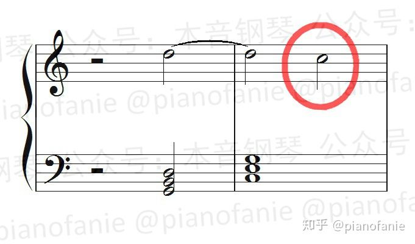

* 倚音（Appoggiatura）：这里的倚音并非装饰音中的倚音，而是指出现在强位上并获得级进解决（到和弦音）的和弦外音。通常用于故意在强拍上制造不舒服的感觉

  

  《生日歌》

  

* 先现音（anticipation）：属于后面和弦的音，以和弦外音的形式出现在前一个和弦的弱位上。先现音一般在前一个小节时值较短

  

##### 即兴伴奏中的应用

在即兴伴奏中配和弦时，要处理好各种和弦外音，一般规则如下：

* 优先考虑强拍、强位上的音，并尽可能把更多的旋律音包含到和弦里去，使得和弦外音的数量最少
* 如果小节内有明显的长音，则要优先把长音包含到和弦里去
* 如果是句末，则要考虑和弦要包含句末音
* 和声进行（和弦连接）也非常重要，需要综合考虑。

### 三和弦（Triads）

定义：在调性和声中，三个音按照三度音程关系叠置。就算在一个三和弦的基础上再添加不同八度但音级相同的音，它仍然是三和弦。非调性和声中的和弦是建立在非三度结构基础上的。

和弦音的排列自下而上，分别为根音（Root）、三音（中音、Third）、五音（冠音、Fifth）。

和弦的读法：和弦应自下而上依次读出各音。C和弦（CDE）应读作do mi sol

比如在C和弦中，它的组成音是1、3、5，1音叫作根音，3音叫作三音，5音叫作五音。比如在Cm和弦中，它的组成音是1、♭3、5，1音叫作根音，♭3音叫作三音，5音叫作五音

演奏时，左手一般一个音（根音），负责C1-F2。右手一般三个音，负责G2-B3

#### 四个类型

以任何一个音为根音都可以构成4种三和弦。

|        | 大三和弦（常用）                                             | 小三和弦（常用）                                             | 增三和弦（不常用）                                           | 减三和弦（不常用）                                           |
| ------ | ------------------------------------------------------------ | ------------------------------------------------------------ | ------------------------------------------------------------ | ------------------------------------------------------------ |
| 构成   | 根音+大三度音+小三度音（根音与五音是纯五度音程关系）<br /> | 根音+小三度音+大三度音（根音与五音是纯五度音程关系）<br/><br/> | 根音+大三度音+大三度音（根音与五音是增五度音程关系）<br/><br/> | 根音+小三度音+小三度音（根音与五音是减五度音程关系）<br/><br/> |
| 协和性 | 协和和弦（不包括不协和音程）                                 | 协和和弦                                                     | 不协和和弦（包括不协和音程）                                 | 不协和和弦                                                   |
| 色彩   | 音乐色彩明亮、开放                                           | 音乐色彩暗淡、柔和                                           | 音乐色彩尖锐、刺耳                                           | 音乐色彩尖锐、刺耳。具有诡异和压抑的特点                     |

大三和弦和小三和弦的根音和冠音一样，只是小三和弦的中音比大三和弦小了一个半音。


#### 性质（色彩？）

和弦的音程函量，即和弦所包含音程的量与质的总和。音程函量决定着和弦的音响品质。

例如：三和弦含有三对音程（根音至五音的五度，根音至三音、三音至五音的两个三度）以及它们的转位形式。大三和弦与小三和弦所含音程都是协和的，属于协和和弦。减三和弦含有一个不协和的减五度，增三和弦含有一个不协和的增五度，属于不协和和弦

* 协和和弦

  包括大三和弦和小三和弦

  由于构成大、小三和弦的大三度和小三度都是协和音程，且根音与五度音是纯五度，因此这两种和弦是协和和弦，也是音乐作品中使用最多的和弦

  大三和弦的音乐色彩明亮、开放，小三和弦的音乐色彩暗淡、柔和

* 不协和和弦

  包括增三和弦和减三和弦

  由于构成增、减三和弦的根音与五度音是增五度和减五度，都是不协和音程，因此这两种和弦是不协和和弦

  增、减三和弦的音乐色彩尖锐、刺耳，在音乐中较少使用。减三和弦具有诡异和压抑的特点（恐怖片里常用）


协和音程的物理知识：

大三度就是2^(4/12)=1.25992倍的频率关系，近似等于1+1/4

小三度则是2^(3/12)=1.18921倍的频率关系，近似等于1+1/5

纯四度是2^(5/12)=1.3348倍的频率关系，近似等于1+1/3

纯五度则是2^(7/12)=1.49831倍的频率关系，近似等于1+1/2

#### 自然大小调中各音级上三和弦的名称、标记和类别

自然大小调中各和弦的名称、标记和类别是由该和弦的根音在音阶中的音级位置所决定的，和弦的功能是和该和弦的根音在调式中的功能相关联的。

C自然大调

```abc
T:C自然大调中各音级上的三和弦
M:4/4
L:1/4
K:C
Q:60
"C""Ⅰ""主和弦"[CEG] "Dm""Ⅱm""（上主和弦）"[DFA] "Em""Ⅲm""（中和弦）"[EGB] "F""Ⅳ""下属和弦"[FAc] | "G""Ⅴ""属和弦"[GBd] "Am""Ⅵm""（下中和弦）"[Ace] "Bdim""Ⅶ-""（导和弦）"[Bdf] "C""Ⅰ"[ceg]
```

a自然小调

```abc
T:a自然小调中各音级上的三和弦（TODO）
M:4/4
L:1/4
K:C
Q:60
"C""Ⅰ""主和弦"[CEG] "Dm""Ⅱm""（上主和弦）"[DFA] "Em""Ⅲm""（中和弦）"[EGB] "F""Ⅳ""下属和弦"[FAc] | "G""Ⅴ""属和弦"[GBd] "Am""Ⅵm""（下中和弦）"[Ace] "Bdim""Ⅶ-""（导和弦）"[Bdf] "C""Ⅰ"[ceg]
```


### 七和弦（Seventh Chord）

定义：四个音按照三度音程关系叠置

七和弦是由4个音所组成的。它是以三和弦为基础，再加上一个从根音往上的七度音，或者说再加上一个从五音往上的三度音构成的。

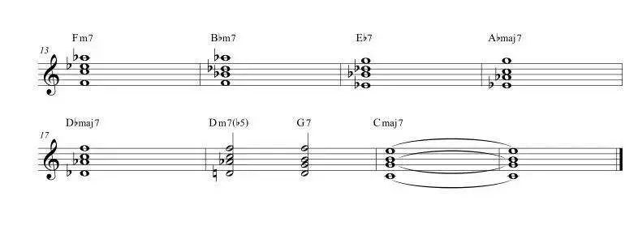

和弦音的排列自下而上，分别为根音、三音、五音、七音。


性质：根音与七音所形成的二度关系，决定了七和弦不稳定的性质及需要解决的倾向。

```abc
T:C自然大调中各音级上的七和弦
M:4/4
L:1/4
K:C
Q:60
"CM7""ⅠM7""主和弦"[CEGB] "Dm7""Ⅱm7""（上主和弦）"[DFAc] "Em7""Ⅲm7""（中和弦）"[EGBd] "FM7""ⅣM7""下属和弦"[FAce] | "G7""Ⅴ7""属和弦"[GBdf] "Am7""Ⅵm7""（下中和弦）"[Aceg] "Bm7-5""Ⅶm7-5""（导和弦）"[Bdfa] "CM7""ⅠM7"[cegb]
```


**V级**：罗马数字的5级，指音阶中第5个音，例如C大调的V级就是G音；

**属音**：指V级音；

以任何一个音为根音都可以构成七和弦

#### 八个类型（以根音C为例）

| 常用名称                                                  | 系统名称                     | 构成                                                         | 标记                                    | 色彩             |
| --------------------------------------------------------- | ---------------------------- | ------------------------------------------------------------ | --------------------------------------- | ---------------- |
| 大七和弦<br />Major seventh                               | 大大七和弦                   | 大三和弦（M）+大七度<br /> | Cmaj7<br/>CM7<br/>CΔ7<br/>CΔ            | Happy/Calm       |
| 属七和弦<br />Dominant seventh<br />（从调式功能描述）    | 大小七和弦（从和弦结构描述） | 大三和弦（M）+小七度。通常以属音为根音（注意不一定全是以属音为根音，只要满足大小七和弦，人们也习惯叫做属和弦）构成的七和弦，例如在C大调里，属音为G，所以构成的七和弦为GBDF<br /> | Cdom7<br />C7                           | Tense            |
| 小七和弦<br />Minor seventh                               | 小小七和弦                   | 小三和弦（m）+小七度<br /> | Cmin7<br/>Cm7<br/>C−7                   | Sad              |
| 小大七和弦<br />Minor major seventh                       | 小大七和弦                   | 小三和弦（m）+大七度<br /> | Cmmaj7<br/>CmM7<br/>CmΔ7<br/>C−Δ7       | Confused Sadness |
| 半减七和弦<br />小七减五和弦<br />Half-diminished seventh | 减小七和弦                   | 减三和弦（dim）+小七度<br />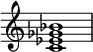 | Cm7♭5<br/>C−7♭5<br/>Cø                  |                  |
| 减七和弦<br />Diminished seventh                          | 减减七和弦                   | 减三和弦（dim）+减七度<br /> | Co7<br/>Cdim7<br/>Cm(♭7)♭5<br/>C-(♭7)♭5 |                  |
| 增七和弦<br />Augmented seventh                           | 增小七和弦                   | 增三和弦（aug）+小七度<br /> | Caug7<br/>C+7                           |                  |
| 增大七和弦<br />Augmented major seventh                   | 增大七和弦                   | 增三和弦（aug）+大七度<br /> | Cmaj7♯5<br/>C+M7<br/>C+Δ7               |                  |


【tip 根据音程转换的思想找小7：找G的小七度时，先找大二度（9-7=2，大->小），找到G左边的键F，把F升高8度得解】
以下是几种常见以B为根音的七和弦：

* B- #D - #F - #A = Bmaj7
* B- #D - #F - A = B7
* B - D - #F - A = Bm7
* B - D - F - bA = Bdim7
* B - D - F - A = Bm7-5

#### 音级

在C大调顺阶和弦当中，所有的三和弦都可以变化成为七和弦。


以自然大调内顺阶七和弦为例：

* 大七和弦——I级（Cmaj7）、IV级（Fmaj7）
* 属七和弦——V级（G7）
* 小七和弦——II级（Dm7）、III级（Em7）、VI级（Am7）
* 半减七和弦——VII级（Bm7-5）

#### 性质

性质由两个三和弦与一个七度音程构成：

* 三和弦的感情色彩会比较单调，大三和弦色彩明朗，小三和弦色彩阴暗。而以Cmaj7和弦为例，把这个和弦的4个组成音C-E-G-B拆解开：

  * C-E-G三个音组成了一个C和弦

  * E-G-B三个音又组成了一个Em和弦

  Cmaj7和弦也可以看成是两个三和弦的叠加，它同时拥有了大三和弦和小三和弦的两种色彩。

* 由于所有七和弦中的根音与七度音构成的都是不协和的七度音程，因此所有七和弦都是不协和和弦。

  注意：在大、小调和声中，不协和和弦是必须给予“解决”的，即要求进行到另一个相对协和稳定的和弦上。

#### 属七和弦（Dominant Seventh Chord）

定义：在调式音阶第Ⅴ级音（属音）上建立的七和弦。

属七和弦的结构为大小七和弦。在小调中，常用和声小调的属七和弦。

作用：在所有七和弦中，属七和弦最常用，它是巩固调性和变换调性必不可少的和弦。属七和弦常用于歌（乐）曲的终止处。

#### 性质

以G7和弦为例，把这个和弦的组成音G-B-D-F拆分开：

* G-B-D组成了一个G大三和弦
* B-D-F这三个音，因为B到F是增四/减五音程，所以组成了B减三和弦

因为增四/减五音程极其不稳定，有着强烈的回归主级的感觉，所以属七和弦回归主级的感觉要比其他任何的和弦都要强烈。

#### 润色

1. 用大七和弦演奏五声音阶，如原本C三和弦为135，可以演奏为1236

### 转位和弦（Inversions）

作用

* 让音高更相近（缩短高音或低音部分的音程）
* 增加变化，丰富和声（尤其在副歌部分）
* 通过转位实现根音连接。例如：（F → C → D）的和弦進行可以將中間的 C 和弦改成第一轉位，變成（F → C/E → Dm），將低音拉成一直線的音階下行

根音在低音位置时称原位和弦，不在低音位置时称转位和弦。转位和弦的稳定程度要逊于原位。

和弦低音的选择决定了和弦的稳定性，以及和弦的情绪色彩。比如小七和弦Am7的第一转位C6,听起来反而更接近大三和弦。同样大七和弦Cmaj7的一转也会更接近小三和弦Em的阴沉感。

- 和弦根音在最下方叫原位和弦

- 和弦三音在最下方叫和弦的第一转位。
  在三和弦中，低音与上面的两个音分别构成三度和六度，故名三六和弦，简称六和弦，以数字“6”标记。

  在七和弦中，低音与其上的七音与根音分别相距五度和六度，故名五六弦，以数字“”标记

- 和弦五音在最下面叫和弦的第二转位。
  在三和弦中，低音与上面的两个音分别构成四度和六度，故名四六和弦，以数字“”标记
  在七和弦中，低音与七音、根音分别相距三度和四度，故名三四和弦，以数字“”标记

- 和弦七音或六音在最下方叫和弦的第三转位
  在七和弦中，低音与根音相距二度，故名二和弦，以数字“2”标记


注意：转位后的和弦，三音/五音/七音等之前是什么音，转位之后还是不变。如：C（根音，低音）E（三音）G（五音），转位后变成E（三音，低音）G（五音）C（根音），写作C/E（C代表和弦，E代表低音）。斜線唸做 **on**，或是 **slash**、**over**。例如：C/G 可讀作 C on G、C slash G、C over G。

例子：如图，以C和弦(C E G)为例。

* 把根音C翻高一个八度，和弦变成了EGC，称为C和弦的第一转位。此时E就变成了根音，记为C/E
* 接下来，把E再翻高一个八度，和弦变成GCE，则称为C和弦的第二转位，G为根音，记为C/G
* 最后，再把G翻个八度，和弦再次变回了CEG，即原位和弦


作用：和弦排列顺序的改变可以使和弦的听感发生改变。因为所有和弦都是为了旋律线条而产生的，因此转位和弦改变的是和弦的最低音，来可以构建流畅的低音旋律线条。

例如：用来避免高音和低音跨度太大，用转位和弦来提升低音旋律线条

##### 原位和弦与和弦第一转位的衔接

作用：让原位和弦与和弦第一转位衔接得更自然

如果一个原位和弦进行到第一转位和弦，则低音需要下行半/全音

如果一个第一转位和弦到原位和弦进行，则低音需要上行半/全音

例子：Leading Bass


新闻联播片尾


### 挂留和弦（sus和弦、suspended chord）与Slash和弦

流行乐常见。

挂留和弦是在三和弦基础上用挂留音代替三音而形成的非三度排列的和弦。

#### 作用

挂留和弦会带来紧张的感觉，古典乐理作用是增加音乐的张力（tension），所以在和弦的弹奏上，需要再解决（resolution）到原本的和弦；但爵士乐理就可不解决。

sus4，7sus听上去其实是**比较中性的，大小和弦的感觉并不强**，主要还是以sus本身的模糊的色彩为主。

而之所以会感到有大小和弦的色彩，应该是来自于和弦在和声进行中的位置所带来的暗示。比如同样是Csus4，在C调里听起来就感觉更偏向大和弦，或者说会下意识地期待sus解决到大三度，同样地，在Bb调里，就会偏向于小和弦。

而9sus，13sus，可以拆成斜线和声，比如C9sus，可以写成Bb/C，而C13sus可以写成BbMaj7/C。因为上方的和弦都是大和弦，所以这两个和声听起来都有大和弦的听感，都很明亮。

而7susb9听起来就比较phrygian了，或者说更偏向于解决到alter音阶，所以听感上是非常暗的，比单纯的小三（七）和弦还要暗一些。

#### 挂四和弦（sus4和弦）

是指三和弦或者七和弦里的三音被四音所取代，使之距根音为纯4度所形成的和弦（sus4 chord），因其3音被取代，没有大和弦与小和弦的声响，因此和弦听起来较为中性。

sus4和弦一般情况下都是通过大三和弦和属七和弦变化而来，比如在C和弦中，C和弦的组成音是1、3、5，要想把C和弦变成Csus4，就把3音去掉，再加上纯四度的4，Csus4和弦的组成音就是1、4、5，属七和弦同理。

sus4和弦在流行音乐中非常常见，sus4和弦一般情况下是用在属七和弦之前。

### 加音和弦（add和弦）

加音和弦就是在三和弦基础上再加一个音符，常用和弦为加九和弦。

Cadd9：加9和弦，在三和弦上附加根音上方九度音。135+升2

但常用的形态是将九度音降低一个八度，变为根音上方二度音。

Cadd2：一个三和弦加了大二度音之后，会有一个模糊的感觉。因为这个二度音跟旁边的音距离非常近，三个音挤在一起会让人感觉不协和。加2之后，和弦功能不变。

注意把add9和弦和sus2和弦区别开，因为add9是四音和弦，而sus2是三音和弦。

### 减和弦（Diminished Chords）

定义：用小三度堆叠而成的和弦

从任何一个音开始堆叠，当堆叠到了第五个音，则重复回原来的音


因为两个小三度音程加在一起就变成了减五度（三全音）。减三和弦有一个三全音，减七和弦有两个三全音。三全音是一种非常不和谐的音程，所以减和弦在古典乐曲中常用来表示紧张、危险、惊吓或者要临死了，或者阴森的感觉。但也可以不紧张，如Bdim（BDF）可以看做是缺了一个音的G7和弦（GBDF），所以有时可以把Bdim当作G7和弦来用。

### 借用和弦（Borrowed chord。调式呼唤，Modal Interchange。调式混合，Mode Mixture）

使用“同一主音，但不同调式”中的和弦

注意：因为借用和弦会产生离调的音，一般都是三度音（大3或者小3），如果旋律音刚好是根音的小（大）三度而借用和弦含有大（小）三度音，那么这两个音会冲突，就不该使用借位和弦。

如用C小调中和弦替换掉C大调中对应同级的和弦


### 顺阶和弦（调内和弦、Diatonic Chord）

指完全用音阶内的音组成的和弦。

一个调里一共有7个顺阶和弦，通常我们会用罗马数字来表示级数，即I、II、III、IV、V、VI和VII。所有大调的I、IV、V级都为大三和弦，II、III、VI级都为小三和弦，VII级都为减三和弦

#### 作用

* 顺阶和弦的规律可以让我们很快地分辨出调性
* 可以根据顺阶和弦快速移调
* 分析和声与编配和声

| C大调音阶   | 1     | 2    | 3    | 4     | 5    | 6    | 7                                                            | 高音1 |
| ----------- | ----- | ---- | ---- | ----- | ---- | ---- | ------------------------------------------------------------ | ----- |
| 音名        | C     | D    | E    | F     | G    | A    | B                                                            | C     |
| 顺阶 三和弦 | C     | Dm   | Em   | F     | G    | Am   | Bdim                                                         | C     |
| 顺阶 七和弦 | Cmaj7 | Dm7  | Em7  | Fmaj7 | G7   | Am7  |  | Cmaj7 |


#### 顺阶和弦进行


### 和弦识别方法

* 先看三个音是否都在线上或间上，
  * 如果是，则为三和弦原位
  * 如果不是，则看音符远近，如果下面两个音近，上面两个音远为`六和弦`。如果上面两个音近，下面两个音远为`四六和弦`。并看上方音的最下一个音是什么，，它是什么音，那它就是什么和弦的转位。
* 原位三和弦直接通过键盘数半音判断大小，转位和弦回到原位以后再数半音判断大小。
* 识别和弦级数与性质（大小增减等）：从X调数到X和弦，算下相差几度，那几度就是该和弦的级数：
  * 如在D大调中，E和弦在ii级上（副下属和弦/小三和弦/小七和弦），因为D->E= 2
  * 如在D大调中，C和弦在vii级上（导和弦/减三和弦/半减七和弦），因为D->C = 7
  * 如果出现了，升降号，则先判断不带升降号的和弦性质，然后再逐个加上升降号，判断和弦性质。
    * 如C大调中C-Eb-Gb是什么和弦？先看C-E-G在C大调中级数为1，因此它是C大三和弦（大三度+小三度）。再看C-Eb-G，重新算音程关系，得到小三度+大三度，即C小三和弦。再看C-Eb-Gb，重新算音程关系，得到小三度+小三度，即C减三和弦。
    * 如A大调中C#-E-G是什么和弦？先看C-E-G在A大调中级数为3，因此它是C小三和弦（小三度+大三度）。再看C#-E-G，重新算音程关系，得到大三度+大三度，即C增三和弦。
  
* 识别和弦的构成音：D7和弦的构成音是？
  * D7是以D为根音的属七和弦（识别和弦标记）
  * 属七和弦的结构是1、3、5、♭7（各和弦类型的结构是什么）
  * 当1=D，3是F♯，5是A，♭7是C。（音程反应能力）
  * D7的构成音是D、F♯、A、C。

### 和弦总表

[Piano Chord Chart](https://www.songtive.com/en/chords/piano/C7sus4)

#### 三和弦

| 名称                    | 标记            | 组成          | 性质 |
| ----------------------- | --------------- | ------------- | ---- |
| C大三和弦（Major）      | Cmaj、CM、C△、C | 大三度+小三度 |      |
| A小三和弦（Minor）      | Amin、Am、A-    | 小三度+大三度 |      |
| B减三和弦（Diminished） | Bdim、Bo        | 小三度+小三度 |      |
| C增三和弦（Augmented）  | Caug、C+        | 大三度+大三度 |      |

#### 七和弦


| 名称                               | 标记                     | 组成            | 性质 |
| ---------------------------------- | ------------------------ | --------------- | ---- |
| C大七和弦（Major）                 | Cmaj7、CM7、C△7          | 大三和弦+大七度 |      |
| C大小七和弦（属七和弦）            | C7、Cdom7                | 大三和弦+小七度 |      |
| C小大七和弦                        | CmM7、Cmin（Maj7）、C—△7 | 小三和弦+大七度 |      |
| A小七和弦（Minor）                 | Amin7、Am7、A-7          | 小三和弦+小七度 |      |
| B半减七和弦（Half Diminished 7th） | Bm7（b5）、Bm7-5、B∅7    | 减三和弦+小七度 |      |
| B减七和弦（Diminished）            | Bdim7、Bo7               | 减三和弦+减七度 |      |
| C增七和弦、属七升五音和弦          | C7+5、Caug7、C+7         | 增三和弦+小七度 |      |

#### 挂留和弦（sus和弦）

| 名称          | 标记   | 组成                                 | 性质 |
| ------------- | ------ | ------------------------------------ | ---- |
| 挂2和弦、sus2 | Csus2  | 用根音上方二度音代替三音             |      |
| 挂4和弦、sus4 | Csus4  | 用根音上方四度音代替三音             |      |
| 属七挂四和弦  | C7sus4 | 属七和弦中，用根音上方四度音代替三音 |      |

#### 加音和弦（add和弦）

| 名称          | 标记   | 组成                                 | 性质 |
| ------------- | ------ | ------------------------------------ | ---- |
| 加9和弦、add9 | Cadd9  | 在三和弦上附加根音上方九度音         |      |
| 挂4和弦、sus4 | Csus4  | 用根音上方四度音代替三音             |      |
| 属七挂四和弦  | C7sus4 | 属七和弦中，用根音上方四度音代替三音 |      |

### 非顺阶和弦（非调内和弦）

指和弦里使用了音阶以外的音符。

非调内和弦在音乐中的使用非常常见。

在流行歌曲里，非调内和弦一般出现的时间比较短，使用次数不多，但是使用得当，会相当有提升效果。而在爵士音乐里，非调内和弦运用得相当多，经常用转调、离调来形成丰富的和声色彩

### 功能和弦（Function）

（主要关联知识：音的稳定性、和弦进行）

#### 功能和声

如果在一段调性音乐中，我们能够将所有被使用的和声分类成主功能、属功能和下属功能，那么我们称这类音乐使用的和声为功能和声(英语：functional harmony)。 如果在一段音乐中，我们无法将所使用的和声分类成主功能、属功能和下属功能，那么我们称这类音乐使用的和声为非功能和声(英语：nonfunctional harmony)。 功能和声被最大量使用的时期是[共晓时期](https://zh.wikipedia.org/wiki/共晓时期)，也就是17世纪、18世纪、和19世纪的西方艺术音乐。

##### 类别

* 主和弦和副主和弦都由13组成，因此其功能差不多
* 属和弦、副属和弦、导和弦
* 下属和弦、副下属和弦

在大调体系中，有三种和弦族是相当重要的：主和弦、属和弦以及下属和弦。这三个和弦都是大三和弦，是支撑起大调和声框架的支柱和弦，称为正三和弦，其余四个和弦称为副三和弦。

* 主和弦（Ⅰ）：最重要的。给人稳定的感觉，常用于开始与结束一个乐句/乐段
* 属和弦（Ⅴ）：悬而未决+不稳定的感觉。属七和弦：悬而未决+不稳定的感觉更加强烈。多出来的七度的F与B形成很不协和的组合，这个组合叫做三全音（tritone。这两个音正好距离三个全音）
* 下属和弦（Ⅳ）：稳定性介于主和弦与属和弦之间。增加和弦的丰富性。在律动中运用下属和弦的一种常见的方法，是通过将其与 主和弦的交替进行(I/IV/I/IV/1)来增加和声运动

在小调体系中，有两种极为重要的和弦：主和弦与属和弦。

* 主和弦：Ⅰmin和弦是小调中最重要的和弦。它也像“家” 一样，但要记住的是，这个小调和弦的整体色彩会弥漫在全部的歌词中。在a小调中，主和弦是Amin和弦。
* 属和弦：在小调体系中，有几种不同的属和弦可以制造出张力。Ⅴmin和弦与bⅦ和弦是其中最常见的两种属和弦。在a小调中，属和弦是Emin和弦、 g和弦和e和弦。
  可以改变小调中Ⅴmin和弦的色彩，使其变成大调中的属和弦，能够营造出更强的紧张感。

##### 调式

在功能和声中，从调式和声的观点来看，和弦之间存在着一个由倾向于主三和弦的倾向性统一起来的相互关联体系。这种关联体系既确定了一个旋律声部中的各音之间的旋律——音程关系，也确定了各和弦之间的总关系。

##### 调式功能

调式功能简称功能，是指音或和弦在调式中的作用。也可以说是指它（音、和弦）与别的音或和弦在同一调式中的相互关系。这种关系不仅表现在各音或和弦间的音程关系上，还表现在当这些音或和弦连接时显示出来的紧张与稳定（解决）的变化上。

##### 功能性

各种功能关系中所固有的紧张与解决的总和统称为功能性。最基本的功能性即功能的对比，特别是调式和声中主功能与其他非主功能的对比。 以调式功能学说为基础建立起来的和声理论成为**功能理论**。

#### 具体

在使用和声调式的情况下，大、小调式和弦结构的差异，将主要体现于主和弦的不同。
重要的是对各级三和弦相互关系的把握。在这个问题上，大、小调式的原理基本相同：

* 一级三和弦都是协和的，是在其他和弦的积极支持下建立起来的一个稳定的中心，故名主和弦（Tonic，缩写T）
* 五级、四级的三和弦也是协和的，它们分别从上、下五度方向对主和弦形成有力的支持，名曰属和弦（Dominant，缩写D）、下属和弦（Subdominant，缩写S）
* 主、属、下属三个和弦是确定调性的基础，甚至还是纯律大、小调音阶产生的依据，所以称作正三和弦。其他各级三和弦结构多样，分别与一、五、四级和弦呈上、下三度关系，直接或间接地与主和弦发生联系，称副三和弦。

以C自然大调为例：

[](https://zh.wikipedia.org/wiki/File:Scale_degrees_with_chords.png)

|              | 135                                  | 246                | 357                | 461                                                    | 572                              | 613                  | 724                                                          |
| ------------ | ------------------------------------ | ------------------ | ------------------ | ------------------------------------------------------ | -------------------------------- | -------------------- | ------------------------------------------------------------ |
| 和弦名       | C                                    | Dm                 | Em                 | F                                                      | G                                | Am                   | B-                                                           |
| 级数罗马数字 | Ⅰ                                    | ii                 | iii                | Ⅳ                                                      | Ⅴ                                | vi                   | vii°                                                         |
| 级数名       | 主（Tonic）                          | 上主（Supertonic） | 中（Mediant）      | 下属（subdominant）                                    | 属（dominant）                   | 下中（submediant）   | 导（leading note）                                           |
| 德文缩写     | T                                    | SP                 | Dp/Tg              | S                                                      | D                                | Tp                   |  |
| 功能名       | 主和弦                               | 副下属和弦         | 副属和弦           | 下属和弦                                               | 属和弦                           | 副主和弦             | 导和弦                                                       |
| 功能组       | 主功能组                             | 下属功能组         | 主功能组、属功能组 | 下属功能组                                             | 属功能组                         | 主功能组、下属功能组 | 属功能组                                                     |
| 听感         | 主和弦會有開始（或結束）、穩定的感覺 |                    |                    | 下屬和弦會有中介、跨出一步的感覺，常常被用來接到屬和弦 | 屬和弦會有還沒結束、不穩定的感覺 |                      |                                                              |

以D自然大调为例：

|        | 2 #4 6 |            |          |          |        |          |        |
| ------ | ------ | ---------- | -------- | -------- | ------ | -------- | ------ |
| 和弦名 | D      | E          | #F       | G        | A      | B        | #C     |
| 级数名 | Ⅰ      | ii         | iii      | Ⅳ        | Ⅴ      | vi       | vii°   |
| 功能名 | 主和弦 | 副下属和弦 | 副属和弦 | 下属和弦 | 属和弦 | 副主和弦 | 导和弦 |

主和弦、属和弦、下属和弦是正三和弦，且都是大三和弦。

副主和弦、副属和弦、副下属和弦是副三和弦，且都是小三和弦。副三和弦位于对应的正三和弦的上方三度或下方三度。因为这样的正、副三和弦中有两个音是共同音，因此二者功能相近。

##### 功能组

* 主功能组和弦：Ⅵ级（副主和弦）、Ⅰ级（主和弦）、Ⅲ级（副属和弦）。在C自然大调中，包含了C、Am、Em和弦。三个组中最稳定的一组。

  以C大调顺阶三和弦为例，一级主和弦C大三和弦，由于组成音为1 3 5(稳定音)，所以和声的功能听起来是最稳定的，具有强烈的归属感。常见的大调歌曲一般都会用主和弦开始和结束，让音乐能带给人一种有始有终的感觉。它的上方三度和下方三度和弦分别为三级Em(3 5 7)和六级Am(6 1 3)，组成音有两个是相同的(如果是顺阶七和弦更是有三个音相同)，都含有主和弦中两个稳定音，和声的功能性相近，这三个和弦称为主和弦功能组。主和弦给人的感觉是最稳定的，英文为Tonic，简写为T。我们用一条平稳的直线表示主和弦的感觉。

* 下属功能组和弦：Ⅱ级（副下属和弦）、Ⅳ级（下属和弦）、Ⅵ级和弦（副主和弦）。在C自然大调中，包含了F、Dm、Am和弦。

  四级下属和弦F(4 6 1）或者大七和弦Fmaj7（4 6 1 3），由于含有不稳定音但却不含有调性三全音，所以稳定性介于主和弦和属和弦中间，它和上方三度的二级和弦Dm(2 4 6)组成下属和弦功能组，英文为Subdominant 简写为SD。

* 属功能组和弦：Ⅲ级（副属和弦）、Ⅴ级（属和弦）、Ⅶ级（导和弦）。在C自然大调中，包含了G、Em、Bdim和弦。

  五级的属和弦G(5 7 2)或属七和弦G7( 5 7 2 4），由于组成音主要是不稳定音，且属七和弦中的三音7和七音4形成了调性三全音(tritone )，本身就很不和谐、不稳定，导音7和下属音4都处于半音的位置上，这两个音有一种强烈的想解决回主音1和上中音3的趋势。所以属和弦给人的感觉是最不稳定，情绪最强烈，需要被解决的。同样的，V级属和弦由于和上下方三度（三级Em 、七级Bdim）组成音类似，功能相近，所以和这两个和弦一起称为属和弦功能组。

  我们用一条带有山峰的线条代表属和弦功能，英文为Dominant 简写为D。注意这里又出现了三级Em和弦，这里很多同学无法理解为什么三级和弦即存在于主和弦功能组里，又可以混在属和弦功能组里？大部分情况下（90%）三级和弦会属于主和弦功能组，但现代音乐里也有少量三级替代五级属和弦使用的例子。

注意：由于3*3-7=2，因此有两个和弦同时属于两个功能组，即Ⅲ级和Ⅵ级和弦

在传统的和声学中，自然大调下：将主和弦、下属和弦、属和弦分别标记为T（tonica）, S（subdominant）, D（dominant）。和声小调下：将主和弦、下属和弦、属和弦分别标记为t, s, D。

西方传统音乐在很长很长一段时间内，遵循的是T－S－D－T的方式，由主功能进行到下属功能（也叫预属功能），再进行到属功能，最后又回归主功能。主功能是极为稳定的，属功能是极为不稳定的，下属功能则介于这两者中间，所以这个过程用文字来描述大概是：稳定－有些不稳定－非常不稳定－稳定。

实际上，许多的传统曲式也可以遵循这个方式，但它通常不同的是，我们平常说的T－S－D－T指的是和声在自然大小调中某单一调性里的功能，不涉及转调，而在传统各类曲式中通常会有转调，在这个语境下，T－S－D－T不是指主和弦进行到下属和弦再进行到属和弦，最后回到主和弦的概念，它可能会成为一个调性的分布，把每一个功能都当作一个调，是指主调进行到下属调再进行到属调，最后回归主调的过程。

以C自然大调的单一调性举例，T－S－D－T 用最简洁的方式来表达，就是C－F－G－C这几个和弦，但如果将它们用调性分布的方式来看待，它就会从C调开始，经过发展，转入F调，再发展，转入G调，最后回归C调，这样一来，一段很简单的单一调性的T－S－D－T进行，扩展成了相对具有更庞大格局，包含多个调的音乐作品，但无论如何，它一定遵循一个由“不稳定”回归“稳定”的逻辑。

#### 和弦性质（Chord Qualities）

和弦性质列表：https://feelyoursound.com/scale-chords/a-harmonic-minor/

##### 自然大调和弦性质

|             | I        | ii       | iii      | IV       | V        | vi       | vii°       |
| ----------- | -------- | -------- | -------- | -------- | -------- | -------- | ---------- |
| 三和弦      | 大三和弦 | 小三和弦 | 小三和弦 | 大三和弦 | 大三和弦 | 小三和弦 | 减三和弦   |
| C大调三和弦 | C        | Dm       | Em       | F        | G        | Am       | B°         |
| 七和弦      | 大七和弦 | 小七和弦 | 小七和弦 | 大七和弦 | 属七和弦 | 小七和弦 | 半减七和弦 |
| C大调七和弦 | Cmaj7    | Dm7      | Em7      | Fmaj7    | G7       | Am7      | B°         |

##### 自然小调和弦性质

|             | i        | ii°        | III      | iv       | v        | VI       | VII      |
| ----------- | -------- | ---------- | -------- | -------- | -------- | -------- | -------- |
| 三和弦      | 小三和弦 | 减三和弦   | 大三和弦 | 小三和弦 | 小三和弦 | 大三和弦 | 大三和弦 |
| a小调三和弦 | Am       | B°         | C        | Dm       | Em       | F        | G        |
| 七和弦      | 小七和弦 | 半减七和弦 | 大七和弦 | 小七和弦 | 小七和弦 | 大七和弦 | 属七和弦 |
| a小调七和弦 | Am7      | B°         | Cmaj7    | Dm7      | Em7      | Fmaj7    | G7       |

##### 和声小调和弦性质

|             | i        | ii°      | III+     | iv       | V        | VI       | VII°     |
| ----------- | -------- | -------- | -------- | -------- | -------- | -------- | -------- |
| 三和弦      | 小三和弦 | 减三和弦 | 增三和弦 | 小三和弦 | 大三和弦 | 大三和弦 | 减三和弦 |
| a小调三和弦 | Am       | B°       | C+       | Dm       | E        | F        | G#°      |
| 七和弦      |          |          |          |          |          |          |          |
| a小调七和弦 |          |          |          |          |          |          |          |

##### 旋律小调和弦性质

|             | i        | ii       | III+     | IV       | V        | #vi°     | vii°     |
| ----------- | -------- | -------- | -------- | -------- | -------- | -------- | -------- |
| 三和弦      | 小三和弦 | 小三和弦 | 增三和弦 | 大三和弦 | 大三和弦 | 大三和弦 | 减三和弦 |
| a小调三和弦 | Am       | Bm       | C+       | D        | E        | F#°      | G#°      |
| 七和弦      |          |          |          |          |          |          |          |
| a小调七和弦 |          |          |          |          |          |          |          |


#### 大小调中三和弦的关系

#### 同主音自然大调与自然小调三和弦的关系

* 两种调式所有同级上的和弦都是不同的
* 除二级、七级之外，其他五个音级，大调的正三和弦都是大三和弦，副三和弦都是小三和弦。小调的情况相反，正三和弦都是小三和弦，副三和弦都是大三和弦
* 二级和弦在大调中是小三，在小调中是减三；七级和弦在大调中是减三，在小调中是大三


和声调式的应用使大、小调在和弦结构上有了更多的联系。

和声小调升高七级音的结果，使小调五级、七级的三和弦同于大调

和声大调降低六级音的结果，使大调四级、二级的三和弦同于小调

与此同时，小调的三级、大调的六级，都出现了自然调式所没有的增三和弦，这两个和弦在平行大、小调上存在着等音同构的关系


#### 功能和声音乐与调性音乐的区别

所有使用功能和声的音乐都是调性音乐，所有无调性音乐使用的都是非功能和声。 但应注意的是，**不是**所有调性音乐都使用功能和声。例如西方文艺复兴时期使用的中古调式音乐、[传统五声调式音乐](https://zh.wikipedia.org/wiki/中國五聲音階)、和德彪西的印象派音乐等都有明确的调性中心、都属于调性音乐，但是这些音乐都不使用功能和声。调性与调性中心的确立手法除了使用功能和声以外还有很多，例如[固定低音](https://zh.wikipedia.org/wiki/固定低音)、[持续低音](https://zh.wikipedia.org/wiki/持续低音)、持续高音、旋律[终止式](https://zh.wikipedia.org/wiki/終止_(音樂))的结束音(英语：final)和吟诵音(英语：tenor)等等。

### 和弦色彩（情感）

#### 重要性

* 作曲如同绘画。如果一幅画的主色调为蓝色，那么这种色彩想要表达什么？如果是红色的呢？在音乐中，有一种主要的音乐风格即被称为“蓝调”，这种音乐风格的特点正是其和声色彩的程示。
* 培养自己对音乐色彩的感知能力有助于把现实色彩与声音和感觉联系起来，以更加深入地认知与利用和声的一种渠道

#### 培养感知力的方法

* 观察一种色彩，然后用乐器找到那种色彩，运用音符再现色彩传递给你的那种感觉
* 弹奏一个和弦并描述它所呈现给你的色彩

#### 大和弦色彩

对大多数人来说，“大调”通常体现了一种欢快和明朗的感觉。大三音（E）赋予大和弦欢快、积极的音。
含有大三和弦律动的流行金曲包括：《走这条路》(Walk This Way) [C], 《情感救赎》(Emotional Rescue)[Bb]、《给我庇护》(Gimme Shelter) [Db]等。

```abc
T:大和弦色彩（C大三和弦）
M:4/4
L:1/4
K:C
Q:120
[CEG]4 | C E G z |
[CEGc]4 | C E G c |
```

#### 小和弦色彩

对大多数人来说，“小调”体现了一种悲怆或自省的感觉。小三音（c）赋予小和弦悲怆与阴沉的色的音。
含有小三和弦律动的流行金曲包括

* 《我是一个男人》(I'm a Man) [Cmin]
* 《我只是一个摇滚歌手》(I' m Just a Singer in a Rock and Roll Band) [Amin]
* 《让它过去吧》(Let It Ride) [F # min]
* 《特别的周六夜晚》(Saturday Night Special) [Gmin]
* 《自由最可贵》(Best Things in Life Are Free) [F # min]
* 《燃烧》(Fire) [Dmin]
* 《西班牙魔法城堡》(Spanish Castle Magic) [F # min]
* 《你败坏了爱的名誉》(You Give Love a Bad Name) [Cmin]

```abc
T:a小三和弦色彩
M:4/4
L:1/4
K:C
Q:100
[Ace]4 | A c e z |
[Acea]4 | A c e a |
```

#### 强力和弦（强音和弦，Power chord）

加厚重力和弦的音色。对大多数人来说，它体现了一种强有力的、自信的，甚至是带有侵略性的感觉。在一种很慢的速度下，它听起来也很有神秘感。这种音效源自其省略了三音

含有强力和弦律动的流行金曲包括：

《我爱摇滚乐》(I Love Rock and Roll) [E5]

《毒药》(Bad Medicine) [E5]

《梭鱼》(Barracuda) [E5]等。

强力和弦有两个音：根音和五音。通常，根音有两个，其中一个是将原根音升高八度。

```abc
T:E强力和弦色彩
M:4/4
L:1/4
K:C
Q:100
[EBe]4 | E B e z |
```


#### 七和弦色彩

对大多数人来说，它体现了一种蓝调的、时尚独特的，甚至是性感的感觉。这种感觉源自七音与大三音的搭配

含有七和弦律动的流行金曲包括：
《热舞不歇》(The Beat Goes On) [C7]
《在街上跳舞》(Dancin' in the Street) [E7]
《大步走》(Goin' to a Go-Go) [G7]
《短途旅客》(Day Tripper) [E7]
《骄傲的玛丽》(Proud Mary) [G7]
《最后一个孩子》(Last Child) [Eb7]
《收税员》(Taxman) [D7]

```abc
T:G7和弦色彩
M:4/4
L:1/4
K:C
Q:100
[GBdf]4 | G B d f |
[GBdfg]4 | G B d f g |
```

#### 变化和弦色彩

通过为基本和弦增加或替换音符的方法，来变化一个和弦的基本色彩，给律动带来新的色彩。 熟练地增加音符可以使基本的和弦色彩有两种或更多的版本，你也可以运用这些不同的和弦变形来创作律动。

通过增加音符来变化和弦律动的流行金曲包括：《名誉》(Fame) [G9]、《闪 亮之星》(Shining Star) [E7(#9)]等。

例子：在Dmin和弦的基础上增加一个七音，变成Dmin7

```abc
T:Dmin和弦与Dmin7和弦
M:4/4
L:1/4
K:C
Q:140
[CEG]4 | G B d f |
[GBdfg]4 | G B d f g |
```

##### 变化和弦的常用方法

你可以通过增加和替换四个基本和弦色彩的音符来变化和弦。基本和弦色彩和它们的变形共同被称做一个和弦族。

| 基本色彩 | 增加                       | 替换一个音符 并创作 |
| -------- | -------------------------- | ------------------- |
| 大调     | 6, Maj7, Maj9, add2        | sus2, sus4          |
| 小调     | 6, min7, min9, minll, add2 | minor sus4          |
| 强力     | sus2                       | —                   |
| 属七     | 9, 13,或 #9                | 6, 7sus4, 11        |

```abc
T:基本和弦C、和弦变形CMaj7、Cadd2、Csus4
M:4/4
L:1/4
K:C
Q:50
%% MIDI=program 42
[CEG] [CEGB] [CEGD] [CFG] |
```

```abc
T:基本和弦Amin、和弦变形Amin7、Amin6、Amin(add2)
M:4/4
L:1/4
K:C
Q:50
[A,CE] [A,CEG] [A,CE^F] [A,B,CE] |
```

```abc
T:基本和弦E5、和弦变形Esus2
M:4/4
L:1/4
K:C
Q:50
[EB]2 [EB^F]2 |
```

```abc
T:基本和弦A7、和弦变形A7sus4、A13
M:4/4
L:1/4
K:C
Q:50
[A,^CEG] [A,DEG] [A,G ^c^f] z |
```

##### 和弦变形的交替

将一种和弦色彩的两种变形进行交替，是扩展一段单一和弦律动的另一种方法。
通过将一种和弦色彩的两种变形交替进行的流行金曲包括：
《回来》(Get Back) [A]
《冰冷》(Cold as Ice) [Emin]
《驾驶》(Drive) [B]
歌手查克-贝瑞的大部分歌曲
注意，和弦的各种不同的变形是通过增加和替换基本和弦中的音符来实现的。还要注意这些变形是如何使单一和弦的律动变得更加生动有趣的。

### 和弦连接（和弦进行、Chord Progressions）

（主要关联知识：功能和弦）

列表：https://en.wikipedia.org/wiki/List_of_chord_progressions

和弦进行的基本逻辑，就是从稳定的和弦再到不稳定的和弦，最后再到稳定的和弦（解决）。

按照主-下属-属的形式进行连接，形式可以多变（如：主-属-主，下属-属-主，主-下属-主等等）

切记不能进行属-下属的连接（和弦功能写为D-S），因为这样的和弦连接在音响效果上极其破坏旋律性，除非作曲者刻意要让旋律有该效果

以上所说的是大小调中的主三和弦连接，另外还有副三和弦，副三和弦的使用是根据旋律情感来使用的（比如一个小节中出现1和3，那么我们可以使用C和弦，也可以使用a和弦，两个和弦有2个共同音，是可以使用和弦借代功能的，并且他们同属关系大小调中的主和弦，若想让旋律明朗一点则配C，若要忧伤一点则配a。），同理，对应的G与e，F与d和弦，都可以做为主和弦连接功能的替代。

解决（术语）：从不稳定感觉到稳定感觉的过程

起承转合：主和弦—>属和弦—>属七和弦—>主和弦


三个功能组互为倾向。乐曲的核心推动力就是和弦在这三个功能组之间来回推动。否则乐器会听起来很单调无聊。即旋律要么横向保持，要么上行，要么下行。

大跨度的和弦连接是不太好听的


基本和弦连接表（C自然大调）

| 家        | 桥    | 外面  | 家   |
| --------- | ----- | ----- | ---- |
| C         | F     | G、G7 | C    |
| C->Em     | Dm    | Bdim  | Em-> |
| C->Am     | F->Dm |       | Am-> |
| C->Em->Am | Dm->F |       |      |
| C->Am->Em |       |       |      |

#### 连接方式

##### 自然音和弦的运用：与主音和弦交替进行

主音和弦与另一个自然音和弦之间，彼此交替进行是和声进行中最简单、 也最有效的类型之一。对于大调音阶，比较常见的一种和弦交替进行是从I到IV。对于小调音阶，Ⅰmin-bⅦ及它的变形。

注意下例在F和弦中加入大七度音，赋予了歌曲伤感的色彩。

```abc
T:CMaj7、FMaj7
M:4/4
L:1/4
K:C
Q:50
%% MIDI=program 24
[CEGB] [FAce] |
```

```abc
T:a小调Ⅰmin（sus4）-bⅦ（sus4）的和声进行
M:4/4
L:1/4
K:C
Q:50
%% MIDI=program 24
[Ade] [Gcd] |
```

注意，尽管和声中运用了一个G大三和弦(Gsus4),但该和声进行仍然带有小调的感觉。还要注意，和弦中增加的音 符给律动带来了一点爵士的风格

##### 根音连接

随着调式音阶中的音互相组合形成旋律的进行，这七个三和弦或者七和弦之间也存在着互相连接的可能，于是就出现根音相距二度、三度、四度、五度、六度、七度的两个和弦相连接的情况。

如下图所示，如果将根音相距五度、六度、七度的两个根音的进行方向互换，如Ⅰ-Ⅴ换为Ⅴ-Ⅰ，实际上根音还是相距四度，三度、二度的和弦连接。因此，在同一调中自然三和弦或者七和弦的连接都可以归纳为上行或者下行二度、三度、四度的和弦连接。


色彩：上行（根音上行）时会给人推动的感觉，下行（根音下行）时会产生下沉的感觉

和声力度：这种由于不同和弦连接所带来的动力和紧张度称为“和声力度”。和声力度的强弱程度，是由前后连接的两个和弦的根音音程与两者共音的数量决定的。

种类

* 二度连接：根音相距二度的两个三和弦或者七和弦没有共同音，和声各声部之间缺少联系（调式的下属和弦进行到属和弦除外），和声的力度比较强烈。建议连接各声部应少用单纯的同向进行，多采用重复的根音，低音声部反向进行，其他声部同向进行的连接。

* 三度连接：根音相距三度的三和弦有两个共同音，七和弦有三个共同音，各声部之间的联系比较强，和声力度较弱。根音三度连接时，上行与下行又有一些区别：根音上行三度，由于后面和弦的根音已经在前面的和弦出现过了，因此和声力度会较弱，根音下行三度时则没有上述情况出现，和声力度比前者略强。

* 四度连接（音响效果最自然）：根音相距四度的三和弦有一个共同音和两个不同音，七和弦各有两个共同音和不同音，其连接性相对比较自然。连接时共同音应尽量保持在同一声部，如共同音不保持在同一声部会造成几个声部的同向进行，没有音程的跳进，这就要求个别声部与它们成反向进行取得平衡，一般采用低音声部反向进行的手法，如：

  

通常在

#### 加花（fill in）

fill in指的是在和弦与和弦连接出现空拍（拖长音、做呼吸、做乐句）时，或者为了情绪的推进，用一些音符来填充节拍的方式，就是我们常常说的加花。

具体加花位置

* 在乐句长音处。《可惜不是你》

  

* 在短暂气口处

  《好久不见》

  

* 在段落衔接处。《圣诞结》陈奕迅

  

  

形式

* 和弦填充式

  * 柱式和弦
  * 分解和弦
  * 延伸左手织体

  

* 旋律模仿式

* 和声推动式

* 低音推动式

* 情绪推动式

一般三种比较常见的形式：音阶式、和弦琶音式、音阶与和弦琶音式。

**音阶式**


我们以上图的和弦进行为例，把Bm7b5和弦**三、五、七**音中的一个作为目标音，在C—Bm7b5中间做一个**fill in**，填充的音符最终目的就是要到目标音，在这里我们把三音“2”作为目标音。


在设计fill in的时候，要注意两点：一是**节奏**，二是**音符**。在这里我们的节奏形态设计是一个**三连音**加一个**四连音**，然后采用C调音阶**2345671**填充，连接到目标音“2”。


或者我们将曲子编的偏**爵士**一点，可以加入半音**#4**，将音阶设计为**2 3 4 #4 5 6 7 1**连接到“2”。

**和弦琶音式**

对于和弦我们的选择可以有很多种，所以琶音设计也是有很多种的，比如我们可以用**Cadd9**和弦，组成音是**1352**，琶音式的fill in就可以设计为**2351**，然后连接到目标音“2”。


或者使用**Cmaj7**，组成音**1357**，和弦琶音设计为**3571**连接到“2"。

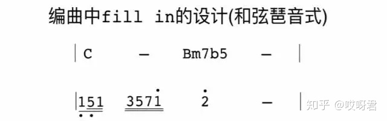

再或者使用**C6**，组成音**1356**，和弦琶音设计为**3561**连接到“2"。这些都是可以自由设计的。

**音阶与和弦琶音式**


[钢琴演奏演示3_腾讯视频v.qq.com](https://link.zhihu.com/?target=https%3A//v.qq.com/x/page/b0769s15n9o.html)


因为C—Bm7b5中间只空一拍，空间是比较小的，所以音阶和琶音结合起来编配时，和弦琶音就只选择C大三和弦135三个音，音阶就用671，所以结合起来就是一个**五连音35671**，然后连接到目标音“2”。


在这里也可以将伴奏编的爵士一点，加入半音**#1**，所以结合起来是一个**六连音3 5 6 7 1 #1**，最后连接到目标音“2”。

#### 流行乐常见套路

理论上，顺阶和弦可以任意连接。但是因为大众不太能接受“新奇”的和弦进行，比较能接受的和弦进行只有常见的几种，因此音乐人容易套用大众喜欢的和弦进行作曲。

想让乐曲各有个性，除了打破和弦套路外，还可以通过：

* 改变旋律、节奏
* 运用不一样的色彩和弦

具体套路

* 卡农和弦进行（Romanessca）

  17654325（C--Em7/B--Am7--G7--Fmaj7--Am7/E--Dm7--G9sus4）
  
  例子：《挥着翅膀的女孩》、《老鼠爱大米》、《手写的从前》《菊花台》（周杰伦）

```abc
T:卡农和弦进行（适合任何调式）
M:4/4
L:1/4
K:C
Q:140
CGAE | FCDG
```
* 4536251（FGEADGC下属-属-主）

  可以和卡农和弦搭配起来，构成“1563+4536251”。例如《后来》的副歌部分

```abc
T:4536251（下属-属-主）
M:4/4
L:1/4
K:C
Q:140
FGEA | DGC z |
```
* 1645、1451（CAFG、CFGC通常作为前缀）

  有种朴实、平静的感觉。常被民谣歌曲使用。例如《成都》（赵雷）

  也可以将1451置换成1251《会呼吸的痛》的主歌部分

```abc
T:1645、1451
M:4/4
L:1/4
K:C
Q:140
CAFG | CFGC |
```
* 1564（CGAF）

  《Someone like you》

  ```abc
  T:1564
  M:4/4
  L:1/4
  K:C
  Q:100
  CGAF
  ```
  
* 6451（AFGC）

  《菊次郎的夏天》

  ```abc
  T:6451
  M:4/4
  L:1/4
  K:C
  Q:100
  AFGC
  ```

* 6415（AFCG）

  《平凡之路》

  常用在电音

  ```abc
  T:6415
  M:4/4
  L:1/4
  K:C
  Q:100
  AFCG
  ```

* 6453（AFGE）

  《燕尾蝶》

  ```abc
  T:6453
  M:4/4
  L:1/4
  K:C
  Q:100
  AFGE
  ```

* 4566（FGAA）

  《红色高跟鞋》

  ```abc
  T:4566
  M:4/4
  L:1/4
  K:C
  Q:100
  FGAA
  ```

* 2516（DGCA）

  《蓝旗袍》

  ```abc
  T:2516
  M:4/4
  L:1/4
  K:C
  Q:100
  DGCA
  ```

  

* 2514736

  在这一条和弦进行中，251几乎贯穿整个和弦进行，在属和弦、次属和弦的不断解决下，推动曲子的发展（因为大量离调和弦的加入，调性变得模糊了）

  用七和弦弹会更有爵士的感觉

  另外，这个和弦进行是四度循环

```abc
T:2514736
M:4/4
L:1/4
K:C
Q:140
D G C F | B E A z |
```
* 1526415

  和弦开头用的是五度循环（1526）

  例子：《最冷一天》的副歌（张国荣）

```abc
T:1526415
M:4/4
L:1/4
K:C
Q:140
CGDA | FDGz |
```
* 15-6343251、13-6343251

* 半音上行

```abc
T:半音上行
M:4/4
L:1/4
K:C
Q:140
A
```
* 半音下行

```abc
T:半音下行
M:4/4
L:1/4
K:C
Q:140
a
```
* 436（FEA）、4321（FEDC）

  比较有R&B感觉

  436也可以理解成小调的651

```abc
T:436、4321
M:4/4
L:1/4
K:C
Q:140
FEA z | FEDC |
```
* C——F——G 古典和声优良的正格进行
* C——G ——F 古典和声的禁止进行，但现代和声却用的很多，非常好听。小虎队《爱》，周杰伦《开 不了口》等的前奏~~~《我是一只鱼》
* C——G——AM——EM——F——C——F——G 来自己欧洲的经典和声啦。《开不了口》《简单爱》《爱一个好难》《约定》《深呼吸》《光辉岁月》
* C——AM——F——G 美国的经典乡村民谣进行。叶蓓《在却难逃》《纯真年代》
* C——AM——DM——G 乡村进行变化。〈爱〉
* C——EM/G——AM——G——F——EM——DM——G 经典根音下行的悲伤歌曲进行。学友的《祝福》等好象大调就这么多吧~~~~~小调还有些感情色彩，象C ——AM——F——G ，又可以变为C——AM——F—FM——G ，用了一个4级小和弦做色彩处理，效果相当好。这个《人鬼情未了》歌曲的结束
* C——AM——F——G ，还可以变为C9——AM9——FMAJ7——G9—G—，也相当有追忆住事的味道~~~如《明天我要嫁给你啦》的前奏，它是F调。但和弦功能和级数是一样的
* C——AM——F——G ，还可以变为C ——AM——F——降B——G ，用了一个降B和弦，为F和G 和弦过渡，典型唯美主义色彩的运用，很好听。齐秦《花葬》，韩红〈家乡〉，周艳泓〈春暖花开》C -F -降B-G 等等


Leading Bass（顺阶低音。极其常见）

顺阶低音，就是顺着音阶下行的低音。156141251？

低音下行的一个套路。

C	G/B	Am	C/G	F	C/E	Dm	G7	C


1. 根据主和弦与属和弦的功能，得出开始、半终止与终止的和弦
2. 带7的和弦有：Em（753）与G（275）。因为除了主和弦，其他和弦不能把和弦中的五音作为低音，因此不能配Em和弦（753），只能配G/B和弦（？？？）
3. 带6的和弦有：Dm（642）、F（164）、Am（316）。因为如果低音正好是和弦的根音，就尽量去配这个和弦。所以只能配Am
4. 带5的和弦有：C（531）、Em（753）、G（275）。虽然在G和弦中，5为根音，但因为它是属和弦有半终止的感觉。又因为C（531）中的5虽然是五音，但因为它是主和弦，所以仍然可以配C/G和弦，也可以配Em/G和弦
5. 带4的和弦有：Dm（642）、F（164）。因为在F和弦中4是根音，所以配F和弦
6. 带3的和弦有：C（531）、Em（753）、Am（316）。因为在Am中3是五音，所以不能配Am和弦。因为在Em和弦中3是根音，所以配Em和弦，也可以配C/E
7. 带2的和弦有：Dm（642）、G（275）。在G和弦中2是五音，所以不能配G和弦，只能配Dm和弦

低音谱上和弦的根音：17654325

主音下方低音谱中音的根音部分是：17654325。其中Gsus4

因为在流行音乐当中，经常在属和弦前面配加一个挂四和弦来加强终止感

```abc
T:Leading Bass
M:4/4
L:1/2
K:C
Q:70
V:1 clef=treble
"C"[DEG] "G/B"[B,DG] | "Am"[G,CG] "C/G"[G,CG] | "F"[G,CG] "C/E"[G,CG] | "Dm7"[A,CF] "Gsus4"[G,C]/2 "G"D/2 |
V:2 clef=bass
[C,G,] [B,,G,] | [A,,E,] [G,,E,] | [F,,C,] [E,,C,] | [D,,D,] [G,,F,] |
```

小调Leading bass

a自然小调音阶：65432176

前后两个6都是Ⅰ级，根据251技巧，在最后一个6前面配Ⅴ级3（6向上纯五度为3）


四度圈套路

#### 251技巧

作用：用来丰富和弦色彩。https://www.sohu.com/a/158084726_789958

结构

* 大调：小七和弦—>属七和弦—>大七和弦。如C大调：Dm（2461）—>G7（5724）—>C（1357）
* 小调：半减七和弦—>属七和弦—>小七和弦。如a小调：Bo（7246）—>E7（3#572）—>Am（6135），如c小调：Do（24b61）—>G7（5724）—>C（1b35b7）。


例子：如遇到Em7和弦接Dm7

满足条件：

* 二者根音相差正好大二度
* Em7是小七和弦，可以作为Ⅱ级和弦
* Dm7是小七和弦，可以作为Ⅰ级和弦。

因此试着加一个Ⅴ级和弦，从而构成251和弦进行，得出Ⅴ级和弦是A7。

但因为这首曲子是C大调，其251和弦分别是：Dm7、G7、C，所以对于刚刚得出其他调上面的Em7、A7、Dm7，需要进行临时转调（离调）

方法：看目标和弦是Ⅴ级和弦，还是Ⅰ级和弦。如果是Ⅴ级，就往前纯四度配一个小七/半减七和弦。如果是Ⅰ级，就往前纯四度配一个属和弦

用251技巧在目标和弦前面配和弦

对于CM7、Am7、FM7、G7

因为CM7是第一个和弦，所以不能在其前面配和弦（目标和弦要么是5级，要么是1级，不能是2级）

Am7是小七和弦，可以作为Ⅰ级或Ⅱ级和弦。但如果把它当做Ⅱ级，则Ⅱ级前没有和弦，没法配和弦。因此只能配Ⅰ级和弦。因此往下移纯四度配一个E7和弦（Ⅴ级）

同理，FM7是大七和弦，只能作为Ⅰ级和弦，往前配一个Ⅴ级C7和弦

G7和弦是属和弦，只能作为Ⅴ级，因此配在前面配一个Ⅱ级和弦Dm7或Do7和弦


在Leading Bass中的运用

C	G/B	Am	C/G	F	C/E	Dm	G7	C

注意：G/B不是属和弦，而是Ⅰ级大三和弦（大三和弦的标记只有一个字母，而属和弦的标记是这个字母加上一个7？？？）。因此在其前面给它配一个Ⅴ级属和弦D7

Am是Ⅰ级小七和弦，所以往前纯四度配一个属七和弦E7

C/E是Ⅰ级大七和弦，继续配一个属七和弦G7

F是Ⅰ级大七和弦，继续配一个属七和弦C7

C/E是Ⅰ级大七和弦，配一个G7和弦

Dm是Ⅰ级小七和弦，配一个A7

最后三个和弦Dm、G7、C本身就是251，所以不用另外配和弦。

补充：升级版用了太多，听着不是很好听，四小节内用一个小节就好了，增加色彩

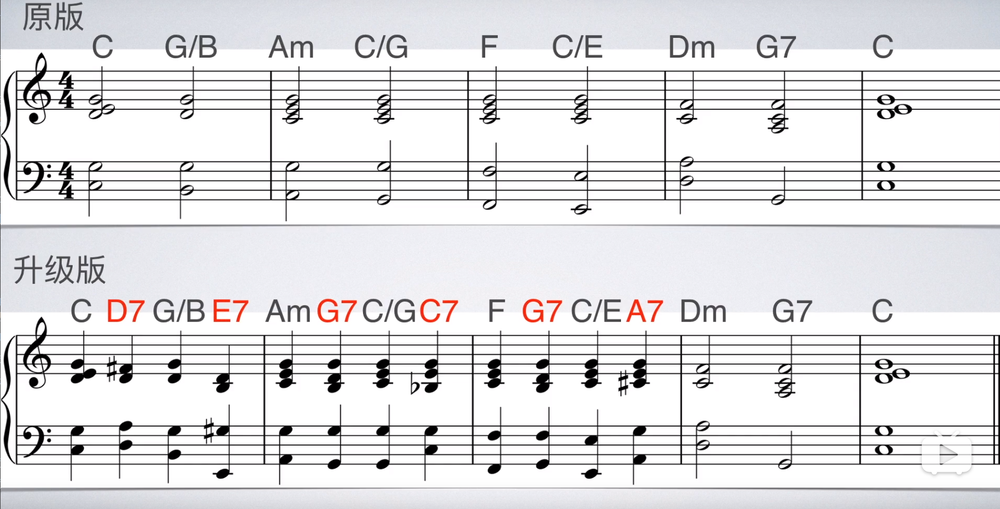

又因为转位和弦不适合做目标和弦，听起来不舒服。去掉转位和弦前面的新增和弦后，得到下图


在四度圈的应用

4536251

F	Bo/F	Em	Am	Dm	G	C	C7

F是第一个音，所以不配和弦

Bo/F是转位和弦，所以也不配

Em、Am、Dm。如果把Dm看作是Ⅰ级，所以Dm前面的和弦需要是属和弦，Am不是属和弦，因此要将Am替换成A7属和弦（6135）。Em即可以保留也可以变成Eo（半减七）

Dm、G、C正好是251的进行，所以不用额外配和弦

C7是C延伸出来的，用来结束落在主音上，也不配

注意：251受旋律的限制。如上例中既可以用Em（3572），也可以用Eo（35b72）。因此如果旋律为7，则应该用Em，而不应该用Eo，否则会出现小二度音程（不和谐）。或者直接改旋律，如应要配Eo，则将旋律改为b7

### 键位


## 织体（Texture）

织体就是旋律与和弦和声的结合。音符与音符之间，横向（同音色）可以构成旋律关系，纵向可以构成和声关系，这整个纵横交错的体系就是织体。

比如说一个流行乐队，主唱负责旋律，贝司负责低音，吉他键盘负责的是织体部分。

## 旋律

旋律：若干乐音经过艺术构思形成的有组织、节奏的序列

旋律线：若将一首歌曲的音符记录在五线谱上，我们能够清晰地看到该曲的旋律线条

组成

* 起始音。一首歌从和声学角度来讲，就是一个由稳定到不稳定，再回到稳定的过程。起始音需要是一个稳定的音。例如突然唱“昨天你写的日记”，听起来就很突然。要从“今天你是否会想起，昨天你写的日记”才不突然。
* 经过音
* 延留音

旋律从哪来？模仿别人的旋律，不存在没人写过的旋律。

注意：音乐不是不受束缚的，而就是靠套路（就像古诗词，合辙押韵、对照工整、起承转合）。这些理论套路不是创作的源泉，却是提升的阶梯。创作的源泉是欲望，是创作的动机，然后再通过理论进行优化。

旋律线是由一系列（相同或不同的音高）的音以特定的高低关系和节奏关系联系起来的一种音的序列。

因为音符的音区越高，听众就越能察觉，而旋律又是一首歌最直观的部分。因此旋律通常在乐曲的音区上方（如位于和弦框架之上）

### 运动形态


### 种类

1. 平进。指旋律的“同向进行”，即“同音反复”，就是相同音高的音符的连续进行。平进属于旋律的“静止”运动，旋律线没有起伏感，但是它的节奏变化相对比较丰富。

   《我是一只小小鸟》（李宗盛词曲）

   

   “说唱”（Rap）属于一种特殊的平进形态。一般情况下，说唱歌曲多以节奏为主体，旋律线起伏较小，因此“同音反复”也就成了“说唱”的重要旋律形态

   说唱歌曲虽然缺乏旋律线，但是它有音高，所以在创作说唱歌曲时，不仅要注意节奏的布局，同时也要注意“平进”旋律的音高选择

   《爷爷泡的茶》（方文山词、周杰伦曲）

   

   此外，随着说唱歌曲的广泛流行，很多作者将“说唱”的素材融入到旋律化的流行歌曲中，即出现了一些旋律线起伏微小，但节奏丰富的流行歌曲。此类歌曲经常配以动感的R&B鼓点，因此它的节奏性一般要大于旋律性

   《欧若拉》（施立词、李天龙曲）

   

   《最后的战役》（方文山词、周杰伦曲）

   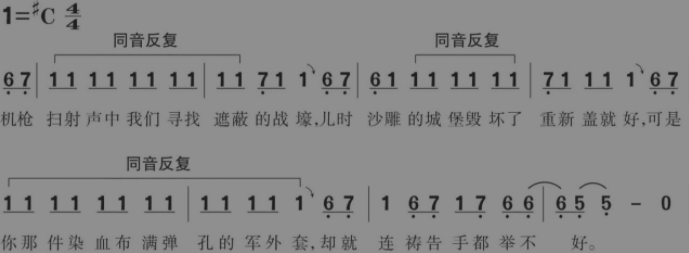

* 上行式。细分为：波浪式上行

  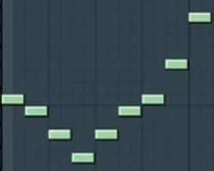

* 水平式

* 下行式。细分为：波浪式下行。旋律持续下行时，通常力度会随着旋律减低（但非绝对）。但如果旋律接近尾声，则力度还可以逐步增强

如说唱一般就是节奏的变化，旋律没变就是水平的。流行歌曲一般三者都有。

如《死了都要爱》的“*死了都要爱*,不淋漓尽致不痛快，感情多深只有这样才足够表白”


上升式常见模式

* 级进：相邻二度音的组合。如123456

  如：孙燕姿的《遇见》：“我遇见谁，会有怎样的对白。我等的人，他在多远的未来。我听见风来自地铁和人海，我排着队，拿着爱的号码牌”

  

  

* 跳进：135

## 倾向性（Tendency）

音符与音符之间的倾向性。

重要性：音乐的势能就是倾向性（就是地势可以让水流向不同的方向）

倾向性最高的音程关系就是小二度。两个音符离的越远，倾向性就越低。

单音旋律的倾向性很弱且旋律单调。而和弦的倾向性更强，这是因为和弦之间的各个音之间也具备倾向性，也是旋律更加丰富。如164的F和弦和753的Em和弦的之间的倾向性由带有1和7，6和5，4和3组合而成，更加丰富。

如图：上行旋律带有上行的倾向性


#### 就近解决与跳进解决

就近解决：为了让和弦平稳地进行，可以让各声部的进行不超过三度（两个和弦同一个声部之间相距不超过三度）。和弦与和弦之间的音以三度或者三度以内级进。

跳进解决：如果超过三度，那和弦就是不平稳进行


低音声部可以跳进，其他声部尽量保持平稳进行。
如果有共同音，就保持共同音。如果没有共同音，就进行到3°以内的其他音

错误：所有声部同向进行（下图高音谱的和弦走向和低音谱的音走向一致）


错误：连续出现两个纯五度（或纯八度），否则会让两个声部听起来像一样的。如下图中：15、63都是纯五度，后面的和弦同理


加了七音和九音？（主音因为低音谱的根音没变，所以和弦的性质也没变？）


踏板的时机：在演奏和弦前马上松踏板，演奏和弦后马上踩踏板。这个就松太早，而踩得又太快（还在演奏和弦的时候就踩了）

钢琴生表示应该等弹到下一个和弦时再松然后再立刻踩，这样音乐不会断？？


## 稳定性

稳定性高的音具有结束感，相当于文章的逗号与句号。表现形式

* 延留音。
* 稳定性高的音。如果乐曲停留在7，听起来就好像乐句没写完，没有句号。

稳定性从高到低排序：

大调中：1 3 5 6 2 4 7

```abc
X:1
T:大调
M:4/4
L:1/4
K:C
CEGA | D F B
```


小调中：6 1 3 2 4 7 5

其中，大调的1 3 5 6具有起始感。只有1具有结束感。小调的6 1 3 2具有起始感。只有6具有结束感

注意：大调中的1 3 5正好构成C和弦，小调中的6 1 3正好构成Am和弦

乐曲通常会以稳定性高的音开头与结尾，因此： 

大调的主旋律通常开始/结束到1或C和弦

小调的主旋律通常开始/结束到6或Am和弦

## 终止式

#### 完全终止

给听众句号的感觉，情绪结束。常用于段落结束的最后一句，或者整首歌的最后一句。如C大调音乐中，当旋律延留到了1，并且给一个主和弦C，即构成完全终止。

构成完全终止：


由于旋律还在进行，所以并没有构成完全终止


感叹结束的感觉可以通过将终止的1音升高8度。下图旋律中2与高音1仍具有较强的连续性，因为听众可以脑补出1音。


#### 阻碍终止

当旋律延留到1，用Am和弦形成阻碍终止。

#### 半终止

如果旋律不停留在1上，而停留在234567，则都只会有逗号的感觉，是情绪的转折。

需要使用属和弦（G和弦、Em和弦）

#### 不完全终止

当旋律延留到3，并且用一个C和弦就构成了不完全终止。是分号排比的感觉。将情感递进与升华的作用。

注意下属和弦（F和弦），即没有逗号也没有句号的感觉。只能用在旋律开始与经过，不能用在旋律延留的时候

#### 大七和弦终止法

暂且只能用于大调中

原因：因为总是用主和弦终止，乐曲会显得无聊。

在C自然大调中主和弦是CM7大七和弦，因此主和弦就是大七和弦，大七和弦就是主和弦，大七和弦也能用于开始或终止。

开始功能：如图C自然大调中的C和弦与F和弦（或者bDM7）都是大七和弦（尽管F和弦是下属和弦），而其他和弦就都不能用于开始

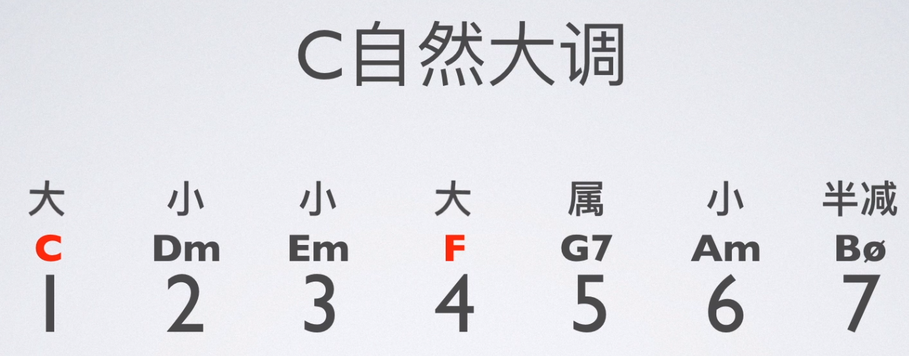

如Leading Bass是以C开头，四度圈是以F（下属和弦）开头，它们都是大七和弦

终止功能：

通常属和弦后面接主和弦（如G7到CM7），但其实属和弦后面接所有大七和弦都很顺畅，因此还可以尝试接在属和弦后面接其他大七和弦。
只是实际创作中要注意旋律与和弦的配合。旋律通常结束在主音1上，如何配上和弦BM7（7 #2 #4 #6），因为1是和弦外音，所以搭配起来不好听。需要让和弦尽可能配上旋律主音1

第二种：如G7属和弦后要终止。则可以先找到一个包含旋律音的大七和弦，如旋律是1，则可以找到bA（b6 b7 1 2 b3 4 5），这是利底亚音阶。可以立即结束，也可以平行大二度再接bB大七和弦、C大七和弦，构成降六降七终止法。

也可以配bD大七和弦（b2 b3 4 5 b6 b7 1），平行大二度接bE、F

也可以配bE大七和弦（b3 4 5 6 b7 1 2），平行大二度接F、G

#### 降六降七终止法

暂且只能用于大调中

在原本的G7和弦—>C和弦之间，添加两个和弦bA、bB


#### 六级终止法（阻碍终止？）

暂且只能用于大调中

在原本的G7和弦—>C和弦之间，添加一个和弦Am


接上


#### 利底亚终止式（Lydian）

暂且只能用于大调中

让和声色彩更丰富、更时尚，可以在C和弦上演奏利底亚音阶（由原来的C自然大调1234567，变为123#4567）

在C

### 

## 评价音乐好坏的常见标准

* 织体够不够丰富。因此要求和弦要丰富，以及往后的倾向性够不够。

# 作曲法

织体由简单到复杂：https://www.youtube.com/watch?v=m6buIdQacoM

歌曲写作的组成：旋律、和声、曲式、歌词

和声写作的组成：和弦、调式、节奏、歌词、旋律

#### 步骤

1. 律动创作
2. 选择和弦

## 律动创作

律动的四个方面：拍子、风格、节奏强度、节奏动机

律动的重要性：可以在绝大多数耳熟能详的流行金曲中发现律动。律动与旋律、和声一样重要，特别是在诸如乡土布鲁斯（Funk）（是一种节奏性比较强，具有蓝调色彩的音乐形式）这样风格的音乐中尤为重要

学习方法：重新编排自己所熟知的流行金曲中的律动，是开始学习作曲的最好方法之一。编排练习要使用与流行金曲中相同的律动，但要变换和弦

律动示例（注意律动的中等速度和摇滚曲风）

```abc
T:律动一
M:4/4
L:1/4
K:C
B4 | B B B B | B2 B2 | B4 |
```

```abc
T:律动二
M:4/4
L:1/8
K:C
BBBB BBBB | B2 BB z4 | BBBB BBBB | B2 BB z4 |
```

```abc
T:律动三
M:4/4
L:1/16
K:C
Q:100
BBBB z4 z2 BB BB z2 | BBBB z4 z2 BB BB z2 | BBBB z4 z2 BB BB z2 | BBBB z4 z2 BB BB z2 |
```

另外，请注意单个的和弦是如何在不同的律动中发展出多种不同的动机的。 当你进一步学习和弦时，一定要将它们在各种不同类型的律动中进行尝试。

#### 练习方法

* 通过结合两首不同歌曲的和弦进行和节奏动机，先来创作一段新的律动。思考一下这段律动要表达怎样的感情。
* 然后再根据和弦进行，创作出你自己的旋律动机以及适合旋律的歌词。思考一下这段的旋律与律动的结合体，要表达怎样的感情，以及这首歌曲将要表达怎样的感情。

### 发展律动

当为歌曲选好了律动（速度、风格、节奏强度以及节奏动机）后，可以运用各种不同的方法将其发展成歌曲段落（主歌、副歌、桥段等）

#### 方法

绝大多数流行金曲都是通过以下三种方式中的一种，将律动发展成为歌曲段落的

* 完全重复。律动的节奏动机完全重复

  ```abc
  T:完全重复
  M:4/4
  L:1/8
  K:C
  Q:140
  B8 | B2 B2 B2 B2 | B4 B4 | B8 |
  B8 | B2 B2 B2 B2 | B4 B4 | B8 |
  ```

* 变化重复。节奏动机的某些部分发生变化后的再重复

  ```abc
  T:变化重复（12小节为动机，34为变化）
  M:4/4
  L:1/8
  K:C
  Q:140
  BBBB BBBB | B2 BB z4 | BBBB BBBB | BB z2 z4 |
  BBBB BBBB | B2 BB z4 | BBBB BBBB | BB z2 z4 |
  ```

* 增加动机。引入一种新的动机，或者与原先的动机相结合，或者二者交替出现

  ```abc
  T:增加动机（1小节为动机Ⅰ，2为变化为动机Ⅱ）
  M:4/4
  L:1/16
  K:C
  Q:100
  BBBB BBBB z4 z2 BB BB z2 | B2B2B2B2 B2BB z4 |
  BBBB BBBB z4 z2 BB BB z2 | B2B2B2B2 B2BB z4 |
  BBBB BBBB z4 z2 BB BB z2 | B2B2B2B2 B2BB z4 |
  BBBB BBBB z4 z2 BB BB z2 | B2B2B2B2 B2BB z4 |
  ```

  

```abc
X:1
T:大鱼 A段
M:4/4
L:1/8
K:C
A,C CD DE EA | G3 E D2 | A,C CD DEE2 | A,2 B,2 |

```


### 基本准则

为旋律配和弦，或者在和弦上写旋律时，如果某一小节的旋律偏重于某个和弦，那么就用这个和弦。

判断“偏重”的标准：

1. 弦内音的出现频率
2. 是否位于小节中的强音位置
3. 看是否为延留音

比如：某个小节中有：1	2	3 —，1一拍，2一拍，3两拍。因为1和3都是C和弦的弦内音，且2出现的频率低 + 44拍中，一三拍为强拍 + 3是延留音。所以可以给这个小节一个C和弦或者Am和弦

### 和弦先行作曲法

先设定好一个和弦套路（也叫做和弦框架。和弦先后弹响的一个顺序），再在这个和弦套路上进行旋律写作。

如先写好：C-Am-F-G这四个和弦。

重要性：由于和弦框架是音乐的推动力，旋律怎么写都不会难听。

例子：《月亮代表我的心》

八个和弦：C---	Em---	F---	G---	C---	Am---	Dm- G-	C---

### 和弦配置规则

* 每两拍或四拍配置一个和弦。具体几拍，要根据旋律走向、歌曲速度、个人审美
* 和弦中的音，要包含旋律中的音（并尽可能地多包含）。否则，就会冲突、刺耳
* 优先考虑长音和重要位置（强拍位置）的音

节奏型

* 柱式结构：把所有和弦的弦内音同时弹响

  

* 分解形：把和弦的构成音先后弹响

  

* 半柱式：同时有柱式与分解的感觉。

  

如果旋律和和弦混在一起，会造成条理不清晰和听觉混乱

解决方法：

* 升高或降低旋律/和弦一个八度
* 换乐器

如图：上方红色部分是旋律，下方是和弦。


### 方法二

1.	把和弦叠高到同一家族的十三和弦
2.	把这十三和弦中全部的音放到一个八度内、集合成一个音阶
3.	用那个音阶来写旋律

例子：如需要在C和弦（CEG）上写旋律，则可得到Cmaj13（CEGB DFA），并放到一个八度内（CDEFGAB），因此在这个八度内演奏旋律非常安全

### 旋律先行作曲法

先写旋律，再配上和弦。这作曲法不适合初学者，初学者很容易写跑偏，因为初学者把握不住旋律的倾向性，

### 横向规则与纵向规则

1. 在声部写作中很容易忽视横向线条，导致声部之间关系平淡，紧密度不够，写作上显得比较机械，缺乏音乐性

#### 需要避免的

1. 从音程谐和度上看
   * 增四度中的三全音效果会直接把音乐带向德彪西的风格。在四部和声阶段，这样构成的旋律会显得怪异。与增四度相对应的减五度，在某些时候能获得比较好的音乐效果，但使用时要小心
   * 大七度与对应的小九度，都是非常不协和的音程，在这两个音程上构成的旋律都会有比较独特的色彩，但这在四部和声阶段并不需要
2. 从写作形式上看
   * 反复音，颤音式的旋律在音乐效果上都不太好

## 旋律模板

灵感其实是大脑从脑海中的旋律模板选出来的一段旋律（类似想种庄稼时等的自然雨）。

而通过技巧可以主动地从脑海之中找到旋律模板（类似人工降雨）

练习方法：找喜欢歌曲的简谱（有旋律），吉他谱有和弦。在这个基础上进行二次创作。但这是术不是道。是练习方法，而不应该是真正的作曲方式。

对应的和弦编配没有标准答案，只有参考答案

## 模仿步骤

1. 找到原曲乐谱，原曲的乐谱中一定要有拍号、速度与主旋律。

   ```abc
   X:1
   T:天行九歌 A段
   M:4/4
   L:1/8
   Q:80
   K:C
   A,E ED E2 DC | B,C B,G, E,4 | A,C CB, C2 B,A, | B,C DG E4 |
   A,E ED E2 DC | B,C DB, G2 E,G, | A,2 EA, A,2 G,2 | A,8
   ```

2. 变为节奏谱。把原曲的旋律全部变为1，这样方便初学者识谱，每小节使用的节奏型与动机也更加清楚

   ```abc
   X:1
   T:天行九歌 A段
   M:4/4
   L:1/8
   Q:80
   K:C
   dd dd d2 dd | dd dd d4 | dd dd d2 dd | dd dd d4 |
   dd dd d2 dd | dd dd d2 dd | d2 dd d2 d2 | d8
   ```

3. 分析原曲节奏动机。歌曲通常都是八小节为一乐段，以两小节为一组乐句，原曲使用了三个动机来创作（AABC）。

4. 改编动机。使用现成的成品来进行改编，只需要改变原曲一点点，就会有不一样的效果。

   例子：把A动机的第二拍变为了四分音符，把B动机的第三拍变为了两个八分音符，把C动机的第三拍与第四拍变为了一个二分音符，这样简单的一个改变，就变为了自己创作的节奏动机

   ```abc
   X:1
   T:改编
   M:4/4
   L:1/8
   Q:80
   K:C
   dd dd d2 dd | dd dd d4 | dd dd d2 dd | dd dd d4 |
   dd dd dd dd | dd dd d2 dd | d2 dd d4 | d8
   ```

   5. 重新设定乐曲速度

      大部分的古风、中国风的歌曲速度都是设定在60~90拍，用这样的速度写出的歌曲非常有韵律，更能体现古风、中国风唯美的曲风

   
   
## 模进（Sequence）

含义：以不同的音高为起点，重复一个乐句或动机

种类

* 严格模进（real sequence）：模进时完全按照动机的音程关系。

  下例中，第一小节是动机，其余三小节是严格模进。音与音之间的关系都是大二度

  ```abc
  T:严格模进
  M:4/4
  L:1/8
  Q:80
  K:C
  C D E z | D E ^F z | E ^F ^G z | A B ^c z |
  ```

  

* 调性模进（tonic sequence）：模进时适用那个调原有的音，不考虑音程关系是否改变

  下例中，第一小节是动机，其余三小节是严格模进。动机中的音与音之间的关系是大二度，模进中的音与音之间的关系分别是大二度、小二度

  ```abc
  T:调性模进
  M:4/4
  L:1/8
  Q:80
  K:C
  C D E z | D E F z | E F G z | A B c z |
  ```

  

|                    | 同                 | 异                                       |
| ------------------ | ------------------ | ---------------------------------------- |
| 反复（Repetition） | 相同的旋律（动机） | 在同一声部相继出现                       |
| 模进（Sequence）   | 相同的旋律（动机） | 在同一声部相继出现，而音高的位置有所移位 |
| 模仿（Imitation）  | 相同的旋律（动机） | 在不同声部相继出现                       |
| 卡农（Canon）      | 相同的旋律（动机） | 在不同声部严格地、连续地模仿对位         |

   截图：

# 曲式（Form）

https://zh.wikipedia.org/wiki/Template:%E6%9B%B2%E5%BC%8F%E5%AD%A6

曲式指的是乐曲的结构形式。研究音乐作品结构规律的学科叫做“曲式学” 

## 音乐的基本表现要素

旋律、节奏、节拍、调式、调性、和声、速度、力度、音区、音色、织体等

## 曲式种类

一部曲式

再现单二部曲式

并列单二部曲式

再现单三部曲式

并列单三部曲式

复三部曲式

五部三部曲式

回旋曲式

变奏曲式

奏鸣曲式

回旋奏鸣曲式

套曲曲式

乐段的结构及一部曲式：乐段通常由两个乐句或四个乐句构成。由两个各有四小节（或八小节）的乐句组成的"乐段"（专称为"方整性的乐段"）在器乐曲中最为常见。其特点是平衡、均称感强。一首乐曲仅由一个乐段构成的称“一部曲式”。

## 音乐陈述的基础结构

### 半乐汇

### 乐汇

一个仅次于乐节的结构单位。

### 乐节

一个仅次于乐句的结构单位。

### 乐句

一个仅次于乐段的结构单位。

一般识别乐句的四个主要依据：

* 有适当的长度
* 在适当的长度基础上，旋律声部出现明显的呼吸点
* 在适当的长度基础上，和声配置及和声节奏出现明显的呼吸点
* 在适当的长度基础上，音乐素材写法的突然转折

### 乐段

乐段的基本概念：一个完整或相对完整的 乐思单位。

一般识别乐段的三个主要依据： 

* 有适当的长度
* 有全封闭的终止
* 有两个以上的分句

#### 类型

一、由两乐句构成的乐段

* 平行乐段：一种由后一乐句重复或变化重复前一乐句开始的旋律素材构成的乐段称为平行乐段。 (a+a1)
* 上下句乐段：一种后一乐句不采取重复或变化重复前一乐句开始的旋律素材构成的乐段称为上下句乐段。 (a+b) 

二、由四乐句构成的乐段

* a+b+c+d
* a+b+c+c1
* a+a1+b+b1
* a+a1+b+c
* a+b+c+a

三、非方整性乐段：乐段内每一乐句不是以 4 或 8小节的倍增数字关系构成的乐句组成的乐段称为非方整性乐段。 例如：

* a + a (非方整性平行乐段 )

* a + b (非方整性上下句乐段 )

* 3 + 3、5 + 5、6 + 6、7 + 7

  注意要点：方整性结构的乐段内各乐句相互一 定是形成对称的结构，而各乐句相互形成对称的结构不一定是方整性乐段。

四、由奇数和多乐句构成的乐段：大多数乐段内乐句组成的数量通常表现 为复数的结构组合特征，但仍可见到由奇 数乐句组合构成的乐段。例如： 

* 一乐句乐段 a
* 三乐句乐段 a+a1+a2、a+b+b1、a+b+c

由四个以上的乐句组成的乐段一般不 再用乐句数量的多少来进行乐段分类，统 称为多乐句乐段。

### 复乐段

### 乐章

### 乐曲

## 音乐陈述的衍生结构

连句结构、模进结构、自由结构等

## 主题材料发展手法

原始陈述、重复、再现、迭奏、变奏、模进、裁截、对比

## 乐曲的段落种类

引子、尾声、呈示部、展开部、再现部、三声中部、主部、副部、连接部、结束部、对比部、插部等

## 流行歌的段落种类

比方说同一首歌我可以主歌副歌各一次就结束，也可以主歌两次副歌唱三次。

严格的说，每首音乐都有自己的曲式结构。曲式课学习的内容是，通过大量作品分析得到一些比较具有普适性的规律，并且加以总结。所以说，不可能列出所有的曲式结构。

歌曲如同文章的字、句、段、章一样，也有相应的音、乐句、乐段、乐章。音乐中每个作品都要有头有尾，从发动到高涨，从高涨到消退，这样的情绪发展过程才能构成一个统一完整的音乐整体，与一般人的认知习惯和欣赏方式相吻合。因此，给歌曲分段落就成为分析歌曲结构组成的一个重要方式。

流行音乐歌曲的段落结构一般有两种，一种是只有主歌和副歌两段的歌曲（A段、B段），叫二部曲式。 一种是在二部曲式基础上再加上一段，即主歌和副歌之间再加上一个用于连接的段落，这三段分别叫做A、B、C段，这样的段落结构叫做三部曲式。

划分歌曲是二部曲式还是三部曲式的方法：在一首完整的歌曲中，相同的段落的共同点是

* 拥有相同数目的乐句
* 每个乐句的旋律基本一致

大家都知道，歌曲的几个乐段总要在完整的呈现一遍以后，再反复出现1-2次。一般二或三部曲式，A段在第二遍反复出现的时候，歌词会与第一编的歌词完全不一样。在三部曲式中，B段反复的前后段落歌词相同或不同的机率各占50%。副歌反复的歌词往往都是一样的。

## 国内的曲式教材中的常见曲式

一部曲式; 
单二部曲式; 
单三部曲式(可分为有再现的和没有再现的); 
复二部曲式;
复三部曲式(包括一种介于单三部式与复三部式之间的中间型曲式);
回旋曲式;
变奏曲式;
奏鸣曲式;
回旋奏鸣曲式;
组曲曲式(包括古组曲，新型组曲，);
奏鸣-交响曲式;
大型声乐器乐套曲(主要包括康塔塔与清唱剧);
自由曲式;

## 流行歌曲里面可能会遇到的歌曲段落

歌曲控制在5分钟以内，4分钟左右

流行歌曲的曲式相对较为短小，二段体（两个段落）和三段体（三个段落）结构为主，也有以一个段落或三个以上段落构成的“一段体”和“多段体”结构。

前奏——>主歌——>导歌——>副歌——>间奏——>主歌——>导歌——>副歌——>桥段——>副歌——>尾奏

前奏——>主歌（A1+A2）——>副歌（B1+B2，16小节，16小节偏长）——>间奏1（4小节）——>主歌（A2）——>副歌（B1+B2）——>间奏2（8小节）——>副歌（B1+B2）+尾奏（4/8小节）

曲式是与和声、配器有很大关系的学问。你编编流行歌，那它的曲式可以很简单，都有现成的套路可以参考。但你如果无视它，你会发现你对音乐的整体把握能力很有限，你的“大局观”不行。曲式对音乐整体的情绪发展、段落的平衡、听众对音乐的记忆有着重大影响，你没有足够的理解，会导致你编出来的东西缺乏条理，很错乱。如同打仗得讲究阵型，你没有阵型，有力使不出。曲式也与动机、乐句的发展有着重大的关系，当你觉得下一段没有什么思路的时候，启发的灵感往往就在曲式学当中产生。

### 前奏

几乎所有的歌都会有的“前奏”，也就是歌词还没出现之前的部分，这一段通常会是单纯的乐器伴奏，作用是作为一首歌的开始，前奏的英文是“Intro”，或是“Introduction”，有“介绍、引言”的意思。

有些歌曲可能是没有前奏的，比方说邓紫棋的《泡沫》，直接起来就人声进入主歌。

有些歌可能前奏完之后是先进副歌的，比方说王力宏的《飘向远方》。

### 主歌（Verse）

主歌的英文是“Verse”，有“诗句、押韵的文章段落”的意思。所以看回英文你就会发现它其实完全没有“主”的意思，翻译成“主歌”的原因完全就是因为前文所说的“复歌”误翻译成“副歌”

### 导歌（Pre Chorus）

在“主歌”之后，“副歌”之前有一个“导歌”。

作用是为了在主歌之后，稍微有个转折或是情绪的堆叠，好让音乐可以更顺畅地进入副歌。

不过这段的叫法在很多情况下都会直接被忽略掉，或直接归为主歌部分。

如《说散就散》中的“**没办法，好可怕。那个我，不像话。一直奋不顾身，是我太傻**”。

### 副歌（Chorus）

副歌通常是一首歌里面会**重复出现**，，在歌曲中**通常**位于情感上的高潮部分，而且最被大家记得的段落，去KTV可能大家也只会唱这段。在歌曲中**通常**位于情感上的高潮部分。

副歌的英文是“Chorus”，原意是“合唱团、歌舞团”的意思，也有“异口同声”的意思。在英文里这个段落会叫做“Chorus”，是因为早起教会的音乐或诗文，前面的段落可能会是一个人独唱或是朗诵，后面则会是大家一起唱一起念的段落，就像是合唱团合唱一样，通常这样的段落会是一首歌里面最核心的段落，所以这样的段落就叫做“Chorus”。

因此中文翻译的**“副”**歌应该是一个以讹传讹、三人成虎的结果，按照英文的意思“Chorus”应该翻译成**“复”**歌，也就是很多人一起唱的段落。

如：袁娅维的《说散就散》。里面最容易认出来的段落就是副歌，也就是歌词**“说不上爱别说谎，就一点喜欢。说不上恨别纠缠，别装作感叹。就当作我太麻烦，不停让自己受伤，我告诉我自己，感情就是这样，怎么一不小心太疯狂。”**的部分

### 间奏（Inter）

接着在副歌结束之后有一个“间奏”。间奏通常也会是单纯的乐器伴奏，作用是让前一大段跟后面的段落有个区隔的段落，或是让音乐稍微再平复一些。间奏的英文是“Inter”或是“Interlude”，“Inter”是“在...之间”的意思。

### 桥段（Bridge）

在间奏之后又再重复了一次主歌、导歌和副歌，而在第二次重复的副歌之后有一个“桥段”。

例如：就是**“别后悔，就算错过。在以后，你少不免想起我，还算不错。当我不在你会不会难过，你够不够我这样洒脱。”**

桥段的旋律通常跟前面出现过的旋律会不一样，它的作用通常是让整个音乐又有再一次的转折。“桥段”的英文是“Bridge”，“Bridge”有“桥梁、过渡”的意思。

有些歌的桥段可能是在第一次副歌之后就出现的，比方说周汤豪的《帅到分手》

### 尾奏（Outro）

在桥段之后又回到了副歌，在副歌之后就剩下最后一小段——尾奏。通常尾奏也会是纯乐器的伴奏，目的是要为这首歌做结尾，尾奏的英文是“Outro”，里面的“Out”就是“出去、在外面”的意思。

## 曲式模板

* 前奏—>A—>B—>C—>间奏—>A—>B—>C—>C—>尾奏
* 前奏—>A—>B—>A—>B—>C—>C—>间奏—>B—>C—>C—>尾奏

## 分析步骤

* 确定整体结构，明确主调调性
* 画出乐句轮廓，辨明乐段终止
* 勾勒细节形态，观察调性变化
* 寻求对比统一，善于寻根究源

# 配器

流行乐队的四大件乐器吉他,贝斯,鼓和键盘。


对于编写Bass&Drum电子舞曲，那么不需要对传统的曲式、配器甚至和声懂太多，掌握好节奏就行。但如果想编到现在商业流行歌的程度，偶尔带点弦乐或者四大件以外乐器那种，那么就不能只学和声。

### 配器的四个基本层次

一首完整的器乐合奏（包括伴奏音乐）应该包括以下几个最基本的织体层次：

1. 旋律层。这是每一首乐曲最先被别人听到的层次，他是全曲的灵魂所在

   特点：旋律不同于其他层次，具有可歌唱性、亲切而鲜明

   适用乐器：各种乐音乐器均可用于旋律的演奏

   这个层次还可扩展出副旋律层，第二副旋律等等.请听这个例子[(例1)](http://www.midifan.com/image/technology/li1.mid),大家可以听到的就是主旋律,接着我们单独听一下主旋律和副旋律,[(例2主旋律)](http://www.midifan.com/image/technology/li2.mid) [(例3副旋律)](http://www.midifan.com/image/technology/li3.mid)。

2. 和声节奏层。这是用某些乐器组或和声性乐器以恰当的和弦进行的方式，按音乐的律动规律衬托旋律的层次。和声的律动节奏型十分灵活，有柱式和弦[(例4)](http://www.midifan.com/image/technology/li4.mid)、半分解和弦[(例5)](http://www.midifan.com/image/technology/li5.mid)、分解和弦[(例6)](http://www.midifan.com/image/technology/li6.mid)、综合型[(例7)](http://www.midifan.com/image/technology/li7.mid)等等（以上例子均用钢琴作和声乐器演奏），这个层次既是音乐节拍律动的交待（节奏性的和声），又是调式调性的交待,同时还用来衬托音乐个性化的背景（背景性的和声）。请听[(例8弦乐和声背景)](http://www.midifan.com/image/technology/li8.mid) ;[(例9铜管乐舞蹈性节奏)](http://www.midifan.com/image/technology/li9.mid) ;[(例10竖琴的分解和弦背景)](http://www.midifan.com/technology/li10.mid)。

   类别

   * 节奏性的和声。节奏性的和声是器乐合奏中的一个层次，并不是某种乐器或某种伴奏型。

     5种织体类型

     * 柱式织体[（点击听）](http://www.midifan.com/image/tech/music/l1.rmi)
     * 半分解织体[（点击听）](http://www.midifan.com/image/tech/music/l2.rmi)
     * 分解织体[（点击听）](http://www.midifan.com/image/tech/music/l3.rmi)
     * 综合织体[（点击听）](http://www.midifan.com/image/tech/music/l4.rmi)  
     * 包含了以上四种的复式织体

     

     柱式和声主要在乐曲的配器手法简单的情况下使用，比如马丽安的without you一开头就是用的例1这种织体，简洁而带有淡淡的忧伤感

     在乐曲的发展性段落中常用分解或综合织体，因为流动感更强

     ### 实践原则

     原则：不要用很多乐器演奏同样的织体，各声部和声的丰满度要控制得当，不可堆砌，能省就省，不见得每个声部都要把和弦的所有音演奏出来。

     不堆砌的方法：可以在钢琴上演奏根音和五音，吉他声部出现三音，但不要都堆满。总的原则是三音、七音、九音和色彩音尽可能少出现（但不能没有），根音和五音可以多重复。

     使和声丰满的方法：有可能要留些空间给背景和声。节奏性和声声部的音量视不同段落给予调整，在声部较多时让他听不太清就好

   * 背景性和声。

     作用：适当的使用背景和声会让音乐变得清新动人，请听这段音乐[（例5）](http://www.midifan.com/image/tech/music/l5.rmi)弦乐背景和声刚出来时还是单音，渐渐的随音乐的推动发展成和弦

     误区：

     * 在乐曲一开头弦乐和声就铺天盖地的出来，除非要营造这样的戏剧性效果，否则到了发展段将无计可施。
     * 关于电吉他drive的效果背景，你可能在一个通道里使用drive的solo和背景和声，这样背景会随着solo变成前景，把主旋律淹没得一蹋糊涂。解放办法：大可把背景和声放到另一个通道中，这样好调节它的gain或volume，而且千万不要用密集的和弦，一般drive顶多用纯五度的双音走背景，或用单音也无防。  

3. 低音层 与和声节奏层一样低音层也是乐曲中非常重要的角色,没有好的低音的音乐是不完整的和单调的.主要的低音乐器除了传统的如Bass,Tuba,Basson等,在各种音源中还有许多合成音色,这些音色无论作和声节奏也好还是作低音也好都有传统乐器所不及的地方,这有待同志们去开发利用.但我也劝大家,低音层在以往种被人们忽视,仔细听一下,没有哪首好的乐曲不是低音设计得非常细致的.他既要体现每一个和弦的功能,同时低音的连接本身就是一段好听的旋律.,在作曲的过程当中我们还要注重低音的连贯性和旋律性.请对比一下:[(例11只有和弦根音的低音)](http://www.midifan.com/image/technology/li11.mid); [(例12带有节奏感的低音)](http://www.midifan.com/technology/li12.mid); [(例13旋律性更强的低音)](http://www.midifan.com/image/technology/li13.mid).可以很容易听出来最后一种低音的旋律,音乐更富流动感。

4. 噪音层 这是由一些非乐音成分组成的,如打击月,风声,鸟鸣声等,他们虽然在乐曲中不是主导地位,但对于音乐风格的展现和个性的表达起到了不可抹煞的作用.但也应该注意到,电子乐器和音源的使用使得噪音的运用变得空前的方便和简单,固不要忍不住就乱用,用得恰当可以使音乐陈述更加有力,用得不当只会适得其反。

### 十个基本准则

* 音色无好坏，运用有优劣。慎重选择演奏主要旋律的乐器音色，有其是主题的初次陈述，做到风格、性格、情绪或形象恰如其分，非他莫属。
* 音色保留有利于特定音色出现时的新鲜感。所谓音色保留，指当你需要一个重要的音色陈述一个重要的旋律片断时，其前面的配器应尽可能少用或不用该音色的乐器。如休止几小节或一个小段落，即故意“藏匿”一会，再露面时，常有“容光焕发“的效果。
* 音区保留是突出旋律的有效方法。所谓音区保留，指当主要旋律声部处于低音区或中音区时，要给他留出不受干扰的活动空间，其他织体因素最好不要在此音区出入。
* 和声节奏宜宽不宜紧。乐队曲中和声节奏的通常以宽为主，效果会更好些。比如一个乐句，或配一个和弦，或配两个和弦，切忌和弦变换的频率过快，以致和声音响混乱。
* “上秘下疏中不空”是和弦排列的基本原则。要注意低音区用密集的排列、中音区空洞无声部。特别是在配置音区分布较宽的全洲和弦时，遵循上秘下疏中不空的原则，才可获得均衡的有良好共鸣的音响效果。
* 重视“乐队踏板音”的使用。当音乐织体中和声音型程分解和弦形态并由多件乐器分别演奏时，若选择音色融合性较强的乐器以长音的形式予以支持，可避免乐队音响的干涩。这种做法有如钢琴演奏时延音踏板的效果。
* 乐队织体的清晰依赖各要素之间的对比。注意把握织体内部旋律与其他因素（如伴奏、陪衬等）之间在音色、音区、力度、形态等方面的对比。有对比才易发挥不同要素各自的功能，取得相得益彰的效果。要素之间缺乏对比的织体，其音响很可能是混成一团的。
* 乐队音响的涨落要与乐器的进入和退出联系起来。当需要乐队音响逐步增长时，应随着乐器的渐次进入，使音区不断扩张、织体逐步加厚反之，当需要乐队音响逐步消 退时，应使乐器渐次退出，织体逐步变淡、变薄、稀疏。那种仅仅依赖力度符号的改变依赖演奏上强弱变化来获得乐队音响涨落的做法，往往是徒劳的。
* 慎用齐奏和全奏。总谱不可写得太满注意“留白”。这是“保护”各种音色鲜明个性的最好办法。配器中运用不同的乐器，有如绘画中使用不同的颜色。红、黄、蓝 三原色，单独使用，对比鲜明。红黄混合成橙色，黄蓝混合成绿色，也很有特点。但如果不分青红皂白，将所有颜色混合在一起，即成为灰色。同理，乐队中的乐器音色各异，齐奏全奏过多，总谱写得太满，甚至所有乐器从头到尾不间断地使用，给人的感觉是灰调子，无变化，无个性，缺乏表现力。
* 力求每一个声部都生动流畅有趣味。不论主旋律声部、副旋律声部、和声低音以及和声内声部都应力求生动流畅有趣味，千万避免某一声部长时间无变化的枯燥乏味的写法

使用MIDI写作时，要遵循现实乐器的特点（如音域（旋律音域、伴奏音域）、技法、音色特点）

## 钢琴

### 钢琴伴奏织体的基本形态

柱式和弦：同时刻演奏一个和弦中所有的音。柱式和弦自身没有旋律，一般用于给歌手伴奏


分解和弦：依次演奏一个和弦中所有的音。一般右手演奏旋律（下图高音谱部分），左手演奏伴奏（下图低音谱部分）


半分解和弦：即有柱式和弦，又有分解和弦


## 管弦乐团的四大乐器

### 弦（Strings）

小提琴（violin）

中提琴（viola）

大提琴（cello）

低音提琴（double bass）

### 木管（Woodwinds）

长笛（flute）

双簧管（oboe）

单簧管（竖笛，clarinet）

低音管（巴松管，bassoon）

### 铜管（Brass）

小号（trumpet）

法国号（french horn）

长号（trombone）

低音号（大号，tuba）

### 打击（Percussion）

定音鼓（timpani）

大鼓（bass drum）

小鼓（snare drum）

铜钹（Concert cymbals）

锣（tam-tam）

铃鼓（tambourine）

三角铁（triangle）

马林巴琴（marimba）

木琴（xylophone）

铁琴（vibraphone）

高音铁琴（glockenspiel）

在交响乐团中，广义的打击乐分为定音鼓和打击乐，打击乐中又分为旋律类和非旋律类。旋律类有：木琴、马林巴、钢片琴、颤音琴等；非旋律类有：小鼓大鼓、镲、三角铁、铃鼓、沙锤、音树等等


水琴，无调性乐器，恐怖片里比鬼的存在感还高的东西

## 流行编曲四大件

键盘乐器、吉他、贝斯和打击乐器

### 键盘乐器

具体种类：钢琴、风琴、电子钢琴、合成器、羽管键琴、MIDI键盘等

作用：演奏旋律声部，也可以作为和声乐器担任伴奏声部

表现力强，可以演奏节奏鲜明、和声复杂的柱式和声。演奏复杂织体是钢琴最大的优势

特殊技巧：大范围的刮奏（要么全白键、要么全黑键）

音色组合：除了个别个性非常强的乐器，与其他任何乐器的音色都能配合

不要使用颤音、滑音等控制器

在爵士乐中通常不使用延音踏板，注意音的颗粒性。但在狭义的流行音乐中可以在慢速节奏中要使用延音踏板。在延音时，高音区的音消失得比较快，低音区则相反且浑厚 但要避免混乱

爵士乐中力度相较随意

由于钢琴的音头明显，因此无法用作和声性质的长音铺底（需要弦乐）

### 吉他

具体种类：木吉他、电吉他、古典吉他等

作用：它们丰富的演奏技巧赋予了音乐生动、华丽的表现力，可以奏出流行音乐中不可或缺的旋律以及和声

MIDI真实性：由于吉他类乐器演奏手法多样，所以想用MIDI来实现和真实演奏一样具有超高表现力的感觉是很难达到的，只能贴近真实演奏的感觉

标准调弦：“标准调弦”是指将吉他从六弦到一弦调至EADGBE（纯四度-纯四度-纯四度-大三度-纯四度）的，从最低的音弦（6弦）到最高的音弦（1弦）。吉他手（尤其是指弹吉他手）在吉他上使用了很多创造性的调弦方法，而在电吉他和古典吉他中，绝大多数时间都使用标准调音。

技巧：扫弦、击弦、勾弦、击勾弦、拍弦、闷音？


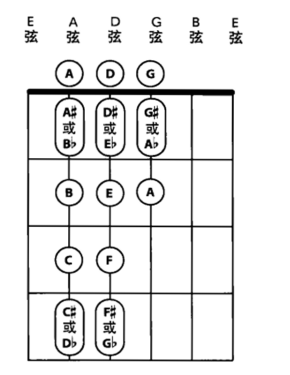

### 贝斯

贝斯又叫作低音吉他，和电吉他的原理基本一样，但是使用的琴弦要比电吉他粗很多。电贝斯通常都是四根弦,在音乐演奏中电贝斯主要负责演奏低音部分。当然，除四弦贝斯以外，还有五弦贝斯、六弦贝斯，甚至是八根琴弦的贝斯、木贝斯。

MIDI真实性：贝斯的演奏手法与吉他也很像，只是相对容易一些，MIDI制作起来也简单一些，易于模仿

### 打击乐

以爵士鼓（架子鼓）为主要节奏核心，常辅以辅助性小打乐器丰富节奏织体以及音色

注意：不同的音乐风格有相对固定的节奏音型和音色搭配

MIDI真实性：从声音形态来看，打击乐大多属于颗粒状音色，MIDI制作和模仿起来比较容易


### 架子鼓（爵士鼓、Drums）

作用：爵士鼓在音乐织体中虽然承担伴奏层面的功能，但它犹如乐队的指挥，引导着整体音乐的发展和律动（乐曲的节奏、律动、速度）

#### 各部位


* 底鼓（Kick）底鼓又称为大鼓或低音大鼓，是爵士鼓中的低音乐器。底鼓的音色结实、低沉、有力，与低音乐器有较好的融合性，常和军鼓构成基本的节奏型。底鼓使用脚踩踏板演奏，所以灵活性较其他乐器稍逊。

* 军鼓（Snare）军鼓又称为小鼓或小军鼓，军鼓音色清脆、响亮、穿透力强、力度变化较大。军鼓是用鼓槌敲击发声，很多音源中预制了不同力度的军鼓音色，在实际演奏中，敲击不同位置也可以得到不同的声音。

  常见的演奏有鼓击（Snare）（用鼓槌敲击军鼓中心位置的正常发声）、边击（Side）（用鼓槌敲击军鼓边缘的发声）等。

* 踩镲（Hi-Hat）踩镲是高音乐器，音色清脆、穿透力强、富有颗粒性。踩镲是用左脚踩踏和鼓槌敲击来进行演奏的。爵士鼓中的一般以四分音符、八分音符或十六分音符为单位做一定的循环来敲击，以平衡底鼓与军鼓的节奏变化。
  踩镲通常有3种演奏法：①用鼓槌敲击闭合的踩镲称为闭镲（Hi-Hat Closed），适合演奏密集和较快的节奏音型。②敲击打开的踩镲称为开镲（Hi-Hat Open），演奏效果不如闭镲奏法轻巧。③用踏板踩下踩镲使两个镲片合击的声音称为踏板踩镲（Hi-Hat Pedal），余音较长，通常和闭镲以及开镲结合使用，常用于乐段、乐句过门的地方，以提示乐段、乐句的结束。

* 嗵鼓（Tom）嗵鼓又称为嗵嗵鼓，由音高不相同的鼓组合而成。一般的爵士鼓中配有3~5个，用鼓槌敲击演奏。嗵鼓按照音高关系分为高音嗵鼓、中音嗵鼓和低音嗵鼓，常用在乐句、乐段、高潮的连接处，来推动音乐的发展以及过渡。

* 吊镲（Crash Cymbal）吊镲也称为炸镲，声音洪亮、穿透力强，在实际演奏中，敲击不同的位置会得到不同的音色。正常的敲击边缘能发出响亮的声音。鼓音源中一般至少有2~3个吊镲音色，有厚薄以及左右声像之分。吊镲中还有一个镲称为吊顶或者叮叮镲（Ride Cymbal），它是敲击镲的顶部，常代替踩镲演奏，效果比正常敲击吊镲的声音要清脆。鼓音源中一般有两个以上的吊顶音色，也有厚薄以及左右声像之分。

#### 键位图

下图是爵士鼓音源对应MIDI键盘的位置图，大部分标准音源都是采用的这种排列方式，个别电子鼓除外


打击的位置、声音的震动、底鼓的共鸣，电子鼓（便携、不扰民、可以改变音色）无法很好地表现，比较死板

#### 基本套路

Hiphop：在嘻哈编曲中，鼓组的律动感是决定整首歌曲基调的重中之重

### 风格技法

80年代：gated reverb

## 弦乐

加入弦乐烘托氛围，在流行乐中十分重要，大多以提琴组为核心，也有会用到管乐团做氛围的情况

## 其他乐器

整体的结构和频段铺满之后，可以尝试加入一些特别的乐器，例如铜管、弦乐的独奏、风琴、口琴
甚至二胡、古筝等民族乐器

## 具体实例

《神思者故宫的回忆》：其实很简单,钢琴一架,小提琴一把,drum kit一组(大约是Ambient风格的),一个电子键盘(可能是合成器或工作站或舞台键盘),用的是一种类似vibraphone的合成音色.还有一个应该是电子类的吹奏乐器，具体是什么听不出来
New Age的配器大多很简单，不过会追求新颖，加一些独特的小众乐器（大多来自世界音乐World Music），比如陶笛奥卡利那笛之类的。

# 和声（Harmony。和弦与调式调性）

几个不同的音在同一时间的结合叫做和音。不同和音的连续进行就是和声。 不同时期、不同风格、不同流派的音乐使用的和声也不同。

在古典音乐和现代音乐中有一定的区别，和声在古典音乐中是指的和弦与和弦之间的连接，以及和弦与和弦之间音符的连接，所以古典音乐和声相当于包含了和声（Harmony）与和音（Voicing）两个概念，在古典和声学中都是要求和弦的纵向和横向同步来学习，有一个很系统的体系。

和声在现代音乐中又叫和弦连接或者叫和弦编配，它通常只是讲和弦与和弦之间连接的用法要求，对和弦与和弦之间音符的连接并没有过多的要求，现代音乐中其实就是把古典音乐的和声分开来说明，因为在现代音乐中，风格太多样，所以就算用同样的和弦连接，在不同的风格中它用法以及和弦弹法也是不一样的

和声丰富多采的表现力，是基于和声进行中的**力度**和**色彩**两方面的因素所形成的

和声功能

* 声部关系的组织作用。
  在主调音乐中，音乐进行以纵向和弦结构与横向和声进行为主导。纵向各声部的乐音根据特定的“和弦结构原则”同时结合构成“和弦”。横向各和弦之间根据特定的“和声进行逻辑”作有序连接构成“和声进行”。
  各声部的乐音进行在和弦结构原则与和声进行逻辑的综合控制下纵横结合，组成多声部音乐的有机整体，从而体现出和声所具有的声部关系的组织作用

* 形成曲式的结构作用

  从宏观方面来看，首先，曲式结构的不同部分在和声应用上各有不同特点——在不同的结构段落采用不同的调性布局、不同的和声进行、不同的和声终止。其次，乐曲整体结构的有机组成有赖于和声发展的整体布局。
  从微观方面来说，不仅各种音乐“语气”的表达需要通过不同类型的和声进行予以支持，乐句、乐段等曲式单位的确立也需要通过不同的和声终止予以肯定

* 音乐内涵的表现作用

  采用不同的和弦结构与不同的和声进行，能够使多声部音乐产生不同的音响效果与不同的和声色彩，起到烘托旋律、刻画意境、塑造形象、表达感情的音乐表现作用

## 和声学

和声学是研究主调织体多声部音乐写作技法与创作原则的作曲技术理论学科

学习和声学的意义

* 学习音乐写作的规则
* 学习分析前人经典作品和创作思路的方法

和声学告诉你一些和弦连接的规则，如何保持声部线条的流畅度、歌唱性，实际上爵士和声与所谓的“流行和声”都是建立在古典和声学的基础上，学习它们你至少得保证对古典和声学的一些概念有足够的理解，比如各种功能。

当涉及到将和声分解成各个声部的乐器时，你就必须了解各个乐器的特性，它们的音域、演奏法、声响效果等等。我不建议初学者进行“只要好听就行，不要管写出来符不符合乐器的演奏法”这样的操作，因为你没有足够的音乐经验去判断，“好听”是个很主观的东西，它很容易把你带偏，让你自以为没有问题。

但你想编到像现在商业流行歌那个程度，偶尔带点弦乐或者四大件以外乐器那种，那么你就不能只学和声。

曲式復調配器中的很多東西都建立在和聲之上，所以如果沒有學過和聲去看這些書可能有的部分是看不懂的。反過來的話肯定就沒有什麼問題，和聲本來就是應該先學的。

起源

* 非洲人所创作的和弦进行是一种循环往复的、带有节奏或律动的音乐感觉。这种方式以调式的基本色彩与律动的节奏，共同烘托出了歌词故事的整体氛围
* 欧洲人创造了和弦的各种类型（大和弦、小和弦等），以及我们使用的大部分调式
* 传统和声还提出了这样的厩念：和弦在调式中被划分为“家”或“离家” 的两种进行。这种划分强调了和弦趋向于主和弦的行进，即向“家”的移动倾向，这样的和弦进行可以对歌词或旋律乐句进行润色
* 现代流行音乐是将这两种和声途径的有效结合，形成了欧洲与非洲和弦的混合体。体会这种类型的功效，有助于在写作歌曲的过程中找到自己的创意

### 和声分析步骤

* 谱例呈现
* 精确地判断出调性，即：某某调。其具有"坐标式核心地位"的意义，主导着和弦级数的标记。

## 基础知识体系

* 三大基础知识点

  * 调式与调性

    * 调式：音与音之间表现出的外在形式。即：围绕着某一稳定的中心音，按照一定逻辑关系组成的音与音之间的有机整体。以此构成诸多调式音阶，如:五声音阶、七声音阶、中古调式(教会调式)等。 
    * 调性：音与音之间所表现出的内在性质。即：调式类型与其某一稳定的中心音的统称。如：以G为主音的大调式(G大调)、以a为主音的小调式(a小调)等。因此，某某"调"指的是调性。

  * 和弦的构成、分类、转位：和弦是在泛音的基础上构建而成,并以三度叠置的形式予以扩展(三和弦、九和弦、十一和弦等)。

    和弦构成的六字诀：纵向三度叠置。“纵向"是形式，"三度叠置"是方式。分类与转位见上文

* 各级和弦的分组、"特性”、进行

* 节奏织体、时值长短与和弦分布

* 快速判断主调及自然和弦级数

## 声部

和声是指音乐作品中的和弦运动，是由若干个不同的和弦相继奏出而构成。 从一个和弦到另一和弦的运动叫“和弦进行”或“和弦序进”。

和弦的声部自上而下分别称为第一声部、第二声部、第三声部和第四声部。 最高声部和最低声部被统称为“外声部”，其余的中间声部被统称为“内声部”。 声部的横向运动叫做“声部进行”。

常见的和声写法为四声部，在四个声部的基础上，可以根据需要适当增减声部的数量。 对于三和弦或九、十三等和弦，如果要保持四个声部，就需要重复某个音以填补缺少的声部或省略某音以去掉多出的声部。

### Voicing（声部的纵向安排）

流行乐声部

1. 旋律声部
2. 低音声部
3. 内声部：在旋律声部与低音声部之间的声部


### 声部进行（Voice Leading、声部的横向安排）

含义：由一个和弦进行到另一个和弦，实际上是和弦的横向运动。声部的横向运动叫声部进行。声部运动不超过三度的叫平稳进行；超过三度时叫跳进。

任意性质的和弦都能通过Voice Leading彼此顺畅连接


## 四部和声（four-part harmony）

含义：音乐作品由四个声部记谱，称为四部和声。四部和声是多声部音乐写作的常用形式，与混声四部合唱的记谱相同

各个声部按照和声进行相互独立的且有组织的结合。在这四部和声中，它们与人声的四种声乐类型相一致的，通常我们把最高的声部称作旋律声部。

四部和声具有和声音响丰满、各声部音区适中的特点，并能与人声的四个声部（女高音、女低音、男高音、男低音）相互对应，是多声部音乐写作最常使用的分部和声形式

和声学教材里，大抵都是用二分音符与四分音符的柱式和弦的四声部和声的形式在给各种和声连接及其相应规则举例。这是因为这些柱式和弦的四部和声谱例，并不是真实的音乐，而是真实的、鲜活的、细节化的、织体化的音乐的一种抽象。

大家在用四部和声谱例学习各种和声规则的时候，并没有有意识地把这些四部和声谱例和真实的音乐结合起来，也缺乏一种把真实的音乐谱例中的和声从各种织体中提炼出来抽象成四部和声柱式和弦的形式的训练

当我们在学和声的时候，用柱式和弦织体来写作，可以让我们最高效地把注意力放在和声的内容上

# 编配

流行音乐的编配

基本步骤

1. 分析结构之后录入旋律、编配爵士鼓和小打（有的歌曲可能直接用Loop取代爵士鼓）。将旋律分成若干段落（前奏、间奏、尾奏与主旋律） 后录入
2.	静态织体的制作，确立调式、调性后进行和声铺底
3.	在播放音乐时录入电贝司
4.	动态织体的制作
5.	在旋律的适当地方加入副旋律

## 旋律的结构分析、核心节奏与小打

1. 旋律的结构分析。旋律是乐思陈述的主要承担者。流行音乐的旋律大致包括四个方面：前奏、间奏、尾奏（都是由器乐演奏）、主旋律（演唱或演奏部分）
   分析旋律的结构以及陈述类型，为具体的编配工作进行前期的准备，是编配流行音乐的首要工作。
2. 核心节奏。本文所涉及的核心节奏是指伴奏部分由爵士鼓演奏的固定节奏型，这种节奏型一般是由一小节、两小节或四小节一组循环演奏并贯穿全曲，有时根据不同的音乐表现内容进行适当的调整。这就是支配全曲、作为伴奏部分的核心节奏。现在有些软件已经设定好了核心节奏，以Loop的形式出现，编曲者直接调用不同的Loop构成核心节奏。乐队中的钢琴、吉他、合成器、电贝司或其它乐器的织体均要与核心节奏协调一致。
3. 小打。流行音乐中的小打泛指具有点缀作用并且能够勾勒乐句或乐段结构的、极具色彩的打击乐器。如康巴鼓、响板、沙锤、铃鼓等等。

### 旋律的结构分析

具体工作：根据旋律的特性和结构，将前奏、间奏、尾奏与主旋律划分出来，再编配相应的核心节奏，以后所做的一切工作都是以此为基础

为声乐旋律编配核心节奏时，还要将相应的伴奏织体与副旋律进行适当的设计。编配前奏、间奏和尾奏时，我们首先要把整个乐队划分成三个音区：高音区一 含小字三组、小字四组和小字五组，中音区—— 含小字组、小字一组和小字二组，低音区一包含大字二组、大字一组和大字组。根据不同音区来选择乐器即可。

器乐部分（前奏、间奏和尾奏）的陈述形式包括以下10类：

1. 同度齐奏
2. 八度齐奏
3. 两个八度齐奏
4. 三个八度齐奏
5. 四个八度齐奏
6. 混合音色陈述
7. 单一音色齐奏陈述
8. 单一音色独奏陈述
9. 附加声部陈述（平行三六度）
10. 复调式陈述

## 动机（Motif）

一部作品中最核心的、相对短小的一段音乐材料（或者是节奏，或者是旋律），以此来作为乐曲的中心，围绕它来发展。

动机的来源：灵感。不是单靠技巧就能产生

例子：

```abc
X:1
T:电影《放牛班的春天》插曲（Vois Sur Ton Chemin）
M:4/4
L:1/8
K:C
eeecd4
```

### 动机发展（Motivic Development）

* 模仿进行：对原来的动机，在这个动机的基础上进行变形、变调、变奏，延展（音高）、拉宽（音域）、再现（反复动机）。

  调整音高、上下翻转音高、变化节奏

* 

* 

地位：在MIDI音乐制作或旋律写作中，作曲者都会先构思出一个动机，再将这个动机发展成一整首乐曲

类别

* 节奏动机——只有节奏的动机，不包含旋律
* 旋律动机——只有旋律的动机，不包含节奏
* 动机——包含节奏与旋律的动机

运用场景：动机不单单在旋律中使用，在编写伴奏以及其他乐器时也经常使用，比如我们常常会听到歌曲里有一个吉他伴奏规律地重复，一直到音乐结束，这样的形式也可以叫作动机。旋律也是同样道理，在现代音乐中，任何乐器都可以创造动机。

一个动机是一首乐曲或乐段都使用的一种节奏型。

#### 节奏动机

类型

* 一个动机

  ```abc
  X:1
  T:一小节一个动机
  M:4/4
  L:1/8
  K:C
  zD DD DD DD
  ```
  ```abc
  X:1
  T:两小节一个动机
  M:4/4
  L:1/8
  K:C
  zD DD DD DD | DD DD D2 z2
  ```
  ```abc
  X:1
  T:四小节一个动机
  M:4/4
  L:1/8
  K:C
  zD DD DD DD | DD DD D2 z2 | zD DD DD DD | D3 D D2 z2
  ```
  ```abc
  X:1
  T:使用两小节的节奏动机来构架的八小节的乐段
  M:4/4
  L:1/8
  K:C
  zD DD DD DD | DD DD D2 z2 | zD DD DD DD | DD DD D2 z2
  zD DD DD DD | DD DD D2 z2 | zD DD DD DD | DD DD D2 z2
  ```
```
  
* 两个动机

  含义：两个动机代表一首乐曲或乐段使用了两种节奏型态来进行创作

  作用：两个动机的写作方式非常常见。组合的方式也比一种单一的动机丰富了许多

  |      | 动机组合                                               |
  | ---- | ------------------------------------------------------ |
  | A起  | AAAB<br />AABA<br />ABAA<br />AABB<br />ABAB<br />ABBA |
  | B起  | BBBA<br />BBAB<br />BABB<br />BBAA<br />BABA<br />BAAB |

  例子

  ```abc
  X:1
  T:两个基础动机（前两节为A动机，后两节为B动机）
  M:4/4
  L:1/8
  K:C
  zD DD DD DD | DD DD D2 z2 |
  zD D2 DD D2 | D3 D D2 z2 |
```

  ```abc
  X:1
  T:使用了两组两小节的节奏动机来构架的八小节的乐段（ABAB）
  M:4/4
  L:1/8
  K:C
  zD DD DD DD | DD DD D2 z2 |
  zD D2 DD D2 | D3 D D2 z2 |
  zD DD DD DD | DD DD D2 z2 |
  zD D2 DD D2 | D3 D D2 z2 |
  ```

* 同理三个动机与四个动机

例子：节奏动机可以是一小节、两小节或者是四小节


# 复调与对位（Polyphony and Counterpoint）

音乐如果按照织体来分类的话，大致可以分为三种：单声部音乐、复调音乐和主调音乐，平时大家常见的是单声部音乐和主调音乐。

**单声部音乐**可以理解为一个人独唱、清唱，因为音乐中只有一个主旋律，并没有其他任何装饰

## **主调音乐**（homophony、流行乐主流）

指有一个主旋律，再加上伴奏（陪衬）的形式，例如平时大家听的流行歌曲，基本上都是主调音乐，其中有一个歌手在唱主旋律，其他的乐器则作为伴奏。

伴奏特点

* 伴奏通常只是无明显旋律的和弦
* 低音构成隐伏级进旋律
* 和弦最高音也构成隐伏旋律
* 隐伏旋律不足以与主旋律抗衡

主调音乐并非与复调音乐完全对立，主调音乐中可以加入复调元素


陪衬部分也可以具备复调因素，旋律化

伴奏部分可以分为多个隐式的旋律

关键是音区的分块化

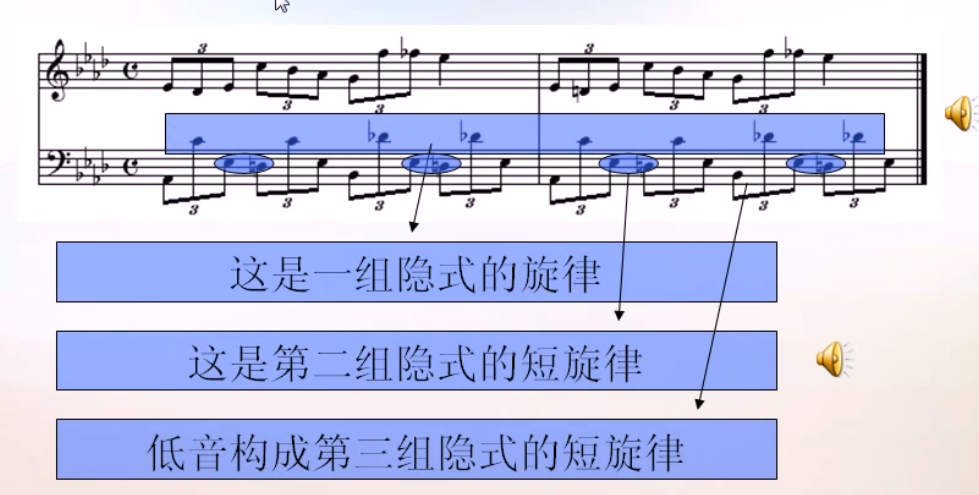

### 等节奏（Homorhythm）

在音乐中，等节奏是一种织体，指“所有声部都有相同的节奏”或“非常相似的节奏”。同音是主调音乐的条件。

### 主调音乐的和弦形式

特点

* 没有主旋律，只有和声
* 和声由很多线条同时复合而成
* 旋律片段服从于整体和声，旋律不能视为独立的
* 和声整体化是主调音乐一大特色，但仍旧存在着小的旋律进行，时而凸显


## **复调音乐**

指两个或两个以上的声部（旋律）在同时进行、互相形成和声关系、以对位法为主要创作技巧的音乐。若干个声部大致处于一个平等或平衡的地位。没有某一个声部的旋律是占据绝对主导地位的。似乎这个概念很难理解，看了下面的例子，相信大家就能明白了。

如果两条旋律，但如果旋律是同步重合或者八度重合，这种情况也不能算作两条旋律，而是一条

指的是将几条旋律线，按照一定的规则加以结合的一种"多声部音乐"，这几条旋律线都具有独立意义，注重各自的横向发展，这种各自具有独立旋律意义的多声部音乐，就称为“复调音乐”。


### 复节奏（polyrhythm）

### 重要性

* 杰出的作品都蕴含复调精神
* 复调与主调是不可分割的
* 主调下的复调因素
* 复调下的主调因素
* 无论交响乐，还是流行编曲，只要涉及到多乐器，离不开复调思维
* 和声中蕴含复调进行。和弦中有高音声部进行、内声部进行、低音声部进行，这些短旋律

### 表现体裁

* 交响乐、歌剧、室内乐
* 独奏曲、器乐曲
* 歌曲、合唱
* 流行音乐的编曲

### 分类

* 非模仿式复调音乐
  * 衬腔式（多条旋律轻微不一样）
  * 对比式（多条旋律完全不一样）
* 模仿式复调音乐（多条旋律前后模仿）：通常旋律之间时间上错开，后面的旋律模仿前面的旋律

#### 衬腔式复调音乐

技术条件

* 主旋律只能是单一的
* 衬腔的旋律时而重合（平行同度或平行八度），时而分开
* 衬腔重合时，音量需要加倍，不能保持跟前面旋律一样的音量？

对旋律的要求

* 性格鲜明，调性明确（没有转调）
* 节奏规整，句读分明（很少有切分、Shuffle、Swing、连音、附点）
* 低音旋律和高音旋律要融合

所有声部表达同一旋律的各种变体，听觉效果是听起来像只有一个旋律

例子：

2是从1中分支出来的，就叫做衬腔复调。1,2与3的音调和节奏几乎完全一样。1与2在某些地方略微不同（↓）。1,2与3在某些地方也略微不同（↑）

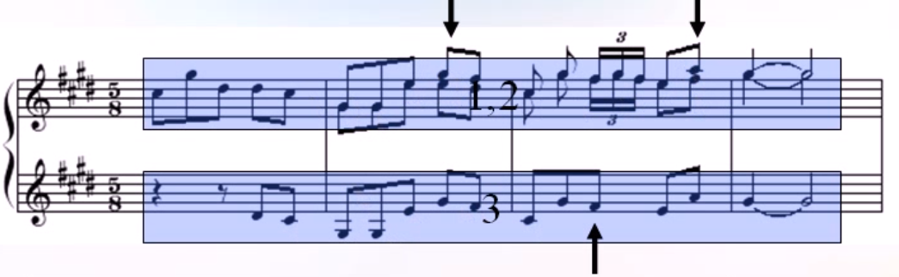

对比：对比可以有节奏对比，可以有音高对比。衬腔式复调中的旋律间的对比可以比较大，但仍不改变性质。衬腔的对比部分通常格外引人注目

蓝色椭圆区域的对比都比较大，但总体来讲下方旋律还是从属于上方旋律

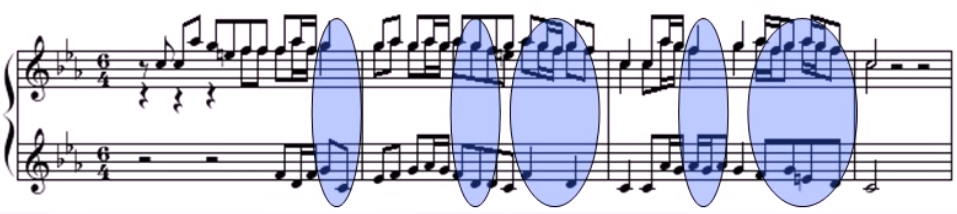

#### 对比式复调音乐

至少具有两条显著不同的旋律。但可以具有另外的相同或相近的旋律

例子：

2,3构成衬腔复调，因为节奏音高几乎类似。1,2构成对比复调，因为节奏音高相差很多
。从整体来看是对比复调，从局部来看衬腔。

对比与衬腔主要看节奏是否同步


1,2的旋律几乎完全不同。1是悠长歌唱性的，2是音阶的，旋律性不强的
篮圈部分：旋律1听，旋律2起，是典型的对比式复调

对比的强弱主要看节奏对比的强弱


#### 模仿式复调音乐

特征

* 所有声部表达同一个旋律，但不是同时进行地
* 所有声部模仿第一个声部，可以不精确

例子：

1是单簧管声部，第一个进入
2是双簧管声部，第二个进入，模仿1的节奏
3是巴松管声部，第三个进入，模仿1的节奏
4是长笛声部，第四个进入，模仿1的节奏

模仿与否主要看节奏是否相同


### 主调与复调的联系

主调音乐蕴含复调精神

* 一个陪衬部分可以衬托多条旋律

* 陪衬部分本身可以具有旋律性


复调音乐蕴含主调精神

* 几个主要旋律，有着共同的和声基础
* 旋律可以有多条，但是最突出的很有限。那些不突出的内化为类似主调音乐的伴奏部分

## 对位法（Counterpoint）

### 含义

复调音乐的作曲技巧，是在音乐创作中使两条或者更多条相互独立的旋律同时发声并且彼此融洽的技术。

意为“音符对音符”。对位法并不是指单独的音符之间的和弦，而是指旋律之间的相互作用。它既可以是用两条或两条以上的旋律交织成和弦，也可以是以多组和弦交织表现出旋律。对位与和声的特点刚好相反，和声追求的是纵向的发展，除了一条主要的声部外，其他的声部在自己的进行中以特定的和声结构辅助这条主要的声部；对位追求的则是横向的发展，各个声部各不相同，但又要互相和谐不冲突。

### 历史

对位法是音乐史上最古老的创作技巧之一，也是欧洲在中世纪（公元800-1430）和文艺复兴时期（1430-1600）最主要的作曲技巧。在“对位”的概念被人们提出之前，应用对位法原理的音乐作品早已存在。现存最早的相关记载，见于公元900年左右一位无名氏所做的论文，Musica enchiriadis。在这篇类似教材的论文中，作者介绍了将给出旋律以对位法编排的方法。这种被称为固定旋律（cantus firmus）的方法是，将既有旋律以五度音程加以重复，再各将两条旋律以八度音程重复而得到四条旋律。当“对位法”这个名词开始流行的十四世纪，当时应用对位原理的作品少有以“音符对音符”形式写就的。当时标准的对位法作品，是一种华丽的多重唱（organum），即将多个音符以对位手法组织成一种进行缓慢的固定旋律。

对位法在巴洛克时期的音乐中得到了广泛的应用，其中以约翰·塞巴斯蒂安·巴赫所作的《赋格的艺术》以及《音乐的奉献》最为闻名。

时至今日，对位法原理仍然是调性音乐的基础，也是作曲的必修课。

### 声部运动的关系（对位运动、Contrapuntal motion）

对位运动是两个旋律线相对于另一条旋律线的运动关系。

* 同相进行：两个声部同方向运动
* 反向进行（contrary motion）：
* 平行进行（parallel motion）：两个声部等距离同方向运动
* 斜向进行（oblique motion）：一个声部保持不动 另一个声部运动
* 交错：两个声部局部互换上下位置
* 超越：超过原结合声部的位置的运动

### 类别

严格的对位法有五种创作手法。赋格曲是用模仿方法创作的最高级形式。

应用对位法的最常见的固定形式的作品类型有赋格和卡农。

#### 分类对位法（Species Counterpoint）

https://musictheory.pugetsound.edu/mt21c/SpeciesCounterpoint.html

分类对位（又称福克斯五类基本对位）是一种传统的对位法教学形式，也是对位法创作的所谓“严格形式”。在传统的对位法学习中，学生需要应对几种复杂程度不同的“类型”（Species），按照严格的对位法原则，由给出的固定旋律（cantus firmus、c.f.），谱出相应的对位声部。在熟悉了对位创作的不同分类后，学生可以开始创作“自由”对位，也就是不甚严格的对位法。

##### 元素

固定旋律：所有的例子都必定有一条固定旋律，它：

* 或者出现在旋律声部（高音声部）
* 或者出现在低音声部
* 或者出现在内声部
* 一定是每个小节都是全音符

其他声部的要求：

* 横向曲调自然，易于歌唱：自己演唱一遍
* 纵向和声必须尽可能得当既符合听觉又符合规则
* 符合对位法的旋律写作要求：既符合听觉又符合规则
* 符合对位法的规则：既符合听觉又符合规则
* 符合男女演唱的常用音域

所用的和声材料

* 只用原位三和弦或第一转位六和弦(和弦可以不完全，如C和弦只有C/D，没有G)
* 不用四六和弦，不用增五度、减五度以及其他和弦(如七和弦)

第一对位：单个音符间的对位（Note agianst note）；
第二对位：两个音符与一个音符间的对位 （Two notes against one）；
第三对位：一组音符（泛称，包含三个、四个或六个等音符构成的一组）与一个音符间的对位 （Four notes against one）；
第四对位：延留音对位（Notes offset against each other）；
华彩对位（Florid counterpoint，将以上四种综合运用的对位手法）
后世的音乐理论家基本沿用了Fux的模式，但偶尔会对规则加以变通或修改。一个例子是路易吉·凱魯比尼.[3]

#### 写作顺序

- 既定定声部（定旋律声部）⇒一类。
- 一类⇒二类。
- 一类⇒四类。
- 二类⇒三类。
- 五类对位则是「在一类对位的基础上、由二三四类任意组合而成」。

#### 写作规则

https://zhuanlan.zhihu.com/p/20498455

- 一类：两声部都是全音符、纵向一一对应，不得出现不协和音程。
- 二类：将一个声部的全音符分成两个二分音符，弱拍上的和弦外音可以是过渡音、邻音。
- 三类：在二类的基础上，用同样的和弦外音选取思路，将二分音符化成四分音符。
- 四类：在二类的基础上，引入挂留音、构筑不协和音程。
- 五类：将前四类所述技巧自由结合使用。

#### 分类对位法总则

分类对位法适用于除罗克里安以外的所有调式（伊奥利亚调式、多利亚调式, 弗里吉亚调式, 利底安调式, 米索利底安调式和爱奥利亚调式). 以下规则适用于所有类型的对位创作。对于创作中的每个声部而言，必须遵守如下规则：

对所有类型的对位，以下规则适用于不同声部的组织：

* 必须以完全协和音开始。

* 以低音声部為判斷聲響的基準。

* 不得出现声部交叉

* 不得出现声部超越

* 不得出现平行五度

* 不得出现平行八度

* 不得出现高音声部跳进的隐伏五度

* 不得出现高音声部跳进的隐伏八度

* 平行三度不得连续出现四次或四次以上

* 平行六度不得连续出现四次或四次以上


#### 第一对位

以1個全音符對1個全音符

#### 第二对位

以2個2分音符對1個全音符

#### 第三对位

以3~6個分音符對1個全音符，其中比较常见的是以4个四分音符对1个全音符。

#### 第四对位

以2分音符的切分節奏對1個全音符

#### 第五对位（华彩对位）

採取混合節奏與 1個全音符相對

#### 派生对位 Contrapuntal derivations

#### 非协和对位

https://www.zhihu.com/question/321751246

## 作曲前要回答的问题

1. 叙述者是谁
2. 对谁叙述
3. 为什么要叙述

如果这三个问题没有弄清楚，乐曲就无法很好地表达情绪

根据干声作曲

1. 先测速

# ABC notation

文档：

* https://abcnotation.com/wiki/abc:standard:v2.1
* http://www.stephenmerrony.co.uk/uploads/ABCquickRefv0_6.pdf
* http://abcplus.sourceforge.net/abcplus_en.pdf

# 视唱练耳与扒谱

```abc

```


识谱（Sight-reading）

识谱快的人是因为他们已经理解、练习很多种音乐中常见的排列组合，已经熟悉了“音乐”这门语言，他们甚至能预测接下来旋律的走向。这就跟初学者和熟练者读外语文章一样。

EarMaster

#### 扒谱

重要性：学编曲最快的方式是编曲，而不是扒带。有效的方式之一就是扒带。

之所有有这种说法是因为，扒带的过程中要去理解别人的曲子中用到的理论知识，给自己学到的乐理一个验证和总结。而扒带只能学其表面，很难学会其内核，不成体系。

还有就是复杂的管弦乐没法扒。

自动扒谱：https://www.zhihu.com/question/22185725

### 测速

https://www.bilibili.com/video/BV1vE411Y7PE/?spm_id_from=333.788.videocard.8

节拍计算器：粗略测速，主要用来测自己歌的速度

范围选择配合节拍计算器：适合测匀速的歌曲。大部分流行歌都是匀速。

使用时间伸缩工具精准测量

## 即兴演奏

使和声更丰富的方法

* 在C大三和弦（135），添加一个七音B（距离半音，感情慎重）或一个九音D（距离全音，感情自由）
* 在Am小三和弦（613），添加一个七音G（距离全音，感情自由）或一个九音B（距离全音，感情慎重）
* 在G7属七和弦（572），添加一个七音F（距离全音，感情自由），或九音A（距离全音，感情自由），或十三音是E（五音到十三音距离全音，感情自由，有点爵士的感觉）

### 爵士的即兴演奏

躯壳排列（Shell Voicing）

在和声当中，**和弦能被另一个和弦替代是基于它们拥有不少共同音，这就是所说的“听感”**。

“根，3，7”三个音就构成了爵士的核心

根音决定这个和弦姓什么，比如F、B、E三个音，根音是G的时候它们叫做G13，根音是Db的时候它们叫做Db7。

3音（有时候是sus4）决定了这个和弦的大小，即记作m还是该记做M。

7音和3音一道，决定了这个和弦的属性，大三小七=属，大三大七=Maj7，小三小七=m7。

在shell voicing的R、3、7三个音里，其实3、7更重要一些，因为根音可以随便换，姓可以随便换，但是这个和弦的功能却不能换。比如一个ii-v-i进行，其实可以抽象为一个41－47－37的37音进行。这三个双音进行足够暗示ii-v-i了

# 宿主（Digital Audio Workstation）

宿主通常指用于音乐制作的工作站软件，工作站软件是一个大平台，一个工具箱，能提供录音、音频编辑、软音源编写、效果处理、乐谱生成等功能，以满足音乐制作的完整需求。目前常见的宿主有Cubase、Pro Tools、Studio One、Logic、Sonar、Ableton Live、FL Studio、Reaper等等。

## Cubase

Manul: https://www.steinberg.help/cubase-manuals/cubase-pro/cubase-10-5/

快捷键：https://steinberg.help/cubase_ai_le_elements/v9/en/cubase_nuendo/topics/key_commands/key_commands_default_c.html

### 钢琴卷帘（Piano Roll、Key Editor）

电脑音乐制作软件常见的音符编辑模式有两种：①乐谱编辑方式（五线谱、六线谱、鼓谱等）；②钢琴卷帘编辑方式。其中，钢琴卷帘是MIDI音乐特有的音符编辑方式。我们可以在它音符编辑区域编辑音符，按照横向的小节时值刻度编辑音符长度，竖向的键盘对应着音符音高，一个音符就这样输入完成了。

#### 表示

调的表示：在钢琴卷帘中不需要设置调，因为钢琴卷帘就是一个键盘，当按照不同调的音阶来演奏时，它可以是任何的调

实例


连音线的表示：用来连结同样高低的两个音的弧线叫连音线。连音线可以连续使用，将许多个同样音高的音连接起来，用连音线连接起来的若干个音要唱、奏成一个音，它的长度等于这些音的总和。
如下图中的2音（A大调）。连音线将前后两个八分音符连接起来以后，实际演奏或者在钢琴卷帘中输入时就变成 一个音，其长度相当于两个八分音符的总和，即一个四分音符。


#### Middle C =C3

Pretty much everywhere else I know of (e.g. Vienna Symphonic Lib), middle C = C4, but in the Cubase piano roll (and perhaps elsewhere?) middle C = C3. Why is that, oh wise ones?

Middle C always refers to MIDI Note Number 60. There are 2 main systems in use for naming notes by octaves, one refers to middle C as C3, the other refers to the exact same note as C4. Neither system is right or wrong, they are just different and used in different contexts, like feet & meters (except even more confusing - like US and Canadian gallons). Both C3 & C4 refer to the same C note in the middle of your piano keyboard.

https://en.wikipedia.org/wiki/Scientific_pitch_notation#Similar_systems 提到中央C是C3

http://www.flutopedia.com/octave_notation.htm 提到中央C是C4

### 使用冻结轨道节省CPU

为了更有利于我们完成一些需要大量插件或音频效果器的作品，在总资源有限的情况下就有了冻结的办法，Cubase冻结轨道的原理，就是把已经完成的、或者说暂时不用再修改的某部分音轨直接导出成音频替代原来的音源、插件，然后暂停音源插件的工作，从而达到节省资源，减缓CPU负荷的效果，但需要注意的是，启用后无法再编辑VST乐器界面的参数，也无法再编辑卷帘器里的MIDI参数

## 声卡

缓冲：缓冲的大小主要是体现在midi信号到音频之间的延迟上的。越大的缓冲延迟越高，反之则延迟越低。
关于爆音的问题，主要是如果CPU和硬盘跟不上的话会有运算不过来导致的噪音，如果在daw里内录的话噪音会被录下来。但是离线导出一般没事。

常见问题

* 编管弦乐的时候不要在总轨上给加母带处理（一个效果器内使用多个效果，非常占CPU）
* 不要用机械硬盘加载大型音源，如柏林弦乐
* 不要一边编曲一边玩游戏，录制或编辑或导出视频
* 不要用很小的内存加载多麦克风位乐器
* 不要同时打开BBC和Junkie XI Brass

爆音可能的问题：声卡设置、CPU性能、硬盘性能

1.	将声卡缓冲调到最大（录音用硬件监听）
2.	在VST性能中，打开多线程处理
3.	观察系统性能表Average，开或关Audio-Guard（F12）
4.	在Kontakt中，设置音符，话筒位较多的乐器的Max-Voice
5.	观察系统性能表，根据RealTime，调整（调高）乐器的Preload-Size


CPU该换了的表现：
Kontakt表中弦乐连奏时CPU占用很不辑定，在30%-100%间跳动，并有时变红
没有选择实时导出，却提示CPU过载
Average-Load高

硬盘该换了的表现
Kontakt表中弦乐连奏时Disk占用很不稳定，在30%-100%间跳动，并有的时候变红InTime-Load高

## 音频插件

知识在前，工具在后。不管插件多寡与否，提高我们的创作水平、制作能力、乐理，多听和多分析，才是一切的基础。好的插件也需依托好的音乐人来驾驭发挥，恰好在自身提升的过程中，也能够逐渐了解到自己的工具所需。

### 类型

* 按格式。目前主流的插件格式包括**VST、AAX、AU**格式等。

  它们的主要区别是，Pro Tools宿主只支持AAX格式插件，Logic宿主只支持AU格式插件，除此以外的其他宿主都可以或只能使用VST插件。

  无论VST、AAX、AU都只是格式上的不同，市面上大多数插件都会推出多格式的版本，以满足在不同宿主软件、不同操作平台（Windows / Mac）、和不同系统环境（64位 / 32位）上的运行。我们需要在下载和安装时留意不要选错。

* 按功能。以VST为例，目前大家平时所说的VST概念通常泛指了**VST**和**VSTI**，这也刚好代表了以功能区分的两种插件类型，简单来说：

  1） **VST**（Virtual Studio Technology），可统称为效果器，是一种软件效果器技术，用于对已有的声音进行各种效果处理（从有到优）。

  2） **VSTI**（Virtual Studio Technology Instruments），统称为音源，是一种虚拟乐器技术，用于生成各种数字化声音（从无到有）。

* 按架构。无论是音源还是效果器，若按照插件的应用架构，所有插件又可分为独立插件和插件平台+专用插件两种结构类型。

  * 独立插件，是指单独安装成功后，就可以在宿主软件中打开并直接使用的插件。

  * 插件平台，则在安装之后不一定能直接使用，还需要再下载安装符合该平台格式的专用插件，才能才借助平台有效使用。插件平台和专用插件的关系，与手机系统和APP应用的关系是同理。

    比如，国内使用率最高之一的Kontakt，便是一个提供音源功能的插件平台，用户安装完Kontakt之后，还要下载所需的Kontakt平台**专用插件**，才能有效使用。

综上，一个更新到最新操作系统的Pro Tools的Mac端用户，如需使用Kontakt音频插件，需要下载安装MacOS版本的Kontakt，安装时选择AAX格式并确保是64位，然后再挑选Kontakt平台的专用插件进行下载安装，才可正常工作。

### 按功能分类

* 采样器（Sampler）：使用预先设置好的声音来当音色。本质上是加载了那些已经被制作好的音频文件，放入自己的工程而已。这些声音不是在我们的电脑中凭空生成的，不过采样器通常会再内置一些音频处理功能，我们可以在原始采样的基础上对声音进行二次修改，来获得一个或一组更特别的声音

* 合成器（Synthesizer）：使用计算机合成的声音来当音色。由电脑根据电子和声学原理来产生声音。合成器通常会提供多种合成模式和处理功能，让我们可以对原始电声进行变化、组合、加减、排列等，以加工成为更复杂有趣的声音。合成器是制作电子音乐必不可少的工具，一方面，它可以构建传统乐器难以奏出的音色及特性，另一方面，它又能够模拟出传统乐器的音色。理论上，通过足够复杂的变化组合，我们可以合成出任意一种我们能听到的声音，因此在以新、潮、酷为符号的电子音乐中，合成器带着无限的想象力站上了主舞台
  https://learningsynths.ableton.com/zh-Hans/

* 振荡器（Oscillator）：用来产生基本的声波

  

  种类

  * 加分合成（Additive Synthesis）
  * 减法合成（Subtractive Synthesis）
  * 波表合成（Wavetable Synthesis）
  * 微粒合成（Granular Synthesis）
  * 频率合成（FM Synthesis）
  * 物理建模（Physical Modeling）

### 其他

麦克风位：采样音源时，麦克风的摆位。因此麦克风位越多，内存占用也就越多。

5.1声道：三个麦克风位即可混5.1声道，分别是close、tree（mid）、outrigger麦克风

软音源大小的决定性因素：legato精度（如C到D音之间变化的精度）、round robin（同音采样数量）

正版音源

* 所有标准音色库的正版都应该有且仅有一个激活码，用于在Kontakt个人账号中激活的
* 几乎所有的非标准库音色都不能用免费的kontakt加载
* 喷火和Orchestra ITools公司的独立音源是没有人破解的
* 正版音源不允许传播
* 少买那种全是齐奏的，因为虽然声音厚，但是容易出现混音错误，以及会降低选择乐器的能力与音乐丰富度
* 选择在美元比较低的时候买，比如7.03
* 几乎所有音源都有打折的时候，比如Komplete 12
* 购买的时候注意，尤其是非独奏管弦乐音源，尽量选择麦克风位多的

盗版音源：盗版音源不可商用（无版权保护）

### 具体音源插件的选择

古董级音源（尽量不用）：East West Quantum Leap、Steinberg HyperSonic、Tascam GigaStudio

#### Synthesize综合类

Colossus Library---巨人综合音源
Q Library-----Q综合音源
RIG Library----HIP HOP 综合音源
Roland Fantom X6---罗兰采样合成器X6
The Conservatoire Collection-古典综合音色
Yamaha Motif ES7---雅马哈采样器合成器ES7
Yamaha Motif XF----雅马哈硬件采样合成器

#### Drums&Kits打击乐

8Dio EDM Drumstep V.1-----------Dubstep鼓
8Dio Epic Dhol Ensemble---------史诗鼓
8Dio Epic Taiko Ensemble--------史诗太鼓乐团
8Dio Solo Taiko Drums--------太鼓音色Solo版
8Dio The New Alien Drum v2---------外星人鼓
8Dio Zeus Drum-----------宙斯鼓
Cinemamtic Thunder Epic Orchestral Toms--------史诗交响大鼓
Cinesamples CinePerc AUX-------------影视打击
Cinesamples CinePerc CORE----------影视打击
CineSamples CinePerc EPIC---------------影视打击
Cinesamples CinePerc PRO-------------影视打击
Cinesamples Deep Percussion Beds 2--------影视打击乐2
Cinesamples Drums of War 2---------战争鼓2
Cinesamples Rio Grooves!--------巴西节奏打击乐
Drums Overkill---------电鼓音色
Elite Orchestral Percussion-----交响打击
Epic Cinematic Drums---------鼓乐设计
Forest Frame Drums-----------森林鼓
Heavyocity Master Sessions Ensemble Drums---------合奏鼓
Ocean Way Drums Gold------------海运之鼓
Orchestral Tools Berlin Percussion-----柏林打击（含定音鼓）
Percussion Ensemble 2--------启示录打击2
Premier Sound Factory Drum Tree--------套鼓音色
Project Sam True Strike 1--------电影交响打击 1
Project Sam True Strike 2--------电影交甬打击2
Rattly and Raw Martin France Drums--------演奏家鼓组
Sample Logic Rumble----------轰鸣打击乐
Soundiron Street Bukit-------街买即兴鼓手
Spitfire Hans Zimmer Percussion--------喷火汉斯季默打击
Vital Series Mallets-----木槌敲击乐
Vital Series Sticks Library-----小打类loops

#### Orchestra管弦乐交响类

Amadeus Symphonic Orchestra----------交响乐音色库
Berlin Brass v1.1-------柏林铜管（含A/B/C）完整扩展
Berlin Orchestra Inspire------柏林综合管弦乐团
Berlin Orchestra Inspire 2----柏林综合管弦乐团2代
Berlin Strings 2.5------柏林弦乐2.5+A/B/E/D扩展
Berlin Woodwinds 2 Library---------柏林木管2+solo/A/B/C/D扩展
Bravura Scoring Brass-------配乐铜管
Broadway Big Band 1.3---------百老汇大乐队
Chris Hein Ensemble Strings Library-----如歌弦乐合奏版
Chris Hein Horns Pro Complete Library------新现代管乐
Chris Hein Orchestral Brass Library-----古典铜管
Chris Hein Solo Cello Library------独奏大提琴2
Chris Hein Solo Contrabass Library------独奏低音提琴2
Chris Hein Solo Viola Library------独奏中提琴2
Chris Hein Solo Violin Library-----独麦小提琴2
CineBrass Descant Horn--------高音铜管
Cinematic Strings 2.1-------电影弦乐2
Cinematic Studio Brass------工作室铜管
Cinematic Studio Solo Strings------新弦乐独奏
Cinematic Studio Strings------工作室弦乐
Cinesamples CineBrass CORE 1.7d---------影视铜管标准版
Cinesamples CineBrass PRO 1.7a----------影视铜管专业扩展板
Cinesamples CineOrch--------交响齐奏
CineSamples CineStrings Core-------影视弦乐
Cinesamples CineWinds CORE---------影视木管
Cinesamples CineWinds Pro----------影视木舍扩展版
Cinesamples Hollywoodwinds---------好莱坞木管
CineStrings Runs--------影视弦乐
CineStrings Solo--------影视弦乐独奏
Complete Orchestral Collection Library-----管弦乐合集
Embertone Blakus Cello--------实用大提琴
Embertone Fischer Viola-------实用中提琴
Embertone Friedlander Violin-------实用小提琴
Embertone Joshua Bell Violin-------贝尔小提琴
Emotional Violin Library------情感小提琴
EWQLSO PRO XP Brass Library--------白金管弦——铜管
EWQLSO PRO XP Perc Library---------白金管弦——打击
EWQLSO PRO XP Strings Library--------白金管弦——弦乐
EWQLSO Pro XP Woodwinds Library---------白金管弦——木管
Heavycxity FORZO Modern Brass-----------史诗合成铜管
Heavycxity Media Novo Modern Strings-------新概念弦乐
Heavyocity Novo Pack 01 Intimate Textures------管弦乐合成音色
Heavyocity Novo Pack 03 Synthetic Strings------合成弦乐
Heavyocity Rhythmic Textures NOVO PACK 02---------影视弦乐
Kirk Hunter Studios Spotlight Strings------猎人弦乐
LASS Full 2 Library-----LASS弦乐2
London Contemporary Orchestra Strings---喷火伦敦现代交响弦乐
Metropolis Ark 1---------管弦丰碑 1
Metropolis Ark 2---------管弦丰碑2
Metropolis Ark 3---------管弦丰碑3
Metropolis Ark 4---------普弦丰碑4
Mojo 2 Horn Section---------爵士铜管2
Mojo Horn Section Library--------活力铜管
Musical Sampling Adventure Brass---------飞天铜管
Orchestral Brass Classic------影视铜管
Orchestral Essentials 2 Library 1.2------新管弦乐音源
Orchestral Tools presents Time Macro------柏林时间乐团
Output Analog Brass and Winds------------古典黄铜
Output Analog Strings---------现代弦乐音源
PRO XP Gold Library---------黄金管弦乐
Project SAM Organ Mystique 1.3-----------教堂管风琴1.3版
Projects AM Swing! Library-------爵士乐摇摆
Sable Strings Vol 1------喷火弦乐 1
Sable Strings Vol 2------喷火弦乐2
Sable Strings Vol 3a--------喷火弦乐3
Sample Logic Fanfare Library-------尊爵铜管
Sample Modeling French Horn and Tuba 3-------------圆号低音号
Sample Modeling The Trumpet 3------------新版小号音色
Sample Modeling Trombone 3---------新版长号音色
Sonic Symphonic Strings-------Sonic弦乐
Sonokinetic Ostinato Brass-------节奏铜管
Sonokinetic Ostinato Woodwinds-----------木管乐句
Spitfire Audio Albion II Loegria REDUX v3.22-------喷火史诗管弦乐
Spitfire Audio Albion III Iceni REDUX.v2.1---喷火管弦乐
Spitfire Audio Albion IV Uist------喷火管弦乐
Spitfire Audio Albion ONE v1.2-----喷火史诗管弦乐
Spitfire Audio Albion V Tundra-----喷火管弦乐
Spitfire Audio Masse--------喷火交响乐团
Spitfire Audio Orchestral Swarm----------喷火管弦乐
Spitfire Audio Spitfire Solo Strings-----喷火独套弦乐
Spitfire Audio Spitfire Studio Brass-----喷火工作室铜管专业版
Spitfire Audio Spitfire Studio Strings--- 喷火工作室弦乐专业版
Spitfire Audio Spitfire Studio Woodwinds-喷火工作室木管专业版
Spitfire Audio Symphonic Brass-----------喷火铜管
Spitfire Audio Symphonic Woodwinds--------喷火木管
Spitfire Olafur Arnalds Chamber Evolutions library-室内管弦音源
Straight Ahead Jazz Homs 2---------爵士铜管
Strings Run v 2.2--------弦乐大师
Swing More! Library---------大乐队/爵士/电影配乐
Symphobia 1 Library---------交响恐惧1
Symphobia 2 Library---------交响恐惧2
Symphobia 3 Library v1.5---------交响恐惧3（1.5新版）
Symphobia Colours Orchestrator Library-------多彩管弦
Symphonic Orchestra---------猎人管弦乐
Symphonic Strings Ensembles V.1.5---------喷火弦乐群奏
Tina Guo Vol 2 Library------美女大提琴2
Vienna Symphonic Library---------维也纳管弦乐套装

#### Piano&Keys钢琴类

Broken Wurli Library--------Broken Wurli电钢
CBechstein Digital Grand--------精选传奇钢琴
Cinematic Studio Piano--------精选工作室钢琴
CinePiano Library--------柔情钢琴
CineSamples Piano In Blue PROPER--------蓝调钢琴
EP73 Library---------EP73电钢
Galaxy II--------斯坦威钢琴2
Guilhermeosilva Nord Stage 2 Piano------很好的钢琴音色
Hammersmith Professional Editio---------不错的铜琴音色
Neo Soul Keys 3X---------新灵魂电钢3
PEARL Concert Grand---------Yamaha C7 钢琴
Session Keys Electric R-----舞台电钢
Session Keys Grand Y--------雅马哈钢琴
Session Keys Upright--------钢琴音色
Soundiron Emotional Piano Player 3------情感钢琴3
Spitfire Hans Zimmer Piano library------喷火钢琴
Walker 1955 Steinway D----------斯坦威 D 大钢琴
Wavesfactory Mercury--------法吉奥里钢琴
Chris Hein Bass-----------综合贝斯
Embertone Leonid Bass--------------低音提琴
Ilya Efimov Fretless Bass----------无品贝斯
Ilya Efimov Modern Bass------------摩登贝斯
Shreddage Bass 2--------六弦重金属贝斯
SR5 Rock Bass---------摇滚贝斯
Acou6tics Library-------虚拟木吉他版
Acoustic Legends HD---------传奇木吉他
Apollo Cinematic Guitars-------阿波罗影视吉他
Chris Hein Guitars------综合吉他音色
Cinematic Guitars Infinity-----电影吉他
Electri6ity Library-----虚拟电吉他
Evolution Banshee-------8弦金属摇滚吉他
Evolution Dracus--------8弦吉他
Evolution Flatpick 6--------钢弦吉他
Evolution Modern Nylon---------摩登尼龙吉他
Evolution Rick 12-------12弦电吉他
Evolution Sitardelic--------红木电吉他
Heavyocity Scoring Guitars 2-------好莱坞电影配乐2代吉他
Hummingbird Acoustic Guitar--------蜂鸟木吉他音色
Ilya Efimov Acoustic Guitar----钢线吉他
Ilya Efimov Nylon Guitar Strum-----尼龙木吉他扫弦版
Impact Soundworks Shreddage 2--------摇滚金属电吉他
Impact Soundworks Shreddage 3 Stratus------摇滚吉他
Prepared Acoustic Guitars Library------影视木吉他
Prominy V-Metal Library--------金属电吉他
SC Electric Guitar------ 芬达电吉他

#### Synth合成器键盘类

Ambience Impacts Rhythms-----合成器综合音色
Best Service Nitron---电子舞曲合成器
Heavyocity Aeon Melodic---奇幻电子元揍
Heavyocity Aeon Rhythmic--奇幻电子元素
Noise Kreate Kontskt Library-舞曲合成器
Output Substance------低音引擎合成器
Phaedra Ultimate Analog Library————Zero-G 虚拟电子合成器
Rhythm Objekt Library---电子节奏
Sample Logic Synergy X----配乐综合音色（升级版）
SyntAX-------交互式合成器
The Elements Expand-----元素合成器！扩展板
Tronsonic System 1000m----电子合成器
Umlaut Audio PADS-----合成器铺底音色

#### Folk民族类

Akki Plugs Virtual Bouzouki v1.1----布祖基琴 1.1 版
Ethno World 4 Pro--------世界名族4
Ethno World 5 Instruments----世界民族5-乐器
Ethno World 5 Voices-------世界民族5-人声
Ethno World 6 Instruments Library---世界民族6—乐器
Ethno World 6 Voices Library----世界民族人声
EWQL Rare Instruments--------世界民族
Min Zu Yin Yuan----------Kong Audio KJfi （中国民乐 130G）
Percussive Adventures 2 Library-----民族打击京
Ra Library-------RA世界民族
Sample Logic Gamelan---------印尼巴厘岛甘美兰
SonicCouture Balinese Gamelan II----巴厘岛甘美兰音乐2
World Impact Library-------世界民族打击乐

#### Vocal Chorus人声合唱类

8Dio Requiem Professional 1.1-----安魂曲人声 1.1 专业版
Best Service Altus Library----巴洛克之分声
Best Service Cantus Library---------圣歌合唱团
Best Service Kwaya Library---------非洲草原美声
Best Service Mystica------------女子室内合唱团音色
Cinesamples Voxos 2 Epic Choirs------新史诗合唱团2
EWQL Voices of the Apocalypse-----天使合唱团
Heavyocity Media Vocalise 2-----美丽人声
Mars Symphonic Mens Choir-------火星交响男声
Mercury Boys Choir-------水星英国男声
Output Exhale--------好莱坞人声合成器
Realitone Realivox Blue-------歌声合成器
Realivox The Ladies------质感女声
Shevannai the Voices of Elves Library---精灵物语
Soundiron Voices Of Gaia------盖亚之声
Soundiron Voices Of Rapture-----综合人声合集
Symphonic Choirs Library------交响乐人声
Vir2 Aeris Hybrid Choir Designer----史诗合唱团
Voices of War Men of the North------战争之声

#### Other Samples其他采样类

8Dio Dubstep--------Dubstep 音色
8Dio EDM Trap-------电子舞曲Trap
8Dio Mandolin Solo------曼陀林独奏
8Dio Mandolin Strummer------曼陀林扫弦
8Dio Rhythmic Aura Vol.1 Acoustic----合成综合音色
8Dio Rhythmic Aura Vol.2 Synthetic---合成氛围
Best Service Accordions 2 Library-手风琴2
Big Fish Audio Goth-----影视游戏配乐
Chris Hein Winds Vol. 1 Library 2.0--长笛2
Chris Hein Winds Vol.2 Library 2.0--单簧管2
Chris Hein Winds Vol. 3 Library 2.0-双簧管2
Chris Hein Winds Vol. 4 Library 2.0-巴松管2
Cinesamples CineHarps-------影视竖琴
CineSamples CineHarpsichord-----大键琴
Concert Harp EXP Library----音乐会竖琴
Convolution Space-------回旋空间音效
Gothic Instruments DRONAR Master Edition---史诗合成套装
Ilya Efimov Accordion-----手风琴
Insusurro Pads------Pads音色合集
Output Sounds REV-------好莱坞音乐创作
Output Sounds REV X-Loops-------好莱坞音乐创作机器
Output Sounds SIGNAL------好莱坞声音合成器
Red Room Audio Palette Symphonic-----好莱坞电影配乐合奏
Sample Logic Bohemian-------影视配乐
Sample Logic Cinematic Keys-----影视键盘乐
Sample Logic CinemorphX-----影视&游戏节奏
Sample Logic Havoc------影视敲击音色
Sample Logic Impakt-----影视配乐元素合成器
Sample Logic Morphestra 2-------影视电影配乐音色
Sample Logic Waterharp 2----水竖琴2
Sample Logic Xosphere 2-----环境音效虚拟乐器
Sasha Soundlab Library------DJ舞曲音色
Soundiron Antidrum Machine------现代环境音源
Spitfire Audio Grand Cimbalom-----喷火扬琴
Spitfire Flute Consort Vol 1 library-喷火长笛
Spitfire Harp Redux 2.1-----喷火竖琴
Tina Guo Artist Scries----含二胡、原声大提、电音大提
Universal Samplings Windchimes----风铃达人
Virtual Ensemble Trilogy----虚拟三部曲

#### 后期缩混效果器

ArtsAcoustic Reverb v1.6.0.15 老牌混响
BBE Sound Sonic Sweet.v4.0 激励器
Celemony Melodyne Studio 4.1.1.011 音高修正
D16 Group Audio Software Sigmund vl.1.0延迟效果器
IK Multimedia AmpliTube 4 Complete.v4.7.0B 吉他效果器
IK Multimedia Lurssen Mastering Console.vl.0.3母带效果器
IK Multimedia T-RackS.5 Complete.v5.1.1B：恐龙效果器
iZotope Nectar v3.00
iZotope RX7音频降噪
iZotope Insight v2.00
iZotope Neutron Advanced v2.00智能混音效果器
iZotope Ozone Advanced 8臭氧母带处理
Klanghelm DC8C v2.3.0
Klanghelm MJUC variable-tube compressor.vl.1 行家压缩
MeldaProduction.MTotalBundle.v8.0 2 套装效果器
Nomad Factory MAGMA v1.6.6吉他效果器
OverTone DSP DYN500 v2.3.2
OverTone DSP EQ500 .v2.3.2
OverTone DSP EQ4000 v1.0.0
OverTone DSP FC70 v2.3.6
Plug And Mix VIP Bundle v3.2.0模拟硬件全套效果器
SIR Audio Tools SIR2 V2.4.12 混响圣典
Sonalksis Studio One Bundle v3.02套装效果器
Voxenqo SPAN Plus v1.4频谱分析仪
FabFilter Total Bundle肥波效果器套装

#### 独立VST+AU音色库

Superior Drummer 鼓2.4.4版原版+扩展
SL-Allaire
SL-Avatar
SL-CVMKII
SL-HitFactory
SL-MetalFoundry
SL-MusicCity
SL-NYVol3
SL-RootsVol1
SL-RootsVol2

Spectrasonics四巨头公司套装包含4套音色库
Spectrasonics Trilian1.43d 新版贝斯音色
Spectrasonics Omnisphere 2.42 新合成器（含扩展）
Spectrasonics keyscape新键盘合成器音色
Spectrasonics Stylus RMX1.98c新版节奏鼓（含原版+9套扩展）
Toontrack EZkeysl.24完整版钢琴/原版+10套扩展含以下内容
Grannd piano（原版）
Upright piano（扩展）
Retro Electrics（扩展）
Classic Electrics（扩展）
Electric Grand（扩展）
Mellotoon（扩展）
Vintage Upright（扩展）
Pipe Organ（管风琴扩展）
Small Upright（扩展）
Studio Grand（扩展）
String Machine（扩展）
XLN Audio Addictive Keysl.11 钢琴
XLN Audio MarkOne（扩展）
XLN Audio Modern Upright（扩展）
XLN Audio Studio Grand（扩展）
XLN Audio Electric Grand（扩展）
Camel Audio Alchemy 1.25骆驼合成器/含17套扩展（电子利器）
Camel Audio Alchemy Factory Bonus Packs Vol 1 -4
Camel Audio Atmospheric
Camel Audio Atmospheric
Camel Audio Biolabs Alchemy Labs
Camel Audio Biolabs Dark Space
Camel Audio Cinematic
Camel Audio Dance And Trance
Camel Audio Dream Voices
Camel Audio Dubstep
Camel Audio Electronic
Camel Audio Himalaya Pads
Camel Audio Himalaya Vintage
Camel Audio JunkieXL Future Old Skool
Camel Audio Luftrum Ambient
Camel Audio Planet Earth
Camel Audio Viral Outbreak
Camel Audio Alchemy Player Arp Dimensions

Addictive Drums鼓2.07原版+扩展
EZ Drummer 2.13K 原版+33套扩展
FXPansion BFD 2.3版鼓（原版）+22套扩展
MusicLab RealLPC V4.0.0.7239电吉他
MusicLab RealRick V4.0.0.7250电吉他
MusicLab.RealGuitar.v4.0.0.723木吉他
MusicLab.RealStrat.v4.0.0.7239电吉他
SSD4板岩鼓白金版+四套扩展
Vengeance Producer Suite Avenger.vl.2.2复仇者合成器+扩展
Synapse Audio DUNE 2.5 沙丘合成器+扩展
IK Multimedia MODO BASS vl.5.1 物理建模贝斯

#### Sound FX，音效类

Best Service Blue Box 16（综合音效）
Best Service K-Size FX Edition （舞曲LOOP综合音效）
Best Service Studio Box Vol 1-4（工作室综合音效套装）
Blastwave FX Buzzsaw 2（音效库）
Blastwave FX Imaging Elements（音效库）
Blastwave FX Warfare 1 Sound Effects（战场环境音效）
Blastwave FX Zombie Apocalypse（僵尸音效库）
Blastwave Revolver 5.1 Production Elements（5.1环绕音效）
Bluezone Corporation Eerie Ambience&Sound Effect（怪异氛围）
Bluezone Corporation FX Mega Pack（FX合集包）
BOOM Library Sci-Fi Construction Bits（科幻综合音效）
BOOM Library Sci-Fi Designed（科幻音效）
Boom Library Assault Weapons Bundle（电影游戏机关枪声音效）
Boom Library Birds of Prey （综合鹰）
Boom Library Cinematic Darkness Bundle（电影黑暗音效）
Boom Library Cinematic Horror Bundle（电影恐怖音效）
BOOM Library Cinematic Metal（电影金属撞击音效）
BOOM Library Cinematic Trailers（电影预告片音效）
BOOM Library Cinematic Trailers Designed（实用影视音效）
BOOM Library Close Combat Construction kit（拳脚打斗音效）
BOOM Library Close Combat Designed（拳脚打斗音效）
BOOM Library Creatures（凶猛野兽！龙音效）
BOOM Library Dogs（狗音效）
BOOM Library Everyday Cars（汽车综合音效）
Boom Library Flowing Water（河流瀑布音效）
BOOM Library Gun Handling（枪械上膛、上子弹音效）
BOOM Library Guns Construction Kit（综合枪械环境，枪声音效）
BOOM Library Guns Designed（枪械环境，枪声音效）
BOOM Library Historical Firearms Construction Kit（战争枪炮音效）
BOOM Library Historical Firearms Designed（战争枪炮音效）
Boom Library Horses（马音效）
BOOM Library Medieval Weapons（影视游戏！综合武器音效）
BOOM Library Medieval Weapons Designed H6（影视游戏！武器音效）
Boom Library Outdoor Impulse Responses（室外环境音效）
Boom Library P-51 Mustang（飞机引擎声）
Boom Library Prairies（大自然草原音效）
Boom Library Silencers Bundle（枪械消音器音效）
BOOM Library The Interface（游戏跟其他音效）
Boom Library Thunder and Rain（雷和雨暴风）
Boom Library Tropical Forests（热带雨林环境音效）
Boom Library Upwellings Stereo（景气上升流音效）
Boom Library Virtual Foley Artist Footsteps（鞋周边环境声）
Boom Library Waves（海浪音效）
Boom Library Wetlands Stereo and Surround（大自然周边氛围）
BOOM Library Wildcats Tigers Lions（狮子音效）
Boom Library Winds Of Nature（自然风声音效）
Digiffects Series A City Sound Effects（城市环境音效）
Earth Moments Laya Project Ambience Vol.1 （氛围综合音效）
Ghost Samples Sweeps and Special Effect（神秘大气背景）
Hex Loops Sci Fi Sound Effects（科幻音效） 
Hollywood Edge Animal Trax 1-10（动物音效）
Hollywood Edge Eerie Edition （好莱坞万圣节恐惧音效）
Hollywood Edge Hot Trucks（好莱坞卡车音效）
Hollywood Edge Sound Designer Tool Kit 2（好莱坞音效）
Hollywood Edge Sounds of Speed（赛车音效）
Hollywood Edge The Car Chase Scene Set（好莱坞之巅音效）
Hollywood sound effects（好莱坞电影音效全集）
Jksound Synthetic Trance FX（舞曲FX音效）
Kindred Sounds Futuristic Deep Space FX（FX音效）
KMP Film Video Sound Effects Vol 1-9（电影音效库）
Loopmasters Designer Dance FX（舞曲FX）
Pressure Samples Essential FX Vol.1（电子舞曲音效）
Samplephonics Hollywood Tension FX（好莱坞电影预告片音效）
Samplephonics Static FX WAV Sampler Patches（电子音乐音效）
Shockwave FX Elements Progressive Edition Vol 2（电子舞曲音效）
Shockwave Studio Weapons FX Vol 4（电子FX音效）
Sony Pictures Sound Effects Series Vol 1-10（影视音效合集）
Sound Effects Bible Ambience（氛围综合音效）
Sound Effects Bible Fire（音效库）
Sound Effects Bible Household（音效库）
Sound Effects Bible lmpacts（音效库）
Sound Effects Bible Industry（音效库）
Sound Ideas BBC Sound Effects Library（广播公司BBC音效库）
Sound Ideas Digiffects Series G（休闲音效）
Sound Ideas Digiffects Series K Click Shop SFX（音效）
Sound Ideas Impact Effects Vol 1-3 （撞击音效库1.2.3）
Sound Ideas Noise Generator Production Elements SFX （音效）
Sound Ideas Power Surge 1+2（电能冲击波音效库1+2）
Sound Ideas Sci Fi Series 8000（空间科幻音效库）
Sound Ideas Sports Sound Effects Library（运动音效）
Sound Ideas The Dark Side Of Sound（幽灵音效库）
Sound Ideas The Lucasfilm Sound Effects（好莱坞电影音效）
Sound Ideas The Mix III（广播影视音效）
Sound Ideas The SFX Kit CD1-8（20000个游戏娱乐音效）
Sound Ideas The XV Sound Effects Series 1（综合音效）
Soundbox Killer FX Drops 3（舞曲FX过渡）
The Danish Radios Sound Effects Archives（综合音效）
The International Sound Effects Library（综合鸟、小动物音效）
Tonsturm 01 Breaking Glass 192 kHz WAV（玻璃音效）
Tonsturm 02 Electricity 192 kHz（高压电流声）
Transacord Steam Rail Sound Effects（蒸汽火车音效）
VideoCopilot Designer Sound FX （影视音效）
Videocopilot MotionPulse+ShockWave Sound Design（影视视频+音效）
Warner Bros Sound Effects Library（华纳兄弟公司音效）
Wave Alchemy SFX Collection 02 （影视合成音效）

#### Ueberschall（LOOP公司）

Elastik采样器
Ueberschall 8 Bit Stylez （游戏综合乐段）
Ueberschall 60s a GoGo （60年代采样乐段）
Ueberschall 60s Psychedelic Rock（60年代迷幻摇滚）
Ueberschall 70s Funk Rock （芬克摇滚乐段）
Ueberschall 80s Punk And New Wave （80年代朋克）
Ueberschall 80s Smash Hits （80年代流行乐段）
Ueberschall Acoustic Guitar（原声吉他）
Ueberschall Acoustic Guitar 2（原声吉他2）
Ueberschall Action Cuts （节奏打击乐）
Ueberschall Ambient Elastik Inspire Series（氛围综合乐段）
Ueberschall Ambient Noises （环境噪音）
Ueberschall Analog Attack （虚幻冲击乐段）
Ueberschall Analog FX （效果音效乐段）
Ueberschall Antigravity Maneuvers （蓝调雷鬼乐段）
Ueberschall Art Of Sounds （声音的艺术）
Ueberschall Astral Electro Flux （电子乐段）
Ueberschall Balkan Lines （巴尔干风格乐段）
Ueberschall Bass Saxophone （低音萨克斯）
Ueberschall Batucada （桑巴鼓）
Ueberschall Beyond Tech House （电子世界！乐段）
Ueberschall Big Beat Elastik （低音鼓！综合音色乐段）
Ueberschall Blues Colors （影视游戏！蓝调乐段）
Ueberschall Bollywood Pop （流行宝莱坞乐段）
Ueberschall BPM 120 （稀有的节奏）
Ueberschall Brasil Nova Primeiro （巴西风味）
Ueberschall C.R.U.N.K Southern Storm （美国南部说唱风暴）
Ueberschall Caribbean Flavors （加勒比海！拉丁乐段）
Ueberschall Chart Hits （流行舞曲排行榜）
Ueberschall Chart Hits 2 （电子流行乐）
Ueberschall Chillers Joint （虚拟合成乐段）
Ueberschall Chillout Breeze （休闲综合乐段）
Ueberschall Chillout Lounge（爵士乐风格）
Ueberschall Chillout Lounge 2 （trip-hop综合LOOPS）
Ueberschall Chillout Zone （弛放地带）
Ueberschall Cinematic Timeshift （电影配乐效果）
Ueberschall Club Rnb （酒吧慢摇RNB乐段）
Ueberschall Club Toolz （酒吧工具音色）
Ueberschall Commercial Pop （经典流行乐队乐段）
Ueberschall Concert Flute Delicate Melodic Moods （长笛乐句）
Ueberschall CrunkZilla （说唱节奏 loop 乐段）
Ueberschall Dancehall Madness （舞曲合奏1）
Ueberschall Dancehall Madness Vol2 （舞曲合奏2）
Ueberschall Daytime Tunes （流行综合）
Ueberschall Deep Electro House （深度电子House）
Ueberschall Deep House Club Sounds Vol.1 （House综合乐段）
Ueberschall Disco De Luxe （70年代Disco综合乐段）
Ueberschall Disco House （Disco House）
Ueberschall Drum and Bass Lounge （低音鼓&综合乐段）
Ueberschall Drum and Bass Vol.1 （低音鼓综合乐段1）
Ueberschall Drums （多风格！打击LOOP鼓）
Ueberschall Dubstep Destruction （Dubstep合成器乐段）
Ueberschall Dubstep Skillz （金属综合风格乐段）
Ueberschall Dubtechno （电子世界）
Ueberschall Elastik Studio Works （舞曲工作室）
Ueberschall Electro House 2 （电子地狱2）
Ueberschall Electro House Inferno （电子地狱乐段）
Ueberschall Electro ID （电子身份）
Ueberschall Electro Pop （流行电子舞曲乐段）
Ueberschall Electro Producer Pack 1 （电子工厂1）
Ueberschall Electro Producer Pack 2（电字工厂2）
Ueberschall Essentials Of The Order（电子舞曲乐段）
Ueberschall Finest RnB （RnB乐段）
Ueberschall Funk & Soul - Elastik Inspire Series （芬克灵魂综合乐段）
Ueberschall Funky Electro House （Funky电子浩室）
Ueberschall Funky Tonewheels （管风琴乐段）
Ueberschall Future FX （未来音效乐段）
Ueberschall Future Garage （未来车库风）
Ueberschall Glam Rock （华丽摇滚loop）
Ueberschall Groove Shadow （舞曲节奏loop）
Ueberschall Grunge （蹩脚货乐段）
Ueberschall Guitar Ballads （吉他民谣）
Ueberschall Hardtechno vs Schranz （后现代舞曲乐段）
Ueberschall Hip Hop Underground （底下HipHop）
Ueberschall Horn Section （综合风格铜管乐段）
Ueberschall House Elastik Inspire Series （House综合乐段）
Ueberschall Indie Rock（摇滚采样乐段）
Ueberschall Indie Rock 2 （摇滚采样乐段2）
Ueberschall Indie Rock 3 （摇滚采样乐段3）
Ueberschall Jazz Colors （拉丁爵士乐段）
Ueberschall Jazz Guitar （爵士吉他）
Ueberschall Late Night Session（流行！爵士乐乐段）
Ueberschall Looptool 2 （综合风格乐段）
Ueberschall LoungeOramA （电形配京混戏音乐）
Ueberschall Low Tuned Strings （另类乐器弦音色）
Ueberschall Metal （金属摇滚乐段）
Ueberschall Minimal Electro Vibes （微电子颤抖乐段）
Ueberschall Minimal House （ house舞曲节奏）
Ueberschall Minimal Techno （舞曲节奏）
Ueberschall Neurofunk （合成器乐段）
Ueberschall Nightshift （抒情综合乐段）
Ueberschall Nightshift 2 （深夜的音乐）
Ueberschall On the Rock （7-8-90年代摇滚）
Ueberschall Oriental RnB （东方RnB）
Ueberschall Percussion （综合手鼓LOOP）
Ueberschall Planet Trance （流行舞曲乐段）
Ueberschall Pop Ballads （流柠慢摇Loop）
Ueberschall Pop Charts （流行音乐乐段排行榜）
Ueberschall Pop Music （流行音乐乐段）
Ueberschall Pop Rock （流行摇滚）
Ueberschall Prog Rock （70-80年代摇滚乐段）
Ueberschall Pure Fire （古典弦乐和合唱）
Ueberschall Rare Grooves Vol.1 （70年代综合乐段）
Ueberschall Reggae Fundamentals （雷鬼乐段）
Ueberschall Reggae Fundamentals 2（雷鬼乐段2）
Ueberschall Reggaeton （拉丁雷鬼配乐东段）
Ueberschall Relaxed Guitar Grooves （休闲吉他）
Ueberschall Retro Action Score （复古综合乐段）
Ueberschall Retro Soul （复古灵魂综合！乐段）
Ueberschall Retrofit Sensory Disruption （卡通音效配乐）
Ueberschall Rock Ballads （摇滚民谣乐段）
Ueberschall Rock Classics （摇滚经典）
Ueberschall Rock Elastik Inspire Series （华丽摇滚综合LOOP）
Ueberschall Score Elements （恐怖神秘音效）
Ueberschall Score FX 2 （综合FX 2）
Ueberschall Shred Guitar （综合吉他乐段）
Ueberschall Solo Guitar （独奏吉他）
Ueberschall Soulful Pop （深情流行乐段）
Ueberschall Sounds of Berlin （柏林乐段）
Ueberschall soundscapes （生活环境采样）
Ueberschall Supreme Styles （主流风格乐段）
Ueberschall Synth Pop （流行电子合成器乐段）
Ueberschall Tech House （House舞曲乐段）
Ueberschall Tech House Producer Pack （数码House）
Ueberschall Techno ID （柏林电子）
Ueberschall The Resource （流行节奏合集）
Ueberschall Thrash Metal （金属乐段）
Ueberschall Trance ID1 （专业舞曲）
Ueberschall Trance ID2 （专业舞曲）
Ueberschall Trap （Trap嘻哈综合）
Ueberschall Twang （乡村摇滚吉他）
Ueberschall Uplifting FX （电子舞曲FX）
Ueberschall Uplifting Trance （舞曲综合乐段）
Ueberschall Upright Bass （贝斯乐段）
Ueberschall Urban （城市综合音效）
Ueberschall Urbanic（城市自由精神乐段）
Ueberschall Urbanic Guitars （综合吉他乐段）
Ueberschall Urbanic II （HipHop音色）
Ueberschall Urbanic Producer Pack II （城市之魂loop乐段）
Ueberschall Vocal Dance Hits （舞曲人声综合音色）
Ueberschall Vocal House （House舞曲人声）

### 影视配乐用音源

弦乐部分 (必选之一)
BBC Symphony Orchestra (E&S) / Cinematic String / Cinematic Studio String (E&S) / Berlin String Metropolis Ark I / Cinestring (E&S) / Hollywood String / Lass String / Spitfire Studio String Pro Venice String / Jaegar / Nucleus(最便宜)(E&S) / Vienna String (E&S) / Spitfire Symphony String

铜管部分 (必选之一)
BBC Symphony Orchestra (E&S)/ Cinematic Studio Brass / Berlin Bras^ (E&S)
Metropolis Ark I / CinesBrass (E&S) / Hollywood Brass / Modern Scoring Brass (最专业)(E&S) /
Spitfire Studio Brass Pro / Jaegar / Nucleus(最便宜)/
Spitfire Symphony Brass / JXL Brass (E&S) / Vienna Brass (E&S)

木管部分 (必选之一)
BBC Symphony Orchestra / Berlin Woodwinds (E&S)
Cineswinds / Hollywood Woodwinds (E&S)
Spitfire Studio Woodwinds Pro/ Nucleus®便宜)/
Spitfire Symphony Woodwinds/ Vienna Woodwinds (E&S)
(独奏推荐)
8Dio Claire Series

打击部分 (推荐)
Hanz Zimmer Percussion Pro/ Strikeforce / 8DIO New Epic Series
Damage / Albion Darwin Percussion / Jaegar

合唱团
(推荐)
8Dio Insolidus Choir / 8Dio Liberis Angelic Choir (E&S) / Oceania

人声独奏
Storm Choir II (E&S) / Voxes II (E&S) / Jaeger Hangar 4 - Vocals by Merethe Soltvedt (强烈推荐)

### 具体音源介绍

#### 采样器

##### 宿主自带的音源插件

宿主自带的音源插件是新手尝试的绝佳选择，除了采样器，合成器和效果器也同理。

宿主之间为了提升竞争力，在试用或购买时，都会附赠一些基础插件。这些插件的好处是免二次安装（宿主软件安装时自带）、涵盖类型广（有各种乐器和合成音色）、声音质量高（自家出品有保证），不足之处是泛而不深，点到为止，但对于Demo作曲编曲来说也已基本够用。

像是Logic Pro自带的采样器、Alchemy（合成器）等，都是业界口碑之作，风格多样。

Cubase Pro自带的HALion Sonic（综合音源）、Groove Agent（鼓/节奏类）、Padshop（铺底音色）等，也都是有保障的精品音源。

先在宿主自带的音源插件上摸索游玩，体会不同声音类型的趣味、找到自己所爱，那么在后续选装其他第三方插件时，也就有了方向，能够很好地节省时间和费用成本。

##### 插件平台/综合音源

l **Native Instrument Kontakt。**

首选NI公司的Kontakt。Kontakt已然是行业标杆，应该是当前使用人数最多、内容最全的音源，如果说要有一款“必装“插件，那它就不二之选。

Kontakt本身是一个**采样器插件平台**，我们可以选购和安装其专用插件，使我们可以在Kontakt的平台基础上使用各种采样音色。后文中提到的许多其他插件，也都需要基于Kontakt平台来运行。

Kontakt采样器自带的一套原厂音色库（Kontakt Factory Library），采样内容广泛包含了管弦乐器、流行乐器、复古乐器、打击乐器、合成音色、民族音乐等，不少采样的品质不亚于独立音源，也是一份新手宝藏。

其他与Kontakt同类的采样器插件平台，在使用率上已逐渐被Kontakt完全赶超，现在还有3款可作为辅助性的参考备选：

l **Best Service Engine。**

l **IK Multimedia SampleTank。**

l **Steinberg HALion。**

##### 钢琴/键盘类

钢琴/键盘类是软件音源最能胜任的原声乐器，因为在真钢琴上弹、和使用配重键盘在电脑上弹，效果已经相差无几，连脚踏板踩下的声音都能完整模拟。利用软音源还可以确保声音纯净无杂，省去录音的烦恼，并能做细微的音色后期调整。以及，键盘类乐器不涉及如揉弦、滑弦、颤音、震音等拨弦/弓弦类乐器特有技法，因此使用软音源弹奏和真实弹奏已经如出一辙。推荐：

l **Addictive Keys。**

Addictive Keys是一套包含了三角钢琴、立式钢琴、电钢琴的集合套装，音色正宗，有多种风格模板可以直接选用。

l **Spectrasonics Keyscape。**

Keyscape也是键盘乐器套装，并在电钢琴、管风琴上有更多选择。

这两款音源都属于“套装”，也就是装一款插件，能获得多款乐器的声音。使用套装或系列音源的好处是，同一套插件内，不同器乐的设计布局一致、操作模式相同，学会了一款，就学会了所有其他款，复用性能带来高效舒畅的数字制作体验。因此在后文出现的所有插件中，笔者也会优先参看套装款或系列款。

此外，还有其他几款音色出众、品质一流的音源，供参考备选：

l **Native Instruments Una Corda，**灵性、精致而超前的钢琴音色。基于Kontakt平台运行。

l **Native Instruments The Grandeur**，三角钢琴。基于Kontakt平台运行。

l **Native Instruments The Maverick**，三角钢琴。基于Kontakt平台运行。

l **e-Instruments Session Keys（系列）**，包含多款钢琴和电钢琴。基于Kontakt平台运行。

l **Native Instruments Vintage Organs**，包含多款管风琴。基于Kontakt平台运行。

##### 鼓/打击乐类

鼓/打击乐类同样是适合使用软音源来模拟的乐器。在电脑上制作鼓点节拍，能确保节奏的完全稳定性，这对于部分音乐类型来说十分重要。并且原声架子鼓的实录要耗费不少功夫，对录音师、混音师都有较高要求，对新手来说具有一定门槛。此类音源推荐：

l **Addictive Drums。**

Addictive Drums是相当优秀的原声架子鼓音源之一，包含从流行、爵士、摇滚、金属、复古、到拉丁等多套架子鼓风格，能从容应对泛流行音乐风格。

l **Native Instruments Battery。**

Battery不仅包含了原声架子鼓采样，还有大量电子鼓音色可供下载选装，是少有的能同时胜任架子鼓和电鼓音色的插件，采样库也足够全。

其他参考备选推荐：

l **Fxpansion BFD**, 原声架子鼓为主，第3代进行了全面升级，采样分层细致，扩展音色库强大，对于已有一定经验并希望精细打磨作品的制作者来说，也会是无出其右的利器。

l **Toontrack Superior Drummer**，偏流行音乐风格的原声架子鼓，可选音色库也十分丰富。

l **Native Instruments Studio Drummer**，偏流行音乐风格的原声架子鼓。基于Kontakt平台运行。

l **Native Instruments Abbey Road Modern Drummer**，偏流行音乐风格的原声架子鼓。基于Kontakt平台运行。

l **Native Instruments Action Striks**，偏氛围音乐风格（如影视/宣传/配乐等，下同）的打击乐。基于Kontakt平台运行。

l **Native Instruments Heavyocity（系列）**，偏氛围音乐风格的打击乐。基于Kontakt平台运行。

l **Cinesamples CinePerc**，含世界各地打击乐乐器，质优库全。基于Kontakt平台运行。


##### 吉他/贝司类

坦白来讲，吉他/贝司类就实录更好了，使用音源会或多或少缺失一些自然性弹奏细节，或换言之用音源插件来模拟的成本较高。

但是对于Demo编曲、缺人情况、或在音乐中所占比重较小时，还是可以在以下系列中选其一二。推荐：

l **Ilya Efimov（系列）。**

Ilya Efimov系列全套包含了钢弦木吉他、尼龙弦木吉他、电吉他、电贝司、无品电贝司等，可运用的技法丰富，扫弦、倚音、闷音、把位切换等都可以轻易操作实现。

l **Ample Sound（系列）。**

Ample Sound系列全套包括了钢弦木吉他、尼龙弦木吉他、电吉他、电贝司、尤克里里等，这一系列是民族之光，国产骄傲，同样功能全面，稳居第一梯队，是不少专业制作人的吉他软音源首选。

其他参考备选推荐，可作为吉他/贝司清音音色的补充：

l **MusicLab Real（系列）。**

l **Impact Soundworks Shreddage（系列）**。基于Kontakt平台运行。

l **Spectrasonics Trilian**，只有贝司。


##### 弦乐/管乐类

同样的，由于弦乐/管乐类乐器在实际拉奏和吹奏时，可运用多种技法以表达情绪，如果有条件，实录会更佳自然；特别是对于大型编制来说，实录反而会综合性价比更高。

在软音源上，我们可以在以下几套插件中选取一两套：

l **Spitfire Audio（系列）**，包含了弦乐、铜管乐、木管乐、打击乐、其他交响乐乐器等，还有与Hanz Zimmer的大师合作款。基于Kontakt平台运行。

l **Chris Hein（系列）**，包含了弦乐、铜管乐、木管乐、打击乐、其他交响乐乐器等，操作便捷。基于Kontakt平台运行。

l **East West Holywood Orchestra（系列），**包含了弦乐、铜管乐、木管乐、打击乐等，世界顶尖获奖团队出品。

l **Berlin（系列）**，包含了弦乐、铜管乐、木管乐、打击乐等，技法和音色细致度极高。基于Kontakt平台运行。

l **Cinesamples Cine（系列）**，包含了弦乐、铜管乐、木管乐、打击乐、其他交响乐乐器等，乐器种类丰富。基于Kontakt平台运行。

l **Best Service The Orchestra Complete**，包含大量的预设乐句样本，适合高效流水线作业。基于Kontakt平台运行。

l **ProjectSAM Symphobia**，包含大量的预设乐句样本，适合高效流水线作业。基于Kontakt平台运行。

l **Audiobro LA Scoring Strings**，只有弦乐，单就弦乐而言，全面优秀。基于Kontakt平台运行。


##### 民族音乐类

民族乐器大概是最不适合用纯软音源制作的类别了。如果所制作的音乐中民乐部分是主角，那么软音源的效果往往难尽人意。尤其是中国民乐，注重韵味传承、要求行云流水，如果想避免塑料中国风，那还是得有实录为佳。

以下按照音乐地域风格提供几套推荐：

l 各地综合，**Best Service Ethno World**。基于Kontakt平台运行。

l 中国，**Kong Audio（系列）**。基于Kontakt平台运行。只有Windows版本。

l 日本，**Sonica（系列）**。基于Kontakt平台运行。

l 古巴/印度/中东/西非/印尼，**Native Instruments Discovery（系列）**。基于Kontakt平台运行。

l 中国/日本/印度，**Impact Soundworks Complete World Bundle**。基于Kontakt平台运行。

以下插件已有年代感，但由于民族器乐的音色独特性，这些插件仍保持着一定价值，需要时可作为补充：

l 部落风格，**Best Service Forest Kingdom**。基于Engine平台运行。

l 各地民族打击乐，**Evolution Series World Percussion**。可选基于Kontakt或Engine平台运行。

l 中国戏鼓，**Best Service Peking Opera Percussion**。基于Engine平台运行。

l 中国/印度/非洲/美洲/澳洲/中东/土耳其，**East West Quantum Leap Ra**。

l 中国/印度/波斯，**East West Quantum Leap Silk**。

l 俄罗斯，**Ilya Efimov Russian Folk（系列）**。

l 欧洲弹拨乐，**Cinesamples Dulcimer and Zither**。

另外，各种小众的世界民乐乐器也大多能找到独立插件，需要的朋友可以按需搜寻。


##### 氛围/音效类

氛围/音效类音源是一个很大的话题。只要是“让人有感觉”的声音，甚至是日常生活中的各种声音采样，都可以归属于音效类音源；只要是能营造氛围感的声音，从舒缓、紧张、激烈到惊悚，从小桥流水到星际遨游，从广告宣传片到好莱坞大戏，涉及到的氛围可能性也不是潦草两句就能概括。幸运的是，这些各式各样的情绪和声音，我们大多能找到与之相符的音源或采样。

在这里，笔者主要考虑音源插件的独特性和前瞻性，为大家提供几个选择：

l **Sample Logic（系列）**，音效库强大，组合类型多。基于Kontakt平台运行。

l **Native Instruments RISE & HIT**，专注于过渡类音效。基于Kontakt平台运行。

l **Native Instruments Straylight**，专注于动态过渡氛围。基于Kontakt平台运行。

l **Native Instruments Analog Dreams**，包含一些前沿电子音色。基于Kontakt平台运行。

其实对于音效类音源，除了使用插件，我们还可以直接使用“采样包”。所谓采样包就是某类特定类型的音频素材打包，如汽车声、动物声、爆炸声、枪声等等。

有些公司专门制作了各式各样的采样包，音质和丰富度都还是不错的，其中素材较为全面的系列包括：

l **Boom Library（系列）。**

l **Epic Stock Media（系列）。**

l **Sound Ideas（系列）。**

l **SoundMorph（系列）。**

l **Cinetools（系列）。**

> 说明：此处主要是指以实录录音为主的采样包，并非电音音乐的合成音色采样包概念。


##### 人声类

平时我们在音乐尤其是影视/游戏配乐中，听到的一些哼鸣伴唱，比如Ah、Oh、Wu这样的长发音，许多是由软件音源模拟而成的。

对于这种词音变化少、不作为主唱声部的人声声部，用音源插件来实现是完全可行的方案。

我们可以先从以下几个系列入手一试，这几组插件都各自包含了男声、女声、童声的人声类型：

l **Soundiron Voice（系列）**。基于Kontakt平台运行。

l **Realitone Realivox（系列）**。基于Kontakt平台运行。

l **Strezov Sampling**公司的人声插件。基于Kontakt平台运行。

l **Best Service**公司的人声插件，多数基于Kontakt平台运行。

l **Sonokinetic**公司的人声插件，多数基于Kontakt平台运行。

#### 合成器

合成器虽然看起来界面复杂，按钮旋钮繁多，但其操作思维模式大同小异，只要学精了一款合成器，也就差不多学会了其他款合成器。

所以这里给大家推荐了3款适合作为入门学习的合成器音源，但初期只需要随意选择其中一款即可：

l **Xfer Records Serum。**

l **Native Instruments Massive。**

l **Sonic Academy ANA。**

这3款合成器除了通用性强以外，还有大量的原厂和额外预置（Preset）可供选择。我们可以通过加载达人们做好的预置，来直接获得不同电音风格的声音，无论作为插件学习、手法研究、或是借鉴运用，都是极好的。

另外再推荐2款混合合成器，它们的模式是基于已经制作好的音频采样进行二次合成处理，好处是有大量顶级音色采样可供下载扩展，省去了自己调制的功夫，比较适合“偷懒”：

l **Spectrasonics Omnisphere。**

l **reFX Nexus。**

## Kontakt

Kontakt 既有独立版（Standalone）又有插件版（Plugin），这些优化窍门对于童鞋们习惯使用的任何宿主工作站（DAW）都是适用的。在第一弹中，我想先讲一些 Kontakt 应用中最基础的，能够提升各位寻找并加载音色库效率的方法~   

### 手工加载音色库（Libraries） 

对于“福利版”横飞的天朝来说，估计大部分童鞋们都不清楚“康大哥”被官方称作 Library 和不叫 Library 的音色库到底都是咋回事，直接上手就用。实际上，所有的 Kontakt 音色库都有两种分类，分别是 Kontakt Player 版与非 Player 版。Kontakt Player 的原理就相当于音色库的播放器，并禁用了采样器的编辑功能（采样器可不仅仅是用来加载音色库的哦，大多数时候是让大家自制音色库的）。当音色库开发商费劲心血做出一款基于 Kontakt 的虚拟乐器时，他们一般会有两种选择——1，走非 Player 路线，直接把 NKI、NKM 等乐器文件和暴露的 NCW，AIFF，WAV 等采样文件（两者合称音色库）直接打包放到铺子里卖，无需任何激活码，也就是说我有100台电脑，买了一份就可以拷到我所有的电脑上一块儿用；2，Player 路线，联系 Native Instruments，把音色库发给他们，由 NI 用神秘的私有工具打包加密（采样统统快到 NKX 文件里来），这时这个音色库就不能随便用 Kontakt 打开了，必须通过 NI 的 Service Center 进行激活才可以使用，同时，激活的电脑是有数量限制的，而开发商在每卖出一套音色库时都要把收入的一部分拿出来给 NI ，相当于纳贡。其实选择第二条路线还有一个好处，就是 Kontakt Player 本身是免费的，对于事先没有买过完整版 Kontakt 的用户来说他们不用为了加载一个音色库破费买下完整版Kontakt了。

走Player路线的音色库要先点击图中的 Libraries 页面中的 Add Library 按钮来进行定位，然后再走 Service Center 的注册过程。之后下面的“壁纸”（Wallpaper）里面就会出现那个刚注册的音色库啦！


没错，非 Player 路线的音色库就不能用 Add Library 入库了，当然也不会出现在壁纸列表里。但是，无需注册验证，直接在 Files 页面中打开 NKI 就可以使用了！说实话，用正版的“康大哥”和音色库时，注册验证有时是挺烦人的。

看官莫急，上面讲的是最最基础的加载音色库方法，确实没什么新鲜的。我敢说这种方法绝对是大多数童鞋们使用的唯一加载方法。当你手中有一大堆音色库乱糟糟地堆在一个文件夹里，又有无数开发商发过来的Update 更新包，再加上无数次害怕硬盘挂掉和升级覆盖错文件的备份时，你就真得花一下午把所有音色库都分类、分文件夹整理好了；尤其是一些小厂商，pdf、壁纸（这个不是说 Libraries 页面里的壁纸，是乐器GUI的背景文件）、乐器文件都堆在音色库根目录下，看着也眼疼T^T。我推荐的文件夹结构如图。


有时，在重新架构了文件夹后打开乐器文件时会产生 Sample Missing（丢失采样）的错误，这可能是因为 NKI 或 NKM 和采样的相对结构发生了改变。没关系，在本文的第三弹中介绍解决方法。（好吧，先睹为快，就是用错误窗口底下那几个按钮定位采样文件们。一般是用右边的 Browser for Folder。）

### 快速加载

嗯，文件夹神马的都整好了吧？看着清爽多了吧？找要用的开发商预置（Preset）乐器文件快多了吧？我的文章到此结束了吧？错！这算什么妙招窍门啊，当然还有更好的加载方法，先说一个—— Quick Load（快速加载）功能！点击“康大哥”上面那排按钮中的“Quick”按钮，将出现如图窗口~


现在，把 NKI 和 NKM 拽进来吧。其实，整个把文件夹拽过来也行。我的做法是先把最常用的那几个 NKI 单独拽进来，然后再把常用的音色库整个文件夹拽进来。这样，我也可以同时在最高级的目录下看到最常用的预置了。哦对了，我们还可以对 Quick Load 窗口里的文件夹重命名的！放心，只是 Kontakt 内部数据库的修改，不会影响你硬盘上那个文件夹的物理名称~   

### 掌握“数据库”

还有个超爽的工具就是传说中的“数据库”（Database）了。这个工具在搜索、加载想要的乐器时非常的方便，但是我敢打赌知道并使用它的人极少。点一下图中“资源管理器”上面的“ Database ”切换到数据库页面，然后点击下面的“ DB Options ”。放心，这个数据库比 Oracle，MySQL 好学多了~


在这里你就可以定义想要纳入数据库的音色库了。加入几个文件夹，点下 Update，然后关掉对话框。

假如你想搜个东西，比如说原厂库（Kontakt Factory）的 VSL Violin Solo，直接在底下输入“Violin”，然后就……粗线啦！如果你想消磨大把的空余时间，那最适合的肯定是手工从“Files”页面下点开一个个文件夹这样来找（权当娱乐了…）。当然了，你也可以用上面说的“Quick Load”功能来进行搜索 B-)


瞄到搜索结果双击或者直接拽过来到右边的空白（好吧，是“空黑”）部分就 OK。嗯……假如你还想再吊一点儿（再无聊一点儿..），你还可以选中那个想要的搜索结果，右键，“Edit”~ 咳咳，你可以自定义那个乐器文件的标签（Tag）啦！你现在可以把 Violin Solo 分类（Type）改成 Piano/Keys，音色（Timbre）改成Metallic……

值得注意的是，有很多音色库（大多是第三方，即非 NI 的）是没有预先打过标签的。没错，要是让用户手工一个一个加，还是有点过分……不过通过标签搜索只是数据库的一种“调教”方法，别忘了开始时我是直接打了Violin去搜索的。尤其是挑选管弦乐演奏技法时，面对一个文件夹里满眼只有细微差别的 NKI 们，这一招简直就真是拯救世界了!

### 硬件配置

- CPU：官方的最低配置要求——酷睿2或速龙64...差不多是七八年前的配置。如果用着最简单的乐器、开着最小的复音（Polyphony），这样的 CPU 绰绰有余。高中时我曾用 Atom N450 的上网本挂 ASIO4ALL 编曲，而且瓶颈在硬盘而不在 CPU。

  当然，那些先进的、内置一堆效果器、KSP Script 脚本长达万行的音色，得用 i3 或 i5 才能跑起来。CPU 跑不动会导致各种爆音，因为 CPU 无法实时处理音频信号。有时一个音色只有 100MB，但要进行复杂的物理建模，CPU 占用并不低于一个 10GB 的巨无霸音色。  

- 内存：官方推荐 4GB，至少 2GB。但光开机打开工作站，挂个 Kontakt 什么都不加，也占 1GB 了，但 Kontakt 默认仅把每个采样的一小部分加到内存，到了要用时才从硬盘读取，这种技术叫“硬盘直读”（DFD：Direct-from-Disk）。但内存越大，可以同时挂的乐器越多。而且如果有 32、64GB 内存，甚至可以直接关掉 DFD。

- 硬盘：程序本身不大，完整安装 600MB 左右，精简到只剩程序也就 10MB 左右，但音色可以很大，要是常用的音色动辄几十 GB

  * 最好把它们放在不同的硬盘（而不是同一硬盘的不同分区），因此硬盘越多，带宽越大。若采用 SSD 固态硬盘，不仅音色加载快，直读硬盘时爆音的几率也小。因此硬盘速度快时可以把 DFD 调大点，节省内存；土豪可以多买几块 SSD，一块装系统和软件，其他可放常用的音色库。
  * 可以移除不用的采样（如不同的麦克风位）

- 音频接口/专业声卡：Mac 内置声卡不错，但 PC 大多是 Realtek 板载声卡，因此如果要用虚拟乐器，最好考虑一个千元入门音频接口，绝对秒杀 Realtek + ASIO4ALL，并且更重要的是专业卡的驱动比民用卡稳定、崩溃的几率小。在同一延迟（Latency）下，声卡越好越不卡。好声卡的延迟还可以调得越小（方法：宿主里面有 Audio Option、Audio Device 等选项，延迟就是播放前缓冲（Buffer）的采样（Sample）个数（此采样非音色的“采样”））  

### DFD（硬盘直读）

可设置为全局有效，也可针对单个乐器设置。全局设置的话，如图打开“Options”，切换到“Memory”，选上 “Override Instrument’s preload size”，拖动滑竿来改变 DFD 预载量（Preload Size）。预载量越低，用到的内存越少，但要求的 CPU 运算更多。预载量高则相反——牺牲内存，解放 CPU 和硬盘。

要是用到的音色不多，却都是很长的采样，比如说钢琴（一个采样几十秒），DFD 预载越大，效率就越高。如果加载的是多话筒拾音的、20个力度分层的、N个同音替换（Round Robin）的打击乐采样库，这时如果内存不大，也会吃不消，因为每个采样都要耗掉一点内存。这时全局设置没有什么优势，可以考虑针对单个乐器进行设置。

点开扳手图标，点击“Instrument Options”，切换到 DFD 页面。

如果 CPU 和硬盘都很慢，需要注意这里设置是实时的！一旦松开鼠标（就算从默认的 60KB 拿鼠标拽了拽又回到 60KB）乐器就会重新加载！还有，要是之前选了全局设置的“Override”，就没法给每个乐器单独设置预载量了，被“覆盖”了嘛。但有一招可以让你“肆意”地调教 DFD，警告：进行以下操作前，一定要把乐器文件 NKI 或 NKM 备份一遍！

通常一个 NKI 由一或多个“组”（Group）组成，每个组又有若干个“域”（Zone）用来盛放采样与相关信息（比如力度、音高）。很多庞大的音色库有上百个条理分明的组，每个组都有精细的名称（一般由采样性质进行归类），比如同为拨奏（Pizzicato）、断奏（Staccato）。通常不小心摸过组设定、又不太懂的童鞋都悲剧地让乐器各种不正常了，但现在有小编指导又有备份，应该没问题！小编要教大家完全关掉 DFD、而不是调到最小的 6KB！

如图点开扳手，打开组编辑器（Group Editor），依次把红框的“DFD”改为“Sampler”，然后整个组的采样就统统跑到内存里啦！如果你手上的是刚才我说的采样又多又小的打击乐器，使用“Sampler”的内存消耗还真的大不了多少！

警告：如果那个组原来的“Source”模式不是 DFD，而是什么“Time Machine Pro”的就不要随便改动！一是他们本身就把采样全加载到内存了，相当于“Sampler”的高级扩展版；二是在脚本里可能会有调用，改了就会出现各种奇葩的问题！

### 巧用“清除大师”

实用的清除内存工具——无处不在的“Purge”！可以把 Kontakt 在全局或对某个乐器调用的内存完全释放。

如图，上面的大按钮是全局清理，下面的是单独乐器释放。在你内存即将告罄时，它会成为维护世界和平的救星！其实“清除”不是永久的，点了“Purge All Samples”后虽然下面的加载框变红，但你还可以弹几个音试试，有延迟、有爆音但可以玩起来（假设你可忍受）！此时“康大哥”只是读取加载你刚才弹过的调用的那些采样。

聪明的童鞋是否想到另一种玩法？对，如果你和高中的我一样用上网本来编曲，就可以先用效果差但不耗资源的虚拟乐器把音序器里的 MIDI 写好，然后替换打开“康大哥”开始加载豪华乐器——在加载还没完成时就“Purge”。现在可以回放啦！对，延迟、爆音破音不能忍...嗯，没关系，等等完成一遍回放后，待 Kontakt 把只有这回要用到的采样加载后，再回放并导出。

如果内存尚足，只是想把内存里没用的东西掏出来，那还可以这样做——使用“Purge”的“标记”（Marker）功能。现在把光标定位到整个编曲工程的起点，点击菜单里的“Reset Markers”，然后回放整个工程，回放结束后，再点击“Update Sample Pool”。哗！有木有感觉原来 Kontakt 霸占着不用的内存现在掉了一地？

### 优化 CPU 利用率

除了上面说的，还有N方面会影响 Kontakt 和处理器间的和谐关系。假设你的电脑不是单核（好吧 N450 上网本党们可以跳过啦），我们就可以瞧瞧“康大哥”的引擎设置了。点开上部齿轮“Options”按钮，然后点开 Engine 页面。

CPU 过载保护（CPU overload protection）：可防爆音破音，原理就是预先限制复音数。点开左边的下拉菜单可以选择这个掉复音的规则是否严格。目前我没开，因为我不跑什么大工程，童鞋们可以自己斟酌~

多处理器支持（Multiprocessor support）：这不废话吗？我这16核志强（Xeon）就是为多任务处理而生的！看官淡定...在 Kontakt 的独立模式把您的16核都挂上是必须的，但作为插件在运行时，有时还真说不定——大多数工作站都有自己的多线程算法，很可能会和“康大哥”算法冲突。如果你开多线程感觉还不如单线程快，就得把设置都试试：

- Kontakt multicore 开、宿主 multicore 关
- Kontakt multicore 关、宿主 multicore 开
- Kontakt multicore 开、宿主 multicore 开
- Kontakt multicore 关、宿主 multicore 关

绝对有最适合你的方法。怎么测试？我通常在 Kontakt 挂一个音色库，踩着延音踏板拿整条胳膊快速按压整个MIDI键盘——虽然不好听，但复音数绝对足以测试哪种设置最优！另外，有时加载一个 Kontakt 还不如多挂几个 Kontakt——比如一个 Kontakt 加载4个 NKI，可能不如挂4个 Kontakt 各加载一个 NKI 好。取决于系统配置的，请用实践检验真理~

### 桥接“康大哥”

就算电脑与音频接口超豪华，有时 Kontakt 还是会出问题，一个崩溃让你整晚的努力灰飞烟灭。大家可能会责备宿主软件，但问题其实有时在于“桥接”（Bridge 或 Bridging）。它指的是在和宿主保持 MIDI 或音频信号沟通的情况下，在宿主外部运行某个插件，比如 Kontakt。如果你用的是64位操作系统，运行32位宿主软件，你可以通过桥接为 Kontakt 调用 4GB（32位程序的限制）以上内存。桥接的方法不止一种：（注意桥接后插件的 CPU 占用率可能会升高）

方案1：宿主软件自带

大多数宿主工作站现在都内置自己的桥接工具，比如奇葩的32位“水果”FL Studio，所有64位插件会被自动桥接。非64位的插件也有 VST“加壳”（VST Wrapper）桥接的选项。要桥接，先试试宿主自带的工具，好好读读说明手册。

方案2：神器 jBridge

大名鼎鼎的、既支持 Win 又支持 Mac（叫 jBridgeM）的桥接工具，可以生成加过“壳”的插件文件（Win 上就是 dll 了）。再在宿主软件里面加载这个插件，打开任务管理器就会发现插件实际上在另一个进程里运行，不像原生插件在宿主进程内部运行。官方有免费 Demo 版：[http://jstuff.wordpress.com/jbridge](https://jstuff.wordpress.com/jbridge)。

方案3：传说中的 Vienna Ensemble Pro （简称 VEP）

和顶级的维也纳交响音色库同一公司 VSL 出品。这款奇葩软件不光可用来桥接，VEP 简直相当于大半个宿主工作站，而且是跨平台、跨空间的——对，可以用 VEP 构建一个本地网络，比如一个 Mac OSX 的主机发送 MIDI 和其他控制信息，几个专门负责跑 Kontakt、VI 采样回放的 PC 接收指令，然后把音频信号发给另外一台 Mac 专门跑混响，加效果...唔，又是土豪们的豪华解决方案！（这个可没有“福利版”~）

官网地址：http://www.vsl.co.at/en/211/497/1685/1990/1680.htm

### 内置效果器

再提醒一遍，进行有关乐器的高危操作前，一定要把乐器文件 NKI 或 NKM 备份一遍
作为采样器，“康大哥”有个诱人的卖点——内置效果器又多又牛！如下图所见，各种混响 Reverb、均衡器 EQ、压缩器 Compressor、滤波器 Filter、瞬态控制器 Transient Master；各种吉他效果器（Distortion、Skreamer）...

先不讨论这些效果器的质量和操作，我们注重的是 CPU 利用率和性能~ 事实上，这方面我感觉并不太好，这些内置效果器占用的 CPU，比在宿主工作站里挂的专业插件们要高不少。这些效果器就是各种音色库广告里写到的 “本音色库内置各种吉他音箱、高端混响和 N段 EQ” 的秘密所在。顺手拿Orange Tree Samples 的 Strawberry 电吉他看看：

不仅 CPU 占用率高，在童鞋们不知道这些效果器存在时，肯定还会在这个 Kontakt 音轨上挂其他重复的效果器。要是这些效果器都挂在组效果（Group Insert Effects）、而不是乐器效果（Instrument Insert Effects）上就更不爽了！如果乐器有几百个组（Group），每个组都有个压缩，那相当于同时挂几百个压缩器...当然我没遇过这么傻的开发商...
快看图（标记改成绿的了），要是你真遇上傻乎乎的开发商，或者你还在用上网本...点上面的 “Edit All Groups” 把组全选上（大闲人可以一个一个打勾），再点击小方框左上角那个小 “B”，就可以把它们全 Bypass（旁通）屏蔽掉！

一般情况下，音色库的内置效果器会在“乐器效果器”上而不是“组”上。再看图， 如果不想用 Kontakt 自带的卷积混响（反正自己还要挂更好的混响），就在这里把它屏蔽掉！要是你铁了心不想用，直接方框右上角点 “x” 删除，再也不用见了~ 比较罕见的还有总线层次的效果器（Bus Insert FX），类似组和乐器层次，也可以旁通或者点叉的！

### 再谈如何节约内存

一、数据库瘦身：
还记得[《第一弹》](http://www.exound.com/modules/tutorials/view.article.php/article=186)中的搜索调用加载神器 “Database” ？神器虽好，可不要贪多哦~ 每每你往数据库添加一条记录，康大哥就会往你机子的内存里添那么一笔。如果你是音色收藏家，还把所有的音色都添加到数据库检索目录里，那...打开宿主挂上 Kontakt 不干别的，就可能多消耗上百 MB 内存~
看图，删掉（Remove）几个检索目录，最重要的一点——把上面第二个勾取消！真心没必要导入采样条目！这个选项只对定位丢失采样时有效！真心鸡肋！
二、最大复音量
嗯，大家都知道增大复音会让 CPU 更忙更累，但是你想过，增大复音还会占用更多的内存——即使你琴键都没挨一下吗？有图有真相，我们瞅瞅 Kontakt 的引擎监视器（Engine Monitor）~ 随便加个乐器，左上角换到监视器 “Monitor” 子页面，再换到引擎 “Engine” 页面，真相大白。（左图为改变复音前，右图为改变复音后，图片点击放大）

对于体积很小很简单的乐器，复音调节的差别可能不大。拿出来你的巨无霸们溜溜！——在乐器很复杂尤其是本身复音内存就很大时，仅仅减少几个复音，就可以省掉很多内存！比如说你要用的那个乐器是个复杂的采样合成器，但是主要充当 Pad 的作用，复音不超过4个——那就限制成4个！会有惊喜滴！

顺便给童鞋们说说 Kontakt 的内存使用都分配给谁家了，主要是四个大分类——

- 对象内存（Object Memory）分配给数据库和你已加载的乐器，包括加载到内存的除了采样的其他资源（GUI 界面背景）、还有乐器调用的模块占用内存（比如上面提到的内置效果器等，一般卷积混响占用较多）。
- 采样内存（Sample Memory）就是每个乐器实际加载的采样（或者其片段）使用的内存。采样越多、时间越长、采样率越高，就用的越多。同时，乐器状态框本身显示的那个内存消耗就是这个，这个大家很熟悉吧？记住，这可不是所有的内存占用哦~
- 主复音内存（Voice Memory）最主要就是关系到上面说到的复音量产生的内存，不过也和你乐器调用的调制器（Modulator）、效果器有关。只有在有弹奏调用采样时，下面那个“Voice Memory Used”才会增多。
- 硬盘直读内存（DFD Voice Memory），弹奏时即时从硬盘调用采样占用的内存。

### CPU 分析模式

上面说了这么多，要是那些方法几乎都用了，Kontakt 还是卡，这如何是好？别担心，我们还有一招特别酷的：“CPU分析模式”（CPU Profiling Mode）。这个功能很简单——就在 “Engine” 子页面 “Restart Engine”（重启引擎）的 下面，点亮 “CPU Profiling Mode” 即可~

看上图，注意标记的部分，是不是哪个模块占用 CPU 多少一目了然了？现在再也不怕漏掉神马木有优化的啦~
再看下图，之前提过的神奇 Time Machine Pro 技术，这回知道它为什么是资源占用大户了吧？很多开发商都会在要应用 Time Machine Pro 或者 Time Machine（老版本）的乐器文件文件名上标注好 “TM Pro”、“TM” 等字样，就是为了提醒童鞋们 “该 NKI 将拖垮你的 CPU（尤其是高保真‘HQ’模式），慎用”！

### 批量重新保存

第一弹提到，文件夹结构改变后要是出现采样丢失，最常见的方法是“Browse for folder”（图右），定位采样所在的文件夹——一般都是把整个文件夹挪位而不是专门把里面几个采样挪出来，如果真这么做了就在定位一轮之后再定位别的文件夹...同样，NI 总是会给大闲人们另类的选择——可用“Browse for files”对丢失的采样逐个定位~
但要是文件夹最近有大规模改动，影响到几个音色库几百个 NKI / NKM 怎么办？真心一个个乐器定位？显然不是——批量重新保存！

第一步：永远都是备份备份再备份！尤其在批量重新保存这里，更改是立即生效的！
第二步：点开 Files 菜单，选择 Batch Resave，这时会弹出警告窗口，再选择警告的 “Yes”——你不需要预先加载乐器到 Kontakt！

第三步：在弹出的 Browse For Folder 对话框里，选择你要操作的所有 NKI/ NKM 乐器文件（而不是采样）所在的文件夹！
第四步：接下来会弹出窗口告诉你那些文件夹里乐器文件所有的采样丢失，对，是总和。在窗口下面记得一定选上“允许不同文件类型（Allow alternative file types）”，这样就会自动检查 AIFF、WAV 和 NCW 了。然后用 “Browse for folder” 定位所有丢失采样的位置，要是一遍定位没有解决，Kontakt 会再一遍遍问你，直到你跳过或问题解决。
第五步：那就...结束了！等“康大哥”吭哧吭哧把所有“重新保存”的活干完就没有了~ 终于可以愉快地玩耍啦~
对了，除了批量定位丢失的采样，批量重新保存往往还可以提升童鞋们加载乐器的时间，相当于针对你的文件系统进行优化。唯一的弊端就是可能会使老版本 Kontakt 无法加载——不过这也只是开发商担心的问题了，因为他们要尽量保证不喜欢更新的用户也能正常使用产品...所以用户们没事 Batch Resave 一下，也可以加快加载速度！

### 革命性的 NCW 采样压缩

2011年，NI 发布了 “NCW” 无损压缩格式（NI Compressed Waveform）。相比 WAV 或 AIFF，NCW 可以节约童鞋们 50% 的硬盘空间！不仅节约硬盘空间，有时还可以在相同条件下节约内存！现在放在铺子里卖的音色库基本都使用 NCW 格式作为采样了（走 Player 路线的还是会打包成 NKX，正常情况老百姓是摸不到采样的）。
是不是想赶紧把手上 WAV 格式的采样转成 NCW？我们拿 Orchestal Tools 的 Berlin Strings 开刀啦~

- 第零步：备份！！！
- 第一步：点击 “Files” 菜单，选择 “Collect Samples / Batch Compress”。同样，不需要事先加载乐器文件。
- 第二步：在对话框的“源文件夹（Source Folder）”选择你想压缩的乐器文件所在目录。注意：要是有采样丢失的话 Kontakt 这回是不会问你的，所以 NI 也推荐先批量重新保存一下，确保不会出错再来压缩。
- 第三步：在“目的文件夹（Destination Folder）”选择目的地，你可以随便取个名字。在压缩结束后，你会在那个文件夹找到乐器文件和对应的 NCW 采样。
- 第四步：强烈建议选上“采集采样并创建新目的文件夹（Collect Samples and create new destination folder）”！否则原乐器文件的采样要是在你之前“源文件夹”之外就没法压缩啦！同时目的采样格式（Destination Sample Format）别忘了选上“无损压缩 NCW（Lossless compressed NCW）”！
- 第五步：点击“转换（Convert）”！然后就是漫长的等待了...你可以去喝杯茶或者陪朋友吃顿饭~
- 第六步：要是第四步你照我说的选上了“采集采样并创建新目的文件夹”，那么结束后你的目的文件夹就会有两个子文件夹——“Collected Samples” 和 “Instruments”。顾名思义，前者是收集的采样，后者是乐器文件~
    现在可以随意发配你压缩过的音色库了吧？别急！如果你压缩的音色库是某些大牌开发商生产的，你很可能会在这里丢失其他资源——比如 NKA 预置，NKR 资源包里面的图片或用于卷积混响、模拟吉他音箱的 Impulse Response，某些外置的MIDI等等...千万别压缩完就把源文件夹删了！我的做法是在一切看起来没有问题之后再做一次 “Batch Resave”，再加一次保险~

没错，发现了吧？你也可以用这个方法把 NCW 转回无压缩格式，只需在第四步目的采样格式选为 WAV/ AIFF 即可~


综合音源：Hypersonic（古董）、巨人、Komplete（Native Instruments Komplete Version Comparison 2.0 https://docs.google.com/spreadsheets/d/1FuwkqEc7CqMwjRVjgcy2KhJlkVl3jTT3Ze1RsVFvzC4/edit#gid=427928755）

乐器技巧：有些是直接从采样中调用，有些是通过MIDI控制器演奏技巧

学习时

* 针对乐器或乐器组（如各种钢琴都属于键盘组）
* 主要学习该乐器能力与特性：如能否演奏和声，如果可以的话，是更适合柱式和弦还是分解和弦。能否演奏单音旋律，如果能，是更适合缓慢的旋律还是快速的旋律，单音能否延续。节奏表现力的能力
* 主要学习演奏技巧


## MIDI修饰

### 力度控制器

力度分为0~127个等级

常用：P~F

3P = 0~15

2P=16~31

1P=32~47

MP=48~63

MF=64~79

F=80~96

FF=97~111

FFF=112~127

控制器：选中要修改的音符，用直线工具调整力度（画线来统一力度）？、设置参数，输入时指定力度

键盘卷帘上，音符的颜色越亮，则说明力度越大

### 呼吸控制器

### 延音控制器（延音踏板）

由于手指离开琴键以后，声音就会消失。因此对于要求音连贯的旋律，需要使用延音踏板。尤其是和声性的乐器音色中（钢琴、吉他）。

种类

* 音后踏板（最常用）。手指触键以后，然后踩踏板
* 音前踏板。先踩踏板，然后触键
* 踏板和琴键同时下落，手指离开琴键的同时，踏板松开

对于钢琴而言，一般一个小节一个踏板

吉他延音踏板的运用：也需要踏板是因为琴弦在拨动后还在振动与减弱。注意如果A音与B音同时在一根弦上

弦乐踏板的运用：为了让弦乐的音符紧密连接，防止旋律突然断裂。虽然可以用鼠标将音符紧密对齐，但在MIDI演奏时，音符间必然有间隔

#### 

### 弯音控制器（音高控制器、Pitchbend）

大部分宿主默认音高最大调整范围在大二度内（即变化范围是：-大二度~+大二度）。

音高绝对范围的数值表示：-8192~8191。如果对应的度发生了变化，该数值也不会发生变化

控制音符在某一个范围内升高或降低音高，

改变音高，多用于合成器、弦乐连奏、管乐连奏、吉他的击勾弦、滑音技巧

滑音（最大值通常由“Bend up/down”控制）

通常要有节制地使用弯音，只针对乐器中个别几个音做弯音

控制时需注意：滑音前后滑动速度的快慢（通常渐入快出。节奏）、滑音的范围、滑音的时长（节奏）

一般吉他滑二度音

* 音前滑音
* 同时滑音
* 音后滑音


### 颤音控制器（Modulation、tremolo）

给音符加入颤音。一般是对时值比较长的音符，一般用于独奏的乐器当中

控制元素：颤音速度、颤音幅度

### 滑音控制器

## **效果器插件的分类**

首先需要说明的是，目前市面上多数音源插件，都自带了效果器功能，可以对音源插件自己的声音做一些效果处理（多数是比较简单的处理）。但是在发行级作品的完整制作流程当中，尤其是混音/母带环节，还是必须要有专门的效果器插件作为应用工具。以下介绍的就是专门的效果器插件。

概括来说，效果器的给我们带来的作用包括两个方面：**特殊处理**和**音频优化**。

效果器的这两处作用不在于具体插件的不同，而在于使用方式的不同。

同一个EQ（均衡器）插件，将音乐频段调整至平衡合理，就是**音频优化**；将音乐频段扭曲得夸张奇特，就是**特殊处理**。

又比如我们录制了一段正常的讲话，可以通过效果器，把这段讲话变成喇叭喊话效果、打电话效果、空间反射效果、机器人说话效果等等，这些是进行**特殊处理**的思路。同时，而我们也可以让环境噪音减少、让声音变得更具有磁性、让音量保持平均不会忽小忽大等等，这些则属于**音频优化**的做法。

广义上，大家所说的“母带”工作，其实也是运用效果器对整首音乐进行统一音频优化，让它变得好听，变得迎合大众听觉审美或符合音乐工作者的艺术倾向。

无论是特殊处理还是音频优化，根据具体功能，常见的效果器包括以下几类：

1） 频段处理：均衡器（Equalizer）/滤波器（Filter）

2） 动态处理：压缩器（Compressor）/扩展器（Expander）/限制器（Limiter）及门限器（Gate）

3） 时间处理：混响效果器（Reverb）/延时效果器（Delay）

4） 声像处理：声像器（Panner）/立体声扩展效果器

5） 调制处理：相位效果器（Phaser）/合唱效果器（Chorus）/镶边效果器（Flanger）/颤音效果器（Vibrato）/震音效果器（Tremolo），等……

6） 失真处理：失真效果器（Drive）/过载效果器（OverDrive），等……

7） 音高处理：调节声音的音高

8） 其他针对性处理：人声处理器，等……

9） 检查分析：有些“效果器”专用于检测和反馈音频的特征状态（但无法直接改变声音），从而辅助指导我们运用具体的效果器。

尚存在陌生的知识点没有关系，我们可以在装上效果器插件后逐个试验，用耳朵来获取最直接的变化。


## **效果器插件的选择**

大师都有自己用的习惯的东西，很多是多年工作的累积，他用了好多年了用的顺手、也了解特性、功能也摸透了，做东西做的很好很快，但换成其他人可能就普遍用不顺手，会更倾向用比较新一点的东西，技术会更成熟、更人性化

大师通常不会以综合音源为主，基本上术业有专攻，单一乐器独立音源往往会比同时代的综合音源做的更好，综合音源一般用于补充一些小众的音色或者不重要的音色

优秀的效果器插件套装，一般都能包含上面提到的多数功能。其中可能包含针对单个效果的插件，也包含能同时处理多个效果的复合型插件。使用插件套装是目前比较为新生代音乐人所推崇的工作方式。

当下最推荐的2款综合插件套装是：

l **Waves**，大而全，并复刻了各种传统硬件效果器的模拟效果器，一套就能满足绝大多数编曲混音要求。

l **Fabfilter**，优而精，以全图形化展示和完全灵活可控的自由度为核心特点，新手可以用它来练习听力，老手可以用它来随心所欲。

此外，还有一些专攻特定领域的插件套装，如：

l **Audio Ease Altiverb**，纯混响效果器，集成了最全的真实混响环境。

l **Native Instruments Guitar Rig**，主要用于吉他效果，为电吉他注入生命力。

l **Antares Auto-Tune Bundle**，主要用于人声音高的特殊处理，电音作品常客。

l **iZotope Ozone**，主要用于后期混音/母带处理，在软混音插件中数一数二。


## **安装音频插件的准备**

介绍完了音源和效果器插件，我们就可以开始选购和安装啦。那么，在安装插件之前，我们需要做什么准备呢？

关键是需要准备个**好硬盘**。

CPU、内存、声卡等固然也重要，但这些属于音乐制作的整体硬性条件，单从插件角度而言，硬盘是其主要运行瓶颈，包括：

**1）** **硬盘容量。**

成千上万种插件虽然大小不等，但优质插件往往伴随着较大的硬盘占用空间，一套高品质音源插件动不动就几十GB、上百GB，准备一个大容量硬盘方能有备无患。

**2）** **硬盘速度。**

硬盘速度的影响在于，当我们在宿主软件中打开插件时，系统会先将插件加载至电脑内存中，加载完才可以开始用。如果硬盘读写速度较慢，那么加载到内存就会耗费更多的时间，这会间接影响工作效率和心情。因此硬盘速度也不可忽视，有条件的同学可以优先考虑使用固态硬盘。


## **如何更好地选购插件**

电脑硬件也准备好了，对插件也多少有些认识了，可是插件千千万，尽管本文已做出可能是全网最靠谱的精挑细选，但基于时间和费用成本考量，还是未必能一次性全部拿下。这时，应当如何做优先选择呢？

笔者提供几个思路：

1） 结合所需，优先选择更符合自己当前音乐风格的插件。

2） 这些插件都有官网，官网都有更详细的介绍和视听片段，通过观看官方宣传视频或视听官方音频，我们可以对当下插件有一个初步的整体印象，帮助我们进一步考究。

3） 被推荐的插件很多都是系列款，我们可以挑选其中一个先下载试用，如果好用，那么同系列的其他产品也会有同样的水准、相近的设计。

4） 各大音频厂商会在“黑色星期五”进行促销活动，可予以关注，能更便宜地购买到正版。

5） 各大音频厂商会推出“优惠打包套装”，跟炸鸡全家桶一个意思，如果已经决定了“小孩子才做选择，我全都要”，那么可以直接购买打包套装。


## **如何更好地使用插件**

最后一个问题是，当我们把插件下载好、安装好、甚至购买好、打开它，就会发现里面多数都是全英文，可以动的按键、旋钮、参数似乎也特别多，一时半会儿真不太能看懂。

怎么办？

不用怕。针对音频插件的上手，这里笔者也总结了几个科学有效学习方法，供大家参考：

1） 阅读官方说明书。

大厂出的插件，一般都会附带一份官方说明书，PDF格式，只要有PDF阅读器就能打开来看。官方说明书一般可以在插件安装目录下找到，或者在插件的应用界面中的某个角落打开。

官方说明书是最标准的学习方法，没有之一，可惜容易被多数人忽略。完整阅读官方说明书是不错过任何插件使用细节的唯一方法，不仅能让你充分发挥插件的效用、感受物超所值，还能在紧凑而没有多余废话的学习中快速成长，激发兴趣。

至于英文不太好的同学，也没有关系，打开翻译网站，复制粘贴我最行。

2） 找相关教学视频。

在音乐人网、某站和某宝上面，以及其他音乐制作交流网站上，我们不难找到主流插件的教学视频。这些视频虽然大多不是原厂官方出品，但至少比自己纯零摸索要来得更直观和抓重点，并且许多是中文教程。看视频的额外好处是，通过讲解，不仅能掌握插件本身的基础用法，还能通过作者的表述、进入作者的思维模式，学习或借鉴到一些编曲与混音的实战方法、甚至宿主软件的操作方法等等，可谓一举多得。

3） 问人。

别怕问，交流是能够互相促进的。主动认识更多音乐人朋友，加一些友善健康的音乐人群，有问题就抛出，往往能获得不同角度的回答。我们什么也没有损失，反而能让人看到在未来的进步。

4） 实操。

多使用音频插件来上场实操，其更大的意义不在于学习未知，而在于牢记已知。插件虽多，但对于性质相近的插件，它们的用法玩法都是有共通之处的，随着经验积累，便能愈发感受到知识财富所带来的复利增长。


差分环绕

哈斯效应

方法是通过左右声道时间延迟较短时间来使人耳在接收音频时更自然，更符合结构学和外界感知。

原理及解释编辑
在自然状态下，人耳在接收声波时，因为两耳距离位置不同，所以接收的时间也不同，两只耳朵带给我们立体的感觉，但在用耳机时，这种感觉是只存在于脑中的，差分环绕利用延迟输出的方法，模拟了自然状态，人耳接收声波时间差在15ms~30ms内，因为有时间差，所以可以辨别声音来源，从而获得方向感，所以这就解释了为什么差分技术会比别的环绕技术效果更震撼，更具有真实感，因为这是我们自我形成的感觉，就和3D技术一样，当两眼分别接收独立影像时，立体感就出来了，差分也就是利用了这个原理。偏音现象也就是因为这个方法产生的，因为会具有方向感，所以人们可以感觉到耳机内人声的偏向，通常是偏左，这是一个无法解决的技术难题，如果不改革差分环绕技术，这个问题将一直存在。

注意：差分环绕听久了之后，有段时间，会觉得不开这个听不下去，且耳朵会偏声，所以还是不要一次听太久的好，需要进行适当休息。

kontakt

kontakt的音色不需要安装，可以直接用kontakt打开

格式：nicnt、nkc、nkx、nki、nkr

NICNT files are not used to load a library into Kontakt, they are basically like an authorization file that allows the library to be shown in the libraries tab and allow to be used with the free Kontakt player. To actually load the library, you use .NKI files.

在专门音频领域，很少用Volume音量来描述电平，Volume更多是用来测量气体和液体，当我们描述人耳感知到的响度时，一般还是会用Level电平

频谱右边的纵坐标显示的就是信号电平（或者说振幅（Amplitude））。振幅越高，声音就越大。振幅越低，声音就越小


用EQ去增强某个特定频率，这个动作被称作Boost提升。当降低某个频率时，称之为Cut削减。增幅变化的单位是dB（分贝）

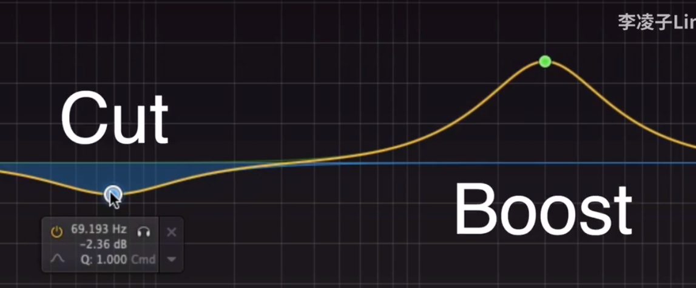

例子：如果为-3 dBFS，则表明距离失真还有-3dB的动态余量


## General MIDI

General MIDI，简称GM，是MIDI的统一规格。GM patches中的patches指的是：一组预设的声音

GM仪器必须遵循以下关于乐器音色（program）以及控制事件（controller events）的惯例：

**音色转换事件（Program change events）**

以下的表单，列出各乐器音与与相应的音色编号（program change number）。

**旋律音色（Melodic sounds）**

| No.                                    | 英语                     | 中文                                                      |                                                              |
| -------------------------------------- | ------------------------ | --------------------------------------------------------- | ------------------------------------------------------------ |
| Piano（钢 琴）                         |                          |                                                           |                                                              |
| 1                                      | Acoustic Grand Piano     | 平台钢琴                                                  |                                                              |
| 2                                      | Bright Acoustic Piano    | 亮音钢琴                                                  |                                                              |
| 3                                      | Electric Grand Piano     | 电子钢琴                                                  |                                                              |
| 4                                      | Honky-tonk Piano         | 叮当琴（酒吧钢琴）                                        |                                                              |
| 5                                      | Electric Piano 1         | 电子琴 1                                                  |                                                              |
| 6                                      | Electric Piano 2         | 电子琴 2                                                  |                                                              |
| 7                                      | Harpsichord              | 羽管键琴、大键琴                                          |  |
| 8                                      | Clavinet                 | 电子击弦古钢琴                                            |                                                              |
| Chromatic Percussion（半音阶打击乐器） |                          |                                                           |                                                              |
| 9                                      | Celesta                  | 金属片琴                                                  |  |
| 10                                     | Glockenspiel             | [钟琴](https://baike.baidu.com/item/钟琴)、钢片琴         |  |
| 11                                     | Musical box              | [音乐盒](https://baike.baidu.com/item/音乐盒)、八音盒     |                                                              |
| 12                                     | Vibraphone               | [电颤琴](https://baike.baidu.com/item/电颤琴)             |  |
| 13                                     | Marimba                  | [马林巴琴](https://baike.baidu.com/item/马林巴琴)         |  |
| 14                                     | Xylophone                | [木琴](https://baike.baidu.com/item/木琴)                 |  |
| 15                                     | Tubular Bell             | [管钟](https://baike.baidu.com/item/管钟)                 |  |
| 16                                     | Dulcimer                 | [扬琴](https://baike.baidu.com/item/扬琴)                 |                                                              |
| Organ（风琴）                          |                          |                                                           |                                                              |
| 17                                     | Drawbar Organ            | 音栓风琴、拉杆式风琴                                      |                                                              |
| 18                                     | Percussive Organ         | 敲击风琴                                                  |                                                              |
| 19                                     | Rock Organ               | 摇滚管风琴                                                |                                                              |
| 20                                     | Church organ             | 教堂管风琴                                                |  |
| 21                                     | Reed organ               | 簧风琴                                                    |  |
| 22                                     | Accordion                | [手风琴](https://baike.baidu.com/item/手风琴)             |  |
| 23                                     | Harmonica                | [口琴](https://baike.baidu.com/item/口琴)                 |                                                              |
| 24                                     | Tango Accordion          | 探戈手风琴                                                |                                                              |
| Guitar（吉他）                         |                          |                                                           |                                                              |
| 25                                     | Acoustic Guitar（nylon） | 木吉他（尼龙弦）                                          |                                                              |
| 26                                     | Acoustic Guitar（steel） | 木吉他（钢弦）                                            |                                                              |
| 27                                     | Electric Guitar（jazz）  | 电吉他（爵士）                                            |                                                              |
| 28                                     | Electric Guitar（clean） | 电吉他（原音）                                            |                                                              |
| 29                                     | Electric Guitar（muted） | 电吉他（闷音）                                            |                                                              |
| 30                                     | Overdriven Guitar        | 电吉他（破音）                                            |                                                              |
| 31                                     | Distortion Guitar        | 电吉他（失真）                                            |                                                              |
| 32                                     | Guitar harmonics         | 吉他合声                                                  |                                                              |
| Bass（贝斯）                           |                          |                                                           |                                                              |
| 33                                     | Acoustic Bass            | [贝斯](https://baike.baidu.com/item/贝斯)                 |                                                              |
| 34                                     | Electric Bass（finger）  | 电贝斯（finger）                                          |                                                              |
| 35                                     | Electric Bass（pick）    | 电贝斯（pick）                                            |                                                              |
| 36                                     | Fretless Bass            | 无格贝斯                                                  |                                                              |
| 37                                     | Slap Bass 1              | 重贝斯 1                                                  |                                                              |
| 38                                     | Slap Bass 2              | 重贝斯 2                                                  |                                                              |
| 39                                     | Synth Bass 1             | 合成贝斯 1                                                |                                                              |
| 40                                     | Synth Bass 2             | 合成贝斯 2                                                |                                                              |
| Strings（弦乐器）                      |                          |                                                           |                                                              |
| 41                                     | Violin                   | [小提琴](https://baike.baidu.com/item/小提琴)             |                                                              |
| 42                                     | Viola                    | [中提琴](https://baike.baidu.com/item/中提琴)             |                                                              |
| 43                                     | Cello                    | [大提琴](https://baike.baidu.com/item/大提琴)             |                                                              |
| 44                                     | Contrabass               | [低音提琴](https://baike.baidu.com/item/低音提琴)         |                                                              |
| 45                                     | Tremolo Strings          | 颤弓弦乐                                                  |                                                              |
| 46                                     | Pizzicato Strings        | 弹拨弦乐                                                  |                                                              |
| 47                                     | Orchestral Harp          | [竖琴](https://baike.baidu.com/item/竖琴)                 |                                                              |
| 48                                     | Timpani                  | [定音鼓](https://baike.baidu.com/item/定音鼓)             |                                                              |
| Ensemble（合奏）                       |                          |                                                           |                                                              |
| 49                                     | String Ensemble 1        | 弦乐合奏 1                                                |                                                              |
| 50                                     | String Ensemble 2        | 弦乐合奏 2                                                |                                                              |
| 51                                     | Synth Strings 1          | 合成弦乐 1                                                |                                                              |
| 52                                     | Synth Strings 2          | 合成弦乐 2                                                |                                                              |
| 53                                     | Voice Aahs               | “阿”音                                                    |                                                              |
| 54                                     | Voice Oohs               | “喔”音                                                    |                                                              |
| 55                                     | Synth Voice              | 合成人声                                                  |                                                              |
| 56                                     | Orchestra Hit            | 交响打击乐                                                |                                                              |
| Brass（铜管乐器）                      |                          |                                                           |                                                              |
| 57                                     | Trumpet                  | [小号](https://baike.baidu.com/item/小号)                 | 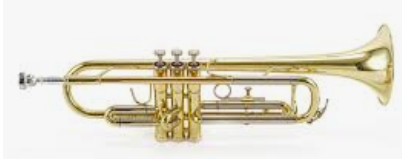 |
| 58                                     | Trombone                 | [长号](https://baike.baidu.com/item/长号)                 |  |
| 59                                     | Tuba                     | 大号（吐巴号、低音号）                                    |                                                              |
| 60                                     | Muted Trumpet            | 闷音小号                                                  |                                                              |
| 61                                     | French horn              | 法国号（圆号）                                            |  |
| 62                                     | Brass Section            | [铜管乐](https://baike.baidu.com/item/铜管乐)             |                                                              |
| 63                                     | Synth Brass 1            | 合成铜管 1                                                |                                                              |
| 64                                     | Synth Brass 2            | 合成铜管 2                                                |                                                              |
| Reed（簧乐器）                         |                          |                                                           |                                                              |
| 65                                     | Soprano Sax              | 高音萨克斯风                                              | 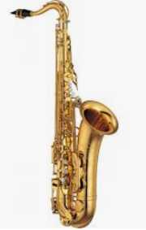 |
| 66                                     | Alto Sax                 | [中音萨克斯风](https://baike.baidu.com/item/中音萨克斯风) |                                                              |
| 67                                     | Tenor Sax                | 次中音萨克斯风                                            |                                                              |
| 68                                     | Baritone Sax             | 上低音萨克斯风                                            |                                                              |
| 69                                     | Oboe                     | [双簧管](https://baike.baidu.com/item/双簧管)             |  |
| 70                                     | English Horn             | [英国管](https://baike.baidu.com/item/英国管)             | 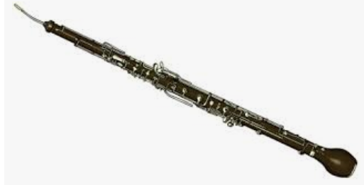 |
| 71                                     | Bassoon                  | 低音管（巴颂管）                                          |  |
| 72                                     | Clarinet                 | 单簧管（黑管、竖笛）                                      |                                                              |
| Pipe（吹管乐器）                       |                          |                                                           |                                                              |
| 73                                     | Piccolo                  | [短笛](https://baike.baidu.com/item/短笛)                 |                                                              |
| 74                                     | Flute                    | [长笛](https://baike.baidu.com/item/长笛)                 |                                                              |
| 75                                     | Recorder                 | [直笛](https://baike.baidu.com/item/直笛)                 |  |
| 76                                     | Pan Flute                | [排笛](https://baike.baidu.com/item/排笛)                 |  |
| 77                                     | Blown Bottle             | 瓶笛                                                      |                                                              |
| 78                                     | Shakuhachi               | [尺八](https://baike.baidu.com/item/尺八)                 |                                                              |
| 79                                     | Whistle                  | [哨子](https://baike.baidu.com/item/哨子)                 |                                                              |
| 80                                     | Ocarina                  | [陶笛](https://baike.baidu.com/item/陶笛)                 |                                                              |
| Synth Lead（合成音 主旋律）            |                          |                                                           |                                                              |
| 81                                     | Lead 1（square）         | [方波](https://baike.baidu.com/item/方波)                 |                                                              |
| 82                                     | Lead 2（sawtooth）       | [锯齿波](https://baike.baidu.com/item/锯齿波)             |                                                              |
| 83                                     | Lead 3（calliope）       | [汽笛风琴](https://baike.baidu.com/item/汽笛风琴)         |                                                              |
| 84                                     | Lead 4（chiff）          | 合成吹管                                                  |                                                              |
| 85                                     | Lead 5（charang）        | 合成电吉他                                                |                                                              |
| 86                                     | Lead 6（voice）          | 人声键盘                                                  |                                                              |
| 87                                     | Lead 7（fifths）         | 五度音                                                    |                                                              |
| 88                                     | Lead 8（bass + lead）    | 贝士吉他合奏                                              |                                                              |
| Synth Pad（合成音—和弦衬底）           |                          |                                                           |                                                              |
| 89                                     | Pad 1（new age）         | 新世纪                                                    |                                                              |
| 90                                     | Pad 2（warm）            | 温暖                                                      |                                                              |
| 91                                     | Pad 3（polysynth）       | 多重合音                                                  |                                                              |
| 92                                     | Pad 4（choir）           | 人声合唱                                                  |                                                              |
| 93                                     | Pad 5（bowed）           | 玻璃                                                      |                                                              |
| 94                                     | Pad 6（metallic）        | 金属                                                      |                                                              |
| 95                                     | Pad 7（halo）            | 光华                                                      |                                                              |
| 96                                     | Pad 8（sweep）           | 扫掠                                                      |                                                              |
| Synth Effects（合成音—效果）           |                          |                                                           |                                                              |
| 97                                     | FX 1（rain）             | 雨                                                        |                                                              |
| 98                                     | FX 2（soundtrack）       | 电影音效                                                  |                                                              |
| 99                                     | FX 3（crystal）          | 水晶                                                      |                                                              |
| 100                                    | FX 4（atmosphere）       | 气氛                                                      |                                                              |
| 101                                    | FX 5（brightness）       | 明亮                                                      |                                                              |
| 102                                    | FX 6（goblins）          | 魅影                                                      |                                                              |
| 103                                    | FX 7（echoes）           | 回音                                                      |                                                              |
| 104                                    | FX 8（sci-fi）           | 科幻                                                      |                                                              |
| Ethnic（民 族 乐 器）                  |                          |                                                           |                                                              |
| 105                                    | Sitar                    | [西塔琴](https://baike.baidu.com/item/西塔琴)             |  |
| 106                                    | Banjo                    | 五弦琴（斑鸠琴）                                          |                                                              |
| 107                                    | Shamisen                 | [三味线](https://baike.baidu.com/item/三味线)             |                                                              |
| 108                                    | Koto                     | 十三弦琴（古筝）                                          |                                                              |
| 109                                    | Kalimba                  | 卡利玛钟琴                                                |                                                              |
| 110                                    | Bagpipe                  | [苏格兰风笛](https://baike.baidu.com/item/苏格兰风笛)     |                                                              |
| 111                                    | Fiddle                   | 古提琴                                                    |                                                              |
| 112                                    | Shanai                   | [唢呐](https://baike.baidu.com/item/唢呐)                 |                                                              |
| Percussive（打 击 乐 器）              |                          |                                                           |                                                              |
| 113                                    | Tinkle Bell              | 叮当铃                                                    |                                                              |
| 114                                    | Agogo                    | 阿哥哥鼓                                                  |                                                              |
| 115                                    | Steel Drums              | [钢鼓](https://baike.baidu.com/item/钢鼓)                 |                                                              |
| 116                                    | Woodblock                | [木鱼](https://baike.baidu.com/item/木鱼)                 |                                                              |
| 117                                    | Taiko Drum               | [太鼓](https://baike.baidu.com/item/太鼓)                 |                                                              |
| 118                                    | Melodic Tom              | 古式高音鼓                                                |                                                              |
| 119                                    | Synth Drum               | 合成鼓                                                    |                                                              |
| 120                                    | Reverse Cymbal           | 回音钹                                                    |                                                              |
| Sound effects（特 殊 音 效）           |                          |                                                           |                                                              |
| 121                                    | Guitar Fret Noise        | 吉他品格杂音                                              |                                                              |
| 122                                    | Breath Noise             | 呼吸杂音                                                  |                                                              |
| 123                                    | Seashore                 | 海岸                                                      |                                                              |
| 124                                    | Bird Tweet               | 鸟鸣                                                      |                                                              |
| 125                                    | Telephone Ring           | 电话铃声                                                  |                                                              |
| 126                                    | Helicopter               | 直升机                                                    |                                                              |
| 127                                    | Applause                 | 拍手                                                      |                                                              |
| 128                                    | Gunshot                  | 枪声                                                      |                                                              |

**打击乐音符（Percussion notes）**

在General MIDI中，频道10被保留作为打击乐器使用，不论音色编号为何。 不同的音符对应到不同的打击乐器。见下表：

| No.  | English         | 中文                                                  |
| ---- | --------------- | ----------------------------------------------------- |
| 35   | Bass Drum 2     | [大鼓](https://baike.baidu.com/item/大鼓) 2           |
| 36   | Bass Drum 1     | [大鼓](https://baike.baidu.com/item/大鼓) 1           |
| 37   | Side Stick      | 小鼓鼓边                                              |
| 38   | Snare Drum 1    | [小鼓](https://baike.baidu.com/item/小鼓) 1           |
| 39   | Hand Clap       | 拍手                                                  |
| 40   | Snare Drum 2    | [小鼓](https://baike.baidu.com/item/小鼓) 2           |
| 41   | Low Tom 2       | 低音鼓 2                                              |
| 42   | Closed Hi-hat   | 闭合开合钹                                            |
| 43   | Low Tom 1       | 低音鼓 1                                              |
| 44   | Pedal Hi-hat    | 脚踏开合钹                                            |
| 45   | Mid Tom 2       | 中音鼓 2                                              |
| 46   | Open Hi-hat     | 开放开合钹                                            |
| 47   | Mid Tom 1       | 中音鼓 1                                              |
| 48   | High Tom 2      | 高音鼓 2                                              |
| 49   | Crash Cymbal 1  | 强音钹 1                                              |
| 50   | High Tom 1      | 高音鼓 1                                              |
| 51   | Ride Cymbal 1   | 打点钹 1                                              |
| 52   | Chinese Cymbal  | [钹](https://baike.baidu.com/item/钹)                 |
| 53   | Ride Bell       | 响铃                                                  |
| 54   | Tambourine      | [铃鼓](https://baike.baidu.com/item/铃鼓)             |
| 55   | Splash Cymbal   | 小钹铜钹                                              |
| 56   | Cowbell         | [牛铃](https://baike.baidu.com/item/牛铃)             |
| 57   | Crash Cymbal 2  | 强音钹 2                                              |
| 58   | Vibra Slap      | 噪音器                                                |
| 59   | Ride Cymbal 2   | 打点钹 2                                              |
| 60   | High Bongo      | 高音邦加鼓                                            |
| 61   | Low Bongo       | 低音邦加鼓                                            |
| 62   | Mute High Conga | 闷音高音[康加鼓](https://baike.baidu.com/item/康加鼓) |
| 63   | Open High Conga | 开放高音[康加鼓](https://baike.baidu.com/item/康加鼓) |
| 64   | Low Conga       | 低音[康加鼓](https://baike.baidu.com/item/康加鼓)     |
| 65   | High Timbale    | 高音天巴鼓                                            |
| 66   | Low Timbale     | 低音天巴鼓                                            |
| 67   | High Agogo      | 高音阿哥哥                                            |
| 68   | Low Agogo       | 低音阿哥哥                                            |
| 69   | Cabasa          | [串珠](https://baike.baidu.com/item/串珠)             |
| 70   | Maracas         | 沙铃                                                  |
| 71   | Short Whistle   | 短[口哨](https://baike.baidu.com/item/口哨)           |
| 72   | Long Whistle    | 长[口哨](https://baike.baidu.com/item/口哨)           |
| 73   | Short Guiro     | 短刮壶                                                |
| 74   | Long Guiro      | 长刮壶                                                |
| 75   | Claves          | [梆子](https://baike.baidu.com/item/梆子)             |
| 76   | High Wood Block | 高音[木鱼](https://baike.baidu.com/item/木鱼)         |
| 77   | Low Wood Block  | 低音[木鱼](https://baike.baidu.com/item/木鱼)         |
| 78   | Mute Cuica      |                                                       |
| 79   | Open Cuica      |                                                       |
| 80   | Mute Triangle   | 闷音[三角铁](https://baike.baidu.com/item/三角铁)     |
| 81   | Open Triangle   | 开放[三角铁](https://baike.baidu.com/item/三角铁)     |

**控制器事件（Controller events）**

GM也同时规范了数个控制器的工作

| No.  | 功能                                                    |
| ---- | ------------------------------------------------------- |
| 1    | Modulation（[颤音](https://baike.baidu.com/item/颤音)） |
| 6    | Data Entry [MSB](https://baike.baidu.com/item/MSB)      |
| 7    | Volume（音量）                                          |
| 10   | Pan（相位）                                             |
| 11   | Expression（表达）                                      |
| 38   | Data Entry [LSB](https://baike.baidu.com/item/LSB)      |
| 64   | Sustain（延音）                                         |
| 100  | RPN LSB                                                 |
| 101  | RPN MSB                                                 |
| 121  | Reset all controllers（重设所有控制器）                 |
| 123  | All notes off（消音）                                   |

**RPN（Registered Parameter Number）**

设定登录的参数需要传送（数字是十进制）：

两个控制转换讯息（Control Change messages），使用控制号码101和100去选择参数跟着任何1或2bytes的资料入口讯息（Data Entry messages）(MSB = 控制器 #6, LSB = 控制器 #38)最后是"End of RPN" 讯息，即表示结束之讯息以下的全球Registered Parameter Numbers (RPNs) 是经过标准化的（参数由RPN LSB/MSB对规范，值则由Data Entry LSB/MSB对设定）：

| MSB  | LSB  | 意义                                   |
| ---- | ---- | -------------------------------------- |
| 0    | 0    | Pitch bend range（滑音范围）           |
| 0    | 1    | Channel Fine tuning（频道细调）        |
| 0    | 2    | Channel Coarse tuning（频道粗调）      |
| 0    | 3    | Tuning Program Change（转换调节音色）  |
| 0    | 4    | Tuning Bank Select（转换调节群组）     |
| 0    | 5    | Modulation Depth Range（颤音深度范围） |
| 127  | 127  | RPN Null                               |

例：用RPN控制串设定粗调（coarse tuning）至A440（参数 2，值 64）

101:0, 100:2, 6:64, 101:127, 100:127

# 风格

因素：旋律搭配、和弦进行（和声）、节奏型、律动

Bass Music： 电子舞曲中的一种 以鼓和贝斯为主导 通常有变化多端连绵起伏的bass，包括DnB、Jungle、Dubstep（广义）、EDM Trap等等

狭义Dubstep（UK dubstep）： Bass Music中的一种，通常具有2-step节奏型，通常bpm140左右 实际大概是70bpm左右的咚-哒-咚-哒节奏，伴随连绵起伏的wobble bass，整体曲风黑暗沉稳

Brostep（Heavy Dubstep）：dubstep的衍生风格，bass更加粗犷，曲风更高调，鼓点更重

（广义来说Dubstep是UK Dubstep及其衍生风格的统称）

House 电子舞曲的一种，主要节奏型是bpm120-130的动次打次，子风格很多，现在商业EDM主力军也是各种house

EDM：电子舞曲Electronic Dance Music的缩写，一般来讲包括所有“电子”的“舞曲”，节奏循环往复，律动性很强。Bass Music、Techno、Trance、House这些都算EDM

狭义的EDM是近几年出现的概念，一般是指短小精悍、商业化的快餐电子舞曲，时长很难超过5分钟，就是全场嗨一下然后就切歌的那种。有时也作为前缀标签，比如EDM Psy Trance


## 爵士乐

https://zh.wikipedia.org/zh-cn/%E7%88%B5%E5%A3%AB%E4%B9%90

知识图谱：https://en.wikipedia.org/wiki/Template:Jazz

Twelve-bar blues

## City Pop

教程关键词：シティポップの作り方

https://zh.wikipedia.org/zh-cn/%E5%9F%8E%E5%B8%82%E6%B5%81%E8%A1%8C

https://www.sohu.com/a/404414349_562485?_f=index_pagefocus_3&_trans_=000014_bdss_dknfqjy

https://www.youtube.com/results?search_query=city+pop+composition

https://www.youtube.com/watch?v=Hbt7FCVHyfE&list=RDHbt7FCVHyfE&start_radio=1

City Pop 是日本经济泡沫时代背景下形成的音乐类型。彼时沉浸于欢脱和奢靡之中的日本民众不再能够欣赏传统民谣这般苦涩的「靡靡之音」，从美国流入日本的 Disco、Funk、Jazz 以及当时正在浪头的 New Wave 等多种音乐流派给城市带来了全新的生命活力。然而来自西洋的音乐又尚且有距离感，于是日本的人们开始往传统的日式歌曲中灌入西洋的元素，并在日本都市的独特洗练下，用来描绘享乐生活和度假心情。 City Pop 不仅仅是一种音乐流派，它更是用来表达日本都市生活者价值观和感情的独有美学。

二战后美国对日本的重建改革，加上后来日本在朝鲜战争、越南战争期间巧妙发挥自身优势，60 年代末的日本已一跃成为世界第二大经济体。到了 70 年代之后高度发达的汽车制造业和诸如索尼 Walkman 之类的消费电子产品更让日本政府和人民都呈现出生活富裕的状态。一个空前繁荣国家和无法安分守己的社会与传统保守的儒家传统价值观碰撞，左翼运动开始式微，这些都让发展主义和享乐主义的价值观深入人心。因此理所当然地，日本人对于文化娱乐消费方面也展现了前所未有的需求： **人们开始听美国流行音乐，并试图从漫画和电影中了解美国中产阶级的享乐生活**，爵士乐伴随着各种酒吧和咖啡馆爆发式生长，60 年代因饱含沉重人生和社会批判题材而风靡日本的传统民谣在如此的背景之下亦变得不再流行。

City Pop 的根基其实是电子合成器音乐，故有日本化「Synth Pop」之称。

山下达郎在 1980 年发行的《Ride On Time》一直被认为是 City Pop 音乐的开山之作。这首歌将 Funk 的吉他节奏放到了合成器键盘上，将电子鼓机融合进爵士乐的散乱编曲中，这种结构上看似复杂、听起来却相当轻松的编排形成了一种新式的舞曲风格。
「现在马上奔向湛蓝的水平线/集中精神感受时光的消逝/Ride On Time 点燃心中的火焰」——这首讲述快消爱情、夏日海滩、及时行乐，轻浮浪漫感满溢的歌曲瞬间传遍日本的大街小巷，成为了都市年轻男女的最佳配乐

除了山下达郎、竹内玛莉亚夫妇以外，书写 City Pop 历史的还有一大批代表性创作者。例如在 80 年代初期大受欢迎的 寺尾聪便以一首满载都市孤独男性本色的 《ルビーの指環》大卖超过 160 万张，在当时受到老老少少的欢迎，而此次的大畅销也将 City Pop 推上了日本乐坛的主流。在他之后，包括 池田聪、 松田圣子、 菊池桃子等等偶像级别的人物都以演唱 City Pop 曲风而闻名， 矢泽永吉、 井上阳水等的摇滚及民谣资深唱将也因走 City Pop 路线而大卖特卖。当然还有歌曲都市感极强的 杉山清贵、 大贯妙子、 角松敏生，在专辑封面上可圈可点的 大泷咏一、 佐藤博、 浜田金吾都是将 City Pop 这一音乐流派推向顶峰的重要功臣。

我国亦涌现了不少主打 City Pop 的乐队或音乐人，例如台湾的乐队落日飞车及女歌手 9m88 便是两大典型代表

### 视觉美学

山下达郎的一首《Ride On Time》，我们光是从歌词内容上就能非常直观地体会到它的音乐画面。以至于后来很多人把 山下达郎的 City Pop 音乐归为「日间派」，通常描绘夏日和海滩，曲风也较为清新明亮，这也是 City Pop 专辑中最常见的风格。其实除了 Jazz、Funk、Disco 等音乐元素以外，City Pop 本身就与源自美国加州西海岸的 Surf Rock（冲浪摇滚）有着相似的精神内核。为了突出这样的主题和美学，当时不少音乐人都将大海、沙滩、冲浪的景象直接作为专辑封面上：像是山下达郎 1984 年的《Big Wave》、菊池桃子 1986 年的《ADVENTURE》，还有 2010 年代以后再次将 City Pop 音乐带回乐坛的女歌手一十三十一也有多张类似风格的主题封面。 

另一类则是以角松敏生为代表的「夜间派」，往往勾勒出夜晚与城市的画面，多用都市夜景作为封面，歌词内容所描写的通常是都市的痴男怨女和夜生活，曲风也更接近于 R&B 的感觉。

代表动画（大量使用City Pop）：猫眼三姐妹（由女歌手杏里演唱的 City Pop 风格动画主题曲以动感的 Funk、舞曲风格充分匹配了如此的夜都市浪漫感）、城市猎人、加州危机、 回首再见她、街角的童话、轻井泽症候群

### 蒸汽波

蒸汽波是一种「拿来主义」的电子舞曲制作形式，即采样多年前的欧美、日本流行歌曲（多为 80 年代 City Pop）的片段，将其进行大量如放慢、倒带、刻意做旧、扩大音场等后期手法重造。《Plastic Love》便是蒸汽波采样曲名单中的主角，采样次数多到经常被歌迷戏称「流水的蒸汽波，铁打的塑料爱」。

但是对于蒸汽波音乐界人士来说，这首「塑料爱」并不是一切的开端。北美电子音乐人 Macintosh Plus 被认为是蒸汽波音乐的鼻祖，他于 2011 年发行的专辑 《フローラルの専門店》（Floral Shoppe）从音乐风格到视觉艺术的呈现上都奠定了后来蒸汽波的基本结构。这张专辑封面中的复古平面设计、罗马雕塑半身像、日本文化等等元素也成为了往后蒸汽波的标配。在 Macintosh Plus 之后，无数蒸汽波创作者像雨后春笋般涌出，从墨西哥的蒸汽波组合 MACROSS 82-99、美国的 YUNG BAE，到意大利的 bl00dwave…… 诸如此类的音乐人层出不穷，他们都试图从日本 80 年代泛 Funk 乐曲当中挖掘灵感。

提起蒸汽波，很多人脑海里第一个浮现的画面便是城市里高频流动的车辆、的士里的深夜广播、情色理发店的条形霓虹灯、酒馆里谈天说地的孤男寡女、老式电视的显示屏和盒式录像带的噪波——而 80 年代的日本动画所描绘的场景中恰好包含了所有蒸汽波应有的元素。于是， 蒸汽波不但将 City Pop 音乐作为灵感来源，也将日本黄金时代的动漫作为封面或 MV 紧紧地捆绑在了一起。

## 土、烂俗、Low

[《从作曲的角度分析，抖音神曲和优质流行歌的差距到底在哪里》](https://zhuanlan.zhihu.com/p/150117443)

[从周传雄、薛之谦、隔壁老樊来看华语乐坛创作水平的下降丨深度分析](https://zhuanlan.zhihu.com/p/150872514)

“土、俗”，往往就是指那些听感单调、陈旧、不和谐、同质化严重、千篇一律的作品

所谓“俗”，字面意思上理解，就是俗套、庸俗，就好比写文章时，那些没有新意、没有亮点的文字、情节。具体投射到作曲中，可以理解为：在烂大街的和弦走向中，大量使用同质程度高的旋律组合，节奏型单调的曲子。

特点

* 选用最常见、烂大街的和弦进行，且毫无变化。解决：即使在套路化的和弦框架内，依然可以利用很多作曲上的技法，把曲子写出不俗的听感
* 用已经在无数作品中出现的同质化旋律，并以此为“亮点”，在作品中大量重复，千篇一律。
  为了避免同质化的旋律，可以有意识地去减少高同质度的动机的使用率，尽可能给听众带来耳目一新的感觉
* 曲子节奏单一，四平八稳，变化较少。解决：在遵循一定规律和章法的条件下，丰富曲子的节奏和律动，活用切分音、反拍等手法，让曲子更“活”，避免节奏上的死板

## New Age

钢琴采用大的回响，听起来比较空灵

New Age的配器大多很简单，不过会追求新颖，加一些独特的小众乐器（大多来自世界音乐World Music），比如陶笛奥卡利那笛之类的。

## 阴森

林夕作词的那首幽媾之往生：https://www.zhihu.com/question/27059706

首先你要确定自己BGM的风格，因为用不同配器都能编出阴森的音乐，但用途各异，比如你需要给中世纪奇幻电影配阴森的BGM，就不能使用合成器音色。配乐的曲风一定要跟你整体的风格匹配。然后看用途1.如果只是为了烘托氛围。首先是Drone类音色铺底，然后是大量PAD音色叠加。一般而言，这两类音色最好不要演奏和弦，那样会太厚了，而且会形成不必要的情绪，造成喧宾夺主的效果。我们只需要用低音把观众的肾上腺素调动起来就行。这两类音色（有的音源里还会提供Soundscape、Ambience类铺垫音色，也可以用）要选择细节丰富一些的，内部稍有纹理变化的，以避免单调，像Padshop、Omnisphere都是神器，当然你自己用合成器调一个也行。然后是节奏类音色，这看需要，有时候需要在BGM里加一些节奏，主要使用工业感强一些的打击乐器，像Action strike这种音源里的loop可以借用一下，但切记喧宾夺主，点缀一下就好。最后就是音效。一些扭曲的工业音效能起到吓人的效果。如果不需要吓人就适当使用平缓一些的音效推动一下就行，推荐USB X-treme FX音源。必要时，可用噪音或失真度极强的音色。若风格要求不可以使用原声乐器，比如cyber punk，那就用合成器搞定上述一切。如果不可以使用合成乐器，比如好莱坞奇幻电影，那就用管弦来搞定。Drone和pad都可以用提琴的连奏，音效可用提琴制造的音效——好一些的弦乐音源都有提琴音效，专门给恐怖片用的。节奏的话，如果需要还是得从Action strike里找。2.其他音乐性较强的桥段。目的不是为了烘托氛围，只是在推进剧情时，想时不时的吓一下观众，或需要大量调动观众情感——总之是动态较强的音乐——就用大量的增减和弦的弦乐、管乐，吉他分解和弦。调式用和声小调、旋律小调或其它不常见的调式，或干脆用无调性乐器。推荐BigfishAudio的Zodiac，里面有大量实验性和无调性乐器。还是跟上一段一样，如果是现代一些的风格就用合成器或电吉他，古典一些就用管弦和Organ类。根据配乐的风格不同，可以选择模仿一些既有的音乐风格有时候会有事半功倍的效果，比较成功的例子是寂静岭的配乐。现实中常见的公认的阴森的音乐有：Trip-hop（尤其Portishead，节奏极慢，大量老电影采样）、Trap（节奏极慢）、工业氛围（例如Most of the taciturn）、古典一些的如Darkwave（例如Eland，他们用了大量的圣咏）、死亡民谣（例如Current93）、中世纪音乐（例如This mortal coil）等风格。吸收这些风格中的阴森部分，学习他们的配器，使用在配乐里会有奇效。题主说道钢琴，钢琴是万金油，而且加以调教其实能替代很多声部，比如你可以用大量效果器处理钢琴，让它变成扭曲的音效。或者调整钢琴的采样的ADSR让它变成Pad，再加以各种效果器。应该能胜任的场合会更广一些。

乐器：水琴

低频与高频远离开阔，中间可以尝试写一些细碎的离调音，不协和音程增加紧张度。

洛克里安调试，或者小调用一个小三降6和弦

大量运用增四度(减五度)，大小二度，你可以试着用钢琴直接弹增四度琶音应该就有点感觉了。可以用一组半音阶不断重复，能制造紧张的效果

增减和弦、洛克里安、全音阶做loop、管风琴，倍大错位拨弦

## Jazz HipHop

Beat

* Soft jazz piano

* retro funk drums。听起来像Bomb bap（底鼓加军鼓，鼓点被高度强调，比较震撼）：https://rhythm-lab.com/breakbeats，由70s的真人演奏，the slight offbeat hits and human dynamics的效果不是机械式的程序能够模拟的。

  适合被采样的：Jazz pianist Vince Guaraldi

* juxtaposing modern vibes with old-school flavor

## Hiphop

结构：https://zhuanlan.zhihu.com/p/29833754

### 常见曲风

Old School：70~90年代的饶舌曲风。具体又分东岸与西岸。
东岸的鼓点比较中规中矩，歌词相对沉重，牵涉到政治、种族等社会问题。代表人物：阿姆
西岸（West Coast）。鼓点大气，kicks，常带有一点hihat，snare通常拖得比较长，曲风相对轻松（话题阳光、海岸、沙滩）。代表人物：Dr.dre、五角。

南岸（South Side），偏派对舞曲，延伸曲风如Crunk。代表乐器808底鼓常出现在Trap与Crunk音乐中。

Trap：通常有跟南岸一样的808底鼓，并且更明显。hihat活泼乱跳

grime：融合电子乐元素，rapper用old school的flow跟唱腔

gangster：帮派，江湖味重。经常涉及贫民窟、枪支、毒品。GAI

G-Funk（G=gangster）。snoop dogg


## 中国风（广义。包括古风）

[中国有形成过一套像西方音乐一样完整的音乐体系吗？](https://www.zhihu.com/question/348680171)

### 导读

"中国风”字面上的意思就是具有中国味的音乐风格，是三古三新（古辞赋、古文化、古旋律、新唱法、新编曲、新概念）结合的中国独特乐种。歌词具有中国文化内涵，使用现代音乐唱法和编曲技巧烘托歌曲氛围。歌曲以古代的中国背景与现代节奏的结合，制作出含蓄、忧愁、幽雅、轻快等意境。“中国风”分为纯粹中国风和近中国风两种：纯粹中国风是满足以上六大条件的歌曲；近中国风是某些条件不能满足但又很接近于纯粹中国风的歌曲。
“中国风”歌曲与传统中国音乐的区别主要在于编曲（节奏、和声、编曲概念与风格）、曲式结构、唱腔的不同。

* “中国风”音乐的编曲新概念和新风格：“中国风”音乐的编曲新概念和新风格体现在歌曲中就是中国传统音乐元素结合现代音乐（Hip-hop、R&B、电子等）的节奏、旋律、和声，并加入特殊音效，在流行歌曲编曲概念嵌入情节对话等。比如风声—林俊杰《江南》、胡彦斌《红颜》，雨声——周杰伦《发如雪》，冷兵器相撞声——周华健《刀剑如梦》、原生态人声采样（呼麦）——王力宏《那在遥远的地方》等，还可以使用不断升Key法、无乐器人声伴奏法等。
* “中国风”音乐的节奏：在“中国风”改编的传统音乐中加入流行音乐的节奏，把古老的旋律变得更加流行、时尚。
  最主要的节奏变化是现代节奏讲究低音，如底鼓贝斯这些节奏点强的乐器而中国传统音乐比如戏曲、民歌等历来是没有低音这个概念的，就算节奏乐器也是高音的“滴滴哒哒”。而现在加入了低音的节奏点，使得歌曲更加富有张力和融合性，更具现代音乐的动感更符合现代人的审美观念。比如将Hip-hop风格音乐中的Loop巧妙地结合到了中国风音乐中，像陶告吉的《苏三说》、王力宏的《在梅边》等，都是中国风音乐京剧唱腔+Rap+Loop很好的例子。
* “中国风”音乐的和声：中国传统音乐历来是没有和声这个概念的，民族乐器大多都是独奏乐器。而像吉他、钢琴这类又能独奏又能伴奏的乐器，更是少之又少。“中国风”歌曲广泛使用现代音乐和声进行作为歌曲构架，使用西洋乐器比如木/电吉他(Acoustic/Electric Guitar)、钢琴(Piano)、电钢琴(Electric Piano)等作为节奏和声乐器，使用民族乐器作为旋律乐器，充当如副旋律、填充、长音旋律线等角色。“中国风”的很多歌曲编曲中都使用了像7、9、11、13等延伸和弦或延留挂留和弦。现代和声的运用，增强了歌曲的广度和深度，再加上民族乐器娓娓道来、交相辉映，营造出一个古色古香的泼墨山水画氛围。
* “中国风”音乐的曲式：“中国风”歌曲曲式结构是常见的流行音乐曲式分为乐段、二部曲式和三部曲式。一般乐段的结构较少见。
* “中国风”音乐的唱腔：演唱“中国风”歌曲的唱腔跟传统唱法有很大区别，主要以流行唱法为主，加入R&B、嘻哈(Hip-hop)、灵魂乐(Soul)等美式现代音乐唱法，在中文发音基础上加上西方韵味或者英语单词、转音，增加歌曲现代感，使之更国际化。一些华语艺人还会在歌曲中间偶尔穿插戏曲唱法上如京剧唱法、秦腔，更增添一股浓浓的中国风味。

注意：大部分“中国风”音乐都比较低劣，学习知识时要注意取舍

流行音乐（嘻哈、R&B、电子、摇滚等）+民族配器的结合。如果把民族配器去掉，其实跟一般流行音乐相差不大。

特别注意：中国风，不能算是一种音乐形式，而是以某一种音乐类型为基础，在其中置入中国风元素。中国风元素与其他音乐风格相碰撞，才会产生火花。因此其实所有风格都可以变成“中国风”

### 主要分支

* R&B：陶喆的《Susan说》（节奏感非常鲜明，曲子流畅，唱腔随意）
* 嘻哈：《盖世英雄》——王力宏（很难听，之后换个例子。节奏感鲜明，律动感也比R&B更强，旋律以Rap为主，会穿插五声音阶的旋律）
* 电子：西皮士。（有点像new age空灵+环境音？？？PAD合成器）
* 有点new age：《宁月 Silent Moon》——和平之月
* 摇滚：《曹操》——林俊杰（注意：这首歌没有使用民族乐器，但歌词、编配和旋律总体的感受而言，是有中国风色彩的）

《芊芊》，回音哥正式打入流行乐坛之作，曲风中带有J-Pop的影子（银临的《锦鲤抄》更加明显），加入民族乐器，加入五声音阶。

花田错》，典型王力宏式R&B风格，配合戏曲唱腔，加入五声音阶。相同风格的还有后弦的《西厢》，被称作R&C风格。

《红颜》，胡彦斌早期惊为天人之作，R&B打底，辅助电子音乐元素，配合并不明显的五声音阶和民族乐器。

《烟花易冷》，周董的作品在我是歌手舞台上的重新演绎，流行+古风的代表，纯钢伴+民族乐器+五声音阶。

《新贵妃醉酒》，典型华语流行乐的配置打底，加入戏曲唱腔，五声音阶，民族乐器。

《仙儿》，二手玫瑰的代表作，英伦摇滚混入五声音阶、民族乐器与二人转唱腔。相似的还有谭维维在数个舞台上和华阴老腔的合作。

《辛弃疾》，摇滚加入民族乐器，五声音阶。

《你飞到城市的另一边》，典型的好妹妹风格，民谣吉他，加入戏曲唱腔，五声音阶，民族打击乐。同样的还有《青城山下白素贞》和《相思赋予谁》。

《菊花台》《红尘客栈》——周杰伦

蔡志展的台湾古风音乐：《武林群侠传》《武侠群英传》《网路三国》《紅樓夢之十二金釵》《江南才子唐伯虎》《水浒传之梁山好汉》《风云之天下会》等游戏音乐

骆集益： 仙剑系列游戏音乐

罗晓音 ：剑侠系列游戏音乐

国内五大音乐工作室：小旭游戏音乐、喜糖音乐、月之门音乐、阿鲲游戏音乐、墨明棋妙

小旭游戏音乐（游戏配音富士康） ：《诛仙OL》《大唐豪侠》《QQ斗地主》《口袋西游》《盘龙神鼎记》《凡人修仙传》

月之门游戏音乐：《剑侠情缘网络版3》《仙剑神曲》《武易》

喜糖音乐：《天龙八部OL》

### 特点

常用完全四度、完全五度音程，少用大小三度与六度

* 和声特色
  * 完全用中国民族调式的编配。即五声调式、六声调式、七声调式
  * 有中国民族调式参与的编配
  * 没有中国民族调式参与的编配

元素

* 五声音阶。五声音阶主要体现在旋律上，比如笛子、二胡的solo、人声的旋律等等。
* 民族配器（非必须）。注意：陈淑桦的《笑红尘》、周杰伦《烟花易冷》、常石磊《天地鉴》、霍尊《恰好》，就都没有用民族乐器。笛子和二胡这种长线条的乐器，往往出现在华彩、间奏或加花的部分，而短线条的扬琴、古筝常出现在织体之中，丰富和声层。
  民族乐器一大特点就是演奏手法多样，比如古筝的滑奏往往出现在加花处，用于引出副歌，扬琴的轮指往往出现在副歌，加密和声，笛子的solo中又常用到波音、倚音，增强乐器的呼吸感。
  民乐一般都是实录的，因为技法比较复杂，且音源难以模拟出演奏的韵律与呼吸性。不过可以用音源在编曲时做替代，比如“Kongaudio中国民族乐器软音源”

### 民族配器

#### 打击乐

打击乐的音色及节奏，直接影响了乐曲风格，需要重点考虑

古风中常见的打击乐主要有以下几种：
1）手鼓、铃鼓、非洲鼓等打击乐，往往节奏较轻，可以在“世界民族打击乐音源”里获取
2）中国大鼓，大锣，往往用在乐句开头，强调重音，可以在“Kongaudio中国民族乐器软音源”里获取
3）R&B的鼓点，这类音色一出现，R&B基调就被奠定了。这类音源多得很，如Battery4，Overkill Drum，BFD鼓音源中都有
4）套鼓，往往用来加重节奏，套鼓一出现，流行的感觉就出来了。这个音源太多了，BFD，Superior Drum，Studio Drum等等
5）一些“不知名的、奇怪的”打击乐，我们称为Loop，往往都是Stylus RMX音源中的，或者是wav格式的音效（比如雨滴声，风声，战场声等等），主要用于铺垫气氛，若隐若现

比如民谣的歌，可以选用手鼓、铃鼓；流行一些的可以选用Stylus RMX+套鼓；R&B的话就直接选用特定的鼓点，加一些民族的打击乐作为点缀就完全可以；至于摇滚，往往都是正常的套鼓，没有其他复杂的点缀。

### Pad与伴唱

Pad是电子合成的铺垫乐器，一些Pad具有非常强的空间感、缥缈感，因此，常在古风音乐中可作为气氛的烘托，往往起到画龙点睛的作用。
伴唱的原理与之相仿，拓展声场（录两轨，一左一右），增加缥缈的感觉。
具体音源的话，可以去“omnisphere合成音源”，以及“Fantasya环境音效”里面找找看。

### 混响

古风音乐中，巨大的混响几乎是必备的，尤以钢琴，打击乐，人声为甚。巨大的混响会营造虚无缥缈感，烘托意境，同时也掩盖细节上的不足。

西皮士：有结合氛围音乐的感觉？

### 调式、和弦织体

### 模仿动机

### 框架结构

前奏、间奏、尾奏构思设计

### 配器定位

吹拉弹打民族乐器编配

弦乐编配


#### 音源

https://www.zhihu.com/question/46502163

鼓：Steven Slate Drums

贝斯：Trilian

更多时候是鼓根据bass写。通常让Bass与kick的律动保持一致。

因为贝斯如果只演奏和弦的根音，听起来很无聊。贝斯可以加花（通常是演奏和弦的五音），但因为重拍一般是演奏和弦的低音，因此不要加在重拍（和弦的第一拍）。第二是加花的时值不能太长


# 工作流程

### 钢琴写作顺序（参考）

不会即兴伴奏的

1. 确定主旋律
2. 确定副旋律，过渡之类的
3. 宿主记录主旋律
4. 寻找合适的和弦
5. 宿主记录其他部分，并录入和弦

会一点点即兴伴奏的

1.	确定主旋律以及和弦进行
2.	确定其他旋律以及和弦进行
3.	弹

熟悉即兴伴奏的

1.	想一件事
2.	弹
3.	录

精通钢琴的

1. 录

## 歌曲的定位设计

大调：动感、广阔、悠扬、愉快、活泼、温馨、希望、大气、震撼

小调：悲伤、寂寥、恐怖、诡异、悬疑、猜忌、震撼、气势

先用钢琴写，写完之后再替换成其他乐器

# 采样

十大國外嘻哈音樂取樣神曲：https://www.youtube.com/watch?v=l9G_JIjRyFI&list=PLaIMRdOvLrfmMBB_c52gBVrFbCdxNKQAu&index=4

AKAI MPC

鼓点Beat采样：找一段音频，截取短小且能够循环的鼓点，制作成Loop，反复听能不能Loop起来。

当能听起来像Loop了，需要再将Loop的时长与拍数对其：

将音频的Time stretching的time设置成none。这样当调整tempo（拉长/拉短音频）的时候，音频就能进行整体的拉长或缩放，而不是截取。


对齐拍后，将magnets设置成bar，并对刚做好的Loop进行复制粘贴，播放试听效果

并且再将time设置成工程的tempo数（点击auto-detect）

Piano采样：找到能让自己music orgasm的那part，通过音谱找到第一个音，划分musical pattern进行截取，试听能不能loop起来。

用同样的方式，将采样对齐，最后要将其tempo设置成一致

# 混音

### 动态处理

随着数字调音台的普及，在模拟时代昂贵的动态处理设备已经变成数字调音台普遍具备的内嵌功能。每个使用数字调音台的混音师都能对信号进行动态处理，然而只有正确地认识和操作才能达到所期望的效果。

**一．什么是动态范围？**

　　动态范围可以定义为最大音频电平和最小电平的比值。

　　举个例子，如果一台信号处理器标明最大不失真输入电平是+24dBu，输出本底噪音是-92dBu，则该处理器的动态范围为24+92=116dB。

　　通常来说，管弦乐队演出的电平可能在-50dBu至+10dBu之间，也就是动态范围为60dB。60dB的动态范围似乎不算很高的数值，但是做一下数学计算，我们便能发现+10dBu的信号电压要比－50dBu大1000倍！

　　而相比之下，摇滚乐的动态范围就要小的多了，典型的摇滚乐动态可能在-10dBu至+10dBu，也就是20dB。这使对一场摇滚演出的各轨信号混音相对简单一些。

**二．为什么需要压缩？**

　　考虑我们刚才所说的情形：假设你正在为一场摇滚演出混音，其音乐的动态范围为20dB。你想混入一轨未经压缩的人声到其中。未经压缩的人声的平均动态范围约为40dB。又或者说，人声信号的电平可能在-30dBu至+10dBu之间。当人声信号达到或超过+10dBu时会在混音中过于突出。而当人声信号为-30dBu或者更低时，就会被其他乐器的咆哮声彻底淹没。这种情况下我们便可以采用一台压缩器，将人声的动态范围减小（压缩）至10dB左右。经过压缩处理之后，人声的电平可设置在+5dBu左右。这时，人声信号的动态范围在0dBu至+10dBu之间。这样即便在低电平时，人声也会在乐器伴奏之上，而在大声时，也不会压过整体的音乐伴奏，这样人声就不会跑出“既定轨道”之外。

　　同样的道理对于乐器声也适用。每样乐器都有各自的表现空间，好的压缩器就是能在混音的全过程帮助调音师控制住每件乐器。

**三．每一件乐器都需要压缩处理吗？**

　　对于这个问题，会有很多人回答说“绝对不需要，过度的压缩简直就是灾难！”这句话说得没错，不过前提是要正确地定义：什么是过度压缩？

　　这个术语的出现实际上是因为压缩器工作时被人耳听出来。一款设计合理且正确设置的压缩器工作时不应该会被听出来！因此过度压缩的声音通常指某件乐器在经过压缩处理时采用了不合理的参数设置。当然，有时会为了特殊的效果而故意这样做，那就另当别论了。

**四．为何世界顶级的调音台会为每个通道配备压缩器？**

　　答案很简单，那就是：几乎所有乐器的声音都需要某种程度的压缩处理，可能时常只是很微妙的处理，从而在整个混音中得到更好的表现。

**五．为什么需要噪声门？**

　　之前我们讨论过给人声加压缩的例子：假如人声信号在经压缩处理后的动态范围为20dB。但是问题也随之而来，即动态范围的下限提高之后，这支人声话筒所拾取到的环境噪音（如空调噪音、鼓的串音）也会更容易被听到。可能有些人想着可以尝试在歌手每句唱词之间将话筒的通道哑音以去除那些恼人的噪音。然而，这种做法很不现实，并很可能以悲剧收场。更好的办法便是使用噪声门。噪声门的阀值可以设置为人声信号动态范围的下限，比如说-10dBu，这样噪声门就能够有效地去除歌手的唱词之间话筒拾取的噪音。

　　如果你曾经做过现场乐队混音，你肯定遇到过这样的问题——镲片的声音总是在通鼓的话筒通道里铮铮作响。特别是当你想让通鼓声更清脆而对高频进行提升时，便总是发现镲片的声音也会随之突出，并且余音挥之不去。在通鼓话筒的通道中加入噪声门，便能有效减小镲片的叮当声，这样会明显地让混音变得更加干净。

　　动态处理就是改变信号的动态范围的过程。通过动态处理，现场扩声系统或者是录音设备可以在不失真和最小噪音的前提下处理信号，使得每个音轨在整个缩混中得到应有的表现。

### 混音步骤

虽然对于录音和混音来说没有什么一定的原则，但是一旦你开发出一套自己的混音步骤，那么它至少可以告诉你混音工作应该从哪儿下手。 在混音中你会花大量的时间来进行各种各样的调整。 关于混音我们这里列出了最基本的13个步骤，而混音中最难的地方却是这些步骤之间的相互影响。

当你改变EQ设置的同时，电平值也会发生变化，这是因为你对声音中的某些元素进行了提升或是衰减，它会影响到其他的元素。 事实上，你可以认为混音就是一把“音频密码锁”。 当你将所有的号码都调到了正确的数字时，那么你就完成了一件伟大的混音。

让我们一起来看一看这13个步骤，但是你要切记一点，这只是某一个人关于混音的见解，你很可能需要一套完全不同的但却是最适合于你的混音方法。

**第1步：做好准备**

混音可能是一件非常单调而乏味的事情，因此要设置一个高效率的工作空间。 如果你没有一把坐感舒适的椅子，那么你最好还是到附近的办公用具商店去一趟。 准备一些纸张和一个笔记本，以便进行记录时使用，将灯光调整得暗一些，这样可以使你耳朵的灵敏度高于你的眼睛，还要让自己兴奋起来，开始你的“旅行”。

要定时进行休息(例如每隔45到60分钟)，这样可以让耳朵得到放松并使你保持一个清醒的头脑投入到工作当中去。 如果你是在录音棚中进行工作，那么这种休息就显得有些太奢侈了，但是这种两三分钟的休息却可以让你更加客观地进行判断，使你的混音工作得以迅速地完成。

**第2步：回顾音轨**

先使用较低的音量听一听所有音轨中都有些什么东西，然后记录下音轨的信息，并使用实时贴或是可以擦除的笔来简要地标明哪一个声音对应调音台上的哪一路。 最好按照一般的逻辑习惯来组合声音，例如将所有打击乐器的声音都放在调音台上相连的路中。

**第3步：带上耳机清除瑕疵**

检查录音细微的瑕疵是一件需要用到“左脑”的理性行为，这不同于用“右脑”来进行感性的混音工作。如果大脑在这两种性质不同的工作状态中跳来跳去一定会阻碍你创造力的发挥，因此在进行正式的混音之前，要尽可能地做好清理工作——消除录音中的杂音、弹错的音符以及其他类似的东西。这时你可以戴上耳机，分别单独播放每一个音轨来捕捉录时中的每一个细节。

如果你是对MIDI音轨进行混音，那么此刻你应该做的工作无疑是减少多余的控制器信号，消除重迭的音符，删去单音乐器音轨中多出来的声音(例如贝司和铜号的声部)。

为了整理录在磁带上(包括数字式磁带和仿真式磁带)的音轨，可以先将它们转录到硬盘录音机中，进行一些数字化的编辑和噪声抑制工作。 虽然一些细小的杂音单独听起来不会引注意，但是将一二十个音轨迭加到一起后，那些令人反感的声音就会原形必露了。

**第4步：优化所有的MIDI音源**

如果要对MIDI音序的东西进行录音，最好首先在MIDI乐器内部对声音进行优化。 例如，为了使声音更加明亮，你最好在电子乐器中提高该音色的低通滤波器截止频率，而不要使用调音台上的均衡器。 一个要点：使用电子乐器时，一定要始终将输出音量打到最大值，这样做的最好处是可以得到最大的动态范围。

如果需要的话，你可以在调音台上对电平进行调整。 当在特殊场合需要改变合成器输出电平的时候，可以使用第7号MIDI控制器信息，但是一定要保证合成器音轨中的最大音量值(控制器7号值)为127(或是非常接近127)，总之应该尽量在调音台上对合成器的音量进行调节。 如果你将调音台的音量推杆推到最大，而又将电子乐器中的控制器7号值设置为32，那么你作品的动态范围一定会大受影响。

**第5步：在音轨问建立相对的电平平衡**

混音进行到现在仍不要忙着加入效果，这里可以专注于各轨组合在一起的整体声音，而不要再被左脑所处理的各种细节问题所干扰。 对于一个优秀的混音来说，各个音轨自身的声音应该是非常棒的，但当各轨组合在一起相互作用时，声音应该更好。

进行整体聆听时最好先切入到单音色(mono)方式，如果各轨的声音录得很清晰的话，那么在单声道中它们将比在立体声中表现得更加明确。 如果是一开始就用立体声来试听，那么各音轨中彼此冲突的一些地方就不容易被听出来。

**第6步：调整均衡**

均衡器(EQ)可以用来突出不同乐器的特征，并使得声音在整体上更加平衡。 首先对歌曲中最重要的元素进行加工(例如人声、鼓和贝司)。 一旦所有的这些元素都“粘合”在一起了，再着手处理其它声部。

音频频谱只有一定的宽度，而每一种乐器又都要在整个频谱范围内占据其自己的一块领地，因此当各个乐器的声音组合到一起的时候，它们将填满整个频谱(当然，如何填满频谱首先取决于乐曲的配器，但均衡也在其中起着一定的作用)。 混音时要先从鼓组下手的一个原因就是鼓组中的乐器(从低声部的大鼓到高声部的钗)可以很好地覆盖整个音频频谱。 一旦鼓组安排停当，你就可以开始琢磨如何将其他乐器融合进去了。

对一个音轨进行均衡操作时会影响到其他的音轨。 例如，提升某一个钢琴音轨的中频部分可能会影响到人声、吉他以及其他中频段乐器的声音。 有时候对某一乐器的某个频率进行提升，还会导致该频率处其他乐器声音被消弱的现像。 为了使得人声更为突出，可以试着在其他乐器中将人声频率所在频段进行衰减，而不要一味地用均衡器对人声进行提升。

你可以将歌曲想成是一个频谱，然后去决定各个声音都就座在什么位置(也就是其较突出的部分)。 我在混音过程中有时会使用到一台频谱分析仪，这倒并不是因为耳朵不能够胜任工作，而是由于分析仪会提供一个绝好的耳朵训练机会，同时还会极为精确地显示出各个乐器在声音频谱中的位置。 一台分析仪会提醒你在某个频率区域内存在的声音能量的异常情况。

如果你真的需要那种“突破”型或是说“爆发”型的声音，那么可以试着将1KHZ到3KHz的频段进行少许提升。 不要对所有的乐器都使用这一方法，因为其目的是要用提升(或是衰减)操作来将一种乐器的声音与其他的乐器区分开来。

要想在混音中造成声音像是是从较远的地方发出来的感觉，那么你只要使用低通滤波器进行滤波就可以了，不必要非得用主均衡器不可。若你是使用高通滤波器对吉他、钢琴这些有向低频转移倾向的乐器进行滤波，那么会对这些乐器的低频段产生修减作用，使得贝司、大鼓这些低频中的重要成分都得到了充分地展开。

**第7步：施加基本的信号处理**

“基本的”并不意味着只使声音变“甜”，因为效果处理可以说也是“完整的声音”中的一个部分(例如，如果echo(回声)效果的回声落到了音乐的拍节上，就有可能改变节奏部分的特征，而distortion(失真)会将更加激烈地改变声音)

**第8步： 创建立体的声音舞台**

现在到了将乐器安排在立体声的舞台上的时候了。 你的目的可能还是非常传统的(也就是说，是要重现一个现场演出时的情景)，当然也可能是非常前卫的。 不管怎样，为单声道的乐器安排一个合适的声像位置时，要避免将声像设置得过于靠左或是靠右。 出于某些原因，过于极致的信号听起来可能会不十分真实。

由于低频声音的方向性不如高频声音明显(即通常说的“低频无指向性”)，因此可以将大鼓和贝司的声音放在中央。 还要考虑到平衡的因素，举个例子来说吧，如果你将hi—hat(富含高频谐波成分)安排在了右侧，那么就应将tambourine、shaker或是其他的高频声音安排在左侧。 这种概念对于中频段的乐器也同样是适用的。

信号处理器也可以将一个单声道的信号改变成一个立体声的图像。 办法之一就是使用有时间延续功能的效果，如使用立体声合唱或是一个较短的延时。 举个例子，如果一个信号的声像在左侧，那么将该信号的一部分施加短延时(5到15毫秒)后 再发送到另外一个声像为右的通道中。 当你进行这样的操作时，最重要的是要确认混音监听在这时是处于单声道状态，这是由于将效果声和直达声进行混音时有可能导致声音相位的抵消，而在立体声情况下你可能听不出这种现像。

另外一个技巧则要使用均衡器了。 将一个信号发送到两个分离的声道上去，但是对它们实行不同的均衡处理。 例如，将一个声音送到一台立体声图式均衡器的两个声道中，将一个声道偶数段的频率全部减弱，而将另外一个声道奇数段的频率全部减弱。

立体声的设置会十分有效地影响我们对声音的感受。让我们来对人声进行加倍，让一个歌手演唱一段，然后非常细致地将歌声进行一次加倍。试着将这两个声音输入声像相对的声道中，这时两个歌声将结合到一起，并使声像听起来是位于中央。这样产生的处于中央位置的声音会给人一种十分平滑的感觉，尤其是对于女歌手来说这将非常有效。这种声像相对的人声会表现出更加准确与清晰的音质，对于一个好的歌手来说更能体现其优秀。

**第9步： 在编曲上进行最后的改动**

你应该使乐曲中互相竞争的成份尽量减少，这样才能保证听众的注意力全部集中于曲调之上，而不使你的作品听起来乱哄哄的。 你可能非常为你添加的某些效果而骄傲，但是如果这种效果不能够很好地为乐曲服务，那么别无选择——去掉它。 相反的，如果你发现乐曲不需要某种特殊的声音，那么这就是你再迭录入一两个音轨的最后时刻。 在音乐最后完成之前不要沉迷于欣赏你暂时的工作成果。 切记：尽你最大的努力在混音中保持一种客观的工作态度。

你可以通过去掉或是加入某些特殊的音轨来在混音时改变乐曲的配器。 这种混音方式对于大多数舞曲风格的音乐作品来说是一种最基本的工作方法。 这时，可以不断反复地播放一段音乐，然后不断地切换各路的哑音键和变化主音量，你通过调音台就可以编配出一首舞曲音乐。

**第10步： 声学空间**

现在我们已经将我们的音轨都设定为立体声的了，接下来就要将它们安排到一个声学空间中了。 从为辅助输出口外接一台效果器并选择一个精彩的混响开始，然后再对选中的音轨增加混响和／或延时效果，为一个扁平的声场创造出一定的纵深空间。 通过开大一个声道的辅助输出并稍微地降低其推子，你就可以将一个音轨的声音放置到声场的后方。

通常情况下，你将会对整个乐曲使用混响，以建立一种特殊的声学空间(俱乐部、礼堂、音乐厅)。 然后对某一个单独的音轨再使用一次混响效果，例如对通通鼓使用一个门混响(gated reverb)。 但是要注意一点，如果你为了将一个声音做好而不得不将混响效果加到最大，那么你最好将这一轨重新进行录音。

**第11步： 拧、拧、再拧...**

此时此刻，混音已经有了个大概形状了，下面就该进行细调了。 如果你是使用自动混音，那么就开始编写你混音的每一个进程吧。 切记上面的各个步骤全都是相互影响的，因此你要反复在均衡、电平、立体声位置和效果之间进行调整。 监听的标准要尽可能地严格，如果你没有将那些给你带来麻烦的东西除去，它们就可能会在你试听混音结果时像幽灵一样总来捣乱。

直到得出满意的结果前，你这时所做的工作对于混音来说全都是十分重要的，可以说是关系到混音生死存亡的大问题。 但你千万也不要因此而神经质，进行混音也可以说是进行表演，如果你抠得太细，就将会失去那些能增加刺激感的自发性的东西。 一个不甚理想但却传达了热情的混音作品，听起来终究要比一个精细准确但却缺乏灵气的混音要有意思得多…吸引人得多。 出于保险的目的，不要总是反复删除再重新进行你的混音，当你第二天再听昨日做出的混音时，可能会突然发现以前的这版混音正是你梦寐以求的。

事实上，你可能自己都说不出你不同混音版本之间到底有多大的差别。 一位非常有经验的录音师曾经告诉我说，他对同一首歌曲缩混了十几个版本，因为他坚持认为每一个混音版本中都有应该改进的地方，并且这些改进还是非常重要的。 当几个星期之后他再听到这些混音时，结果对大多数的版本他都分辨不出它们之间的差别。 因此，注意不要在进行改动上浪费过多的时间，你可以在几天后再去处理这些问题。

一个重要的技巧就是一旦你捕获到了最满意的混音结果，你就应该马上缩混出几种不同的版本，例如只有伴奏音乐而无人声的版本、只有背景而没有独奏乐器的版本。 这些不同的缩混版本很可能在将来某个时候会派上用场，例如你突然有机会将你的音乐重新用在一部电影或电视版中，或是要将它改编成舞曲，那么你就会事半功倍了。

**第12步： 在不同的系统中检查你的记音结果**

在你停止一切混音活动之前，先要在各种各样的耳机和音箱上听一听，并且既用立体声来听，也用单声道来听，同时还要试验大音量播放和小音量播放间有什么不同。 入耳的频率响应是随着音量的改变而改变的(在音量较低时，我们听到的高频和低频成份均较少，而中频较多)，因此如果你仅在较低音量的情况下进行监听，则你的混音一定会在正常音量播放时显得低频过重或是高频过于明亮。

因此你应该尽量做到在所有的音频系统上玲听你的混音时感觉都较好。 如果你的混音是针对于某一特殊的系统而做的，例如多媒体音箱，那么你可以考虑就用这种音箱作监听来进行混音。 如果你不能做到这一点的话，也一定要在一个能够代表将来用途的系统上进行试听。

在一个家庭音乐工作室中，你有充分的理由暂时放下手中的混音工作，到第二天再来接着干，而其中的这段时间，你可以到多个系统上去试听你的混音结果，看看还需要将哪几个旋钮再拧一拧。

一个最常用的小技巧就是将不同版本的混音带在几盘盒带上分别试听，看哪一盘的声音最像你在汽车中听音乐的感觉。 因为道路上的噪声将会掩盖掉所有细微的东西，只留下那些最能打动人的声音。 另外我也建议你有可能的话最好到专业的大型录音棚中去试听一下你的混音结果。 如果在各种条件下你的混音都非常精彩，那么你的任务才算完成了。

**第13步： 让自己变为听众**

你可能会发现一个问题，尽管你辛辛苦苦地进行演奏，不厌其烦地编辑每一个片段，但是你却从来没有从欣赏音乐的角度来听过自己的作品。 现在，混音工作已经结束，是该款待一下自己的时候了。 打开最终的混音，不要再去“庖丁解牛”般地分析音乐中的成分，仅仅是去听音乐。 假装你正在大街上散步，突然听到了有人在放音乐。 你这时对音乐有何看法?

当然，你大概认为自己根本就不可能完全按上面所说的那样做。 但是事实上只要尽量放松，你还是会得出一些结论。 你可能会认为它真是棒极了，或者是认为它与你开始动手时的想法已经相去甚远。

如果你对一个独特的混音作品的感觉在几个月或是几年以后发生了改变，不要过于大惊小怪。 你的品位在改变，并且你在混音方面的知识、经验也在不断丰富。 但是只要你按照这些步骤一点一点来的话，你就会为你经过千辛万苦创建出的作品感到欣慰——你已经从你的劳动成果中得到了应有的乐趣。

**附1：关于自动混音**

现有的一些器材具有自动功能，它可以使精细的混音操作变得十分方便。 当然，也有一些混音工程师无视这些有利条件，坚决抵抗自动混音功能，他们认为这些自动的操作会破坏他们充满灵感的对音乐的把握。 并且，现在也没有哪一条法律条文提到说混音工程师必须要使用自动混音。

有一位曾经与我合作过的混音师，他工作非常努力，不厌其烦地调整着电平、均衡和混响，到了最后进行缩混的时刻，他能闭着眼睛准确、及时地调整好推子的位置。 他进行混音时使用的是一台八轨的设备，他将手指全部分开，以便能够分别控制每一轨的推子，并且能做到及时准确。 这种工作的挑战性是显而易见的，但是不可否认，这样作出的歌曲很活泼不呆板。

但实际上很少有人能严格地训练自己以掌握这种混音的高难技术。 因此适当地使用自动混音就成为了一种很好的选择。 现在的一些混音装置可以将你推推子或拧旋钮的动作记录下来，然后在混音过程中自动完成控制。 另外，在一些计算器音频工作站中，你甚至可以为音量或声像的变化描绘精确的包络线。 所以对于大多数操作者来说， 自动混音仍是一种最为方便地实现自己混音思路的工具。

另外，使用一些小手段也会使混音更加容易。 例如要突出一种声音，除增大音量外，改变均衡的设置也可以得到非常好的效果。 在独奏乐器演奏时，你可以试着提升高频段和中频段。 另外在进行淡出时，有时候你可以通过给某一种乐器的声道施加更多的混响，使这种乐器的淡化速度快于其他的乐器。

无论你如何去做，都要保证混音的活泼性和对听众的吸引力，但是保证这一点也不是非常容易的。 甚至片刻的改变就会对最终的回放产生巨大的影响。 不要出于对某种效果器的偏爱，就不管合适与否一味地使用它，使用效果器是要让声音增添更多的变化，使音乐作品的吸引力更大。 保持电平一直在“跳舞”，不要对进行尝试有任何畏惧心理。

**附2：关于结尾淡出**

一个优秀的淡出可以说是歌曲中的关键所在。 让我们假设你用一段很长的器乐 演奏作为歌曲的结束。 一种选择就是让声音的音量保持四个小节，然后用八个小节 将其渐弱淡出。 当然，一个淡出不一定非得是连续的。 你可以让渐弱有一些波动， 比如每两拍将推子拉下一点。

线性的淡出可不是最好的选择。 而凹入型的淡出，尤其适合于那些非常长的声音，它可以引发听众一直想不断听下去的渴望。 最初的急速衰减告诉听众 要仔细聆听了，当他们的心被你抓住之时，你则将渐弱慢慢延伸到结尾。 还有另外一种情况，就是凸起型的淡出，相比之下它的声音就有些突几，在音乐的感觉上让人有些不知所措，不知你要何去何从。

一个返回式的淡出是指在你将某些声音渐弱的过程中，又突然很快地将声音推大，然后再真正地将其完全渐弱。 这种小把戏可以在你制作的音乐中用上一两回， 它们的确会给你的作品带来一些变化。 应用这种方法最好的例子可能就是，当一首 歌曲渐渐淡出到零电平时，突然又以最大的音量重新奏起，然后再彻底淡出。

### 具体案例

#### 在后期时改善钢琴的音色

**1. EQ：**

调整钢琴音色时，几个可参考的频段范围：

**60-100hz：钢琴音色的“浑”、“重”质感，英语中称它为钢琴的“bottom（底部）”。**在钢琴独奏曲目中，如果你希望钢琴的低音更丰满，这里可以考虑增益，不过过多就会变得“浑浊”，除了用耳朵来判断，也可以用你的身体来感受这里强烈的低频。在钢琴作为伴奏乐器的歌曲中，可以尝试以60-80hz作为EQ操作时低切（对应英语High Pass或者Low cut)的基础，根据歌曲的需要，切到100-200hz的范围都有可能。

**150-350hz：钢琴音色的“温暖感”、“圆润感”，称它为钢琴的“Warmth（温暖度）”或者“Rounded Sound（圆润的听感）”。**当你钢琴音色的柔软程度需要改变的时候，这里是可以尝试的范围，根据需要，增益与衰减均可。

**400-800hz：钢琴音色的“沉闷感”，称之为“Nasal Qualtity（鼻音质感）”。**若是增益它，听起来仿佛像是把钢琴家套在了一个巨大的纸盒里进行演奏，或者说像是钢琴声从收音机里传出来一样。如果需要改善钢琴的清晰度，这个范围可以酌情衰减。

**1000-3000hz：钢琴音色的“敲击感”，称之为“Attack（打击感）”、“Strings Plucking(击弦感）”。**相信大家应该知道真正的钢琴在演奏者触键之后，其实是手指触键的力量带动钢琴内部的锤状物敲击“琴弦”而发出声音，正是这个频段。同时这里也是人耳的听觉比较敏感的地方，当钢琴演奏的音符需要更多的存在感时，考虑增益，钢琴与其他中频强烈的乐器“争抢空间”时（吉他、人声等），考虑衰减。

**6000-9000hz：钢琴演奏的“清晰感”、“临场感”，称之为“Clarity（清晰度）”、“Presence（临场度）”。**仿佛在这个频段可以感受到演奏者手指的触键等等演奏细节。

**10000hz以上：钢琴演奏的“空气感”，称之为“Hiss（嘶嘶声）”。**这里涉及到EQ的高切（对应英语的Low Pass或者High Cut)我选择了在16000-18000hz左右切除，因为我发现如果不这样做，在之后的压缩处理时，会带来额外的噪音，结合自己的实际情况，多试验。

音频实例中使用的实际数值如下：

低切/高切：40hz/16000hz；

低频：94hz处，6.8db增益；

中低频：620hz处，4.6db衰减，Q值（作用范围）偏窄；

中频：2860hz处，3.6db增益，Q值偏宽；

高频：8960hz处，2.6db增益。

**2. 压缩：**

一般情况下，越自然的钢琴音色会越好听，当然这不是绝对的，与**个人偏好与歌曲需要**有极大的关联。

**压缩比：2-4之间都是很好的起始点。**

**压缩量：**在此文中使用的音频，**大约在响度最大的部分，也只有1-3db左右的音量衰减。**比起压缩，更大的效果实际上是添加一点压缩器的“色彩”。

**Atack与Release：偏快的设置不失为很好的起始点**，最大程度保留钢琴原本的音色。

音频实例中使用的实际数值如下：

首先在SSL通道插件里，我就已经使用了一点压缩：

Ratio（压缩比）:2.2；

Threshold（阀值）:-2.1；

Attack:自动；

Release:0.19。

接下来又串联了CLA-3A压缩器，两个压缩器的串联会给我带来不一样的“色彩”，同时分担各个压缩器的“压力”：

Peak Reduction:4.04；

Gain:3.95；

Analog模拟:开启，60hz；

Hi freq与Flat旋钮：71.1（此旋钮控制压缩器是倾向于压缩高频还是全频段，设定为100时为压缩全频段）。

**3. 饱和度(Saturation)：**

进一步放大那些在EQ调整阶段增益的“悦耳”频段。

Waves的这款Vitamin实际上是一款多频段的饱和度插件，可以看到我增益的主要范围是256hz左右，以及2000-3000hz之间的范围，对应上文中提到的“温暖感”和“敲击感”（图片中的具体数值很清晰，不再赘述）。除了此插件，还可以尝试使用各种“磁化饱和”插件，比如Waves的KramerMaster Tape插件。

**4. 声像扩展：**

如果钢琴在歌曲里作为伴奏，它的声像不一定是越宽阔越好，不过独奏曲目，可以考虑增加它的声像宽度。

**5. 总结：**

除了上文中提到的方法，在实际的操作中还可以考虑的是：

**1.在最初选择钢琴音色的时候，就选择一个最合适、听起来最悦耳的。**后期的混音工程只能改变一些声音的特质却不能改变它的本质，如果在源头处就把“音色”这个问题大致解决，混音时的操作会方便、简单得多。

**2.配合混响，给钢琴带来新的生命。**比方说一首歌曲里的钢琴伴奏，也许你会需要使用一些混响，让钢琴伴奏相比人声更加有一种“靠后”的感觉。

**3.使用各种效果器大胆创造。**Chorus（合唱）、Phaser（移相）等等效果器与钢琴配合都能做出些不一样的音色。

# 思想

## 如何培养管弦乐音乐素养

* 了解管弦乐中的基本乐器
* 多听古典音乐
  听古典音乐的方法：想象音乐对应的画面（猫和老鼠）
* 如果欣赏不了古典音乐：去听电影配乐
  方法：思考音乐对应的人物或场景的特点，以及音乐带来的直观感受
  风格1 :阿甘正传、阿丽塔战斗天使、头号玩家、间谍同盟、复仇者联盟3, 4、驯龙高手1、星球大战主线
  风格2 :疯狂的麦克斯4、蝙蝠侠黑暗骑士、蝙蝠侠黑暗骑士的崛起、加勒比海盗1、蝙蝠侠大战超人
* 电影配乐花时间长：听点罐头音乐、TSFH
  听的时候思考，为什么音乐能带来大气磅礴的感觉
  推荐：Starchild, Victory, Invincible, Sons of War, Colors of Love, Never Back Down, Empires of Angel

## 继承与突破

学习乐曲写作的规则，在于理论结合创作时，对于「什么时候该符合和声进行规则」、「什么时候要作突破」更加的有概念。

为何会有和声进行，声部连接（voice-leading）的各种规则？和声学的规则，是中世纪→17世纪，作曲家们的音乐创作经验汇总，并不是作曲家们，拿着一本《和声学》的小本本来进行创作。因为有不合乎听众预期、或音响效果空洞的音响效果，才会有所谓「不符合规则」的进行和声学的学习，是意识的建立、概念的建立，是思维训练。

在现代音乐，并没有「不可以出现与规则不符的连接方式」的说法。1. 知道常规的连接方式是如何，既然有了「常规」、「符合规则」的概念，才能对「非常规」、「突破规则」的方式建立意识。2. 建立了意识，在自行编配设计和声进行的时候，在一些音乐片段，用什么样的声部连接方式，更利于表达怎么样的音乐情绪（举例说：若要表达一些平淡的音乐情绪，用符合规则的连接方式会更容易做到）这离不开和声学理论的学习，灵感对作好曲并非不重要，然而，伟大作曲家们的授业老师，也不一定写过啥伟大作品。把乐理学得好，不仅不会让作曲家束缚手脚，而是要让有天赋的人的那些灵光一现的东西，变成常态。同理，先掌握写作的套路及规则，以合理的（旋律）进行方式、节奏动机的良好运用为前提，再视情况进行规则的突破，这样写出的乐曲；和完全没系统学习过音乐的小孩子，在键盘上乱按乱弹，是两种概念。意识一天不建立，创作、配乐只能一辈子「凭感觉」。

# 我

先照着喜欢的歌编配乐器，以此培养对单音与旋律进行的感觉，也做到“有点”可入上手实操

广义的流行乐，对交响乐等没兴趣

偏柔美：参考Nujabes（多Loop舒缓，适合反复循环听）、西皮士

偏“潮”：City pop、Future funk、Synthwave

City pop+Future funk、西皮士、人声采样、Vaporwave、Nujabes（Jazz hiphop）、Synthwave/Retrowave

lofi hiphop、Chillhop、Bossa Nova、chiptune

其他宝藏往70s、80s（主要）、90s的j-pop里淘

日本民谣

Seafoam Islands 

## 作品构思

*My favorite way to start an new tune is to begin with the drum beats*

仿Nujabes陈百强采样“为何仍在远方的你仿佛都知道，我在这刻极需知心倾诉”

《怎算满意》

City pop：兜风心情

《洗脑》

《云》：腾云驾雾、

要求：民族乐器、混响、

# 音乐分类

日本音乐分类：https://ja.wikipedia.org/wiki/Template:%E6%97%A5%E6%9C%AC%E3%81%AE%E9%9F%B3%E6%A5%BD

电子音乐类型：https://zh.wikipedia.org/zh-cn/Template:%E9%9B%BB%E5%AD%90%E9%9F%B3%E6%A8%82%E9%A1%9E%E5%9E%8B


# 杂

专业音频术语中英文对照表：https://zhuanlan.zhihu.com/p/31501387

### 值得关注的人/公众号

哎呀君：https://www.zhihu.com/people/iyamusic/posts

Haoshen Qi：https://www.zhihu.com/people/haoshen-qi/posts

https://www.bilibili.com/video/BV1PJ411R79Q/?spm_id_from=333.788.videocard.19

https://zhuanlan.zhihu.com/p/177156632

[如何用音乐来表达抽象的感觉](https://www.huxiu.com/article/428049.html)

[为什么一张专辑，通常只有一首好听的歌？](https://www.huxiu.com/article/484633.html)

## 管弦乐情绪表现手法速查手册

管弦乐队的写作及编配手法经过了多年的发展，已经非常成熟。作曲大师在需要表现某种特定的情绪时，可以非常熟悉地运用相应的乐器搭配、和声功能、力度变化等手法来表现相应的情绪，完全可以达到顺手拈来、驾驭自如的境界。对于刚刚开始管弦作品的音乐人来说，因为成为大师是一个过程，所以必须在音乐制作的过程中注意积累，及时总结出一些常用、新的音乐表现手法，然后通过音乐向听众传达相应的情感。

由于每个人对音乐的理解都有其独特之处，不可能像套数学公式那样，对应一种作品情绪就有一种具体的表现手法。但我们可以适当总结出一些有共性的东西。比方说，可以参考其他音乐人对某一种情绪的理解及所运用的手法，将其中有共性的内容加入到自己的作品之中，丰富自己的作品内容；或者从模仿他人的音乐手法入手，逐渐形成自己的独特表现手法。

**一、宽音域气势磅礴的作品**

1、让每个乐器组都参与演奏，让每个音区都充满音符，同时注意音响平衡。
2、通过叠奏来加强声音的厚度与密度。
3、在小号组及长号组使用三音符的完整和弦。
4、充分利用整个管弦乐队的音域，从最低音到最高音都不要放过。
5、尽量发挥打击乐器的动态，特别是低音鼓、定音鼓及钹。
6、通过多种乐器的叠奏来突出旋律线条。
7、使用极强乃至最强的力度。


**二、含蓄的作品**
1、使用适当的音域范围，通常不需要使用管弦乐队的全部音域

2、对于旋律乐器的选用，在弦乐组可以使用小提琴独奏、中提琴独奏或大提琴，在木管组可以使用长笛独奏或单簧管独奏，双簧管或英国管也是不错的选择。不过这两适合表现忧郁、悲伤的情绪。也可以用圆号来担任旋律的演奏。

3、不重复或少重复和弦音。

4、使用密集的和弦排列方式。

5、少用或不用倍大提琴，通常使用大提琴本身就可以获得很好的效果。

6、除了圆号，少用或不用其它的铜管乐器。
7、使用中弱或极弱力度。

8．在实际演奏过程中使用较小的乐队编制，特别是要适当控制弦乐组的规模。


**三、紧张的作品**
1、使用多种和声色彩，特别是可以加入各种不谐和的和声效果，营造紧张情绪。

2、运用持续的弦乐颤音。

3、保持一个持续的音符不变，然后在其上方另外增加一个小二度的持续音，让新增加的这个持续音从上方小二度下滑到下方小二度，再回到与第一个音符相同的音高

4、和弦功能的切换频率适中稍速慢，不要过于频繁。
5、可以使用类似4分音符同音反复这样的音型，特别是低音弦乐及定音鼓。
6、使用幽暗的音色。


**四、激动的作品**

1、在低音区使用各种基本节奏型，特别是铜管乐器。

2、在乐曲进行中改变拍号，可以从偶数拍变化为奇数拍，然后再回到偶数拍。
3、使用切分等带有明显强弱感的节奏。
4、可用8分音符或16分音符的同音反复。
5、对于铜管乐器可以使用突强奏法，可以视情况加弱音器。


**五、绝望的作品**

1、让定音鼓慢速奏出4分音符的固定音形，可以让大提琴、低音提琴及较弱的低音鼓与其进行叠奏。

2、让单簧管在其中音区奏出不和谐的全音符。

3、运用钹及大锣音色。

4、用平直的弦乐单声（无颤音）悬在其他声部的上方。
5、推荐使用双簧管或英国管担任旋律声部的演奏。


**六．辽阔的作品**
1、采用开放的和弦的排列方式。
2、保证在极低音区与极高音区安排足够的音乐内容，同时在中音区做简单填空。
3、让第一小提琴与第二小提琴用平直的单音做八度叠奏

4、适当运用钹及锣的滚奏，同时加上比较夸张的混响，混响中应该包含更多的湿信号。


**七、军队进行的作品**
1、运用节奏感很强的固定音型，突出低音弦乐及长号。
2、小军鼓的固定音型与低音弦乐及长号保持一致。
3、低音鼓突出每小节的第一拍和第三拍。
4、3支小号通常以齐奏的方式，奏出号角般的声响。

5、让单簧管和双簧管以齐奏的方式演奏副旋律。
6、让小提琴演奏旋律或流动的琵音，并适当用长笛及双簧管与小提琴进行叠奏。


**八、梦幻般意境的作品**
1、运用缓慢的竖琴滑奏及琵音。
2、使用较为轻快的乐器编制，通常使用木管及弦乐就足够了，不要加入铜管。

3．让高音区的弦乐适时奏出大二度的颤音。
4、使用较少的声部进行伴奏，旋律应该缓慢，体现梦幻般的效果，有的情况下省略旋律也可以。
5、让长笛担任旋律或副旋律的演奏；也可以让圆号演奏旋律。


**九、超自然、黑暗、魔幻的作品**

1、用低音弦乐奏出固定音型。

2、运用不和谐甚至剌耳的和弦及调式，例如可以用小调式，并加入相应的增和弦、减和弦。
3、可以运用无调性的音乐手法，任意使用十二个半音。
4、在极低音区适时加入突强的长号，并采用密集的和弦排列方式。

5、运用相应的打击乐器来烘托气氛，例如，锣、定音鼓等。


**十、神秘、可疑的作品**
1、使用中弱及弱的力度。

2、使用突然的力度变化，例如在铜管组可以使用突强力度。
3、用弱音小号缓慢奏出渐强的效果。
4、让定音鼓、低音鼓及低音弦乐奏出固定音型。
5、让高音弦乐从平直的齐奏变化到不和谐的和弦演奏。

6、让所有的乐器突然休止，只留下高音区的弦乐继续发音，弦乐使用平直的声音，不加入颤音。


**十一、忧伤的作品**
1、以弦乐声部为主进行编配。
2、使用小调式。

3、使用较小的力度。

4、除了圆号演奏的和弦声部，不要使用其他铜管乐器。

5、除了必要的钹滚奏等成份，不要使用其他打击乐器，尤其还要使用定音鼓。

6、可以使用长笛、单簧管、双簧管及英国管来演奏旋律或副旋律。
7、使用密集的和弦排列方式，同时每个乐器组占用的音区应有所控制。

8、运用加了弱音器的弦乐音色会有很好的表现。


**十二、幽默的作品**
1、使用以下乐器音色在极高或极低音区独奏：大管、英国管、弱音小号或长号。其中，弱音小号特别管用。
2、加入一些特别的打击乐器声响，如木琴、梆子等。像口哨之类的特殊音色也可以使用。
3、使用较快的速度，让高音弦乐演奏琵音或16分音符跑动。

4、使用鲜明的节奏，同时让乐器组之间或乐器之间进行对位。


**十三、宽广的作品**
1、让持续不断的连绵旋律从中音区上行到高音区。

2、使用圆号齐奏的方式演奏旋律。
3、在和声进行中引入降七级和弦（在C大调中，降七级和弦是bB和弦）。

4、运用丰富的弦乐伴奏。

5、除了钹及定音鼓，少用其他打击乐器。

6、可以让圆号进行和弦伴奏，特别是可以用响亮的圆号引出乐曲主题。

# 音乐形式

序曲 (Overture)
前奏曲 (Prelude)
间奏曲 (Intermezzo)
终曲 (Finale)
协奏曲 (Concerto)
大协奏曲 (Concerto grosso)
小协奏曲 (Concertino)
晨曲 (Aubade)
变奏曲 (Variation)
回旋曲 (Rondo)
奏鸣曲 (Sonata)
交响曲 (Symphony)
交响诗 (Symphonic poem)
夜曲 (Nocturne)
小夜曲 (Serenade)
进行曲 (March)
随想曲 (Caprice)
幻想曲 (Fantasia)
狂想曲 (Rhapsody)
叙事曲 (Ballade)
叙事短曲
传说曲 (Legend)
浪漫曲 (Romance)
诙谐曲 (Scherzo)
卡农曲 (Canon)
赋格曲 (Fugue)
组曲 (Suite)
练习曲 (Etude)
三重奏 (Trio)
四重奏 (Quartet)
五重奏 (Quintet)
六重奏(Sextet)
七重奏 (Septet)
八重奏(Octet)
歌剧 (Opera)
正歌剧 (Opera Seria)
轻歌剧 (Opera buffa)
喜歌剧 (Opera comique)
神剧 (Oratorio)
清唱剧 (Cantata)
舞曲 (Dance)
圆舞曲(Waltz)
芭蕾（Ballet）
小步舞曲(Minuet)
波尔卡(Polka)
库朗特
加洛普
福里亚
帕凡 (Pavane)
波莱罗 (Boléro)
塔兰泰拉 (Tarantella)
萨拉班德 (Sarabande)
西西里舞曲 (Siciliano)
基格 (Gigue)
吉格（Jig）
康塔塔
阿拉贡
哈巴捏拉
波罗舞曲
霍塔
布列
路尔
恰空
凡丹戈
兰德勒
阿勒芒德（Allemande）
马祖卡 (Mazurka)
波洛奈兹（Polonaises）
加沃特 (Gavotte)
踢踏舞 (Tap Dance)
拉丁舞 (Latin Dance)
恰恰 (Cha-cha)
探戈 (Tango)
曼波 (Mambo)

## 中英文对照大全

### 效果器名称中英文对照大全

Arpache5【琶音效果器】

Arpache SX【琶音效果器】

Compress【压缩效果器】用于排除电吉他信号在传输中出现的过载或不良瞬变发生，它与失真器不同的是提供不失真的多种弹奏音色，并能延长音符或缩短音符的时值，可产生打击音或长延音。

Density【密度效果器】

MicroTuner【音调微调器】

MidiEcho【回音效果器】

Midi控制

Note 2cc【音符控制器效果器】

Quantizer【量化MIDI效果器】

Step Designer【步进音序器】

Trackcontrol【轨道控制效果器】

Track FX【轨道效果效果器】

Transformer【逻辑处理效果器】

常用的效果器有均衡（EQ）、混响（REVERB）、压缩（COMPRESSOR）、延时（DELAY）、合唱（CHORUS）、移相（PHASER）

Dely【延时效果器】

TC Compressor DeEsser【压缩、消唇齿音效果器】

TC Filtrator【滤波效果器】

TCGraphic EQ【图形均衡效果器】

TC Limiter【限制效果器】

TC Native Reverb Plus【混响效果器】

[HALL大厅混响效果ROOM房间混响效果PLATE铁板混响效果（也译做金属板）]

TC Sonic Destructor【声音处理效果器】

TC Parametric EQ【参数均衡效果器】

AutoPan【声像效果器】

Chorus【合唱效果器】

Comp【压缩效果器】

Flanger【镶边效果器】

NoiseGate【噪声门效果器】

OptiEQ【均衡效果器】

OptiVerb【混响效果器】

Phaser【移相效果器】

ResoBeat共【鸣滤波效果器】

RingBeat【铃音调制效果器】

Stereo Delay【延迟效果器】

【T-RACKS母带处理器】

Clipper【修减效果器】

Compressor【压缩效果器】

EQ【均衡效果器】

Limiter【限制效果器】

【Blue DynamicsPack蓝色电子管系列插件包】

BT BrickWall BW2S【限制效果器】

Chorus CN2S【合唱效果器】

Compressor CP2S【压缩效果器】

Desser DS2S【消唇齿音效果器】

Driver DR2S【过载效果器】（过载是失真的一种）

Equalizer PEQ2A【均衡效果器】

GateLimiter GL201【门限效果器】

Limiter LM2S【限制效果器】

Long Delay LE【延迟效果器】

OilcanEcho TLE2S【回声效果器】

Phaser PH2S【移相效果器】

Stereo Imager【立体声扩展效果器】（可以把声场拉宽后收紧，通常用在音乐最后，把整首歌的声场做的宽广一些）

【顶级音频处理效果插件包UltraFunk】

Compreeeor R3【压缩效果器】

DelayR3【延迟效果器】

Equalizer R3【均衡效果器】

Gate R3【门限效果器】

Modulator R3【调制效果器】

Multiband R3【多段压缩效果器】

Phase R3【相位效果器】

Reverb R3【混响效果器】

Surround R3【环绕声效】

Wahwah R3【哇音效果器】

【AKAIVST效果插件】

D.C.Vocoder【声音合成效果器】

DecaBuddy【和声生成效果器】

PitchRight【修正效果器】

QuadComp【多段压缩效果器】

Rotator【旋转模拟效果器】

【GRM Tools效果器插件包】

BandPass【带通效果器】（用来祛除特定频率范围之外的一切频率）

Comb【梳状滤波效果器】

Delays【延迟效果器】

Doppler【多普勒效果器】

Freeze【冻结效果器】

PitchAccum【音高积聚效果器】

Reson【共振效果器】

Shuffing【搅拌效果器】

【WAVES插件包】

C1 COMP【压缩效果器】

DeEsser【消唇齿音效果器】

Doppler【多普勒声效变速效果器】

Enigma【英格吗迷幻效果器】

IDR【数码分辨率增加效果器】

IR1 Efficient【采样混响效果器】

L2【母带限制器】

L3【多段母带限制器】

LinEq Broadband【六段均衡器】

MaxxBass【低音增强效果器】

MetaFlanger【镶边效果器】

MondoMod【空间回旋效果器】

Morphoder【卷积变音效果器】

PAZ Analyzer【频谱图形效果器】

Q10-Paragraphic EQ【十段均衡效果器】

RComp【文艺复兴插件包里的压缩效果器】

RVox【文艺复兴插件包里的人声自动压缩器】

S1-Imager【立体声增强效果器】

SoundShifter【变调效果器】

SuperTap【打点延迟效果器】

TransX Wide【频段修整效果器】

UltraPitch【人声变调效果器】

Guitar Amp【吉他效果器】

Guitar Tyner【吉他调音器】

SSL Channel【均衡效果器】

SSL Come【压缩效果器】

SSL EQ【均衡效果器】

Stomp 6【吉他单块的效果器】

Dsound【吉他效果器】[包含了Chorus, Flanger,Autowah, Compressor, Noise Gate, EQ, Reverb, BPM Delay, Overdrive, Distortion,Auto Pan, Phaser和Tremolo效果单块]

Rock Amp Legends【吉他音箱模拟效果器插件】

Revalver【软吉他效果器】

Guitar Rig【吉他效果器插件】

Antares【麦克风模拟效果器插件】

SFX Machine RT【综合的效果器插件】[包含了大量的效果：颤音、震音、和声、延迟、混响、镶边等等效果，预置参数丰富，调节界面一目了然，非常好用的一个效果器插件。]

RaySpace【混响效果器插件】[可以根据你设定的3D环境模式来对声音进行混响处理，你只要设定好房间的围墙和高度以及声源和听者的位置，它就可以自动产生模拟出的混响效果。]

ntares Tube【电子管模拟VST插件】[电子管模拟效果器可以给你的音频加上温暖的电子管效果，Antarestube有两个电子管模式，可以为人声，吉他，小号，弦乐等各种声音信号增加传统电子管前置放大的温暖效果，起到美化声音的作用]

OrangeVocoder【人声效果处理器插件】[可以产生时下流行的电子人声效果，是一款模仿机器人声音的效果器插件。把自己的声音做成类似机器人的效果来唱歌那一定很好玩啊。]

Tuner【校音器插件】[有了它，调音可就方便了]

WizooVerbW2【混响效果器插件】

OhmBoyz【延迟效果器插件】

Auto-Tune【音高校正效果器】

BBE Sonic Maximizer【激励效果器插件】[它可以使高频段音质更加明亮，低频段音质更加丰满。]

Clone Ensemble【自动合唱效果器插件】[可以把独唱变成合唱，具体合唱的人数和男生还是女生都是可以调整的，这一下一个人也可以做出合唱的效果了。]

# 乐曲分析

### 乐谱分析

1. 如果乐谱没有调号，则扫一眼乐谱的大部分音是在哪个自然音级上，尤其注意变化音级，然后快速反推其调号。如G大调有一个#F，其他的都是自然音。

### 以歌曲《大鱼》为例分析旋律的走向和发展

在了解了旋律的走向（运动形态）和发展之后，就可以针对一些流行歌曲进行简单的作曲分析了。下文将以歌曲《大鱼》为例进行分析。

#### 旋律走向分析


可以看到，本曲中的主歌部分以级进为主，夹杂跳进。其中首句采用了连续级进，造成了较强的推动性，连续级进的跨度达到了一个八度。主歌部分是典型的五声调式。在副歌部分则加入了si音。本曲的高潮部分（副歌）大跳的比例较多，如mi-sol-do-si-mi , mi-re-do-la-do , re-mi-la.
此外，本曲中出现的大跳大部分都有反向的预备，如2）和5）。

#### 旋律发展的分析

图中紫色数字代表的是乐句标号，红色部分为注解。


可以看到，本曲用到的旋律发展手法是丰富的，包括严格重复、变化重复、引申、顶针、模进等等。其中4,10,16乐句是同一个旋律片段（严格重复），高潮（副歌）部分也采用了严格重复。

### 《青花瓷》


#### 结构分析

结论


方框A表示A段，下面两个并排的a、a'表明A段包含a、a'两个乐段。“8小节”指的是a或a'段一共是8个小节。《青花瓷》的编曲顺序是属于比较常见的结构安排方式。
顺便给大家说说流行歌曲中两种也比较常见的编曲结构安排：

* 前奏——歌曲部分——间奏——歌曲部分——副歌反复——尾奏
* 前奏——歌曲部分——小过门——歌曲部分——间奏——副歌反复——尾奏（收尾）

###### 具体分析

从曲谱中很容易发现
素胚勾勒	出青花	笔锋浓转淡
瓶身描绘	的牡丹	一如你初妆
冉冉檀香	透过窗	心事我了然	宣纸上走笔至此搁一半

釉色渲染	仕女图	韵味被私藏
而你嫣然	的一笑	如含苞待放
你的美一缕飘散	去到我去不了的地方

第一段一共3句，前2句的结构是（xxxx、xxx、xxxxx)。第3句的结构是(xxxx、xxx、xxxxx、xxxxxxxxxxxxxx)。
第二段的前2句结构跟第一段的前2句式完全一样，第二段第3句的结构(xxxxxxx、xxxxxxxxx)与第一段的第3句不一样，是因为第二段第3句要连接下一个不同段落，因此段落结构需要做一些变化。
由此可见，这两段无论是乐句数量，还是乐句的旋律以及字数都是基本相似的，这样连续的两个主歌乐段，我们称前者为A段，后者为A'段。

我们再看到间奏过后反复的这两段：

色白花青	的锦鲤	跃然于碗底
临幕宋体	落款时	却惦记着你
你隐藏在	窑烧里	千年的秘密
极细腻犹如绣花针落地

帘外芭蕉惹骤雨	门环惹铜绿
而我路过那江南	小镇惹了你
在泼墨山水画里你从墨色深处被隐去

显然，这两段是反复过后的A、A'段。
我们再来看看：

天青色等烟雨	而我在等你
炊烟袅袅升起	隔江千万里
在瓶底书汉隶仿前朝的飘逸	就当我为遇见你伏笔

天青色等烟雨	而我在等你
月色被打捞起	晕开了结局
如传世的青花瓷自顾自美丽	你眼带笑意

纵观整曲，相似的乐段除了反复的几个A段以外，就剩这两段了。那么这两个乐段是结构中的什么成分呢，刚才我们也讲到了，流行歌曲一般分为二部曲式或三部曲式，即A、B段或A、B、C段，至此我们已经找出了《青花瓷》结构的A段，那么它必然就还有B段，或者B、C段。而：

天青色等烟雨	而我在等你
炊烟袅袅升起	隔江千万里
在瓶底书汉隶仿前朝的飘逸	就当我为遇见你伏笔

天青色等烟雨	而我在等你
月色被打捞起	晕开了结局
如传世的青花瓷自顾自美丽	你眼带笑意

以上两段第1、2句以及第3句前半句在字数上和旋律基本是一样的，只是第3句的后半句由于第一段起着承接的作用，第二段起着结束的作用，因此旋律有细微的差别，可以判断它们是重复的两段。加之目前为止，我们已经找出了A段，而最后两段是整曲段落的另外一种格式。因此我们可以判断出《青花瓷》是二部曲式，最后两段为B段，前者为B段，后者为B'段。


前奏：此前奏属于高潮型前奏。这个前奏分为两个部分，引子和主体部分各占2小节。开头两个小节由大鼓和鼓棒声组成的节奏作为引子，随后在第一小节第3拍后半拍，古筝作为主奏乐器进入主体部分，把听众渐渐引入音乐情景，随着两个小节古筝的演奏后，一声笛子的五声音阶上行带入前奏的高潮部分，所有乐器进入，开门见山展现出整首歌曲的基本风味，提前预见了全曲的主题，最后一个小节暂且消停所有乐器以便进入A段即主歌部分。

主歌部分（A段）：此段整段以引子的节奏作为基础，用音色稍微有些浑浊的电吉他音色作为分解织体，其中穿插着木鱼的填充音。整段配器风格属于叙事型，人声得以在音乐的铺垫下将故事缓缓道来。

副歌部分（B段）：随着古筝和弦乐的推进过渡，曲子进入了副歌部分。副歌是相同的两个乐段反复构成的，在这里的气氛是跟主歌部分不一样的，气氛更加高涨，情境更加深远，风味更加浓郁。节奏乐器R&B Kit、低音乐器Bass、弦乐组乐器和民族主奏乐器的进入，使得曲子在深度和广度上更进一层，低音的加入改变了主歌部分急需解决的低频空缺的听觉心理，而弦乐组的加入更让音响实现了中低、中、中高音区齐全的丰满：在民族主奏乐器方面，采用常见民乐乐队编制，把古筝、琵琶轮指、笛子组合成一个合并的音色，并且在第二次副歌部分加入小提琴的八度演奏，形成了一个由古筝、琵琶轮指、笛子、小提琴的八度演奏组合成的中西结合音色。它在节奏、贝斯低音、吉他分解、大、中提琴铺垫的基础上，与人声交相辉映、丝丝入扣、荡气回肠，让人听完以后大呼过瘾。

尾奏部分：此部分跟前奏的引子部分相类似，只不过作了一些改变，就是加入了吉他的分解，用于慢慢缓解高潮动人心魄、激情尚存的心理。随着几声板鼓的敲击，整首歌曲结束在下属和弦上。

#### 和声分析

青花瓷整个编曲的和弦进行按照结构顺序列在下表中：

前奏部分——引子部分（1-7小节）：


④maj13—①add9/3—②m9—①add9 这个和声进行意在追求4—3—2—1的低音顺阶下行，所以把第二个①级呈第一转位（以3音做最低音）从而构建起这个顺畅的低音流向。

值得一提的是，虽然是大调的歌曲，但青花瓷并不是以传统的①级和弦作为开头的，而是⑤级开头。因为流行音乐的和声学与传统和声学是不完全一样的，也许你听得最多的就是传统和声学中不允许属和弦进行到下属和弦，可是在流行音乐中，这个连接是完全可行的，特别是在爵士乐中，任何一个和弦都允许连接到其它的任意和弦，只要你觉得它好听。再加上不同的和弦延伸音产生千变万化的和弦声位，爵士乐的和弦连接可谓是上亿种。
流行音乐的特性激发了流行音乐人极大的创造力，一首歌曲的开头不一定要用大调①级或小调①级开头，可以是：
②级，如杨坤的《月亮代表我的心》、超裁乐队的《如果我现在》，爵士乐经典的《秋叶》。
④级，如许巍的《蓝莲花》、刘德华的《孤星泪》。
用下属功能组的和弦作为开头，音乐让人感觉“已经在路上”，而不是“正准备出发”。

高潮部分（7-11小节）


⑥m7—②—⑤sus4—⑤进行的方向是五度的关系，我们知道，属和弦和主和弦之间就是五度关系， 因此这样按照五度圈进行的和弦无疑是通畅的，合理的。

A段部分（11-26小节，51-66小节）


* a部分①sus2—⑥m11—④sus2—⑤sus4—⑤很好理解。①—⑥—④—⑤是流行歌曲最常见的和弦走向，源于爵士乐的基本和弦进行Ⅰ—Ⅵ—Ⅱ—Ⅴ。⑤sus4（低音512）—⑤（低音5低音72）目的是在此进行结束前制造一个1—低音7的解决（属调的4—3解决）。
* a'部分①sus2 —③m7—⑥m7—④sus2 —⑤sus4―①sus2―⑤m7①7，其实就是在⑥级前加上一个副调的属七和弦③m7，让其产生临时转调增加和弦进行的趣味。⑤sus4 （ 低音512）—①sus2 （125）我们明显看出两个和弦的和弦音是一样的。虽然两个和弦和弦音都一样，但是它们的级数功能还存在。这样做既能使和弦合理进行，又因为和弦音一样而使得和弦进行的过程比较平稳。

B段部分（27-42小节，67-82小节，83-98小节）


B段部分的和弦进行包括了前两部分的和弦进行特点，既有为了保持低音线条的转位⑤/4，又有副调属七和弦①7，以及⑤sus4-①sus2。高潮部分反复连接的两个和弦是非常有意思的两个和弦：⑤m7和①7（Em7和A7），即小⑤级七和弦和①级属七和弦，这个连接是一个典型的五度圈连接，Em7—A7—D7，前者分别是后者的属七和弦。我们知道，属和弦进行到主和弦是一个很正统的解决，因此编曲者通过建立副主和弦，连续使用的两个属和弦到主和弦的进行，使得B段的和声连接得非常紧密自然。

间奏部分（43-50小节）


间奏部分的和声进行就比较有意思了。从总体来看它还是保持了高潮部分的和弦进行结构，只是在细节上加上了一些妙笔。

* ④maj13—④m6—①add9/3—③bdim7—②m7将④m6和③bdim7/7替代了⑤/4，⑥m7，在低音上保持一个4—4—3—b3—2的顺阶下行，使得低音线条平稳而流畅。
* 其它和弦音也保持一系列具有现代音乐感的小二度下行，如从④级的6—④m6的b6—①add9/3的5—③bdim7/7的b5―②m7的4，最后流向⑤sus4的5。

尾奏部分


转调后的副歌结束以后就是歌曲的收尾部分。这一趋于结束的过程在情绪上相对于副歌高潮部分，显然是平静了许多的。在这里钟兴民老师使用了①级接④级的和声进行来舒缓高潮部分高涨的情绪，并在第二遍时候用⑥级替代了①级，产生了短时间的小变化，心情在这暗淡的小调主和弦中平静了下来，歌曲最终在④级和弦所产生的意犹未尽感中结束。

# 乐理练习项与网站

https://www.musictheory.net/exercises

## STAFF IDENTIFICATION

* Note Identification

  Identify the displayed note.	

* Key Signature Identification

  Identify the displayed key signature.

* Interval Identification

  Identify the displayed interval.

* Scale Identification

  Identify the displayed scale.

* Chord Identification

  Identify the displayed chord.

## STAFF CONSTRUCTION

* Note Construction

  Construct the requested note.

* Key Signature Construction

  Construct the requested key signature.

* Interval Construction

  Construct the requested interval.

* Scale Construction

  Construct the requested scale.

* Chord Construction

  Construct the requested chord.

## KEYBOARD IDENTIFICATION

* Keyboard Note Identification

  Identify the highlighted piano key.

* Keyboard Reverse Identification

  Identify the note by pressing a piano key.

* Keyboard Interval Identification

  Identify the interval of the highlighted piano keys.

* Keyboard Scale Identification

  Identify the scale of the highlighted piano keys.

* Keyboard Chord Identification

  Identify the chord of the highlighted piano keys.

## FRETBOARD IDENTIFICATION

* Fretboard Note Identification
    Identify the note of the marked fretboard position.
* Fretboard Interval Identification
    Identify the interval of the marked fretboard positions.
* Fretboard Scale Identification
    Identify the scale of the marked fretboard positions.
* Fretboard Chord Identification
    Identify the chord of the marked fretboard positions.

## EAR TRAINING

* Keyboard Ear Training
    Listen and press the piano key of the played note.
* Note Ear Training
    Listen and identify the played note.
* Interval Ear Training
    Listen and identify the played interval.
* Scale Ear Training
    Listen and identify the played scale.
* Chord Ear Training
    Listen and identify the played chord.

# 钢琴练习

https://www.bilibili.com/video/BV1ux411Z7Ru?p=6

https://www.bilibili.com/video/BV1nx411q72a?t=753

放松：肩膀、大臂、小臂、手腕松弛；手指要立好，不能松弛；如果手感觉僵硬/酸痛，那就是没放松

## 视奏

### 视奏的关键

* 对钢琴键位的熟悉程度
* 将乐谱转化为键盘位置的速度
* 对所视奏乐曲风格的熟悉程度

### 重要性

钢琴演奏者培养视奏能力的必要性钢琴视奏能力的好坏,对学习一首新作品的效率、曲目量的积累、艺术素养的沉淀等,都有相当大的影响。具备一定得视奏能力,才能短时间内对作品的整体有一定把握,提高学习效率,浏览大量的作品,丰富大量的名家的音乐语汇。更能使那些处于中高等成度的演奏者在繁重教学、演出任务之余能够用较少的时间掌握、演奏并教授出大量的新作品。总之,视奏起到了几个重要作用：

* 提高学习者者对琴键位置生理记忆的认知度
* 激发初级学习者对整部作品的总体认识，从而提高学习兴趣
* 提高学习者的瞬时记忆能力，从而提高对音乐的预见能力和反应速度
* 提高学习、演奏以及教学的工作效率

### 训练方法

* 控制速度，先慢后快

  钢琴演奏中往往需要一些复杂的技术动作，这些动作看似 复杂难以做到，只要放慢动作其实完全可以做到。比如钢琴视奏中一秒钟弹四个音很难，但一秒钟弹一个音就简单很多。这就需要掌握速度的练习，先尝试慢慢练习，再逐渐加快，这样对于视奏能力的提高有很大帮助。 这种先慢后快的训练方式既适用于初学者，也让有基础的学生屡试不爽。例如，一首节奏快且不断 重复的作品，可以先将旋律放慢进行练习，像十六分音符按四分 音符弹那样，首先将曲子以慢动作熟练弹奏，而后加快速度进行 练习。如此一来，本来复杂的曲子简单化了，由于有了大量的练习，演奏曲子时对曲子的了解加深了，演奏出来的效果也更加贴 合乐曲了。

* 化繁为简，先分后合

  钢琴具有很强的表现力，并有着繁琐的记谱和弹奏技巧。拥有强大的视奏能力，就必须要有高超的弹奏技术和快速读谱的能力做铺垫。要达到这样的水准，是需要日积月累的练习来成就的。世间万物无论有多复杂，也必定是由多个单一个体构成。钢琴视奏也是如此，原本复杂的过程也可以拆分成若干细小的组成部分，先把复杂的部分分解为简单动作，而后串联成曲。例如，双手弹奏钢琴很困难，这时就可以先进行单手练习，当每只手都熟练时就可以进行双手弹奏；视奏和弦难以连接时，可以先弹奏每个音来准确音位，然后几个手指同时弹奏，和弦的连接自然而然。这种化繁为简的方式能够让学生更好地练习繁琐的视奏技能。
  
* 养成良好的读谱习惯

  好的读谱习惯要注意两点：一是准确性，在演奏时不能分心，眼睛与时刻关注谱面上的具体内容（调号、拍号、谱号、音符和表情术语及速度术语等），结合人的听觉，就能准确表达出音符的节奏。二是总结出音符的演奏规律，按照自己的演奏习惯进行演奏，音乐内容也以自己的习惯来感知。经过较长时间的锻炼和培养，演奏者就能形成按照自己习惯的速读方法。比如音阶或半音阶，演奏者只需看一下第一个和最后一个音就可以快速完整地视奏下来，而不需要看一个音弹一个音地视奏出来。掌握了这一方法，视奏者可以按不同的模式来提取音乐信息，以达到简化乐谱的效果。学习这种方法需要知道四个概念：1．音符的方向概念：五线谱上的平行、上行、下行，在键盘上就是同音反复， 向高音区进行和向低音区进行。2．音程概念：二度音程是相邻的线与间，间与线上的音，三度音程是相邻的线与线，间与间上的音，五度音程是间隔一个线，间隔一个间上的音。3．形状概念： 这个概念最适用于和弦，三和弦、七和弦像一串山楂串，转位后如同被人从中间吃掉一个。4．音阶和半音阶概念：要训练学生对其形成一种条件反射，并建立优良的基本指法和把位感。

* 提高学生心理素质

  在钢琴演奏的过程中，人的心理因素能够对弹奏效果有很大的影响。这样说来，如果一个人的性格比较沉稳，内心平静，就能在演奏过程中顺利协调自己身体的各个部分，眼睛、手和脑的配合，使演奏效果极为顺畅；而如果一个人内心紧张，反映到行动上就会比较拘束，遇事慌乱，演奏效果反而大打折扣。所以， 在教学过程中，要适当放松学生的精神状态，使他们的内心趋于平静，保持平和的心态进行演出，减少心理因素的负面影响。 此外，钢琴演奏时既需要高超的弹奏技巧，也需要学生丰富的文化底蕴，每个民族都有自己光辉灿烂的精神文明，这些不朽的艺术作品能给我们独特的艺术享受。而促使作品产生的民族文 化和时代背景能够很好地帮助我们了解作品的形成过程，艺术特 征；在中外音乐家和作曲家的传记中，可以看到世界不同国家的 艺术风格。所以，要想准确而生动地弹奏出高超艺术水平的钢琴 作品，平时的审美练习和审美想象都是必不可少的功课。

### 读谱六要素

(一)对于初学者在开始演奏或学习一首作品之前,首先要按“谱号、调号、拍号"、“音、节奏、指法”的依次读谱

1、谱号。钢琴学习过程中,最为熟悉的就是高音谱表和低音谱表,在这里就不再重复介绍了。值得一提的是初学者往往形成了思维定势,认为双行谱的第一行一定是高音谱表,第二行一定是低音谱表,这就导致了对有些乐曲作者在第二行谱临时用低音谱表、在双谱表中同时采用 高音谱表,或同时采用低音谱表,而初学者由于形成了先前所提到的思维定势,统统对这些视而不见,造成了大量错音的现象。

2、调号。由于“调号”这一要素导致初学者读谱有误的情况分两种:一种情况是学习者对各大小调分别应该升降那些音记不熟、甚至有误。建议按照五度相生法在理解的基础上熟练记忆,另一种情况就是学习者在视奏过程中粗心且和声基础较弱,造成谱面出现转调、移调等不能够很快的识别。

3、音。初学者的初期弹奏新作品的一个通病就是错音。这是一个非常可怕的错误:一来是对原作者的不尊重,二来是养成爱错音的习惯久而久之把带有错音的曲子弹熟了,耳朵会形成误区,反而不知道曲子的全貌是什么样子,加之后期的处理作品情感、分析作品结构、旋律走向等一系列问题都会受到大大的影响。因此我们一定要认真读谱,不放过一个错音。另外就是提高五线谱与键盘弹奏之间音的快速转换可大量练习音阶、琶·音、熟知五线谱的音高关系。

4、节奏。节奏的训练是需要从学琴初级阶段就开始的,可以看着谱子用手拍出节奏并学会使用节拍器:也可以眼睛读谱,用嘴巴念出"da"象声词来表示乐谱中的节奏;还可以嘴巴里数“一、二、三、四”手和脚并用来表示乐谱上的音符节奏。以上这三种方法不仅能提高节奏,同时能训练到手脚的协调性,为弹琴做准备。节奏是音乐的灵魂,弹错了节奏的作品很可能面目全非,同时也是一种对原作者不够尊重的行为,所以,一定要重视对节奏的训练。

5、指法。科学的指法不仅可以让你弹起来方便、简单、流畅,更能使塑造乐句语气、感情等变得容易。反之,如果练习中没有运用科学的指法,绘制简单的曲子变得复杂、给自己制造无端的困难片段,浪费时间。指法的固定越早越好,也就是说在设计好科学的指法就要给一定的时间去进行巩固练习,切忌在考试、比赛、演出前还在修改指法,这样人容易造成真正公开场合由于情绪较为紧张导致肌肉动作变形、手指打绊子而自乱阵脚。

(二)对作品的整体把握

1、多听多记。大量的听或有意的去记忆一些音乐作品。举个例子,美国黑人爵士音乐家们之所以能够有极强即兴演奏能力、极强的视奏能力,其中一个很重要的原因就是他们平时擅于从各类题材如歌曲、舞曲、乐曲中吸取养料因此这就在不自觉中多听多记而积累了大量音乐素材。

2、多了解。多了解音乐背景、风格时期等相应特点,我们在视奏作品是自然会胸有成竹了。

3、多分析。多分析作品旋律的走向、和声手法、体裁结构。不同的作者有自己的音乐语言,而这些音乐语言正是由旋律和和声来体现的,仔细读谱,识准每一个音,尤其是上加线和下加线比较多的音、以及临时变化音、调号;此外,分析作品的和声特点,洞察曲作者运用哪些和弦,什么样的写作手法。钢琴作品,一般都是通过音乐语言来体现的,学习者需要尽快地分析出一首作品的有多少个段落、这些段落有哪些乐句过渡句组成、他们是怎样陈述的、又用什么样的尾声来总结。刚开始可能会不准确甚至不对,经过一段时间的不懈努力,久而久之自然会对不同作者的作品逐渐熟悉起来,其后的视奏也会变得相对容易。值得一提的是,无论中国近现代作曲家、西方二十世纪以后的写作手法多么艰深,但是每位作曲家的音乐语言一定是有自身特点的,因此要学会这些并不难。 

### 视奏多谱

1. 认谱阶段，两手一起弹来认
1. 练谱阶段，分手练习，然后再和。但不要分别把左右手练太熟，否则不容易提高快速识谱能力
2. Read Notes from the Bottom to the TopYou always want to read notes from the bottom to the top and do that consistently every time. This helps alleviate confusion. 如和弦
3. Read Notes in ColumnsThis will help group notes together rhythmically. Ifthe notes fit into a column, they are meant to be played at the same time.
4. Start With Easier Pieces and Go SLOW!I get a lot of students tell me they are trying to learn something like moonlight sonata in their first few weeks of learning. This is a mistake and will probably lead to more frustration than progress.
5. Use IntervalsAn interval is the distance between two pitches. Learning your intervals can make reading notes much faster.

### 教材

1、赵宋光的《钢琴视奏教材》 ,该教材针对不同程度的学生,共收录了600多首乐曲,此书与同类教材相比有鲜明的特色:经典性、准确性、多功能性、灵活性等特点。除了系统的帮助读者在视奏上有所提高,还能帮助读者大量接触经典作品,一举两得。

2、厦门大学出版社出版的《钢琴视奏教程》按照一般的认知规律和教学规律,钢琴视奏的专门技能训练可分为共性基础训练和个性发展练习两个部分。共性基础训练包括识谱找音训练和良好的视奏习惯训练两个方面,这是视奏能力培养的基础。个性发展练习是对基础能力的内化性巩固和提高,针对性强、有序和有效的长期训练是个性发展练习的关键。在具体教学中,共性基础训练可以采用小组课或集体课的方式进行;个性发展练习则以学生练习为主而辅以个别授课指导。根据以上原则此教材的编写方·式如下: 1就结构而言,共分为四个章节:第一章为“钢琴视奏入门训练” (包括一级、二级) ;第二章为“钢琴视奏初级训练” (包括三级、四级、五级) :第三章为“钢琴视奏中级训练” (包括六级、七级、八级) ;第四章。

3、为“钢琴视奏高级训练” (包括九级、十级) 。2就内容而言,视奏技能的基础训练主要安排在第一、二三章中,以“每日练习”的方式展开,练习涵盖视奏基本技能的各项技术环节,由低到高,逐级递进,有很强的针对性和目的性。“每日练习”之外,各章、各级别均以“乐曲选弹”方式选酬了一些名家名曲(部分有代表性的乐曲适当加以视奏提示) ,一来加强实练,以巩固对视奏技术的掌握,二来开阔视野,增进相关的乐理和人文知识。“每日练习”可以帮助解决钢琴视奏的共性基础问题,打牢视奏能力培养的基础: “乐曲选弹”可以在更广阔的舞台上提高艺术审美、演奏个性和技能。

4、 《Joining the Dots 》由Alan Bullard编写,他是英皇考官、作曲家、钢琴家。这是一套给钢琴初学者的视奏教材,由英国皇家音乐学院联合委员会出版,《Joining the Dots 》是一套非常实用且趣味十足的教材, 由每个调性的手位开始学习,经历不同的节奏型组合,由浅入深练习。

5、海伦·玛莱斯(Helen Marlais)博士所写的《钢琴视奏与节奏训练教程》这是一本美国FJH出版社辅助钢琴教学的经典系列教程。它创新性地将钢琴识谱、视奏、节奏,训练和与四手联弹的学习内容相结合;每册安排20节课,每课分为5个学习单元(5天完成)和一个综合性的单元(两天完成) ,系统合理,循序渐进,具有可操作性。本教程可以自学完成,既符合考级师生的备考需要,也能满足钢琴初学者欲全面提高音乐素养和视奏技能的要求。

6、《钢琴视奏教程》 ,约翰·肯贝尔所著的这本教材目的是建立良好的练习方式,并提供视奏基本技巧的人门知识。本书旨在让学生在学习钢琴演奏早期就能养成良好的习惯。当然,学生需要透彻掌握和理解音符名称和时值,同时意识到音乐的形态和方向也同样会对视奏产生帮助。这本书的目的是教会你自学。指导你从乐谱上看到什么,如何通过观察拍号和调号以及通过对速度与节奏的第一印象使自己能够在很短的时间内做好演奏前的准备。这些简短练习的难度逐渐递增,可以帮助你构建自信心和观察力,并使你掌握准确视奏和从容弹奏的能力。 

### 其他

http://www.thepianomaestro.com/downloads/How_to_sight_read_music.pdf

|          | 含义                                                         | 缺点                                      |
| -------- | ------------------------------------------------------------ | ----------------------------------------- |
| acronyms | 高音谱：F - A - C - E，Every Good Boy Deserves Fudge<br />低音谱：All Cows Eat Grass，Great Big Day For Australia | 视奏速度慢<br />不利于视奏Staff以外的音高 |
|          |                                                              |                                           |
|          |                                                              |                                           |

节奏：1 E & A计数法：http://utminers.utep.edu/charlesl/Counting1e&a.pdf

## 指法

“高抬指”真正打开的是掌关节

声音大小并不是评判独立性与爆发性的标准,应该注意是否手腕与肘关节使用了额外力气 

「折指」是初学钢琴者--特别是n童,在弹钢琴时手型方面的一种“常见病”:：触键位置,用指尖触键可以避免折指 。钢琴大师在演奏其他乐曲时,会选择触键位置,来改变音色,这并不适合所有人,尤其不适合初学者模仿

慢练可以保证乐谱的准确性,解决手的力度、放松、速度等技术难点,同时消除紧张情绪 

五指练习可以巩固手指独立性与爆发力,可以避免折指 

### 指法练习

* 哈农
* 拜厄
* 车尼尔599

### 常用指法

* 顺指法。 五个手指在五度音程上保持基本手型弹奏，称为顺指法。这是一种最简易、最方便的指法，其他五种指法都是以此为基础结合运用。弹奏时应注意保持五度手位不变,手型要保持。
* 扩指法。 五个手指在大于五度音程上用伸展手型弹奏，称为扩指法。常用的扩指法有两种 : 第一种是六度音程扩指法；第二种是八度音程扩指法。大拇指与食指之间的虎口是伸展手型的有利条件。在运用伸展手型时，手腕要放松，手指触键时重量随之转移，手腕稍微转动。 
* 同音换指法（轮指法）。 用不同的手指轮流弹奏相同的一个键，称为同音换指法，也可以称为轮指法。同音换指法通常与顺指法或扩指法结合使用。同音换指法可使连续出现的相同音弹奏均匀清晰，避免手指僵硬。一般情况下运用两个、三个或四个手指自右至左有规律地依次弹奏。同音换指还可以帮助移动把位，移动把位后要立即为下一个手型做好准备。 
* 缩指法。五个手指在小于五度音程上用收缩手型弹奏，称为缩指法。连续上行或下行的旋律可用缩指法移动手位结合顺指法和扩指法完整地弹奏旋律。 
* 穿指法。 大指穿过二、二、四指移动手位弹奏，称为穿指法。旋律连续上行时,运用穿指法向右移动手位,使旋律弹奏流畅。穿指时应避免大指在黑键上。 
* 跨指法。将二、三、四指跨过大拇指移动手位弹奏，称为跨指法。旋律连续下行要用跨指法向左移动手位,使旋律弹奏连贯。跨指时一般避免大拇指弹奏黑键。 

### 指法安排

设计指法是为了让演奏更加流畅，它没有固定的答案，只要不影响演奏就都是正确的。如每个人的手条件不一样，所用的指法也不一定相同。

1. 先分句（如长音后）
2. 在每一句里找到最高音和最低音，分别分配给大拇指和小拇指，其余音顺手弹。提醒：分配手指的时候，可以把其中的音当成柱式和弦演奏试一试。
3. 如果乐句音程小于5个琴键，要么最高音给大拇指，要么最低值给小拇指，其余音顺手弹
4. 用穿指和跨指法解决中间的指法连接
5. 因为大拇指有虎口，可以利用大拇指去够一些比较远的音符，以避免移位

### 要点

1. 照谱面上弹：这是最基本也是最重要的，一定要学会按照谱面要求和提示。例如李斯特的《马捷帕》练习曲中，中声部就要求用二指和四指演奏，不能随意更改指法
2. 移位别多余：弹琴时一个手位(或把位)弹得音越多音越好，即无需移位就不要移位，否则总在寻找新的位置参照
3. 上黑键要小心，注意1指5指(即大指、小指)尽量不上黑键
4. 音阶、和弦、琶音的指法都是相对固定的，具有一定的规律性。将24个大小调的主和弦长短琶音、属七、减七和弦弹好、弹顺，这些基本功的指法常常在乐曲中不会标出，这些练习会帮助弹好乐曲
5. 在乐曲中按一般习惯、寻常思维安排指法的顺序，这句话看似简单且无必要，但常常被违反
6. 特殊指法固定：关键的、特殊的指法需尽早固定，否则摇摆不定、模棱两可，的指法在上台演奏时将成为地雷难于跨越
7. 指法安排既要着眼当前，更要“瞻前”和“顾后”。不能光顾着弹完，而要整小节、整句安排好指法。

# 爵士钢琴

## 元素

* 音符+和弦：左手通常以伴奏形式配和弦，右手更为即兴演奏，反复创造张力，并解决；右手可以偏向freestyle左手和弦上的音避免出现突兀；左手如果不上黑键，右手就也不上，否则听起来很不和谐；注意左手手音的音程关系；最常用的是七和弦；
* 节奏
* 旋律
* 风格：和弦+节奏+旋律要搭配，不要混搭；左右手也要搭配和谐；现代Jazz通常使用Mixolydian调式（属七和弦的音阶来源）
* 和声（音阶+和弦+功能）
* 速度+力度

## 风格

### Jazz-Rock Fusion

从1960s开始，Rock的旋律+配器+Jazz的和声与即兴演奏

### Contemporary Jazz

从1980s开始，包罗万象

#### Jazz-Funk（"Crossover" Jazz）

#### Pop-Jazz（Jazzy Pop）

#### Smooth Jazz

#### ECM-style Jazz

#### New Age Jazz

#### Acid Jazz

#### Nu Jazz（Jazztronica）

## 常用和弦进行

### 251和弦进行

# 爵士乐改编